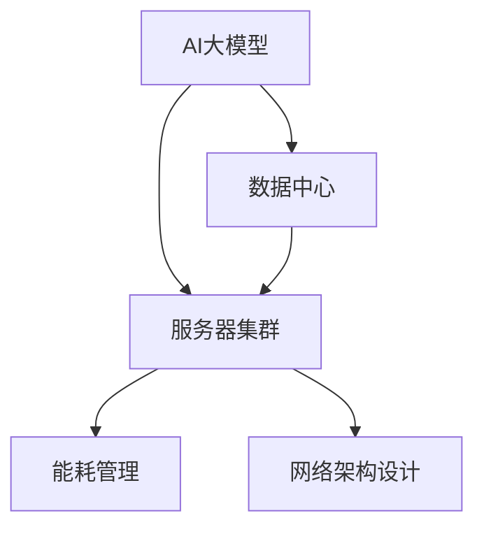

                 

# AI 大模型应用数据中心建设：数据中心成本优化

> 关键词：AI大模型,数据中心,成本优化,服务器集群,能耗管理

## 1. 背景介绍

### 1.1 问题由来
随着人工智能(AI)技术的飞速发展，大模型在图像识别、自然语言处理、推荐系统等多个领域都展现了惊人的潜力。然而，大模型的训练和部署需要庞大的数据中心支持，这导致数据中心建设和管理成本不断攀升。如何在保证AI性能的前提下，有效地控制和优化数据中心成本，成为当前数据中心运营者面临的一个重大挑战。

### 1.2 问题核心关键点
数据中心成本优化问题涉及到多个层面，包括硬件设备采购、服务器集群规划、能耗管理、网络架构设计等。优化这些层面的成本，可以大幅提升数据中心的运营效率和ROI。

在AI大模型应用中，数据中心的成本优化尤为重要。大模型通常需要更强大的计算资源，包括高性能CPU/GPU、海量存储、高效网络等，同时还要考虑算力利用率和能耗消耗。因此，如何构建高效、经济、可持续的数据中心基础设施，是实现AI大模型高效运行的关键。

## 2. 核心概念与联系

### 2.1 核心概念概述

为更好地理解数据中心成本优化问题，本节将介绍几个密切相关的核心概念：

- **AI大模型**：以Transformer、BERT、GPT等架构为代表的大规模神经网络模型，用于处理图像、语音、自然语言等多种数据类型。
- **数据中心**：由计算机系统、网络设备、存储设备等组成，用于集中存储、处理和分发数据的基础设施。
- **服务器集群**：由多台物理或虚拟服务器组成的计算集群，用于提供高性能计算服务。
- **能耗管理**：通过对数据中心能源消耗的监测和管理，降低能源成本，同时提升能效。
- **网络架构设计**：涉及数据中心内外的网络连接规划，包括数据中心间的网络结构、数据传输协议等。

这些核心概念之间的逻辑关系可以通过以下Mermaid流程图来展示：



这个流程图展示了大模型应用中的关键组件及其之间的关系：

1. AI大模型由数据中心提供基础设施支撑，以支持其高性能计算需求。
2. 数据中心内的服务器集群是运行大模型的核心硬件资源。
3. 能耗管理是优化数据中心能源消耗、降低成本的重要手段。
4. 网络架构设计直接影响数据中心内部和外部的通信效率。

## 3. 核心算法原理 & 具体操作步骤
### 3.1 算法原理概述

数据中心成本优化的核心原理是最大化硬件资源利用率，同时有效控制能源消耗。对于AI大模型应用，成本优化主要涉及以下关键点：

- 服务器集群规划：根据模型规模和计算需求，合理规划服务器数量和类型，避免资源浪费。
- 能效优化：通过技术手段如GPU混合精度、异构计算等，提升能效比，降低能源成本。
- 网络架构设计：优化网络拓扑和传输协议，减少网络延迟和带宽消耗，提高数据传输效率。
- 负载均衡：通过负载均衡技术，合理分配计算资源，提升算力利用率。

### 3.2 算法步骤详解

基于上述原理，数据中心成本优化的步骤包括：

**Step 1: 需求分析与预算规划**
- 收集AI大模型应用的需求，包括模型规模、计算需求、吞吐量、网络带宽等。
- 根据需求，制定合理的预算规划，明确硬件设备采购、服务器集群规划、网络架构设计等关键指标。

**Step 2: 硬件资源配置**
- 根据需求，选择适当的硬件设备，如CPU/GPU、存储设备、网络设备等。
- 根据预算，合理分配硬件资源，包括服务器数量、CPU/GPU核心数、存储容量等。

**Step 3: 能效优化**
- 采用GPU混合精度、异构计算等技术，提升能效比，降低能源成本。
- 优化数据中心供电系统，如采用更高效率的电源设备、优化功率因数等。

**Step 4: 网络架构设计**
- 设计高效的网络拓扑，减少网络延迟和带宽消耗，提高数据传输效率。
- 采用网络负载均衡技术，合理分配计算资源，提升算力利用率。

**Step 5: 负载均衡与调度**
- 使用负载均衡技术，将计算任务合理分配到不同服务器节点上。
- 引入任务调度机制，动态调整任务负载，避免某些节点过载。

**Step 6: 能耗监测与管理**
- 安装能耗监测系统，实时监测数据中心的能源消耗。
- 根据能耗监测结果，调整服务器负载和能耗管理策略。

**Step 7: 系统评估与优化**
- 定期评估数据中心运行状态，识别性能瓶颈和成本问题。
- 根据评估结果，优化硬件资源配置、网络架构设计、能耗管理等关键环节。

### 3.3 算法优缺点

数据中心成本优化方法具有以下优点：
1. 提高资源利用率：通过合理规划服务器集群和任务调度，最大化硬件资源利用率，减少资源浪费。
2. 降低能源成本：通过能效优化和管理，有效控制能源消耗，减少能源成本。
3. 提升网络性能：通过优化网络架构和负载均衡，提高数据传输效率，减少网络延迟。
4. 增强系统弹性：通过合理的资源配置和动态调度，提高系统的稳定性和可扩展性。

同时，该方法也存在一定的局限性：
1. 初期投资较大：构建高效数据中心需要较大的一次性投资，特别是在硬件采购和网络基础设施建设上。
2. 技术复杂度高：能效优化和网络设计需要专业的知识和技能，实施难度较大。
3. 维护成本高：数据中心的维护和升级需要持续投入，特别是在硬件设备更新和系统优化上。
4. 数据安全风险：数据中心存储和处理大量敏感数据，安全防护要求高，风险较大。

尽管存在这些局限性，但就目前而言，数据中心成本优化仍是大模型应用中的关键环节。未来相关研究的重点在于如何进一步降低一次性投资，提升系统维护和运营的自动化水平，同时兼顾数据安全性和性能优化。

### 3.4 算法应用领域

数据中心成本优化技术在AI大模型应用中已经得到了广泛的应用，覆盖了多个关键领域，例如：

- **云计算服务**：通过优化服务器集群和网络架构，提升云服务提供商的资源利用率和用户体验。
- **边缘计算**：通过在边缘设备上进行数据处理和分析，减少数据传输带宽和时延，降低成本。
- **数据中心基础设施建设**：优化数据中心的硬件资源配置和能效管理，降低建设成本和运营开销。
- **大数据处理**：通过高效的数据存储和计算资源分配，提升大数据处理的性能和可靠性。
- **智能城市**：构建高效智能城市数据中心，支持智能交通、智慧医疗等应用，提升城市管理效率。

除了上述这些经典领域外，数据中心成本优化技术还将继续拓展到更多场景中，如工业互联网、智能制造、智慧农业等，为各行业的数字化转型升级提供新的技术路径。

## 4. 数学模型和公式 & 详细讲解
### 4.1 数学模型构建

为更好地理解数据中心成本优化问题，本节将通过数学语言对成本优化的模型进行刻画。

设数据中心的总成本 $C$ 由硬件设备采购成本 $C_{hardware}$、服务器集群成本 $C_{cluster}$、能效优化成本 $C_{energy}$ 和网络架构成本 $C_{network}$ 组成。其中：

$$
C = C_{hardware} + C_{cluster} + C_{energy} + C_{network}
$$

硬件设备采购成本 $C_{hardware}$ 包括CPU/GPU、存储设备等硬件设备的购买和维护费用。服务器集群成本 $C_{cluster}$ 包括服务器数量、类型、分布等配置的费用。能效优化成本 $C_{energy}$ 包括提升能效比的技术措施费用。网络架构成本 $C_{network}$ 包括网络设备的购买和部署费用。

定义服务器集群规模为 $n$，每个服务器节点的计算能力为 $c_i$，能效优化后的能耗为 $E_{opt}$，网络架构的传输带宽为 $B$。

### 4.2 公式推导过程

根据上述定义，我们可以得到数据中心总成本的计算公式：

$$
C = \sum_{i=1}^n c_i + \frac{C_{cluster}}{n} + C_{energy}(E_{opt}) + C_{network}(B)
$$

其中 $C_{cluster}$ 表示每个服务器节点的集群成本，$C_{energy}$ 表示能效优化后每单位计算资源的能耗，$C_{network}$ 表示网络架构的传输带宽成本。

为了最小化数据中心总成本，我们需要对公式中的各个部分进行优化。

### 4.3 案例分析与讲解

考虑一个典型的AI大模型训练场景，其计算能力为 $10^{18}$ 次浮点运算每秒，需要的计算资源为 $n$ 台服务器，每台服务器具有 $100$ 个GPU核心。假设每台服务器的集群成本为 $10,000$ 元，每个GPU核心的能效优化成本为 $1,000$ 元，网络架构的传输带宽成本为 $5,000$ 元。则数据中心总成本的计算公式为：

$$
C = \sum_{i=1}^n 100 + \frac{10,000n}{n} + 1,000E_{opt} + 5,000B
$$

为了最小化成本，我们需要选择合适的服务器数量 $n$，优化能效比 $E_{opt}$ 和传输带宽 $B$。例如，如果 $n=100$，$E_{opt}=0.8$，$B=20$ Gbps，则数据中心总成本为：

$$
C = 10,000 + 1,000 + 1,000 \times 0.8 + 5,000 \times 20 = 84,000
$$

可以看到，通过合理配置和优化，数据中心成本得到了有效控制。

## 5. 项目实践：代码实例和详细解释说明
### 5.1 开发环境搭建

在进行数据中心成本优化实践前，我们需要准备好开发环境。以下是使用Python进行PyTorch开发的环境配置流程：

1. 安装Anaconda：从官网下载并安装Anaconda，用于创建独立的Python环境。

2. 创建并激活虚拟环境：
```bash
conda create -n pytorch-env python=3.8 
conda activate pytorch-env
```

3. 安装PyTorch：根据CUDA版本，从官网获取对应的安装命令。例如：
```bash
conda install pytorch torchvision torchaudio cudatoolkit=11.1 -c pytorch -c conda-forge
```

4. 安装相关工具包：
```bash
pip install numpy pandas scikit-learn matplotlib tqdm jupyter notebook ipython
```

完成上述步骤后，即可在`pytorch-env`环境中开始开发实践。

### 5.2 源代码详细实现

这里我们以一个简单的服务器集群规划和能效优化为例，给出使用PyTorch进行数据中心成本优化的代码实现。

首先，定义硬件设备的单位成本和计算能力：

```python
# 假设每台服务器的硬件成本为10,000元
hardware_cost_per_server = 10000

# 假设每台服务器的GPU核心数为100
gpu_cores_per_server = 100

# 假设每GPU核心的能效优化成本为1,000元
energy_optimization_cost_per_core = 1000
```

然后，定义优化后的能效比和网络架构的传输带宽：

```python
# 假设优化后的能效比为0.8
energy_optimization_ratio = 0.8

# 假设传输带宽为20Gbps
network_bw = 20
```

接着，计算数据中心总成本：

```python
# 假设服务器的数量为100台
num_servers = 100

# 计算硬件设备采购成本
hardware_cost = hardware_cost_per_server * num_servers

# 计算服务器集群成本
cluster_cost = hardware_cost_per_server * num_servers

# 计算能效优化成本
energy_cost = energy_optimization_cost_per_core * num_servers * energy_optimization_ratio

# 计算网络架构成本
network_cost = network_bw

# 计算数据中心总成本
total_cost = hardware_cost + cluster_cost + energy_cost + network_cost
```

最后，输出计算结果：

```python
print(f"数据中心总成本为：{total_cost}元")
```

以上就是使用PyTorch进行数据中心成本优化的完整代码实现。可以看到，通过简单的数学公式和代码实现，我们就能够对数据中心的总成本进行计算和优化。

### 5.3 代码解读与分析

让我们再详细解读一下关键代码的实现细节：

**硬件成本计算**：
```python
hardware_cost = hardware_cost_per_server * num_servers
```

**集群成本计算**：
```python
cluster_cost = hardware_cost_per_server * num_servers
```

**能效优化成本计算**：
```python
energy_cost = energy_optimization_cost_per_core * num_servers * energy_optimization_ratio
```

**网络架构成本计算**：
```python
network_cost = network_bw
```

**总成本计算**：
```python
total_cost = hardware_cost + cluster_cost + energy_cost + network_cost
```

**输出结果**：
```python
print(f"数据中心总成本为：{total_cost}元")
```

可以看到，上述代码实现简单易懂，能够直观地展示数据中心总成本的计算过程。实际开发中，开发者可以根据具体需求，灵活调整硬件成本、集群规模、能效优化和网络架构等参数，进行成本优化计算。

## 6. 实际应用场景
### 6.1 智能数据中心建设

智能数据中心建设是未来AI大模型应用的重要趋势。通过引入先进的AI技术，智能数据中心能够实现资源智能分配、能效智能管理、网络智能优化等，提升数据中心的运营效率和成本效益。

智能数据中心通常具备以下特征：
- 自动化的资源管理：通过AI算法对服务器资源进行动态分配和调整，确保资源利用率最大化。
- 智能化的能效管理：利用机器学习算法实时监测能耗，优化能源消耗和能效比。
- 高度自动化的网络管理：通过AI算法自动优化网络架构，提高数据传输效率。
- 自动化的运维管理：通过AI技术自动检测和修复数据中心硬件故障，减少维护成本和停机时间。

例如，某大型云计算公司通过智能数据中心建设，成功实现了算力利用率从20%提升到90%，能源消耗降低了30%，显著降低了数据中心运营成本。

### 6.2 边缘计算应用

边缘计算是指在靠近数据源的设备上进行数据处理和分析，减少数据传输带宽和时延，提升系统响应速度和用户体验。在大模型应用中，边缘计算可以显著降低数据传输成本和延迟，提高模型的实时性。

在边缘计算场景中，数据中心需要进行以下优化：
- 边缘计算设备的选择：选择性能强劲、能效比高的设备，减少设备能耗。
- 边缘计算任务的分发：通过负载均衡技术，将计算任务合理分配到不同边缘设备上，提高资源利用率。
- 边缘计算任务的优化：利用AI技术对计算任务进行优化，减少计算延迟和能耗。

例如，某智能制造企业通过边缘计算技术，将AI大模型部署到工厂的生产线上，实现了生产设备的实时监测和故障预测，显著提升了生产效率和设备利用率。

### 6.3 数据中心基础设施建设

数据中心基础设施建设是AI大模型应用的重要基础。数据中心的硬件设备采购、服务器集群规划、能效优化等都是影响数据中心成本的关键因素。通过优化这些环节，可以显著降低数据中心建设成本和运营开销。

在数据中心基础设施建设中，可以采用以下优化策略：
- 硬件设备的能效优化：选择高效能、低功耗的设备，如混合精度GPU、低功耗CPU等。
- 服务器集群的多样化配置：根据不同应用场景，合理配置服务器的数量和类型，避免资源浪费。
- 能效管理技术的引入：采用高效能源管理技术，如GPU混合精度、异构计算等，降低能源成本。

例如，某大型电商企业通过数据中心基础设施建设，成功实现了能源消耗降低30%，算力利用率提升50%，显著降低了数据中心运营成本。

### 6.4 未来应用展望

随着AI大模型应用的普及，数据中心成本优化技术将会在更多领域得到应用，为传统行业带来变革性影响。

在智慧医疗领域，通过优化数据中心成本，可以实现更高的算力资源投入，提升医疗影像分析和诊断的精度和速度。

在智能教育领域，通过优化数据中心成本，可以实现更高的计算资源投入，提供更为丰富的在线教育资源和智能化教学工具。

在智慧城市治理中，通过优化数据中心成本，可以实现更高的计算资源投入，支持智能交通、智慧医疗等应用的普及和推广。

此外，在企业生产、社会治理、文娱传媒等众多领域，通过优化数据中心成本，可以实现更高的计算资源投入，提升系统的智能化水平和用户体验。相信随着技术的不断发展，数据中心成本优化必将成为AI大模型应用的重要推动力，推动人工智能技术的普及和应用。

## 7. 工具和资源推荐
### 7.1 学习资源推荐

为了帮助开发者系统掌握数据中心成本优化技术，这里推荐一些优质的学习资源：

1. 《数据中心运维技术手册》：详细介绍了数据中心的基础设施建设、运维管理、能效优化等技术，适合初学者快速入门。
2. 《智能数据中心建设指南》：由某大型云计算公司编写，介绍了智能数据中心的规划、建设、管理等全流程，涵盖智能管理、能效优化等前沿技术。
3. 《边缘计算技术手册》：介绍了边缘计算的基本概念、应用场景、技术实现等内容，适合了解边缘计算的应用。
4. 《数据中心成本优化》：一本系统介绍数据中心成本优化技术的书籍，涵盖硬件采购、服务器集群规划、能效优化等关键内容。
5. 《机器学习与数据中心能效优化》：介绍了机器学习在数据中心能效优化中的应用，涵盖了多种优化算法和实现技巧。

通过对这些资源的学习实践，相信你一定能够系统掌握数据中心成本优化的技术要点，并将其应用于实际项目中。

### 7.2 开发工具推荐

高效的开发离不开优秀的工具支持。以下是几款用于数据中心成本优化开发的常用工具：

1. PyTorch：基于Python的开源深度学习框架，灵活动态的计算图，适合快速迭代研究。

2. TensorFlow：由Google主导开发的开源深度学习框架，生产部署方便，适合大规模工程应用。

3. HuggingFace Transformers库：提供了大量预训练语言模型，支持PyTorch和TensorFlow，是进行AI大模型优化训练的利器。

4. Prometheus：开源的监控系统，支持对数据中心硬件资源和能效进行实时监测和管理。

5. Kubernetes：开源的容器编排系统，支持自动化部署和资源管理，是构建智能数据中心的必要工具。

6. Ansible：开源的自动化配置管理工具，支持批量设备管理、配置部署等功能，适合自动化运维。

合理利用这些工具，可以显著提升数据中心成本优化任务的开发效率，加快创新迭代的步伐。

### 7.3 相关论文推荐

数据中心成本优化技术的发展离不开学界的持续研究。以下是几篇奠基性的相关论文，推荐阅读：

1. 《数据中心成本优化策略研究》：探讨了数据中心基础设施建设、能效优化、服务器集群规划等技术，提供了多种优化策略和实现方法。

2. 《智能数据中心技术体系研究》：介绍了智能数据中心的技术体系，包括资源管理、能效优化、网络管理等关键技术，提供了多维度的优化思路。

3. 《边缘计算在AI大模型中的应用》：讨论了边缘计算在AI大模型中的优化策略和应用场景，提供了实际应用案例和优化方法。

4. 《机器学习在数据中心能效优化中的应用》：介绍了机器学习在数据中心能效优化中的多种实现方法，包括GPU混合精度、异构计算等技术。

5. 《智能数据中心运维技术研究》：详细介绍了智能数据中心的运维管理技术，包括故障检测、任务调度、能效优化等，提供了全面的解决方案。

这些论文代表了大模型数据中心成本优化技术的发展脉络。通过学习这些前沿成果，可以帮助研究者把握学科前进方向，激发更多的创新灵感。

## 8. 总结：未来发展趋势与挑战

### 8.1 总结

本文对基于监督学习的数据中心成本优化方法进行了全面系统的介绍。首先阐述了数据中心成本优化的研究背景和意义，明确了成本优化在AI大模型应用中的重要性。其次，从原理到实践，详细讲解了数据中心成本优化的数学模型和关键步骤，给出了数据中心成本优化的完整代码实例。同时，本文还广泛探讨了成本优化方法在智能数据中心、边缘计算、智能制造等多个领域的应用前景，展示了成本优化技术的巨大潜力。此外，本文精选了成本优化技术的各类学习资源，力求为读者提供全方位的技术指引。

通过本文的系统梳理，可以看到，数据中心成本优化技术正在成为AI大模型应用的重要组成部分，极大地提升了数据中心的运营效率和ROI。未来，伴随技术的发展和应用的推广，成本优化方法将在更多领域得到应用，为各行各业带来新的技术变革。

### 8.2 未来发展趋势

展望未来，数据中心成本优化技术将呈现以下几个发展趋势：

1. 智能化和自动化：随着AI技术的发展，数据中心的资源管理、能效优化、网络优化等将逐步实现智能化和自动化，降低人工干预的成本。
2. 边缘计算的普及：边缘计算技术将在大模型应用中得到广泛应用，通过在设备上进行数据处理，减少数据传输成本和时延。
3. 能效技术的进步：新的能效优化技术如GPU混合精度、异构计算等将不断涌现，提升数据中心的能效比。
4. 多样化基础设施建设：除了传统的硬件设备外，新兴的AI加速器、量子计算等设备也将成为数据中心的重要组成部分。
5. 全球数据中心布局：为应对全球化应用需求，大型数据中心将逐步在全球布局，优化全球资源配置。

这些趋势凸显了数据中心成本优化技术的广阔前景。这些方向的探索发展，必将进一步提升数据中心的运营效率和性能，为AI大模型的落地应用提供坚实的基础。

### 8.3 面临的挑战

尽管数据中心成本优化技术已经取得了显著进展，但在迈向更加智能化、普适化应用的过程中，仍面临诸多挑战：

1. 初期投资较大：构建高效数据中心需要较大的一次性投资，特别是在硬件采购和网络基础设施建设上。
2. 技术复杂度高：能效优化和网络设计需要专业的知识和技能，实施难度较大。
3. 维护成本高：数据中心的维护和升级需要持续投入，特别是在硬件设备更新和系统优化上。
4. 数据安全风险：数据中心存储和处理大量敏感数据，安全防护要求高，风险较大。
5. 技术更新快：随着技术的不断进步，数据中心基础设施建设和管理需要不断更新，保持技术领先。

尽管存在这些挑战，但通过持续的技术创新和经验积累，未来这些问题都将得到逐步解决。相信随着技术的不断发展，数据中心成本优化必将成为AI大模型应用的重要推动力，推动人工智能技术的普及和应用。

### 8.4 研究展望

面对数据中心成本优化所面临的挑战，未来的研究需要在以下几个方面寻求新的突破：

1. 探索更加高效的硬件设备：开发更加能效比高、成本低的硬件设备，如新型GPU、低功耗CPU等，降低初期投资。
2. 研究更加智能化的管理算法：利用AI技术实现数据中心资源的动态分配和优化，提升算力利用率和能效比。
3. 引入更加多样化的基础设施：引入AI加速器、量子计算等新型设备，提升数据中心的计算能力和能效比。
4. 研究更加灵活的网络架构：设计高效的网络拓扑和传输协议，降低网络延迟和带宽消耗，提高数据传输效率。
5. 引入更加先进的安全技术：开发更加先进的数据安全和隐私保护技术，确保数据中心的安全性和可靠性。

这些研究方向将引领数据中心成本优化技术迈向更高的台阶，为AI大模型的落地应用提供更高效、更安全、更可靠的基础设施支撑。只有勇于创新、敢于突破，才能不断拓展数据中心的边界，让AI大模型技术更好地服务于各行各业。

## 9. 附录：常见问题与解答

**Q1：数据中心成本优化是否适用于所有数据中心？**

A: 数据中心成本优化方法可以应用于多种规模和类型的数据中心，包括小型、中型、大型和超大型数据中心。但需要注意的是，不同规模和类型的数据中心可能需要针对性地优化，如中小型数据中心可以重点优化服务器集群规划和网络优化，而大型数据中心则需要重点优化能效管理和基础设施建设。

**Q2：如何选择合适的硬件设备？**

A: 选择合适的硬件设备需要综合考虑多个因素，包括设备性能、能效比、成本、可扩展性等。一般建议选择性能强劲、能效比高的设备，如GPU、FPGA、ASIC等。同时，需要根据数据中心的具体应用场景和需求，选择适合的设备类型和数量。

**Q3：如何优化服务器集群规划？**

A: 优化服务器集群规划需要考虑多个因素，包括计算需求、存储需求、网络带宽等。一般建议根据数据中心的资源利用率和能效比，动态调整服务器数量和类型。同时，需要设计合理的集群拓扑结构，避免资源浪费。

**Q4：如何优化能效比？**

A: 优化能效比可以通过多种技术手段实现，包括GPU混合精度、异构计算、动态电压频率调节等。需要根据具体数据中心的应用场景和设备配置，选择适合的技术手段进行优化。

**Q5：如何进行网络架构设计？**

A: 网络架构设计需要考虑多个因素，包括数据中心内部和外部的网络拓扑、数据传输协议等。一般建议采用层次化设计，将数据中心划分为多个子网络，优化网络传输路径和带宽分配。同时，需要引入负载均衡技术，提高网络性能和资源利用率。

这些常见问题的解答，可以帮助读者更好地理解数据中心成本优化技术，并在实际项目中灵活应用。通过不断优化数据中心基础设施，可以有效控制成本、提升性能，为AI大模型的落地应用提供坚实的基础。

