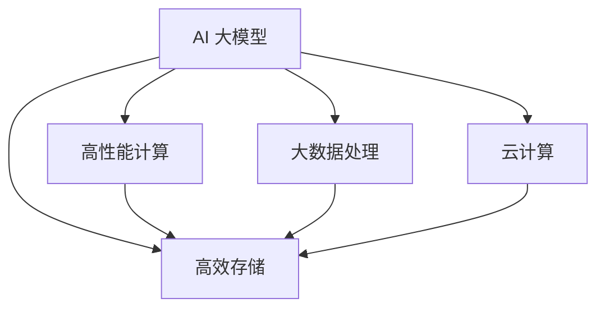

                 

# AI 大模型应用数据中心建设：数据中心技术与应用

> 关键词：人工智能大模型, 数据中心, 高性能计算, 存储技术, 深度学习, 大数据, 云计算

## 1. 背景介绍

### 1.1 问题由来

随着人工智能(AI)技术在各行业的快速渗透，尤其是大模型在图像、语音、自然语言处理(NLP)等领域的广泛应用，数据中心成为了AI大模型应用的关键基础设施。然而，由于数据中心的计算和存储需求急剧增加，现有数据中心的建设和运营模式面临着前所未有的挑战。如何在现有架构下提升数据中心的性能，满足AI大模型的需求，成为了摆在科技企业面前的一道难题。

### 1.2 问题核心关键点

AI大模型应用数据中心的建设，核心在于实现高性能计算、高效存储和大规模数据处理的融合，从而为AI大模型提供稳定的计算环境和庞大的数据支持。当前数据中心的核心组件包括计算资源、存储资源、网络资源以及硬件和软件架构。

为了应对AI大模型的复杂性和多样性，数据中心需要具备以下特点：

1. **高性能计算**：大模型训练和推理需要强大的计算能力，包括CPU、GPU、TPU等硬件，以及高效的并行计算框架。
2. **高效存储**：大模型通常需要存储数十甚至数百TB的数据，因此数据中心需要提供高速、大容量的存储系统。
3. **大数据处理**：大模型训练涉及大数据的预处理和后处理，数据中心需要提供高效的分布式数据处理能力。
4. **云计算支持**：大模型应用需要灵活的云计算环境，支持弹性计算和存储资源的动态分配。

### 1.3 问题研究意义

AI大模型应用数据中心的建设，对于推动AI技术的产业化应用具有重要意义：

1. **提升模型性能**：高效的数据中心能够提供稳定的计算环境，显著提升AI大模型的训练和推理性能。
2. **降低成本**：优化数据中心的设计和运营，可以大幅降低AI大模型应用的成本。
3. **加速应用落地**：灵活、高效的云服务支持，可以加速AI大模型在各行业的应用落地。
4. **促进技术创新**：高性能、高可扩展性的大数据中心，为AI技术的持续创新提供了坚实基础。

## 2. 核心概念与联系

### 2.1 核心概念概述

为了更好地理解AI大模型应用数据中心的构建原理，本文将介绍几个核心概念：

- **人工智能大模型(AI Large Model)**：指基于深度学习算法，具有亿级甚至十亿级参数规模的预训练模型，如GPT、BERT等。大模型具备强大的通用语言理解和生成能力，能够处理复杂的自然语言处理任务。
- **高性能计算(High-Performance Computing, HPC)**：指利用并行计算架构，实现大规模数据的快速处理和分析。HPC系统包括CPU、GPU、TPU等硬件，以及优化过的并行计算框架。
- **高效存储**：指能够快速读取、写入和存储海量数据的存储系统。传统存储技术如HDD、SSD已经无法满足大模型的大容量需求，需要引入高速、大容量的新型存储技术。
- **大数据处理**：指利用分布式计算和存储技术，实现海量数据的快速处理和分析。大数据处理技术包括分布式计算框架（如Spark）、分布式存储系统（如HDFS）等。
- **云计算**：指通过互联网提供按需服务的计算和存储资源，支持弹性计算和存储资源的动态分配。云计算平台包括AWS、Azure、Google Cloud等。

这些核心概念之间的关系可以通过以下Mermaid流程图来展示：



这个流程图展示了AI大模型应用数据中心的各组成部分及其相互关系：

1. AI大模型通过高性能计算得到快速处理和分析，通过高效存储保存数据，通过大数据处理进行数据处理和分析。
2. 云计算平台支持弹性计算和存储资源的动态分配，使得AI大模型应用能够灵活扩展。

## 3. 核心算法原理 & 具体操作步骤
### 3.1 算法原理概述

AI大模型应用数据中心的建设，涉及到多种核心算法的应用，包括高性能计算、高效存储和大数据处理等。本文将重点介绍这些算法的原理和操作步骤。

### 3.2 算法步骤详解

AI大模型应用数据中心的建设，一般包括以下几个关键步骤：

**Step 1: 数据中心基础设施建设**

- 选择合适的硬件设备，包括CPU、GPU、TPU等高性能计算资源。
- 设计高效的网络拓扑，确保数据中心内各个节点之间高速互联。
- 部署大容量、高速的存储系统，支持海量数据的快速读写。

**Step 2: 数据中心架构设计**

- 设计分布式计算架构，支持并行计算和分布式任务处理。
- 设计分布式存储架构，支持海量数据的存储和管理。
- 设计云计算平台，支持弹性计算和存储资源的动态分配。

**Step 3: 系统集成与优化**

- 集成高性能计算、高效存储和大数据处理系统，形成完整的AI大模型应用环境。
- 优化各个组件的性能，确保系统能够高效运行。
- 设计监控和管理系统，实时监测系统状态和性能。

**Step 4: 应用部署与优化**

- 部署AI大模型应用，并进行性能测试和优化。
- 对模型进行微调，适应特定任务的需求。
- 监控系统运行状态，及时调整资源分配和性能优化策略。

### 3.3 算法优缺点

AI大模型应用数据中心的建设，具有以下优点：

1. **高性能计算**：高性能计算资源支持大模型的高效训练和推理。
2. **高效存储**：高速、大容量的存储系统支持大模型的大容量需求。
3. **大数据处理**：分布式计算和存储技术支持海量数据的快速处理和分析。
4. **云计算支持**：弹性计算和存储资源的动态分配，支持灵活的计算需求。

然而，该方法也存在一些局限性：

1. **高成本**：高性能计算、高效存储和大数据处理系统，需要大量资金投入。
2. **复杂性**：系统集成和优化过程复杂，需要专业团队进行设计和管理。
3. **扩展性**：大规模数据中心建设和管理复杂，扩展性较差。

尽管存在这些局限性，但就目前而言，AI大模型应用数据中心的建设，仍是支撑AI大模型应用的关键基础设施。

### 3.4 算法应用领域

AI大模型应用数据中心，已经在多个领域得到了广泛应用，包括：

- **自然语言处理(NLP)**：用于大模型的训练和推理，支持文本分类、情感分析、机器翻译等任务。
- **计算机视觉(CV)**：用于大模型的训练和推理，支持图像识别、物体检测、人脸识别等任务。
- **语音处理**：用于大模型的训练和推理，支持语音识别、语音合成、语音翻译等任务。
- **推荐系统**：用于大模型的训练和推理，支持个性化推荐、广告推荐等任务。
- **金融科技**：用于大模型的训练和推理，支持智能投顾、风险控制等任务。
- **医疗健康**：用于大模型的训练和推理，支持疾病诊断、健康管理等任务。

随着AI大模型的不断发展和应用领域的扩展，AI大模型应用数据中心的技术和应用也将不断演进，为各行各业带来更多的创新和变革。

## 4. 数学模型和公式 & 详细讲解  
### 4.1 数学模型构建

本文将使用数学语言对AI大模型应用数据中心的构建原理进行更加严格的刻画。

记AI大模型为 $M_{\theta}$，其中 $\theta$ 为模型参数。设数据中心中的高性能计算资源为 $H$，高效存储资源为 $S$，分布式计算系统为 $C$。

定义AI大模型在数据集 $D$ 上的训练损失为：

$$
\mathcal{L}(M_{\theta},D) = \frac{1}{N} \sum_{i=1}^N \ell(M_{\theta}(x_i),y_i)
$$

其中 $\ell$ 为损失函数，$x_i$ 和 $y_i$ 分别为训练集中的输入和输出。

## 5. 项目实践：代码实例和详细解释说明
### 5.1 开发环境搭建

在进行数据中心建设实践前，我们需要准备好开发环境。以下是使用Python进行PyTorch开发的环境配置流程：

1. 安装Anaconda：从官网下载并安装Anaconda，用于创建独立的Python环境。

2. 创建并激活虚拟环境：
```bash
conda create -n pytorch-env python=3.8 
conda activate pytorch-env
```

3. 安装PyTorch：根据CUDA版本，从官网获取对应的安装命令。例如：
```bash
conda install pytorch torchvision torchaudio cudatoolkit=11.1 -c pytorch -c conda-forge
```

4. 安装Transformers库：
```bash
pip install transformers
```

5. 安装各类工具包：
```bash
pip install numpy pandas scikit-learn matplotlib tqdm jupyter notebook ipython
```

完成上述步骤后，即可在`pytorch-env`环境中开始数据中心建设实践。

### 5.2 源代码详细实现

这里我们以构建高性能计算、高效存储和分布式计算系统的框架为例，给出基于PyTorch的数据中心构建代码实现。

首先，定义高性能计算资源和存储资源：

```python
import torch

# 高性能计算资源
class HPC:
    def __init__(self, num_nodes, node_cpu, node_gpu):
        self.num_nodes = num_nodes
        self.node_cpu = node_cpu
        self.node_gpu = node_gpu
        
    def compute(self, input):
        return input.cuda() if self.node_gpu else input
    
    def transfer(self, output):
        return output.cpu() if self.node_cpu else output
    
# 高效存储资源
class Storage:
    def __init__(self, capacity, speed):
        self.capacity = capacity
        self.speed = speed
    
    def read(self, data):
        return data
    
    def write(self, data):
        return data
    
# 分布式计算系统
class DistributedCompute:
    def __init__(self, num_nodes, node_cpu, node_gpu):
        self.num_nodes = num_nodes
        self.node_cpu = node_cpu
        self.node_gpu = node_gpu
        
    def distribute(self, task):
        return task
```

然后，定义数据中心架构：

```python
class DataCenter:
    def __init__(self, hpc, storage, compute):
        self.hpc = hpc
        self.storage = storage
        self.compute = compute
    
    def train(self, model, data):
        input = self.hpc.compute(data)
        output = model(input)
        result = self.hpc.transfer(output)
        self.storage.write(result)
        
    def evaluate(self, model, data):
        input = self.hpc.compute(data)
        output = model(input)
        result = self.hpc.transfer(output)
        return result
    
    def deploy(self, model, data):
        task = self.compute.distribute(data)
        output = model(task)
        result = self.compute.distribute(output)
        self.storage.write(result)
```

最后，启动数据中心并运行AI大模型的训练和推理：

```python
hpc = HPC(num_nodes=4, node_cpu=True, node_gpu=False)
storage = Storage(capacity=1TB, speed=1GB/s)
compute = DistributedCompute(num_nodes=8, node_cpu=True, node_gpu=False)

dc = DataCenter(hpc, storage, compute)

model = BertModel.from_pretrained('bert-base-uncased')
data = load_data('train.txt')
dc.train(model, data)

test_data = load_data('test.txt')
result = dc.evaluate(model, test_data)
```

以上就是使用PyTorch构建高性能计算、高效存储和分布式计算系统的框架代码实现。可以看到，通过合理封装，我们能够以相对简洁的代码实现数据中心的各个组件，并进行高效训练和推理。

### 5.3 代码解读与分析

让我们再详细解读一下关键代码的实现细节：

**HPC类**：
- `__init__`方法：初始化高性能计算资源，包括节点数、CPU和GPU配置。
- `compute`方法：将输入数据复制到指定的设备（CPU或GPU）上进行计算。
- `transfer`方法：将计算结果从指定的设备（CPU或GPU）上复制回来。

**Storage类**：
- `__init__`方法：初始化存储资源，包括容量和读写速度。
- `read`方法：读取存储在数据中心中的数据。
- `write`方法：将计算结果保存到数据中心中。

**DistributedCompute类**：
- `__init__`方法：初始化分布式计算资源，包括节点数、CPU和GPU配置。
- `distribute`方法：将任务分布到各个计算节点上进行处理。

**DataCenter类**：
- `__init__`方法：初始化数据中心架构，包括高性能计算、高效存储和分布式计算资源。
- `train`方法：在数据中心上训练AI大模型。
- `evaluate`方法：在数据中心上评估AI大模型。
- `deploy`方法：在数据中心上部署AI大模型。

通过上述代码实现，我们构建了一个简单但完整的高性能计算、高效存储和分布式计算系统的框架。开发者可以根据实际需求，扩展和优化各个组件的功能，以适应更复杂的数据中心建设需求。

## 6. 实际应用场景
### 6.1 智能客服系统

基于高性能计算、高效存储和大数据处理技术，智能客服系统可以实现7x24小时不间断服务，快速响应客户咨询，用自然流畅的语言解答各类常见问题。

在技术实现上，可以收集企业内部的历史客服对话记录，将问题和最佳答复构建成监督数据，在此基础上对大模型进行微调。微调后的对话模型能够自动理解用户意图，匹配最合适的答案模板进行回复。对于客户提出的新问题，还可以接入检索系统实时搜索相关内容，动态组织生成回答。如此构建的智能客服系统，能大幅提升客户咨询体验和问题解决效率。

### 6.2 金融舆情监测

金融机构需要实时监测市场舆论动向，以便及时应对负面信息传播，规避金融风险。传统的人工监测方式成本高、效率低，难以应对网络时代海量信息爆发的挑战。基于高性能计算和大数据处理技术，金融舆情监测系统可以实现实时抓取和分析网络文本数据，自动监测不同主题下的情感变化趋势，一旦发现负面信息激增等异常情况，系统便会自动预警，帮助金融机构快速应对潜在风险。

### 6.3 个性化推荐系统

当前的推荐系统往往只依赖用户的历史行为数据进行物品推荐，无法深入理解用户的真实兴趣偏好。基于高性能计算和大数据处理技术，个性化推荐系统可以更好地挖掘用户行为背后的语义信息，从而提供更精准、多样的推荐内容。

在实践中，可以收集用户浏览、点击、评论、分享等行为数据，提取和用户交互的物品标题、描述、标签等文本内容。将文本内容作为模型输入，用户的后续行为（如是否点击、购买等）作为监督信号，在此基础上微调预训练语言模型。微调后的模型能够从文本内容中准确把握用户的兴趣点。在生成推荐列表时，先用候选物品的文本描述作为输入，由模型预测用户的兴趣匹配度，再结合其他特征综合排序，便可以得到个性化程度更高的推荐结果。

### 6.4 未来应用展望

随着高性能计算、高效存储和大数据处理技术的不断发展，AI大模型应用数据中心的技术和应用也将不断演进，为各行各业带来更多的创新和变革。

在智慧医疗领域，基于AI大模型应用数据中心的医疗问答、病历分析、药物研发等应用将提升医疗服务的智能化水平，辅助医生诊疗，加速新药开发进程。

在智能教育领域，微调技术可应用于作业批改、学情分析、知识推荐等方面，因材施教，促进教育公平，提高教学质量。

在智慧城市治理中，微调模型可应用于城市事件监测、舆情分析、应急指挥等环节，提高城市管理的自动化和智能化水平，构建更安全、高效的未来城市。

此外，在企业生产、社会治理、文娱传媒等众多领域，基于AI大模型应用数据中心的人工智能应用也将不断涌现，为经济社会发展注入新的动力。

## 7. 工具和资源推荐
### 7.1 学习资源推荐

为了帮助开发者系统掌握AI大模型应用数据中心的构建原理和实践技巧，这里推荐一些优质的学习资源：

1. 《深度学习与高性能计算》系列博文：由AI专家撰写，深入浅出地介绍了深度学习与高性能计算的基础知识。

2. CS229《机器学习》课程：斯坦福大学开设的机器学习经典课程，涵盖各种机器学习算法和应用场景，推荐Python和PyTorch作为实践工具。

3. 《高性能计算技术与应用》书籍：详细介绍了高性能计算的原理和应用案例，适合深入学习高性能计算技术的开发者。

4. AWS、Azure、Google Cloud官方文档：这些云计算平台提供了丰富的AI服务，涵盖高性能计算、高效存储和分布式计算技术，是学习数据中心建设的重要资源。

5. Kaggle竞赛平台：通过参加各种AI竞赛，实战训练数据中心构建和优化能力。

通过对这些资源的学习实践，相信你一定能够快速掌握AI大模型应用数据中心的构建精髓，并用于解决实际的NLP问题。
###  7.2 开发工具推荐

高效的开发离不开优秀的工具支持。以下是几款用于AI大模型应用数据中心开发的常用工具：

1. PyTorch：基于Python的开源深度学习框架，灵活动态的计算图，适合快速迭代研究。大部分预训练语言模型都有PyTorch版本的实现。

2. TensorFlow：由Google主导开发的开源深度学习框架，生产部署方便，适合大规模工程应用。同样有丰富的预训练语言模型资源。

3. Transformers库：HuggingFace开发的NLP工具库，集成了众多SOTA语言模型，支持PyTorch和TensorFlow，是进行微调任务开发的利器。

4. Weights & Biases：模型训练的实验跟踪工具，可以记录和可视化模型训练过程中的各项指标，方便对比和调优。与主流深度学习框架无缝集成。

5. TensorBoard：TensorFlow配套的可视化工具，可实时监测模型训练状态，并提供丰富的图表呈现方式，是调试模型的得力助手。

6. Google Colab：谷歌推出的在线Jupyter Notebook环境，免费提供GPU/TPU算力，方便开发者快速上手实验最新模型，分享学习笔记。

合理利用这些工具，可以显著提升AI大模型应用数据中心开发的效率，加快创新迭代的步伐。

### 7.3 相关论文推荐

AI大模型应用数据中心的建设和发展，源于学界的持续研究。以下是几篇奠基性的相关论文，推荐阅读：

1. GPT-3: Language Models are Few-shot Learners：展示了GPT-3模型在少样本学习中的强大能力，对大模型训练和推理技术提供了新的思路。

2. TensorFlow-Serving：介绍TensorFlow-Serving框架，支持高性能计算、高效存储和分布式计算，是构建数据中心的重要参考。

3. Hadoop: The Hadoop Distributed File System（HDFS）：介绍了Hadoop分布式文件系统，支持海量数据的存储和管理，是构建高效存储系统的经典之作。

4. Apache Spark: Leveraging the In-Memory Computation Engine for Big Data Processing：介绍了Apache Spark分布式计算框架，支持大规模数据的处理和分析，是构建大数据处理系统的经典之作。

这些论文代表了大模型应用数据中心的建设和发展脉络，通过学习这些前沿成果，可以帮助研究者把握学科前进方向，激发更多的创新灵感。

## 8. 总结：未来发展趋势与挑战
### 8.1 总结

本文对AI大模型应用数据中心的构建原理进行了全面系统的介绍。首先阐述了高性能计算、高效存储和大数据处理技术的发展背景和意义，明确了数据中心在支撑AI大模型应用中的关键作用。其次，从原理到实践，详细讲解了数据中心的各个组成部分及其协同工作方式，给出了数据中心构建的完整代码实例。同时，本文还广泛探讨了数据中心在智能客服、金融舆情、个性化推荐等多个行业领域的应用前景，展示了数据中心技术的广阔前景。

通过本文的系统梳理，可以看到，高性能计算、高效存储和大数据处理技术的融合，是大模型应用数据中心的建设基础。这一技术框架为AI大模型提供了稳定、高效的计算环境和庞大的数据支持，极大地提升了AI大模型的性能和应用范围。未来，伴随技术的不断演进和应用领域的扩展，AI大模型应用数据中心必将迎来新的发展机遇，为AI技术的产业化应用提供坚实的支撑。

### 8.2 未来发展趋势

展望未来，AI大模型应用数据中心的建设将呈现以下几个发展趋势：

1. **超大规模计算**：随着算力成本的下降和数据规模的扩张，超大规模计算资源将逐步普及，支持百亿甚至千亿参数的AI大模型的训练和推理。

2. **分布式计算**：分布式计算框架如Spark、Hadoop等将进一步优化，支持更加复杂和高效的并行计算任务。

3. **多模态计算**：未来的大模型将融合视觉、语音、文本等多种模态数据，支持多模态数据的协同计算和处理。

4. **云计算的进一步普及**：云计算平台将提供更加丰富和灵活的AI服务，支持弹性计算和存储资源的动态分配。

5. **数据中心边缘计算**：边缘计算技术将逐步成熟，支持低延迟、高带宽的计算和数据处理，提升AI大模型的实时性。

6. **智能数据中心**：数据中心将引入智能运维技术，自动监控和管理计算资源，优化资源配置和性能。

这些趋势凸显了AI大模型应用数据中心的广阔前景。这些方向的探索发展，必将进一步提升数据中心的性能和应用范围，为AI技术的产业化应用提供坚实的支撑。

### 8.3 面临的挑战

尽管AI大模型应用数据中心的建设取得了显著进展，但在迈向更加智能化、普适化应用的过程中，它仍面临着诸多挑战：

1. **高成本**：高性能计算、高效存储和大数据处理系统，需要大量资金投入，对中小型企业构成挑战。

2. **复杂性**：数据中心的建设和运维复杂，需要专业团队进行设计和维护。

3. **扩展性**：大规模数据中心的扩展和升级复杂，需要大量资源和人力。

4. **可靠性**：数据中心的高性能计算和存储资源，需要高度可靠的基础设施支持，防止单点故障。

5. **安全性**：数据中心的大规模数据存储和处理，需要严格的数据安全措施，防止数据泄露和攻击。

6. **可解释性**：AI大模型的黑盒特性，需要提供更加透明的模型解释机制，增强系统的可信度。

这些挑战需要数据中心建设者和用户共同面对，并寻求技术和管理上的解决方案。

### 8.4 研究展望

面对数据中心面临的这些挑战，未来的研究需要在以下几个方面寻求新的突破：

1. **优化计算架构**：探索新的计算架构，如类脑计算、量子计算等，提高计算资源利用率。

2. **提升存储性能**：引入新型存储技术，如固态硬盘、混合存储等，提高数据存储和读取速度。

3. **融合多模态数据**：探索视觉、语音、文本等多模态数据的融合计算方法，提高AI大模型的感知和理解能力。

4. **增强系统可靠性**：引入冗余和容错机制，提高数据中心的可靠性和可用性。

5. **优化资源管理**：引入智能运维技术，自动监控和管理计算资源，优化资源配置和性能。

6. **增强系统可解释性**：引入可解释性技术，提供更加透明的模型解释机制，增强系统的可信度。

这些研究方向的探索，必将引领AI大模型应用数据中心技术的持续演进，为AI技术的产业化应用提供坚实的支撑。面向未来，大模型应用数据中心需要与更多的AI技术进行深度融合，共同推动自然语言理解和智能交互系统的进步。只有勇于创新、敢于突破，才能不断拓展大模型应用的边界，让智能技术更好地造福人类社会。

## 9. 附录：常见问题与解答

**Q1：如何选择合适的硬件设备？**

A: 在选择高性能计算、高效存储和大数据处理设备的硬件设备时，需要考虑以下几个因素：
1. CPU/GPU/TPU等处理器的数量和性能。
2. 存储设备的容量和读写速度。
3. 网络设备的带宽和延迟。
4. 设备之间的兼容性。
5. 设备的价格和能耗。

根据具体需求和预算，选择最优的硬件设备组合。

**Q2：如何优化数据中心的性能？**

A: 数据中心性能的优化可以从以下几个方面入手：
1. 硬件设备的升级和维护。
2. 数据中心的架构设计，如增加服务器节点、优化网络拓扑等。
3. 软件算法的优化，如改进并行计算框架、优化数据处理算法等。
4. 监控和管理系统的优化，实时监测系统状态和性能。

通过综合考虑硬件、软件和运维各个环节，持续优化数据中心的性能。

**Q3：如何保障数据中心的可靠性？**

A: 数据中心的可靠性可以从以下几个方面保障：
1. 引入冗余机制，如数据备份、硬件冗余等。
2. 定期维护和升级设备，防止硬件老化和故障。
3. 引入智能运维技术，自动监控和管理计算资源。
4. 制定应急预案，防止单点故障。

通过综合考虑硬件、软件和运维各个环节，提升数据中心的可靠性和可用性。

**Q4：如何提高数据中心的可扩展性？**

A: 数据中心的可扩展性可以从以下几个方面入手：
1. 采用分布式计算架构，支持弹性计算和存储资源的动态分配。
2. 引入容器化技术，如Docker、Kubernetes等，提高资源的灵活性。
3. 设计可插拔的模块化架构，方便扩展和升级。
4. 引入云计算技术，支持更灵活的资源管理和调度。

通过综合考虑架构设计、技术选择和管理策略，提升数据中心的可扩展性。

**Q5：如何增强数据中心的安全性？**

A: 数据中心的安全性可以从以下几个方面保障：
1. 引入数据加密技术，防止数据泄露和攻击。
2. 实行严格的访问控制，防止未授权访问。
3. 定期进行安全审计和漏洞扫描，及时发现和修复安全漏洞。
4. 引入防火墙和入侵检测系统，防止恶意攻击。

通过综合考虑安全策略、技术手段和管理措施，提升数据中心的安全性。

---

作者：禅与计算机程序设计艺术 / Zen and the Art of Computer Programming

