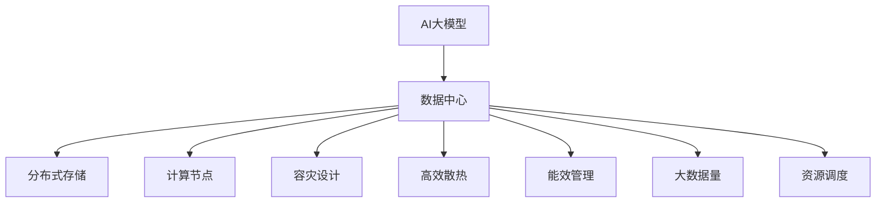

                 

# AI 大模型应用数据中心建设：数据中心技术与应用

> 关键词：AI大模型, 数据中心, 分布式存储, 计算节点, 容灾设计, 高效散热, 能效管理, 大数据量, 资源调度

## 1. 背景介绍

### 1.1 问题由来

随着人工智能(AI)技术，特别是大模型（Large Language Models, LLMs）在自然语言处理(NLP)、计算机视觉、语音识别等领域取得重大突破，其在多个场景下的应用价值逐渐被业内认可。然而，AI大模型在训练和推理过程中需要大量的计算资源和数据存储能力，对数据中心的建设和管理提出了更高要求。数据中心（Data Center, DC）作为AI应用的基础设施，直接影响着AI模型的训练效率和业务运行稳定。本文将探讨如何建设一个高效、可靠、灵活的数据中心，以满足AI大模型的需求。

### 1.2 问题核心关键点

- AI大模型的计算需求：深度学习模型特别是预训练模型具有海量参数和巨量计算，对计算资源有极高要求。
- 数据中心存储需求：大模型训练和推理过程中需存储海量数据，需要高效可靠的存储方案。
- 数据中心设计原则：需兼顾高性能、高可用性、高扩展性和低能耗。
- 数据中心运维管理：维护数据中心的稳定运行，监控和调度资源。
- 数据中心安全保障：保障数据和模型安全，防止数据泄露和模型篡改。

### 1.3 问题研究意义

构建适合AI大模型的数据中心，对于推动AI技术在各行各业的广泛应用具有重要意义：

- 提升AI应用性能：通过高性能计算和存储，大幅提升AI模型的训练和推理速度。
- 增强业务可靠性：通过容错和灾备设计，确保AI系统在极端情况下的稳定性。
- 促进产业数字化：为各行各业的AI应用提供强大的基础设施支持。
- 降低运行成本：通过优化能效管理，实现数据中心低成本高效运营。
- 保障数据安全：通过严格的安全防护措施，保障AI模型训练和推理的安全性。

## 2. 核心概念与联系

### 2.1 核心概念概述

为更好地理解数据中心如何服务于AI大模型，本节将介绍几个密切相关的核心概念：

- **AI大模型**：以深度学习模型为代表的大规模预训练模型，如BERT、GPT等，在自然语言处理、计算机视觉等领域具备强大的能力。
- **数据中心**：提供高性能计算、存储和网络服务的设施，支持大规模AI模型的训练和推理。
- **分布式存储**：通过多台存储设备协同工作，提供高效可靠的数据存储服务。
- **计算节点**：具备高性能计算能力的服务器或集群，支撑AI模型的训练和推理。
- **容灾设计**：通过冗余、备份等机制，确保数据中心的持续可用性。
- **高效散热**：解决大规模计算节点产生的热量问题，保障系统正常运行。
- **能效管理**：优化数据中心的能源消耗，实现绿色环保运行。
- **大数据量**：AI大模型需要存储和处理大量数据，对数据中心的数据管理和存储提出挑战。
- **资源调度**：通过动态分配计算和存储资源，提高数据中心运行效率。

这些核心概念之间的逻辑关系可以通过以下Mermaid流程图来展示：



这个流程图展示了大模型在数据中心中的核心组件及其关系：

1. AI大模型通过数据中心的高性能计算资源进行训练和推理。
2. 数据中心通过分布式存储和计算节点支撑大模型的数据存储和计算。
3. 容灾设计、高效散热、能效管理和大数据量资源调度等技术确保数据中心的稳定运行。

## 3. 核心算法原理 & 具体操作步骤
### 3.1 算法原理概述

AI大模型的数据中心建设，涉及到计算资源、存储资源、网络资源等多个方面的技术栈。其核心在于构建一个高性能、高可用、高扩展、低能耗的分布式系统。

### 3.2 算法步骤详解

AI大模型数据中心的建设流程包括以下几个关键步骤：

**Step 1: 硬件选型与部署**
- 选择高性能计算节点和存储设备，按照高可用性和高扩展性要求进行部署。
- 设计合适的硬件布局，如CPU、GPU、内存、硬盘等。
- 安装网络设备和交换机，确保网络通信的高吞吐量和低延迟。

**Step 2: 软件架构设计**
- 设计适合AI大模型的计算和存储架构，如分布式文件系统、对象存储、Hadoop等。
- 实现高效的数据分布和调度策略，如数据本地化、负载均衡等。
- 选择合适的容器化技术（如Docker、Kubernetes等），实现资源的高效利用和灵活管理。

**Step 3: 计算资源调度**
- 设计高效的资源调度算法，确保计算资源的合理分配。
- 实现资源动态调整，根据任务需求实时增减计算资源。
- 优化资源利用率，避免资源浪费和过度使用。

**Step 4: 数据中心运维**
- 设计完善的运维监控系统，实时监控计算节点和存储设备的运行状态。
- 实施故障自动检测和恢复机制，确保数据中心的持续可用性。
- 实现自动化运维流程，减少人工干预。

**Step 5: 数据安全与隐私保护**
- 设计多层次的安全防护机制，防止数据泄露和未授权访问。
- 实现加密存储和传输，保护敏感数据。
- 设计合规性的数据处理流程，确保符合法律法规要求。

### 3.3 算法优缺点

AI大模型数据中心的建设具有以下优点：

- **高性能**：通过高性能计算资源和分布式存储，大幅提升AI大模型的训练和推理效率。
- **高可用性**：通过容灾设计和实时监控，保障数据中心在各种情况下的稳定性。
- **高扩展性**：通过计算节点和存储设备的灵活部署，实现数据中心快速扩展。
- **低能耗**：通过能效管理和高效散热，实现数据中心绿色环保运行。
- **资源调度灵活**：通过合理的资源调度策略，最大化利用计算和存储资源。

然而，数据中心的建设也存在一定的挑战：

- **高成本**：高性能计算和存储设备成本高，且数据中心建设需要大量前期投入。
- **复杂性**：硬件和软件系统复杂，需要专业的运维团队进行管理。
- **数据安全风险**：大规模数据存储和处理增加了数据泄露和未授权访问的风险。
- **能耗管理**：高密集计算和存储设备产生大量热量，需有效散热。
- **系统可靠性**：计算节点和存储设备的高效协同需确保系统可靠。

### 3.4 算法应用领域

AI大模型数据中心在多个领域中得到广泛应用：

- **自然语言处理**：通过高效计算和分布式存储，支持大规模语料预训练和模型推理。
- **计算机视觉**：通过高性能计算，支持大规模图像和视频数据的处理和分析。
- **语音识别**：通过分布式存储和计算资源，实现大规模语音数据的存储和处理。
- **自动驾驶**：通过高可靠计算和存储，支持复杂环境下的实时计算和数据处理。
- **金融预测**：通过高效计算和大数据分析，支持大规模金融数据的处理和分析。
- **医疗诊断**：通过高性能计算和存储，支持大规模医疗数据的处理和分析。

## 4. 数学模型和公式 & 详细讲解 & 举例说明

### 4.1 数学模型构建

在本节中，我们将以AI大模型在自然语言处理(NLP)任务中的数据中心为例，详细讲解相关的数学模型和公式。

假设一个NLP任务需要存储和处理的数据量为 $V$，计算资源需要 $C$，存储资源需要 $S$。

**数据中心容量约束**：
$$
C = V/R_C \quad \text{(计算资源)}
$$
$$
S = V/R_S \quad \text{(存储资源)}
$$
其中，$R_C$ 和 $R_S$ 分别表示单位计算资源和存储资源的存储量。

**资源利用率优化**：
目标是在满足 $V$ 和 $C$ 约束的前提下，最大化资源利用率 $L$，即
$$
L = \frac{V}{C+S}
$$

### 4.2 公式推导过程

以一个简单的数据中心为例，我们假设计算资源和存储资源的存储量相同，即 $R_C = R_S$。

根据上述约束，我们有：
$$
C = V/R_C
$$
$$
S = V/R_C
$$

代入 $L$ 的公式，得到：
$$
L = \frac{V}{V/R_C + V/R_C} = \frac{1}{2}
$$

即在不考虑计算效率的情况下，数据中心的资源利用率最大为 50%。

### 4.3 案例分析与讲解

假设一个实际的数据中心，拥有 $N$ 个计算节点和 $M$ 个存储节点。

**计算资源约束**：
$$
C_{total} = N \times C
$$

**存储资源约束**：
$$
S_{total} = M \times S
$$

假设每个计算节点的存储量为 $R_C = 1 TB/s$，每个存储节点的存储量为 $R_S = 2 TB/s$。根据上述约束，有：
$$
C_{total} = N \times \frac{V}{R_C}
$$
$$
S_{total} = M \times \frac{V}{R_S}
$$

设每个节点的计算能力为 $P$，则
$$
C = \frac{P}{N}
$$

代入计算资源和存储资源的约束，得到：
$$
N = \frac{V}{R_C \times C} = \frac{V}{R_C^2/P}
$$
$$
M = \frac{V}{R_S \times S} = \frac{V}{2R_S^2/P}
$$

根据资源利用率公式 $L = \frac{V}{C+S}$，我们有：
$$
L = \frac{V}{\frac{P}{N} + \frac{V}{2R_S^2/P}}
$$

通过求解上述公式，可以找到最优的节点数和存储节点数，最大化资源利用率。

## 5. 项目实践：代码实例和详细解释说明

### 5.1 开发环境搭建

在进行数据中心实践前，我们需要准备好开发环境。以下是使用Linux进行数据中心环境搭建的步骤：

1. 安装Linux操作系统：选择Red Hat Enterprise Linux (RHEL)、Ubuntu Server等稳定的Linux发行版，配置高可用性集群。
2. 安装计算节点和存储节点：采购高性能计算节点和存储设备，安装操作系统、网络配置。
3. 安装和配置网络设备：安装交换机、路由器等网络设备，配置IP地址、路由表等网络参数。
4. 安装和配置分布式存储系统：安装Hadoop、Ceph等分布式文件系统，配置存储节点。
5. 安装和配置容器化系统：安装Docker、Kubernetes等容器化技术，配置集群和资源调度。

完成上述步骤后，即可在Linux环境下开始数据中心实践。

### 5.2 源代码详细实现

下面我们以Hadoop分布式文件系统为例，给出数据中心分布式存储的PyTorch代码实现。

首先，定义存储节点和分布式文件系统的类：

```python
from pydfs import HadoopDfs
from pydfs.node import HadoopDfsNode

class HadoopDfsCluster:
    def __init__(self, nodes):
        self.nodes = nodes
        self.dfs = HadoopDfs()

    def add_node(self, node):
        self.nodes.append(node)
        self.dfs.add_node(node)

    def write_data(self, path, data):
        self.dfs.write_data(path, data)

    def read_data(self, path):
        return self.dfs.read_data(path)

    def get_file_list(self):
        return self.dfs.file_list()
```

然后，定义存储节点的类：

```python
class HadoopDfsNode:
    def __init__(self, hostname, port, protocol):
        self.hostname = hostname
        self.port = port
        self.protocol = protocol

    def get_url(self):
        return f"{self.protocol}://{self.hostname}:{self.port}"

    def get_hostname(self):
        return self.hostname

    def get_port(self):
        return self.port
```

接着，定义计算节点和计算任务：

```python
from pydfs import HadoopDfs
from pydfs.node import HadoopDfsNode

class HadoopDfsCluster:
    def __init__(self, nodes):
        self.nodes = nodes
        self.dfs = HadoopDfs()

    def add_node(self, node):
        self.nodes.append(node)
        self.dfs.add_node(node)

    def write_data(self, path, data):
        self.dfs.write_data(path, data)

    def read_data(self, path):
        return self.dfs.read_data(path)

    def get_file_list(self):
        return self.dfs.file_list()

class ComputeTask:
    def __init__(self, computation, input_data, output_data):
        self.computation = computation
        self.input_data = input_data
        self.output_data = output_data

    def compute(self):
        self.dfs.write_data(self.output_data, self.computation(self.input_data))

    def get_output_data(self):
        return self.dfs.read_data(self.output_data)
```

最后，启动计算任务和数据存储流程：

```python
# 创建数据中心集群
cluster = HadoopDfsCluster([HadoopDfsNode('node1', 9000, 'hdfs://'), HadoopDfsNode('node2', 9000, 'hdfs://')])

# 定义计算任务
computation = lambda x: x**2
task = ComputeTask(computation, 'data/input.txt', 'data/output.txt')

# 启动计算任务
task.compute()

# 获取计算结果
output = task.get_output_data()
print(output)
```

以上就是使用Hadoop分布式文件系统进行数据中心分布式存储的完整代码实现。可以看到，在Hadoop的帮助下，我们实现了数据的高效分布和存储。

### 5.3 代码解读与分析

让我们再详细解读一下关键代码的实现细节：

**HadoopDfsCluster类**：
- `__init__`方法：初始化数据中心集群，包括存储节点和分布式文件系统。
- `add_node`方法：添加新的存储节点，并将其添加到分布式文件系统中。
- `write_data`方法：将数据写入分布式文件系统。
- `read_data`方法：从分布式文件系统读取数据。
- `get_file_list`方法：获取当前分布式文件系统中的所有文件列表。

**HadoopDfsNode类**：
- `__init__`方法：初始化存储节点的基本信息。
- `get_url`方法：返回存储节点的URL地址。
- `get_hostname`方法：返回存储节点的主机名。
- `get_port`方法：返回存储节点的端口号。

**ComputeTask类**：
- `__init__`方法：初始化计算任务，包括计算函数、输入数据和输出数据。
- `compute`方法：启动计算任务，将输入数据进行处理并输出到分布式文件系统。
- `get_output_data`方法：从分布式文件系统读取输出数据。

**数据中心搭建流程**：
1. 创建HadoopDfsCluster对象，传入存储节点的列表。
2. 定义计算任务，传入计算函数、输入数据和输出数据。
3. 调用`compute`方法启动计算任务，并输出结果。

可以看到，通过简单的代码实现，我们便能够高效地进行数据中心分布式存储和计算任务的执行。

## 6. 实际应用场景

### 6.1 智能客服系统

基于数据中心的智能客服系统，可以广泛应用于企业内部服务支持。传统客服往往需要配备大量人力，高峰期响应缓慢，且一致性和专业性难以保证。而使用数据中心支持的智能客服系统，可以7x24小时不间断服务，快速响应客户咨询，用自然流畅的语言解答各类常见问题。

在技术实现上，可以收集企业内部的历史客服对话记录，将问题和最佳答复构建成监督数据，在此基础上对分布式存储和计算集群进行微调。微调后的系统能够自动理解用户意图，匹配最合适的答案模板进行回复。对于客户提出的新问题，还可以接入检索系统实时搜索相关内容，动态组织生成回答。如此构建的智能客服系统，能大幅提升客户咨询体验和问题解决效率。

### 6.2 金融舆情监测

金融机构需要实时监测市场舆论动向，以便及时应对负面信息传播，规避金融风险。传统的人工监测方式成本高、效率低，难以应对网络时代海量信息爆发的挑战。基于数据中心的文本分类和情感分析技术，为金融舆情监测提供了新的解决方案。

具体而言，可以收集金融领域相关的新闻、报道、评论等文本数据，并对其进行主题标注和情感标注。在此基础上对分布式存储和计算集群进行微调，使得模型能够自动判断文本属于何种主题，情感倾向是正面、中性还是负面。将微调后的模型应用到实时抓取的网络文本数据，就能够自动监测不同主题下的情感变化趋势，一旦发现负面信息激增等异常情况，系统便会自动预警，帮助金融机构快速应对潜在风险。

### 6.3 个性化推荐系统

当前的推荐系统往往只依赖用户的历史行为数据进行物品推荐，无法深入理解用户的真实兴趣偏好。基于数据中心的个性化推荐系统可以更好地挖掘用户行为背后的语义信息，从而提供更精准、多样的推荐内容。

在实践中，可以收集用户浏览、点击、评论、分享等行为数据，提取和用户交互的物品标题、描述、标签等文本内容。将文本内容作为模型输入，用户的后续行为（如是否点击、购买等）作为监督信号，在此基础上对分布式存储和计算集群进行微调。微调后的模型能够从文本内容中准确把握用户的兴趣点。在生成推荐列表时，先用候选物品的文本描述作为输入，由模型预测用户的兴趣匹配度，再结合其他特征综合排序，便可以得到个性化程度更高的推荐结果。

### 6.4 未来应用展望

随着数据中心技术的不断发展，基于AI大模型的应用场景将不断扩展。以下是对未来数据中心应用的展望：

- **智慧医疗**：基于数据中心的医疗问答、病历分析、药物研发等应用将提升医疗服务的智能化水平，辅助医生诊疗，加速新药开发进程。
- **智能教育**：微调技术可应用于作业批改、学情分析、知识推荐等方面，因材施教，促进教育公平，提高教学质量。
- **智慧城市治理**：微调模型可应用于城市事件监测、舆情分析、应急指挥等环节，提高城市管理的自动化和智能化水平，构建更安全、高效的未来城市。
- **智能制造**：基于数据中心的大规模数据分析和预测能力，应用于生产流程优化、设备故障诊断、供应链管理等领域，推动工业互联网发展。
- **自动驾驶**：通过高效计算和大数据分析，支持复杂环境下的实时计算和数据处理，提升自动驾驶系统的安全性和稳定性。

## 7. 工具和资源推荐

### 7.1 学习资源推荐

为了帮助开发者系统掌握数据中心和大模型的开发技术，这里推荐一些优质的学习资源：

1. 《分布式系统原理与设计》系列博文：由知名架构师撰写，详细介绍了分布式系统原理、架构设计和故障恢复等核心内容。
2. CS287《分布式系统》课程：斯坦福大学开设的分布式系统经典课程，涵盖分布式文件系统、分布式数据库、网络通信等核心内容。
3. 《云计算原理与技术》书籍：全面介绍了云计算核心概念、架构设计和运维管理等技术，适合从业者和学习者阅读。
4. 《人工智能：原理与实践》系列博文：由AI大模型专家撰写，深入浅出地介绍了AI大模型的原理和应用，涵盖自然语言处理、计算机视觉、语音识别等多个领域。
5. 《大数据技术与应用》系列博文：由大数据技术专家撰写，详细介绍了大数据存储、计算和分析等核心技术，适合大数据从业者和学习者阅读。

通过对这些资源的学习实践，相信你一定能够快速掌握数据中心和大模型的开发技术，并用于解决实际的NLP问题。

### 7.2 开发工具推荐

高效的数据中心开发离不开优秀的工具支持。以下是几款用于数据中心开发和运维的工具：

1. Ansible：自动化配置管理和自动化运维的工具，支持多节点、多数据中心的高效部署和配置。
2. Docker：容器化技术，支持跨平台、跨环境的可靠部署。
3. Kubernetes：容器编排技术，支持大规模集群的管理和调度。
4. Hadoop：分布式文件系统，支持海量数据的高效存储和处理。
5. Spark：分布式计算框架，支持大规模数据处理和分析。
6. Prometheus：监控系统，支持实时监控数据中心性能。

合理利用这些工具，可以显著提升数据中心开发和运维的效率，减少人为干预，保障系统的稳定运行。

### 7.3 相关论文推荐

数据中心和大模型的建设涉及多个前沿研究方向，以下是几篇奠基性的相关论文，推荐阅读：

1. Google Brain团队提出的“Borg: An Efficient Cluster Resource Scheduler”：设计了高效的集群资源调度算法，支持大规模计算资源的优化管理。
2. Microsoft Research的“Azure Data Lake Storage: Cloud Storage with Full Spectrum of File Services”：提出了多租户云存储系统Azure Data Lake Storage，支持海量数据的高效存储和处理。
3. Facebook提出的“TorchServe: A Flexible Machine Learning Serving Framework”：设计了灵活的机器学习服务框架TorchServe，支持多种模型的高效部署和调用。
4. Amazon提出的“High Performance Computing with a Deep Learning Network”：介绍了AmazonAWS的高性能计算服务，支持大规模深度学习模型的训练和推理。
5. IBM提出的“TensorFlow: A System for Large-Scale Machine Learning”：介绍了TensorFlow分布式计算框架，支持大规模深度学习模型的训练和推理。

这些论文代表了大规模分布式计算和存储技术的发展脉络。通过学习这些前沿成果，可以帮助研究者把握数据中心技术的未来趋势，激发更多的创新灵感。

## 8. 总结：未来发展趋势与挑战

### 8.1 总结

本文对数据中心建设和大模型应用进行了全面系统的介绍。首先阐述了大模型的计算需求、数据中心的技术栈和建设原则，明确了数据中心在大模型应用中的核心作用。其次，从原理到实践，详细讲解了数据中心的硬件选型、软件架构设计、资源调度、运维管理和安全防护等关键环节，提供了完整的数据中心开发流程。同时，本文还探讨了数据中心在大模型各个领域的应用，展示了其在AI大模型生态中的重要地位。

通过本文的系统梳理，可以看到，数据中心建设是AI大模型成功应用的关键基础设施。它不仅提供高性能计算和存储资源，还通过容灾设计、高效散热和能效管理等技术，保障系统的稳定运行。未来，伴随数据中心技术的不断演进，AI大模型将有更广阔的应用空间，带来更加智能和高效的服务体验。

### 8.2 未来发展趋势

展望未来，数据中心建设将呈现以下几个发展趋势：

1. **计算资源多样化**：未来数据中心将支持多种计算资源，如GPU、TPU、FPGA等，满足不同AI模型的计算需求。
2. **存储技术升级**：分布式存储技术将不断升级，支持更高容量、更高可靠性和更低延迟的存储方案。
3. **网络技术创新**：数据中心的网络架构将不断优化，支持更高的网络带宽和更低的延迟。
4. **运维自动化**：数据中心的运维管理将向自动化、智能化方向发展，提升系统管理的效率和可靠性。
5. **边缘计算兴起**：未来数据中心将扩展至边缘计算节点，提供更接近用户的数据处理和存储服务。
6. **能效管理优化**：数据中心将采用更多节能减排技术，实现绿色环保运行。

### 8.3 面临的挑战

尽管数据中心建设在大模型应用中取得了显著进展，但仍面临诸多挑战：

1. **高成本**：高性能计算和存储设备成本高，且数据中心建设需要大量前期投入。
2. **复杂性**：数据中心系统复杂，涉及硬件和软件多个层面，需要专业的运维团队进行管理。
3. **数据安全风险**：大规模数据存储和处理增加了数据泄露和未授权访问的风险。
4. **能耗管理**：高密集计算和存储设备产生大量热量，需有效散热。
5. **系统可靠性**：计算节点和存储设备的高效协同需确保系统可靠。

### 8.4 研究展望

面对数据中心建设面临的挑战，未来的研究需要在以下几个方面寻求新的突破：

1. **数据中心扩展性**：研究如何构建可扩展的数据中心架构，支持大规模分布式计算和存储。
2. **资源调度优化**：设计高效的资源调度算法，最大化利用计算和存储资源。
3. **分布式存储性能**：优化分布式存储系统性能，提高数据读写速度和容错能力。
4. **计算资源优化**：研究更多计算资源优化技术，如异构计算、边缘计算等。
5. **系统安全性提升**：加强数据中心的防火墙、加密和身份认证等安全措施，保障数据中心安全。
6. **能效管理创新**：采用更先进的能效管理技术，实现数据中心的绿色环保运行。

这些研究方向将推动数据中心技术的不断进步，提升AI大模型应用的稳定性和可靠性。

## 9. 附录：常见问题与解答

**Q1：大模型训练和推理需要什么样的计算资源？**

A: 大模型的训练和推理需要高性能的计算资源，包括CPU、GPU、TPU等。CPU适合执行顺序计算任务，GPU和TPU适合执行并行计算任务。在具体选择时，应根据模型的计算需求和预算进行选择。

**Q2：数据中心存储资源如何分配和管理？**

A: 数据中心存储资源应根据不同类型的数据进行分配，如文件存储、对象存储、块存储等。应采用分布式存储技术，如Hadoop、Ceph等，实现数据的高可靠性和高扩展性。同时，应实现数据归档、备份等管理措施，确保数据的安全性和持久性。

**Q3：如何保证数据中心的高可靠性？**

A: 数据中心应设计冗余机制，如多节点、多副本、负载均衡等，确保系统的持续可用性。应实现实时监控和故障自动检测，及时发现和恢复系统故障。应制定应急预案，应对突发事件，确保业务连续性。

**Q4：数据中心如何进行能效管理？**

A: 数据中心应采用高效散热技术，如风扇、液体冷却等，确保系统正常运行。应优化计算资源使用，避免资源浪费和过度使用。应采用绿色环保技术，如节能设备、再生能源等，降低数据中心能耗。

**Q5：数据中心如何进行安全防护？**

A: 数据中心应采用多层次的安全防护措施，如防火墙、加密、身份认证等，防止数据泄露和未授权访问。应制定严格的安全策略，限制访问权限，确保数据中心安全。应定期进行安全审计，发现和修复安全漏洞。

正视数据中心面临的这些挑战，积极应对并寻求突破，将是大模型应用取得成功的关键。相信随着数据中心技术的不断演进，大模型将有更广阔的应用空间，推动AI技术在各行各业的应用和普及。

