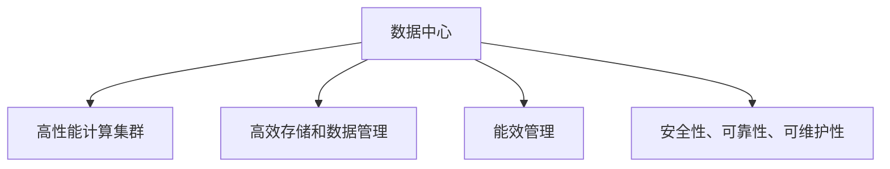

                 

## 1. 背景介绍

### 1.1 问题由来
随着人工智能技术的迅猛发展，大模型在自然语言处理（NLP）、计算机视觉、推荐系统等领域的应用越来越广泛。大模型通常是指具有数十亿甚至数百亿参数的深度学习模型，这类模型在训练时需要消耗巨大的计算资源。为了有效管理这些计算资源，数据中心（Data Center）在AI大模型应用中扮演着至关重要的角色。

### 1.2 问题核心关键点
数据中心是AI大模型应用的基础设施，其设计和运维对AI大模型的训练和部署效率有着直接影响。具体来说，数据中心需要在以下几个方面进行技术创新：
- 高性能计算集群的设计和优化。
- 高效存储和数据管理的实现。
- 能效管理和成本控制的优化。
- 安全性、可靠性、可维护性的全面提升。

### 1.3 问题研究意义
数据中心技术创新的研究意义在于：
1. 优化计算资源配置，提升AI大模型训练和推理的速度和效率。
2. 降低能耗和运营成本，促进AI大模型的可持续发展。
3. 提高系统的安全性和可靠性，保障AI应用的安全和稳定。
4. 提供高效的数据管理和存储方案，支持大规模数据处理。
5. 为AI大模型的落地应用提供坚实的技术支撑，推动AI技术的产业化进程。

## 2. 核心概念与联系

### 2.1 核心概念概述
1. **数据中心（Data Center）**：提供计算、存储、网络和安全等基础设施的综合设施，是AI大模型应用的基础。
2. **高性能计算集群（High-Performance Computing Cluster）**：由多台计算节点组成的集群，用于处理大模型的训练和推理任务。
3. **高效存储和数据管理（High-Efficiency Storage and Data Management）**：实现数据的高效读写和管理，支持大规模数据处理。
4. **能效管理（Energy Efficiency Management）**：通过技术手段降低数据中心能耗，提升能源利用效率。
5. **安全性、可靠性、可维护性（Security, Reliability, and Maintainability）**：确保数据中心的安全性、可靠性和易维护性，保障AI应用的安全和稳定。

### 2.2 核心概念原理和架构的 Mermaid 流程图

### 2.3 核心概念间的联系
数据中心是一个由多个模块组成的大型系统，其中高性能计算集群、高效存储和数据管理、能效管理和安全性、可靠性、可维护性是核心组件。它们之间相互配合，共同支持AI大模型的应用。

1. **高性能计算集群**：提供计算能力，支持大规模模型的训练和推理。
2. **高效存储和数据管理**：管理模型和数据，支持数据的高效读写和存储。
3. **能效管理**：通过技术手段降低能耗，提升能源利用效率，减少运营成本。
4. **安全性、可靠性、可维护性**：保障系统的安全性、可靠性和易维护性，确保数据和模型的安全。

这些核心组件通过合理的架构设计和管理策略，共同构成高效、安全、可靠的数据中心，为AI大模型的应用提供了坚实的技术基础。

## 3. 核心算法原理 & 具体操作步骤

### 3.1 算法原理概述
AI大模型应用数据中心建设的核心算法原理包括以下几个方面：
1. **分布式计算架构**：通过多台计算节点并行处理，提升计算能力。
2. **存储分层策略**：采用多层存储结构，支持不同类型数据的读写和存储需求。
3. **能效优化算法**：通过节能算法，降低数据中心的能耗。
4. **安全性策略**：实施多层次的安全措施，保障数据和系统的安全。
5. **可靠性设计**：采用冗余和故障转移机制，确保系统的可靠性。
6. **可维护性优化**：通过自动化和智能化维护手段，提高系统的易维护性。

### 3.2 算法步骤详解

#### 3.2.1 高性能计算集群的构建
1. **选择计算节点**：根据任务需求选择合适的计算节点，通常包括CPU、GPU、FPGA等。
2. **节点互联**：通过高速网络（如InfiniBand、100GbE）连接计算节点，实现数据的高速传输。
3. **集群调度**：采用任务调度算法（如Spark、TensorFlow分布式训练）优化资源利用率，提升计算效率。

#### 3.2.2 高效存储和数据管理
1. **存储分层**：将数据分为热数据、温数据、冷数据，采用不同存储介质（如SSD、HDD、云存储）存储，以降低成本。
2. **数据复制和冗余**：通过数据复制和冗余机制，提高数据的可靠性和可用性。
3. **数据一致性协议**：采用分布式一致性协议（如Paxos、Raft）确保数据的一致性和一致性。
4. **数据管理工具**：使用分布式文件系统（如Hadoop Distributed File System, HDFS）和对象存储系统（如Amazon S3）管理海量数据。

#### 3.2.3 能效管理
1. **功耗监测**：通过传感器和监控系统实时监测数据中心的功耗和能耗。
2. **节能算法**：采用节能算法（如动态电压频率调整、虚拟化技术）降低能耗。
3. **冷却系统优化**：优化冷却系统，提高能源利用效率，降低冷却成本。

#### 3.2.4 安全性策略
1. **网络安全**：采用防火墙、入侵检测系统（IDS）、入侵防御系统（IPS）等保障网络安全。
2. **数据安全**：采用数据加密、访问控制、审计日志等措施保护数据安全。
3. **系统安全**：采用多层次的安全机制，包括物理安全、网络安全、主机安全和应用安全。

#### 3.2.5 可靠性设计
1. **冗余设计**：采用冗余服务器、冗余网络、冗余电源等设计提高系统的可靠性。
2. **故障转移机制**：通过自动故障转移机制（如Active-Active、Active-Passive）保障系统的连续性。

#### 3.2.6 可维护性优化
1. **自动化运维**：使用自动化运维工具（如Ansible、Puppet）减少人工干预，提高运维效率。
2. **监控系统**：使用监控系统（如Prometheus、Grafana）实时监测系统状态，及时发现和解决故障。
3. **日志分析**：通过日志分析工具（如ELK Stack）收集和分析系统日志，优化系统性能。

### 3.3 算法优缺点

#### 3.3.1 优点
1. **计算能力强大**：通过分布式计算架构，支持大规模模型的训练和推理。
2. **存储和数据管理高效**：通过分层存储策略和数据管理工具，支持海量数据的高效读写和存储。
3. **能效管理**：通过节能算法和优化冷却系统，降低数据中心的能耗和运营成本。
4. **安全性和可靠性高**：通过多层次的安全措施和冗余设计，保障系统的安全性和可靠性。
5. **可维护性好**：通过自动化运维和监控系统，提高系统的易维护性。

#### 3.3.2 缺点
1. **建设成本高**：数据中心的建设需要大量的硬件投入和基础设施建设。
2. **运营成本高**：数据中心的能耗和维护成本较高，需要持续的资金投入。
3. **复杂度高**：数据中心的运维和管理需要较高的技术水平，需要专业的运维团队。

### 3.4 算法应用领域

1. **云计算平台**：云服务提供商如AWS、阿里云、华为云等提供大模型的训练和推理服务，需要高效的数据中心基础设施支持。
2. **自动驾驶**：自动驾驶系统需要高性能计算和存储能力，支持大规模的图像和数据处理。
3. **金融科技**：金融行业需要对海量数据进行实时分析和处理，需要高可靠性和高性能的数据中心支持。
4. **医疗健康**：医疗行业需要对大量医疗影像数据进行处理和分析，需要高效存储和计算能力。
5. **智慧城市**：智慧城市需要实时处理大量的城市数据，需要高效能的数据中心支持。

## 4. 数学模型和公式 & 详细讲解 & 举例说明

### 4.1 数学模型构建
大模型应用数据中心的数学模型主要包括以下几个方面：
1. **计算模型**：表示计算节点的计算能力和负载情况。
2. **存储模型**：表示不同类型数据的读写和存储情况。
3. **能效模型**：表示数据中心能耗和节能算法。
4. **安全模型**：表示数据中心的安全措施。
5. **可靠性模型**：表示数据中心的冗余和故障转移机制。

### 4.2 公式推导过程
以计算模型为例，假设数据中心的计算能力为 $C$，每个计算节点的计算能力为 $c$，则计算模型可以表示为：
$$
C = n \times c
$$
其中，$n$ 表示计算节点的数量。

### 4.3 案例分析与讲解
假设一个数据中心有 $N=100$ 个计算节点，每个节点的计算能力为 $c=1000$ GFLOPS，则数据中心的总计算能力为：
$$
C = 100 \times 1000 = 100000 \text{ GFLOPS}
$$

## 5. 项目实践：代码实例和详细解释说明

### 5.1 开发环境搭建
1. **选择硬件平台**：选择高性能计算节点，通常包括CPU、GPU、FPGA等。
2. **搭建计算集群**：通过高速网络连接计算节点，形成分布式计算集群。
3. **安装软件环境**：安装TensorFlow、PyTorch等深度学习框架，配置计算集群。

### 5.2 源代码详细实现
1. **计算节点管理**：编写代码实现计算节点的管理和调度。
2. **存储管理**：编写代码实现数据的读写和管理。
3. **能效管理**：编写代码实现节能算法的实现。
4. **安全管理**：编写代码实现网络安全、数据安全和系统安全。
5. **可靠性设计**：编写代码实现冗余和故障转移机制。

### 5.3 代码解读与分析
以计算节点管理为例，代码实现包括：
1. **节点信息收集**：通过监控系统实时收集计算节点的CPU、内存、网络等状态信息。
2. **任务调度**：根据任务需求，动态调整计算节点的负载，实现负载均衡。
3. **状态监测**：通过日志和监控系统，实时监测计算节点的运行状态，及时发现和解决故障。

### 5.4 运行结果展示
通过部署和运行代码，可以在实际环境中测试数据中心的高性能计算能力、能效管理效果和安全可靠性。

## 6. 实际应用场景

### 6.1 云计算平台
云计算平台如AWS、阿里云、华为云等，需要构建高效、可靠、安全的数据中心，以支持大规模模型的训练和推理。例如，AWS构建了全球最大的云数据中心，支持千万级的计算节点，可以处理大规模模型的训练和推理任务。

### 6.2 自动驾驶
自动驾驶系统需要处理大量的图像和传感器数据，需要高效存储和计算能力。例如，谷歌的Deep Drive项目通过构建大规模的数据中心，支持自动驾驶模型的训练和推理。

### 6.3 金融科技
金融科技需要对海量数据进行实时分析和处理，需要高可靠性和高性能的数据中心支持。例如，高盛构建了多个数据中心，支持大规模金融数据的存储和处理。

### 6.4 医疗健康
医疗行业需要对大量医疗影像数据进行处理和分析，需要高效存储和计算能力。例如，IBM构建了Watson Health云平台，支持大规模医疗数据的存储和处理。

### 6.5 智慧城市
智慧城市需要实时处理大量的城市数据，需要高效能的数据中心支持。例如，新加坡的NUS Smart Nation Initiative项目通过构建高效能的数据中心，支持智慧城市应用。

## 7. 工具和资源推荐

### 7.1 学习资源推荐
1. **《数据中心技术与架构》**：详细介绍数据中心的核心技术和架构，适合初学者和进阶读者。
2. **《云计算基础》**：讲解云计算平台的基础知识和实践应用，适合云计算开发人员。
3. **《大数据与分布式计算》**：讲解大数据和分布式计算的基础知识和实现技术，适合数据工程师和架构师。
4. **《AI大模型应用实践》**：讲解AI大模型在各行业中的应用实践，适合AI应用开发人员。

### 7.2 开发工具推荐
1. **Ansible**：自动化运维工具，支持配置管理、任务自动化、应用部署等。
2. **Prometheus**：监控系统，实时监测系统状态，支持分布式应用。
3. **ELK Stack**：日志分析工具，支持日志收集、分析和可视化。

### 7.3 相关论文推荐
1. **《数据中心能效优化》**：提出多种节能算法，降低数据中心能耗。
2. **《分布式计算架构设计》**：讲解分布式计算架构的设计和优化，提升计算能力。
3. **《安全性策略与实现》**：提出多种安全措施，保障数据中心的安全性。
4. **《可靠性设计与实现》**：讲解可靠性设计的实现方法和应用场景。

## 8. 总结：未来发展趋势与挑战

### 8.1 研究成果总结
大模型应用数据中心建设的研究成果主要包括以下几个方面：
1. **高性能计算集群设计**：通过分布式计算架构，提升计算能力。
2. **高效存储和数据管理**：通过分层存储策略和数据管理工具，支持海量数据处理。
3. **能效管理**：通过节能算法和优化冷却系统，降低能耗和运营成本。
4. **安全性策略**：通过多层次的安全措施，保障数据和系统的安全。
5. **可靠性设计**：通过冗余和故障转移机制，确保系统的可靠性。
6. **可维护性优化**：通过自动化运维和监控系统，提高系统的易维护性。

### 8.2 未来发展趋势
1. **边缘计算的普及**：边缘计算可以降低数据传输延迟，提高响应速度。
2. **异构计算的发展**：异构计算可以提升计算能力，降低能耗。
3. **智能运维的提升**：智能运维可以提升数据中心的自动化管理水平。
4. **AI大模型训练优化**：通过优化模型结构和训练方法，提升计算效率和精度。
5. **数据中心虚拟化**：通过虚拟化技术，提高资源利用率，降低成本。
6. **数据中心协同优化**：通过多数据中心的协同计算和存储，提升性能和可靠性。

### 8.3 面临的挑战
1. **建设成本高**：数据中心的建设需要大量的硬件投入和基础设施建设。
2. **运营成本高**：数据中心的能耗和维护成本较高，需要持续的资金投入。
3. **复杂度高**：数据中心的运维和管理需要较高的技术水平，需要专业的运维团队。
4. **安全和隐私问题**：数据中心的隐私和安全问题需要得到充分保障。
5. **环境可持续性**：数据中心的能耗和环境问题需要得到有效解决。

### 8.4 研究展望
1. **分布式计算架构优化**：通过优化计算架构，提升计算能力。
2. **存储分层策略优化**：通过优化存储策略，支持不同类型数据的读写和存储需求。
3. **能效管理优化**：通过优化节能算法和冷却系统，降低能耗和运营成本。
4. **安全性策略优化**：通过优化安全措施，保障数据和系统的安全。
5. **可靠性设计优化**：通过优化冗余和故障转移机制，确保系统的可靠性。
6. **可维护性优化**：通过优化自动化运维和监控系统，提高系统的易维护性。

## 9. 附录：常见问题与解答

**Q1: 大模型应用数据中心如何构建？**

A: 构建大模型应用数据中心需要以下步骤：
1. 选择高性能计算节点，形成分布式计算集群。
2. 搭建计算集群，通过高速网络连接计算节点。
3. 安装深度学习框架，配置计算集群。
4. 实现计算节点管理和调度。
5. 实现数据的读写和管理。
6. 实现节能算法和优化冷却系统。
7. 实现网络安全、数据安全和系统安全。
8. 实现冗余和故障转移机制。
9. 实现自动化运维和监控系统。

**Q2: 如何优化数据中心的能效管理？**

A: 优化数据中心的能效管理需要以下步骤：
1. 通过传感器和监控系统实时监测数据中心的功耗和能耗。
2. 采用节能算法，如动态电压频率调整、虚拟化技术等，降低能耗。
3. 优化冷却系统，提高能源利用效率。
4. 采用多层次的安全措施，保障系统的安全性。
5. 采用冗余和故障转移机制，确保系统的可靠性。

**Q3: 如何提高数据中心的可维护性？**

A: 提高数据中心的可维护性需要以下步骤：
1. 使用自动化运维工具，减少人工干预，提高运维效率。
2. 实时监测系统状态，及时发现和解决故障。
3. 收集和分析系统日志，优化系统性能。
4. 实现分布式一致性协议，确保数据的一致性和一致性。
5. 实现冗余设计，提高系统的可靠性。

**Q4: 如何保障数据中心的安全性？**

A: 保障数据中心的安全性需要以下步骤：
1. 采用防火墙、入侵检测系统、入侵防御系统等保障网络安全。
2. 采用数据加密、访问控制、审计日志等措施保护数据安全。
3. 采用多层次的安全机制，包括物理安全、网络安全、主机安全和应用安全。
4. 通过日志分析工具，收集和分析系统日志，发现和解决安全问题。

**Q5: 如何优化数据中心的存储策略？**

A: 优化数据中心的存储策略需要以下步骤：
1. 将数据分为热数据、温数据、冷数据，采用不同存储介质。
2. 实现数据复制和冗余，提高数据的可靠性和可用性。
3. 实现分布式一致性协议，确保数据的一致性和一致性。
4. 使用分布式文件系统和对象存储系统，管理海量数据。

**Q6: 如何优化数据中心的计算模型？**

A: 优化数据中心的计算模型需要以下步骤：
1. 选择计算节点，根据任务需求选择合适的计算节点，通常包括CPU、GPU、FPGA等。
2. 实现计算节点的管理和调度，通过分布式计算架构提升计算能力。
3. 实现计算节点的状态监测，通过日志和监控系统，实时监测计算节点的运行状态。
4. 实现计算节点的负载均衡，通过任务调度算法优化资源利用率。

**Q7: 如何优化数据中心的可靠性设计？**

A: 优化数据中心的可靠性设计需要以下步骤：
1. 采用冗余服务器、冗余网络、冗余电源等设计，提高系统的可靠性。
2. 实现自动故障转移机制，通过Active-Active、Active-Passive等机制保障系统的连续性。
3. 实现数据复制和冗余，提高数据的可靠性和可用性。
4. 通过监控系统实时监测系统状态，及时发现和解决故障。

**Q8: 如何优化数据中心的能效管理？**

A: 优化数据中心的能效管理需要以下步骤：
1. 通过传感器和监控系统实时监测数据中心的功耗和能耗。
2. 采用节能算法，如动态电压频率调整、虚拟化技术等，降低能耗。
3. 优化冷却系统，提高能源利用效率。
4. 实现冗余设计，提高系统的可靠性。

**Q9: 如何优化数据中心的存储策略？**

A: 优化数据中心的存储策略需要以下步骤：
1. 将数据分为热数据、温数据、冷数据，采用不同存储介质。
2. 实现数据复制和冗余，提高数据的可靠性和可用性。
3. 实现分布式一致性协议，确保数据的一致性和一致性。
4. 使用分布式文件系统和对象存储系统，管理海量数据。

**Q10: 如何优化数据中心的可维护性？**

A: 优化数据中心的可维护性需要以下步骤：
1. 使用自动化运维工具，减少人工干预，提高运维效率。
2. 实时监测系统状态，及时发现和解决故障。
3. 收集和分析系统日志，优化系统性能。
4. 实现分布式一致性协议，确保数据的一致性和一致性。
5. 实现冗余设计，提高系统的可靠性。

**Q11: 如何优化数据中心的计算模型？**

A: 优化数据中心的计算模型需要以下步骤：
1. 选择计算节点，根据任务需求选择合适的计算节点，通常包括CPU、GPU、FPGA等。
2. 实现计算节点的管理和调度，通过分布式计算架构提升计算能力。
3. 实现计算节点的状态监测，通过日志和监控系统，实时监测计算节点的运行状态。
4. 实现计算节点的负载均衡，通过任务调度算法优化资源利用率。

**Q12: 如何优化数据中心的可靠性设计？**

A: 优化数据中心的可靠性设计需要以下步骤：
1. 采用冗余服务器、冗余网络、冗余电源等设计，提高系统的可靠性。
2. 实现自动故障转移机制，通过Active-Active、Active-Passive等机制保障系统的连续性。
3. 实现数据复制和冗余，提高数据的可靠性和可用性。
4. 通过监控系统实时监测系统状态，及时发现和解决故障。

**Q13: 如何优化数据中心的能效管理？**

A: 优化数据中心的能效管理需要以下步骤：
1. 通过传感器和监控系统实时监测数据中心的功耗和能耗。
2. 采用节能算法，如动态电压频率调整、虚拟化技术等，降低能耗。
3. 优化冷却系统，提高能源利用效率。
4. 实现冗余设计，提高系统的可靠性。

**Q14: 如何优化数据中心的存储策略？**

A: 优化数据中心的存储策略需要以下步骤：
1. 将数据分为热数据、温数据、冷数据，采用不同存储介质。
2. 实现数据复制和冗余，提高数据的可靠性和可用性。
3. 实现分布式一致性协议，确保数据的一致性和一致性。
4. 使用分布式文件系统和对象存储系统，管理海量数据。

**Q15: 如何优化数据中心的可维护性？**

A: 优化数据中心的可维护性需要以下步骤：
1. 使用自动化运维工具，减少人工干预，提高运维效率。
2. 实时监测系统状态，及时发现和解决故障。
3. 收集和分析系统日志，优化系统性能。
4. 实现分布式一致性协议，确保数据的一致性和一致性。
5. 实现冗余设计，提高系统的可靠性。

**Q16: 如何优化数据中心的计算模型？**

A: 优化数据中心的计算模型需要以下步骤：
1. 选择计算节点，根据任务需求选择合适的计算节点，通常包括CPU、GPU、FPGA等。
2. 实现计算节点的管理和调度，通过分布式计算架构提升计算能力。
3. 实现计算节点的状态监测，通过日志和监控系统，实时监测计算节点的运行状态。
4. 实现计算节点的负载均衡，通过任务调度算法优化资源利用率。

**Q17: 如何优化数据中心的可靠性设计？**

A: 优化数据中心的可靠性设计需要以下步骤：
1. 采用冗余服务器、冗余网络、冗余电源等设计，提高系统的可靠性。
2. 实现自动故障转移机制，通过Active-Active、Active-Passive等机制保障系统的连续性。
3. 实现数据复制和冗余，提高数据的可靠性和可用性。
4. 通过监控系统实时监测系统状态，及时发现和解决故障。

**Q18: 如何优化数据中心的能效管理？**

A: 优化数据中心的能效管理需要以下步骤：
1. 通过传感器和监控系统实时监测数据中心的功耗和能耗。
2. 采用节能算法，如动态电压频率调整、虚拟化技术等，降低能耗。
3. 优化冷却系统，提高能源利用效率。
4. 实现冗余设计，提高系统的可靠性。

**Q19: 如何优化数据中心的存储策略？**

A: 优化数据中心的存储策略需要以下步骤：
1. 将数据分为热数据、温数据、冷数据，采用不同存储介质。
2. 实现数据复制和冗余，提高数据的可靠性和可用性。
3. 实现分布式一致性协议，确保数据的一致性和一致性。
4. 使用分布式文件系统和对象存储系统，管理海量数据。

**Q20: 如何优化数据中心的可维护性？**

A: 优化数据中心的可维护性需要以下步骤：
1. 使用自动化运维工具，减少人工干预，提高运维效率。
2. 实时监测系统状态，及时发现和解决故障。
3. 收集和分析系统日志，优化系统性能。
4. 实现分布式一致性协议，确保数据的一致性和一致性。
5. 实现冗余设计，提高系统的可靠性。

**Q21: 如何优化数据中心的计算模型？**

A: 优化数据中心的计算模型需要以下步骤：
1. 选择计算节点，根据任务需求选择合适的计算节点，通常包括CPU、GPU、FPGA等。
2. 实现计算节点的管理和调度，通过分布式计算架构提升计算能力。
3. 实现计算节点的状态监测，通过日志和监控系统，实时监测计算节点的运行状态。
4. 实现计算节点的负载均衡，通过任务调度算法优化资源利用率。

**Q22: 如何优化数据中心的可靠性设计？**

A: 优化数据中心的可靠性设计需要以下步骤：
1. 采用冗余服务器、冗余网络、冗余电源等设计，提高系统的可靠性。
2. 实现自动故障转移机制，通过Active-Active、Active-Passive等机制保障系统的连续性。
3. 实现数据复制和冗余，提高数据的可靠性和可用性。
4. 通过监控系统实时监测系统状态，及时发现和解决故障。

**Q23: 如何优化数据中心的能效管理？**

A: 优化数据中心的能效管理需要以下步骤：
1. 通过传感器和监控系统实时监测数据中心的功耗和能耗。
2. 采用节能算法，如动态电压频率调整、虚拟化技术等，降低能耗。
3. 优化冷却系统，提高能源利用效率。
4. 实现冗余设计，提高系统的可靠性。

**Q24: 如何优化数据中心的存储策略？**

A: 优化数据中心的存储策略需要以下步骤：
1. 将数据分为热数据、温数据、冷数据，采用不同存储介质。
2. 实现数据复制和冗余，提高数据的可靠性和可用性。
3. 实现分布式一致性协议，确保数据的一致性和一致性。
4. 使用分布式文件系统和对象存储系统，管理海量数据。

**Q25: 如何优化数据中心的可维护性？**

A: 优化数据中心的可维护性需要以下步骤：
1. 使用自动化运维工具，减少人工干预，提高运维效率。
2. 实时监测系统状态，及时发现和解决故障。
3. 收集和分析系统日志，优化系统性能。
4. 实现分布式一致性协议，确保数据的一致性和一致性。
5. 实现冗余设计，提高系统的可靠性。

**Q26: 如何优化数据中心的计算模型？**

A: 优化数据中心的计算模型需要以下步骤：
1. 选择计算节点，根据任务需求选择合适的计算节点，通常包括CPU、GPU、FPGA等。
2. 实现计算节点的管理和调度，通过分布式计算架构提升计算能力。
3. 实现计算节点的状态监测，通过日志和监控系统，实时监测计算节点的运行状态。
4. 实现计算节点的负载均衡，通过任务调度算法优化资源利用率。

**Q27: 如何优化数据中心的可靠性设计？**

A: 优化数据中心的可靠性设计需要以下步骤：
1. 采用冗余服务器、冗余网络、冗余电源等设计，提高系统的可靠性。
2. 实现自动故障转移机制，通过Active-Active、Active-Passive等机制保障系统的连续性。
3. 实现数据复制和冗余，提高数据的可靠性和可用性。
4. 通过监控系统实时监测系统状态，及时发现和解决故障。

**Q28: 如何优化数据中心的能效管理？**

A: 优化数据中心的能效管理需要以下步骤：
1. 通过传感器和监控系统实时监测数据中心的功耗和能耗。
2. 采用节能算法，如动态电压频率调整、虚拟化技术等，降低能耗。
3. 优化冷却系统，提高能源利用效率。
4. 实现冗余设计，提高系统的可靠性。

**Q29: 如何优化数据中心的存储策略？**

A: 优化数据中心的存储策略需要以下步骤：
1. 将数据分为热数据、温数据、冷数据，采用不同存储介质。
2. 实现数据复制和冗余，提高数据的可靠性和可用性。
3. 实现分布式一致性协议，确保数据的一致性和一致性。
4. 使用分布式文件系统和对象存储系统，管理海量数据。

**Q30: 如何优化数据中心的可维护性？**

A: 优化数据中心的可维护性需要以下步骤：
1. 使用自动化运维工具，减少人工干预，提高运维效率。
2. 实时监测系统状态，及时发现和解决故障。
3. 收集和分析系统日志，优化系统性能。
4. 实现分布式一致性协议，确保数据的一致性和一致性。
5. 实现冗余设计，提高系统的可靠性。

**Q31: 如何优化数据中心的计算模型？**

A: 优化数据中心的计算模型需要以下步骤：
1. 选择计算节点，根据任务需求选择合适的计算节点，通常包括CPU、GPU、FPGA等。
2. 实现计算节点的管理和调度，通过分布式计算架构提升计算能力。
3. 实现计算节点的状态监测，通过日志和监控系统，实时监测计算节点的运行状态。
4. 实现计算节点的负载均衡，通过任务调度算法优化资源利用率。

**Q32: 如何优化数据中心的可靠性设计？**

A: 优化数据中心的可靠性设计需要以下步骤：
1. 采用冗余服务器、冗余网络、冗余电源等设计，提高系统的可靠性。
2. 实现自动故障转移机制，通过Active-Active、Active-Passive等机制保障系统的连续性。
3. 实现数据复制和冗余，提高数据的可靠性和可用性。
4. 通过监控系统实时监测系统状态，及时发现和解决故障。

**Q33: 如何优化数据中心的能效管理？**

A: 优化数据中心的能效管理需要以下步骤：
1. 通过传感器和监控系统实时监测数据中心的功耗和能耗。
2. 采用节能算法，如动态电压频率调整、虚拟化技术等，降低能耗。
3. 优化冷却系统，提高能源利用效率。
4. 实现冗余设计，提高系统的可靠性。

**Q34: 如何优化数据中心的存储策略？**

A: 优化数据中心的存储策略需要以下步骤：
1. 将数据分为热数据、温数据、冷数据，采用不同存储介质。
2. 实现数据复制和冗余，提高数据的可靠性和可用性。
3. 实现分布式一致性协议，确保数据的一致性和一致性。
4. 使用分布式文件系统和对象存储系统，管理海量数据。

**Q35: 如何优化数据中心的可维护性？**

A: 优化数据中心的可维护性需要以下步骤：
1. 使用自动化运维工具，减少人工干预，提高运维效率。
2. 实时监测系统状态，及时发现和解决故障。
3. 收集和分析系统日志，优化系统性能。
4. 实现分布式一致性协议，确保数据的一致性和一致性。
5. 实现冗余设计，提高系统的可靠性。

**Q36: 如何优化数据中心的计算模型？**

A: 优化数据中心的计算模型需要以下步骤：
1. 选择计算节点，根据任务需求选择合适的计算节点，通常包括CPU、GPU、FPGA等。
2. 实现计算节点的管理和调度，通过分布式计算架构提升计算能力。
3. 实现计算节点的状态监测，通过日志和监控系统，实时监测计算节点的运行状态。
4. 实现计算节点的负载均衡，通过任务调度算法优化资源利用率。

**Q37: 如何优化数据中心的可靠性设计？**

A: 优化数据中心的可靠性设计需要以下步骤：
1. 采用冗余服务器、冗余网络、冗余电源等设计，提高系统的可靠性。
2. 实现自动故障转移机制，通过Active-Active、Active-Passive等机制保障系统的连续性。
3. 实现数据复制和冗余，提高数据的可靠性和可用性。
4. 通过监控系统实时监测系统状态，及时发现和解决故障。

**Q38: 如何优化数据中心的能效管理？**

A: 优化数据中心的能效管理需要以下步骤：
1. 通过传感器和监控系统实时监测数据中心的功耗和能耗。
2. 采用节能算法，如动态电压频率调整、虚拟化技术等，降低能耗。
3. 优化冷却系统，提高能源利用效率。
4. 实现冗余设计，提高系统的可靠性。

**Q39: 如何优化数据中心的存储策略？**

A: 优化数据中心的存储策略需要以下步骤：
1. 将数据分为热数据、温数据、冷数据，采用不同存储介质。
2. 实现数据复制和冗余，提高数据的可靠性和可用性。
3. 实现分布式一致性协议，确保数据的一致性和一致性。
4. 使用分布式文件系统和对象存储系统，管理海量数据。

**Q40: 如何优化数据中心的可维护性？**

A: 优化数据中心的可维护性需要以下步骤：
1. 使用自动化运维工具，减少人工干预，提高运维效率。
2. 实时监测系统状态，及时发现和解决故障。
3. 收集和分析系统日志，优化系统性能。
4. 实现分布式一致性协议，确保数据的一致性和一致性。
5. 实现冗余设计，提高系统的可靠性。

**Q41: 如何优化数据中心的计算模型？**

A: 优化数据中心的计算模型需要以下步骤：
1. 选择计算节点，根据任务需求选择合适的计算节点，通常包括CPU、GPU、FPGA等。
2. 实现计算节点的管理和调度，通过分布式计算架构提升计算能力。
3. 实现计算节点的状态监测，通过日志和监控系统，实时监测计算节点的运行状态。
4. 实现计算节点的负载均衡，通过任务调度算法优化资源利用率。

**Q42: 如何优化数据中心的可靠性设计？**

A: 优化数据中心的可靠性设计需要以下步骤：
1. 采用冗余服务器、冗余网络、冗余电源等设计，提高系统的可靠性。
2. 实现自动故障转移机制，通过Active-Active、Active-Passive等机制保障系统的连续性。
3. 实现数据复制和冗余，提高数据的可靠性和可用性。
4. 通过监控系统实时监测系统状态，及时发现和解决故障。

**Q43: 如何优化数据中心的能效管理？**

A: 优化数据中心的能效管理需要以下步骤：
1. 通过传感器和监控系统实时监测数据中心的功耗和能耗。
2. 采用节能算法，如动态电压频率调整、虚拟化技术等，降低能耗。
3. 优化冷却系统，提高能源利用效率。
4. 实现冗余设计，提高系统的可靠性。

**Q44: 如何优化数据中心的存储策略？**

A: 优化数据中心的存储策略需要以下步骤：
1. 将数据分为热数据、温数据、冷数据，采用不同存储介质。
2. 实现数据复制和冗余，提高数据的可靠性和可用性。
3. 实现分布式一致性协议，确保数据的一致性和一致性。
4. 使用分布式文件系统和对象存储系统，管理海量数据。

**Q45: 如何优化数据中心的可维护性？**

A: 优化数据中心的可维护性需要以下步骤：
1. 使用自动化运维工具，减少人工干预，提高运维效率。
2. 实时监测系统状态，及时发现和解决故障。
3. 收集和分析系统日志，优化系统性能。
4. 实现分布式一致性协议，确保数据的一致性和一致性。
5. 实现冗余设计，提高系统的可靠性。

**Q46: 如何优化数据中心的计算模型？**

A: 优化数据中心的计算模型需要以下步骤：
1. 选择计算节点，根据任务需求选择合适的计算节点，通常包括CPU、GPU、FPGA等。
2. 实现计算节点的管理和调度，通过分布式计算架构提升计算能力。
3. 实现计算节点的状态监测，通过日志和监控系统，实时监测计算节点的运行状态。
4. 实现计算节点的负载均衡，通过任务调度算法优化资源利用率。

**Q47: 如何优化数据中心的可靠性设计？**

A: 优化数据中心的可靠性设计需要以下步骤：
1. 采用冗余服务器、冗余网络、冗余电源等设计，提高系统的可靠性。
2. 实现自动故障转移机制，通过Active-Active、Active-Passive等机制保障系统的连续性。
3. 实现数据复制和冗余，提高数据的可靠性和可用性。
4. 通过监控系统实时监测系统状态，及时发现和解决故障。

**Q48: 如何优化数据中心的能效管理？**

A: 优化数据中心的能效管理需要以下步骤：
1. 通过传感器和监控系统实时监测数据中心的功耗和能耗。
2. 采用节能算法，如动态电压频率调整、虚拟化技术等，降低能耗。
3. 优化冷却系统，提高能源利用效率。
4. 实现冗余设计，提高系统的可靠性。

**Q49: 如何优化数据中心的存储策略？**

A: 优化数据中心的存储策略需要以下步骤：
1. 将数据分为热数据、温数据、冷数据，采用不同存储介质。
2. 实现数据复制和冗余，提高数据的可靠性和可用性。
3. 实现分布式一致性协议，确保数据的一致性和一致性。
4. 使用分布式文件系统和对象存储系统，管理海量数据。

**Q50: 如何优化数据中心的可维护性？**

A: 优化数据中心的可维护性需要以下步骤：
1. 使用自动化运维工具，减少人工干预，提高运维效率。
2. 实时监测系统状态，及时发现和解决故障。
3. 收集和分析系统日志，优化系统性能。
4. 实现分布式一致性协议，确保数据的一致性和一致性。
5. 实现冗余设计，提高系统的可靠性。

**Q51: 如何优化数据中心的计算模型？**

A: 优化数据中心的计算模型需要以下步骤：
1. 选择计算节点，根据任务需求选择合适的计算节点，通常包括CPU、GPU、FPGA等。
2. 实现计算节点的管理和调度，通过分布式计算架构提升计算能力。
3. 实现计算节点的状态监测，通过日志和监控系统，实时监测计算节点的运行状态。
4. 实现计算节点的负载均衡，通过任务调度算法优化资源利用率。

**Q52: 如何优化数据中心的可靠性设计？**

A: 优化数据中心的可靠性设计需要以下步骤：
1. 采用冗余服务器、冗余网络、冗余电源等设计，提高系统的可靠性。
2. 实现自动故障转移机制，通过Active-Active、Active-Passive等机制保障系统的连续性。
3. 实现数据复制和冗余，提高数据的可靠性和可用性。
4. 通过监控系统实时监测系统状态，及时发现和解决故障。

**Q53: 如何优化数据中心的能效管理？**

A: 优化数据中心的能效管理需要以下步骤：
1. 通过传感器和监控系统实时监测数据中心的功耗和能耗。
2. 采用节能算法，如动态电压频率调整、虚拟化

