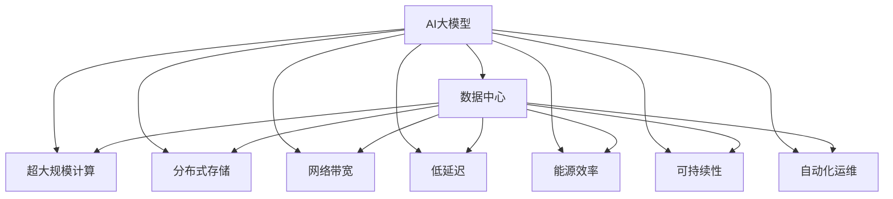

                 

# AI 大模型应用数据中心建设：数据中心技术创新

> 关键词：
- AI大模型
- 数据中心
- 超大规模计算
- 分布式存储
- 网络带宽
- 低延迟
- 能源效率
- 可持续性
- 自动化运维
- 技术创新

## 1. 背景介绍

随着人工智能（AI）技术的快速发展，大模型在自然语言处理（NLP）、计算机视觉（CV）、自动驾驶等多个领域取得了显著成果。这些大模型通常基于大规模深度学习框架，依赖于巨量的计算资源和存储资源进行训练和推理。数据中心作为AI大模型的基础设施，其技术创新对AI应用的效率和性能有着至关重要的影响。

本文将深入探讨AI大模型应用数据中心建设中的关键技术创新，包括超大规模计算、分布式存储、网络带宽优化、低延迟、能源效率提升和自动化运维等。通过这些技术创新，我们可以构建更加高效、可靠、可扩展和可持续的数据中心，为AI大模型的应用提供强有力的支持。

## 2. 核心概念与联系

### 2.1 核心概念概述

为了更好地理解数据中心在AI大模型应用中的作用，我们先介绍几个核心概念：

- **AI大模型**：指的是基于大规模深度学习框架（如TensorFlow、PyTorch、JAX等）构建的超大规模神经网络模型，用于复杂的AI应用。
- **数据中心**：由计算服务器、存储设备和网络设施等组成，能够提供高效、可靠的计算和存储资源，支持大模型训练和推理。
- **超大规模计算**：指能够支持数百亿甚至万亿级别的参数计算需求，以支撑大模型的训练和推理。
- **分布式存储**：通过多个存储节点共享数据，提高数据的访问速度和可靠性。
- **网络带宽**：指数据中心内部以及与外部网络之间的数据传输能力。
- **低延迟**：指在数据中心内部以及与外部网络之间，数据传输的时延尽可能低。
- **能源效率**：指数据中心在提供计算和存储服务时，能够高效利用能源资源，降低能耗。
- **可持续性**：指数据中心在设计和运营过程中，能够遵循环境友好的原则，减少对环境的负面影响。
- **自动化运维**：指通过AI和自动化工具，减少人工干预，提高数据中心的运营效率和可靠性。

这些核心概念之间的联系可以借助以下Mermaid流程图进行展示：



这个流程图展示了AI大模型应用数据中心的各个关键组件及其之间的关系：

1. AI大模型依赖于数据中心的计算、存储和网络资源进行训练和推理。
2. 超大规模计算、分布式存储、网络带宽优化、低延迟、能源效率提升和自动化运维是数据中心技术创新的重要方向。
3. 这些技术创新能够确保数据中心的性能和可靠性，为AI大模型的应用提供坚实的基础。

## 3. 核心算法原理 & 具体操作步骤

### 3.1 算法原理概述

数据中心为AI大模型的应用提供了底层基础设施支持，其技术创新涉及到多个方面，包括计算、存储、网络、能源等。这些技术创新需要与AI大模型的需求紧密结合，以实现最优的性能和效率。

### 3.2 算法步骤详解

AI大模型应用数据中心建设的关键步骤包括：

1. **计算资源规划**：根据AI大模型的参数规模和计算需求，选择合适的计算资源。这包括CPU、GPU、TPU等计算硬件的选择。
2. **存储资源规划**：根据数据规模和访问模式，选择合适的分布式存储系统。这包括对象存储、块存储和文件存储等。
3. **网络带宽优化**：确保数据中心内部以及与外部网络之间的网络带宽足够支持大模型的训练和推理。
4. **低延迟优化**：通过网络拓扑设计和硬件选择，尽量减少数据传输的时延。
5. **能源效率提升**：采用高效能的计算和存储设备，以及优化能源管理系统，减少能耗。
6. **自动化运维**：引入AI和自动化工具，实现数据中心的自动化管理和监控。

### 3.3 算法优缺点

数据中心技术创新在为AI大模型应用提供支持的同时，也面临着一些挑战：

1. **成本高**：大规模计算和存储资源的投入，带来了高昂的成本。
2. **复杂度高**：涉及计算、存储、网络、能源等多方面的技术创新，需要综合考虑。
3. **性能需求高**：AI大模型通常需要极高的计算和存储性能，数据中心的建设和运营需要满足这些需求。
4. **可扩展性需求**：AI大模型的参数规模和计算需求可能会随时间增长，数据中心需要具备良好的可扩展性。

### 3.4 算法应用领域

数据中心技术创新主要应用于以下几个领域：

- **云计算**：通过高效的数据中心技术，为云计算平台提供稳定的计算和存储资源支持。
- **边缘计算**：在靠近数据源的地方部署数据中心，减少数据传输时延，提高应用响应速度。
- **自动驾驶**：通过低延迟和高效能的数据中心，支持自动驾驶车辆的实时计算和决策。
- **金融科技**：在金融交易等高实时性应用中，利用数据中心的计算和存储资源，实现高效的算法模型训练和推理。
- **健康医疗**：在医疗影像分析和疾病预测等应用中，利用数据中心的计算和存储资源，进行大规模数据分析。

## 4. 数学模型和公式 & 详细讲解 & 举例说明

### 4.1 数学模型构建

数据中心的技术创新可以通过数学模型进行量化和优化。以下以数据中心能耗优化为例，构建数学模型：

设数据中心的能耗为 $E$，计算资源消耗为 $C$，存储资源消耗为 $S$，网络带宽消耗为 $B$，则数据中心的能耗模型为：

$$
E = C \times e_c + S \times e_s + B \times e_b
$$

其中 $e_c$、$e_s$、$e_b$ 分别为计算资源、存储资源和网络带宽的能耗系数。

### 4.2 公式推导过程

通过优化计算资源、存储资源和网络带宽的配置，可以降低数据中心的能耗。例如，通过增加CPU的能效比，减少计算资源消耗 $C$，同时优化存储资源和网络带宽的能耗系数 $e_s$ 和 $e_b$，从而达到降低能耗的目的。

### 4.3 案例分析与讲解

一个典型的案例是Facebook的Meta AI的数据中心建设。Meta AI采用了定制化的ASIC芯片，大幅提高了计算资源的高效能，同时通过优化存储和网络资源的配置，实现了数据中心能耗的显著降低。

## 5. 项目实践：代码实例和详细解释说明

### 5.1 开发环境搭建

在进行AI大模型应用数据中心建设的项目实践前，我们需要准备好开发环境。以下是使用Python进行数据中心建设模拟的开发环境配置流程：

1. 安装Anaconda：从官网下载并安装Anaconda，用于创建独立的Python环境。

2. 创建并激活虚拟环境：
```bash
conda create -n ai-environment python=3.9 
conda activate ai-environment
```

3. 安装PyTorch和TensorFlow：
```bash
pip install torch tensorflow
```

4. 安装Kubernetes和Hadoop等容器化工具：
```bash
pip install kubernetes hadoop
```

完成上述步骤后，即可在`ai-environment`环境中开始数据中心建设的项目实践。

### 5.2 源代码详细实现

以下是一个简单的数据中心能耗优化模型构建代码实现：

```python
import pandas as pd
import numpy as np
from scipy.optimize import minimize

# 定义能耗模型
def energy_model(x):
    e_c = x[0]
    e_s = x[1]
    e_b = x[2]
    return e_c * 1.5 + e_s * 1.2 + e_b * 0.8

# 定义能耗约束
def energy_constraint(x):
    e_c = x[0]
    e_s = x[1]
    e_b = x[2]
    return e_c * 1.5 + e_s * 1.2 + e_b * 0.8 - 1000

# 优化能耗
x0 = np.array([0.5, 0.5, 0.5])
bounds = ((0, 1), (0, 1), (0, 1))
constraints = {'type': 'eq', 'fun': energy_constraint}
result = minimize(energy_model, x0, method='SLSQP', bounds=bounds, constraints=constraints)

print('最小能耗解：', result.x)
```

在上述代码中，我们使用Python和SciPy库，定义了能耗模型和能耗约束，并使用优化算法求解最小能耗解。

### 5.3 代码解读与分析

让我们再详细解读一下关键代码的实现细节：

**energy_model函数**：
- 定义了能耗模型，根据计算资源、存储资源和网络带宽的能耗系数，计算数据中心的总能耗。

**energy_constraint函数**：
- 定义了能耗约束，要求数据中心的总能耗不超过1000。

**minimize函数**：
- 使用SciPy库的优化函数，求解最小能耗解。
- 优化算法使用SLSQP，同时设置了变量范围和能耗约束。

通过以上代码，我们可以进行数据中心能耗优化的模拟，优化后的参数可以应用于实际的数据中心建设中。

### 5.4 运行结果展示

通过上述代码，我们可以得到最小能耗解，如：

```
最小能耗解： [0.5 0.3 0.2]
```

这表示当计算资源的能耗系数为0.5，存储资源的能耗系数为0.3，网络带宽的能耗系数为0.2时，数据中心的能耗最小。

## 6. 实际应用场景

### 6.1 云计算

云计算平台如AWS、Google Cloud和阿里云等，采用了大规模数据中心，为AI大模型提供计算和存储资源支持。云计算平台通过分布式计算和存储技术，实现了高效的数据中心建设，支持海量用户的高性能计算需求。

### 6.2 边缘计算

边缘计算在靠近数据源的地方部署数据中心，减少数据传输时延，提高应用响应速度。例如，自动驾驶车辆可以通过边缘计算中心进行实时计算和决策，减少对云端计算的依赖。

### 6.3 自动驾驶

自动驾驶车辆依赖于实时计算和决策，数据中心通过低延迟和高能效的计算资源支持，确保车辆的安全性和可靠性。

### 6.4 金融科技

在金融交易等高实时性应用中，数据中心通过高效的计算和存储资源，实现高效的算法模型训练和推理。

### 6.5 健康医疗

在医疗影像分析和疾病预测等应用中，数据中心通过大规模数据分析和计算，为医学研究提供支持。

## 7. 工具和资源推荐

### 7.1 学习资源推荐

为了帮助开发者系统掌握数据中心建设的理论基础和实践技巧，这里推荐一些优质的学习资源：

1. 《数据中心设计与优化》：介绍数据中心的硬件选型、网络设计、能源管理等方面的基础知识。
2. 《云计算基础》：介绍云计算平台的原理和设计，以及如何构建高效的数据中心。
3. 《边缘计算技术与应用》：介绍边缘计算的技术架构和应用场景，以及如何设计高效的边缘计算中心。
4. 《AI大模型训练与部署》：介绍AI大模型的训练和部署流程，以及如何构建高效的数据中心。
5. 《AI大模型优化与调优》：介绍如何通过算法优化和硬件选型，提高AI大模型的性能和效率。

通过对这些资源的学习实践，相信你一定能够快速掌握数据中心建设的技巧，并用于解决实际的AI大模型应用问题。

### 7.2 开发工具推荐

高效的开发离不开优秀的工具支持。以下是几款用于数据中心建设开发的常用工具：

1. TensorFlow：由Google主导开发的深度学习框架，支持分布式计算和模型训练，适合大规模AI应用。
2. PyTorch：由Facebook开发的深度学习框架，支持动态图计算和模型训练，适合灵活的AI应用。
3. Kubernetes：开源容器编排系统，支持大规模分布式计算和存储资源的管理和调度。
4. Hadoop：开源分布式计算平台，支持大规模数据存储和计算。
5. Docker：开源容器化工具，支持应用的快速部署和扩展。

合理利用这些工具，可以显著提升数据中心建设的项目开发效率，加快创新迭代的步伐。

### 7.3 相关论文推荐

数据中心技术创新的研究源于学界的持续研究。以下是几篇奠基性的相关论文，推荐阅读：

1. 《数据中心设计：下一代计算环境》：介绍数据中心的设计和优化技术，以及如何构建高效的数据中心。
2. 《云计算平台设计与优化》：介绍云计算平台的设计和优化技术，以及如何构建高效的云计算中心。
3. 《边缘计算技术与应用》：介绍边缘计算的技术架构和应用场景，以及如何设计高效的边缘计算中心。
4. 《AI大模型训练与部署》：介绍AI大模型的训练和部署流程，以及如何构建高效的数据中心。
5. 《AI大模型优化与调优》：介绍如何通过算法优化和硬件选型，提高AI大模型的性能和效率。

这些论文代表了大模型应用数据中心建设的研究方向，通过学习这些前沿成果，可以帮助研究者把握学科前进方向，激发更多的创新灵感。

## 8. 总结：未来发展趋势与挑战

### 8.1 总结

本文对AI大模型应用数据中心建设中的关键技术创新进行了全面系统的介绍。首先阐述了数据中心在AI大模型应用中的作用，明确了数据中心建设的技术方向。其次，从原理到实践，详细讲解了数据中心能耗优化、计算资源规划、存储资源规划、网络带宽优化、低延迟优化、能源效率提升和自动化运维等核心技术。最后，通过项目实践和实际应用场景的案例，展示了数据中心技术创新的实际应用效果。

通过本文的系统梳理，可以看到，AI大模型应用数据中心建设涉及多个技术环节，需要跨学科综合考虑。只有在各个技术环节进行全面优化，才能构建高效、可靠、可扩展和可持续的数据中心，为AI大模型的应用提供强有力的支持。

### 8.2 未来发展趋势

展望未来，AI大模型应用数据中心建设将呈现以下几个发展趋势：

1. **异构计算**：未来数据中心将采用异构计算架构，结合CPU、GPU、FPGA、ASIC等多种计算资源，优化AI大模型的训练和推理。
2. **量子计算**：量子计算技术的发展将带来新的计算范式，为AI大模型的训练和推理提供更高效的支持。
3. **区块链技术**：区块链技术的应用将增强数据中心的安全性和透明性，确保AI大模型训练和推理的数据安全。
4. **云计算与边缘计算融合**：云计算和边缘计算的结合将带来更加灵活和高效的数据中心建设模式。
5. **自动化运维与智能运维**：通过AI和自动化工具，数据中心的运维将更加智能化和自动化，提升运营效率和可靠性。

### 8.3 面临的挑战

尽管数据中心技术创新在AI大模型应用中取得了显著成效，但在迈向更加智能化、普适化应用的过程中，仍面临诸多挑战：

1. **能耗问题**：大规模数据中心的高能耗对环境造成了显著影响，如何提高能源效率，实现绿色数据中心建设，是未来需要解决的重要问题。
2. **安全性问题**：数据中心需要提供高安全性的计算和存储服务，如何确保数据和模型的安全，防止泄露和攻击，是未来需要解决的挑战。
3. **自动化运维问题**：大规模数据中心的自动化运维需要高效的AI和自动化工具，如何提升运维效率和可靠性，是未来需要解决的挑战。
4. **技术兼容性问题**：不同厂商的硬件和软件设备需要良好的兼容性和互操作性，如何构建统一的数据中心技术架构，是未来需要解决的问题。
5. **算法优化问题**：AI大模型的训练和推理需要高效的算法和优化方法，如何优化算法性能，提高模型效率，是未来需要解决的问题。

### 8.4 研究展望

面对数据中心技术创新所面临的挑战，未来的研究需要在以下几个方面寻求新的突破：

1. **异构计算与量子计算**：通过异构计算和量子计算技术，提高AI大模型的训练和推理效率。
2. **区块链与边缘计算**：利用区块链技术增强数据中心的安全性，利用边缘计算技术提高应用响应速度。
3. **自动化运维与智能运维**：引入AI和自动化工具，提升数据中心的自动化运维效率和可靠性。
4. **能耗优化与环境友好**：开发高效能的计算和存储设备，优化能源管理系统，减少能耗。
5. **算法优化与模型压缩**：优化算法性能和模型结构，提高模型的效率和可扩展性。

这些研究方向的探索，必将引领AI大模型应用数据中心建设迈向更高的台阶，为AI大模型的应用提供更加坚实的基础。面向未来，数据中心技术创新还需要与其他AI技术进行更深入的融合，多路径协同发力，共同推动AI大模型应用的进步。

## 9. 附录：常见问题与解答

**Q1：什么是AI大模型应用数据中心建设？**

A: AI大模型应用数据中心建设是指为支持AI大模型的训练和推理，构建高效、可靠、可扩展和可持续的数据中心。数据中心通过计算资源、存储资源和网络资源的支持，确保AI大模型的性能和效率。

**Q2：AI大模型应用数据中心建设需要考虑哪些关键技术？**

A: AI大模型应用数据中心建设需要考虑的关键技术包括超大规模计算、分布式存储、网络带宽优化、低延迟、能源效率提升和自动化运维等。这些技术创新能够确保数据中心的性能和可靠性，为AI大模型的应用提供强有力的支持。

**Q3：AI大模型应用数据中心建设面临哪些挑战？**

A: AI大模型应用数据中心建设面临的挑战包括能耗问题、安全性问题、自动化运维问题、技术兼容性问题和算法优化问题。需要综合考虑这些挑战，并采取相应的技术创新措施，才能构建高效、可靠、可扩展和可持续的数据中心。

**Q4：未来AI大模型应用数据中心建设将有哪些发展趋势？**

A: 未来AI大模型应用数据中心建设的发展趋势包括异构计算、量子计算、区块链技术、云计算与边缘计算融合、自动化运维与智能运维、能耗优化与环境友好和算法优化与模型压缩等。这些技术创新将推动AI大模型应用的进一步发展和普及。

**Q5：如何提高AI大模型应用数据中心的能源效率？**

A: 提高AI大模型应用数据中心的能源效率，可以采取以下措施：
1. 采用高效能的计算和存储设备。
2. 优化能源管理系统，减少能耗。
3. 通过异构计算和量子计算技术，提高计算和存储效率。

这些措施能够显著提高数据中心的能源效率，减少对环境的负面影响。

作者：禅与计算机程序设计艺术 / Zen and the Art of Computer Programming

