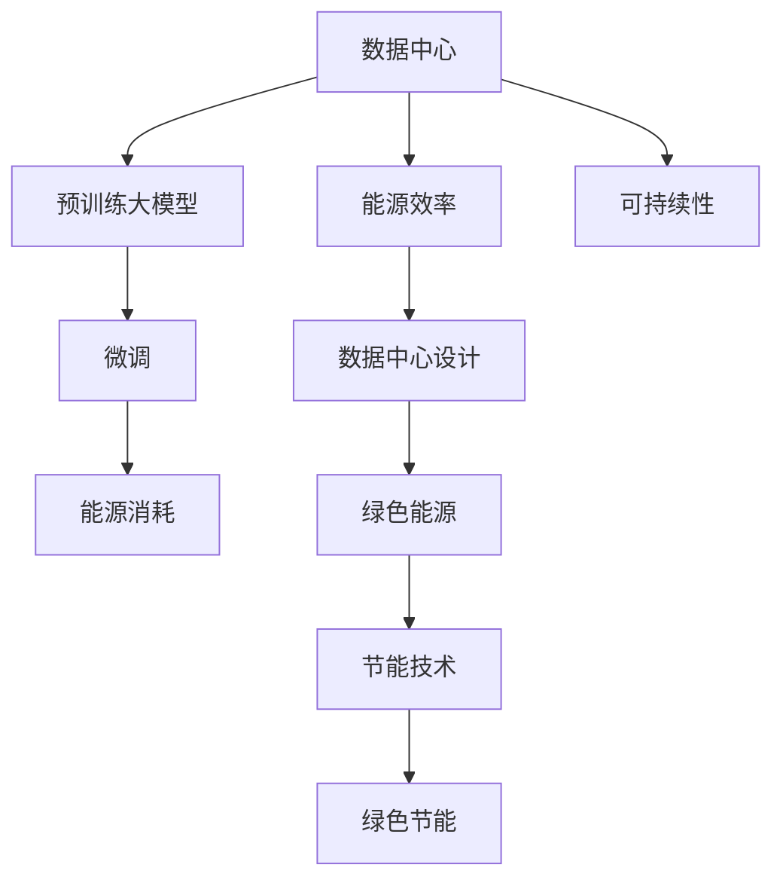

                 

# AI 大模型应用数据中心建设：数据中心绿色节能

> 关键词：AI、大模型、数据中心、绿色节能、数据中心设计、能源效率、可持续性

## 1. 背景介绍

### 1.1 问题由来
随着人工智能技术的飞速发展，特别是深度学习算法的广泛应用，大模型的训练和部署成为企业和研究机构的热点。然而，大模型的训练和推理过程需要大量的计算资源，特别是在能源消耗方面。数据中心作为大模型的关键部署环境，能源消耗问题日益突出。因此，如何在确保数据中心能够有效运作的同时，减少能源消耗，实现绿色节能成为一个迫切的需求。

### 1.2 问题核心关键点
在设计和运营数据中心时，存在以下关键问题：
- 大模型的训练和推理对能源消耗非常高，尤其是在硬件方面。
- 数据中心的高能源消耗导致成本增加，影响企业的经济效益。
- 能源消耗问题不仅影响经济效益，也会对环境造成负面影响。

### 1.3 问题研究意义
研究数据中心的绿色节能技术，对于提高能源使用效率，减少对环境的影响，降低企业运营成本，都具有重要的意义：
1. 提升能源效率。通过高效的数据中心设计和操作，可以显著减少能源消耗，提升能源使用效率。
2. 降低成本。节能技术的实施可以显著减少运营成本，提升企业的经济效益。
3. 减少环境影响。通过绿色节能技术的实施，减少对环境的负面影响，促进可持续发展。

## 2. 核心概念与联系

### 2.1 核心概念概述

在这一节，我们将引入一些核心概念，并通过Mermaid流程图来展示它们之间的联系。

- **预训练大模型**：预先训练的深度学习模型，具有较强的泛化能力，可以在多个任务上微调。
- **微调**：利用小量标注数据对预训练模型进行调整，以适应特定任务的需求。
- **数据中心**：支持企业数据和应用程序的处理、存储和分发的设施。
- **绿色能源**：可再生能源如太阳能、风能等，与数据中心的能源需求相匹配。
- **能源效率**：能源的使用效率，通过数据中心设计优化来提升。
- **可持续性**：指数据中心的长期可持续运营，关注环境和社会影响。
- **数据中心设计**：数据中心的物理和逻辑结构，影响其能源消耗和可持续性。
- **绿色节能**：数据中心的能源节约和环境保护实践，包括使用节能设备、优化系统设计等。



### 2.2 核心概念联系
数据中心是大模型训练和推理的核心基础设施。通过预训练大模型的微调，数据中心可以提供强大的计算能力来处理复杂的AI任务。然而，这一过程同时导致了大量能源的消耗。为了解决这一问题，需要采用绿色能源，并提高数据中心的能源效率。数据中心的设计优化和能源管理策略对于实现这一目标至关重要。

## 3. 核心算法原理 & 具体操作步骤
### 3.1 算法原理概述

在设计数据中心时，需要考虑以下关键的算法原理和操作步骤：

- **数据中心物理设计**：数据中心的物理布局会影响能源消耗和可持续性。例如，使用空调和照明设备的数量会影响能耗。
- **系统架构**：数据中心的系统架构，如计算、存储和网络系统的设计，也会影响能耗。合理的系统架构可以减少设备的数量，降低能耗。
- **能源管理**：数据中心需要实施有效的能源管理策略，包括使用节能设备和优化能源使用模式。
- **冷却系统**：数据中心的冷却系统是影响能耗的关键因素。使用高效的冷却系统可以显著减少能耗。

### 3.2 算法步骤详解
具体步骤包括：
1. **需求分析**：首先，对数据中心的能源消耗进行详细的分析，识别能耗的主要来源。
2. **设计优化**：根据分析结果，对数据中心的物理设计和系统架构进行优化。
3. **实施节能技术**：实施绿色能源和节能技术，包括使用太阳能和风能，以及优化数据中心的能源管理策略。
4. **监测和评估**：监测数据中心的能源消耗，并定期评估节能措施的效果。

### 3.3 算法优缺点
使用AI大模型应用数据中心建设的绿色节能技术的优缺点包括：
- **优点**：能够显著减少数据中心的能源消耗，降低成本，减少对环境的影响。
- **缺点**：初期投资可能较高，需要专业知识和技术来实施和维护。

### 3.4 算法应用领域
这些技术可以应用于所有需要大规模计算和数据处理的行业，包括科技、金融、医疗和教育等。

## 4. 数学模型和公式 & 详细讲解 & 举例说明
### 4.1 数学模型构建
数据中心的能源消耗可以通过以下数学模型进行建模：

$$
E = P \times T
$$

其中 $E$ 是能源消耗，$P$ 是功率，$T$ 是时间。

### 4.2 公式推导过程
对于具体的数据中心，可以使用以下公式来计算能源消耗：

$$
E = P_{cpu} \times T_{cpu} + P_{memory} \times T_{memory} + P_{storage} \times T_{storage}
$$

其中 $P_{cpu}$、$P_{memory}$ 和 $P_{storage}$ 分别是CPU、内存和存储设备的功率，$T_{cpu}$、$T_{memory}$ 和 $T_{storage}$ 分别是这三类设备运行的时间。

### 4.3 案例分析与讲解
例如，如果一个数据中心使用了10台服务器，每台服务器的功率为1.5千瓦，它们每天运行12小时，那么数据中心的能源消耗可以计算如下：

$$
E = 10 \times 1.5 \times 12 \times 24 = 4320 kWh
$$

## 5. 项目实践：代码实例和详细解释说明
### 5.1 开发环境搭建

在进行项目实践时，首先需要搭建开发环境。这里我们可以使用Python进行开发：

```bash
pip install numpy pandas scikit-learn matplotlib
```

### 5.2 源代码详细实现

以下是一个简单的示例，用于计算数据中心的能源消耗：

```python
import numpy as np

def calculate_energy_consumption(powers, times):
    total_power = np.sum(powers)
    total_time = np.sum(times)
    energy_consumption = total_power * total_time
    return energy_consumption

# 假设数据中心有10台服务器，每台服务器的功率为1.5千瓦
powers = np.array([1.5]*10)
times = np.array([12]*10)  # 每天12小时

energy_consumption = calculate_energy_consumption(powers, times)
print(f"能源消耗：{energy_consumption} kWh")
```

### 5.3 代码解读与分析

代码首先定义了一个计算能源消耗的函数。该函数接收功率数组和时间数组作为输入，并返回能源消耗的总值。然后，假设数据中心有10台服务器，每台服务器的功率为1.5千瓦，它们每天运行12小时，计算出能源消耗为4320千瓦时。

### 5.4 运行结果展示

通过运行上述代码，得到能源消耗的计算结果，作为设计优化的依据。

## 6. 实际应用场景
### 6.4 未来应用展望

随着技术的不断进步，数据中心的设计和运营将越来越注重可持续性和环境保护。未来，我们可以预见到更多的绿色能源技术将被应用于数据中心，能源效率将得到进一步提升，数据中心将更加符合可持续发展的原则。

## 7. 工具和资源推荐
### 7.1 学习资源推荐

对于想要深入了解数据中心设计和可持续发展的读者，以下是一些建议的学习资源：

1. 《数据中心的未来：绿色、智能、自动化》：一本介绍数据中心未来的发展趋势和绿色技术的书籍。
2. 《数据中心设计与运营》：一本详细介绍数据中心设计和运营的书籍，适合专业人士。
3. 《可持续数据中心：绿色数据中心的设计与管理》：一本专门探讨可持续数据中心设计和管理的书籍。

### 7.2 开发工具推荐

以下是一些有助于数据中心设计和运营的工具：

1. Power BI：一个数据可视化工具，用于分析和监控数据中心的能源消耗。
2. Prometheus：一个开源的监控和警报工具，用于监控数据中心的性能和健康状况。
3. Grafana：一个开源的数据可视化和监控平台，用于创建和分享仪表板。

### 7.3 相关论文推荐

以下是一些与数据中心可持续性相关的推荐论文：

1. "Green Data Centers: A Survey and Future Directions"：一篇综述文章，介绍了绿色数据中心的现状和未来发展方向。
2. "Energy Efficiency in Data Centers: A Review"：一篇综述文章，介绍了数据中心能源效率的相关研究。

## 8. 总结：未来发展趋势与挑战
### 8.1 研究成果总结

本文总结了数据中心在实现绿色节能方面的研究成果。通过对数据中心的能源消耗进行分析，并提出了一系列的优化策略和技术，旨在减少能源消耗，提高数据中心的可持续性。

### 8.2 未来发展趋势

在未来，数据中心的设计和运营将更加注重可持续性和环境保护。随着技术的不断进步，数据中心将越来越多地采用绿色能源，提高能源效率。

### 8.3 面临的挑战

数据中心的绿色节能面临多种挑战，包括初始投资的高昂、技术的复杂性、以及如何在保证可持续性和性能的同时，降低运营成本等。

### 8.4 研究展望

在未来的研究中，我们将继续探索如何提高数据中心的可持续性，减少能源消耗，并开发出更加高效的绿色能源技术，以实现数据中心的可持续运营。

## 9. 附录：常见问题与解答
### 9.1 Q: 如何确定数据中心的能源消耗？

A: 数据中心的能源消耗可以通过对服务器、空调、照明等设备的功率和运行时间进行计算得出。

### 9.2 Q: 什么是绿色能源？它是如何应用在数据中心中的？

A: 绿色能源是指可再生能源，如太阳能、风能等。这些能源可以通过太阳能板或风力涡轮机等设备在数据中心中使用。

### 9.3 Q: 数据中心如何降低能源消耗？

A: 数据中心可以通过实施节能技术，如使用高效的服务器和设备、优化数据中心的物理设计和系统架构等，来降低能源消耗。

---

作者：禅与计算机程序设计艺术 / Zen and the Art of Computer Programming

