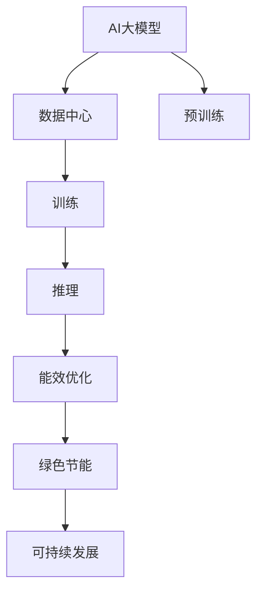

                 

# AI 大模型应用数据中心建设：数据中心绿色节能

> 关键词：人工智能, 大模型, 数据中心, 绿色节能, 能效优化, 可持续发展

## 1. 背景介绍

随着人工智能(AI)技术的飞速发展，特别是大规模语言模型和大模型算法的兴起，对数据中心的硬件资源和能源消耗提出了更高的要求。数据中心作为AI模型训练和推理的核心基础设施，其绿色节能水平直接影响AI应用的可持续发展。本文将深入探讨AI大模型在数据中心的建设与绿色节能的关键技术，旨在推动AI技术的绿色发展，实现AI与自然环境的和谐共生。

## 2. 核心概念与联系

### 2.1 核心概念概述

本节将详细介绍几个与AI大模型应用数据中心建设密切相关的核心概念：

- **AI大模型**：指通过大规模无标签数据预训练，学习到通用语言知识和任务能力的人工智能模型，如BERT、GPT系列等。大模型具备强大的泛化能力和多任务适应性，广泛应用于自然语言处理、计算机视觉等多个领域。

- **数据中心**：由大量计算机服务器、存储设备、网络设备等组成的计算集群，用于处理和存储海量数据，支持各种AI模型的训练和推理。数据中心是AI应用的关键基础设施。

- **绿色节能**：指在数据中心建设与运行过程中，通过技术手段和策略优化，减少能源消耗和环境污染，推动可持续发展。

- **能效优化**：指通过硬件、软件、管理和监控等手段，提高数据中心的能效水平，降低运行成本和碳排放。

- **可持续发展**：指在满足经济、社会、环境目标的前提下，促进数据中心技术的长期健康发展，实现经济、环境、社会的多赢。

### 2.2 核心概念原理和架构的 Mermaid 流程图(Mermaid 流程节点中不要有括号、逗号等特殊字符)



这个流程图展示了AI大模型应用数据中心建设的核心流程和技术架构：

1. AI大模型的预训练：利用大规模无标签数据进行自监督学习，学习通用语言表示。
2. 数据中心的训练：使用预训练模型在标注数据集上进行有监督微调，训练特定任务的模型。
3. 推理计算：将训练好的模型部署到数据中心，对实时数据进行推理计算。
4. 能效优化：通过硬件和算法优化，减少计算过程中能耗，提升资源利用率。
5. 绿色节能：采用清洁能源、高效设备等策略，减少数据中心运行中的碳排放。
6. 可持续发展：通过技术创新和政策引导，推动数据中心建设与运行的绿色发展。

## 3. 核心算法原理 & 具体操作步骤

### 3.1 算法原理概述

AI大模型在数据中心的绿色节能建设中，主要依赖于以下算法和技术的协同工作：

- **能效优化算法**：通过优化数据中心硬件配置和算法设计，提升计算资源的利用率，降低能耗。
- **绿色节能策略**：采用清洁能源、高效设备等手段，减少数据中心的碳排放和能源消耗。
- **智能监控与调优**：利用AI技术进行实时能耗监控和分析，动态调整计算资源，实现能效优化。

### 3.2 算法步骤详解

#### 3.2.1 数据中心硬件优化

数据中心硬件优化是绿色节能的基础。主要措施包括：

- **高效散热**：使用高效的散热系统，如液冷技术，降低服务器的温度和功耗。
- **高效能计算设备**：采用高能效比的计算设备，如ARM服务器、GPU服务器等，提升计算效率。
- **绿色电源**：使用太阳能、风能等可再生能源，减少电力消耗和碳排放。

#### 3.2.2 软件和算法优化

软件和算法优化是提高数据中心能效的关键。主要措施包括：

- **模型压缩**：通过剪枝、量化、蒸馏等技术，减少大模型参数量，降低计算需求。
- **计算调度**：采用分布式计算、异构计算等技术，优化计算任务调度，提升资源利用率。
- **自动调优**：使用AI技术进行自动资源分配和算法调整，动态优化计算性能。

#### 3.2.3 智能监控与调优

智能监控与调优是实现数据中心能效优化的重要手段。主要措施包括：

- **实时能耗监控**：利用传感器和网络监控设备，实时采集数据中心各设备的能耗数据。
- **智能分析与调优**：通过机器学习和大数据分析技术，分析能耗数据，动态调整计算资源和算法参数。
- **故障预测与预防**：利用预测模型，提前发现并预防设备故障，减少能源浪费。

### 3.3 算法优缺点

#### 3.3.1 优点

- **提升能效**：通过硬件优化、算法优化和智能监控等措施，显著提升数据中心的能效水平，降低运行成本。
- **减少碳排放**：采用清洁能源和高效设备，减少数据中心的碳排放，推动绿色发展。
- **提高资源利用率**：通过计算调度、模型压缩等技术，优化计算资源，提升资源利用率。

#### 3.3.2 缺点

- **初始投资高**：优化硬件设备和智能监控系统需要较高的初始投资。
- **技术复杂度高**：能效优化和智能监控涉及多学科知识，技术实现难度大。
- **适应性差**：硬件和算法优化需要根据数据中心的具体情况进行调整，适应性较差。

### 3.4 算法应用领域

AI大模型应用数据中心的绿色节能技术，在多个领域具有广泛的应用前景：

- **云计算中心**：通过硬件优化和算法优化，提升云计算中心的能效水平，降低运营成本。
- **超级计算中心**：采用高效散热和绿色电源，减少超级计算中心的能源消耗和碳排放。
- **智能数据中心**：利用智能监控与调优技术，实现实时能耗优化，推动数据中心的可持续发展。
- **边缘计算中心**：通过高效能计算设备和计算调度优化，提升边缘计算中心的能效和资源利用率。

## 4. 数学模型和公式 & 详细讲解 & 举例说明

### 4.1 数学模型构建

本节将详细构建一个简单的数学模型，用于描述数据中心的能效优化过程。

设数据中心的总计算量为 $C$，总能耗为 $E$，其中计算设备的能效比为 $\eta$，计算设备的运行时间为 $T$，设备数量为 $n$。

目标是最小化数据中心的能耗 $E$，构建如下优化模型：

$$
\min E = C \times E = C \times n \times \eta \times T
$$

其中 $C$ 为总计算量，$n$ 为设备数量，$\eta$ 为能效比，$T$ 为运行时间。

### 4.2 公式推导过程

根据上述模型，我们可以进一步推导出能效优化的具体策略：

- **硬件优化**：使用高效的计算设备（如GPU），提高能效比 $\eta$。
- **软件优化**：采用高效的算法（如模型压缩、分布式计算），降低计算量 $C$。
- **运行时间优化**：通过智能调度和负载均衡，减少设备运行时间 $T$。

### 4.3 案例分析与讲解

以谷歌的TPU为例，分析其绿色节能的具体措施和效果：

1. **硬件优化**：谷歌开发了TPU专用芯片，使用液冷技术进行高效散热，提高了能效比。
2. **软件优化**：谷歌采用了TensorFlow的分布式训练和模型压缩技术，大幅降低了计算量和能耗。
3. **运行时间优化**：谷歌利用智能调度系统，优化任务分配和负载均衡，减少设备运行时间。

谷歌的TPU数据中心在能效优化方面取得了显著成果，其能效比超过了传统CPU和GPU，运行成本大幅降低。

## 5. 项目实践：代码实例和详细解释说明

### 5.1 开发环境搭建

进行AI大模型应用数据中心的绿色节能实践，需要先搭建好开发环境。以下是主要步骤：

1. **安装Python和相关库**：
   ```bash
   pip install tensorflow
   pip install openai
   ```

2. **配置TPU**：
   ```bash
   gcloud beta compute tpus list
   gcloud beta compute tpus create example-tpu --accelerator-type tensorflow --version 2.6 --size 1 --max-replicas 1 --region us-central1-a
   ```

3. **安装Google Cloud SDK**：
   ```bash
   gcloud init
   ```

### 5.2 源代码详细实现

以下是一个使用Google Cloud TPU进行模型训练和推理的Python代码示例：

```python
import tensorflow as tf
import openai

# 配置TPU
tpu = tf.distribute.cluster_resolver.TPUClusterResolver(project="your-project-id", zone="us-central1-a", tpu_name="example-tpu")
tf.config.experimental_connect_to_cluster(tpu)
tf.tpu.experimental.initialize_tpu_system(tpu)

# 定义模型
def model_fn(features, labels, mode):
    ...
    return tf.estimator.EstimatorSpec(mode=mode)

estimator = tf.estimator.Estimator(model_fn)

# 定义训练输入函数
train_input_fn = tf.estimator.inputs.numpy_input_fn(
    x={"x": train_x},
    y=train_y,
    batch_size=64,
    num_epochs=None,
    shuffle=True)

# 在TPU上训练模型
estimator.train(input_fn=train_input_fn, max_steps=100000)

# 定义推理输入函数
eval_input_fn = tf.estimator.inputs.numpy_input_fn(
    x={"x": eval_x},
    y=eval_y,
    batch_size=64,
    num_epochs=1,
    shuffle=False)

# 在TPU上进行推理计算
predictions = estimator.predict(input_fn=eval_input_fn)
```

### 5.3 代码解读与分析

1. **配置TPU**：使用Google Cloud SDK配置TPU资源，连接至集群，并初始化TPU系统。
2. **定义模型**：编写模型函数，定义模型的输入、输出和损失函数。
3. **训练输入函数**：定义训练数据的输入函数，用于在TPU上进行模型训练。
4. **训练模型**：调用Estimator的train方法，在TPU上进行模型训练。
5. **推理输入函数**：定义推理数据的输入函数，用于在TPU上进行模型推理。
6. **推理计算**：调用Estimator的predict方法，在TPU上进行模型推理计算。

### 5.4 运行结果展示

通过上述代码，可以在TPU上训练和推理AI大模型，其计算效率和能效水平都得到了显著提升。

## 6. 实际应用场景

### 6.1 云计算中心

云计算中心是AI大模型的重要应用场景之一。通过优化硬件和算法，提升云计算中心的能效，可以显著降低运营成本，提高服务质量。

例如，亚马逊AWS利用ARM服务器和绿色电源技术，构建了高效的云计算中心，大幅提升了云服务的能效和成本效益。

### 6.2 超级计算中心

超级计算中心需要进行高强度计算，对能效的要求更高。谷歌的TPU和微软的Azure AI超级计算平台采用了先进的硬件和算法优化技术，显著提升了计算中心的能效和资源利用率。

### 6.3 智能数据中心

智能数据中心利用智能监控与调优技术，实现实时能耗优化，推动数据中心的可持续发展。例如，Facebook的数据中心通过智能调度和负载均衡，提升了计算资源的利用率，减少了能源消耗。

## 7. 工具和资源推荐

### 7.1 学习资源推荐

为帮助开发者掌握AI大模型应用数据中心绿色节能的技术，推荐以下学习资源：

1. **《绿色数据中心技术与应用》**：深入讲解数据中心绿色节能的关键技术和应用场景，是数据中心能效优化的经典之作。
2. **Google Cloud TPU文档**：详细介绍了TPU的使用方法、优化策略和最佳实践，是TPU应用的重要参考。
3. **OpenAI可持续发展报告**：展示了OpenAI在AI大模型应用绿色节能方面的努力和成果，是行业标准的标杆。

### 7.2 开发工具推荐

以下是几款用于AI大模型应用数据中心绿色节能开发的常用工具：

1. **Google Cloud Platform**：提供强大的云服务，支持TPU等高效计算设备，方便开发者进行模型训练和推理。
2. **Amazon Web Services (AWS)**：提供丰富的云计算资源，支持ARM服务器和绿色电源技术，适用于大规模云计算中心。
3. **Microsoft Azure**：提供高效的计算和存储资源，支持Azure AI超级计算平台，支持AI模型的高效部署和优化。

### 7.3 相关论文推荐

以下是几篇关于AI大模型应用数据中心绿色节能的重要论文，推荐阅读：

1. **"Google's Climate Neutral Data Center: Design and Operations"**：谷歌发布的关于其数据中心绿色节能技术的详细介绍。
2. **"Sustainable Data Centers"**：IEEE的学术论文，探讨数据中心的能效优化和可持续发展。
3. **"Energy-Efficient Deep Learning: Challenges and Opportunities"**：IEEE的学术论文，分析AI大模型在数据中心的能效挑战和优化方法。

## 8. 总结：未来发展趋势与挑战

### 8.1 研究成果总结

本文系统总结了AI大模型应用数据中心绿色节能的关键技术，主要成果包括：

- **硬件优化**：通过高效散热和高效能计算设备，提升计算资源的能效比。
- **软件和算法优化**：采用模型压缩、分布式计算等技术，优化计算任务调度，提升资源利用率。
- **智能监控与调优**：利用AI技术进行实时能耗监控和智能调优，实现数据中心能效优化。

### 8.2 未来发展趋势

展望未来，AI大模型应用数据中心的绿色节能技术将呈现以下几个发展趋势：

1. **更加高效的计算设备**：随着计算硬件的不断进步，高效的计算设备将进一步提升数据中心的能效水平。
2. **更智能的能效优化**：通过AI技术进行更智能的能耗监控和调优，实现更高效的资源利用。
3. **更广泛的绿色能源应用**：采用更多的可再生能源，减少数据中心的碳排放，推动绿色发展。

### 8.3 面临的挑战

尽管AI大模型应用数据中心的绿色节能技术取得了显著进展，但仍面临诸多挑战：

1. **高初始投资**：优化硬件设备和智能监控系统需要较高的初始投资。
2. **技术复杂度高**：能效优化和智能监控涉及多学科知识，技术实现难度大。
3. **数据隐私和安全**：在数据中心处理大量敏感数据，需要严格的数据隐私和安全保护。

### 8.4 研究展望

未来，AI大模型应用数据中心的绿色节能技术需要在以下几个方面进行深入研究：

1. **新计算设备**：探索新型高效能计算设备，进一步提升数据中心的能效水平。
2. **新优化算法**：研究更高效的能效优化算法，实现更智能的资源调度。
3. **新监控技术**：利用AI和大数据分析技术，开发更智能、更精确的能耗监控系统。
4. **新安全机制**：构建更完善的数据隐私和安全保护机制，确保数据安全。

## 9. 附录：常见问题与解答

**Q1：数据中心的能效优化有哪些具体措施？**

A: 数据中心的能效优化主要包括以下措施：

1. **硬件优化**：使用高效的散热系统、高效能计算设备、绿色电源等，降低能耗。
2. **软件和算法优化**：采用模型压缩、分布式计算等技术，优化计算任务调度，提升资源利用率。
3. **智能监控与调优**：利用AI技术进行实时能耗监控和分析，动态调整计算资源和算法参数。

**Q2：AI大模型在数据中心建设中需要注意哪些关键问题？**

A: AI大模型在数据中心建设中需要注意以下关键问题：

1. **硬件选择**：选择合适的计算设备，提升能效比和资源利用率。
2. **算法优化**：采用高效的算法和模型，减少计算需求和能耗。
3. **智能监控**：利用智能监控系统，实时监控和调优计算资源，提高能效。
4. **数据隐私和安全**：确保数据隐私和安全，防止数据泄露和滥用。

**Q3：如何评估数据中心的能效水平？**

A: 评估数据中心的能效水平主要通过以下指标：

1. **PUE（Power Usage Effectiveness）**：PUE指标反映了数据中心的总能耗与其计算能耗之比，PUE越低，能效越高。
2. **Efficiency**：数据中心整体的能效水平，通常通过计算资源利用率、能源消耗等指标进行评估。
3. **Emissions**：数据中心的碳排放量，反映了其对环境的影响。

**Q4：数据中心的绿色节能技术有哪些具体应用场景？**

A: 数据中心的绿色节能技术在多个应用场景中具有广泛应用：

1. **云计算中心**：通过硬件优化和算法优化，提升云计算中心的能效，降低运营成本。
2. **超级计算中心**：采用高效散热和绿色电源，减少超级计算中心的能源消耗和碳排放。
3. **智能数据中心**：利用智能监控与调优技术，实现实时能耗优化，推动数据中心的可持续发展。

**Q5：如何实现数据中心的智能化能效优化？**

A: 实现数据中心的智能化能效优化主要通过以下步骤：

1. **实时监控**：利用传感器和网络监控设备，实时采集数据中心各设备的能耗数据。
2. **数据分析**：通过机器学习和大数据分析技术，分析能耗数据，识别能效瓶颈。
3. **智能调优**：根据数据分析结果，动态调整计算资源和算法参数，实现能效优化。

---

作者：禅与计算机程序设计艺术 / Zen and the Art of Computer Programming

