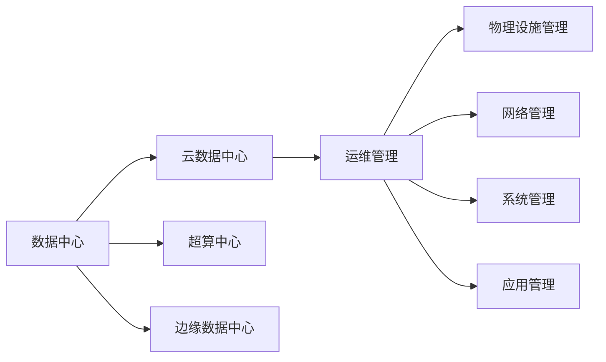

                 

## 1. 背景介绍

随着人工智能技术的迅猛发展，大模型成为实现智能化决策的核心工具。从图像识别到自然语言处理，大模型的应用范围遍及多个行业。然而，大模型的高性能背后，是庞大的数据中心基础设施支撑。数据中心不仅是硬件设备的堆叠，更是一整套复杂的运维管理体系。本文将从数据中心运维与管理的角度，探讨如何高效构建与维护大模型应用所需的数据中心。

## 2. 核心概念与联系

### 2.1 核心概念概述

- **数据中心**：是指具有特定规模、集成的物理设施，能够满足各种IT设施的运行需求，包括计算、存储、网络、电力供应等。

- **云数据中心**：是一种按需提供的IT基础设施，用户可灵活扩展，以适应业务需求变化。

- **超算中心**：是专为高性能计算而设计的设施，包含大量的GPU、CPU等资源。

- **边缘数据中心**：通常部署在靠近用户的应用场景，以减少延迟，满足低延迟、高可靠性的需求。

- **运维管理**：指对数据中心的物理设施、网络、系统、应用进行监测、维护和优化，保障其正常运行。

### 2.2 核心概念联系（注：使用 Mermaid 流程节点表示核心概念间的联系，以无括号、逗号等特殊字符）



此图展示了数据中心与不同类型数据中心之间的关系，以及数据中心运维管理所涉及的各个环节。

## 3. 核心算法原理 & 具体操作步骤

### 3.1 算法原理概述

在数据中心的运维管理中，以下核心算法原理尤为关键：

- **设备监控与健康管理**：通过传感器、网关等硬件，收集服务器、网络设备等资产的运行状态数据，利用异常检测算法实时监控设备健康状态，及时发现潜在问题，并发出告警。

- **资源调度和负载均衡**：根据业务负载变化，动态调整计算和存储资源，确保资源的高效利用。

- **网络优化**：通过网络切片、带宽分配等技术，提升数据中心网络传输效率，减少网络拥塞和延迟。

- **能效管理**：通过优化设备能耗、电源管理等手段，提升数据中心整体能效。

- **安全监控**：利用入侵检测、威胁情报等技术，保障数据中心的网络安全。

### 3.2 算法步骤详解

运维管理通常包括以下关键步骤：

**Step 1: 数据中心规划与设计**
- 定义数据中心的规模和功能定位，如计算、存储、网络等资源需求。
- 规划物理位置和基础设施布局，确保未来扩展性。
- 设计网络架构、电力供应、空调系统等，保障稳定运行。

**Step 2: 硬件采购与部署**
- 选择适当的硬件设备，包括服务器、存储、网络设备等。
- 根据规划进行设备安装、连接，并进行网络配置和硬件调试。
- 对设备进行基础性能测试，确保满足要求。

**Step 3: 监控与告警**
- 配置监控系统，采集硬件设备、应用系统的运行状态数据。
- 设置告警规则，实时检测设备异常和性能下降，并自动发送告警。
- 分析告警数据，及时采取措施，防止问题扩大。

**Step 4: 资源调度和负载均衡**
- 根据业务负载变化，自动调整计算和存储资源分配。
- 优化网络带宽分配，确保数据流均衡。
- 实时监控资源使用情况，避免资源浪费和过载。

**Step 5: 能效管理和安全监控**
- 对设备能耗进行监控和优化，如关闭不必要的硬件资源、使用节能技术等。
- 设置网络安全策略，防止外部攻击和内部泄露。
- 定期进行安全漏洞扫描和补丁管理，保障数据中心安全。

**Step 6: 维护与升级**
- 制定设备维护计划，定期进行硬件维护、软件升级等操作。
- 监控维护效果，确保系统稳定运行。
- 根据业务需求和技术趋势，对数据中心进行技术升级和功能扩展。

### 3.3 算法优缺点

**优点**：
- 自动化的运维管理，降低了人力成本。
- 实时监控和告警，提高了故障处理效率。
- 高效的资源调度和负载均衡，提升了系统利用率。
- 能效管理有助于降低运营成本。
- 安全监控保障了数据中心的安全性。

**缺点**：
- 初期规划和设计复杂，需要专业团队支持。
- 硬件采购和部署成本高，需充分考虑预算。
- 监控和告警系统复杂，需要专业技能支持。
- 资源调度和能效管理依赖于先进技术，需持续投入。
- 安全监控需要定期更新和维护，成本较高。

### 3.4 算法应用领域

数据中心运维与管理在大模型应用中具有广泛的应用：

- **云计算平台**：通过云数据中心，用户可以按需获取计算、存储资源，实现灵活扩展。
- **超算中心**：支持深度学习模型训练，提供高性能计算能力。
- **边缘计算**：部署在靠近用户的应用场景，满足低延迟需求。
- **大数据分析**：通过数据中心的数据存储和管理能力，支持大规模数据处理和分析。
- **物联网应用**：边缘数据中心支持海量设备的连接和管理，提升数据传输效率。

## 4. 数学模型和公式 & 详细讲解 & 举例说明

### 4.1 数学模型构建

在数据中心运维管理中，通常需要构建以下数学模型：

- **资源需求预测模型**：用于预测未来业务负载变化，优化资源分配。
- **能耗优化模型**：通过计算设备能耗和运行时间，优化能效管理。
- **故障检测与诊断模型**：利用异常检测算法，及时发现设备故障。

### 4.2 公式推导过程

**资源需求预测模型**
假设当前资源需求为 $R_t$，历史资源需求序列为 $D=\{R_1, R_2, ..., R_t\}$，使用自回归移动平均模型（ARMA）进行预测：

$$
R_{t+1} = \alpha_0 + \sum_{i=1}^p \alpha_i R_{t-i} + \sum_{j=1}^q \beta_j \epsilon_{t-j}
$$

其中 $\alpha_i$ 和 $\beta_j$ 为模型参数，$\epsilon_t$ 为误差项。

**能耗优化模型**
假设设备能耗为 $E_t$，运行时间为 $T_t$，能效优化目标为最小化单位时间能耗 $E_t / T_t$：

$$
\min_{T_t} E_t / T_t \quad s.t. \quad T_t \times E_t = E
$$

其中 $E$ 为总能耗。

**故障检测与诊断模型**
假设设备运行状态为 $S_t$，设备健康阈值为 $\theta$，使用条件概率模型：

$$
P(S_t = 1 | S_{t-1}) = \sigma(\beta_0 + \sum_{i=1}^k \beta_i S_{t-i})
$$

其中 $\sigma$ 为逻辑函数，$S_t = 1$ 表示设备健康，$S_t = 0$ 表示设备故障。

### 4.3 案例分析与讲解

以某云数据中心为例，其资源需求预测模型和能效优化模型的实现步骤如下：

**资源需求预测模型**
- 收集历史资源使用数据，建立ARMA模型。
- 利用历史数据进行参数训练，得到预测模型。
- 根据模型预测未来资源需求，优化资源分配。

**能效优化模型**
- 计算各设备运行能耗和运行时间。
- 基于历史数据，建立能耗优化模型，并优化能效。
- 实时监控能效指标，确保数据中心运行效率。

## 5. 项目实践：代码实例和详细解释说明

### 5.1 开发环境搭建

- **操作系统**：Linux（如Ubuntu、CentOS）
- **监控系统**：Nagios、Zabbix
- **网络管理系统**：SNMP（Simple Network Management Protocol）
- **数据中心管理平台**：Cobbler、GlusterFS

### 5.2 源代码详细实现

以Nagios监控系统的配置为例，其代码实现步骤如下：

```python
# 定义Nagios配置文件
nagios_config = {
    'command': 'check_cputation',
    'command_type': 'usercommand',
    'command_arg': 'run'
}

# 定义监控规则
monitoring_rules = {
    'server1': {
        'check_type': 'cpu',
        'threshold': 80
    },
    'server2': {
        'check_type': 'memory',
        'threshold': 90
    }
}

# 启动Nagios服务
nagios_service = NagiosService(nagios_config, monitoring_rules)
nagios_service.start()

# 在Nagios客户端上查询监控状态
nagios_client = NagiosClient()
nagios_client.query_status('server1')
```

**代码解读与分析**：
- 定义Nagios配置文件和监控规则，设置检查类型和阈值。
- 创建NagiosService实例，启动监控服务。
- 使用NagiosClient查询监控状态。

### 5.3 运行结果展示

通过Nagios监控系统，可以实时显示服务器CPU使用率、内存使用率等指标，当某服务器CPU使用率超过80%或内存使用率超过90%时，Nagios会自动发送告警邮件，提示运维人员进行及时处理。

## 6. 实际应用场景

数据中心运维与管理在大模型应用中有着广泛的应用：

- **云计算平台**：通过云数据中心，用户可以按需获取计算、存储资源，实现灵活扩展。
- **超算中心**：支持深度学习模型训练，提供高性能计算能力。
- **边缘计算**：部署在靠近用户的应用场景，满足低延迟需求。
- **大数据分析**：通过数据中心的数据存储和管理能力，支持大规模数据处理和分析。
- **物联网应用**：边缘数据中心支持海量设备的连接和管理，提升数据传输效率。

## 7. 工具和资源推荐

### 7.1 学习资源推荐

1. **《运维之道》系列书籍**：详细介绍数据中心运维管理的理论和技术，涵盖物理设施管理、网络管理、系统管理等多个方面。
2. **RedHat System Administrator Guide**：讲解Linux系统管理员的日常操作和问题解决。
3. **OpenStack官方文档**：介绍OpenStack云平台的部署和运维。
4. **Zabbix用户手册**：详细讲解Zabbix监控系统的配置和使用。
5. **Nagios官方文档**：提供Nagios监控系统的安装、配置和操作指南。

### 7.2 开发工具推荐

1. **Cobbler**：自动化Linux系统安装和配置工具，支持快速创建和管理虚拟机。
2. **GlusterFS**：分布式文件系统，支持海量数据存储和分布式管理。
3. **Nagios**：开源监控系统，支持大规模数据中心的监控和管理。
4. **Zabbix**：网络监控系统，支持实时数据采集和告警管理。
5. **Ansible**：自动化运维工具，支持批量系统部署和配置管理。

### 7.3 相关论文推荐

1. **《数据中心运维管理技术发展综述》**：详细介绍数据中心运维管理的理论和技术。
2. **《云数据中心网络设计与安全策略》**：讲解云数据中心的网络设计和安全策略。
3. **《大数据中心能效管理技术研究》**：探讨大数据中心的能效管理技术。
4. **《边缘计算技术与应用》**：介绍边缘计算的架构和应用。
5. **《物联网边缘数据中心研究》**：探讨物联网边缘数据中心的建设和管理。

## 8. 总结：未来发展趋势与挑战

### 8.1 研究成果总结

大模型应用的数据中心建设涉及多个领域的技术和理论，以下是对相关研究的总结：

1. **云计算平台**：通过云数据中心，用户可以按需获取计算、存储资源，实现灵活扩展。
2. **超算中心**：支持深度学习模型训练，提供高性能计算能力。
3. **边缘计算**：部署在靠近用户的应用场景，满足低延迟需求。
4. **大数据分析**：通过数据中心的数据存储和管理能力，支持大规模数据处理和分析。
5. **物联网应用**：边缘数据中心支持海量设备的连接和管理，提升数据传输效率。

### 8.2 未来发展趋势

展望未来，数据中心运维与管理将呈现以下几个发展趋势：

1. **智能化运维**：通过AI技术，实现设备故障预测、资源自动调整等智能化管理。
2. **边缘计算普及**：随着5G、物联网的普及，边缘数据中心将成为数据处理的重要方式。
3. **能效管理优化**：结合能源管理技术，优化数据中心能耗，降低运营成本。
4. **安全防护加强**：结合区块链、人工智能技术，加强数据中心的安全防护。
5. **云计算技术演进**：云数据中心将更加灵活、高效，支持更多新兴应用。

### 8.3 面临的挑战

尽管数据中心运维与管理在技术上有了长足进步，但仍面临以下挑战：

1. **资源需求预测**：对未来业务负载变化预测的准确性存在一定挑战。
2. **能效管理**：大规模数据中心能效管理仍需技术突破。
3. **安全防护**：网络攻击和数据泄露的风险依然存在。
4. **智能化管理**：AI技术在运维中的应用还需进一步成熟。
5. **边缘计算部署**：边缘数据中心的部署和维护成本较高。

### 8.4 研究展望

面对未来挑战，需从以下方向进行探索：

1. **智能运维技术**：利用AI技术，提升设备预测和故障诊断的准确性。
2. **边缘计算优化**：优化边缘计算的架构和部署方式，降低部署成本。
3. **能效管理创新**：结合新技术，优化数据中心能效管理。
4. **安全防护增强**：引入新安全技术，保障数据中心的安全性。
5. **云计算演进**：推动云计算技术的持续创新，提供更灵活、高效的服务。

## 9. 附录：常见问题与解答

**Q1: 数据中心运维管理需要哪些关键技术？**

A: 数据中心运维管理需要以下关键技术：
- 资源需求预测
- 能效优化
- 设备监控与健康管理
- 故障检测与诊断
- 网络优化
- 安全防护

**Q2: 数据中心建设需要考虑哪些因素？**

A: 数据中心建设需要考虑以下因素：
- 物理位置和基础设施布局
- 网络架构和电力供应
- 硬件设备和存储容量
- 能效管理和环境控制

**Q3: 数据中心运维管理的难点有哪些？**

A: 数据中心运维管理的难点包括：
- 资源需求预测的准确性
- 能效管理的优化
- 设备故障的及时诊断
- 网络攻击的防范
- 智能运维的实现

**Q4: 如何保障数据中心的安全性？**

A: 保障数据中心安全性的方法包括：
- 物理安全措施，如门禁、监控等
- 网络安全策略，如防火墙、入侵检测等
- 数据加密和备份
- 定期进行安全漏洞扫描和补丁管理

**Q5: 边缘计算的优势有哪些？**

A: 边缘计算的优势包括：
- 低延迟
- 高带宽
- 数据本地化
- 降低网络拥塞
- 支持实时计算

作者：禅与计算机程序设计艺术 / Zen and the Art of Computer Programming

