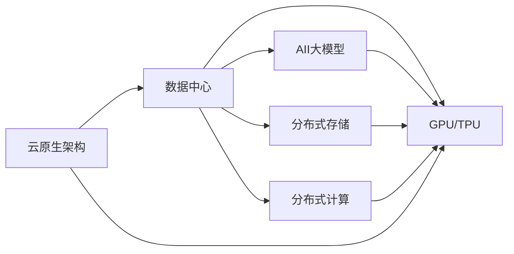

                 

# AI 大模型应用数据中心建设：数据中心运营与管理

在人工智能的浪潮中，大模型（Large Model）已经成为了技术发展的重要驱动力。随着模型规模的不断增大，其对数据中心（Data Center）的依赖也日益凸显。本文将围绕AI大模型应用的数据中心建设，系统探讨数据中心的运营与管理问题，希望能为相关从业者提供有价值的参考。

## 1. 背景介绍

### 1.1 问题由来
随着深度学习模型的不断演进，大模型（如GPT-3、BERT等）逐渐走入公众视野。这些模型凭借其强大的语言生成能力和泛化能力，在自然语言处理（NLP）、计算机视觉（CV）等任务中取得了显著成果。然而，模型的大规模参数量和计算需求，也对数据中心的存储、计算、网络等基础设施提出了更高的要求。因此，如何高效运行和管理数据中心，以支持AI大模型的部署与应用，成为当前数据中心运营的一个重点难点。

### 1.2 问题核心关键点
AI大模型的运行需求主要体现在以下几个方面：

1. **存储需求**：大模型训练和推理涉及海量的数据和参数，存储系统需具备高速读写能力和大容量存储能力。
2. **计算需求**：大模型在训练和推理时需要大量的计算资源，包括GPU、TPU等硬件设备。
3. **网络需求**：大模型往往需要高带宽、低延迟的网络环境，以保证数据传输效率。
4. **能效需求**：数据中心需优化能耗，降低运营成本，并确保高效稳定的运行环境。

针对以上需求，本文将围绕数据中心的存储、计算、网络、能效管理等核心问题展开详细讨论。

## 2. 核心概念与联系

### 2.1 核心概念概述

在讨论数据中心管理之前，先梳理几个关键概念：

- **数据中心（Data Center）**：一种包含高性能计算机集群、存储系统、网络设备、安全设施的设施，用于支持企业数据的计算、存储、传输等需求。
- **AI大模型（Large AI Model）**：指模型参数量在亿级以上的深度学习模型，具备强大的泛化能力和生成能力。
- **GPU/TPU**：用于高性能计算的硬件设备，特别适用于深度学习模型的训练和推理。
- **分布式存储**：通过多台存储设备的协同工作，提供高可靠、高扩展的数据存储服务。
- **分布式计算**：通过多台计算设备的并行计算，加速复杂任务的求解。
- **云原生架构**：一种基于云计算技术的架构，通过弹性伸缩、微服务、自动化部署等技术，实现资源的高效利用和快速响应。

这些概念之间的关系可以通过以下Mermaid流程图来展示：



这个流程图展示了数据中心支持AI大模型应用的各个方面，包括硬件设施、存储系统、计算资源、网络环境以及云原生架构。这些环节相互协作，共同构建了一个高效稳定的AI大模型运行环境。

## 3. 核心算法原理 & 具体操作步骤

### 3.1 算法原理概述

AI大模型的应用对数据中心的各个组件提出了特殊要求。以数据中心的存储为例，需要支持高吞吐量、低延迟的读写操作，并具备高可靠性、高扩展性。以下是数据中心存储系统的主要原理和操作步骤：

- **高吞吐量、低延迟**：通过使用高速存储设备（如SSD、NVMe）和优化数据访问路径，减少I/O延迟，提高数据读写效率。
- **高可靠性**：采用冗余存储和备份机制，确保数据在系统故障或硬件故障时不丢失。
- **高扩展性**：通过分布式存储技术，如Hadoop、Ceph等，支持大规模数据的存储和访问。

### 3.2 算法步骤详解

以下是数据中心存储系统的具体操作步骤：

1. **选择合适的存储设备**：根据数据中心的需求，选择适合的存储设备，如SSD、NVMe、HDD等。
2. **数据冗余与备份**：使用RAID技术、数据副本等手段，确保数据的可靠性和冗余性。
3. **优化数据访问路径**：使用缓存、预取等技术，减少数据访问延迟。
4. **分布式存储架构**：采用Hadoop、Ceph等分布式存储技术，支持大规模数据的存储和访问。
5. **性能监控与调优**：通过监控工具，如Prometheus、Grafana等，实时监控存储系统的性能，并进行调优。

### 3.3 算法优缺点

数据中心存储系统有以下优点：

- **高可靠性**：通过冗余存储和备份机制，确保数据的安全性和可靠性。
- **高扩展性**：分布式存储技术支持大规模数据的存储和访问。
- **高效性**：优化数据访问路径，提高数据读写效率。

但同时也存在以下缺点：

- **高成本**：高可靠性和高扩展性往往伴随着高昂的成本。
- **复杂性**：分布式存储系统设计复杂，需要专门的人才进行管理和维护。
- **延迟问题**：虽然通过优化可以减少延迟，但在某些场景下仍难以避免。

### 3.4 算法应用领域

数据中心存储系统在AI大模型应用中，主要应用于以下几个领域：

- **模型训练数据存储**：存储大规模的训练数据，支持模型的快速训练。
- **模型参数存储**：存储模型的参数和中间结果，便于模型的检索和重新加载。
- **中间数据存储**：存储模型在推理过程中的中间数据，如特征向量、计算结果等。

## 4. 数学模型和公式 & 详细讲解 & 举例说明

### 4.1 数学模型构建

在数据中心管理中，常常使用数学模型来优化存储系统的性能。以存储系统的吞吐量为目标，可以使用以下数学模型进行建模：

$$
\text{Throughtput} = \frac{\text{Data Rate}}{\text{Delay} + \text{Overhead}}
$$

其中，Data Rate表示数据传输速率，Delay表示数据传输延迟，Overhead表示额外的开销。

### 4.2 公式推导过程

通过上述模型，可以推导出如何通过优化数据传输速率、减少传输延迟和降低额外开销来提高存储系统的吞吐量。

### 4.3 案例分析与讲解

假设数据中心使用SSD作为存储设备，读写延迟分别为10ms和15ms，数据传输速率为1GB/s。通过优化访问路径，可以将延迟降低至5ms。那么，该系统的吞吐量计算如下：

$$
\text{Throughtput} = \frac{1GB/s}{5ms + 15ms} = 128MB/s
$$

通过优化，存储系统的吞吐量提高了60%。

## 5. 项目实践：代码实例和详细解释说明

### 5.1 开发环境搭建

在进行数据中心存储系统开发前，需要搭建相应的开发环境。以下是使用Python和Django进行数据中心管理系统的环境配置流程：

1. **安装Python和Django**：
   ```
   conda install python=3.8
   pip install django
   ```

2. **创建Django项目**：
   ```
   django-admin startproject dc_manager
   cd dc_manager
   ```

3. **创建Django应用**：
   ```
   python manage.py startapp storage_system
   ```

4. **配置数据库**：
   在settings.py文件中配置数据库连接信息。

5. **安装第三方库**：
   ```
   pip install django-storages[images]
   ```

### 5.2 源代码详细实现

以下是数据中心存储系统的前端和后端代码实现：

#### 前端代码

```html
<!-- index.html -->
<h1>Data Center Storage System</h1>
<ul>
    <li><a href="">Storage List</a></li>
    <li><a href="">Create Storage</a></li>
</ul>
```

#### 后端代码

```python
# views.py
from django.shortcuts import render
from .models import Storage

def storage_list(request):
    storage_list = Storage.objects.all()
    return render(request, 'storage_list.html', {'storage_list': storage_list})

def storage_create(request):
    if request.method == 'POST':
        name = request.POST.get('name')
        capacity = request.POST.get('capacity')
        read_speed = request.POST.get('read_speed')
        write_speed = request.POST.get('write_speed')
        Storage.objects.create(name=name, capacity=capacity, read_speed=read_speed, write_speed=write_speed)
        return redirect('storage_list')
    return render(request, 'storage_create.html')
```

#### 模型代码

```python
# models.py
from django.db import models

class Storage(models.Model):
    name = models.CharField(max_length=100)
    capacity = models.IntegerField()
    read_speed = models.FloatField()
    write_speed = models.FloatField()
```

### 5.3 代码解读与分析

以下是代码实现的详细解读：

- **路由配置**：在前端代码中，使用Django的URL路由配置，将不同的URL请求映射到相应的视图函数。
- **模型定义**：在后端代码中，定义了Storage模型，用于存储设备的属性。
- **视图函数**：定义了两个视图函数，分别用于列出所有存储设备和创建新的存储设备。
- **模板渲染**：使用Django的模板系统，将数据渲染到HTML模板中，展示存储设备的信息。

### 5.4 运行结果展示

运行上述代码，访问数据中心管理系统，可以看到存储设备的信息列表。通过增加新的存储设备，可以对存储系统进行动态管理。

## 6. 实际应用场景

### 6.1 数据中心存储优化

在AI大模型的训练和推理过程中，存储系统的优化是至关重要的。以下是几种常见的存储优化方法：

- **缓存技术**：使用缓存系统（如Redis、Memcached）缓存高频访问的数据，减少数据库的I/O压力。
- **数据分片**：将数据分散存储到多个物理存储设备上，提高读写效率和可用性。
- **存储分层**：将热数据和冷数据分别存储在高速存储设备和低速存储设备上，优化存储成本。
- **数据压缩**：使用压缩算法（如Gzip、Snappy）压缩数据，减少存储空间和I/O开销。

### 6.2 数据中心计算优化

AI大模型的训练和推理需要大量的计算资源，以下是几种常见的计算优化方法：

- **硬件升级**：增加GPU、TPU等高性能计算设备，提升计算能力。
- **分布式计算**：使用Spark、Flink等分布式计算框架，实现任务并行计算。
- **优化算法**：使用优化的深度学习算法（如TensorRT）加速模型推理。
- **动态扩展**：通过弹性计算云（如AWS EC2、Google Cloud Compute）实现动态资源扩展，满足突发计算需求。

### 6.3 数据中心网络优化

数据中心的网络优化也是AI大模型应用的重要组成部分。以下是几种常见的网络优化方法：

- **高速网络设备**：使用高性能网络交换机和路由器，提高网络传输速率。
- **网络分区**：将网络划分为不同的子网或VLAN，优化网络带宽和隔离性。
- **负载均衡**：使用负载均衡设备（如Nginx）均衡计算负载，提高系统可靠性。
- **网络加密**：使用SSL/TLS等加密技术，保护数据传输安全。

## 7. 工具和资源推荐

### 7.1 学习资源推荐

为了帮助开发者系统掌握数据中心管理的技术，这里推荐一些优质的学习资源：

1. **Django官方文档**：详细介绍了Django框架的使用和配置。
2. **Django-rest-framework**：基于Django的RESTful API框架，支持API开发。
3. **Django-storages**：提供多种第三方存储后端，支持云存储、本地存储等。
4. **Cloudflare**：提供高性能的CDN服务，加速数据传输。
5. **AWS、Google Cloud、Microsoft Azure**：三大云计算平台，提供丰富的云资源和工具。

通过对这些资源的学习实践，相信你一定能够快速掌握数据中心管理的关键技术，并用于解决实际的存储、计算、网络等问题。

### 7.2 开发工具推荐

高效的开发离不开优秀的工具支持。以下是几款用于数据中心管理系统开发的常用工具：

1. **Django**：基于Python的Web框架，支持快速开发和部署。
2. **Django-rest-framework**：提供RESTful API开发的支持，方便前后端数据交互。
3. **Git**：版本控制工具，用于代码管理和协同开发。
4. **JIRA**：项目管理和任务跟踪工具，帮助团队高效协作。
5. **Ansible**：自动化运维工具，支持自动化配置和管理。

合理利用这些工具，可以显著提升数据中心管理系统的开发效率，加快创新迭代的步伐。

### 7.3 相关论文推荐

数据中心管理技术的发展源于学界的持续研究。以下是几篇奠基性的相关论文，推荐阅读：

1. **Data Center Fundamentals**：作者Glen Gruver，详细介绍了数据中心的设计和运营。
2. **High-Performance Storage Systems**：作者Jeffery D. Erickson，介绍了高性能存储系统的设计原理和优化方法。
3. **A Survey on Cloud Storage Systems**：作者Zhu Guangjun，综述了云存储系统的发展现状和未来趋势。
4. **Distributed Computing in the Cloud**：作者Andrew Ng，探讨了云计算中的分布式计算问题。
5. **Cloud-Native Architecture Patterns**：作者Jez Humble，介绍了云原生架构的原理和实践。

这些论文代表了大模型数据中心管理技术的发展脉络。通过学习这些前沿成果，可以帮助研究者把握学科前进方向，激发更多的创新灵感。

## 8. 总结：未来发展趋势与挑战

### 8.1 总结

本文对基于AI大模型应用的数据中心建设进行了全面系统的介绍。首先阐述了数据中心管理的相关背景和意义，明确了数据中心在AI大模型应用中的关键作用。其次，从原理到实践，详细讲解了数据中心的存储、计算、网络等核心问题，给出了数据中心管理系统的完整代码实例。同时，本文还广泛探讨了数据中心在AI大模型应用中的实际场景，展示了数据中心管理的广阔前景。最后，本文精选了数据中心管理的各类学习资源，力求为读者提供全方位的技术指引。

通过本文的系统梳理，可以看到，数据中心在AI大模型应用中的重要性日益凸显，如何高效运行和管理数据中心，以支持AI大模型的部署与应用，成为当前数据中心运营的一个重点难点。未来，伴随数据中心技术的不断演进，数据中心管理必将在构建高效稳定的AI大模型运行环境中发挥越来越重要的作用。

### 8.2 未来发展趋势

展望未来，数据中心管理技术将呈现以下几个发展趋势：

1. **智能化管理**：引入AI技术，如机器学习、深度学习等，进行自动化的资源管理。
2. **自动化运维**：通过自动化运维工具（如Ansible、Chef），实现数据的自动部署、配置和管理。
3. **边缘计算**：将数据中心部分功能下沉到边缘节点，减少数据传输延迟，提高计算效率。
4. **绿色数据中心**：通过优化能源消耗，实现数据中心的环保运营。
5. **混合云管理**：融合公有云、私有云、边缘云等多种云资源，实现灵活的资源调度。

以上趋势凸显了数据中心管理技术的广阔前景。这些方向的探索发展，必将进一步提升数据中心管理的效率和稳定性，为AI大模型的应用提供更坚实的基础。

### 8.3 面临的挑战

尽管数据中心管理技术已经取得了显著进展，但在迈向更加智能化、自动化管理的过程中，它仍面临诸多挑战：

1. **复杂性管理**：随着数据中心规模的扩大，管理复杂度显著增加，需要更加智能化的管理工具。
2. **安全性和合规性**：数据中心管理涉及大量敏感数据，需确保数据安全和合规性。
3. **成本控制**：数据中心的建设和管理需要大量资金投入，需优化成本控制策略。
4. **可靠性与可用性**：数据中心是企业核心数据和应用的承载体，需保证高可靠性和高可用性。
5. **新技术适配**：随着新技术的不断涌现，数据中心需及时更新和适配，以保持竞争力。

正视数据中心管理面临的这些挑战，积极应对并寻求突破，将是大模型数据中心管理走向成熟的必由之路。相信随着学界和产业界的共同努力，这些挑战终将一一被克服，数据中心管理必将在构建高效稳定的AI大模型运行环境中发挥越来越重要的作用。

### 8.4 未来突破

面对数据中心管理所面临的种种挑战，未来的研究需要在以下几个方面寻求新的突破：

1. **引入AI和机器学习技术**：通过AI和机器学习技术，进行智能化的资源管理和故障预测。
2. **优化数据中心架构**：引入边缘计算、微服务架构等技术，优化数据中心的硬件和软件结构。
3. **绿色能源技术**：通过引入绿色能源技术，如太阳能、风能等，实现数据中心的节能减排。
4. **多云融合技术**：研究跨云资源调度和管理技术，实现数据中心的多云融合。
5. **自动化运维工具**：开发更加智能、易用的自动化运维工具，降低运维复杂度。
6. **安全性提升**：引入区块链、零信任等技术，提高数据中心的安全性。

这些研究方向的探索，必将引领数据中心管理技术迈向更高的台阶，为构建高效稳定的AI大模型运行环境提供更坚实的保障。总之，数据中心管理需要从硬件、软件、运维等多个维度进行全面优化，才能更好地支持AI大模型的部署与应用。只有勇于创新、敢于突破，才能不断拓展数据中心管理的边界，让AI大模型技术更好地造福人类社会。

## 9. 附录：常见问题与解答

**Q1：数据中心如何支持AI大模型的部署？**

A: 数据中心支持AI大模型的部署，主要通过以下方式：

1. **高性能计算资源**：提供GPU、TPU等高性能计算设备，满足大模型的计算需求。
2. **高速存储系统**：提供高速存储设备（如SSD、NVMe）和分布式存储系统，支持大规模数据的存储和访问。
3. **高带宽网络**：提供高速网络设备和网络分区机制，确保数据传输速率和可靠性。
4. **能效优化**：采用绿色能源技术，优化数据中心的能耗，降低运营成本。

**Q2：如何提高数据中心的存储效率？**

A: 提高数据中心存储效率的方法包括：

1. **缓存技术**：使用缓存系统（如Redis、Memcached）缓存高频访问的数据，减少数据库的I/O压力。
2. **数据分片**：将数据分散存储到多个物理存储设备上，提高读写效率和可用性。
3. **存储分层**：将热数据和冷数据分别存储在高速存储设备和低速存储设备上，优化存储成本。
4. **数据压缩**：使用压缩算法（如Gzip、Snappy）压缩数据，减少存储空间和I/O开销。

**Q3：数据中心计算资源如何优化？**

A: 优化数据中心计算资源的方法包括：

1. **硬件升级**：增加GPU、TPU等高性能计算设备，提升计算能力。
2. **分布式计算**：使用Spark、Flink等分布式计算框架，实现任务并行计算。
3. **优化算法**：使用优化的深度学习算法（如TensorRT）加速模型推理。
4. **动态扩展**：通过弹性计算云（如AWS EC2、Google Cloud Compute）实现动态资源扩展，满足突发计算需求。

**Q4：数据中心网络如何优化？**

A: 优化数据中心网络的方法包括：

1. **高速网络设备**：使用高性能网络交换机和路由器，提高网络传输速率。
2. **网络分区**：将网络划分为不同的子网或VLAN，优化网络带宽和隔离性。
3. **负载均衡**：使用负载均衡设备（如Nginx）均衡计算负载，提高系统可靠性。
4. **网络加密**：使用SSL/TLS等加密技术，保护数据传输安全。

**Q5：数据中心如何实现智能化管理？**

A: 实现数据中心智能化管理的方法包括：

1. **引入AI和机器学习技术**：通过AI和机器学习技术，进行智能化的资源管理和故障预测。
2. **自动化运维工具**：开发更加智能、易用的自动化运维工具，降低运维复杂度。
3. **多云融合技术**：研究跨云资源调度和管理技术，实现数据中心的多云融合。
4. **绿色能源技术**：通过引入绿色能源技术，如太阳能、风能等，实现数据中心的节能减排。

这些问题的解答，希望能为你提供参考，帮助你在实际工作中更好地应对数据中心管理的挑战。

---

作者：禅与计算机程序设计艺术 / Zen and the Art of Computer Programming

