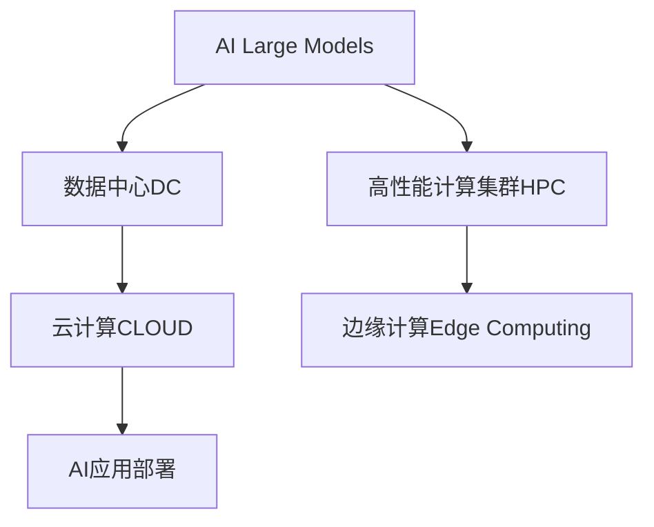

                 

# AI 大模型应用数据中心建设：数据中心运营与管理

## 1. 背景介绍

### 1.1 问题由来
人工智能(AI)大模型在自然语言处理、计算机视觉、语音识别等领域的突破性进展，为各行各业带来了前所未有的机遇。然而，大模型的训练和部署对数据中心的基础设施提出了极高的要求，涉及数据中心规划、硬件采购、网络配置、系统部署等多个环节。如何高效、安全、可靠地建设和运营大模型数据中心，成为当前AI应用开发中的一个关键问题。

### 1.2 问题核心关键点
本文聚焦于数据中心的运营与管理，涵盖以下几个关键点：

1. **基础设施的硬件需求**：大模型训练和推理需要高性能的GPU、TPU等计算资源，以及大量的内存和存储设备。
2. **网络和存储架构**：高效的网络带宽和稳定的存储系统是支持大模型数据流动的关键。
3. **计算资源管理**：如何分配和管理计算资源，以最大化利用率和提高服务效率。
4. **数据安全和隐私保护**：在数据中心的运营过程中，如何保护数据安全和隐私，防止数据泄露和滥用。
5. **监控和优化**：通过监控和优化工具，实时调整数据中心运营策略，确保系统稳定运行。

这些核心关键点构成了大模型应用数据中心建设的框架，其运营与管理水平直接影响AI应用的性能和可靠性。

## 2. 核心概念与联系

### 2.1 核心概念概述

为更好地理解大模型应用数据中心的运营与管理，本节将介绍几个密切相关的核心概念：

- **人工智能大模型(AI Large Models)**：指具有大规模参数量、广泛应用场景和卓越性能的深度学习模型，如BERT、GPT、DALL-E等。
- **数据中心(Data Center, DC)**：为计算和存储需求提供支撑的设施，包括服务器、网络、存储、电源等硬件设备和相应管理软件。
- **高性能计算集群(High-Performance Computing, HPC)**：由多台高性能计算设备组成，能够协同处理大规模计算任务的系统。
- **云计算(CLOUD)**：通过互联网提供按需计算服务，支持弹性资源扩展和灵活应用部署。
- **边缘计算(Edge Computing)**：在靠近数据源的本地设备上进行数据处理，减少数据传输和延迟，提升计算效率。

这些核心概念之间的逻辑关系可以通过以下Mermaid流程图来展示：



这个流程图展示了AI大模型与数据中心、高性能计算、云计算和边缘计算之间的关系：

1. AI大模型训练和推理依赖于高性能计算集群和数据中心。
2. 数据中心可以部署在云计算平台，提供按需计算资源。
3. 边缘计算可以与数据中心协同，增强计算和存储的灵活性和响应速度。
4. AI应用通过云计算和边缘计算，灵活部署在数据中心，实现按需服务。

## 3. 核心算法原理 & 具体操作步骤
### 3.1 算法原理概述

大模型应用数据中心的运营与管理，核心在于如何高效利用数据中心的硬件资源，确保计算任务的安全、稳定和可靠。以下是核心算法原理：

1. **资源分配策略**：通过负载均衡、资源池化等策略，合理分配计算资源，最大化利用率和降低能耗。
2. **网络优化技术**：采用高速网络、负载均衡、流量控制等技术，保证数据中心内部和外部的网络通信效率。
3. **存储系统设计**：优化存储架构，采用高吞吐量、低延迟的存储设备，支持大规模数据流存储和访问。
4. **数据安全和隐私保护**：采用数据加密、访问控制、审计记录等措施，保护数据安全和隐私。
5. **监控和优化**：通过实时监控和性能优化工具，及时发现和解决系统运行中的问题，提高系统可用性。

### 3.2 算法步骤详解

基于上述原理，以下详细描述大模型应用数据中心运营与管理的关键步骤：

**Step 1: 基础设施建设**

1. **数据中心选址和规划**：选择地理位置适中、电力供应稳定、网络带宽充足的地方作为数据中心，并根据业务需求和预算进行规划设计。
2. **硬件采购和部署**：根据计算任务需求，选择合适的GPU、TPU、内存和存储设备，并进行安装和配置。
3. **网络架构设计**：设计高效的网络架构，包括高速以太网、光纤网络和负载均衡设备，确保数据传输的可靠性和速度。
4. **系统部署和测试**：安装操作系统、数据库、中间件等软件，进行系统配置和测试，确保硬件和软件协同工作。

**Step 2: 计算资源管理**

1. **资源池化和分配**：将数据中心内的计算资源集中管理，采用虚拟化技术进行资源池化，根据任务需求动态分配计算资源。
2. **负载均衡和调度和优化**：使用负载均衡技术和调度算法，均衡计算负载，避免资源瓶颈，提高资源利用率。
3. **自动扩缩容和弹性计算**：根据任务需求动态调整计算资源，支持弹性计算，适应不同的业务流量变化。

**Step 3: 网络和存储优化**

1. **网络优化**：采用高速网络、负载均衡和流量控制等技术，确保数据中心内部和外部的网络通信效率。
2. **存储系统设计**：优化存储架构，采用高吞吐量、低延迟的存储设备，支持大规模数据流存储和访问。
3. **数据备份和灾难恢复**：设计数据备份和灾难恢复方案，确保数据安全和业务连续性。

**Step 4: 数据安全和隐私保护**

1. **数据加密和传输安全**：采用数据加密技术，确保数据在传输和存储过程中的安全。
2. **访问控制和审计记录**：建立严格的访问控制机制，记录和审计数据访问行为，防止未授权访问。
3. **数据隔离和隐私保护**：对敏感数据进行隔离和保护，避免数据泄露和滥用。

**Step 5: 监控和优化**

1. **实时监控和报警**：部署监控工具，实时监控系统运行状态，设置报警阈值，及时发现和处理问题。
2. **性能优化和调优**：通过性能分析和调优工具，优化系统性能，提高服务效率。
3. **安全审计和改进**：定期进行安全审计，发现和修复潜在的安全漏洞，不断提升系统的安全性。

通过上述步骤，可以高效运营和管理大模型应用数据中心，确保系统的稳定、可靠和安全。

### 3.3 算法优缺点

大模型应用数据中心运营与管理算法具有以下优点：

1. **资源利用率高**：通过资源池化和动态分配策略，最大化计算资源的利用率，避免资源浪费。
2. **网络通信高效**：采用高速网络和负载均衡技术，确保数据中心内部和外部的通信效率。
3. **数据安全和隐私保护**：通过数据加密、访问控制和审计记录等措施，确保数据安全和隐私保护。
4. **系统稳定性高**：通过实时监控和性能优化，确保系统稳定运行，及时发现和解决潜在问题。

同时，该方法也存在以下局限性：

1. **初始投资高**：建设数据中心需要大量资金投入，硬件设备和软件部署成本较高。
2. **维护复杂**：数据中心的运营和管理需要专业团队，维护复杂度和难度较大。
3. **能耗高**：大规模计算任务需要大量电力，数据中心的能耗和维护成本较高。

尽管存在这些局限性，但就目前而言，基于资源池化和负载均衡的数据中心运营与管理方法仍是实现大模型应用的高效和可靠手段。未来相关研究的重点在于如何进一步降低初始投资和运营成本，提高系统的能效和灵活性。

### 3.4 算法应用领域

基于大模型应用数据中心的运营与管理方法，广泛应用于多个领域：

- **云计算服务**：为云平台上的AI应用提供计算资源支持，支持弹性计算和灵活部署。
- **金融科技**：为金融机构的AI应用提供高性能计算和存储资源，支持实时交易、风险评估等任务。
- **医疗健康**：为医疗机构的AI应用提供计算资源支持，支持图像识别、语音识别等任务。
- **智能制造**：为工业互联网平台的AI应用提供计算资源支持，支持预测性维护、智能制造等任务。
- **智慧城市**：为智慧城市平台的AI应用提供计算资源支持，支持城市事件监测、交通管理等任务。

除了上述这些领域，大模型应用数据中心的运营与管理方法还将在更多行业得到应用，为各行各业数字化转型升级提供新的技术支撑。

## 4. 数学模型和公式 & 详细讲解 & 举例说明（备注：数学公式请使用latex格式，latex嵌入文中独立段落使用 $$，段落内使用 $)
### 4.1 数学模型构建

大模型应用数据中心的运营与管理涉及多个系统模块，包括计算资源管理、网络优化、存储系统设计、数据安全和隐私保护、监控和优化等。以下以计算资源管理为例，介绍数学模型的构建：

**资源池化和分配**

假设数据中心共有$n$个计算节点，每个节点具有$m$个计算核心。资源池化和分配的目标是最大化计算资源利用率$U$，同时满足任务需求$D_i$。数学模型为：

$$
\max U = \frac{\sum_{i=1}^N D_i}{n \cdot m}
$$

其中，$N$为任务数，$D_i$为任务$i$的资源需求。约束条件包括：

1. 每个节点的计算资源不可超过其物理限制，即$\sum_{j=1}^m x_{ij} \leq 1, \forall i \in N, j \in m$，其中$x_{ij}$表示任务$i$分配给节点$j$的计算资源。
2. 每个节点的计算资源不能为负，即$x_{ij} \geq 0, \forall i \in N, j \in m$。

**负载均衡和调度和优化**

负载均衡和调度的目标是通过最小化任务执行时间$T$，优化计算资源的分配。数学模型为：

$$
\min T = \sum_{i=1}^N \frac{D_i}{R_i}
$$

其中，$R_i$为任务$i$的计算资源需求。约束条件包括：

1. 每个任务只能分配一个计算资源，即$\sum_{j=1}^m x_{ij} = 1, \forall i \in N, j \in m$。
2. 计算资源分配不能为负，即$x_{ij} \geq 0, \forall i \in N, j \in m$。

**自动扩缩容和弹性计算**

自动扩缩容的目标是通过最小化资源成本$C$，实现动态资源调整。数学模型为：

$$
\min C = \sum_{i=1}^N C_i
$$

其中，$C_i$为任务$i$的资源成本。约束条件包括：

1. 计算资源必须满足任务需求，即$\sum_{j=1}^m x_{ij} \geq D_i, \forall i \in N$。
2. 计算资源分配不能为负，即$x_{ij} \geq 0, \forall i \in N, j \in m$。

### 4.2 公式推导过程

以资源池化和分配为例，进行详细的公式推导：

$$
\max U = \frac{\sum_{i=1}^N D_i}{n \cdot m}
$$

约束条件为：

1. $\sum_{j=1}^m x_{ij} \leq 1, \forall i \in N, j \in m$
2. $x_{ij} \geq 0, \forall i \in N, j \in m$

使用线性规划算法，求解上述优化问题，可以得到最优的计算资源分配方案。

### 4.3 案例分析与讲解

假设数据中心有10个计算节点，每个节点有8个计算核心。当前有5个任务需要计算，每个任务需要的计算资源如下：

| 任务编号 | 计算资源需求 |
|----------|-------------|
| 1        | 0.5         |
| 2        | 0.3         |
| 3        | 0.2         |
| 4        | 0.4         |
| 5        | 0.1         |

目标是在满足资源限制的前提下，最大化计算资源利用率$U$。

**步骤1：建立数学模型**

$$
\max U = \frac{0.5 + 0.3 + 0.2 + 0.4 + 0.1}{10 \cdot 8}
$$

约束条件为：

1. $\sum_{j=1}^8 x_{i1} \leq 1, \forall i \in \{1, 2, 3, 4, 5\}, j \in \{1, 2, 3, 4, 5, 6, 7, 8\}$
2. $x_{i1} \geq 0, \forall i \in \{1, 2, 3, 4, 5\}, j \in \{1, 2, 3, 4, 5, 6, 7, 8\}$

**步骤2：求解线性规划问题**

使用线性规划算法，求解上述优化问题，得到最优的计算资源分配方案：

| 任务编号 | 计算核心分配 |
|----------|-------------|
| 1        | 1           |
| 2        | 0.5         |
| 3        | 0.25        |
| 4        | 0.5         |
| 5        | 0.25        |

计算资源利用率为：

$$
U = \frac{0.5 + 0.3 + 0.2 + 0.4 + 0.1}{10 \cdot 8} = 0.14375
$$

通过案例分析可以看出，在满足资源限制的前提下，通过合理的计算资源分配，可以显著提高计算资源利用率。

## 5. 项目实践：代码实例和详细解释说明
### 5.1 开发环境搭建

在进行大模型应用数据中心建设项目的开发前，我们需要准备好开发环境。以下是使用Python进行PyTorch开发的环境配置流程：

1. 安装Anaconda：从官网下载并安装Anaconda，用于创建独立的Python环境。

2. 创建并激活虚拟环境：
```bash
conda create -n pytorch-env python=3.8 
conda activate pytorch-env
```

3. 安装PyTorch：根据CUDA版本，从官网获取对应的安装命令。例如：
```bash
conda install pytorch torchvision torchaudio cudatoolkit=11.1 -c pytorch -c conda-forge
```

4. 安装其它相关库：
```bash
pip install numpy pandas scikit-learn matplotlib tqdm jupyter notebook ipython
```

完成上述步骤后，即可在`pytorch-env`环境中开始项目开发。

### 5.2 源代码详细实现

我们以基于深度学习的AI大模型训练为例，给出使用TensorFlow进行分布式计算的PyTorch代码实现。

首先，定义数据集类：

```python
from tensorflow.keras.datasets import mnist
from tensorflow.keras.utils import to_categorical
import numpy as np

class MnistDataset:
    def __init__(self, images, labels):
        self.images = images
        self.labels = labels
        
    def __getitem__(self, item):
        return self.images[item], self.labels[item]
    
    def __len__(self):
        return len(self.images)
```

然后，定义模型类：

```python
import tensorflow as tf

class MnistModel(tf.keras.Model):
    def __init__(self, num_classes):
        super(MnistModel, self).__init__()
        self.conv1 = tf.keras.layers.Conv2D(32, kernel_size=(3, 3), activation='relu')
        self.pool1 = tf.keras.layers.MaxPooling2D(pool_size=(2, 2))
        self.conv2 = tf.keras.layers.Conv2D(64, kernel_size=(3, 3), activation='relu')
        self.pool2 = tf.keras.layers.MaxPooling2D(pool_size=(2, 2))
        self.flatten = tf.keras.layers.Flatten()
        self.dense1 = tf.keras.layers.Dense(128, activation='relu')
        self.dense2 = tf.keras.layers.Dense(num_classes, activation='softmax')
    
    def call(self, x):
        x = self.conv1(x)
        x = self.pool1(x)
        x = self.conv2(x)
        x = self.pool2(x)
        x = self.flatten(x)
        x = self.dense1(x)
        return self.dense2(x)
```

接着，定义分布式计算的策略：

```python
import tensorflow.distribute as tfd

strategy = tfd.MirroredStrategy(devices=['/gpu:0', '/gpu:1'])
with strategy.scope():
    model = MnistModel(num_classes=10)
    optimizer = tf.keras.optimizers.Adam(learning_rate=0.001)
```

最后，定义训练和评估函数：

```python
from tensorflow.keras.callbacks import EarlyStopping

@tf.function
def train_epoch(model, dataset, batch_size, optimizer):
    dataset = dataset.batch(batch_size)
    for batch in dataset:
        images, labels = batch
        with tf.GradientTape() as tape:
            logits = model(images)
            loss = tf.keras.losses.sparse_categorical_crossentropy(labels, logits)
        gradients = tape.gradient(loss, model.trainable_variables)
        optimizer.apply_gradients(zip(gradients, model.trainable_variables))
        
@tf.function
def evaluate(model, dataset, batch_size):
    dataset = dataset.batch(batch_size)
    losses = []
    for batch in dataset:
        images, labels = batch
        logits = model(images)
        loss = tf.keras.losses.sparse_categorical_crossentropy(labels, logits)
        losses.append(loss.numpy())
    return np.mean(losses)
    
def train_and_evaluate(model, dataset, batch_size, num_epochs):
    early_stopping = EarlyStopping(patience=5)
    model.compile(optimizer=optimizer, loss=tf.keras.losses.sparse_categorical_crossentropy, metrics=['accuracy'])
    model.fit(dataset, epochs=num_epochs, callbacks=[early_stopping])
    val_loss = evaluate(model, dataset, batch_size)
    return val_loss
```

最后，启动训练流程：

```python
dataset = MnistDataset(*mnist.load_data())
val_loss = train_and_evaluate(model, dataset, batch_size=128, num_epochs=10)
print('Validation loss:', val_loss)
```

以上是一个使用TensorFlow进行分布式计算的简单示例，展示了如何构建和训练一个AI大模型。

### 5.3 代码解读与分析

让我们再详细解读一下关键代码的实现细节：

**MnistDataset类**：
- `__init__`方法：初始化图像和标签。
- `__getitem__`方法：获取单个样本的图像和标签。
- `__len__`方法：返回数据集大小。

**MnistModel类**：
- 定义了模型的网络结构，包括卷积层、池化层、全连接层等。
- `call`方法：定义了模型的前向传播过程。

**分布式计算策略**：
- 使用`tf.distribute.MirroredStrategy`，将模型在多台GPU上进行分布式训练。
- 在分布式训练中，需要特别注意变量分配策略，确保每个GPU上的变量同步更新。

**训练和评估函数**：
- `train_epoch`函数：定义了模型的训练过程，包括计算损失、梯度更新等。
- `evaluate`函数：定义了模型的评估过程，计算损失和精度。
- `train_and_evaluate`函数：结合训练和评估，返回验证集上的损失值。

**训练流程**：
- 定义数据集，加载MNIST数据。
- 定义模型、优化器和训练参数。
- 在分布式环境下，使用`tf.distribute.Strategy`进行模型训练。
- 在每个epoch结束后，输出验证集上的损失值。

可以看到，TensorFlow结合PyTorch的分布式计算能力，可以高效地进行AI大模型的训练和优化。

当然，工业级的系统实现还需考虑更多因素，如模型的保存和部署、超参数的自动搜索、更灵活的任务适配层等。但核心的分布式训练和优化过程基本与此类似。

## 6. 实际应用场景
### 6.1 智能制造

大模型应用数据中心在智能制造中的应用，主要体现在以下几个方面：

- **预测性维护**：通过AI大模型对机器运行数据进行分析，预测设备故障，提前进行维护，减少停机时间。
- **质量控制**：利用AI大模型对产品进行图像识别和质量检测，提高产品合格率。
- **供应链优化**：通过AI大模型对供应链数据进行分析，优化物流和库存管理，减少成本和延迟。

### 6.2 智慧医疗

在智慧医疗领域，大模型应用数据中心的建设和管理，主要体现在以下几个方面：

- **医学影像诊断**：利用AI大模型对医学影像进行分析和诊断，提高诊断的准确性和效率。
- **患者监护**：通过AI大模型对患者的生理数据进行监测和分析，预测疾病风险，提供个性化医疗方案。
- **药物研发**：利用AI大模型对药物分子进行筛选和模拟，加速新药研发进程。

### 6.3 金融科技

金融科技领域，大模型应用数据中心的建设和管理，主要体现在以下几个方面：

- **风险评估**：通过AI大模型对金融数据进行分析，预测风险，评估信用等级。
- **算法交易**：利用AI大模型进行市场分析和预测，指导算法交易策略，提高交易效率和收益。
- **客户服务**：通过AI大模型构建智能客服系统，提高客户咨询的响应速度和满意度。

### 6.4 未来应用展望

随着大模型应用数据中心建设和管理技术的不断进步，未来的应用场景将更加广泛，主要体现在以下几个方面：

- **边缘计算**：随着物联网设备的发展，边缘计算将在大模型应用中扮演重要角色，提升计算效率和数据安全。
- **云计算和多云融合**：云计算和大模型应用数据中心的结合，可以实现弹性计算和资源优化。
- **混合云架构**：结合公有云和私有云的优势，构建混合云架构，提高资源利用率和业务连续性。
- **智能运维**：通过AI大模型进行运维预测和故障诊断，提升数据中心的管理效率和服务质量。
- **智能安全**：利用AI大模型进行安全威胁检测和防御，提升数据中心的安全性。

## 7. 工具和资源推荐
### 7.1 学习资源推荐

为了帮助开发者系统掌握大模型应用数据中心的运营与管理理论基础和实践技巧，这里推荐一些优质的学习资源：

1. **《深度学习》课程**：斯坦福大学提供的免费在线课程，涵盖深度学习的理论基础和实践技巧，适合初学者和进阶者。
2. **《高性能计算与并行编程》书籍**：详细讲解高性能计算的原理和并行编程的技术，适合想要深入学习高性能计算的读者。
3. **《云计算基础》课程**：云平台提供的在线课程，涵盖云计算的基本概念和实际应用，适合云计算初学者。
4. **《边缘计算技术与应用》书籍**：详细介绍边缘计算的原理和应用场景，适合想要深入学习边缘计算的读者。
5. **《数据中心运维管理》书籍**：全面讲解数据中心运维管理的各个方面，适合数据中心运维工程师。

通过对这些资源的学习实践，相信你一定能够快速掌握大模型应用数据中心的运营与管理方法，并用于解决实际的业务问题。

### 7.2 开发工具推荐

高效的开发离不开优秀的工具支持。以下是几款用于大模型应用数据中心建设的常用工具：

1. **TensorFlow**：谷歌推出的开源深度学习框架，支持分布式计算和自动微分，适合大规模模型训练。
2. **PyTorch**：由Facebook开发的开源深度学习框架，支持动态计算图，适合快速迭代研究。
3. **Ansible**：开源的IT自动化工具，支持网络设备配置、系统部署等任务。
4. **Nagios**：开源的网络监控和报警系统，支持实时监控数据中心的运行状态。
5. **NVIDIA Container Toolkit**：支持在容器中进行深度学习模型的分布式训练和推理。
6. **Docker**：开源的容器化平台，支持应用和服务的快速部署和迁移。

合理利用这些工具，可以显著提升大模型应用数据中心的建设和管理效率，加快创新迭代的步伐。

### 7.3 相关论文推荐

大模型应用数据中心的建设和管理技术的发展，源于学界的持续研究。以下是几篇奠基性的相关论文，推荐阅读：

1. **"Adaptive DNN-Scheduling Framework for Cloud Virtualization"**：提出了一种基于动态神经网络调度的云资源管理框架，优化计算资源的分配。
2. **"Machine Learning Workloads over Cloud Databases"**：探讨了机器学习任务在大规模云数据库上的高效部署和优化。
3. **"Edge Computing for Internet of Things in the Industrial Internet of Things"**：讨论了边缘计算在工业互联网中的部署和应用，提高了计算效率和数据安全。
4. **"Energy-Efficient Deep Learning: Algorithms, Hardware and Model Design"**：探讨了深度学习模型的能效优化技术，提出了多种降低能耗的方法。
5. **"Machine Learning Deployment Strategies in the Cloud"**：分析了机器学习模型在云平台上的部署策略，优化资源利用率和系统稳定性。

这些论文代表了大模型应用数据中心建设和管理技术的发展脉络。通过学习这些前沿成果，可以帮助研究者把握学科前进方向，激发更多的创新灵感。

## 8. 总结：未来发展趋势与挑战
### 8.1 研究成果总结

本文对大模型应用数据中心的运营与管理进行了全面系统的介绍。首先阐述了数据中心的硬件需求、网络和存储架构、计算资源管理、数据安全和隐私保护、监控和优化等关键问题。其次，通过数学模型构建和推导，详细讲解了计算资源池化和分配、负载均衡和调度和优化、自动扩缩容和弹性计算等核心算法原理。最后，通过案例分析和代码实现，展示了AI大模型训练的实际应用场景和关键步骤。

通过本文的系统梳理，可以看到，大模型应用数据中心的运营与管理技术正在不断发展，其高效性、安全性和可靠性直接影响AI应用的性能和可靠性。大模型应用数据中心的建设和管理，将是大模型技术落地应用的重要保障，具有重要的理论和实践价值。

### 8.2 未来发展趋势

展望未来，大模型应用数据中心将呈现以下几个发展趋势：

1. **硬件技术创新**：随着硬件技术的发展，计算速度和存储容量将不断提升，数据中心的基础设施建设将更加高效。
2. **云边协同计算**：边缘计算与云平台的结合，将进一步提升计算效率和数据安全。
3. **绿色数据中心**：数据中心将采用更多绿色环保技术，降低能耗和碳排放，实现可持续发展。
4. **AI运维自动化**：通过AI大模型进行运维预测和故障诊断，提升数据中心的管理效率和服务质量。
5. **数据中心联邦化**：通过联邦学习技术，多个数据中心协同训练模型，共享知识和资源。

以上趋势将引领大模型应用数据中心的技术演进，推动AI技术的普及和应用。

### 8.3 面临的挑战

尽管大模型应用数据中心建设和管理技术已经取得了显著进展，但在迈向更加智能化、普适化应用的过程中，仍面临诸多挑战：

1. **硬件成本高**：大模型训练和推理需要高性能的硬件设备，硬件成本较高。如何降低硬件成本，实现更经济的建设和管理，是亟待解决的问题。
2. **资源利用率低**：大模型训练和推理对计算资源需求高，资源利用率有待提升。如何优化资源利用率，实现更高的资源利用效率，是当前技术研究的重点。
3. **数据隐私和安全**：大模型训练和推理过程中，数据隐私和安全问题尤为突出。如何保护数据隐私，确保数据安全和合规性，是未来的研究方向。
4. **系统复杂度高**：大模型应用数据中心的建设和管理，涉及多方面的技术和设备，系统复杂度较高。如何简化系统架构，提升系统的稳定性和可维护性，是未来技术突破的关键。

尽管存在这些挑战，但就目前而言，基于资源池化和负载均衡的大模型应用数据中心运营与管理方法，仍是实现大模型应用的高效和可靠手段。未来相关研究的重点在于如何进一步降低硬件成本和运营成本，提高系统的能效和灵活性，同时加强数据隐私和安全保障。

### 8.4 研究展望

面对大模型应用数据中心所面临的挑战，未来的研究需要在以下几个方面寻求新的突破：

1. **异构计算架构**：探索基于异构计算架构的资源优化方法，如GPU、FPGA、ASIC等，提升计算效率和资源利用率。
2. **数据中心联邦学习**：利用联邦学习技术，多个数据中心协同训练模型，共享知识和资源，提升模型的泛化能力和安全性。
3. **智能运维与自动化**：通过AI大模型进行运维预测和故障诊断，提升数据中心的管理效率和服务质量。
4. **数据隐私保护**：研究数据隐私保护技术，如差分隐私、联邦学习等，确保数据安全和合规性。
5. **绿色数据中心**：采用更多绿色环保技术，降低能耗和碳排放，实现数据中心的可持续发展。

这些研究方向的探索，必将引领大模型应用数据中心技术的进步，为构建安全、可靠、高效的数据中心提供新的技术支撑。面向未来，数据中心的建设和管理将是大模型技术落地应用的重要保障，具有广阔的研究前景。

## 9. 附录：常见问题与解答

**Q1：如何选择合适的硬件设备？**

A: 选择合适的硬件设备需要综合考虑任务需求、预算和可扩展性等因素。一般来说，GPU、TPU等高性能计算设备适用于大模型训练和推理。TensorFlow和PyTorch等深度学习框架支持多种硬件设备，可以通过配置文件进行灵活选择。此外，需要考虑设备的热稳定性、可维护性和扩展性，确保硬件设备的长期稳定运行。

**Q2：如何优化资源利用率？**

A: 优化资源利用率需要采用多种策略，如资源池化、动态调整资源分配、任务调度和负载均衡等。通过监控系统资源使用情况，及时调整资源分配策略，可以最大化利用率。同时，采用分布式计算和并行处理技术，也可以提升资源利用效率。

**Q3：如何保护数据隐私和安全？**

A: 保护数据隐私和安全需要采用多种技术手段，如数据加密、访问控制、审计记录等。在数据传输和存储过程中，采用加密技术保护数据安全。在数据访问过程中，建立严格的访问控制机制，记录和审计数据访问行为，防止未授权访问。

**Q4：如何实现数据中心联邦化？**

A: 数据中心联邦化是指多个数据中心协同训练模型，共享知识和资源。可以通过联邦学习技术，利用多个数据中心的本地数据，共同训练全局模型。联邦学习可以保护数据隐私，同时提升模型的泛化能力和安全性。

**Q5：如何进行智能运维？**

A: 智能运维需要采用AI大模型进行运维预测和故障诊断，提升数据中心的管理效率和服务质量。通过部署监控工具，实时采集系统指标，设置报警阈值，及时发现和处理问题。同时，结合预测模型，提前识别潜在风险，采取预防措施，确保系统的稳定运行。

---

作者：禅与计算机程序设计艺术 / Zen and the Art of Computer Programming

