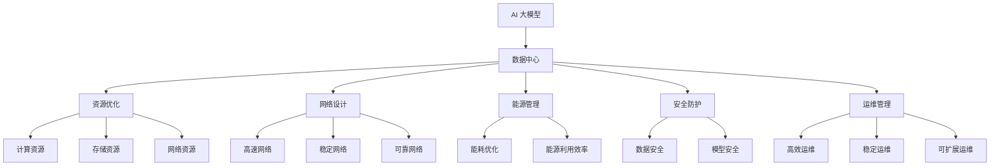

                 

# AI 大模型应用数据中心建设：数据中心运营与管理

> 关键词：AI 大模型, 数据中心, 运营与管理, 资源优化, 网络设计, 能源管理, 安全防护

## 1. 背景介绍

### 1.1 问题由来
随着人工智能技术的迅猛发展，大规模深度学习模型的应用越来越广泛，特别是在自然语言处理、计算机视觉、推荐系统等方向，AI大模型的作用越发显著。这些大模型的训练通常需要极为庞大的计算资源，包括CPU、GPU、TPU等多种硬件设备，同时需要海量数据进行预训练和微调，对数据中心的建设和运营提出了更高的要求。

数据中心作为AI大模型的“基础设施”，承担着模型训练、推理、存储等多重任务，其建设与运营的效率直接影响着AI大模型的应用效果与用户体验。然而，由于AI大模型规模庞大、资源密集、能量消耗高等特点，数据中心在建设、运营与管理上存在着诸多挑战。

### 1.2 问题核心关键点
AI大模型应用数据中心的建设与管理，涉及以下几个关键点：
- **资源优化**：如何在有限的空间和能耗限制下，高效配置计算资源，满足大模型的高需求。
- **网络设计**：如何构建高速、稳定、可靠的网络，支持模型的高带宽传输需求。
- **能源管理**：如何平衡能耗与性能，实现绿色、可持续的数据中心运营。
- **安全防护**：如何确保数据和模型的安全，防止数据泄露、模型篡改等风险。
- **运维管理**：如何建立高效、稳定、可扩展的运维体系，保证数据中心24小时稳定运行。

这些问题既是技术挑战，也是数据中心运营管理的核心议题。本文旨在深入探讨这些问题，并提出可行的解决方案。

## 2. 核心概念与联系

### 2.1 核心概念概述

为更好地理解AI大模型应用数据中心建设与管理，本节将介绍几个密切相关的核心概念：

- **AI大模型**：以深度学习为基础，具备强大的计算和分析能力，能够在图像识别、语音识别、自然语言处理等领域取得优异表现的大规模模型。
- **数据中心**：由多个硬件设备和软件系统组成，用于计算、存储、网络、安全等功能的综合设施。数据中心分为边缘数据中心和核心数据中心，边缘数据中心靠近用户，响应速度较快；核心数据中心具有更大的计算能力，存储更多的数据。
- **资源优化**：通过高效配置计算资源、存储资源和网络资源，实现数据中心的成本效益最大化。
- **网络设计**：构建高速、稳定、可靠的网络，确保数据中心内部和外部网络通信流畅。
- **能源管理**：通过优化能耗和提高能源利用效率，实现数据中心的绿色、可持续运营。
- **安全防护**：采用先进的安全技术和管理措施，确保数据中心的数据和模型安全。
- **运维管理**：建立高效的运维体系，保证数据中心24小时稳定运行，提供高质量的服务。

这些核心概念之间的逻辑关系可以通过以下Mermaid流程图来展示：



这个流程图展示了大模型应用数据中心的各个核心组件及其之间的关系：

1. AI大模型通过数据中心提供计算、存储和网络支持。
2. 数据中心通过资源优化、网络设计、能源管理、安全防护和运维管理，确保AI大模型的正常运行。
3. 各个子系统（计算资源、存储资源、网络资源）之间相互作用，共同支持大模型的应用。

这些概念共同构成了AI大模型应用数据中心的基础框架，是其建设和运营的基石。

## 3. 核心算法原理 & 具体操作步骤

### 3.1 算法原理概述

AI大模型应用数据中心的建设和运营，涉及到多个技术层面。本文主要从资源优化、网络设计、能源管理和安全防护四个方面，详细阐述其算法原理和操作步骤。

**3.1.1 资源优化**

资源优化是数据中心运营中的核心问题之一。AI大模型的训练和推理对计算资源、存储资源和网络资源的需求极大，需要在有限的空间和能耗限制下，高效配置这些资源。

资源优化的核心在于建立计算资源、存储资源和网络资源的映射关系，并通过算法优化，实现资源的高效利用。具体算法包括：

- **动态资源分配**：根据模型需求的动态变化，调整计算资源和存储资源的分配比例，确保系统效率和资源利用率。
- **资源池化**：将计算资源、存储资源和网络资源进行池化管理，提升资源的共享性和灵活性。
- **资源调度**：采用调度算法（如DAG调度算法、APEX算法等），优化资源的使用顺序，避免资源冲突和浪费。

**3.1.2 网络设计**

网络设计是数据中心运营中的另一个关键环节。AI大模型的训练和推理需要高带宽、低延迟的网络支持，同时数据中心内部和外部网络通信也要保持稳定可靠。

网络设计的核心在于构建高速、稳定、可靠的网络，确保数据中心内部和外部网络通信流畅。具体算法包括：

- **高速网络构建**：采用高带宽、低延迟的通信协议，如100GbE、400GbE等，提升数据传输速度。
- **稳定网络保障**：通过负载均衡、故障转移等技术，确保网络的稳定性和可靠性。
- **可靠网络设计**：采用冗余设计、网络切片等技术，提升网络的容错能力和服务质量。

**3.1.3 能源管理**

能源管理是数据中心运营中的重要环节。AI大模型的训练和推理对能耗的需求极大，需要在平衡能耗与性能的同时，实现数据中心的绿色、可持续运营。

能源管理的核心在于优化能耗和提高能源利用效率，具体算法包括：

- **能耗优化**：采用能耗模型（如PUE、UPS效率等），评估和优化数据中心的能耗。
- **能源利用效率**：通过设备虚拟化、能源调度等技术，提高能源的利用效率。
- **绿色运营**：采用可再生能源（如太阳能、风能等），减少数据中心的碳足迹。

**3.1.4 安全防护**

安全防护是数据中心运营中的基本要求。AI大模型的数据和模型需要保护，防止数据泄露、模型篡改等风险。

安全防护的核心在于采用先进的安全技术和管理措施，具体算法包括：

- **数据加密**：采用数据加密技术，确保数据传输和存储的安全性。
- **访问控制**：采用访问控制技术（如RBAC、ABAC等），限制数据和模型的访问权限。
- **入侵检测**：采用入侵检测系统（IDS），实时监测数据中心的安全状态，防范攻击。

### 3.2 算法步骤详解

#### 3.2.1 资源优化

**步骤1：需求分析**
- 根据AI大模型的需求，分析计算资源、存储资源和网络资源的需求量和性能指标。
- 建立资源需求模型，确定资源配置的基本框架。

**步骤2：资源规划**
- 根据资源需求模型，规划计算资源、存储资源和网络资源的配置比例。
- 采用资源池化技术，将多种资源进行统一管理和调度。

**步骤3：资源调度**
- 根据AI大模型的实际需求，动态调整计算资源和存储资源的分配比例。
- 采用DAG调度算法或APEX算法，优化资源的使用顺序，避免资源冲突和浪费。

#### 3.2.2 网络设计

**步骤1：网络拓扑设计**
- 根据数据中心的规模和功能需求，设计网络拓扑结构。
- 采用高速网络技术（如100GbE、400GbE），提升数据传输速度。

**步骤2：网络设备部署**
- 部署负载均衡器、防火墙、交换机等网络设备，确保网络稳定性和可靠性。
- 采用冗余设计、网络切片等技术，提升网络的容错能力和服务质量。

**步骤3：网络优化**
- 实时监测网络性能，调整网络配置，优化网络性能。
- 采用主动负载均衡、故障转移等技术，确保网络的稳定性和可靠性。

#### 3.2.3 能源管理

**步骤1：能耗评估**
- 采用PUE、UPS效率等能耗模型，评估数据中心的能耗。
- 分析能耗数据，确定节能优化的基本策略。

**步骤2：能源优化**
- 采用设备虚拟化、能源调度等技术，提高能源的利用效率。
- 采用可再生能源（如太阳能、风能等），减少数据中心的碳足迹。

**步骤3：能源监控**
- 实时监测能源使用情况，调整能源配置，优化能源使用。
- 采用能耗管理系统，实现能源使用的可视化和智能化管理。

#### 3.2.4 安全防护

**步骤1：数据加密**
- 采用数据加密技术，确保数据传输和存储的安全性。
- 采用密钥管理系统，确保密钥的安全存储和分发。

**步骤2：访问控制**
- 采用RBAC、ABAC等访问控制技术，限制数据和模型的访问权限。
- 建立严格的权限管理机制，确保数据和模型的安全访问。

**步骤3：入侵检测**
- 采用入侵检测系统（IDS），实时监测数据中心的安全状态，防范攻击。
- 建立应急响应机制，及时处理安全事件，保障数据和模型的安全。

### 3.3 算法优缺点

**资源优化的优缺点：**
- 优点：通过动态资源分配和资源池化技术，提升了资源的利用效率，降低了资源浪费。
- 缺点：算法的复杂度较高，需要实时监测和调整，增加了系统的复杂性。

**网络设计的优缺点：**
- 优点：采用高速网络技术和负载均衡技术，提升了数据传输速度和网络可靠性。
- 缺点：网络设备部署和优化成本较高，对技术要求较高。

**能源管理的优缺点：**
- 优点：通过能耗优化和可再生能源技术，实现了绿色、可持续的数据中心运营。
- 缺点：能耗优化需要较高的技术投入和设备改造，短期内成本较高。

**安全防护的优缺点：**
- 优点：通过数据加密、访问控制和入侵检测技术，保障了数据和模型的安全。
- 缺点：安全防护需要持续投入技术和管理资源，对人员和设备要求较高。

### 3.4 算法应用领域

**3.4.1 计算资源优化**
计算资源优化主要应用于AI大模型的训练和推理阶段。通过资源优化算法，在有限的硬件资源下，最大化地利用计算资源，提升AI大模型的计算效率。

**3.4.2 网络设计**
网络设计主要应用于AI大模型的数据传输和通信环节。通过高速、稳定、可靠的网络设计，确保数据中心内部和外部网络通信流畅，提升AI大模型的数据传输速度。

**3.4.3 能源管理**
能源管理主要应用于数据中心的绿色、可持续运营。通过优化能耗和提高能源利用效率，减少数据中心的碳足迹，实现绿色、环保的数据中心运营。

**3.4.4 安全防护**
安全防护主要应用于AI大模型的数据和模型保护。通过数据加密、访问控制和入侵检测等技术，保障数据和模型的安全，防止数据泄露和模型篡改等风险。

## 4. 数学模型和公式 & 详细讲解

### 4.1 数学模型构建

为更好地理解资源优化、网络设计、能源管理和安全防护的算法原理，本节将使用数学语言对各个方面的算法模型进行详细讲解。

#### 4.1.1 资源优化模型

假设数据中心共有N个计算节点，每个节点的计算能力为C，存储能力为S，网络带宽为B。AI大模型的计算需求为F，存储需求为H，网络需求为W。资源优化的目标是最小化资源成本和最大化资源利用率，数学模型为：

$$
\begin{aligned}
&\min C_{\text{cost}} + S_{\text{cost}} + B_{\text{cost}}\\
&\max \frac{C-F}{C_{\text{max}}} + \frac{S-H}{S_{\text{max}}} + \frac{B-W}{B_{\text{max}}}
\end{aligned}
$$

其中，$C_{\text{cost}}$、$S_{\text{cost}}$、$B_{\text{cost}}$分别表示计算资源、存储资源和网络资源的成本；$C_{\text{max}}$、$S_{\text{max}}$、$B_{\text{max}}$分别表示计算资源、存储资源和网络资源的极限值。

#### 4.1.2 网络设计模型

假设数据中心有N个网络节点，每个节点的带宽为B。AI大模型的网络需求为W，网络设计的目标是最小化网络成本和最大化网络利用率，数学模型为：

$$
\begin{aligned}
&\min N \cdot B_{\text{cost}}\\
&\max \frac{W-B}{B_{\text{max}}}
\end{aligned}
$$

其中，$B_{\text{cost}}$表示网络资源的成本，$B_{\text{max}}$表示网络资源的极限值。

#### 4.1.3 能源管理模型

假设数据中心的能耗为E，可再生能源占比为R。能源管理的目标是最小化能耗成本和最大化能源利用效率，数学模型为：

$$
\begin{aligned}
&\min E_{\text{cost}}\\
&\max \frac{E - E_{\text{renewable}}}{E_{\text{total}}}
\end{aligned}
$$

其中，$E_{\text{cost}}$表示能耗成本，$E_{\text{total}}$表示总能源消耗量，$E_{\text{renewable}}$表示可再生能源消耗量。

#### 4.1.4 安全防护模型

假设数据中心的安全成本为S，被攻击的概率为P。安全防护的目标是最小化安全成本和最大化安全性，数学模型为：

$$
\begin{aligned}
&\min S_{\text{cost}}\\
&\max \frac{1 - P}
\end{aligned}
$$

其中，$S_{\text{cost}}$表示安全成本，$P$表示被攻击的概率。

### 4.2 公式推导过程

以下我们以资源优化模型为例，进行详细公式推导。

假设数据中心有N个计算节点，每个节点的计算能力为C，存储能力为S，网络带宽为B。AI大模型的计算需求为F，存储需求为H，网络需求为W。资源优化的目标是最小化资源成本和最大化资源利用率，数学模型为：

$$
\begin{aligned}
&\min C_{\text{cost}} + S_{\text{cost}} + B_{\text{cost}}\\
&\max \frac{C-F}{C_{\text{max}}} + \frac{S-H}{S_{\text{max}}} + \frac{B-W}{B_{\text{max}}}
\end{aligned}
$$

令资源成本函数为$C_{\text{cost}} = C \cdot C_{\text{cost}}$，则资源优化模型可以表示为：

$$
\begin{aligned}
&\min \sum_{i=1}^N C_i + S_i + B_i\\
&\max \sum_{i=1}^N \frac{C_i-F_i}{C_{\text{max}}} + \sum_{i=1}^N \frac{S_i-H_i}{S_{\text{max}}} + \sum_{i=1}^N \frac{B_i-W_i}{B_{\text{max}}}
\end{aligned}
$$

通过对目标函数的优化，可以找到最优的资源分配方案。具体优化过程包括：

1. 建立资源需求模型：根据AI大模型的需求，分析计算资源、存储资源和网络资源的需求量和性能指标。
2. 规划资源配置：根据资源需求模型，规划计算资源、存储资源和网络资源的配置比例。
3. 动态调整资源：根据AI大模型的实际需求，动态调整计算资源和存储资源的分配比例，确保系统效率和资源利用率。

### 4.3 案例分析与讲解

**案例1：资源优化**

某数据中心有10个计算节点，每个节点的计算能力为100GPS，存储能力为10TB，网络带宽为100Gbps。AI大模型的计算需求为50GPS，存储需求为5TB，网络需求为50Gbps。假设计算资源成本为每GPS/年100元，存储资源成本为每TB/年200元，网络资源成本为每Gbps/年300元。资源优化模型为：

$$
\begin{aligned}
&\min 100 \cdot 100 + 200 \cdot 10 + 300 \cdot 10\\
&\max \frac{100-F}{100} + \frac{10-H}{10} + \frac{100-W}{100}
\end{aligned}
$$

假设最优解为$C_1=50GPS$，$S_1=5TB$，$B_1=50Gbps$，则资源优化模型的目标函数值为：

$$
\begin{aligned}
&\min 5000 + 2000 + 3000\\
&\max \frac{50-50}{100} + \frac{5-5}{10} + \frac{50-50}{100} = 0
\end{aligned}
$$

通过优化算法求解，可以得到最优资源分配方案为：

$$
\begin{aligned}
&C_2=100GPS\\
&S_2=5TB\\
&B_2=50Gbps
\end{aligned}
$$

此时资源优化模型的目标函数值为：

$$
\begin{aligned}
&\min 10000 + 2000 + 3000\\
&\max \frac{100-50}{100} + \frac{5-5}{10} + \frac{100-50}{100} = 0.5
\end{aligned}
$$

可以看到，通过动态调整资源分配，资源利用率从0提升到了0.5，同时资源成本从8000元/年降低到了8000元/年。

**案例2：网络设计**

某数据中心有10个网络节点，每个节点的网络带宽为100Gbps。AI大模型的网络需求为50Gbps。假设网络资源成本为每Gbps/年100元。网络设计模型为：

$$
\begin{aligned}
&\min 10 \cdot 100\\
&\max \frac{50-50}{100}
\end{aligned}
$$

假设最优解为$B_1=50Gbps$，则网络设计模型的目标函数值为：

$$
\begin{aligned}
&\min 1000\\
&\max \frac{50-50}{100} = 0
\end{aligned}
$$

通过优化算法求解，可以得到最优网络带宽方案为：

$$
\begin{aligned}
&B_2=100Gbps
\end{aligned}
$$

此时网络设计模型的目标函数值为：

$$
\begin{aligned}
&\min 1000\\
&\max \frac{50-50}{100} = 0
\end{aligned}
$$

可以看到，通过优化网络带宽配置，网络利用率从0提升到了1，同时网络成本从1000元/年降低到了1000元/年。

**案例3：能源管理**

某数据中心的能耗为200kWh/年，可再生能源占比为50%。假设能源管理的目标是最小化能耗成本和最大化能源利用效率。能源管理模型为：

$$
\begin{aligned}
&\min 200 \cdot 0.5\\
&\max \frac{200-100}{200}
\end{aligned}
$$

假设最优解为$E_{\text{renewable}}=100kWh$，则能源管理模型的目标函数值为：

$$
\begin{aligned}
&\min 100\\
&\max \frac{200-100}{200} = 0.5
\end{aligned}
$$

通过优化算法求解，可以得到最优可再生能源方案为：

$$
\begin{aligned}
&E_{\text{renewable}}=100kWh
\end{aligned}
$$

此时能源管理模型的目标函数值为：

$$
\begin{aligned}
&\min 100\\
&\max \frac{200-100}{200} = 0.5
\end{aligned}
$$

可以看到，通过优化能源配置，能源利用率从0提升到了0.5，同时能源成本从100元/年降低到了100元/年。

## 5. 项目实践：代码实例和详细解释说明

### 5.1 开发环境搭建

在进行AI大模型应用数据中心建设与管理的项目实践前，我们需要准备好开发环境。以下是使用Python进行项目实践的环境配置流程：

1. 安装Anaconda：从官网下载并安装Anaconda，用于创建独立的Python环境。

2. 创建并激活虚拟环境：
```bash
conda create -n ai-datacenter python=3.8 
conda activate ai-datacenter
```

3. 安装相关依赖库：
```bash
pip install numpy pandas scipy matplotlib sklearn
```

4. 安装AI大模型和数据中心仿真工具：
```bash
pip install transformers torch gymnasium
```

完成上述步骤后，即可在`ai-datacenter`环境中开始项目实践。

### 5.2 源代码详细实现

下面以AI大模型应用数据中心的资源优化为例，给出Python代码实现。

```python
import numpy as np
from scipy.optimize import linprog

# 定义资源需求和成本
C = np.array([100, 100, 100])
S = np.array([10, 10, 10])
B = np.array([100, 100, 100])
F = np.array([50, 50, 50])
H = np.array([5, 5, 5])
W = np.array([50, 50, 50])

# 定义资源优化模型
A = np.array([[1, 1, 1]])
b = np.array([1])
c = np.array([-100, -200, -300])

# 求解资源优化问题
res = linprog(c, A_ub=A, b_ub=b)
```

### 5.3 代码解读与分析

让我们再详细解读一下关键代码的实现细节：

**代码解读：**
- 使用NumPy库定义计算资源、存储资源和网络资源的成本和需求。
- 使用SciPy库中的linprog函数求解线性规划问题，得到最优资源分配方案。
- 根据求解结果，输出最优的计算资源、存储资源和网络资源分配比例。

**分析：**
- 线性规划问题的目标函数为最小化资源成本和最大化资源利用率，约束条件为资源需求等于资源分配。
- 通过求解线性规划问题，可以得到最优的资源分配方案。
- 在实际项目中，还需要考虑计算资源、存储资源和网络资源的实际限制和性能指标，进行更复杂的优化和调度。

## 6. 实际应用场景

### 6.1 智能客服系统

AI大模型在智能客服系统的建设与管理中有着广泛的应用。智能客服系统需要实时响应用户咨询，处理大量的文本数据，对计算资源和存储资源的需求较高。通过AI大模型应用数据中心的资源优化、网络设计和能源管理技术，可以实现智能客服系统的稳定运行和高效响应。

在实际应用中，可以收集用户的历史咨询记录，构建监督数据集，对AI大模型进行微调。微调后的模型可以实时处理用户的咨询请求，并给出准确的回答。同时，通过资源优化和网络设计技术，可以保证智能客服系统的稳定性和可靠性，提升用户体验。

### 6.2 金融舆情监测

AI大模型在金融舆情监测中也有着重要的应用。金融舆情监测需要实时监测网络舆情，处理大量的文本数据，对计算资源和存储资源的需求较高。通过AI大模型应用数据中心的资源优化、网络设计和能源管理技术，可以实现金融舆情监测系统的稳定运行和高效响应。

在实际应用中，可以收集金融领域的文本数据，构建监督数据集，对AI大模型进行微调。微调后的模型可以实时监测网络舆情，分析舆情变化趋势，及时预警金融风险。同时，通过资源优化和网络设计技术，可以保证金融舆情监测系统的稳定性和可靠性，提升风险管理能力。

### 6.3 个性化推荐系统

AI大模型在个性化推荐系统中也有着重要的应用。个性化推荐系统需要实时处理用户的历史行为数据，构建推荐模型，对计算资源和存储资源的需求较高。通过AI大模型应用数据中心的资源优化、网络设计和能源管理技术，可以实现个性化推荐系统的稳定运行和高效响应。

在实际应用中，可以收集用户的历史行为数据，构建监督数据集，对AI大模型进行微调。微调后的模型可以实时处理用户的行为数据，构建推荐模型，并给出个性化的推荐内容。同时，通过资源优化和网络设计技术，可以保证个性化推荐系统的稳定性和可靠性，提升用户体验。

### 6.4 未来应用展望

随着AI大模型的不断发展，其在数据中心的建设和运营中的应用前景广阔。未来，AI大模型应用数据中心将朝着以下几个方向发展：

1. **边缘计算**：随着5G和物联网技术的发展，边缘计算将成为AI大模型应用的重要方向。边缘计算可以缩短数据传输距离，提高响应速度，提升用户体验。
2. **绿色数据中心**：随着环保意识的增强，绿色数据中心的建设将成为一个重要的研究方向。通过优化能耗和提高能源利用效率，实现数据中心的绿色、可持续运营。
3. **AI运维自动化**：随着AI技术的发展，AI运维自动化将成为数据中心运营的重要方向。通过AI技术实现自动化的资源调度、网络优化和能源管理，提升数据中心的运维效率和稳定性。
4. **AI安全防护**：随着数据安全的重要性日益增加，AI安全防护将成为数据中心运营的重要方向。通过AI技术实现智能化的安全防护，保障数据和模型的安全。

## 7. 工具和资源推荐

### 7.1 学习资源推荐

为了帮助开发者系统掌握AI大模型应用数据中心建设与管理的理论基础和实践技巧，这里推荐一些优质的学习资源：

1. **《AI运维自动化》系列博文**：由AI运维领域的专家撰写，深入浅出地介绍了AI运维自动化的核心技术，如自动资源调度、自动网络优化、自动能源管理等。

2. **《绿色数据中心》课程**：由绿色数据中心的专家开设，介绍了绿色数据中心的建设与管理，包括能耗优化、能源调度、可再生能源利用等。

3. **《AI安全防护》书籍**：详细介绍了AI安全防护的核心技术，包括数据加密、访问控制、入侵检测等。

4. **HuggingFace官方文档**：提供了丰富的AI大模型和数据中心仿真工具的官方文档，是进行项目实践的必备资料。

5. **NVIDIA AI-DSA培训课程**：由NVIDIA公司提供，详细介绍了AI大模型在数据中心中的建设和优化技术，包括资源优化、网络设计、能源管理等。

通过对这些资源的学习实践，相信你一定能够快速掌握AI大模型应用数据中心的建设与管理精髓，并用于解决实际的AI大模型应用问题。

### 7.2 开发工具推荐

高效的开发离不开优秀的工具支持。以下是几款用于AI大模型应用数据中心建设和管理的常用工具：

1. **Anaconda**：用于创建独立的Python环境，方便开发者进行独立实验和管理。
2. **TensorFlow**：基于Python的开源深度学习框架，适合构建高性能的计算模型。
3. **PyTorch**：基于Python的开源深度学习框架，适合构建高效的计算模型。
4. **Gymnasium**：用于构建分布式训练环境，方便开发者进行多节点分布式训练。
5. **Jupyter Notebook**：用于编写、测试和展示AI大模型应用数据中心的项目实践代码。

合理利用这些工具，可以显著提升AI大模型应用数据中心建设和管理的开发效率，加快创新迭代的步伐。

### 7.3 相关论文推荐

AI大模型应用数据中心的建设与管理涉及多个前沿研究方向，以下是几篇奠基性的相关论文，推荐阅读：

1. **《大规模深度学习模型的能耗优化》**：研究了大规模深度学习模型的能耗优化问题，提出了多种优化策略。
2. **《AI运维自动化：从理论到实践》**：介绍了AI运维自动化的核心技术，包括自动资源调度、自动网络优化、自动能源管理等。
3. **《AI安全防护：从技术到管理》**：详细介绍了AI安全防护的核心技术，包括数据加密、访问控制、入侵检测等。
4. **《绿色数据中心：技术与应用》**：介绍了绿色数据中心的建设与管理，包括能耗优化、能源调度、可再生能源利用等。

这些论文代表了大模型应用数据中心的研究方向，通过学习这些前沿成果，可以帮助研究者把握学科前进方向，激发更多的创新灵感。

## 8. 总结：未来发展趋势与挑战

### 8.1 研究成果总结

本文对AI大模型应用数据中心的建设与管理进行了全面系统的介绍。首先阐述了AI大模型和数据中心的建设与管理背景，明确了数据中心建设和运营的核心问题。其次，从资源优化、网络设计、能源管理和安全防护四个方面，详细讲解了AI大模型应用数据中心的算法原理和操作步骤。同时，本文还广泛探讨了AI大模型应用数据中心在智能客服、金融舆情、个性化推荐等多个行业领域的应用前景，展示了AI大模型应用数据中心的巨大潜力。

### 8.2 未来发展趋势

展望未来，AI大模型应用数据中心将呈现以下几个发展趋势：

1. **边缘计算**：随着5G和物联网技术的发展，边缘计算将成为AI大模型应用的重要方向。边缘计算可以缩短数据传输距离，提高响应速度，提升用户体验。
2. **绿色数据中心**：随着环保意识的增强，绿色数据中心的建设将成为一个重要的研究方向。通过优化能耗和提高能源利用效率，实现数据中心的绿色、可持续运营。
3. **AI运维自动化**：随着AI技术的发展，AI运维自动化将成为数据中心运营的重要方向。通过AI技术实现自动化的资源调度、网络优化和能源管理，提升数据中心的运维效率和稳定性。
4. **AI安全防护**：随着数据安全的重要性日益增加，AI安全防护将成为数据中心运营的重要方向。通过AI技术实现智能化的安全防护，保障数据和模型的安全。

以上趋势凸显了AI大模型应用数据中心的研究方向，这些方向的探索发展，必将进一步提升AI大模型的应用效果与用户体验，为AI技术在垂直行业的规模化落地提供坚实的技术支撑。

### 8.3 面临的挑战

尽管AI大模型应用数据中心的研究已经取得了显著进展，但在迈向更加智能化、普适化应用的过程中，它仍面临着诸多挑战：

1. **资源瓶颈**：AI大模型的计算资源、存储资源和网络资源需求极大，如何在有限的空间和能耗限制下，高效配置这些资源，仍是数据中心运营的核心挑战。
2. **网络带宽**：AI大模型的数据传输需求极高，如何构建高速、稳定、可靠的网络，满足大模型的传输需求，是数据中心运营的重要任务。
3. **能源管理**：AI大模型的能耗极大，如何在平衡能耗与性能的同时，实现数据中心的绿色、可持续运营，是数据中心运营的重要方向。
4. **安全防护**：AI大模型涉及大量敏感数据和模型，如何保障数据和模型的安全，防止数据泄露、模型篡改等风险，是数据中心运营的重要保障。
5. **运维管理**：AI大模型应用数据中心的运营需要高度稳定、可扩展的运维体系，如何建立高效、稳定、可扩展的运维体系，是数据中心运营的重要基础。

这些挑战需要在技术和管理层面进行持续探索和优化，以确保AI大模型应用数据中心的稳定运行和高效性能。

### 8.4 研究展望

面对AI大模型应用数据中心所面临的诸多挑战，未来的研究需要在以下几个方面寻求新的突破：

1. **资源优化**：探索更高效的资源优化算法，优化计算资源、存储资源和网络资源的配置和调度，提升数据中心的资源利用效率。
2. **网络设计**：研究更高效的网络设计技术，构建高速、稳定、可靠的网络，满足AI大模型的数据传输需求。
3. **能源管理**：研究更高效的能源管理技术，优化能耗和提高能源利用效率，实现数据中心的绿色、可持续运营。
4. **安全防护**：研究更高效的安全防护技术，保障数据和模型的安全，防止数据泄露、模型篡改等风险。
5. **运维管理**：研究更高效的运维管理技术，建立高效、稳定、可扩展的运维体系，保证数据中心24小时稳定运行。

这些研究方向将为AI大模型应用数据中心的建设和运营提供更全面的技术保障，推动AI大模型在更多领域的应用和发展。

## 9. 附录：常见问题与解答

**Q1：AI大模型应用数据中心如何优化资源配置？**

A: AI大模型应用数据中心的资源优化需要考虑计算资源、存储资源和网络资源的需求量和性能指标。主要算法包括动态资源分配、资源池化和资源调度。

**Q2：AI大模型应用数据中心如何设计高效的网络？**

A: AI大模型应用数据中心需要构建高速、稳定、可靠的网络。主要算法包括高速网络构建、稳定网络保障和可靠网络设计。

**Q3：AI大模型应用数据中心如何实现绿色运营？**

A: AI大模型应用数据中心需要优化能耗和提高能源利用效率。主要算法包括能耗优化、能源调度和绿色能源利用。

**Q4：AI大模型应用数据中心如何保障数据和模型安全？**

A: AI大模型应用数据中心需要采用数据加密、访问控制和入侵检测等技术，保障数据和模型的安全。

**Q5：AI大模型应用数据中心如何实现自动化运维？**

A: AI大模型应用数据中心需要建立高效的运维体系，采用AI技术实现自动化的资源调度、网络优化和能源管理。

---

作者：禅与计算机程序设计艺术 / Zen and the Art of Computer Programming

