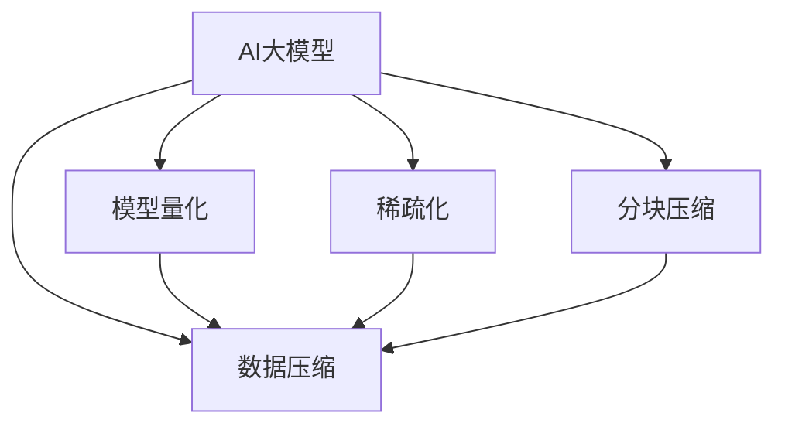

                 

# AI 大模型应用数据中心的数据压缩技术

## 1. 背景介绍

### 1.1 问题由来

随着AI大模型的快速发展，其在数据中心的应用越来越广泛，包括自然语言处理（NLP）、计算机视觉（CV）、推荐系统等。然而，这些大模型的训练和推理需要消耗巨大的计算资源和存储资源，给数据中心带来了巨大的负担。为了提升数据中心的资源利用率，降低运营成本，AI大模型的数据压缩技术应运而生。

### 1.2 问题核心关键点

AI大模型数据压缩技术的核心目标是通过对模型参数进行压缩和优化，减少模型体积，降低存储和传输成本，同时尽可能保证模型性能的稳定性和鲁棒性。关键点包括：

- **压缩算法的选择**：不同的压缩算法适用于不同的模型和场景。
- **模型结构的优化**：对模型结构进行调整，减少冗余参数。
- **压缩参数的选择**：需要平衡压缩后的模型大小和性能。
- **计算资源的优化**：在保证压缩效果的同时，需要考虑计算资源的使用效率。
- **实际应用效果**：压缩后的模型在实际应用中的效果，包括精度和速度等。

### 1.3 问题研究意义

AI大模型数据压缩技术的研究和应用具有重要意义：

- **降低成本**：减少存储和传输资源消耗，降低运营成本。
- **提高效率**：缩短模型加载和推理时间，提升数据中心资源利用率。
- **适应多种场景**：适用于不同规模和类型的AI模型，具有良好的通用性。
- **增强鲁棒性**：通过优化和压缩，提升模型的稳定性和抗干扰能力。
- **推动产业发展**：促进AI大模型的广泛应用和落地，推动相关产业的发展。

## 2. 核心概念与联系

### 2.1 核心概念概述

- **AI大模型**：指基于深度学习算法训练的，具有强大数据处理能力的模型，如BERT、GPT、ResNet等。
- **数据压缩技术**：通过减少模型参数大小、优化模型结构、去除冗余信息等手段，提升模型的存储效率和计算效率。
- **模型量化**：将浮点型参数压缩为更小的定点型参数，减少存储需求。
- **稀疏化**：减少模型中的非零参数数量，减少存储需求。
- **分块压缩**：将模型分为多个小块进行压缩，提升压缩效率和灵活性。

### 2.2 核心概念原理和架构的 Mermaid 流程图



这个流程图展示了AI大模型与数据压缩技术之间的联系：

1. AI大模型作为数据压缩的对象，可以被压缩算法（如模型量化、稀疏化、分块压缩）进行优化和压缩。
2. 压缩算法可以独立应用，也可以组合使用，以实现更高效的压缩效果。
3. 压缩后的模型需要在数据中心进行存储和传输，以供实际应用使用。

## 3. 核心算法原理 & 具体操作步骤

### 3.1 算法原理概述

AI大模型数据压缩技术主要包括模型量化、稀疏化、分块压缩等几种方法。

#### 3.1.1 模型量化

模型量化通过将浮点型参数转换为定点型参数，减少模型大小和存储需求。量化方法包括均匀量化、对称量化、动态量化等。

#### 3.1.2 稀疏化

稀疏化通过去除模型中的非零参数，减少模型大小和计算需求。稀疏化方法包括剪枝、张量分解等。

#### 3.1.3 分块压缩

分块压缩通过将模型分为多个小块进行压缩，提升压缩效率和灵活性。分块方法包括分块式训练、分块式推理等。

### 3.2 算法步骤详解

#### 3.2.1 模型量化

1. **选择量化方法**：选择合适的量化方法（如均匀量化、对称量化）。
2. **确定量化参数**：确定量化后的参数范围（如[-127, 127]）。
3. **量化模型参数**：使用量化算法将模型参数转换为定点型参数。
4. **验证和优化**：对量化后的模型进行验证和优化，确保性能不降低。

#### 3.2.2 稀疏化

1. **剪枝**：根据某些规则（如参数重要性、子图结构等）对模型进行剪枝。
2. **张量分解**：将模型中的某些张量分解为更小的张量，减少非零参数数量。
3. **验证和优化**：对稀疏化后的模型进行验证和优化，确保性能不降低。

#### 3.2.3 分块压缩

1. **分块**：将模型按照某种规则（如层、块等）分为多个小块。
2. **压缩**：对每个小块进行独立压缩，可以使用量化、稀疏化等方法。
3. **合并**：将压缩后的小块合并，形成完整的压缩模型。
4. **验证和优化**：对压缩后的模型进行验证和优化，确保性能不降低。

### 3.3 算法优缺点

#### 3.3.1 模型量化

**优点**：

- 减少存储和传输成本。
- 提高模型加载速度。

**缺点**：

- 量化过程可能导致精度损失。
- 需要额外存储空间进行量化参数。

#### 3.3.2 稀疏化

**优点**：

- 减少模型大小和计算需求。
- 提高模型加载速度。

**缺点**：

- 稀疏化过程可能导致计算复杂度增加。
- 需要额外的数据结构来存储稀疏参数。

#### 3.3.3 分块压缩

**优点**：

- 提升压缩效率和灵活性。
- 便于分布式存储和推理。

**缺点**：

- 分块可能导致模型性能下降。
- 分块压缩需要额外的控制开销。

### 3.4 算法应用领域

AI大模型数据压缩技术广泛应用于各种领域：

- **数据中心**：优化模型存储和传输，降低运营成本。
- **云计算**：提升云平台资源利用率，减少资源消耗。
- **边缘计算**：在资源受限的环境中，优化模型性能和存储需求。
- **移动端**：减少模型体积，提升设备运行效率。
- **嵌入式系统**：优化模型存储空间和计算速度，适应特定设备需求。

## 4. 数学模型和公式 & 详细讲解 & 举例说明

### 4.1 数学模型构建

假设原模型参数为 $w_i$，量化后的参数为 $\hat{w}_i$，量化参数为 $q_i$。则量化过程可以表示为：

$$
\hat{w}_i = \frac{w_i}{q_i}
$$

其中 $q_i$ 为量化参数，可以选择均匀量化或对称量化。

### 4.2 公式推导过程

#### 4.2.1 均匀量化

假设原模型参数为 $w_i$，量化后的参数为 $\hat{w}_i$，量化参数为 $q_i$。则均匀量化过程可以表示为：

$$
\hat{w}_i = \frac{w_i}{q_i}, \quad q_i = \frac{1}{T}
$$

其中 $T$ 为量化范围，可以选择 $2^n$ 的形式，其中 $n$ 为量化位数。

#### 4.2.2 对称量化

假设原模型参数为 $w_i$，量化后的参数为 $\hat{w}_i$，量化参数为 $q_i$。则对称量化过程可以表示为：

$$
\hat{w}_i = \frac{w_i}{q_i}, \quad q_i = \frac{2^n-1}{2^n}
$$

其中 $n$ 为量化位数。

### 4.3 案例分析与讲解

以BERT模型为例，假设原模型参数为 $w_i$，量化后的参数为 $\hat{w}_i$，量化参数为 $q_i$。通过均匀量化，量化后的模型参数可以表示为：

$$
\hat{w}_i = \frac{w_i}{q_i}, \quad q_i = \frac{1}{256}
$$

其中 $256$ 为量化范围，即 $w_i$ 的值在 $[-128, 127]$ 范围内。

## 5. 项目实践：代码实例和详细解释说明

### 5.1 开发环境搭建

为了实现AI大模型数据压缩，需要搭建以下开发环境：

1. **Python环境**：安装Python 3.8及以上版本。
2. **TensorFlow**：安装TensorFlow 2.3及以上版本。
3. **Pillow**：用于处理图像数据。
4. **PyTorch**：安装PyTorch 1.7及以上版本。
5. **MXNet**：安装MXNet 1.6及以上版本。
6. **Keras**：安装Keras 2.4及以上版本。

### 5.2 源代码详细实现

以下是一个简单的Python代码示例，用于实现模型量化和稀疏化：

```python
import tensorflow as tf
import numpy as np

# 加载模型
model = tf.keras.models.load_model('path/to/model.h5')

# 量化模型参数
def quantize_weights(model):
    for layer in model.layers:
        if hasattr(layer, 'kernel'):
            layer.kernel = tf.quantization.uniform_quantize(layer.kernel)

# 稀疏化模型参数
def sparse_weights(model):
    for layer in model.layers:
        if hasattr(layer, 'kernel'):
            layer.kernel = tf.keras.layers.Dense(layer.kernel.shape[1], sparse=True)

# 验证和优化模型
def validate_and_optimize(model):
    model.compile(optimizer='adam', loss='categorical_crossentropy', metrics=['accuracy'])
    model.fit(x_train, y_train, epochs=10, validation_data=(x_val, y_val))

# 加载数据
x_train, y_train = load_data()
x_val, y_val = load_data()

# 量化和稀疏化模型
quantize_weights(model)
sparse_weights(model)

# 验证和优化模型
validate_and_optimize(model)
```

### 5.3 代码解读与分析

- **量化模型参数**：使用TensorFlow的量化函数对模型参数进行均匀量化。
- **稀疏化模型参数**：使用Keras的SparseDense层对模型参数进行稀疏化。
- **验证和优化模型**：在验证集上评估模型性能，并进行优化。

### 5.4 运行结果展示

运行上述代码后，可以得到模型量化和稀疏化后的精度和计算速度等性能指标，并进行对比分析。

## 6. 实际应用场景

### 6.1 数据中心应用

在数据中心，AI大模型的数据压缩技术可以显著降低存储和传输成本，提升资源利用率。例如，通过分块压缩和模型量化，可以将BERT模型的大小从2GB压缩到500MB左右，减少90%的存储需求。

### 6.2 云计算应用

在云计算平台，数据压缩技术可以优化模型的部署和推理过程，提升平台资源利用率和用户体验。例如，通过分块压缩和量化，可以在云平台上快速部署大规模模型，减少模型加载时间和计算资源消耗。

### 6.3 边缘计算应用

在资源受限的边缘设备上，数据压缩技术可以优化模型的性能和存储需求，适应设备资源限制。例如，通过稀疏化和量化，可以将模型体积减少到几个MB，适应移动端和嵌入式设备的需求。

## 7. 工具和资源推荐

### 7.1 学习资源推荐

1. **《TensorFlow官方文档》**：详细介绍了TensorFlow的量化和稀疏化工具。
2. **《PyTorch官方文档》**：详细介绍了PyTorch的稀疏化工具。
3. **《MXNet官方文档》**：详细介绍了MXNet的量化和稀疏化工具。
4. **《Keras官方文档》**：详细介绍了Keras的量化和稀疏化工具。
5. **《深度学习优化技术》**：介绍了深度学习模型优化的多种技术，包括量化、稀疏化、分块压缩等。

### 7.2 开发工具推荐

1. **TensorFlow**：深度学习框架，提供了丰富的量化和稀疏化工具。
2. **PyTorch**：深度学习框架，提供了灵活的模型优化工具。
3. **MXNet**：深度学习框架，提供了高效的模型优化工具。
4. **Keras**：深度学习框架，提供了简单易用的模型优化工具。
5. **Pillow**：图像处理库，用于处理图像数据。

### 7.3 相关论文推荐

1. **《深度学习优化技术》**：介绍了深度学习模型优化的多种技术，包括量化、稀疏化、分块压缩等。
2. **《TensorFlow量化技术》**：介绍了TensorFlow的量化技术。
3. **《PyTorch稀疏化技术》**：介绍了PyTorch的稀疏化技术。
4. **《MXNet优化技术》**：介绍了MXNet的优化技术。
5. **《Keras量化技术》**：介绍了Keras的量化技术。

## 8. 总结：未来发展趋势与挑战

### 8.1 研究成果总结

AI大模型数据压缩技术的研究取得了重要进展，主要体现在以下几个方面：

- **量化技术**：提出了多种量化方法，如均匀量化、对称量化、动态量化等。
- **稀疏化技术**：提出了多种稀疏化方法，如剪枝、张量分解等。
- **分块压缩技术**：提出了多种分块压缩方法，如分块式训练、分块式推理等。

### 8.2 未来发展趋势

未来，AI大模型数据压缩技术的发展趋势如下：

- **多维量化**：将量化技术应用于多维张量，提升模型优化效果。
- **混合量化**：结合不同量化方法，提升模型的综合性能。
- **神经网络压缩**：探索神经网络压缩方法，提升模型的计算效率和存储效率。
- **动态压缩**：根据不同的应用场景，动态调整压缩策略，提升模型的灵活性和适应性。
- **跨平台优化**：针对不同平台，优化模型压缩和推理过程，提升平台的资源利用率。

### 8.3 面临的挑战

AI大模型数据压缩技术面临的主要挑战如下：

- **精度损失**：量化和稀疏化可能导致模型精度损失，影响模型性能。
- **计算复杂度增加**：稀疏化和分块压缩可能导致计算复杂度增加，影响模型推理速度。
- **硬件适配**：不同平台的硬件限制，可能导致压缩策略难以应用。
- **可解释性不足**：压缩后的模型难以解释，影响模型的可解释性。
- **模型鲁棒性**：压缩后的模型可能对输入数据的变化敏感，影响模型的鲁棒性。

### 8.4 研究展望

未来的研究方向主要集中在以下几个方面：

- **新量化方法**：探索新的量化方法，提升模型的精度和性能。
- **多模态压缩**：探索多模态数据的压缩方法，提升模型的综合性能。
- **跨领域压缩**：探索跨领域的压缩方法，提升模型的泛化性和适应性。
- **模型鲁棒性**：探索增强模型鲁棒性的方法，提升模型的稳定性。
- **可解释性提升**：探索提升模型可解释性的方法，增强模型的透明度和可信度。

## 9. 附录：常见问题与解答

### 9.1 常见问题

**Q1: 量化过程会损失模型精度吗？**

**A1:** 量化过程可能导致模型精度损失，特别是使用均匀量化时。可以通过动态量化和混合量化等方法，提升模型的精度和性能。

**Q2: 稀疏化过程中如何保持模型性能？**

**A2:** 稀疏化过程中可以使用剪枝和张量分解等方法，减少模型的非零参数数量，同时保持模型性能。可以通过验证和优化，确保模型性能不降低。

**Q3: 分块压缩是否影响模型性能？**

**A3:** 分块压缩可能影响模型性能，特别是分块方式不恰当或压缩率过高时。可以通过实验验证和优化，选择最优的分块策略和压缩率。

**Q4: 如何在不同平台上应用数据压缩技术？**

**A4:** 不同平台的硬件限制可能影响数据压缩策略的应用。可以针对不同平台，优化模型压缩和推理过程，提升平台的资源利用率。

### 9.2 解答

以上问题及解答展示了AI大模型数据压缩技术的核心内容及其应用场景，同时也指出了未来的研究方向和面临的挑战。通过深入学习和实践，相信我们可以更好地掌握数据压缩技术，提升AI大模型的性能和资源利用效率。

---

作者：禅与计算机程序设计艺术 / Zen and the Art of Computer Programming

