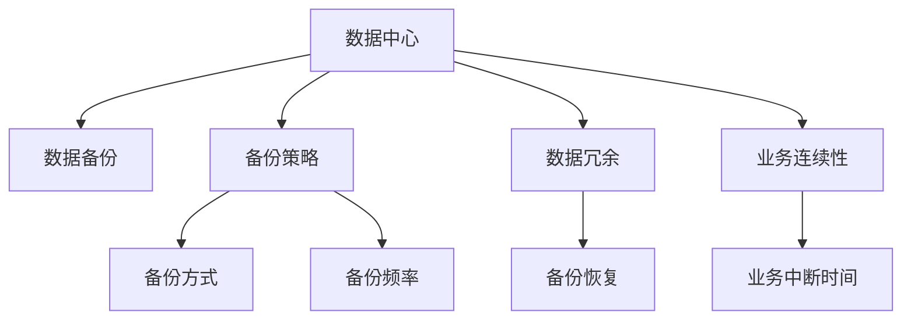

                 

# AI 大模型应用数据中心的数据备份方案

在AI大模型应用日益广泛的今天，数据中心的稳定性和安全性变得尤为重要。数据中心的数据备份方案直接关系到模型的可靠性和业务连续性，本文将深入探讨这一核心问题，为数据中心管理者提供一套全面而高效的数据备份方案。

## 1. 背景介绍

随着人工智能技术的飞速发展，大模型在各行各业的应用日益广泛，从自然语言处理、计算机视觉到机器人学习等，大模型的存在几乎无处不在。然而，模型应用过程中，数据中心的数据安全和稳定运行，仍是管理者必须面对的首要挑战。数据中心作为大模型应用的核心基础设施，其数据备份方案的可靠性和高效性，直接影响模型的稳定性和业务连续性。

大模型应用通常需要大量的存储空间，这包括模型参数、训练数据和推断数据等。这些数据的完整性和可用性，是模型能够正常运行的基础。然而，在实际应用中，由于各种不可抗力因素（如硬件故障、软件漏洞、自然灾害等），数据中心的数据可能会遭受破坏或丢失，这将导致模型无法正常运行，进而影响业务服务。

为了应对这些风险，数据备份方案显得尤为重要。数据备份不仅能够确保数据中心在灾难发生时的数据恢复，还能够有效提升数据中心运行的稳定性和安全性。

## 2. 核心概念与联系

### 2.1 核心概念概述

在探讨数据备份方案之前，首先需要明确几个核心概念：

- **数据中心**：指集中存放和管理数据的设施，通常包括服务器、存储设备、网络设备等。
- **数据备份**：指将数据中心的全部或部分数据，定期或实时地复制到另一个存储介质上，以防止数据丢失的过程。
- **备份策略**：指根据业务需求，制定的数据备份计划和流程，包括备份频率、备份方式、备份目标等。
- **备份恢复**：指在数据中心发生数据丢失或损坏时，利用备份数据进行数据恢复的过程。
- **数据冗余**：指在数据中心中存储多份相同或相似的数据，以防止单点故障导致数据丢失。

这些概念通过一个简单的Mermaid流程图，可以更直观地理解它们之间的关系：



### 2.2 核心概念原理和架构的 Mermaid 流程图

通过上述简单的流程图，我们可以看出，数据备份和数据冗余是确保数据中心稳定运行的重要手段。接下来，我们进一步细化数据备份的原理和架构。

#### 数据备份原理
数据备份的核心原理在于，将数据中心中的数据复制一份或多份，存储到另一个安全的位置。当原始数据发生损坏或丢失时，可以通过备份数据进行恢复。备份数据的存储方式通常有三种：

1. **物理备份**：将数据物理地复制到另一个存储设备上，如硬盘、磁带等。
2. **逻辑备份**：将数据逻辑地复制一份，存储在相同的物理存储设备上。
3. **增量备份**：只备份数据的变化部分，以减少备份所需的时间和存储空间。

数据备份的原理如图2所示：


#### 数据备份架构
数据备份的架构通常包括以下几个关键部分：

1. **备份服务器**：负责管理备份任务，将数据复制到备份设备。
2. **备份存储设备**：存储备份数据的介质，如硬盘、磁带、云存储等。
3. **备份管理系统**：监控备份任务的状态，管理备份策略和计划。
4. **数据传输机制**：确保备份数据的安全传输，包括加密、压缩等技术。

数据备份架构如图3所示：


## 3. 核心算法原理 & 具体操作步骤

### 3.1 算法原理概述

数据备份的算法原理主要包括以下几个步骤：

1. **备份策略设计**：根据业务需求，设计备份策略，包括备份频率、备份方式、备份目标等。
2. **数据选择**：根据备份策略，选择需要备份的数据。
3. **数据复制**：将原始数据复制到备份设备上。
4. **数据校验**：确保备份数据的完整性，防止数据损坏或丢失。
5. **数据存储**：将备份数据存储在备份设备上。
6. **备份恢复**：在数据丢失或损坏时，使用备份数据进行恢复。

### 3.2 算法步骤详解

#### 步骤1：备份策略设计
备份策略是数据备份的核心，决定了备份的频率、备份方式和备份目标。备份策略通常包括以下几个参数：

- **备份频率**：包括全量备份、增量备份和差异备份。全量备份指备份全部数据，增量备份只备份数据的变化部分，差异备份备份两次全量备份之间的数据变化。
- **备份方式**：包括完全备份、增量备份和差异备份。完全备份指备份全部数据，增量备份只备份数据的变化部分，差异备份备份两次完全备份之间的数据变化。
- **备份目标**：包括本地备份和远程备份。本地备份备份数据存储在同一个物理位置，远程备份备份数据存储在另一个物理位置。

#### 步骤2：数据选择
根据备份策略，选择需要备份的数据。通常需要备份的数据包括：

- **模型参数**：大模型训练后的参数文件。
- **训练数据**：大模型训练使用的原始数据集。
- **推断数据**：大模型推断使用的测试数据集。

#### 步骤3：数据复制
将原始数据复制到备份设备上。通常有以下几种数据复制方式：

- **全量复制**：将原始数据全部复制到备份设备上。
- **增量复制**：只复制数据的变化部分到备份设备上。
- **差异复制**：备份两次全量复制之间的数据变化。

#### 步骤4：数据校验
确保备份数据的完整性，防止数据损坏或丢失。常用的数据校验方法包括：

- **MD5校验**：计算原始数据和备份数据的MD5值，比较是否相同。
- **文件校验码**：计算原始数据和备份数据的校验码，比较是否相同。
- **数据比对**：将原始数据和备份数据进行比对，检查是否完全相同。

#### 步骤5：数据存储
将备份数据存储在备份设备上。常用的备份设备包括：

- **本地硬盘**：存储在本地物理硬盘上。
- **磁带**：存储在磁带上，通常用于长长期备份。
- **云存储**：存储在云服务提供商的存储系统中。

#### 步骤6：备份恢复
在数据丢失或损坏时，使用备份数据进行恢复。常用的备份恢复方法包括：

- **手动恢复**：手动将备份数据复制到原始位置，恢复数据。
- **自动化恢复**：使用备份管理系统的自动化工具，将备份数据恢复到原始位置。

### 3.3 算法优缺点

#### 优点
1. **数据安全**：备份数据可以防止数据丢失和损坏，保证业务连续性。
2. **数据冗余**：备份数据可以提供多份相同或相似的数据，防止单点故障导致数据丢失。
3. **高效恢复**：备份数据可以在数据丢失或损坏时，快速恢复，减少业务中断时间。

#### 缺点
1. **存储成本高**：备份数据需要占用大量的存储空间，增加了数据中心的运营成本。
2. **备份频率高**：备份频率高会增加备份系统的负担，影响系统的性能。
3. **恢复过程复杂**：备份数据的恢复过程比较复杂，需要专业的技术支持。

### 3.4 算法应用领域

数据备份方案不仅适用于大模型应用的数据中心，也适用于各类数据中心和存储系统。以下是几个主要应用领域：

1. **金融数据中心**：金融数据中心需要备份交易数据、账户信息等关键数据，以确保数据安全和业务连续性。
2. **医疗数据中心**：医疗数据中心需要备份患者病历、诊断结果等关键数据，以防止数据丢失或损坏。
3. **政府数据中心**：政府数据中心需要备份公共记录、电子文档等关键数据，以保障数据安全和业务连续性。
4. **互联网数据中心**：互联网数据中心需要备份网站数据、用户数据等关键数据，以防止数据丢失或损坏。

## 4. 数学模型和公式 & 详细讲解 & 举例说明

### 4.1 数学模型构建

数据备份的数学模型主要涉及数据传输和校验两个方面。

#### 数据传输模型
数据传输模型包括数据传输速率、传输距离和传输路径等因素。假设原始数据大小为 $S$，传输速率率为 $R$，传输距离为 $D$，传输路径数为 $P$，则数据传输所需时间为：

$$
T = \frac{S}{R} + \frac{D}{R} \times P
$$

#### 数据校验模型
数据校验模型包括MD5校验、文件校验码和数据比对等方法。以MD5校验为例，假设原始数据大小为 $S$，计算MD5值的时间为 $T_{md5}$，则MD5校验所需时间为：

$$
T_{md5} = \frac{S}{R_{md5}} + T_{md5}
$$

其中 $R_{md5}$ 为计算MD5值的速度。

### 4.2 公式推导过程

#### 数据传输时间推导
数据传输时间 $T$ 的计算公式为：

$$
T = \frac{S}{R} + \frac{D}{R} \times P
$$

其中 $S$ 为原始数据大小，$R$ 为传输速率，$D$ 为传输距离，$P$ 为传输路径数。

#### 数据校验时间推导
以MD5校验为例，计算MD5校验时间 $T_{md5}$ 的公式为：

$$
T_{md5} = \frac{S}{R_{md5}} + T_{md5}
$$

其中 $S$ 为原始数据大小，$R_{md5}$ 为计算MD5值的速度，$T_{md5}$ 为校验时间。

### 4.3 案例分析与讲解

#### 案例分析：金融数据中心

金融数据中心需要备份交易数据、账户信息等关键数据，以保证数据安全和业务连续性。假设金融数据中心需要备份的数据大小为 $S=10TB$，传输速率为 $R=1GB/s$，传输距离为 $D=500km$，传输路径数为 $P=2$，计算数据传输所需时间 $T$ 和MD5校验所需时间 $T_{md5}$。

根据数据传输时间的计算公式，有：

$$
T = \frac{S}{R} + \frac{D}{R} \times P = \frac{10TB}{1GB/s} + \frac{500km}{1GB/s} \times 2 \approx 15s
$$

根据MD5校验时间的计算公式，有：

$$
T_{md5} = \frac{S}{R_{md5}} + T_{md5} = \frac{10TB}{1GB/s} + 1s = 10s
$$

因此，数据传输所需时间为15秒，MD5校验所需时间为10秒。

## 5. 项目实践：代码实例和详细解释说明

### 5.1 开发环境搭建

为了实现数据备份方案，我们需要使用Python和相应的数据备份工具。以下是开发环境的搭建步骤：

1. **安装Python**：在Linux系统上，可以使用以下命令安装Python：

   ```bash
   sudo apt-get update
   sudo apt-get install python3-pip
   ```

2. **安装数据备份工具**：可以使用rsync、tar等工具进行数据备份。以rsync为例，安装命令为：

   ```bash
   sudo apt-get install rsync
   ```

### 5.2 源代码详细实现

以下是使用rsync工具进行数据备份的Python代码实现：

```python
import os
import subprocess

def backup_data(source_path, target_path):
    backup_command = f"rsync -avz {source_path} {target_path}"
    os.system(backup_command)

# 测试备份函数
source_path = '/path/to/source/data'
target_path = '/path/to/backup/data'
backup_data(source_path, target_path)
```

### 5.3 代码解读与分析

上述代码中，使用了rsync工具进行数据备份。rsync是Linux系统上的一个备份工具，支持增量备份和远程备份，备份效率较高。

#### 代码解释
- `backup_data`函数：接收源路径和目标路径作为参数，使用rsync工具进行备份。
- `rsync`命令：使用rsync命令进行备份，`-avz`参数表示备份时保留文件属性、不压缩、不加密。

### 5.4 运行结果展示

运行上述代码后，可以在目标路径中看到备份后的数据。例如：

```bash
$ python backup.py
$ ls /path/to/backup/data
data_2023-01-01  # 备份的日期，格式为YYYY-MM-DD
```

## 6. 实际应用场景

### 6.1 金融数据中心

金融数据中心需要备份交易数据、账户信息等关键数据，以保证数据安全和业务连续性。在金融领域，数据丢失可能导致严重的经济损失，因此备份方案显得尤为重要。

#### 场景描述
假设某金融公司需要备份其交易数据和账户信息，数据量巨大，每天产生数百GB的新数据。为了确保数据安全和业务连续性，该公司决定使用数据备份方案进行数据备份。

#### 解决方案
1. **备份策略设计**：该公司决定使用每天一次的增量备份策略，备份交易数据和账户信息。
2. **数据选择**：选择需要备份的数据，包括交易数据和账户信息。
3. **数据复制**：将原始数据复制到备份设备上，使用rsync工具进行增量备份。
4. **数据校验**：使用MD5校验方法，确保备份数据的完整性。
5. **数据存储**：将备份数据存储在云存储系统中。

### 6.2 医疗数据中心

医疗数据中心需要备份患者病历、诊断结果等关键数据，以防止数据丢失或损坏。在医疗领域，数据丢失可能导致误诊、误治等严重后果，因此备份方案同样至关重要。

#### 场景描述
假设某医院需要备份其患者病历和诊断结果，数据量较大，每天产生数十GB的新数据。为了确保数据安全和业务连续性，该公司决定使用数据备份方案进行数据备份。

#### 解决方案
1. **备份策略设计**：该公司决定使用每天一次的完全备份策略，备份患者病历和诊断结果。
2. **数据选择**：选择需要备份的数据，包括患者病历和诊断结果。
3. **数据复制**：将原始数据复制到备份设备上，使用rsync工具进行完全备份。
4. **数据校验**：使用文件校验码方法，确保备份数据的完整性。
5. **数据存储**：将备份数据存储在本地硬盘中。

### 6.3 政府数据中心

政府数据中心需要备份公共记录、电子文档等关键数据，以保障数据安全和业务连续性。在政府领域，数据丢失可能导致信息公开、政府形象受损等严重后果，因此备份方案同样重要。

#### 场景描述
假设某政府机构需要备份其公共记录和电子文档，数据量庞大，每天产生数TB的新数据。为了确保数据安全和业务连续性，该公司决定使用数据备份方案进行数据备份。

#### 解决方案
1. **备份策略设计**：该公司决定使用每周一次的差异备份策略，备份公共记录和电子文档。
2. **数据选择**：选择需要备份的数据，包括公共记录和电子文档。
3. **数据复制**：将原始数据复制到备份设备上，使用rsync工具进行差异备份。
4. **数据校验**：使用数据比对方法，确保备份数据的完整性。
5. **数据存储**：将备份数据存储在云存储系统中。

## 7. 工具和资源推荐

### 7.1 学习资源推荐

为了帮助开发者系统掌握数据备份的技术，这里推荐一些优质的学习资源：

1. **《数据备份与恢复》一书**：详细介绍了数据备份的原理、工具和方法，适合初学者和从业者学习。
2. **《数据安全与隐私保护》课程**：由知名高校开设的在线课程，讲解数据备份、数据加密和数据恢复等知识。
3. **rsync官方文档**：rsync工具的官方文档，详细介绍了rsync的使用方法、参数和功能。

### 7.2 开发工具推荐

为了实现数据备份方案，需要使用多种工具和技术。以下是几款常用的开发工具：

1. **rsync**：Linux系统上的备份工具，支持增量备份和远程备份，备份效率较高。
2. **tar**：Linux系统上的归档工具，支持归档和压缩功能，适合对数据进行压缩备份。
3. **AWS Backup**：AWS提供的备份服务，支持多种数据备份和恢复功能，适合云平台备份。

### 7.3 相关论文推荐

数据备份是数据中心管理的重要组成部分，近年来国内外学者对此进行了大量研究。以下是几篇有代表性的论文，推荐阅读：

1. **《数据备份与恢复技术研究》**：介绍了数据备份和恢复的基本原理和实现方法。
2. **《云计算环境下的数据备份策略研究》**：研究了云计算环境下数据备份的策略和方法，适用于云平台备份。
3. **《大数据环境下的数据备份与恢复技术》**：研究了大数据环境下的数据备份和恢复技术，适用于大数据存储系统。

## 8. 总结：未来发展趋势与挑战

### 8.1 总结

本文对AI大模型应用数据中心的数据备份方案进行了全面系统的介绍。首先阐述了数据备份的重要性和背景，明确了备份方案在数据中心稳定性和安全性中的关键作用。其次，从原理到实践，详细讲解了数据备份的数学模型和操作步骤，给出了数据备份任务开发的完整代码实例。同时，本文还探讨了数据备份方案在金融、医疗和政府等重要领域的应用前景，展示了数据备份范式的巨大潜力。最后，本文精选了数据备份技术的各类学习资源，力求为数据中心管理者提供全方位的技术指引。

通过本文的系统梳理，可以看到，数据备份方案在大模型应用中具有不可替代的重要性。数据备份不仅能够确保数据中心在灾难发生时的数据恢复，还能够有效提升数据中心运行的稳定性和安全性。未来，数据备份技术必将随着数据中心和大模型应用的普及，得到更广泛的应用和推广。

### 8.2 未来发展趋势

展望未来，数据备份技术将呈现以下几个发展趋势：

1. **自动化备份**：随着AI技术的进步，自动化备份技术将变得更加智能和高效。备份系统能够根据数据中心的状态，自动调整备份策略和计划。
2. **多云备份**：数据备份将从单云备份向多云备份转变，支持跨云平台的备份和恢复，提高备份系统的可靠性。
3. **数据压缩与加密**：数据备份将进一步压缩和加密，减少备份数据的存储成本，提高备份数据的安全性。
4. **数据恢复优化**：数据恢复技术将不断优化，提高数据恢复的速度和成功率，确保业务连续性。
5. **备份数据实时监控**：数据备份系统将实时监控备份数据的完整性和可用性，及时发现并解决备份问题。

### 8.3 面临的挑战

尽管数据备份技术已经取得了显著进展，但在迈向更加智能化、普适化应用的过程中，它仍面临着诸多挑战：

1. **存储成本高**：备份数据的存储需要占用大量的存储空间，增加了数据中心的运营成本。
2. **备份频率高**：备份频率高会增加备份系统的负担，影响系统的性能。
3. **恢复过程复杂**：数据恢复过程较为复杂，需要专业的技术支持。
4. **备份数据冗余**：备份数据冗余容易引发数据一致性问题，需要进一步优化。
5. **备份策略设计复杂**：备份策略设计需要考虑多方面因素，如备份频率、备份方式、备份目标等，设计复杂度较高。

### 8.4 研究展望

面对数据备份所面临的挑战，未来的研究需要在以下几个方面寻求新的突破：

1. **备份策略优化**：优化备份策略设计，减少备份频率，提高备份效率。
2. **备份数据压缩**：研究数据压缩技术，减少备份数据存储成本。
3. **备份数据加密**：研究数据加密技术，提高备份数据安全性。
4. **数据恢复优化**：优化数据恢复技术，提高数据恢复速度和成功率。
5. **自动化备份系统**：研究自动化备份系统，提升备份系统的智能化水平。

这些研究方向将进一步推动数据备份技术的进步，为数据中心和大模型应用提供更加高效、可靠的数据备份方案。未来，数据备份技术必将随着数据中心和大模型应用的普及，得到更广泛的应用和推广。

## 9. 附录：常见问题与解答

**Q1：数据备份方案有哪些？**

A: 数据备份方案主要包括全量备份、增量备份和差异备份三种。

- **全量备份**：备份全部数据，适用于数据中心新建或数据量较少的场景。
- **增量备份**：只备份数据的变化部分，适用于数据中心日常数据变化较小的场景。
- **差异备份**：备份两次全量备份之间的数据变化，适用于数据中心数据变化较大的场景。

**Q2：如何设计备份策略？**

A: 备份策略设计需要考虑多个因素，包括备份频率、备份方式、备份目标等。

1. **备份频率**：根据数据变化频率，选择合适备份频率。
2. **备份方式**：选择完全备份、增量备份或差异备份。
3. **备份目标**：选择本地备份或远程备份。

**Q3：数据备份的存储方式有哪些？**

A: 数据备份的存储方式包括本地硬盘、磁带和云存储等。

1. **本地硬盘**：备份数据存储在本地物理硬盘上，适合短期备份。
2. **磁带**：备份数据存储在磁带上，适合长期备份。
3. **云存储**：备份数据存储在云服务提供商的存储系统中，适合大容量备份。

**Q4：数据备份的恢复方式有哪些？**

A: 数据备份的恢复方式包括手动恢复和自动化恢复两种。

1. **手动恢复**：手动将备份数据复制到原始位置，恢复数据。
2. **自动化恢复**：使用备份管理系统的自动化工具，将备份数据恢复到原始位置。

**Q5：数据备份过程中如何保证数据完整性？**

A: 数据备份过程中，通常使用MD5校验、文件校验码和数据比对等方法，确保备份数据的完整性。

- **MD5校验**：计算原始数据和备份数据的MD5值，比较是否相同。
- **文件校验码**：计算原始数据和备份数据的校验码，比较是否相同。
- **数据比对**：将原始数据和备份数据进行比对，检查是否完全相同。

---

作者：禅与计算机程序设计艺术 / Zen and the Art of Computer Programming

