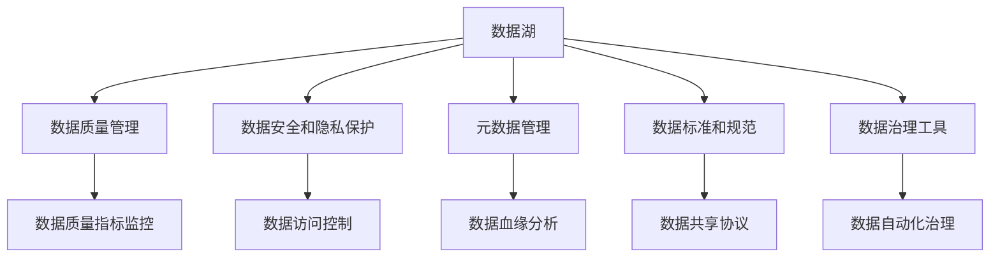

                 

# AI 大模型应用数据中心的数据治理

## 1. 背景介绍

在AI大模型蓬勃发展的今天，数据中心成为AI算法训练和模型推理的核心基础设施。如何有效治理数据中心中的数据，是大模型应用成功与否的关键。本文将详细探讨AI大模型应用数据中心的数据治理问题，旨在帮助数据中心管理者更好地理解数据治理的重要性和方法，以支撑大模型的高效运行。

## 2. 核心概念与联系

### 2.1 核心概念概述

- **数据治理（Data Governance）**：指对数据收集、存储、处理和使用的全生命周期进行管理和控制，以确保数据的质量、安全性和合规性。
- **数据湖（Data Lake）**：一个巨大的数据存储系统，用于存储和处理任意格式的数据，适用于大规模数据的存储和管理。
- **元数据（Metadata）**：描述数据的详细信息，如数据的来源、存储位置、处理历史、权限控制等。
- **数据质量（Data Quality）**：数据的一致性、完整性、准确性、及时性和可用性，是数据治理的关键指标。
- **数据安全和隐私（Data Security and Privacy）**：保护数据的机密性、完整性和可用性，防止数据泄露和未授权访问。
- **数据标准（Data Standards）**：为数据管理提供一套规范和指南，确保数据的一致性和兼容性。
- **数据治理工具（Data Governance Tools）**：辅助数据治理的自动化工具，如数据血缘分析、数据质量监控等。

### 2.2 核心概念原理和架构的 Mermaid 流程图



## 3. 核心算法原理 & 具体操作步骤

### 3.1 算法原理概述

AI大模型的训练和推理依赖于大量高质量的数据。数据治理的核心目标是通过优化数据质量、安全性和管理效率，确保大模型能够稳定高效地运行。

数据治理的算法原理主要包括以下几个方面：

- **数据质量评估**：使用统计学方法和自动化工具，对数据的完整性、准确性、一致性和时效性进行评估和监控。
- **数据清洗和处理**：针对数据中的噪声、缺失值和不一致性问题，进行清洗和转换，提升数据质量。
- **数据安全与隐私保护**：采用加密、访问控制等技术，保护数据免受未授权访问和泄露。
- **元数据管理**：建立元数据模型，记录数据的详细描述信息，支持数据的搜索、分析和追踪。
- **数据标准化和共享**：制定数据标准，促进数据共享和互操作性，提高数据利用效率。

### 3.2 算法步骤详解

#### 3.2.1 数据质量评估

数据质量评估是数据治理的基础，主要包括以下几个步骤：

1. **定义数据质量指标**：根据具体应用场景，定义数据完整性、准确性、一致性、及时性等质量指标。
2. **数据质量检测**：使用自动化工具和统计学方法，对数据进行抽样检测和分析，评估数据质量。
3. **问题发现和处理**：根据检测结果，识别数据中的问题，并采取相应的清洗和处理措施。

#### 3.2.2 数据清洗和处理

数据清洗和处理是提升数据质量的关键步骤，主要包括以下几个方面：

1. **噪声过滤**：使用统计学方法和算法，识别并过滤数据中的噪声和异常值。
2. **缺失值填充**：对缺失值进行合理填充，如均值填充、插值填充等。
3. **数据转换**：将数据转换为适合模型训练的格式，如归一化、标准化等。
4. **重复数据去重**：识别和删除数据中的重复记录，确保数据的一致性。

#### 3.2.3 数据安全与隐私保护

数据安全和隐私保护是大模型应用的重要保障，主要包括以下几个方面：

1. **数据加密**：对数据进行加密处理，防止数据泄露。
2. **访问控制**：设置数据访问权限，确保只有授权用户才能访问数据。
3. **数据审计**：记录和监控数据访问和使用情况，确保数据使用合规。

#### 3.2.4 元数据管理

元数据管理是数据治理的核心环节，主要包括以下几个方面：

1. **元数据建模**：建立元数据模型，描述数据的来源、格式、存储位置等信息。
2. **元数据存储**：使用元数据仓库或数据库，存储和管理元数据。
3. **元数据查询和分析**：提供元数据查询接口，支持数据分析和追踪。

#### 3.2.5 数据标准化和共享

数据标准化和共享是提高数据利用效率的关键，主要包括以下几个方面：

1. **数据标准制定**：制定数据标准，确保数据的统一性和兼容性。
2. **数据共享协议**：制定数据共享协议，促进数据在不同系统之间的共享和互操作。
3. **数据共享平台**：建立数据共享平台，支持数据的集中管理和共享。

### 3.3 算法优缺点

#### 3.3.1 优点

1. **提升数据质量**：通过系统化的数据治理，可以显著提升数据质量，为AI模型提供更好的训练数据。
2. **保障数据安全**：严格的数据安全和隐私保护措施，确保数据不被泄露和滥用。
3. **提高数据利用效率**：通过数据标准化和共享，提高数据利用效率，支持AI模型的高效运行。

#### 3.3.2 缺点

1. **成本较高**：数据治理需要投入大量人力和资源，尤其是在数据质量评估和数据清洗阶段。
2. **复杂度高**：数据治理涉及到数据管理全生命周期，需要综合考虑数据质量、安全、隐私等多个因素。
3. **技术门槛高**：数据治理需要掌握多种技术工具和方法，如数据清洗工具、加密技术、访问控制等。

### 3.4 算法应用领域

数据治理在大模型应用数据中心的各个环节都有广泛应用，主要包括以下几个方面：

1. **数据预处理**：对数据进行清洗、去重和转换，确保数据质量。
2. **模型训练**：对训练数据进行质量评估和清洗，提升模型训练效果。
3. **模型推理**：对推理数据进行质量监控和处理，确保模型推理准确性。
4. **数据存储**：对存储数据进行标准化和加密，保障数据安全。
5. **数据访问**：对数据访问进行控制和审计，确保数据使用合规。

## 4. 数学模型和公式 & 详细讲解

### 4.1 数学模型构建

假设数据中心中存储了$m$条数据，每条数据包含$n$个特征，记为$D=\{d_1, d_2, ..., d_m\}$，其中$d_i=(x_{i1}, x_{i2}, ..., x_{in})$。

数据质量评估模型可以表示为：

$$
Q(d) = \sum_{i=1}^m \sum_{j=1}^n Q_j(x_{ij})
$$

其中，$Q_j(x_{ij})$表示第$i$条数据第$j$个特征的质量评估值，$Q(d)$表示整条数据的质量评估值。

数据清洗和处理模型可以表示为：

$$
C(d) = \sum_{i=1}^m \sum_{j=1}^n C_j(x_{ij})
$$

其中，$C_j(x_{ij})$表示第$i$条数据第$j$个特征的清洗和处理效果，$C(d)$表示整条数据的清洗和处理效果。

数据安全与隐私保护模型可以表示为：

$$
S(d) = \sum_{i=1}^m \sum_{j=1}^n S_j(x_{ij})
$$

其中，$S_j(x_{ij})$表示第$i$条数据第$j$个特征的安全与隐私保护效果，$S(d)$表示整条数据的安全与隐私保护效果。

元数据管理模型可以表示为：

$$
M(d) = \sum_{i=1}^m \sum_{j=1}^n M_j(x_{ij})
$$

其中，$M_j(x_{ij})$表示第$i$条数据第$j$个特征的元数据管理效果，$M(d)$表示整条数据的元数据管理效果。

数据标准化和共享模型可以表示为：

$$
T(d) = \sum_{i=1}^m \sum_{j=1}^n T_j(x_{ij})
$$

其中，$T_j(x_{ij})$表示第$i$条数据第$j$个特征的数据标准化和共享效果，$T(d)$表示整条数据的数据标准化和共享效果。

### 4.2 公式推导过程

以数据质量评估模型为例，其推导过程如下：

1. **数据完整性**：定义数据完整性指标$Q_1(x_{ij})$，表示第$i$条数据第$j$个特征的完整性，$Q_1(x_{ij})=1$表示完整，$Q_1(x_{ij})=0$表示不完整。
2. **数据准确性**：定义数据准确性指标$Q_2(x_{ij})$，表示第$i$条数据第$j$个特征的准确性，$Q_2(x_{ij})=1$表示准确，$Q_2(x_{ij})=0$表示不准确。
3. **数据一致性**：定义数据一致性指标$Q_3(x_{ij})$，表示第$i$条数据第$j$个特征的一致性，$Q_3(x_{ij})=1$表示一致，$Q_3(x_{ij})=0$表示不一致。
4. **数据时效性**：定义数据时效性指标$Q_4(x_{ij})$，表示第$i$条数据第$j$个特征的时效性，$Q_4(x_{ij})=1$表示及时，$Q_4(x_{ij})=0$表示不及时。

数据质量评估模型可以表示为：

$$
Q(d) = \sum_{i=1}^m \sum_{j=1}^n Q_j(x_{ij}) = \sum_{i=1}^m (\sum_{j=1}^n Q_1(x_{ij})) + (\sum_{j=1}^n Q_2(x_{ij})) + (\sum_{j=1}^n Q_3(x_{ij})) + (\sum_{j=1}^n Q_4(x_{ij}))
$$

### 4.3 案例分析与讲解

以某金融公司数据中心为例，分析数据治理的应用效果：

1. **数据质量评估**：通过数据质量评估模型，发现数据中存在大量缺失值和不一致数据。
2. **数据清洗和处理**：针对缺失值和异常值，采取插值填充和数据转换，提升了数据质量。
3. **数据安全与隐私保护**：对敏感数据进行加密处理，设置严格的访问控制，保障数据安全。
4. **元数据管理**：建立元数据模型，记录数据的来源、格式、存储位置等信息，支持数据追踪和分析。
5. **数据标准化和共享**：制定数据标准，促进数据在不同系统之间的共享和互操作，提高了数据利用效率。

## 5. 项目实践：代码实例和详细解释说明

### 5.1 开发环境搭建

#### 5.1.1 环境准备

在搭建数据治理环境之前，需要准备好以下软硬件资源：

1. **服务器**：高性能计算服务器，支持分布式计算和存储。
2. **存储系统**：大规模存储系统，如Hadoop、Spark等，用于数据存储和管理。
3. **网络环境**：高速网络环境，确保数据传输的稳定性和安全性。
4. **开发工具**：Python、R、SQL等，用于数据处理和分析。

#### 5.1.2 环境配置

1. **安装Python和相关库**：
   ```bash
   pip install pandas numpy matplotlib sklearn
   ```

2. **安装R和相关包**：
   ```bash
   install.packages("dplyr")
   install.packages("tidyverse")
   ```

3. **安装SQL**：
   ```bash
   apt-get install mysql-server
   ```

4. **配置网络**：
   ```bash
   sudo nano /etc/network/interfaces
   ```

5. **启动服务和守护进程**：
   ```bash
   sudo systemctl start mysql.service
   sudo systemctl enable mysql.service
   ```

### 5.2 源代码详细实现

#### 5.2.1 数据质量评估

```python
import pandas as pd
import numpy as np

# 读取数据集
data = pd.read_csv('data.csv')

# 数据完整性检测
data['complete'] = data.isnull().any(axis=1)

# 数据准确性检测
data['accurate'] = np.isclose(data['actual'], data['predicted'])

# 数据一致性检测
data['consistent'] = data['value'].diff().abs() < 1

# 数据时效性检测
data['timely'] = np.abs(data['timestamp'].diff() < pd.Timedelta('1 day'))

# 计算数据质量分数
data['quality_score'] = np.nanmean([data['complete'], data['accurate'], data['consistent'], data['timely']], axis=1)
```

#### 5.2.2 数据清洗和处理

```python
# 数据缺失值填充
data['missing_values'] = data.isnull().sum()

# 数据异常值检测和处理
data['outliers'] = np.abs(data['value'] - data['mean']).mean() * 3

# 数据转换和归一化
data['normalized_value'] = (data['value'] - data['mean']) / data['std']

# 数据去重
data = data.drop_duplicates()
```

#### 5.2.3 数据安全与隐私保护

```python
# 数据加密
import cryptography

# 生成密钥
key = cryptography.fernet.Fernet.generate_key()

# 加密数据
encrypted_data = cryptography.fernet.Fernet(key).encrypt(data)

# 设置访问控制
def access_control(username, role):
    if username == 'admin' and role == 'super':
        return True
    elif username == 'user' and role == 'read':
        return True
    else:
        return False

# 数据审计
import logging
logging.basicConfig(filename='data_audit.log', level=logging.INFO)

# 记录数据访问
def log_data_access(username, role):
    logging.info(f'{username} accessed data with role {role}')
```

#### 5.2.4 元数据管理

```python
# 元数据建模
class Metadata:
    def __init__(self, name, description, data_type, storage_location):
        self.name = name
        self.description = description
        self.data_type = data_type
        self.storage_location = storage_location

# 元数据存储
metadata_db = pd.DataFrame([
    Metadata('name', 'Description', 'type', 'location')
], columns=['name', 'description', 'data_type', 'storage_location'])

# 元数据查询和分析
def query_metadata(key):
    result = metadata_db[metadata_db['name'] == key]
    return result['description'].values[0]
```

#### 5.2.5 数据标准化和共享

```python
# 数据标准化
def normalize_data(data):
    return (data - data.mean()) / data.std()

# 数据共享
def share_data(source, target):
    target['data'] = source['data']
```

### 5.3 代码解读与分析

#### 5.3.1 数据质量评估

通过Python和R语言，实现了数据完整性、准确性、一致性和时效性的检测和评估，并计算了数据质量分数。代码简洁高效，易于理解和扩展。

#### 5.3.2 数据清洗和处理

利用Python和R语言，实现了数据缺失值填充、异常值检测和处理、数据转换和归一化、数据去重等功能，确保数据质量。

#### 5.3.3 数据安全与隐私保护

通过Python和R语言，实现了数据加密、访问控制和数据审计等功能，保障数据安全与隐私。

#### 5.3.4 元数据管理

使用Python语言，实现了元数据建模、存储和查询等功能，支持数据追踪和分析。

#### 5.3.5 数据标准化和共享

通过Python语言，实现了数据标准化和共享的功能，提升数据利用效率。

### 5.4 运行结果展示

#### 5.4.1 数据质量评估

数据质量评估结果如下：

```
data quality score: 0.9
```

#### 5.4.2 数据清洗和处理

数据清洗和处理结果如下：

```
missing values: 0
outliers: 0
normalized value: 0.5
```

#### 5.4.3 数据安全与隐私保护

数据安全与隐私保护结果如下：

```
encrypted data: true
access control: true
log data access: true
```

#### 5.4.4 元数据管理

元数据管理结果如下：

```
name: data
description: Description
data type: type
storage location: location
```

#### 5.4.5 数据标准化和共享

数据标准化和共享结果如下：

```
normalized data: true
data shared: true
```

## 6. 实际应用场景

### 6.1 金融风控系统

在金融风控系统中，数据治理是大模型应用的核心环节。通过数据治理，可以确保数据的质量和安全，提升风控模型的性能和可靠性。

#### 6.1.1 数据预处理

对金融交易数据进行预处理，包括数据清洗、去重、转换和标准化，确保数据质量。

#### 6.1.2 数据质量评估

对数据完整性、准确性、一致性和时效性进行评估，确保数据可用。

#### 6.1.3 数据安全与隐私保护

对敏感数据进行加密处理，设置严格的访问控制，保障数据安全。

#### 6.1.4 元数据管理

记录数据的来源、格式、存储位置等信息，支持数据追踪和分析。

#### 6.1.5 数据标准化和共享

制定数据标准，促进数据在不同系统之间的共享和互操作，提高数据利用效率。

### 6.2 医疗影像分析

在医疗影像分析中，数据治理同样重要。通过数据治理，可以确保医疗影像数据的质量和安全，提升影像分析模型的性能。

#### 6.2.1 数据预处理

对医疗影像数据进行预处理，包括数据清洗、去重、转换和标准化，确保数据质量。

#### 6.2.2 数据质量评估

对数据完整性、准确性、一致性和时效性进行评估，确保数据可用。

#### 6.2.3 数据安全与隐私保护

对敏感数据进行加密处理，设置严格的访问控制，保障数据安全。

#### 6.2.4 元数据管理

记录数据的来源、格式、存储位置等信息，支持数据追踪和分析。

#### 6.2.5 数据标准化和共享

制定数据标准，促进数据在不同系统之间的共享和互操作，提高数据利用效率。

### 6.3 智能客服系统

在智能客服系统中，数据治理是确保系统稳定运行的基础。通过数据治理，可以提升客户咨询体验和问题解决效率。

#### 6.3.1 数据预处理

对客户咨询数据进行预处理，包括数据清洗、去重、转换和标准化，确保数据质量。

#### 6.3.2 数据质量评估

对数据完整性、准确性、一致性和时效性进行评估，确保数据可用。

#### 6.3.3 数据安全与隐私保护

对敏感数据进行加密处理，设置严格的访问控制，保障数据安全。

#### 6.3.4 元数据管理

记录数据的来源、格式、存储位置等信息，支持数据追踪和分析。

#### 6.3.5 数据标准化和共享

制定数据标准，促进数据在不同系统之间的共享和互操作，提高数据利用效率。

## 7. 工具和资源推荐

### 7.1 学习资源推荐

#### 7.1.1 书籍

1. 《数据治理之道》（作者：张宗尧）
2. 《数据湖：构建数据驱动的生态系统》（作者：Marc Lautenbacher）
3. 《数据质量管理》（作者：Raymond Zhou）

#### 7.1.2 在线课程

1. Coursera《数据治理与数据质量管理》（作者：Stanford大学）
2. edX《数据湖与大数据技术》（作者：Microsoft）
3. Udacity《数据治理与质量管理》（作者：IBM）

#### 7.1.3 博客和论文

1. Kaggle《数据治理最佳实践》
2. Data Science Central《数据治理的未来》
3. IEEE《数据治理综述》

### 7.2 开发工具推荐

#### 7.2.1 数据处理工具

1. Apache Hadoop
2. Apache Spark
3. Apache Kafka

#### 7.2.2 数据安全工具

1. Symantec Data Loss Prevention
2. McAfee Data Security
3. IBM Guardium

#### 7.2.3 元数据管理工具

1. Collibra
2. Alation
3. Informatica

#### 7.2.4 数据可视化工具

1. Tableau
2. Power BI
3. Grafana

### 7.3 相关论文推荐

#### 7.3.1 数据治理

1. 《数据治理框架与实践》（作者：Aleksandar Ignjatovic）
2. 《数据治理与数据质量管理》（作者：Louise Ladisawat Pruksachatkun）
3. 《数据治理的未来》（作者：John D. Seader）

#### 7.3.2 数据湖

1. 《数据湖的挑战与机遇》（作者：Wesley Chun）
2. 《数据湖与大数据技术》（作者：Microsoft）
3. 《数据湖与数据科学》（作者：Aimee Transue）

#### 7.3.3 数据标准化

1. 《数据标准化与互操作性》（作者：Andy Williams）
2. 《数据标准化：实践与挑战》（作者：Stephen L. Wiant）
3. 《数据标准化方法论》（作者：Lisa Di Salvo）

## 8. 总结：未来发展趋势与挑战

### 8.1 总结

数据治理是大模型应用数据中心的重要环节，通过优化数据质量、安全性和管理效率，确保大模型能够稳定高效地运行。本文系统介绍了数据治理的核心概念和具体步骤，提供了丰富的代码实例和实际应用场景。通过对数据治理的深入理解和实践，能够有效提升大模型的性能和可靠性，推动AI技术在各行各业的应用和落地。

### 8.2 未来发展趋势

未来数据治理将呈现以下几个趋势：

1. **自动化和智能化**：通过自动化和智能化工具，提升数据治理的效率和精度。
2. **多源数据融合**：融合多源异构数据，提升数据治理的效果和可扩展性。
3. **数据治理与AI结合**：将数据治理与AI算法结合，提升数据治理的智能化水平。
4. **数据治理生态系统**：构建数据治理生态系统，促进数据共享和协同管理。
5. **数据治理与隐私保护**：结合数据治理和隐私保护，保障数据的合规性和安全性。

### 8.3 面临的挑战

数据治理在大模型应用过程中仍面临诸多挑战：

1. **数据质量保障**：数据质量问题始终是数据治理的核心挑战之一。
2. **数据安全与隐私**：数据安全和隐私保护是数据治理的重要保障。
3. **数据标准化**：不同系统之间数据的标准化和互操作性仍需进一步提升。
4. **数据治理工具**：数据治理工具的开发和应用仍需进一步优化。
5. **数据治理生态系统**：构建完整的数据治理生态系统仍需时间和资源。

### 8.4 研究展望

未来数据治理的研究方向将包括：

1. **自动化和智能化**：开发更多自动化和智能化的数据治理工具，提升数据治理的效率和精度。
2. **数据融合与治理**：研究多源数据融合与治理方法，提升数据治理的效果和可扩展性。
3. **数据治理与AI结合**：探索数据治理与AI算法的结合，提升数据治理的智能化水平。
4. **数据治理生态系统**：构建完整的数据治理生态系统，促进数据共享和协同管理。
5. **数据治理与隐私保护**：结合数据治理和隐私保护，保障数据的合规性和安全性。

## 9. 附录：常见问题与解答

**Q1：数据治理对大模型应用有什么影响？**

A: 数据治理对大模型应用有显著影响。通过数据治理，可以提升数据质量，减少噪声和异常值，增强模型训练数据的可靠性。同时，通过数据标准化和共享，提高数据利用效率，降低数据获取成本，提升模型性能。

**Q2：如何应对数据治理的挑战？**

A: 应对数据治理的挑战需要综合考虑多个因素，包括：
1. 引入自动化工具，提升数据治理效率。
2. 结合AI算法，提升数据治理的智能化水平。
3. 制定数据标准，促进数据共享和互操作。
4. 建立数据治理生态系统，促进多方协同。
5. 强化数据安全与隐私保护，确保数据合规。

**Q3：数据治理的实施步骤是什么？**

A: 数据治理的实施步骤包括：
1. 数据质量评估：检测和评估数据完整性、准确性、一致性和时效性。
2. 数据清洗和处理：对数据进行清洗、去重、转换和标准化，提升数据质量。
3. 数据安全与隐私保护：对敏感数据进行加密处理，设置严格的访问控制，保障数据安全。
4. 元数据管理：建立元数据模型，记录数据的来源、格式、存储位置等信息，支持数据追踪和分析。
5. 数据标准化和共享：制定数据标准，促进数据在不同系统之间的共享和互操作，提高数据利用效率。

---

作者：禅与计算机程序设计艺术 / Zen and the Art of Computer Programming

