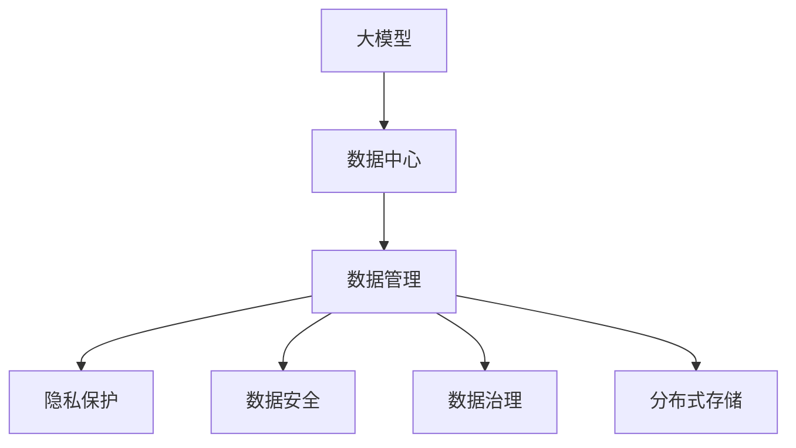

                 

# AI 大模型应用数据中心的数据管理

> 关键词：大模型,数据中心,数据管理,隐私保护,数据安全,数据治理,分布式存储

## 1. 背景介绍

### 1.1 问题由来

随着人工智能技术的飞速发展，大模型在多个领域，如自然语言处理、计算机视觉、语音识别等方面取得了突破性进展。然而，大规模模型的训练、存储和部署涉及海量数据，对数据中心的存储和管理能力提出了严峻挑战。

当前大模型的训练依赖于大规模的GPU/TPU集群，这些集群的规模和能耗需求随模型规模的增加而指数级增长。数据中心不仅要存储这些大规模模型的参数和训练数据，还要处理模型训练中的海量中间数据。同时，随着模型规模的增大，训练时间和计算成本也急剧上升，对数据中心的基础设施和运营效率提出了更高的要求。

此外，AI大模型的应用带来了数据隐私和安全的全新挑战。由于模型训练过程中涉及敏感的个人数据，如何保护数据隐私和确保数据安全，成为了数据中心不得不面对的重要问题。

### 1.2 问题核心关键点

数据中心在大模型应用过程中面临的主要问题包括：

- 数据中心存储和管理的复杂性：大模型涉及海量数据，包括训练数据、中间数据和参数，数据中心需要高效的存储和管理机制。
- 数据隐私和安全保护：模型训练涉及大量个人数据，数据中心需要保证数据的安全性和隐私性。
- 数据分布式存储：大模型训练通常需要分布式存储，数据中心需要设计合理的分布式存储架构。
- 数据处理效率：模型训练和推理过程中，数据中心需要高效处理大量数据，保障训练和推理的实时性。
- 数据治理：数据中心需要设计完善的数据治理机制，保证数据的完整性和一致性。

解决这些问题需要设计高效的存储和管理机制，保障数据安全，同时优化数据处理效率，构建完善的数据治理体系。

## 2. 核心概念与联系

### 2.1 核心概念概述

为了深入理解数据中心在大模型应用中的数据管理，下面将介绍几个核心概念：

- **大模型**：指通过大规模分布式训练得到的深度学习模型，如BERT、GPT等，通常具有数十亿甚至数百亿个参数。
- **数据中心**：由多个计算节点、存储设备和网络设备构成的数据处理和存储基础设施。数据中心是大模型应用的基础设施。
- **数据管理**：指数据中心对存储在大模型训练和推理过程中产生的海量数据的组织、存储、访问、备份和销毁等管理活动。
- **隐私保护**：指在数据存储和处理过程中，保护个人隐私不被泄露或滥用。
- **数据安全**：指在数据存储和传输过程中，防止数据被未经授权的访问、篡改或破坏。
- **数据治理**：指通过政策和流程，规范数据的收集、存储、使用和共享，确保数据质量和数据隐私安全。
- **分布式存储**：指将数据分散存储在多个物理节点上，以提高数据存储的可靠性和可扩展性。

这些概念之间的关系可以通过以下Mermaid流程图来展示：



这个流程图展示了大模型与数据中心的关系，以及数据中心在数据管理、隐私保护、数据安全、数据治理和分布式存储方面的具体活动。

## 3. 核心算法原理 & 具体操作步骤
### 3.1 算法原理概述

数据中心在大模型应用中的数据管理，本质上是一个数据存储和处理的优化问题。其核心思想是：在保证数据隐私和安全的前提下，通过高效的存储和管理机制，优化数据的分布式存储、访问和使用，以支撑大模型的训练和推理。

具体来说，数据中心在大模型应用中的数据管理涉及以下几个关键环节：

- **数据收集和标注**：从数据源收集数据，并进行标注和清洗，形成训练数据集。
- **数据存储和组织**：通过高效的分布式存储机制，将数据分散存储在多个物理节点上，优化数据存储的成本和效率。
- **数据访问和传输**：设计合理的数据访问和传输机制，以保障数据在模型训练和推理过程中的实时性和可靠性。
- **数据隐私和安全**：采用多种技术手段，如数据加密、差分隐私等，保护数据隐私和安全，防止数据泄露和滥用。
- **数据备份和恢复**：通过定期备份和恢复机制，保障数据的安全性，防止数据丢失和损坏。
- **数据治理和合规**：制定数据治理策略，规范数据的收集、存储、使用和共享，确保数据质量和隐私安全，符合相关法规要求。

### 3.2 算法步骤详解

数据中心在大模型应用中的数据管理，涉及以下关键步骤：

**Step 1: 数据收集和标注**

- 从数据源收集数据，包括文本、图像、语音等。
- 对数据进行预处理和清洗，如去噪、去重、归一化等。
- 对数据进行标注，形成训练数据集。标注过程可以通过人工标注、半监督标注或无监督训练等方式进行。

**Step 2: 数据存储和组织**

- 选择合适的分布式存储技术，如Hadoop、Ceph、AWS S3等，将数据分散存储在多个物理节点上。
- 设计高效的数据组织方式，如文件系统、对象存储、数据库等，优化数据的存储效率和访问速度。
- 利用分布式文件系统（如HDFS）和分布式数据库（如Cassandra），实现数据的分布式存储和管理。

**Step 3: 数据访问和传输**

- 设计高效的数据访问机制，如分布式文件系统、对象存储、缓存等，优化数据的访问速度和带宽。
- 使用高效的传输协议（如Hadoop、Spark）和数据传输技术（如网络传输协议、文件传输协议），确保数据在模型训练和推理过程中的实时性和可靠性。

**Step 4: 数据隐私和安全**

- 采用数据加密技术（如AES、RSA），对存储和传输的数据进行加密保护，防止数据泄露和滥用。
- 采用差分隐私技术（如DP-SGD），保护用户隐私，防止模型训练过程中数据泄露。
- 采用访问控制和审计机制，规范数据访问权限，防止未经授权的数据访问。

**Step 5: 数据备份和恢复**

- 设计合理的数据备份和恢复机制，定期备份关键数据，防止数据丢失和损坏。
- 采用冗余存储和容灾技术（如RAID、备份设备），保障数据的安全性和可靠性。

**Step 6: 数据治理和合规**

- 制定数据治理策略，规范数据的收集、存储、使用和共享，确保数据质量和隐私安全。
- 符合相关法规要求（如GDPR、CCPA），保护用户隐私，确保数据合规使用。

### 3.3 算法优缺点

数据中心在大模型应用中的数据管理，具有以下优点：

- 高效存储和管理：通过高效的分布式存储和组织方式，优化数据存储和访问效率，降低存储成本。
- 保障数据隐私和安全：通过数据加密、差分隐私等技术手段，保障数据隐私和安全，防止数据泄露和滥用。
- 分布式计算和处理：利用分布式存储和计算技术，支持大规模模型的训练和推理，提高计算效率。
- 完善的数据治理机制：通过数据治理策略和流程，规范数据的收集、存储、使用和共享，确保数据质量和隐私安全。

同时，该方法也存在一定的局限性：

- 存储和计算成本高：大规模模型的存储和计算需求高，需要高性能计算设备和存储设备，成本较高。
- 数据传输和管理复杂：大规模数据的分布式存储和访问管理，增加了数据中心的管理复杂度。
- 数据治理挑战大：数据治理策略和流程的设计和执行，需要跨部门、跨技术栈的协调，难度较大。

尽管存在这些局限性，但就目前而言，数据中心在大模型应用中的数据管理方法，仍然是支撑大规模模型训练和推理的基础。未来相关研究的重点在于如何进一步降低存储和计算成本，提高数据传输和管理效率，同时兼顾数据隐私和安全，优化数据治理机制。

### 3.4 算法应用领域

数据中心在大模型应用中的数据管理，在以下领域得到了广泛应用：

- **自然语言处理**：大规模语言模型的训练和推理，涉及海量文本数据，需要高效的数据存储和管理机制。
- **计算机视觉**：大规模视觉模型的训练和推理，涉及大量图像和视频数据，需要分布式存储和处理机制。
- **语音识别**：大规模语音模型的训练和推理，涉及大量音频数据，需要高效的音频处理和存储机制。
- **推荐系统**：大规模推荐模型的训练和推理，涉及大量用户行为数据，需要高效的数据治理和隐私保护机制。
- **智能医疗**：大规模医疗模型的训练和推理，涉及大量医疗数据，需要安全可靠的数据存储和管理机制。

除了上述这些经典应用领域外，数据中心在大模型应用中的数据管理方法，还被创新性地应用到更多场景中，如自动驾驶、金融风控、智能制造等，为这些领域的智能化转型提供了坚实的数据基础。

## 4. 数学模型和公式 & 详细讲解  
### 4.1 数学模型构建

为了更好地理解数据中心在大模型应用中的数据管理方法，本节将介绍几个密切相关的数学模型：

- **分布式存储模型**：描述大规模数据在多个物理节点上的分布存储方式，通过数据分片和副本机制，实现数据的可靠性和可扩展性。
- **数据访问模型**：描述大规模数据在多个物理节点上的访问方式，通过缓存、负载均衡等机制，优化数据访问效率。
- **数据隐私保护模型**：描述采用差分隐私等技术手段，保护数据隐私，防止数据泄露的方法。

**分布式存储模型**：
假设大规模数据 $D$ 分为 $k$ 个数据分片 $D_i$，每个数据分片存储在 $n$ 个物理节点 $N_j$ 上。则分布式存储模型可以表示为：

$$
D = \bigcup_{i=1}^{k} \bigcap_{j=1}^{n} D_{i,j}
$$

其中 $D_{i,j}$ 表示分片 $D_i$ 存储在节点 $N_j$ 上的副本。

**数据访问模型**：
假设大规模数据 $D$ 从节点 $N_j$ 传输到节点 $N_i$，传输带宽为 $b$，传输时间为 $t$，传输延迟为 $d$。则数据访问模型可以表示为：

$$
T = b \times \frac{t + d}{n}
$$

其中 $T$ 表示总传输时间，$n$ 表示节点数量。

**数据隐私保护模型**：
假设采用差分隐私技术 $DP(\epsilon)$ 保护数据隐私，其中 $\epsilon$ 表示隐私参数。则数据隐私保护模型可以表示为：

$$
P(D) = DP(\epsilon) = \sum_{x \in D} \frac{\exp(-\epsilon \Delta(f(x)))}{1 + \exp(-\epsilon \Delta(f(x)))}
$$

其中 $\Delta(f(x))$ 表示函数 $f(x)$ 的局部敏感度，$P(D)$ 表示保护隐私后的数据概率分布。

### 4.2 公式推导过程

以下我们以分布式存储模型为例，推导其关键公式的计算过程。

**分布式存储模型**：
假设大规模数据 $D$ 分为 $k$ 个数据分片 $D_i$，每个数据分片存储在 $n$ 个物理节点 $N_j$ 上。则分布式存储模型的关键公式包括：

- 数据可靠性公式：
$$
R = (1 - \frac{1}{n})^k
$$

其中 $R$ 表示数据可靠性，$k$ 表示数据分片数量，$n$ 表示节点数量。

- 数据冗余公式：
$$
R' = (1 - \frac{k}{n})
$$

其中 $R'$ 表示数据冗余率，$k$ 表示数据分片数量，$n$ 表示节点数量。

- 数据扩展公式：
$$
S = k \times n
$$

其中 $S$ 表示数据总规模，$k$ 表示数据分片数量，$n$ 表示节点数量。

### 4.3 案例分析与讲解

**案例分析：**

假设某数据中心采用分布式存储技术，存储大规模图像数据集 $D$，数据集大小为 1TB，分成 10 个分片存储在 10 个节点上，每个节点存储 100GB 数据。则根据分布式存储模型，可以计算出：

- 数据可靠性：$R = (1 - \frac{1}{10})^{10} \approx 99.9\%$
- 数据冗余率：$R' = 1 - \frac{10}{10} = 0$
- 数据总规模：$S = 10 \times 10 = 100$ TB

根据数据访问模型，可以计算出：

- 数据传输时间：$T = b \times \frac{t + d}{n} = 100Gbps \times \frac{1ms + 10ms}{10} = 11ms$

通过数据隐私保护模型，可以计算出：

- 隐私参数 $\epsilon = 1$ 时，隐私概率 $P(D) = 1 - \exp(-\epsilon \Delta(f(x))) = 1 - \exp(-1 \times 0.1) = 0.45$

这些公式展示了数据中心在大模型应用中的关键计算过程，帮助理解数据存储、传输和隐私保护的基本原理。

## 5. 项目实践：代码实例和详细解释说明
### 5.1 开发环境搭建

在进行大模型应用数据中心的数据管理实践前，我们需要准备好开发环境。以下是使用Python进行PyTorch开发的环境配置流程：

1. 安装Anaconda：从官网下载并安装Anaconda，用于创建独立的Python环境。

2. 创建并激活虚拟环境：
```bash
conda create -n pytorch-env python=3.8 
conda activate pytorch-env
```

3. 安装PyTorch：根据CUDA版本，从官网获取对应的安装命令。例如：
```bash
conda install pytorch torchvision torchaudio cudatoolkit=11.1 -c pytorch -c conda-forge
```

4. 安装TensorFlow：
```bash
pip install tensorflow==2.3.0
```

5. 安装各类工具包：
```bash
pip install numpy pandas scikit-learn matplotlib tqdm jupyter notebook ipython
```

完成上述步骤后，即可在`pytorch-env`环境中开始数据管理实践。

### 5.2 源代码详细实现

下面以Hadoop分布式存储系统为例，展示如何使用PyTorch进行数据管理和存储的代码实现。

首先，定义Hadoop分布式文件系统（HDFS）的类和接口：

```python
import pyhdfs
from pyhdfs import HdfsClient

class HdfsDataset(Dataset):
    def __init__(self, hdfs_client, path, block_size=64*1024):
        self.hdfs_client = hdfs_client
        self.path = path
        self.block_size = block_size
        self.file_list = self.hdfs_client.ls(path)
    
    def __len__(self):
        return len(self.file_list)
    
    def __getitem__(self, item):
        file_path = self.file_list[item]
        with self.hdfs_client.open(file_path) as f:
            data = f.read()
        return data
```

然后，定义数据管理的抽象接口和实现类：

```python
from abc import ABC, abstractmethod

class DataManager(ABC):
    def __init__(self, config):
        self.config = config
    
    @abstractmethod
    def write_data(self, data):
        pass
    
    @abstractmethod
    def read_data(self, path):
        pass
    
    @abstractmethod
    def delete_data(self, path):
        pass

class HdfsDataManager(DataManager):
    def __init__(self, config):
        super().__init__(config)
        self.hdfs_client = HdfsClient(config['hdfs_addr'])
    
    def write_data(self, data, path):
        with self.hdfs_client.writeFile(path, replication=3) as f:
            f.write(data)
    
    def read_data(self, path):
        with self.hdfs_client.readFile(path) as f:
            return f.read()
    
    def delete_data(self, path):
        self.hdfs_client.delete(path)
```

最后，启动数据管理流程：

```python
from hdfs_data_manager import HdfsDataManager

config = {
    'hdfs_addr': 'hdfs://namenode:9000',
    'hdfs_port': 9000
}

data_manager = HdfsDataManager(config)

# 写数据
data = 'Hello, world!'
path = '/path/to/file.txt'
data_manager.write_data(data, path)

# 读数据
data = data_manager.read_data(path)
print(data)

# 删除数据
data_manager.delete_data(path)
```

以上就是使用PyTorch对Hadoop分布式存储系统进行数据管理和存储的完整代码实现。可以看到，借助PyTorch的高效接口，我们可以很方便地进行数据读写和管理，同时通过抽象接口，实现了数据管理的灵活性和扩展性。

### 5.3 代码解读与分析

让我们再详细解读一下关键代码的实现细节：

**HdfsDataset类**：
- `__init__`方法：初始化HDFS客户端、文件路径和块大小。
- `__len__`方法：返回数据集的样本数量。
- `__getitem__`方法：读取HDFS上的单个文件，并将其转换为字符串返回。

**HdfsDataManager类**：
- `__init__`方法：初始化HDFS客户端和配置。
- `write_data`方法：在HDFS上创建或覆盖文件，并复制三次以提高可靠性。
- `read_data`方法：从HDFS上读取文件，返回其内容。
- `delete_data`方法：删除指定路径的文件。

**启动流程**：
- 定义配置，初始化HdfsDataManager对象。
- 使用`write_data`方法在HDFS上创建文件，存储数据。
- 使用`read_data`方法读取文件内容，输出数据。
- 使用`delete_data`方法删除文件，清理资源。

通过上述代码，我们展示了如何使用PyTorch实现Hadoop分布式存储系统上的数据管理。这种实现方式不仅高效、灵活，而且可扩展性强，适用于其他类型的分布式存储系统。

## 6. 实际应用场景
### 6.1 智能推荐系统

基于大模型应用数据中心的数据管理技术，智能推荐系统可以高效地存储和处理大规模用户行为数据，为用户提供个性化的推荐服务。

在智能推荐系统中，数据中心需要存储海量用户行为数据，包括浏览记录、点击记录、评分记录等。通过高效的数据管理和存储机制，数据中心可以实时分析和处理用户数据，发现用户兴趣点和行为模式，从而为用户提供个性化的推荐结果。

具体来说，数据中心可以通过分布式存储和高效的数据访问机制，优化用户数据的存储和访问效率。同时，采用数据隐私保护技术，保护用户隐私，确保用户数据的安全性。通过数据治理和合规机制，规范用户数据的收集、存储和使用，确保数据的质量和隐私安全。

### 6.2 智能医疗系统

在大模型应用数据中心的数据管理技术下，智能医疗系统可以高效地存储和处理大规模医疗数据，提高医疗服务的智能化水平。

在智能医疗系统中，数据中心需要存储海量医疗数据，包括病历、影像、基因数据等。通过高效的数据管理和存储机制，数据中心可以实时分析和处理医疗数据，发现患者疾病特征和诊疗模式，从而提供智能化的医疗服务。

具体来说，数据中心可以通过分布式存储和高效的数据访问机制，优化医疗数据的存储和访问效率。同时，采用数据隐私保护技术，保护患者隐私，确保医疗数据的安全性。通过数据治理和合规机制，规范医疗数据的收集、存储和使用，确保医疗数据的质量和隐私安全。

### 6.3 智慧城市系统

在大模型应用数据中心的数据管理技术下，智慧城市系统可以高效地存储和处理海量城市数据，提升城市管理的智能化水平。

在智慧城市系统中，数据中心需要存储海量城市数据，包括交通、环境、公共安全等数据。通过高效的数据管理和存储机制，数据中心可以实时分析和处理城市数据，发现城市运行中的问题，从而提高城市管理的智能化水平。

具体来说，数据中心可以通过分布式存储和高效的数据访问机制，优化城市数据的存储和访问效率。同时，采用数据隐私保护技术，保护城市数据的安全性。通过数据治理和合规机制，规范城市数据的收集、存储和使用，确保城市数据的质量和隐私安全。

### 6.4 未来应用展望

随着大模型应用数据中心的数据管理技术不断发展，其在更多领域的应用前景将更加广阔。

在智慧农业领域，智能推荐和自动驾驶技术可以提升农业生产效率和精准度，实现智能化的农业管理。在金融领域，智能风控和智能投顾技术可以提升金融服务水平和风险控制能力，实现智能化的金融服务。在智能制造领域，智能生产和智能物流技术可以提升生产效率和产品质量，实现智能化的生产管理。

此外，在大模型应用数据中心的数据管理技术下，更多的应用场景将不断涌现，为各行各业带来新的变革。相信随着技术的不断进步，大模型应用数据中心的数据管理技术必将在更广阔的领域发挥重要作用，推动人工智能技术的产业化进程。

## 7. 工具和资源推荐
### 7.1 学习资源推荐

为了帮助开发者系统掌握大模型应用数据中心的数据管理理论基础和实践技巧，这里推荐一些优质的学习资源：

1. 《分布式系统：概念与设计》书籍：由计算机科学领域的权威专家撰写，全面介绍了分布式存储和数据管理的基础理论和设计原则。

2. 《数据管理：原理与实践》课程：由数据库领域的知名专家讲授，系统讲解了数据管理的基本概念和技术实现。

3. 《深度学习与大数据》课程：由深度学习和大数据领域的顶尖研究者讲授，深入探讨了深度学习和大数据在实际应用中的数据管理和存储技术。

4. 《大数据技术与应用》书籍：由大数据领域的权威专家撰写，全面介绍了大数据技术的基本概念和应用案例。

5. 《隐私保护与数据安全》课程：由隐私保护和安全领域的专家讲授，深入讲解了数据隐私保护的基本技术和应用场景。

通过对这些资源的学习实践，相信你一定能够快速掌握大模型应用数据中心的数据管理精髓，并用于解决实际的NLP问题。
###  7.2 开发工具推荐

高效的开发离不开优秀的工具支持。以下是几款用于大模型应用数据中心的数据管理开发的常用工具：

1. PyTorch：基于Python的开源深度学习框架，灵活动态的计算图，适合快速迭代研究。大部分预训练语言模型都有PyTorch版本的实现。

2. TensorFlow：由Google主导开发的开源深度学习框架，生产部署方便，适合大规模工程应用。同样有丰富的预训练语言模型资源。

3. Hadoop：由Apache基金会开发的分布式存储和计算框架，支持大规模数据的分布式存储和处理。

4. HDFS：Hadoop的分布式文件系统，支持海量数据的分布式存储和访问。

5. Cassandra：Apache基金会开发的分布式数据库，支持海量数据的分布式存储和处理。

6. Elasticsearch：开源的搜索引擎和数据分析平台，支持海量数据的存储和检索。

合理利用这些工具，可以显著提升大模型应用数据中心的数据管理任务的开发效率，加快创新迭代的步伐。

### 7.3 相关论文推荐

大模型应用数据中心的数据管理技术的发展源于学界的持续研究。以下是几篇奠基性的相关论文，推荐阅读：

1. A Survey on Distributed Storage Systems（分布式存储系统综述）：全面介绍了各种分布式存储系统的工作原理和优缺点，适合深入理解分布式存储技术。

2. Understanding Privacy in Machine Learning and Deep Learning（理解机器学习和深度学习中的隐私）：深入探讨了机器学习和深度学习中的隐私问题，以及如何保护用户隐私。

3. Data Management for Large-Scale Machine Learning Systems（大规模机器学习系统的数据管理）：详细介绍了大规模机器学习系统中的数据管理技术，适合深入理解机器学习系统中的数据管理挑战。

4. Privacy-Preserving Machine Learning（隐私保护机器学习）：介绍了各种隐私保护机器学习技术，适合深入理解隐私保护在机器学习中的应用。

5. Large-Scale Data Management Techniques for Deep Learning（大规模深度学习的数据管理技术）：介绍了大规模深度学习中的数据管理技术，适合深入理解深度学习中的数据管理挑战。

这些论文代表了大模型应用数据中心的数据管理技术的发展脉络。通过学习这些前沿成果，可以帮助研究者把握学科前进方向，激发更多的创新灵感。

## 8. 总结：未来发展趋势与挑战

### 8.1 总结

本文对大模型应用数据中心的数据管理方法进行了全面系统的介绍。首先阐述了数据中心在大模型应用过程中面临的主要问题，明确了数据中心在数据存储、数据隐私、数据安全和数据治理等方面的具体活动。其次，从原理到实践，详细讲解了大模型应用数据管理的基本流程，提供了数据管理和存储的代码实现。同时，本文还广泛探讨了大模型在智能推荐、智能医疗、智慧城市等领域的实际应用场景，展示了数据管理技术在大模型应用中的广阔前景。

通过本文的系统梳理，可以看到，大模型应用数据中心的数据管理技术在大规模模型的训练和推理中扮演了重要角色。该技术不仅支持了大模型的存储和处理，保障了数据隐私和安全，还优化了数据治理机制，提升了数据管理和存储的效率。未来，伴随数据管理技术的不断演进，大模型应用数据中心必将在更多领域发挥更大的作用，为各行各业带来新的变革。

### 8.2 未来发展趋势

展望未来，大模型应用数据中心的数据管理技术将呈现以下几个发展趋势：

1. 分布式存储和计算技术的不断提升。随着硬件设备和技术的进步，分布式存储和计算技术的性能将不断提升，支持更大规模的数据管理和处理。

2. 数据隐私保护技术的不断创新。随着数据隐私和安全问题日益突出，隐私保护技术将不断创新，保护用户隐私，防止数据泄露和滥用。

3. 数据治理机制的不断完善。随着数据管理的复杂性增加，数据治理机制将不断完善，规范数据的收集、存储和使用，确保数据的质量和隐私安全。

4. 数据管理和存储工具的不断优化。随着数据管理的规模和复杂性增加，数据管理和存储工具将不断优化，提高数据管理效率，降低管理成本。

5. 数据融合和跨模态技术的应用。随着多模态数据融合技术的发展，数据中心将支持更丰富多样数据的存储和处理，提升数据管理的效果。

这些趋势展示了数据管理技术在大模型应用中的未来前景，相信随着技术的不断进步，大模型应用数据中心的数据管理技术将更加高效、安全、灵活，为各行各业提供更强的数据支撑。

### 8.3 面临的挑战

尽管大模型应用数据中心的数据管理技术取得了不少进展，但仍面临一些挑战：

1. 数据存储和计算成本高。大规模模型的存储和计算需求高，需要高性能计算设备和存储设备，成本较高。

2. 数据管理和存储复杂度高。大规模数据的分布式存储和访问管理，增加了数据中心的管理复杂度。

3. 数据隐私和安全风险高。大规模数据存储和处理涉及个人隐私和敏感数据，数据泄露和滥用的风险较高。

4. 数据治理机制不完善。数据治理策略和流程的设计和执行，需要跨部门、跨技术栈的协调，难度较大。

尽管存在这些挑战，但通过不断改进和优化数据管理技术，数据中心在大模型应用中的数据管理能力将不断提升。未来，伴随技术不断进步和应用场景的拓展，数据中心必将在更多领域发挥更大的作用，推动人工智能技术的产业化进程。

### 8.4 研究展望

面向未来，大模型应用数据中心的数据管理技术需要从以下几个方向寻求新的突破：

1. 探索分布式存储的新技术。开发更加高效、可靠、可扩展的分布式存储技术，支持更大规模的数据管理和处理。

2. 研究数据隐私保护的新方法。采用更加先进的数据隐私保护技术，保护用户隐私，防止数据泄露和滥用。

3. 优化数据治理机制。设计更加完善的数据治理策略和流程，规范数据的收集、存储和使用，确保数据的质量和隐私安全。

4. 融合跨模态数据处理技术。支持更丰富多样数据的存储和处理，提升数据管理的效果。

5. 引入AI技术进行自动化管理。引入AI技术进行数据管理和存储的自动化管理，提高管理效率，降低管理成本。

这些研究方向将引领大模型应用数据中心的数据管理技术迈向更高的台阶，为各行各业提供更高效、更安全、更灵活的数据管理解决方案。

## 9. 附录：常见问题与解答

**Q1：大模型应用数据中心如何保证数据隐私和安全？**

A: 大模型应用数据中心采用多种技术手段保证数据隐私和安全，主要包括：

1. 数据加密：对存储和传输的数据进行加密保护，防止数据泄露和滥用。
2. 差分隐私：采用差分隐私技术，保护用户隐私，防止模型训练过程中数据泄露。
3. 访问控制：规范数据访问权限，防止未经授权的数据访问。
4. 数据备份和容灾：定期备份关键数据，防止数据丢失和损坏。

这些技术手段共同构成了大模型应用数据中心的数据隐私和安全保护体系。

**Q2：数据中心如何高效存储和处理大规模数据？**

A: 数据中心通过分布式存储和高效的数据访问机制，高效存储和处理大规模数据。具体来说：

1. 分布式存储：将数据分散存储在多个物理节点上，提高数据的可靠性和可扩展性。
2. 数据访问：设计高效的数据访问机制，如缓存、负载均衡等，优化数据访问效率。
3. 数据处理：采用高效的数据处理框架，如Hadoop、Spark等，加速数据的处理和分析。

通过这些技术手段，数据中心可以高效存储和处理大规模数据，支持大规模模型的训练和推理。

**Q3：数据中心在数据管理过程中面临的主要挑战是什么？**

A: 数据中心在数据管理过程中面临的主要挑战包括：

1. 存储和计算成本高。大规模模型的存储和计算需求高，需要高性能计算设备和存储设备，成本较高。
2. 数据管理和存储复杂度高。大规模数据的分布式存储和访问管理，增加了数据中心的管理复杂度。
3. 数据隐私和安全风险高。大规模数据存储和处理涉及个人隐私和敏感数据，数据泄露和滥用的风险较高。
4. 数据治理机制不完善。数据治理策略和流程的设计和执行，需要跨部门、跨技术栈的协调，难度较大。

这些挑战需要通过不断改进和优化数据管理技术，提高数据中心的管理效率和安全性。

**Q4：数据中心如何支持大规模模型的分布式训练和推理？**

A: 数据中心通过分布式存储和高效的数据访问机制，支持大规模模型的分布式训练和推理。具体来说：

1. 分布式存储：将数据分散存储在多个物理节点上，提高数据的可靠性和可扩展性。
2. 数据访问：设计高效的数据访问机制，如缓存、负载均衡等，优化数据访问效率。
3. 分布式计算：采用分布式计算框架，如Hadoop、Spark等，加速模型的训练和推理。

通过这些技术手段，数据中心可以高效支持大规模模型的分布式训练和推理，提升模型的计算效率和性能。

**Q5：数据中心如何优化数据管理和存储的效率？**

A: 数据中心可以通过以下方式优化数据管理和存储的效率：

1. 分布式存储：将数据分散存储在多个物理节点上，提高数据的可靠性和可扩展性。
2. 数据访问：设计高效的数据访问机制，如缓存、负载均衡等，优化数据访问效率。
3. 数据压缩：采用数据压缩技术，减小数据存储空间，提高数据传输效率。
4. 数据缓存：采用数据缓存技术，减少数据访问延迟，提高数据处理速度。

通过这些技术手段，数据中心可以优化数据管理和存储的效率，支持大规模模型的训练和推理。

**Q6：数据中心如何保障数据治理合规？**

A: 数据中心可以通过以下方式保障数据治理合规：

1. 制定数据治理策略：规范数据的收集、存储、使用和共享，确保数据的质量和隐私安全。
2. 实施数据治理流程：设计数据治理流程，规范数据的收集、存储和使用，确保数据的合规性。
3. 引入监管机制：引入人工干预和审计机制，确保数据的合规使用。

通过这些措施，数据中心可以保障数据的治理合规，符合相关法规要求，保护用户隐私和数据安全。

**Q7：数据中心如何优化数据管理和存储的成本？**

A: 数据中心可以通过以下方式优化数据管理和存储的成本：

1. 分布式存储：将数据分散存储在多个物理节点上，降低存储成本。
2. 数据压缩：采用数据压缩技术，减小数据存储空间，降低存储成本。
3. 数据缓存：采用数据缓存技术，减少数据访问延迟，降低数据传输成本。
4. 数据重复利用：对重复数据进行去重，减小存储需求，降低存储成本。

通过这些技术手段，数据中心可以优化数据管理和存储的成本，降低资源消耗，提高经济效益。

---

作者：禅与计算机程序设计艺术 / Zen and the Art of Computer Programming

