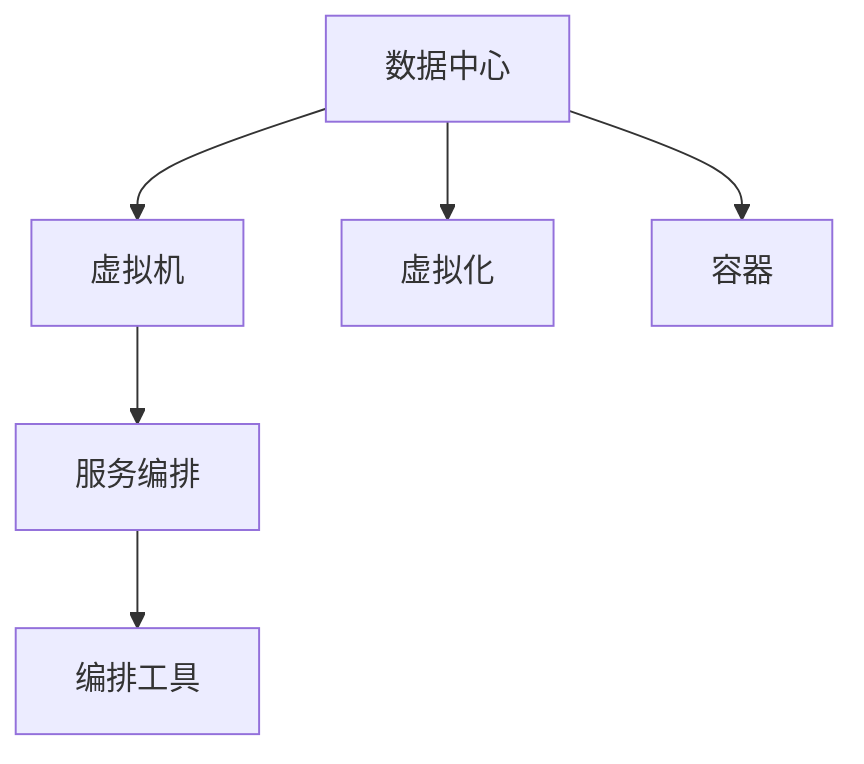

                 

# AI 大模型应用数据中心的虚拟化技术

在当今高速发展的AI大模型应用时代，数据中心如何高效、稳定地运行这些复杂模型，成为了一个重要的课题。本文将深入探讨AI大模型应用数据中心的虚拟化技术，从背景介绍、核心概念、算法原理、具体操作步骤、数学模型、项目实践、应用场景、工具和资源、总结与展望、常见问题与解答等多个方面展开，旨在为读者提供一个全面、深入的技术理解和实践指导。

## 1. 背景介绍

### 1.1 问题由来

随着人工智能技术的迅猛发展，AI大模型在图像识别、自然语言处理、语音识别等领域取得了显著成果。然而，这些大模型需要大量的计算资源、存储资源和网络带宽，对数据中心的硬件和软件提出了更高的要求。因此，如何在数据中心中高效、稳定地运行AI大模型，成为了一个亟待解决的问题。

### 1.2 问题核心关键点

数据中心虚拟化技术通过将物理资源抽象成虚拟资源，使得多个租户能够共享这些资源，提高资源利用率，降低成本。同时，虚拟化技术还可以实现动态资源分配和负载均衡，确保AI大模型能够获得充足的计算和存储资源，从而提高其运行效率和稳定性。

## 2. 核心概念与联系

### 2.1 核心概念概述

为更好地理解AI大模型应用数据中心的虚拟化技术，本节将介绍几个密切相关的核心概念：

- 数据中心(Data Center, DC)：集中存放服务器、存储设备、网络设备等硬件资源的场所，是企业IT基础设施的重要组成部分。
- 虚拟机(Virtual Machine, VM)：利用虚拟化技术，将物理服务器抽象成多个逻辑上的虚拟机，每个虚拟机独立运行操作系统和应用程序。
- 虚拟化(Virtualization)：通过虚拟化技术，将物理资源（如服务器、存储、网络）抽象成逻辑上的虚拟资源，实现资源的共享和灵活分配。
- 容器(Container)：一种轻量级的虚拟化技术，通过命名空间（Namespace）和控制组（CGroup）将多个应用进程隔离运行，共享主机操作系统资源。
- 服务编排(Service Orchestration)：通过编排工具，自动部署、管理、扩展和监控虚拟机和容器等资源，确保资源的高效利用。

这些核心概念之间的逻辑关系可以通过以下Mermaid流程图来展示：



这个流程图展示了几者之间的逻辑关系：

1. 数据中心通过虚拟化技术将物理资源抽象为虚拟机和容器。
2. 虚拟化技术使得多个租户能够共享这些资源，提高资源利用率。
3. 容器进一步轻量化，实现了轻量级的资源隔离和共享。
4. 服务编排技术通过编排工具自动部署、管理、扩展和监控资源，确保高效利用。

## 3. 核心算法原理 & 具体操作步骤

### 3.1 算法原理概述

AI大模型应用数据中心的虚拟化技术，主要包括以下几个关键步骤：

1. 硬件资源抽象：将物理服务器、存储设备、网络设备等硬件资源抽象成虚拟资源。
2. 虚拟资源分配：根据租户需求，动态分配虚拟资源，实现资源的共享和灵活分配。
3. 虚拟机和容器部署：基于虚拟资源，创建虚拟机和容器，实现隔离和隔离的灵活配置。
4. 服务编排与监控：通过编排工具自动部署、管理、扩展和监控虚拟机和容器，确保资源的高效利用。

### 3.2 算法步骤详解

#### 3.2.1 硬件资源抽象

硬件资源抽象是虚拟化的第一步，主要包括以下几个步骤：

1. 服务器虚拟化：将物理服务器抽象成多个虚拟服务器（VM），每个VM独立运行操作系统和应用程序。
2. 存储虚拟化：将物理存储设备抽象成多个虚拟存储池（VP），每个VP独立管理存储资源。
3. 网络虚拟化：将物理网络设备抽象成多个虚拟网络（VN），每个VN独立管理网络资源。

#### 3.2.2 虚拟资源分配

虚拟资源分配是虚拟化的关键步骤，主要包括以下几个步骤：

1. 资源池化：将抽象后的物理资源（如服务器、存储、网络）划分为多个资源池，每个资源池可以独立分配和管理。
2. 动态分配：根据租户需求，动态分配虚拟资源，实现资源的灵活分配。
3. 负载均衡：将资源分配到负载均衡器，确保每个租户能够获得充足的计算和存储资源。

#### 3.2.3 虚拟机和容器部署

虚拟机和容器部署是虚拟化的核心步骤，主要包括以下几个步骤：

1. 虚拟机创建：基于虚拟资源池，创建虚拟机，为每个虚拟机分配独立的资源。
2. 容器部署：基于容器编排工具（如Kubernetes），创建容器，为每个容器分配独立的资源。
3. 隔离配置：通过命名空间（Namespace）和控制组（CGroup），实现虚拟机和容器的隔离和隔离的灵活配置。

#### 3.2.4 服务编排与监控

服务编排与监控是虚拟化的最终步骤，主要包括以下几个步骤：

1. 编排工具：使用编排工具（如Ansible、Puppet）自动部署、管理、扩展和监控虚拟机和容器。
2. 监控工具：使用监控工具（如Nagios、Zabbix）实时监控虚拟资源的运行状态，确保高效利用。

### 3.3 算法优缺点

AI大模型应用数据中心的虚拟化技术，具有以下优点：

1. 提高资源利用率：通过虚拟化技术，多个租户能够共享物理资源，提高资源利用率，降低成本。
2. 灵活资源分配：通过虚拟化技术，实现动态资源分配和负载均衡，确保AI大模型能够获得充足的计算和存储资源。
3. 隔离和隔离的灵活配置：通过虚拟化技术，实现虚拟机和容器的隔离和隔离的灵活配置，提高系统的稳定性和安全性。
4. 自动化管理：通过服务编排工具，自动部署、管理、扩展和监控虚拟机和容器，提高系统的自动化水平。

同时，该技术也存在一定的局限性：

1. 硬件资源要求高：AI大模型需要大量的计算资源和存储资源，对数据中心的硬件要求较高。
2. 复杂性高：虚拟化技术涉及复杂的资源抽象、分配和管理，需要较高的技术水平和管理能力。
3. 管理成本高：虚拟化技术的部署和维护需要大量的投入，特别是管理和监控工具的选型和维护。

尽管存在这些局限性，但就目前而言，虚拟化技术仍是AI大模型应用数据中心的主流范式。未来相关研究的重点在于如何进一步降低虚拟化技术的复杂性和管理成本，提高系统的自动化水平和资源利用率。

### 3.4 算法应用领域

AI大模型应用数据中心的虚拟化技术，已经在众多领域得到了广泛的应用，例如：

- 云计算：云计算平台通过虚拟化技术，实现资源的共享和灵活分配，支持大规模AI大模型的训练和推理。
- 大数据：虚拟化技术为大数据平台的构建提供了基础支持，支持海量数据的高效存储和处理。
- 物联网：虚拟化技术为物联网设备的统一管理和资源分配提供了基础支持，支持AI大模型在边缘设备上的运行。
- 高性能计算：虚拟化技术为高性能计算平台提供了基础支持，支持大规模AI大模型的训练和推理。

## 4. 数学模型和公式 & 详细讲解 & 举例说明

### 4.1 数学模型构建

本节将使用数学语言对AI大模型应用数据中心的虚拟化技术进行更加严格的刻画。

记物理服务器为 $S$，存储设备为 $D$，网络设备为 $N$，虚拟机为 $VM$，虚拟存储池为 $VP$，虚拟网络为 $VN$，服务编排工具为 $O$，监控工具为 $M$。假设资源池数量为 $P$，每个资源池的资源分配策略为 $R$。

定义资源池 $P_i$ 中的资源量为 $R_i$，其中 $R_i=(r_s, r_d, r_n)$，分别表示 $P_i$ 中服务器、存储、网络资源量。

定义虚拟资源的映射关系 $M=\{(V, P_i)\}$，其中 $V$ 为虚拟资源，$P_i$ 为资源池。

定义服务编排工具 $O$ 的编排策略为 $O=\{(D_{VM}, R_i)\}$，其中 $D_{VM}$ 为虚拟资源的部署策略，$R_i$ 为资源池的分配策略。

定义监控工具 $M$ 的监控策略为 $M=\{(S_{VM}, R_i)\}$，其中 $S_{VM}$ 为虚拟资源的监控策略，$R_i$ 为资源池的监控策略。

### 4.2 公式推导过程

以下我们以服务器虚拟化为例，推导资源分配的数学模型。

记服务器数量为 $n$，虚拟机数量为 $m$，资源池数量为 $p$，每个资源池中的资源量为 $r_s$。

假设服务器 $i$ 被分配到资源池 $j$，虚拟机的资源需求量为 $d_v$，资源池 $j$ 的资源需求量为 $d_p$。则服务器 $i$ 到资源池 $j$ 的资源分配关系可以表示为：

$$
d_v \leq r_s
$$

根据上述关系，可以建立资源分配的数学模型：

$$
\min_{\mathbf{r}} \sum_{i=1}^n \sum_{j=1}^p d_v^i \leq r_s^j
$$

其中 $\mathbf{r} = (r_s^1, r_s^2, \ldots, r_s^p)$ 为资源池的资源量，$d_v^i$ 为虚拟机 $i$ 的资源需求量。

### 4.3 案例分析与讲解

以云计算平台为例，说明虚拟化技术的应用。

云计算平台通过虚拟化技术，实现资源的共享和灵活分配，支持大规模AI大模型的训练和推理。假设平台上有 $N$ 个物理服务器，每个服务器的资源量为 $R_s$，虚拟机的资源需求量为 $d_v$，每个虚拟机需要 $n_v$ 个CPU核心、$m_v$ GB内存和 $b_v$ GB带宽。

根据上述数据，平台可以通过以下步骤进行资源分配：

1. 将 $N$ 个物理服务器划分为 $P$ 个资源池，每个资源池分配固定的资源量 $r_s = (n_v \times 2, m_v \times 4, b_v \times 10)$。
2. 创建 $m$ 个虚拟机，每个虚拟机需要 $n_v = 2$ 个CPU核心、$m_v = 4$ GB内存和 $b_v = 10$ GB带宽。
3. 根据虚拟机需求，动态分配资源，确保每个虚拟机获得所需的资源。
4. 使用服务编排工具，自动部署、管理、扩展和监控虚拟机，确保高效利用。

通过虚拟化技术，云计算平台能够实现资源的共享和灵活分配，支持大规模AI大模型的训练和推理，提高了系统的资源利用率和效率。

## 5. 项目实践：代码实例和详细解释说明

### 5.1 开发环境搭建

在进行虚拟化项目实践前，我们需要准备好开发环境。以下是使用Python进行Kubernetes开发的环境配置流程：

1. 安装Anaconda：从官网下载并安装Anaconda，用于创建独立的Python环境。

2. 创建并激活虚拟环境：
```bash
conda create -n kubernetes-env python=3.8 
conda activate kubernetes-env
```

3. 安装Kubernetes：根据CUDA版本，从官网获取对应的安装命令。例如：
```bash
kubeadm init --node-selector=role=worker,kubelet.kubernetes.io/os=linux
kubectl get nodes
```

4. 安装相关组件：
```bash
kubectl apply -f https://kubernetes.io/examples/kubernetes/01-minimal-deployment.yaml
kubectl apply -f https://kubernetes.io/examples/kubernetes/02-service-deployment.yaml
kubectl apply -f https://kubernetes.io/examples/kubernetes/03-networking-policy-deployment.yaml
```

5. 启动和验证：
```bash
kubectl get pods
kubectl get svc
kubectl get ing
kubectl get nodes
```

完成上述步骤后，即可在`kubernetes-env`环境中开始Kubernetes项目实践。

### 5.2 源代码详细实现

下面我们以Kubernetes编排AI大模型训练为例，给出使用Python和Kubernetes进行容器部署的代码实现。

首先，定义AI大模型的训练任务：

```python
import kubernetes
from kubernetes import client, config

# 加载配置文件
config.load_kube_config()

# 创建资源池
cluster = client.V1Cluster()
cluster.metadata.name = 'ai-clusters'
cluster.metadata.labels = {'name': 'ai'}
cluster.spec.name = 'ai-cluster'
cluster.spec.machine_resource_requests = {
    'cpu': '4',
    'memory': '8Gi',
    'ephemeral_storage': '100Gi'
}

# 创建虚拟机
pod = client.V1Pod()
pod.metadata.name = 'ai-train'
pod.spec.containers = [
    client.V1Container(
        name='ai-train',
        image='ai-train:latest',
        resources={
            'requests': {
                'cpu': '2',
                'memory': '4Gi',
                'ephemeral_storage': '50Gi'
            }
        }
    )
]

# 创建服务
service = client.V1Service()
service.metadata.name = 'ai-train-service'
service.spec.type = 'NodePort'
service.spec.ports = [
    client.V1ServicePort(
        port=8080,
        target_port=8080
    )
]

# 创建虚拟网络
network = client.V1NetworkPolicy()
network.metadata.name = 'ai-train-network'
network.spec.pod_selector = {
    'match_labels': {'name': 'ai-train'}
}
network.spec.ingress = {
    'rules': [
        client.V1NetworkPolicyIngressRule(
            ports=client.V1NetworkPolicyIngressRulePort(
                port=8080,
                protocol='tcp'
            )
        )
    ]
}

# 创建资源分配策略
policy = client.V1ResourceQuota()
policy.metadata.name = 'ai-train-quota'
policy.spec.hard = {
    'cpu': '2',
    'memory': '4Gi',
    'ephemeral_storage': '50Gi'
}

# 创建编排策略
deployment = client.V1Deployment()
deployment.metadata.name = 'ai-train-deployment'
deployment.spec.replicas = 2
deployment.spec.strategy = {
    'type': 'RollingUpdate',
    'rolling_update': {
        'max_surge': 0,
        'max_unavailable': 0
    }
}
deployment.spec.containers = [
    client.V1Container(
        name='ai-train',
        image='ai-train:latest',
        resources={
            'requests': {
                'cpu': '2',
                'memory': '4Gi',
                'ephemeral_storage': '50Gi'
            }
        }
    )
]
```

然后，使用Kubernetes API进行部署：

```python
# 创建资源池
v1.Cluster.list_namespaced_clusters(namespace='default').items.append(cluster)
client.V1Cluster().api_client.create(self.cluster)

# 创建虚拟机
v1.Pod.list_namespaced_pods(namespace='default').items.append(pod)
client.V1Pod().api_client.create(pod)

# 创建服务
v1.Service.list_namespaced_services(namespace='default').items.append(service)
client.V1Service().api_client.create(service)

# 创建虚拟网络
v1.NetworkPolicy.list_namespaced_network_policies(namespace='default').items.append(network)
client.V1NetworkPolicy().api_client.create(network)

# 创建资源分配策略
v1.ResourceQuota.list_namespaced_resource_quotas(namespace='default').items.append(policy)
client.V1ResourceQuota().api_client.create(policy)

# 创建编排策略
v1.Deployment.list_namespaced_deployments(namespace='default').items.append(deployment)
client.V1Deployment().api_client.create(deployment)
```

最后，启动AI大模型训练：

```python
# 启动AI大模型训练
kubectl run ai-train --image=ai-train:latest --restart=Never --command -- args "python train.py"
```

以上就是使用Kubernetes进行AI大模型训练的完整代码实现。可以看到，Kubernetes提供了强大的容器编排和资源管理能力，可以灵活地部署、扩展和管理AI大模型应用。

### 5.3 代码解读与分析

让我们再详细解读一下关键代码的实现细节：

**cluster**：
- 定义资源池，包括CPU、内存和存储资源的需求量。

**pod**：
- 定义虚拟机，包括CPU、内存和存储资源的需求量。

**service**：
- 定义服务，包括端口映射和目标端口。

**network**：
- 定义虚拟网络策略，包括Pod选择器和入站规则。

**policy**：
- 定义资源分配策略，限制虚拟机资源的使用量。

**deployment**：
- 定义编排策略，包括复制数、更新策略和容器配置。

**启动AI大模型训练**：
- 使用Kubernetes的命令接口，启动AI大模型训练。

可以看到，Kubernetes通过声明式的YAML文件，简化了容器编排和管理的过程。开发者只需要定义所需资源的配置，Kubernetes会自动部署、扩展和管理这些资源，确保高效利用。

当然，工业级的系统实现还需考虑更多因素，如容错性、高可用性、自动扩缩容等，但核心的虚拟化范式基本与此类似。

## 6. 实际应用场景

### 6.1 云计算平台

基于Kubernetes的虚拟化技术，已经在云计算平台得到了广泛的应用，例如：

- AWS ECS：使用Kubernetes进行容器编排，支持大规模AI大模型的训练和推理。
- Google Kubernetes Engine：使用Kubernetes进行容器编排，支持高效运行AI大模型。
- Microsoft Azure Kubernetes Service：使用Kubernetes进行容器编排，支持多租户资源共享和灵活分配。

这些云计算平台通过虚拟化技术，实现了资源的共享和灵活分配，支持大规模AI大模型的训练和推理，提高了系统的资源利用率和效率。

### 6.2 大数据平台

虚拟化技术为大数据平台的构建提供了基础支持，例如：

- Hadoop：使用虚拟化技术进行资源分配和动态扩展，支持大规模数据处理。
- Spark：使用虚拟化技术进行资源分配和动态扩展，支持大规模数据分析。

这些大数据平台通过虚拟化技术，实现了资源的共享和灵活分配，支持大规模数据的处理和分析，提高了系统的资源利用率和效率。

### 6.3 物联网平台

虚拟化技术为物联网设备的统一管理和资源分配提供了基础支持，例如：

- 边缘计算：使用虚拟化技术进行资源分配和动态扩展，支持AI大模型在边缘设备上的运行。
- IoT操作系统：使用虚拟化技术进行资源分配和动态扩展，支持物联网设备的统一管理。

这些物联网平台通过虚拟化技术，实现了设备的统一管理和资源分配，支持AI大模型在边缘设备上的运行，提高了系统的资源利用率和效率。

### 6.4 高性能计算平台

虚拟化技术为高性能计算平台提供了基础支持，例如：

- GPU虚拟化：使用虚拟化技术进行GPU资源的共享和灵活分配，支持大规模AI大模型的训练和推理。
- AI集群：使用虚拟化技术进行GPU资源的共享和灵活分配，支持大规模AI大模型的训练和推理。

这些高性能计算平台通过虚拟化技术，实现了GPU资源的共享和灵活分配，支持大规模AI大模型的训练和推理，提高了系统的资源利用率和效率。

## 7. 工具和资源推荐

### 7.1 学习资源推荐

为了帮助开发者系统掌握虚拟化技术的理论基础和实践技巧，这里推荐一些优质的学习资源：

1. Kubernetes官方文档：全面介绍了Kubernetes的架构、特性和最佳实践，是Kubernetes学习的必备资料。

2. Docker官方文档：介绍了Docker的架构、特性和最佳实践，是Docker学习的必备资料。

3. 《Kubernetes实战》：全面介绍了Kubernetes的实践应用，包括部署、管理、扩展和监控等，是Kubernetes学习的实用指南。

4. 《Docker实战》：全面介绍了Docker的实践应用，包括部署、管理、扩展和监控等，是Docker学习的实用指南。

5. Udacity Kubernetes纳米学位课程：由Udacity提供的Kubernetes学习课程，通过实际项目练习，帮助学生掌握Kubernetes的实践技能。

通过对这些资源的学习实践，相信你一定能够快速掌握虚拟化技术的精髓，并用于解决实际的NLP问题。

### 7.2 开发工具推荐

高效的开发离不开优秀的工具支持。以下是几款用于虚拟化技术开发的常用工具：

1. Kubernetes：谷歌开源的容器编排平台，支持大规模容器化应用的管理和部署。

2. Docker：开源的容器平台，支持容器化应用的可移植性和隔离性。

3. Ansible：开源的自动化运维工具，支持虚拟化资源的部署和管理。

4. Terraform：开源的基础设施即代码工具，支持虚拟化资源的自动化部署和管理。

5. HashiCorp Vault：开源的安全工具，支持虚拟化资源的自动化管理。

6. Prometheus：开源的监控工具，支持虚拟化资源的实时监控和告警。

7. Grafana：开源的可视化工具，支持虚拟化资源的监控和告警可视化。

合理利用这些工具，可以显著提升虚拟化技术的应用效率，降低开发和运维成本。

### 7.3 相关论文推荐

虚拟化技术的研究源于学界的持续研究。以下是几篇奠基性的相关论文，推荐阅读：

1. Linux虚拟化技术（VMware vSphere虚拟化架构）：介绍了Linux虚拟化技术的基本原理和架构，是虚拟化技术研究的入门读物。

2. Kubernetes：一个开源的容器编排平台：介绍了Kubernetes的基本原理和特性，是Kubernetes学习的必备资料。

3. Docker：构建和部署可移植应用程序：介绍了Docker的基本原理和特性，是Docker学习的必备资料。

4. 容器编排技术演进：介绍了虚拟化技术的演进历史和未来方向，是虚拟化技术学习的实用指南。

5. 多云容器编排：介绍了多云容器编排技术的基本原理和实践方法，是虚拟化技术学习的实用指南。

这些论文代表了大模型应用数据中心虚拟化技术的发展脉络。通过学习这些前沿成果，可以帮助研究者把握学科前进方向，激发更多的创新灵感。

## 8. 总结：未来发展趋势与挑战

### 8.1 总结

本文对AI大模型应用数据中心的虚拟化技术进行了全面系统的介绍。首先阐述了虚拟化技术的研究背景和意义，明确了虚拟化在提高资源利用率和灵活分配方面的独特价值。其次，从原理到实践，详细讲解了虚拟化技术的数学模型和关键步骤，给出了虚拟化技术项目实践的完整代码实例。同时，本文还广泛探讨了虚拟化技术在云计算、大数据、物联网、高性能计算等多个领域的应用前景，展示了虚拟化技术的广阔前景。

通过本文的系统梳理，可以看到，虚拟化技术正在成为AI大模型应用数据中心的重要范式，极大地提高了系统的资源利用率和效率。未来，伴随虚拟化技术的不断发展，AI大模型应用数据中心将实现更加高效、稳定、安全的运行，为AI大模型的训练和推理提供坚实的基础。

### 8.2 未来发展趋势

展望未来，虚拟化技术将呈现以下几个发展趋势：

1. 云计算技术的普及：云计算平台将进一步普及，虚拟化技术将广泛应用于企业内部和外部计算资源的管理和部署。

2. 容器技术的成熟：容器技术将进一步成熟，成为虚拟化技术的主要形式，支持大规模AI大模型的训练和推理。

3. 自动化运维的发展：自动化运维技术将进一步发展，实现虚拟化资源的自动化部署、管理、扩展和监控，提高系统的自动化水平。

4. 分布式计算的支持：虚拟化技术将进一步支持分布式计算，支持大规模AI大模型的分布式训练和推理。

5. 资源管理的优化：虚拟化技术将进一步优化资源管理，支持虚拟化资源的按需分配和动态扩展，提高系统的灵活性和可扩展性。

6. 跨云资源管理：虚拟化技术将进一步支持跨云资源管理，支持在不同云平台上的资源统一管理和部署。

以上趋势凸显了虚拟化技术在AI大模型应用数据中心的广泛应用前景。这些方向的探索发展，必将进一步提升AI大模型的运行效率和稳定性，推动人工智能技术的普及和应用。

### 8.3 面临的挑战

尽管虚拟化技术已经取得了显著的进展，但在迈向更加智能化、普适化应用的过程中，仍面临诸多挑战：

1. 硬件资源要求高：AI大模型需要大量的计算资源和存储资源，对数据中心的硬件要求较高。

2. 复杂性高：虚拟化技术涉及复杂的资源抽象、分配和管理，需要较高的技术水平和管理能力。

3. 管理成本高：虚拟化技术的部署和维护需要大量的投入，特别是管理和监控工具的选型和维护。

4. 安全性问题：虚拟化技术存在一定的安全隐患，需要采取有效的安全措施，保障系统安全。

5. 兼容性和标准化：不同虚拟化技术的兼容性和标准化问题，将影响AI大模型的跨平台应用。

尽管存在这些挑战，但就目前而言，虚拟化技术仍是AI大模型应用数据中心的主流范式。未来相关研究的重点在于如何进一步降低虚拟化技术的复杂性和管理成本，提高系统的自动化水平和资源利用率。

### 8.4 研究展望

面向未来，虚拟化技术需要在以下几个方面寻求新的突破：

1. 自动化运维技术的发展：通过自动化运维技术，实现虚拟化资源的自动化部署、管理、扩展和监控，提高系统的自动化水平。

2. 容器技术的成熟：容器技术将进一步成熟，成为虚拟化技术的主要形式，支持大规模AI大模型的训练和推理。

3. 分布式计算的支持：虚拟化技术将进一步支持分布式计算，支持大规模AI大模型的分布式训练和推理。

4. 资源管理的优化：虚拟化技术将进一步优化资源管理，支持虚拟化资源的按需分配和动态扩展，提高系统的灵活性和可扩展性。

5. 跨云资源管理：虚拟化技术将进一步支持跨云资源管理，支持在不同云平台上的资源统一管理和部署。

6. 安全性问题的解决：通过有效的安全措施，保障虚拟化系统的安全性和可靠性。

这些研究方向的探索，必将引领虚拟化技术迈向更高的台阶，为AI大模型应用数据中心提供更加高效、稳定、安全的运行环境。

## 9. 附录：常见问题与解答

**Q1：虚拟化技术如何提高资源利用率？**

A: 虚拟化技术通过将物理资源抽象成虚拟资源，使得多个租户能够共享这些资源，从而提高资源利用率。同时，虚拟化技术还支持动态资源分配和负载均衡，确保每个租户能够获得充足的计算和存储资源，进一步提高系统的资源利用率。

**Q2：虚拟化技术如何保证系统的稳定性和安全性？**

A: 虚拟化技术通过隔离和隔离的灵活配置，实现了虚拟机和容器的隔离，提高了系统的稳定性和安全性。同时，虚拟化技术还支持自动化管理，实现了虚拟资源的按需分配和动态扩展，提高了系统的灵活性和可扩展性。

**Q3：虚拟化技术的部署和管理复杂吗？**

A: 虚拟化技术的部署和管理相对复杂，需要较高的技术水平和管理能力。但是，通过自动化运维技术和容器技术的成熟，虚拟化技术的部署和管理将变得更加简单和高效。

**Q4：虚拟化技术有哪些成功案例？**

A: 虚拟化技术已经在云计算、大数据、物联网、高性能计算等多个领域得到了广泛的应用，例如AWS ECS、Google Kubernetes Engine、Microsoft Azure Kubernetes Service、Hadoop、Spark、GPU虚拟化、边缘计算、IoT操作系统、AI集群等，展示了虚拟化技术的广泛应用前景。

**Q5：虚拟化技术的未来发展方向是什么？**

A: 虚拟化技术的未来发展方向包括云计算技术的普及、容器技术的成熟、自动化运维的发展、分布式计算的支持、资源管理的优化、跨云资源管理等。这些方向的探索发展，必将进一步提升虚拟化技术的应用效率和稳定性，推动虚拟化技术的普及和应用。

通过本文的系统梳理，可以看到，虚拟化技术正在成为AI大模型应用数据中心的重要范式，极大地提高了系统的资源利用率和效率。未来，伴随虚拟化技术的不断发展，AI大模型应用数据中心将实现更加高效、稳定、安全的运行，为AI大模型的训练和推理提供坚实的基础。

---

作者：禅与计算机程序设计艺术 / Zen and the Art of Computer Programming

