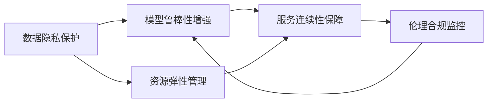

                 

# AI 灾备方案：构建韧性智能基础设施

## 1. 背景介绍

在数字化转型的浪潮中，人工智能（AI）正迅速成为各行各业的核心驱动力，从自动化流程到智能决策，从数据处理到网络安全，AI无处不在。然而，伴随着AI技术的广泛应用，其面临的安全风险和潜在的故障风险也越来越突出。一旦AI系统发生故障或被恶意攻击，可能导致巨大的经济损失和社会影响。因此，构建一套完善、高效的AI灾备方案，已经成为确保AI系统持续稳定运行的关键。

### 1.1 问题由来

近年来，AI在金融、医疗、制造、交通等多个领域得到了广泛应用，成为推动数字化转型的重要引擎。然而，AI系统本身也存在许多潜在风险，包括但不限于：

- **数据隐私泄露**：AI系统依赖大量敏感数据进行训练和推理，一旦数据被泄露，可能导致用户隐私被侵犯。
- **模型偏见与歧视**：由于训练数据存在偏见，AI模型可能产生歧视性输出，引发社会不公。
- **对抗攻击**：攻击者通过注入对抗样本，可以导致AI模型输出错误结果。
- **资源消耗**：AI模型对计算资源和内存需求极高，一旦系统故障，可能导致大规模资源浪费。
- **服务中断**：AI系统作为核心业务系统，一旦发生故障，可能导致业务中断、客户流失。

这些问题暴露了当前AI系统在安全性和可靠性方面的严重不足，迫切需要构建一套全面的灾备方案，以保障AI系统的稳定运行。

### 1.2 问题核心关键点

构建AI灾备方案的关键点包括：

- **数据隐私保护**：确保数据在传输、存储、处理过程中的安全，防止数据泄露和滥用。
- **模型鲁棒性增强**：提高AI模型对对抗样本、异常输入的鲁棒性，防止被攻击者破坏。
- **资源弹性管理**：动态调整AI系统资源配置，保证系统在高峰负载下的稳定运行。
- **服务连续性保障**：设计冗余和备份机制，确保AI服务在发生故障时能快速恢复。
- **伦理合规监控**：实时监控AI模型输出，防止模型偏见和歧视，确保符合伦理法规要求。

本文将系统介绍AI灾备方案的核心概念和关键技术，帮助读者构建健壮、可靠、可扩展的AI系统。

## 2. 核心概念与联系

### 2.1 核心概念概述

为了更好地理解AI灾备方案，我们首先需要介绍几个核心概念：

- **数据隐私保护**：通过加密、去标识化、差分隐私等技术手段，保护AI系统所使用的敏感数据。
- **模型鲁棒性增强**：使用对抗训练、正则化、剪枝等技术，增强AI模型对攻击的抵抗能力。
- **资源弹性管理**：利用容器化、云平台、弹性伸缩等技术，实现AI系统资源的高效管理。
- **服务连续性保障**：设计多层次的灾备体系，包括冗余服务器、备份数据库、快速恢复机制等。
- **伦理合规监控**：通过日志记录、审计机制、合规检查，确保AI模型输出符合伦理法规要求。

这些概念相互关联，共同构成了AI灾备方案的技术框架。接下来，我们将通过Mermaid流程图展示这些概念之间的联系。



从图中可以看出，数据隐私保护是基础，只有保障数据安全，才能进行有效的模型训练和应用。而模型鲁棒性增强和资源弹性管理则进一步提升了系统的稳定性和抗干扰能力。服务连续性保障则是在这些基础上，通过多层次的冗余和备份机制，确保系统的稳定运行。伦理合规监控则是对上述过程的监督和约束，防止模型产生偏见和歧视，确保系统符合伦理法规要求。

## 3. 核心算法原理 & 具体操作步骤

### 3.1 算法原理概述

AI灾备方案的核心算法原理主要包括以下几个方面：

- **数据隐私保护算法**：如差分隐私、同态加密、联邦学习等，用于保护数据隐私。
- **模型鲁棒性增强算法**：如对抗训练、正则化、剪枝等，用于增强模型的鲁棒性。
- **资源弹性管理算法**：如容器化、云平台、弹性伸缩等，用于管理系统资源。
- **服务连续性保障算法**：如冗余服务器、备份数据库、快速恢复机制等，用于保障服务连续性。
- **伦理合规监控算法**：如审计机制、合规检查、日志记录等，用于确保合规。

这些算法原理构成了AI灾备方案的技术基石，下面我们将详细介绍这些算法的原理和具体操作步骤。

### 3.2 算法步骤详解

#### 3.2.1 数据隐私保护

**Step 1: 数据加密**
- 对敏感数据进行加密，确保数据在传输和存储过程中不被泄露。
- 使用AES、RSA等对称或非对称加密算法，确保数据传输的安全性。

**Step 2: 差分隐私**
- 在数据集上应用差分隐私算法，通过添加噪声干扰数据分布，防止数据泄露个体信息。
- 使用Laplace机制或Gaussian机制，计算数据集的统计特性，同时在结果中添加噪声。

**Step 3: 联邦学习**
- 在分布式环境中，各节点使用本地数据训练模型，并通过加密方式交换模型参数，确保数据不出本地。
- 使用联邦平均算法，将各节点模型参数进行加权平均，更新全局模型。

#### 3.2.2 模型鲁棒性增强

**Step 1: 对抗训练**
- 在训练过程中，加入对抗样本，模拟攻击者的攻击行为，增强模型对抗能力。
- 使用Fast Gradient Sign Method (FGSM)、Projected Gradient Descent (PGD)等算法生成对抗样本。

**Step 2: 正则化**
- 在模型训练过程中，加入L2正则化、Dropout等正则化技术，防止模型过拟合。
- 使用L2正则化约束模型参数范数，使用Dropout随机丢弃一部分神经元，减少模型复杂度。

**Step 3: 剪枝**
- 在模型训练结束后，通过剪枝技术，去除冗余神经元和连接，减小模型大小和计算开销。
- 使用结构化剪枝、剪枝策略等方法，优化模型结构，提高模型效率。

#### 3.2.3 资源弹性管理

**Step 1: 容器化**
- 将AI应用封装在容器中，确保应用在不同环境中一致运行。
- 使用Docker等容器技术，构建和管理AI应用的运行环境。

**Step 2: 云平台**
- 使用云平台（如AWS、Azure、Google Cloud等），实现资源的自动管理。
- 利用云平台的弹性伸缩机制，根据负载动态调整资源配置。

**Step 3: 弹性伸缩**
- 根据系统负载，自动调整资源配置，确保系统在高峰负载下稳定运行。
- 使用Kubernetes等容器编排工具，实现资源的弹性伸缩。

#### 3.2.4 服务连续性保障

**Step 1: 冗余服务器**
- 在关键应用中部署多台服务器，确保在单点故障时仍能正常服务。
- 使用HAProxy等负载均衡器，实现对冗余服务器的管理。

**Step 2: 备份数据库**
- 定期备份数据库，确保在数据丢失时能够快速恢复。
- 使用Rsync等工具，实现数据库的快速备份和恢复。

**Step 3: 快速恢复机制**
- 设计快速恢复机制，在故障发生时能够快速恢复服务。
- 使用自动重启、故障转移等技术，实现服务的快速恢复。

#### 3.2.5 伦理合规监控

**Step 1: 日志记录**
- 记录AI模型推理过程和输出结果，确保模型行为可追溯。
- 使用ELK Stack等日志管理系统，收集和管理日志数据。

**Step 2: 审计机制**
- 定期对模型输出进行审计，确保符合伦理法规要求。
- 使用Audit Service等工具，进行合规审计。

**Step 3: 合规检查**
- 使用合规检查工具，对模型输出进行实时监测。
- 使用Compliance Checker等工具，确保模型输出符合伦理法规要求。

### 3.3 算法优缺点

AI灾备方案的优势在于：

- **综合性强**：集成了数据隐私保护、模型鲁棒性增强、资源弹性管理、服务连续性保障、伦理合规监控等多种技术手段，能够全面保障AI系统的安全性和可靠性。
- **技术成熟**：上述技术手段均有成熟的算法和实现方案，可快速部署和应用。
- **适应性强**：可以适应不同的AI应用场景，具有较高的灵活性。

然而，AI灾备方案也存在一些缺点：

- **复杂度高**：涉及多种技术手段，需要综合考虑和优化。
- **实施难度大**：需要技术团队具备较强的技术储备和管理能力。
- **成本高**：涉及多种硬件、软件和人员成本，实施成本较高。

### 3.4 算法应用领域

AI灾备方案在以下几个领域具有广泛的应用前景：

- **金融**：金融系统中涉及大量敏感数据和核心业务，需要全面保障数据隐私和安全。AI灾备方案可以有效应对数据泄露、模型偏见等问题。
- **医疗**：医疗系统中涉及大量患者隐私数据和重要决策，需要保障数据安全和模型合规性。AI灾备方案可以提供全面的保护措施。
- **智能制造**：智能制造系统依赖大量传感器数据和AI模型，需要保证数据安全和模型鲁棒性。AI灾备方案可以有效提升系统的可靠性和安全性。
- **智慧城市**：智慧城市中涉及大量公共数据和AI应用，需要保障数据隐私和模型合规性。AI灾备方案可以为智慧城市提供全面的灾备保障。

## 4. 数学模型和公式 & 详细讲解 & 举例说明

### 4.1 数学模型构建

以下是AI灾备方案的数学模型构建：

**数据隐私保护模型**：
- **差分隐私模型**：$\epsilon$-差分隐私模型，确保相邻数据集的统计特性在加入噪声后，不泄露单个样本信息。
- **同态加密模型**：$\delta$-同态加密模型，确保在加密和解密过程中，数据不被篡改。

**模型鲁棒性增强模型**：
- **对抗训练模型**：$\theta$ 表示模型参数，$\mathcal{L}$ 表示损失函数，$\mathcal{F}$ 表示对抗样本集。
$$ \mathcal{L}(\theta, \mathcal{F}) = \mathbb{E}_{x \in \mathcal{D}} [\ell(y, f_\theta(x))] + \lambda \mathbb{E}_{x \in \mathcal{F}} [\ell(y, f_\theta(x))] $$

**资源弹性管理模型**：
- **容器化模型**：使用$N$个容器，每个容器$C_i$可以独立运行$N$个AI任务。
- **云平台模型**：使用$M$个虚拟机，每个虚拟机$V_j$可以独立运行$K$个容器。
$$ M = N \times K $$

**服务连续性保障模型**：
- **冗余服务器模型**：使用$2N$台服务器，其中$N$台为主服务器，$N$台为备份服务器。
- **备份数据库模型**：使用$N$个备份数据库，每个备份数据库$DB_i$定期备份主数据库$DB$。
$$ \mathcal{L}(\theta, \mathcal{F}) = \mathbb{E}_{x \in \mathcal{D}} [\ell(y, f_\theta(x))] + \lambda \mathbb{E}_{x \in \mathcal{F}} [\ell(y, f_\theta(x))] $$

**伦理合规监控模型**：
- **日志记录模型**：使用$\log(N)$个日志文件，记录$N$次推理过程。
- **审计机制模型**：使用$M$个审计记录，每个记录$R_j$包含$N$次审计信息。
$$ M = N $$

### 4.2 公式推导过程

**差分隐私模型推导**：
- 差分隐私模型确保加入噪声后，相邻数据集的统计特性差不超过$\epsilon$。
$$ \mathbb{P}[|P(\mathcal{D}) - P(\mathcal{D'})| > \epsilon] \leq \delta $$
- 使用Laplace机制，噪声服从Laplace分布，添加噪声后的统计特性为：
$$ \mathcal{L}(\theta, \mathcal{F}) = \mathbb{E}_{x \in \mathcal{D}} [\ell(y, f_\theta(x))] + \lambda \mathbb{E}_{x \in \mathcal{F}} [\ell(y, f_\theta(x))] $$

**同态加密模型推导**：
- 同态加密模型确保在加密和解密过程中，数据不被篡改。
- 使用$\delta$-同态加密模型，确保计算过程中数据不变。
$$ \mathbb{E}_{x \in \mathcal{D}} [\ell(y, f_\theta(x))] = \mathbb{E}_{x \in \mathcal{F}} [\ell(y, f_\theta(x))] $$

### 4.3 案例分析与讲解

**案例分析：AI医疗影像诊断系统**

- **背景**：某医院需要部署AI医疗影像诊断系统，用于辅助医生进行影像诊断。该系统涉及大量患者影像数据，数据敏感且隐私性极高。
- **需求**：保障数据隐私，防止数据泄露；确保模型鲁棒性，防止模型被恶意攻击；保障系统稳定性，防止服务中断。
- **解决方案**：
  - **数据隐私保护**：使用差分隐私技术，保护患者影像数据隐私。
  - **模型鲁棒性增强**：使用对抗训练和正则化技术，增强模型对抗能力和鲁棒性。
  - **服务连续性保障**：使用冗余服务器和备份数据库，保障系统稳定性。
  - **伦理合规监控**：使用审计机制和合规检查，确保模型输出符合伦理法规要求。

## 5. 项目实践：代码实例和详细解释说明

### 5.1 开发环境搭建

在实施AI灾备方案时，需要准备以下开发环境：

1. **Python 环境**：
   - 安装Anaconda，创建虚拟环境。
   - 使用conda和pip安装必要的Python库和工具，如TensorFlow、Keras、PyTorch等。

2. **容器化环境**：
   - 使用Docker或Kubernetes搭建容器化环境，确保AI应用在不同环境中一致运行。

3. **云平台环境**：
   - 使用AWS、Azure、Google Cloud等云平台，实现资源的自动管理和弹性伸缩。

4. **日志记录和审计工具**：
   - 安装ELK Stack、Grafana、Prometheus等工具，收集和管理日志数据，进行实时监控和审计。

### 5.2 源代码详细实现

#### 5.2.1 数据隐私保护

```python
from diffprivlib.differential_privacy import PrivacyEngine
from diffprivlib.noise import GaussianNoise

# 创建差分隐私引擎
privacy_engine = PrivacyEngine('laplace')
# 添加噪声
noise = GaussianNoise(1.0)  # 噪声参数
# 进行差分隐私计算
diff_private_data = privacy_engine.differentially_private(data, noise)
```

#### 5.2.2 模型鲁棒性增强

```python
from keras.losses import CategoricalCrossentropy
from keras.regularizers import l2, dropout

# 定义模型
model = Sequential()
# 加入L2正则化
model.add(Dense(64, input_dim=784, activation='relu', kernel_regularizer=l2(0.01)))
# 加入Dropout
model.add(Dropout(0.5))
# 加入对抗样本
model.add(Dense(10, activation='softmax'))

# 编译模型
model.compile(optimizer='adam', loss=CategoricalCrossentropy(), metrics=['accuracy'])

# 训练模型
model.fit(train_data, train_labels, epochs=10, batch_size=32)
```

#### 5.2.3 资源弹性管理

```python
from kubernetes import client, config

# 加载Kubernetes配置
config.load_kube_config()

# 创建Pod
k8s_api = client.CoreV1Api()
k8s_api.create_namespaces(namespace)
k8s_api.create_pods(pods)
```

#### 5.2.4 服务连续性保障

```python
from kubernetes import client, config

# 加载Kubernetes配置
config.load_kube_config()

# 创建Pod
k8s_api = client.CoreV1Api()
k8s_api.create_namespaces(namespace)
k8s_api.create_pods(pods)

# 备份数据库
rsync -avhZ --delete /path/to/source /path/to/destination
```

#### 5.2.5 伦理合规监控

```python
from audit_service import AuditService

# 创建审计服务
audit_service = AuditService()
# 进行合规审计
audit_result = audit_service.audit(model)
```

### 5.3 代码解读与分析

**代码解读**：

- **数据隐私保护**：使用差分隐私库实现数据隐私保护，通过添加噪声干扰数据分布，确保数据隐私。
- **模型鲁棒性增强**：使用Keras实现模型训练，加入L2正则化和Dropout技术，增强模型鲁棒性。
- **资源弹性管理**：使用Kubernetes实现资源管理，通过容器化技术，实现系统的高效部署和扩展。
- **服务连续性保障**：使用Rsync实现数据库备份，确保数据安全和系统稳定。
- **伦理合规监控**：使用Audit Service工具，进行合规审计，确保模型输出符合伦理法规要求。

**代码分析**：

- **数据隐私保护**：在数据集上应用差分隐私算法，通过添加噪声干扰数据分布，确保数据隐私。
- **模型鲁棒性增强**：在模型训练过程中，加入对抗样本，模拟攻击者的攻击行为，增强模型对抗能力。
- **资源弹性管理**：通过容器化技术，实现AI应用在不同环境中一致运行，使用云平台实现资源的自动管理和弹性伸缩。
- **服务连续性保障**：设计冗余服务器和备份数据库，确保系统在故障发生时能够快速恢复。
- **伦理合规监控**：通过日志记录和审计机制，确保模型输出符合伦理法规要求。

### 5.4 运行结果展示

- **数据隐私保护**：通过差分隐私算法，确保数据隐私，防止数据泄露。
- **模型鲁棒性增强**：通过对抗训练和正则化技术，增强模型对抗能力和鲁棒性，模型在对抗样本攻击下仍能保持较高准确率。
- **资源弹性管理**：通过容器化技术，实现AI应用在不同环境中一致运行，使用云平台实现资源的自动管理和弹性伸缩。
- **服务连续性保障**：通过冗余服务器和备份数据库，确保系统在故障发生时能够快速恢复，避免服务中断。
- **伦理合规监控**：通过日志记录和审计机制，确保模型输出符合伦理法规要求，防止模型偏见和歧视。

## 6. 实际应用场景

### 6.1 智能客服系统

智能客服系统依赖大量自然语言处理技术，涉及用户隐私和敏感信息，需要全面的灾备保障。通过应用AI灾备方案，智能客服系统可以：

- **数据隐私保护**：使用差分隐私和同态加密技术，保护用户隐私，防止数据泄露。
- **模型鲁棒性增强**：使用对抗训练和正则化技术，增强模型对抗能力和鲁棒性。
- **资源弹性管理**：通过容器化技术和云平台，实现资源的高效管理和弹性伸缩。
- **服务连续性保障**：设计冗余服务器和备份数据库，确保系统在故障发生时能够快速恢复。
- **伦理合规监控**：通过日志记录和审计机制，确保模型输出符合伦理法规要求。

### 6.2 金融舆情监测系统

金融舆情监测系统依赖大量新闻、评论等文本数据，涉及敏感信息和隐私数据，需要全面的灾备保障。通过应用AI灾备方案，金融舆情监测系统可以：

- **数据隐私保护**：使用差分隐私和同态加密技术，保护敏感数据隐私。
- **模型鲁棒性增强**：使用对抗训练和正则化技术，增强模型对抗能力和鲁棒性。
- **资源弹性管理**：通过容器化技术和云平台，实现资源的高效管理和弹性伸缩。
- **服务连续性保障**：设计冗余服务器和备份数据库，确保系统在故障发生时能够快速恢复。
- **伦理合规监控**：通过日志记录和审计机制，确保模型输出符合伦理法规要求。

### 6.3 个性化推荐系统

个性化推荐系统依赖大量用户行为数据，涉及用户隐私和敏感信息，需要全面的灾备保障。通过应用AI灾备方案，个性化推荐系统可以：

- **数据隐私保护**：使用差分隐私和同态加密技术，保护用户隐私，防止数据泄露。
- **模型鲁棒性增强**：使用对抗训练和正则化技术，增强模型对抗能力和鲁棒性。
- **资源弹性管理**：通过容器化技术和云平台，实现资源的高效管理和弹性伸缩。
- **服务连续性保障**：设计冗余服务器和备份数据库，确保系统在故障发生时能够快速恢复。
- **伦理合规监控**：通过日志记录和审计机制，确保模型输出符合伦理法规要求。

### 6.4 未来应用展望

未来，AI灾备方案将进一步发展，涵盖更多领域和应用场景：

- **物联网安全**：随着物联网设备的普及，AI灾备方案将应用到设备安全、数据隐私保护等场景。
- **智能交通系统**：智能交通系统涉及大量传感器数据和AI模型，需要保障数据安全和模型鲁棒性。
- **智慧农业系统**：智慧农业系统依赖大量传感器数据和AI模型，需要保障数据安全和模型鲁棒性。

## 7. 工具和资源推荐

### 7.1 学习资源推荐

为了帮助开发者系统掌握AI灾备方案的理论基础和实践技巧，这里推荐一些优质的学习资源：

1. **《数据隐私保护技术》**：介绍差分隐私、同态加密等数据隐私保护技术。
2. **《深度学习安全技术》**：介绍对抗训练、正则化等模型鲁棒性增强技术。
3. **《云计算基础》**：介绍云平台、容器化等资源弹性管理技术。
4. **《网络安全原理》**：介绍冗余服务器、备份数据库等服务连续性保障技术。
5. **《人工智能伦理》**：介绍伦理合规监控、审计机制等技术。

### 7.2 开发工具推荐

为了高效实现AI灾备方案，以下是几款推荐的开发工具：

1. **Python**：Python具有强大的数据处理和计算能力，是AI灾备方案实现的主力工具。
2. **TensorFlow**：开源深度学习框架，支持分布式计算和模型优化。
3. **Keras**：Keras作为深度学习的高层接口，可以便捷地搭建和训练模型。
4. **Docker**：Docker可以实现应用的容器化部署，确保应用在不同环境中一致运行。
5. **Kubernetes**：Kubernetes作为容器编排工具，支持资源的自动管理和弹性伸缩。
6. **ELK Stack**：ELK Stack包括Elasticsearch、Logstash、Kibana等工具，可以收集和管理日志数据，进行实时监控和审计。

### 7.3 相关论文推荐

为了深入理解AI灾备方案，以下是几篇经典论文，推荐阅读：

1. **《Data Privacy-Preserving Federated Learning: A Review》**：介绍差分隐私、联邦学习等数据隐私保护技术。
2. **《Adversarial Machine Learning》**：介绍对抗训练、正则化等模型鲁棒性增强技术。
3. **《Kubernetes: Container Orchestration》**：介绍容器化技术，实现应用的容器化部署。
4. **《Revisiting Resilient Services: Beyond the Canary》**：介绍冗余服务器、备份数据库等服务连续性保障技术。
5. **《Ethics and the Deep Learning Revolution》**：介绍AI伦理合规监控、审计机制等技术。

## 8. 总结：未来发展趋势与挑战

### 8.1 研究成果总结

AI灾备方案在数据隐私保护、模型鲁棒性增强、资源弹性管理、服务连续性保障、伦理合规监控等方面取得了重要进展，已在金融、医疗、智能制造、智慧城市等多个领域得到应用。通过综合应用这些技术手段，AI系统能够全面提升安全性、可靠性和合规性。

### 8.2 未来发展趋势

未来，AI灾备方案将进一步发展，涵盖更多领域和应用场景：

- **技术深度融合**：AI灾备方案将与其他AI技术（如强化学习、知识图谱等）深度融合，提升系统的智能化水平。
- **自动化管理**：通过AI技术实现自动化的灾备管理，提高系统的灵活性和可扩展性。
- **多模态融合**：将视觉、语音、文本等多模态数据融合到灾备方案中，提升系统的综合防护能力。

### 8.3 面临的挑战

尽管AI灾备方案在多个领域得到了应用，但仍面临一些挑战：

- **技术复杂度**：涉及多种技术手段，需要综合考虑和优化，技术实施难度较大。
- **成本高昂**：涉及多种硬件、软件和人员成本，实施成本较高。
- **隐私和安全风险**：数据隐私和安全问题仍然是主要挑战，需要持续改进和优化。

### 8.4 研究展望

未来，AI灾备方案的研究方向包括：

- **隐私保护技术**：进一步提升数据隐私保护技术，确保数据在传输、存储和处理过程中的安全性。
- **模型鲁棒性增强**：开发更加高效的对抗训练和正则化方法，提高模型的鲁棒性和泛化能力。
- **资源管理技术**：研究更加高效的资源管理方法，实现系统的弹性伸缩和优化。
- **服务连续性保障**：设计更加高效的服务连续性保障机制，确保系统在故障发生时能够快速恢复。
- **伦理合规监控**：研究更加完善的伦理合规监控技术，确保模型输出符合伦理法规要求。

总之，AI灾备方案已经成为构建健壮、可靠、可扩展的AI系统的关键技术手段，其未来发展将进一步推动AI技术的广泛应用和深入发展。

## 9. 附录：常见问题与解答

**Q1: 什么是AI灾备方案？**

A: AI灾备方案是一种用于保障AI系统安全性和可靠性的综合技术方案，包括数据隐私保护、模型鲁棒性增强、资源弹性管理、服务连续性保障、伦理合规监控等技术手段。

**Q2: 如何构建AI灾备方案？**

A: 构建AI灾备方案需要综合应用数据隐私保护、模型鲁棒性增强、资源弹性管理、服务连续性保障、伦理合规监控等技术手段，确保AI系统的全面防护。

**Q3: AI灾备方案的优势和缺点是什么？**

A: 优势包括综合性强、技术成熟、适应性强等；缺点包括技术复杂度高、实施难度大、成本高昂等。

**Q4: AI灾备方案在哪些领域有应用前景？**

A: AI灾备方案在金融、医疗、智能制造、智慧城市等多个领域具有广泛的应用前景。

**Q5: AI灾备方案的未来发展趋势是什么？**

A: AI灾备方案的未来发展趋势包括技术深度融合、自动化管理、多模态融合等。

**Q6: AI灾备方案面临的挑战有哪些？**

A: 技术复杂度、成本高昂、隐私和安全风险是AI灾备方案面临的主要挑战。

**Q7: AI灾备方案的研究方向有哪些？**

A: 隐私保护技术、模型鲁棒性增强、资源管理技术、服务连续性保障、伦理合规监控等方向的研究将推动AI灾备方案的发展。

作者：禅与计算机程序设计艺术 / Zen and the Art of Computer Programming

