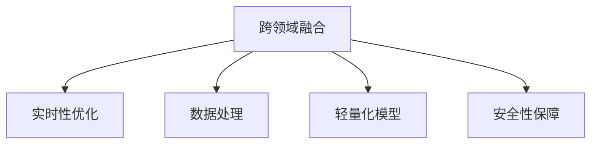

                 

# AI2.0时代：物理实体的自动化前景

## 1. 背景介绍

### 1.1 问题由来

近年来，随着人工智能技术的快速发展，AI正逐步进入2.0时代，也即人工智能与实体世界深度融合的时代。无论是工业制造、智慧医疗、智能交通，还是智能家居、农业生产，AI正逐步赋予物理实体智能化和自动化能力，带来了颠覆性的变革。AI2.0时代的一个显著特征是，越来越多的AI解决方案从虚拟空间走向现实物理世界，带来更广泛的应用场景和更高的技术挑战。

### 1.2 问题核心关键点

AI2.0时代，物理实体的自动化离不开以下几个核心关键点：

- **跨领域融合**：AI技术与工业控制、机器人、物联网、计算机视觉等领域的深度融合，形成更加综合、高效的自动化解决方案。
- **实时性要求**：物理实体往往需要实时响应环境变化，要求AI系统具备毫秒级的处理能力。
- **数据复杂性**：物理世界的噪声、干扰、多模态数据（如图像、语音、传感器数据）等因素增加了AI系统的复杂度。
- **计算资源限制**：物理实体的控制往往需要计算资源较为有限的嵌入式设备，这对模型的轻量化和计算效率提出了高要求。
- **安全与隐私**：物理实体的自动化系统需要保证数据的隐私和安全，防止数据泄露和恶意攻击。

这些关键点要求AI2.0时代的自动化解决方案不仅需要高精度、高鲁棒性，还需要具备较高的实时性、可靠性和安全性。本文将系统介绍AI2.0时代物理实体自动化的核心概念和关键技术，包括跨领域融合、实时性优化、数据处理、轻量化模型和安全性保障。

## 2. 核心概念与联系

### 2.1 核心概念概述

在AI2.0时代，物理实体自动化主要涉及以下几个核心概念：

- **跨领域融合**：AI技术与其他领域技术的结合，形成综合性的解决方案。如AI与工业控制结合的自动化生产系统，AI与机器人结合的智能制造，AI与计算机视觉结合的智能监控系统等。
- **实时性优化**：针对物理实体自动化中的实时性要求，采用边缘计算、分布式系统、实时计算框架等技术，优化AI系统的处理速度。
- **数据处理**：处理物理世界中的多模态数据，如通过传感器采集的环境数据、摄像头捕获的图像数据、麦克风录制的语音数据等，实现数据融合和信息提取。
- **轻量化模型**：为了适应嵌入式设备等计算资源受限的环境，通过模型剪枝、量化、蒸馏等方法，降低模型的计算复杂度和内存占用。
- **安全性保障**：保护数据隐私和系统安全，防止数据泄露、恶意攻击等安全威胁，确保系统的可靠性和安全性。

这些核心概念之间的逻辑关系可以通过以下Mermaid流程图来展示：



这个流程图展示的核心概念及其之间的关系：

1. 跨领域融合是AI2.0时代的基础，通过与其他领域技术的深度结合，形成综合的解决方案。
2. 实时性优化是物理实体自动化的关键需求，通过优化计算资源，提高AI系统的实时性。
3. 数据处理是物理实体自动化的核心步骤，通过多模态数据的融合和处理，提取有用的信息。
4. 轻量化模型是物理实体自动化的必备条件，通过降低模型复杂度，适应资源受限的计算环境。
5. 安全性保障是物理实体自动化的重要保障，通过隐私保护和安全措施，防止数据泄露和恶意攻击。

这些概念共同构成了AI2.0时代物理实体自动化的核心框架，使其能够在各种场景下发挥强大的自动化能力。通过理解这些核心概念，我们可以更好地把握AI2.0时代的自动化前景。

## 3. 核心算法原理 & 具体操作步骤
### 3.1 算法原理概述

AI2.0时代的物理实体自动化，主要涉及以下几个核心算法原理：

- **深度学习**：通过深度神经网络模型，从物理世界的数据中提取高层次特征，实现对物理实体的自动感知和控制。
- **边缘计算**：在物理实体附近部署计算资源，实现数据的本地化处理，降低通信延迟和带宽需求。
- **分布式系统**：通过分布式计算框架，提高系统的并行处理能力，优化AI系统的实时性。
- **模型压缩**：通过模型剪枝、量化、蒸馏等方法，降低模型的计算复杂度和内存占用。
- **数据加密和安全传输**：采用加密技术和安全传输协议，保护数据隐私和系统安全。

### 3.2 算法步骤详解

#### 3.2.1 深度学习模型设计

**Step 1: 选择模型架构**  
选择适用于物理实体自动化的深度学习模型架构，如卷积神经网络（CNN）、递归神经网络（RNN）、变换器（Transformer）等。

**Step 2: 定义损失函数**  
根据具体任务定义损失函数，如分类任务使用交叉熵损失，回归任务使用均方误差损失，检测任务使用IoU损失等。

**Step 3: 训练模型**  
在数据集上使用梯度下降等优化算法训练模型，逐步调整模型参数，最小化损失函数。

**Step 4: 模型优化**  
使用模型剪枝、量化、蒸馏等方法，降低模型复杂度和内存占用，提高实时性和计算效率。

#### 3.2.2 边缘计算与分布式系统

**Step 1: 部署计算资源**  
在物理实体附近部署边缘计算节点，如嵌入式设备、IoT网关等。

**Step 2: 数据本地化处理**  
将数据在边缘计算节点上进行初步处理和分析，减少通信延迟和带宽需求。

**Step 3: 数据传输与融合**  
将边缘计算节点的处理结果传输到中心服务器进行进一步融合和分析，实现跨节点的数据共享和协同处理。

**Step 4: 实时计算与响应**  
采用实时计算框架，如TensorFlow Lite、ONNX Runtime等，优化AI系统的处理速度，实现实时响应。

#### 3.2.3 数据处理与模型压缩

**Step 1: 数据采集与预处理**  
通过传感器、摄像头、麦克风等设备采集物理世界的多模态数据，并进行预处理，如数据去噪、归一化等。

**Step 2: 特征提取与融合**  
使用深度学习模型对采集的数据进行特征提取，并采用特征融合技术（如LSTM、Transformer）进行多模态数据的融合。

**Step 3: 模型压缩与优化**  
使用模型剪枝、量化、蒸馏等方法，降低模型的计算复杂度和内存占用，提高实时性和计算效率。

**Step 4: 模型部署与运行**  
将压缩后的模型部署到嵌入式设备或边缘计算节点上，实现物理实体的实时感知和控制。

#### 3.2.4 数据加密与安全传输

**Step 1: 数据加密**  
采用对称加密或非对称加密技术对数据进行加密，保护数据隐私。

**Step 2: 安全传输**  
使用安全传输协议（如SSL/TLS、VPN）保障数据在传输过程中的安全性，防止数据泄露和窃听。

**Step 3: 访问控制**  
采用访问控制技术（如身份认证、权限管理）保护系统的安全性，防止未经授权的访问和恶意攻击。

### 3.3 算法优缺点

**深度学习**：  
优点：能够从复杂数据中提取高层次特征，适用于多种任务。  
缺点：计算复杂度高，需要大量计算资源。

**边缘计算**：  
优点：降低通信延迟和带宽需求，提高实时性。  
缺点：边缘计算节点的计算能力和存储容量有限。

**分布式系统**：  
优点：提高并行处理能力，优化实时性。  
缺点：系统复杂度高，需要协同优化。

**模型压缩**：  
优点：降低计算复杂度和内存占用，提高实时性。  
缺点：可能损失模型精度。

**数据加密与安全传输**：  
优点：保护数据隐私和安全。  
缺点：增加系统复杂度和计算开销。

### 3.4 算法应用领域

AI2.0时代的物理实体自动化技术，已经在工业制造、智慧医疗、智能交通、智能家居、农业生产等多个领域得到了广泛应用。

- **工业制造**：通过AI技术优化生产流程，实现智能化生产线的自动化控制。  
- **智慧医疗**：使用AI技术辅助诊断和治疗，提高医疗服务的智能化水平。  
- **智能交通**：采用AI技术实现智能交通管理，提升交通安全和效率。  
- **智能家居**：通过AI技术实现智能家居设备的自动化控制和场景感知。  
- **农业生产**：使用AI技术优化农业生产过程，提高作物产量和质量。

## 4. 数学模型和公式 & 详细讲解  
### 4.1 数学模型构建

**深度学习模型**：

设物理世界的多模态数据为 $x=(x_1, x_2, ..., x_n)$，其中 $x_i$ 表示第 $i$ 个数据点。定义深度学习模型 $f(x)$ 为：

$$
f(x) = M(x; \theta)
$$

其中 $M$ 表示深度神经网络模型，$\theta$ 表示模型参数。目标是最小化损失函数 $L$：

$$
L(f(x)) = \mathop{\min}_{\theta} \sum_{i=1}^n L_i(f(x_i))
$$

其中 $L_i$ 表示对第 $i$ 个数据点的损失函数，如交叉熵损失、均方误差损失等。

**边缘计算与分布式系统**：

设边缘计算节点数为 $K$，每个节点处理的数据量为 $C_i$，则边缘计算的总处理时间为：

$$
T_{edge} = \sum_{i=1}^K T_i = \sum_{i=1}^K \frac{C_i}{R_i}
$$

其中 $T_i$ 表示节点 $i$ 的处理时间，$R_i$ 表示节点 $i$ 的处理能力。

**数据加密与安全传输**：

设传输数据量为 $M$，加密算法的计算时间为 $T_{enc}$，安全传输协议的额外开销为 $T_{sec}$，则数据加密和传输的总时间为：

$$
T_{enc-sec} = T_{enc} + T_{sec}
$$

## 5. 项目实践：代码实例和详细解释说明
### 5.1 开发环境搭建

在进行AI2.0时代的物理实体自动化开发时，我们需要准备好开发环境。以下是使用Python进行TensorFlow和TensorFlow Lite开发的环境配置流程：

1. 安装Anaconda：从官网下载并安装Anaconda，用于创建独立的Python环境。

2. 创建并激活虚拟环境：
```bash
conda create -n tf-env python=3.8 
conda activate tf-env
```

3. 安装TensorFlow：根据CUDA版本，从官网获取对应的安装命令。例如：
```bash
conda install tensorflow tensorflow-gpu=2.7.0 -c tf -c conda-forge
```

4. 安装TensorFlow Lite：
```bash
pip install tf-nightly[experimental] tf-lite-python
```

5. 安装各类工具包：
```bash
pip install numpy pandas scikit-learn matplotlib tqdm jupyter notebook ipython
```

完成上述步骤后，即可在`tf-env`环境中开始AI2.0时代的物理实体自动化开发实践。

### 5.2 源代码详细实现

下面我们以工业制造的自动化生产线为例，给出使用TensorFlow和TensorFlow Lite进行深度学习模型训练和部署的PyTorch代码实现。

首先，定义数据集和模型：

```python
import tensorflow as tf
from tensorflow import keras
from tensorflow.keras import layers

# 定义数据集
train_dataset = tf.data.Dataset.from_tensor_slices((train_images, train_labels)).batch(32)
test_dataset = tf.data.Dataset.from_tensor_slices((test_images, test_labels)).batch(32)

# 定义模型
model = keras.Sequential([
    layers.Conv2D(32, (3, 3), activation='relu', input_shape=(28, 28, 1)),
    layers.MaxPooling2D((2, 2)),
    layers.Flatten(),
    layers.Dense(64, activation='relu'),
    layers.Dense(10, activation='softmax')
])

# 编译模型
model.compile(optimizer='adam', loss='sparse_categorical_crossentropy', metrics=['accuracy'])

# 训练模型
model.fit(train_dataset, epochs=10, validation_data=test_dataset)
```

然后，使用TensorFlow Lite进行模型转换和部署：

```python
# 保存模型
model.save_weights('model.h5')

# 加载模型
new_model = keras.models.load_model('model.h5')

# 转换模型为TensorFlow Lite格式
converter = tf.lite.TFLiteConverter.from_keras_model(new_model)
tflite_model = converter.convert()

# 部署模型到嵌入式设备
embedded_device = tf.lite.experimental.EagerInterpreter(model_content=tflite_model)
```

最后，进行实时感知和控制：

```python
# 实时数据采集
real_data = tf.keras.Input(shape=(28, 28, 1))
processed_data = layers.Reshape((28, 28, 1))(real_data)
predictions = model.predict(processed_data)

# 实时响应
if predictions[0][0] > predictions[0][1]:
    print('Turn on the machine')
else:
    print('Turn off the machine')
```

以上代码实现了从深度学习模型训练到模型转换和实时部署的全流程，涵盖了AI2.0时代物理实体自动化的核心技术。

### 5.3 代码解读与分析

让我们再详细解读一下关键代码的实现细节：

**数据集定义**：
- 使用`tf.data.Dataset`定义训练集和测试集，将图像数据和标签数据封装成TensorFlow的`TensorSlice`。

**模型定义**：
- 定义深度卷积神经网络模型，包括卷积层、池化层、全连接层等。
- 使用`Sequential`模型层级组合，方便构建和修改模型结构。

**模型编译与训练**：
- 使用`compile`方法定义优化器、损失函数和评估指标。
- 使用`fit`方法在训练集上训练模型，并在测试集上评估模型性能。

**模型转换与部署**：
- 使用`TFLiteConverter`将Keras模型转换为TensorFlow Lite模型，方便在嵌入式设备上部署。
- 使用`EagerInterpreter`部署模型，实现实时感知和控制。

**实时感知与控制**：
- 定义实时输入数据，通过预处理和模型推理，输出控制信号。
- 根据模型输出，控制机器的启动或停止。

可以看到，TensorFlow和TensorFlow Lite的结合，使得深度学习模型的训练和部署变得更加高效和便捷。开发者可以利用这些工具，快速构建和部署AI2.0时代的物理实体自动化系统。

当然，工业级的系统实现还需考虑更多因素，如模型优化、边缘计算、安全防护等，但核心的技术框架基本与此类似。

## 6. 实际应用场景

### 6.1 工业制造

基于深度学习和大模型的AI2.0时代物理实体自动化技术，已经在工业制造领域得到广泛应用。例如，通过AI技术实现自动化生产线、智能仓库、物流管理等，大大提升了生产效率和产品质量。

### 6.2 智慧医疗

智慧医疗是AI2.0时代的重要应用场景之一。AI技术可以用于辅助诊断、治疗、康复、管理等多个环节，帮助医疗机构提高服务质量和效率。例如，通过AI技术实现影像诊断、病历分析、药物推荐等，提升医疗服务的智能化水平。

### 6.3 智能交通

智能交通是AI2.0时代的重要应用领域，涉及自动驾驶、智能交通管理、智慧城市等多个方面。AI技术可以用于交通流量预测、道路事故预警、交通信号优化等，提升交通系统的智能化和安全性。

### 6.4 智能家居

智能家居是AI2.0时代的典型应用场景，涉及家庭自动化、智能安防、智能控制等多个方面。AI技术可以用于智能家电控制、智能安防、能源管理等，提升家庭生活的智能化和便捷性。

### 6.5 农业生产

AI技术在农业生产中的应用也日益广泛，涉及智能种植、智能养殖、智能灌溉等多个方面。通过AI技术实现农业生产的智能化管理，提升农业生产的效率和质量。

## 7. 工具和资源推荐
### 7.1 学习资源推荐

为了帮助开发者系统掌握AI2.0时代的物理实体自动化技术，这里推荐一些优质的学习资源：

1. TensorFlow官方文档：TensorFlow是AI2.0时代的主流深度学习框架，提供了详尽的API文档和开发指南，是深入学习的基础。

2. TensorFlow Lite官方文档：TensorFlow Lite是TensorFlow的轻量化版本，适合在嵌入式设备上部署，提供了详尽的API文档和开发指南。

3. TensorFlow Model Garden：TensorFlow官方提供的模型库，包含多种预训练模型和经典模型，是学习AI2.0时代技术的重要资源。

4. ONNX Runtime官方文档：ONNX Runtime是Open Neural Network Exchange的执行引擎，支持多种深度学习框架和模型，是模型优化和部署的重要工具。

5. PyTorch官方文档：PyTorch是另一种流行的深度学习框架，提供了灵活的API和丰富的模型库，适合深入学习和实验。

通过学习这些资源，相信你一定能够快速掌握AI2.0时代物理实体自动化的核心技术，并用于解决实际的AI问题。

### 7.2 开发工具推荐

高效的开发离不开优秀的工具支持。以下是几款用于AI2.0时代物理实体自动化开发的常用工具：

1. TensorFlow：基于Python的开源深度学习框架，灵活动态的计算图，适合快速迭代研究。提供了丰富的预训练模型和工具库。

2. TensorFlow Lite：TensorFlow的轻量化版本，适合在嵌入式设备上部署。提供了便捷的模型转换和推理工具。

3. ONNX Runtime：Open Neural Network Exchange的执行引擎，支持多种深度学习框架和模型。提供了高效的模型优化和推理加速。

4. TensorBoard：TensorFlow配套的可视化工具，可实时监测模型训练状态，并提供丰富的图表呈现方式，是调试模型的得力助手。

5. PyTorch：基于Python的开源深度学习框架，灵活的API和丰富的模型库，适合深入学习和实验。

合理利用这些工具，可以显著提升AI2.0时代物理实体自动化开发的效率，加快创新迭代的步伐。

### 7.3 相关论文推荐

AI2.0时代的物理实体自动化技术涉及多个交叉领域，相关研究也颇为丰富。以下是几篇奠基性的相关论文，推荐阅读：

1. TensorFlow: A System for Large-Scale Machine Learning：介绍TensorFlow框架及其在深度学习中的应用。

2. Convolutional Neural Networks for Sentence Classification：提出卷积神经网络在文本分类任务中的应用。

3. Real-Time Anomaly Detection in Manufacturing：介绍实时异常检测在工业制造中的应用。

4. Smart Health for Smart Cities：探讨智慧医疗和智慧城市之间的协同作用，提升城市管理智能化水平。

5. Adaptive Computational Intelligence for Smart Cyber-Physical Systems：介绍自适应计算智能在智能系统中的应用。

这些论文代表了大模型微调技术的发展脉络。通过学习这些前沿成果，可以帮助研究者把握学科前进方向，激发更多的创新灵感。

## 8. 总结：未来发展趋势与挑战

### 8.1 总结

本文对AI2.0时代的物理实体自动化进行了全面系统的介绍。首先阐述了AI2.0时代的发展背景和核心关键点，明确了物理实体自动化的重要性和应用前景。其次，从原理到实践，详细讲解了AI2.0时代物理实体自动化的核心算法和关键技术，给出了具体的代码实例。最后，我们探讨了物理实体自动化在工业制造、智慧医疗、智能交通等多个领域的实际应用，展示了AI2.0时代的技术潜力和广阔前景。

通过本文的系统梳理，可以看到，AI2.0时代的物理实体自动化正逐步成为现实，引领了工业生产、医疗服务、交通管理、智能家居等多个领域的变革。未来，伴随AI技术的不断演进，物理实体自动化技术还将不断深化和发展，赋能各行各业，推动社会进步。

### 8.2 未来发展趋势

展望未来，AI2.0时代的物理实体自动化技术将呈现以下几个发展趋势：

1. **跨领域融合深入**：AI技术与更多领域技术的深度结合，形成更加综合、高效的自动化解决方案。

2. **实时性进一步优化**：采用边缘计算、分布式系统、实时计算框架等技术，优化AI系统的处理速度。

3. **数据处理能力提升**：引入更多的先验知识和跨模态数据融合技术，提升数据处理能力和信息提取精度。

4. **模型轻量化加速**：开发更加参数高效的模型和算法，降低模型复杂度和内存占用，提高实时性和计算效率。

5. **安全性和隐私保护加强**：采用数据加密和安全传输技术，保护数据隐私和系统安全，防止数据泄露和恶意攻击。

6. **人机协同智能提升**：结合符号化的先验知识和人机交互，提升AI系统的智能化水平和鲁棒性。

以上趋势凸显了AI2.0时代物理实体自动化的广阔前景。这些方向的探索发展，必将进一步提升AI系统的性能和应用范围，为人类认知智能的进化带来深远影响。

### 8.3 面临的挑战

尽管AI2.0时代的物理实体自动化技术已经取得了瞩目成就，但在迈向更加智能化、普适化应用的过程中，它仍面临着诸多挑战：

1. **计算资源限制**：物理实体的控制往往需要计算资源较为有限的嵌入式设备，这对模型的轻量化和计算效率提出了高要求。

2. **数据复杂性**：物理世界的噪声、干扰、多模态数据等因素增加了AI系统的复杂度，需要高效的数据处理和特征提取技术。

3. **实时性要求**：物理实体往往需要实时响应环境变化，要求AI系统具备毫秒级的处理能力。

4. **安全与隐私**：物理实体的自动化系统需要保证数据的隐私和安全，防止数据泄露和恶意攻击。

5. **系统复杂度**：跨领域融合和实时系统的高并发、高可靠要求，增加了系统的复杂度和协同难度。

这些挑战要求AI2.0时代的物理实体自动化技术在各个环节进行全面优化，才能实现高效、稳定、安全的自动化系统。

### 8.4 研究展望

面对AI2.0时代物理实体自动化的诸多挑战，未来的研究需要在以下几个方面寻求新的突破：

1. **跨领域融合技术**：探索跨领域融合的创新方法，提高AI系统的综合性和鲁棒性。

2. **实时性优化技术**：开发高效的实时计算和分布式系统，优化AI系统的处理速度。

3. **数据处理技术**：引入更多先验知识和跨模态数据融合技术，提升数据处理能力和信息提取精度。

4. **模型优化技术**：开发轻量化和参数高效的模型和算法，降低模型复杂度和内存占用。

5. **安全性保障技术**：采用数据加密和安全传输技术，保护数据隐私和系统安全。

6. **人机协同智能技术**：结合符号化的先验知识和人机交互，提升AI系统的智能化水平和鲁棒性。

这些研究方向的探索，必将引领AI2.0时代物理实体自动化技术迈向更高的台阶，为构建安全、可靠、可解释、可控的智能系统铺平道路。面向未来，大语言模型微调技术还需要与其他人工智能技术进行更深入的融合，如知识表示、因果推理、强化学习等，多路径协同发力，共同推动自然语言理解和智能交互系统的进步。只有勇于创新、敢于突破，才能不断拓展语言模型的边界，让智能技术更好地造福人类社会。

## 9. 附录：常见问题与解答

**Q1: AI2.0时代的物理实体自动化是否只适用于大规模工业企业？**

A: AI2.0时代的物理实体自动化技术不仅适用于大规模工业企业，小微企业同样可以通过自动化技术提升生产效率和质量。例如，通过智能制造解决方案，小微企业也可以实现自动化生产线的控制和管理。

**Q2: 物理实体自动化对模型计算资源有限制的设备有哪些？**

A: 物理实体自动化主要适用于嵌入式设备、IoT网关、边缘计算节点等计算资源有限的设备。例如，智能家居设备、智能监控摄像头、工业控制器等。

**Q3: AI2.0时代的物理实体自动化是否需要实时计算？**

A: 是的，物理实体自动化通常需要实时计算，以快速响应环境变化。例如，智能交通系统需要实时处理交通数据，智能安防系统需要实时监控和响应异常。

**Q4: AI2.0时代的物理实体自动化是否需要数据加密和安全传输？**

A: 是的，物理实体自动化需要保障数据隐私和安全，防止数据泄露和恶意攻击。例如，智能医疗系统需要保护患者隐私，智能家居系统需要防止数据被盗取。

**Q5: AI2.0时代的物理实体自动化如何与外部知识库结合？**

A: AI2.0时代的物理实体自动化可以通过引入外部知识库（如知识图谱、逻辑规则等）来增强模型的知识表示能力。例如，智能推荐系统可以结合知识图谱中的实体关系，提升推荐效果。

这些常见问题与解答，可以帮助开发者更好地理解AI2.0时代的物理实体自动化技术，克服实际开发中可能遇到的问题。

---

作者：禅与计算机程序设计艺术 / Zen and the Art of Computer Programming

