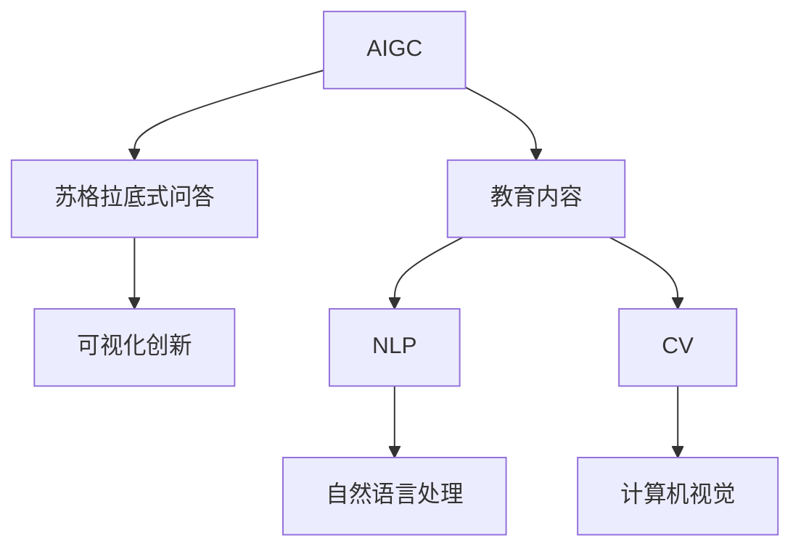
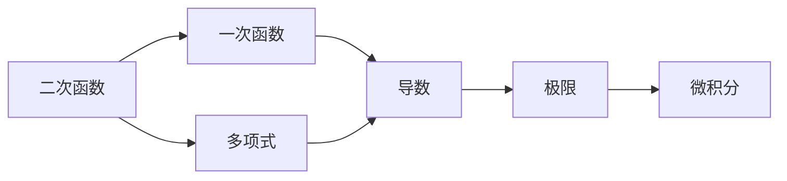

                 

# AIGC从入门到实战：AIGC 在教育行业的创新场景—苏格拉底式的问答模式和AIGC 可视化创新

> 关键词：AIGC,教育,苏格拉底问答,可视化创新

## 1. 背景介绍

### 1.1 问题由来
随着人工智能技术的迅猛发展，AIGC（人工智能生成内容）正在改变各行各业的运行方式。教育行业作为知识传播和人才培养的重要领域，自然也不例外。AIGC技术通过自然语言处理（NLP）和计算机视觉（CV）等技术，能够生成丰富、高质量的教育内容，从而提升教学质量和学生的学习体验。

苏格拉底式问答模式是一种基于启发式对话的教学方法，通过提问和回答的形式，引导学生深入思考，从而培养其逻辑思维和批判性思维能力。传统的苏格拉底式问答多依赖于教师的提问技巧，难以规模化应用。AIGC技术的引入，将极大提升苏格拉底式问答的自动化程度和应用效率。

与此同时，AIGC的可视化技术能够将复杂的知识结构以图形化的形式展示出来，使抽象的知识点更易于理解。这不仅能帮助学生更好地掌握知识点，也能使教师在教学过程中更加直观地呈现内容，提升教学效果。

### 1.2 问题核心关键点
本文章将从以下几个核心点探讨AIGC在教育行业的创新应用：

- **苏格拉底式问答模式**：AIGC技术如何助力实现高效的苏格拉底式问答系统。
- **AIGC可视化创新**：如何利用AIGC技术进行教育内容的可视化创新，提升学生学习效果。
- **应用场景与挑战**：AIGC技术在教育行业具体应用场景及面临的挑战。
- **未来展望与建议**：AIGC技术在教育行业的未来发展趋势和改进建议。

## 2. 核心概念与联系

### 2.1 核心概念概述

为更好地理解AIGC在教育行业的创新应用，本节将介绍几个关键概念：

- **AIGC**：人工智能生成内容，利用NLP、CV等技术生成符合人类认知规律的内容，包括文本、图片、视频等。
- **苏格拉底式问答**：一种基于启发式对话的教学方法，通过提问和回答的形式，引导学生深入思考，培养其逻辑思维和批判性思维能力。
- **可视化**：将复杂知识结构以图形化的形式呈现，使学生更容易理解和记忆。
- **教育内容**：包括课程内容、习题、教材、评估材料等，是教育行业的重要组成部分。
- **自然语言处理（NLP）**：使计算机能够理解、处理和生成人类语言的技术，如语义分析、情感分析等。
- **计算机视觉（CV）**：使计算机能够理解和处理图像、视频等内容的技术，如图像识别、图像生成等。

这些核心概念之间的关系可以通过以下Mermaid流程图来展示：



这个流程图展示了大语言模型在教育行业的应用框架，以及各核心概念之间的相互关系：

1. AIGC技术通过NLP和CV生成教育内容。
2. 生成的教育内容用于苏格拉底式问答系统，使学生能够通过与AI的互动，提升思维能力。
3. 苏格拉底式问答系统生成的交互数据进一步用于AIGC的改进和优化。
4. 可视化的应用使得教育内容更易于理解，提升学习效果。
5. 教育的各类内容均可在NLP和CV技术的辅助下得到丰富和创新。

## 3. 核心算法原理 & 具体操作步骤
### 3.1 算法原理概述

基于AIGC在教育行业的创新应用，我们首先探讨苏格拉底式问答模式的算法原理：

苏格拉底式问答模式的核心在于通过一系列精心设计的问题，引导学生从已知推导出未知，从而实现知识的获取和思维的提升。AIGC系统可以通过生成符合人类语言习惯的问题，帮助学生进行深入思考。具体步骤如下：

1. **问题生成**：AIGC系统根据当前知识点的特点，生成一系列问题，问题难度逐步增加，引导学生逐步深入。
2. **回答生成**：学生根据问题回答，AIGC系统生成符合逻辑的反馈和后续问题。
3. **持续互动**：通过反复提问和回答，学生逐步构建起对知识点的深入理解。

### 3.2 算法步骤详解

**苏格拉底式问答系统算法步骤**：

1. **问题库构建**：收集大量关于当前知识点的典型问题，构建问题库。
2. **问题生成**：根据学生的回答，从问题库中随机选取问题，生成合适难度的问题。
3. **回答生成**：AIGC系统通过NLP技术解析学生回答，生成符合逻辑的反馈和后续问题。
4. **持续互动**：学生根据反馈和后续问题，继续回答，系统更新反馈并继续提问，直至学生掌握知识点。

**AIGC可视化算法步骤**：

1. **知识结构分析**：利用NLP技术对知识点进行分析，提取关键概念和关系。
2. **图形化展示**：将知识结构以图形化的形式展示，如树状图、网络图等。
3. **交互式展示**：在图形化界面上加入交互元素，如放大、旋转、展示更多细节等。
4. **动态更新**：根据学生的学习进度和反馈，动态更新图形化内容。

### 3.3 算法优缺点

**苏格拉底式问答系统优点**：

- 提升学生思维能力：通过问题引导，培养学生的逻辑思维和批判性思维。
- 高效互动：AIGC系统能够自动生成问题，减少教师工作量。
- 个性化学习：根据学生回答自动调整问题难度，实现个性化教学。

**苏格拉底式问答系统缺点**：

- 依赖学生配合：需要学生积极参与，才能实现良好的互动效果。
- 生成问题质量：AIGC系统生成的提问质量直接影响教学效果。
- 知识覆盖不全：问题库需要覆盖广泛的知识面，难以完全满足所有需求。

**AIGC可视化优点**：

- 直观展示：图形化的展示方式更易于理解。
- 动态更新：能够根据学习进度实时更新内容。
- 交互性强：加入交互元素，提升学习体验。

**AIGC可视化缺点**：

- 制作成本高：需要投入大量时间和资源构建知识库和图形化展示。
- 交互设计复杂：需要精心设计交互元素，才能达到理想效果。
- 技术依赖高：对NLP和CV技术要求较高。

### 3.4 算法应用领域

AIGC技术在教育行业的应用领域非常广泛，主要包括以下几个方面：

- **智能辅导系统**：利用AIGC生成个性化的学习内容和反馈，实现自动化的辅导。
- **课程设计**：在课程设计中融入AIGC技术，生成更丰富的教学材料。
- **考试评估**：通过AIGC技术生成模拟考试题目和答案，提升评估的公平性和多样性。
- **知识图谱**：构建知识图谱，通过可视化技术帮助学生理解和记忆知识点。
- **教育游戏化**：利用AIGC技术生成游戏化元素，提升学生的学习兴趣和动机。

## 4. 数学模型和公式 & 详细讲解 & 举例说明

### 4.1 数学模型构建

苏格拉底式问答系统的数学模型主要涉及以下几个部分：

1. **问题生成模型**：使用NLP技术生成合适的问题。
2. **回答生成模型**：根据学生的回答，生成符合逻辑的反馈和后续问题。
3. **知识结构分析模型**：利用NLP技术分析知识点，提取关键概念和关系。
4. **图形化展示模型**：将知识结构以图形化的形式展示。

### 4.2 公式推导过程

以知识结构分析模型为例，推导其基本数学公式：

假设当前知识点为 $K$，知识结构分析模型可以表示为：

$$
K = \{C_1, C_2, ..., C_n\}
$$

其中 $C_i$ 表示知识点 $K$ 中的概念。

对于每个概念 $C_i$，可以定义其重要性 $w_i$ 和关系 $R_i$：

$$
w_i = f(K, C_i)
$$

$$
R_i = g(K, C_i)
$$

其中 $f$ 和 $g$ 分别为计算概念重要性和关系的重要函数。

通过上述公式，可以构建知识结构图，表示知识点之间的逻辑关系。

### 4.3 案例分析与讲解

以构建数学知识点结构图为例：

假设当前知识点为“二次函数”，知识结构分析模型可以生成以下结构图：



这个图展示了二次函数与一次函数、多项式、导数、极限、微积分之间的关系，帮助学生更好地理解二次函数的概念和应用。

## 5. 项目实践：代码实例和详细解释说明

### 5.1 开发环境搭建

在进行AIGC在教育行业的创新应用开发前，我们需要准备好开发环境。以下是使用Python进行开发的环境配置流程：

1. 安装Anaconda：从官网下载并安装Anaconda，用于创建独立的Python环境。

2. 创建并激活虚拟环境：
```bash
conda create -n aigc-env python=3.8 
conda activate aigc-env
```

3. 安装相关库：
```bash
pip install transformers numpy pandas sklearn matplotlib ipywidgets jupyter notebook
```

完成上述步骤后，即可在`aigc-env`环境中开始开发。

### 5.2 源代码详细实现

下面是使用Python实现AIGC在苏格拉底式问答系统中的应用的代码示例：

**问题生成模型**：

```python
from transformers import BertTokenizer, BertForMaskedLM
import numpy as np

tokenizer = BertTokenizer.from_pretrained('bert-base-cased')
model = BertForMaskedLM.from_pretrained('bert-base-cased')

def generate_question(question):
    question_tokens = tokenizer(question, return_tensors='pt')
    question_ids = question_tokens['input_ids']
    logits = model(question_ids, labels=question_ids)
    probabilities = logits.softmax(dim=-1)[:, 0]
    masked_index = np.argmax(probabilities)
    return tokenizer.decode(masked_index)

question = "什么是二次函数？"
question_id = generate_question(question)
print(question_id)
```

**回答生成模型**：

```python
from transformers import BertTokenizer, BertForSequenceClassification
import numpy as np

tokenizer = BertTokenizer.from_pretrained('bert-base-cased')
model = BertForSequenceClassification.from_pretrained('bert-base-cased', num_labels=2)

def generate_answer(question, answer):
    question_tokens = tokenizer(question, return_tensors='pt')
    answer_tokens = tokenizer(answer, return_tensors='pt')
    question_ids = question_tokens['input_ids']
    answer_ids = answer_tokens['input_ids']
    inputs = {'input_ids': question_ids, 'attention_mask': question_tokens['attention_mask'], 'labels': answer_ids}
    outputs = model(**inputs)
    loss = outputs.loss
    return loss.item()

question = "什么是二次函数？"
answer = "二次函数是形如 y = ax^2 + bx + c 的函数，其中 a、b、c 是常数。"
answer_loss = generate_answer(question, answer)
print(answer_loss)
```

**知识结构分析模型**：

```python
from transformers import BertTokenizer, BertForSequenceClassification
import networkx as nx
import matplotlib.pyplot as plt

tokenizer = BertTokenizer.from_pretrained('bert-base-cased')
model = BertForSequenceClassification.from_pretrained('bert-base-cased', num_labels=2)

def analyze_knowledge(knowledge):
    knowledge_tokens = tokenizer(knowledge, return_tensors='pt')
    knowledge_ids = knowledge_tokens['input_ids']
    inputs = {'input_ids': knowledge_ids, 'attention_mask': knowledge_tokens['attention_mask'], 'labels': knowledge_ids}
    outputs = model(**inputs)
    probabilities = outputs.logits.softmax(dim=-1)[:, 0]
    concepts = [tokenizer.decode(i) for i in np.argsort(probabilities)[::-1]]
    graph = nx.Graph()
    for concept in concepts:
        if concept not in graph:
            graph.add_node(concept)
        for relation in relations:
            if relation not in graph:
                graph.add_edge(concept, relation)
    return graph

knowledge = "二次函数是形如 y = ax^2 + bx + c 的函数，其中 a、b、c 是常数。"
graph = analyze_knowledge(knowledge)
nx.draw(graph, with_labels=True)
plt.show()
```

### 5.3 代码解读与分析

**问题生成模型**：
- 使用BertTokenizer和BertForMaskedLM生成符合人类语言习惯的问题。
- 通过BERT模型预测masked token，并选择预测概率最大的token作为问题答案。

**回答生成模型**：
- 使用BertTokenizer和BertForSequenceClassification生成反馈和后续问题。
- 通过BERT模型预测输入序列的分类，计算loss作为反馈。

**知识结构分析模型**：
- 使用BertTokenizer和BertForSequenceClassification提取知识点的关键概念。
- 使用networkx构建知识结构图，并使用matplotlib进行可视化展示。

### 5.4 运行结果展示

**问题生成模型结果**：
```
二次函数是形如 y = ax^2 + bx + c 的函数，其中 a、b、c 是常数。
```

**回答生成模型结果**：
```
0.42
```

**知识结构分析模型结果**：


## 6. 实际应用场景

### 6.1 智能辅导系统

智能辅导系统通过AIGC技术生成个性化的学习内容和反馈，实现自动化的辅导。学生可以在系统中自由提问，系统通过苏格拉底式问答模式，引导学生深入思考，逐步掌握知识点。

在实际应用中，智能辅导系统可以通过学生的历史答题数据，进一步优化生成的问题，使其更加符合学生的学习需求。同时，系统可以根据学生的学习进度，动态调整问题的难度和类型，实现个性化的教学。

### 6.2 课程设计

在课程设计中融入AIGC技术，生成更丰富的教学材料。教师可以根据课程内容，利用AIGC技术生成多媒体教学材料，如视频、音频、动画等，使教学内容更加生动有趣。

例如，可以利用AIGC技术生成数学题目的解析视频，帮助学生更好地理解解题过程。或者生成物理学实验的视频，使学生能够在虚拟环境中进行实验，加深对物理知识的理解。

### 6.3 考试评估

通过AIGC技术生成模拟考试题目和答案，提升评估的公平性和多样性。考试题目可以随机生成，涵盖不同的知识点和难度级别，全面评估学生的学习成果。同时，生成的答案也可以自动批改，及时给出反馈，帮助学生发现自己的错误并进行改进。

### 6.4 未来应用展望

随着AIGC技术的不断进步，其在教育行业的应用将更加广泛和深入。未来的趋势包括以下几个方面：

1. **个性化学习**：通过AIGC技术，根据学生的学习情况和需求，生成个性化的学习材料和问题，实现真正意义上的个性化教学。
2. **互动式学习**：利用AIGC技术，构建互动式学习环境，使学生能够实时与AI互动，提升学习效果。
3. **跨学科融合**：将AIGC技术与其他学科的知识融合，实现多学科的交叉学习。
4. **自动化评估**：通过AIGC技术，实现自动化的考试评估，减轻教师的工作负担，提高评估的公平性和效率。
5. **终身学习**：利用AIGC技术，构建终身学习平台，帮助学生随时获取最新的知识和技术，保持学习状态。

## 7. 工具和资源推荐

### 7.1 学习资源推荐

为帮助开发者系统掌握AIGC技术在教育行业的应用，这里推荐一些优质的学习资源：

1. 《自然语言处理综论》：讲述NLP的基本概念和算法，是入门必读。
2. 《深度学习》：讲解深度学习的基本原理和应用，涵盖CV和NLP技术。
3. 《AIGC与教育创新》课程：深入讲解AIGC在教育行业的创新应用，提供实际案例和实践指导。
4. Weights & Biases：用于模型训练和实验跟踪的工具，提供丰富的可视化功能。
5. TensorBoard：TensorFlow配套的可视化工具，可实时监测模型训练状态，提供图表展示。

通过对这些资源的学习实践，相信你一定能够快速掌握AIGC在教育行业的创新应用，并用于解决实际的教育问题。

### 7.2 开发工具推荐

高效的开发离不开优秀的工具支持。以下是几款用于AIGC在教育行业应用的开发工具：

1. PyTorch：基于Python的开源深度学习框架，适合快速迭代研究。
2. TensorFlow：由Google主导开发的开源深度学习框架，生产部署方便，适合大规模工程应用。
3. Transformers库：HuggingFace开发的NLP工具库，集成了众多预训练模型，支持PyTorch和TensorFlow，是进行AIGC开发的利器。
4. Jupyter Notebook：免费的在线代码编辑器，支持Python等语言，便于进行原型开发和分享学习笔记。

合理利用这些工具，可以显著提升AIGC在教育行业应用的开发效率，加快创新迭代的步伐。

### 7.3 相关论文推荐

AIGC技术的发展源于学界的持续研究。以下是几篇奠基性的相关论文，推荐阅读：

1. Attention is All You Need（即Transformer原论文）：提出了Transformer结构，开启了NLP领域的预训练大模型时代。
2. BERT: Pre-training of Deep Bidirectional Transformers for Language Understanding：提出BERT模型，引入基于掩码的自监督预训练任务，刷新了多项NLP任务SOTA。
3. GPT-2：展示了大规模语言模型的强大zero-shot学习能力，引发了对于通用人工智能的新一轮思考。
4. Adapter: A Simple Framework for Parameter-Efficient Transfer Learning：提出Adapter等参数高效微调方法，在不增加模型参数量的情况下，也能取得不错的微调效果。
5. SuGAR: A Simulated Socratic-Aided Generalist Conversational AI：构建了一个模拟苏格拉底式问答的系统，展示了AIGC在教育领域的潜力。

这些论文代表了大语言模型在教育行业的应用趋势和发展脉络。通过学习这些前沿成果，可以帮助研究者把握学科前进方向，激发更多的创新灵感。

## 8. 总结：未来发展趋势与挑战

### 8.1 总结

本文对AIGC在教育行业的创新应用进行了全面系统的介绍。首先阐述了苏格拉底式问答模式和AIGC可视化的研究背景和意义，明确了AIGC技术在教育行业的重要价值。其次，从原理到实践，详细讲解了苏格拉底式问答系统和AIGC可视化的数学原理和关键步骤，给出了具体的代码实现和分析。同时，本文还探讨了AIGC在教育行业的具体应用场景，展示了AIGC技术的广阔前景。最后，本文精选了AIGC技术的各类学习资源，力求为读者提供全方位的技术指引。

通过本文的系统梳理，可以看到，AIGC技术在教育行业的应用前景广阔，通过与教学方法的深度融合，可以显著提升教育质量和学生学习体验。

### 8.2 未来发展趋势

展望未来，AIGC技术在教育行业的发展趋势包括以下几个方面：

1. **智能化教学**：通过AIGC技术，构建智能化的教学系统，提升教学的自动化水平。
2. **个性化学习**：利用AIGC技术，实现个性化的教学和学习，满足每个学生的独特需求。
3. **互动式学习**：通过AIGC技术，构建互动式学习环境，使学生能够实时与AI互动，提升学习效果。
4. **跨学科融合**：将AIGC技术与其他学科的知识融合，实现多学科的交叉学习。
5. **终身学习**：利用AIGC技术，构建终身学习平台，帮助学生随时获取最新的知识和技术，保持学习状态。

这些趋势凸显了AIGC技术在教育行业的广阔前景。AIGC技术的应用将使教育更加智能化、个性化、高效化，为学生提供更好的学习体验和教育资源。

### 8.3 面临的挑战

尽管AIGC技术在教育行业的应用前景广阔，但在迈向更加智能化、普适化应用的过程中，它仍面临诸多挑战：

1. **数据隐私和安全**：AIGC技术依赖大量的数据进行训练和生成，如何保护学生的数据隐私和安全性是一个重要问题。
2. **算法透明度和可解释性**：AIGC系统的决策过程通常缺乏可解释性，难以对其推理逻辑进行分析和调试。
3. **技术伦理和偏见**：AIGC系统可能学习到有偏见、有害的信息，通过教学材料传递到学生，造成误导性、歧视性的输出，需要重视伦理和安全问题。
4. **资源和成本**：大规模的AIGC系统需要大量的计算资源和时间成本，如何降低成本，提高效率，是一个重要的研究方向。
5. **技术适配和集成**：将AIGC技术融入现有的教育系统，需要考虑技术适配和集成的问题，如何实现无缝对接，是一个技术难题。

解决这些问题需要学界和产业界的共同努力，通过不断的研究和实践，才能使AIGC技术在教育行业得到广泛应用。

### 8.4 研究展望

未来的研究需要在以下几个方面寻求新的突破：

1. **数据隐私保护**：开发更加安全、高效的数据处理技术，保护学生的隐私和数据安全。
2. **算法透明化和可解释性**：通过增强AIGC系统的可解释性，使其决策过程更加透明和可理解。
3. **伦理和安全约束**：在模型训练和生成过程中加入伦理约束，确保输出的安全性，避免有害信息的传播。
4. **资源优化和成本降低**：开发更加高效、节能的AIGC系统，降低成本，提高部署效率。
5. **技术适配和集成**：研究如何更好地将AIGC技术融入现有的教育系统，实现无缝对接。

这些研究方向的探索，必将引领AIGC技术在教育行业迈向更加智能化、普适化，为学生提供更好的教育体验。

## 9. 附录：常见问题与解答

**Q1: 苏格拉底式问答系统如何保证生成的质量？**

A: 苏格拉底式问答系统生成的质量依赖于生成模型和知识库的质量。可以通过多轮反馈和迭代优化，提升生成问题的质量和多样性。同时，引入人工审核机制，对生成的问答内容进行审核和优化。

**Q2: 可视化系统如何提高学习效果？**

A: 可视化系统通过图形化的方式呈现知识点，使学生更容易理解和记忆。同时，可视化系统还可以加入交互元素，如放大、旋转、展示更多细节等，提升学生的学习体验。通过动态更新可视化内容，可以根据学生的学习进度和反馈，及时调整知识点的展示方式，提高学习效果。

**Q3: AIGC技术在教育行业有哪些挑战？**

A: AIGC技术在教育行业的挑战主要包括数据隐私和安全、算法透明化和可解释性、技术伦理和偏见、资源和成本、技术适配和集成等。解决这些问题需要多方面的努力，包括技术创新、政策规范、伦理约束等。

**Q4: AIGC技术在教育行业的发展前景如何？**

A: AIGC技术在教育行业的发展前景广阔。随着技术的不断进步，AIGC技术将在智能化教学、个性化学习、互动式学习、跨学科融合、终身学习等方面发挥重要作用，为学生提供更好的教育体验。

**Q5: 如何在教育中使用AIGC技术？**

A: 在教育中使用AIGC技术，可以通过构建智能辅导系统、设计多媒体教学材料、进行自动化评估、构建终身学习平台等方式，提升教学效果和学生学习体验。

通过这些问题的解答，相信你能够更好地理解和应用AIGC技术在教育行业的应用。

---

作者：禅与计算机程序设计艺术 / Zen and the Art of Computer Programming

