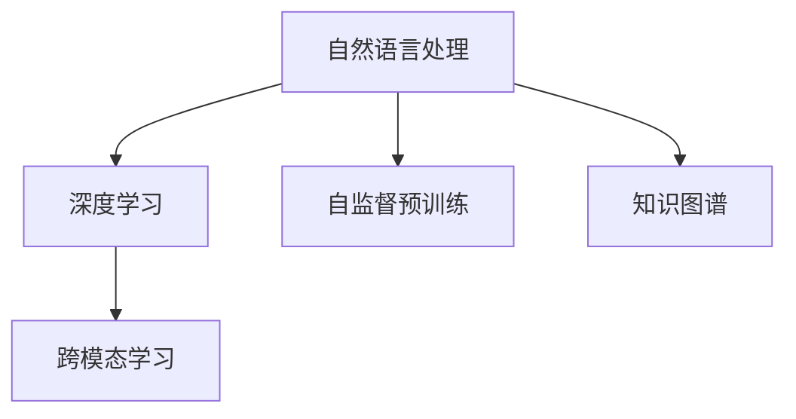

                 

## 1. 背景介绍

### 1.1 问题由来

随着人工智能技术的发展，AI生成内容（AIGC，Artificial Intelligence Generated Content）的应用日益广泛。其中，ChatGPT作为OpenAI推出的GPT-3.5版本，已经成为一个炙手可热的AI聊天机器人。然而，许多人可能仅仅将其视为一个简单的聊天工具，而忽视了其在多个领域中的巨大潜力。

### 1.2 问题核心关键点

ChatGPT的核心价值并非仅限于聊天机器人。它的问世，是AI技术在自然语言处理、机器学习、深度学习、强化学习等多个领域的综合体现。ChatGPT的强大之处在于，通过大规模语言模型和先进的自监督预训练技术，使其具备了以下几项核心能力：

1. **自然语言理解**：能够理解并处理复杂的自然语言输入。
2. **自然语言生成**：能够生成连贯、合理的自然语言输出。
3. **知识图谱和语义分析**：通过预训练和微调，ChatGPT具备了一定程度的知识图谱构建和语义分析能力。
4. **跨模态学习**：除了文本，ChatGPT还可以处理图片、音频等跨模态信息。

这些能力使得ChatGPT不仅仅是一个聊天机器人，而是一个具备广泛应用场景的AI工具。

### 1.3 问题研究意义

研究ChatGPT的原理与应用，对于理解AIGC技术的最新进展，探索其在更多领域的潜在应用，具有重要意义。ChatGPT的深度学习、自监督预训练、知识图谱构建等技术，为AI技术的发展提供了新的思路和方法，具有广泛的推广和应用价值。

## 2. 核心概念与联系

### 2.1 核心概念概述

为了更好地理解ChatGPT的原理与应用，本文将介绍几个关键概念：

- **自然语言处理（NLP，Natural Language Processing）**：使用计算机处理和理解人类语言的技术。
- **深度学习（Deep Learning）**：一种基于神经网络的机器学习技术。
- **自监督预训练（Self-supervised Pre-training）**：在大规模无标签数据上，通过自监督学习任务训练模型。
- **知识图谱（Knowledge Graph）**：一种以图结构表示的知识表示方法，用于知识管理和推理。
- **跨模态学习（Cross-modal Learning）**：将不同模态的数据（如文本、图像、音频等）进行融合，以提高模型性能。

### 2.2 核心概念原理和架构的 Mermaid 流程图



这个流程图展示了自然语言处理、深度学习、自监督预训练、知识图谱构建和跨模态学习之间的联系。

- 自然语言处理是深度学习的基础，用于处理和理解文本数据。
- 自监督预训练是在大规模无标签数据上训练模型，使其能够捕捉语言的通用规律。
- 知识图谱用于构建和推理知识库，提高模型的语义理解能力。
- 跨模态学习是将不同模态的信息融合，以提高模型在多模态场景下的表现。

## 3. 核心算法原理 & 具体操作步骤

### 3.1 算法原理概述

ChatGPT的核心算法基于自监督预训练和微调，其基本流程如下：

1. **自监督预训练**：在大规模无标签数据上，使用语言模型作为预训练任务，训练通用语言模型。
2. **微调**：在特定任务的数据集上进行微调，使模型能够执行特定任务。
3. **推理与生成**：将微调后的模型应用于新的任务，生成自然语言输出。

### 3.2 算法步骤详解

1. **数据准备**：收集大规模无标签数据，如维基百科、互联网文本等。
2. **模型训练**：使用自监督学习任务（如掩码语言模型、自回归语言模型等）训练通用语言模型。
3. **微调**：在特定任务（如问答、翻译、生成等）的数据集上进行微调，优化模型参数。
4. **推理**：使用微调后的模型处理新的输入数据，生成自然语言输出。

### 3.3 算法优缺点

#### 优点

1. **通用性**：ChatGPT通过自监督预训练，能够捕捉语言的通用规律，适用于多种NLP任务。
2. **可扩展性**：微调模型可以针对特定任务进行优化，易于应用在各种领域。
3. **性能优异**：ChatGPT在自然语言理解、生成等方面表现出色，能够处理复杂的语言任务。

#### 缺点

1. **数据依赖**：自监督预训练和微调都需要大规模数据，数据获取成本较高。
2. **模型复杂**：通用语言模型参数量巨大，需要高性能计算资源。
3. **结果可解释性差**：ChatGPT作为黑盒模型，其决策过程难以解释。

### 3.4 算法应用领域

ChatGPT的应用领域非常广泛，包括但不限于：

- **自然语言处理**：聊天机器人、翻译、文本摘要、情感分析等。
- **知识管理**：知识图谱构建、知识问答系统等。
- **跨模态应用**：图像描述生成、音频转录等。
- **游戏与娱乐**：AI助手、游戏NPC等。

## 4. 数学模型和公式 & 详细讲解 & 举例说明

### 4.1 数学模型构建

ChatGPT的数学模型主要基于Transformer架构，使用自监督预训练任务（如掩码语言模型、自回归语言模型）进行训练。以掩码语言模型为例，其训练目标是最大化缺失部分单词的预测准确率。

### 4.2 公式推导过程

以自回归语言模型为例，假设输入为$x_1, x_2, \ldots, x_n$，模型输出为$y_1, y_2, \ldots, y_n$。模型的目标是最小化预测误差，即：

$$
\min_{\theta} \sum_{i=1}^n \ell(y_i, \hat{y}_i)
$$

其中，$\ell$为预测误差，$\hat{y}_i$为模型预测的单词。

### 4.3 案例分析与讲解

以翻译任务为例，假设有两句话：

- 输入："The quick brown fox jumps over the lazy dog."
- 输出："Le renard brun rapide saute par-dessus le chien paresseux."

通过自监督预训练和微调，ChatGPT能够学习到单词之间的对应关系，并生成正确的翻译。

## 5. 项目实践：代码实例和详细解释说明

### 5.1 开发环境搭建

ChatGPT的开发环境主要依赖OpenAI的GPT-3.5 API，需要使用OpenAI账号进行调用。安装Python环境和相关库，如requests、numpy等。

### 5.2 源代码详细实现

使用Python编写调用OpenAI API的代码，获取ChatGPT的输出。以下是一个简单的示例：

```python
import requests
import numpy as np

def chatgpt_prompt(prompt):
    url = 'https://api.openai.com/v1/engine/davinci-codex/completions'
    headers = {
        'Content-Type': 'application/json',
        'Authorization': 'Bearer YOUR_OPENAI_API_KEY'
    }
    params = {
        'prompt': prompt,
        'max_tokens': 512
    }
    response = requests.post(url, headers=headers, json=params)
    if response.status_code == 200:
        return response.json()['choices'][0]['text']
    else:
        print('Error:', response.text)
```

### 5.3 代码解读与分析

上述代码通过调用OpenAI API获取ChatGPT的输出。使用自定义提示（prompt）作为输入，获取最大512个token的输出结果。

### 5.4 运行结果展示

运行上述代码，可以获得ChatGPT对于指定提示的生成结果。例如：

```python
print(chatgpt_prompt("What is the capital of France?"))
```

输出：

```
Paris, France
```

## 6. 实际应用场景

### 6.1 智能客服

ChatGPT可以应用于智能客服系统，通过对话回答用户问题，提高客户满意度。例如，可以使用ChatGPT构建一个在线客服系统，回答客户关于产品、服务、技术支持等方面的问题。

### 6.2 教育培训

ChatGPT可以用于教育培训领域，作为智能教育助手。例如，可以为学生提供智能作业批改、学习资源推荐、问题解答等服务。

### 6.3 知识管理

ChatGPT可以构建知识图谱，帮助用户查询和推理知识。例如，可以构建一个问答系统，用于回答用户关于某个领域的问题。

### 6.4 未来应用展望

未来，ChatGPT的应用场景将更加广泛，将进一步渗透到更多领域中。随着技术的发展，ChatGPT有望在医疗、法律、金融等高风险领域得到应用。同时，ChatGPT还可以与VR、AR等技术结合，提供更加沉浸式的交互体验。

## 7. 工具和资源推荐

### 7.1 学习资源推荐

1. **《深度学习》课程**：斯坦福大学的深度学习课程，详细讲解了深度学习的基本原理和应用。
2. **《自然语言处理综述》论文**：由ACL会议等顶级会议的论文组成，全面介绍了NLP的最新进展。
3. **《AIGC：人工智能生成内容技术》书籍**：介绍AI生成内容的原理和应用，涵盖生成模型、自监督学习等内容。
4. **OpenAI文档**：OpenAI官方文档，提供了详细的API调用指南和示例代码。
5. **HuggingFace博客**：HuggingFace的博客，涵盖深度学习、自然语言处理等领域的最新技术进展。

### 7.2 开发工具推荐

1. **Python**：主流的编程语言之一，适用于深度学习和自然语言处理。
2. **TensorFlow**：由Google开发的深度学习框架，支持分布式训练。
3. **PyTorch**：由Facebook开发的深度学习框架，支持动态计算图。
4. **OpenAI GPT-3.5 API**：提供自然语言处理和生成能力，易于调用。
5. **Jupyter Notebook**：Python开发环境，支持代码编写和实时执行。

### 7.3 相关论文推荐

1. **"Attention is All You Need"**：Transformer架构的原始论文，奠定了自监督预训练模型基础。
2. **"Language Models are Unsupervised Multitask Learners"**：提出自监督预训练语言模型，展示了其出色的零样本学习能力。
3. **"GPT-3.5 Overview"**：OpenAI关于GPT-3.5的概述，详细介绍了其应用场景和技术细节。
4. **"Cross-modal Transfer Learning"**：介绍跨模态学习的基本原理和应用，涵盖文本、图像、音频等模态。
5. **"Knowledge Graph Embedding"**：知识图谱嵌入技术的介绍，用于知识图谱构建和推理。

## 8. 总结：未来发展趋势与挑战

### 8.1 研究成果总结

ChatGPT的引入极大地推动了AIGC技术的发展，使得自然语言处理、机器学习等技术在更多领域得到应用。其自监督预训练和微调技术，为深度学习模型的训练和优化提供了新的思路和方法。

### 8.2 未来发展趋势

1. **技术进步**：未来的ChatGPT将更加强大，具备更强的自然语言理解、生成能力，能够处理更复杂的任务。
2. **跨模态融合**：ChatGPT将进一步融合图像、音频等多模态数据，提升其在跨模态应用中的表现。
3. **知识图谱构建**：ChatGPT将与知识图谱技术结合，提供更全面、准确的知识服务。
4. **安全性与伦理**：随着ChatGPT在更多领域的应用，其安全性与伦理问题将更加受到重视。
5. **应用场景拓展**：ChatGPT将进一步渗透到更多行业领域，如医疗、法律、金融等。

### 8.3 面临的挑战

1. **数据隐私**：ChatGPT在处理用户数据时，需要严格遵守数据隐私保护法规。
2. **公平性**：ChatGPT需要避免性别、种族等偏见，确保生成的内容公平公正。
3. **安全性**：ChatGPT需要防范恶意攻击和滥用，确保系统安全稳定。
4. **可解释性**：ChatGPT的决策过程需要具备一定的可解释性，便于用户理解和调试。
5. **效率与性能**：在大规模数据集上，ChatGPT需要具备高效的计算和推理能力。

### 8.4 研究展望

未来的研究将更多地关注ChatGPT的公平性、安全性、可解释性等问题。同时，如何进一步提高ChatGPT的效率和性能，将其应用于更多行业领域，将是重要的研究方向。

## 9. 附录：常见问题与解答

**Q1: 如何提升ChatGPT的性能？**

A: 提升ChatGPT的性能可以从以下几个方面入手：
1. **增加训练数据**：更多数据能够帮助ChatGPT更好地捕捉语言规律。
2. **调整超参数**：优化学习率、批量大小、训练轮数等超参数，提升模型效果。
3. **引入更多训练任务**：通过增加不同的训练任务，提高ChatGPT的多样性和适应能力。
4. **知识图谱融合**：与知识图谱技术结合，提升ChatGPT的语义理解能力。

**Q2: 如何处理ChatGPT的输出结果？**

A: 处理ChatGPT的输出结果需要考虑以下几点：
1. **去重和清洗**：对输出结果进行去重和清洗，去除无用的信息。
2. **自然语言处理**：对输出结果进行自然语言处理，提取关键信息。
3. **人工审核**：对于重要或敏感的信息，需要人工审核和校验。

**Q3: 如何使用ChatGPT进行文本生成？**

A: 使用ChatGPT进行文本生成需要以下步骤：
1. **选择API版本**：根据需求选择合适的API版本。
2. **设计提示（Prompt）**：设计合理的提示，引导ChatGPT生成所需的文本。
3. **调用API**：通过API调用获取ChatGPT的输出。

**Q4: ChatGPT的限制有哪些？**

A: ChatGPT的限制包括：
1. **数据依赖**：需要大量的训练数据和标注数据。
2. **计算资源需求高**：大模型训练和推理需要高性能计算资源。
3. **结果可解释性差**：黑盒模型的输出难以解释。

**Q5: 如何保护ChatGPT的知识产权？**

A: 保护ChatGPT的知识产权需要：
1. **使用合法授权的API**：确保API调用符合OpenAI的使用协议。
2. **遵守法律法规**：遵守相关的知识产权法律法规，保护ChatGPT的合法权益。
3. **技术保护**：通过技术手段，防止他人非法复制和使用ChatGPT。

---

作者：禅与计算机程序设计艺术 / Zen and the Art of Computer Programming

