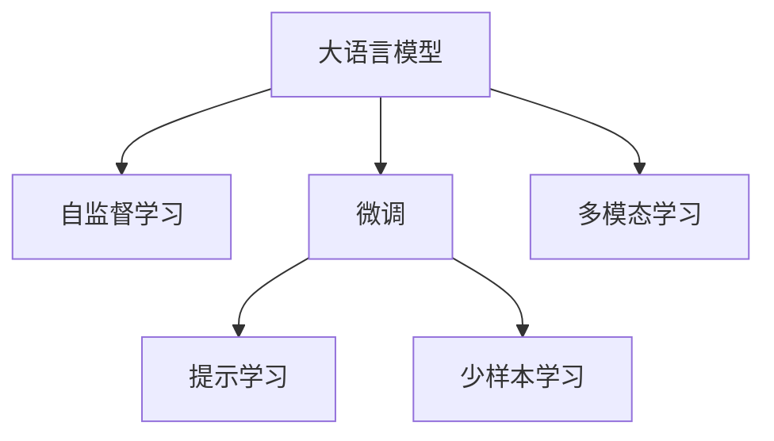

                 

# AIGC从入门到实战：应用：目前 ChatGPT 能在什么场景下做什么事

在人工智能飞速发展的当下，AI生成内容（AIGC）技术已经成为各行各业关注的焦点。作为AIGC领域的重要里程碑，ChatGPT的横空出世引发了广泛的关注和讨论。本文将从ChatGPT的原理、技术背景、应用场景等角度出发，探讨目前ChatGPT能在哪些场景下发挥其独特优势，并展望其未来的发展潜力。

## 1. 背景介绍

### 1.1 问题由来

近年来，随着深度学习技术的快速发展，大语言模型（LLMs）在自然语言处理（NLP）领域取得了显著的突破。其中，ChatGPT作为OpenAI推出的最新一代大模型，凭借其强大的自然语言理解和生成能力，迅速成为AI生成内容领域的标杆。

ChatGPT的问世不仅标志着AIGC技术的新高度，也引发了关于语言模型应用场景、隐私安全、伦理道德等问题的广泛讨论。在实际应用中，ChatGPT究竟能做什么？本文将一一解析。

### 1.2 问题核心关键点

ChatGPT的核心优势在于其强大的语言生成和理解能力。这种能力使得ChatGPT可以在多个领域发挥独特的作用，如教育、娱乐、客服、写作、翻译等。此外，ChatGPT还具有良好的通用性，可以在不同场景下通过微调和训练，适应新的任务和需求。

## 2. 核心概念与联系

### 2.1 核心概念概述

为了更好地理解ChatGPT的工作原理及其应用场景，本文将介绍一些关键概念：

- 大语言模型（LLMs）：基于深度学习技术训练的语言模型，具有强大的自然语言理解和生成能力。
- 自然语言处理（NLP）：涉及计算机如何处理、理解、生成和分析人类语言的技术。
- 自监督学习（SSL）：在大规模无标签数据上进行训练，通过预训练学习语言表示的技术。
- 微调（Fine-tuning）：在大模型基础上，使用特定任务的标注数据进行优化，提升模型在该任务上的性能。
- 提示学习（Prompt-based Learning）：通过精心设计的提示模板引导模型生成特定格式的输出。
- 少样本学习（Few-shot Learning）：在仅有少量样本的情况下，模型能够快速适应新任务。
- 多模态学习（Multi-modal Learning）：结合视觉、听觉等多种信息源，提升模型的综合理解能力。

这些概念之间的联系可以通过以下Mermaid流程图展示：



这个流程图展示了ChatGPT的各个核心概念及其相互关系：

1. 大语言模型通过自监督学习获得基础的语言表示能力。
2. 微调在大模型基础上进行优化，使其适应特定任务。
3. 提示学习通过设计特定的提示模板，引导模型生成特定格式的输出。
4. 少样本学习在少量数据下仍能快速适应新任务。
5. 多模态学习结合多种信息源，提升模型的综合理解能力。

## 3. 核心算法原理 & 具体操作步骤

### 3.1 算法原理概述

ChatGPT的算法原理基于Transformer模型，并采用自监督学习进行预训练。具体而言，ChatGPT使用大规模无标签文本数据进行预训练，学习语言的基础表示。然后在特定任务上使用微调方法，通过有监督学习优化模型在该任务上的性能。微调过程中，ChatGPT通过调整模型参数和损失函数，使其在特定任务上的预测更加准确。

### 3.2 算法步骤详解

ChatGPT的微调过程包括以下关键步骤：

1. **准备数据**：收集与任务相关的标注数据，并将其划分为训练集、验证集和测试集。
2. **模型初始化**：使用预训练的ChatGPT模型作为初始化参数。
3. **模型适配**：在模型顶层添加任务特定的输出层和损失函数。
4. **设置超参数**：选择合适的优化算法（如AdamW），设置学习率、批大小、迭代轮数等。
5. **执行训练**：使用训练集数据进行有监督的梯度下降优化，最小化损失函数。
6. **验证评估**：在验证集上评估模型性能，根据性能指标决定是否进行Early Stopping。
7. **测试部署**：在测试集上评估微调后模型的性能，并在实际应用中集成和部署。

### 3.3 算法优缺点

ChatGPT的微调方法具有以下优点：

- **高效性**：通过微调，ChatGPT可以迅速适应新任务，节省大量标注数据和计算资源。
- **灵活性**：ChatGPT可以在不同领域和任务上应用，具有较强的通用性和可扩展性。
- **性能提升**：微调能够显著提升ChatGPT在特定任务上的表现，满足实际需求。

然而，ChatGPT也存在一些局限性：

- **依赖标注数据**：微调依赖于标注数据的质量和数量，标注成本较高。
- **过拟合风险**：微调过程中，ChatGPT可能过拟合训练数据，导致泛化能力不足。
- **伦理和安全问题**：ChatGPT的输出可能包含有害信息或偏见，需要严格监管。

### 3.4 算法应用领域

ChatGPT在多个领域具有广泛的应用前景，以下是几个典型场景：

1. **教育**：
   - 智能辅导：ChatGPT可以用于提供个性化的学习辅导，解答学生问题，生成学习资源。
   - 语言学习：通过与ChatGPT对话，学生可以练习语言技能，纠正发音和语法错误。

2. **娱乐**：
   - 对话娱乐：ChatGPT可以创建各种类型的对话系统，如角色扮演、情感陪伴、游戏互动等。
   - 故事创作：ChatGPT能够生成故事、剧本、诗歌等内容，激发用户的创造力。

3. **客服**：
   - 智能客服：ChatGPT可以替代部分人工客服，处理常见问题，提高客户满意度。
   - 用户支持：通过与ChatGPT对话，用户可以获得技术支持、产品咨询等服务。

4. **写作**：
   - 内容生成：ChatGPT可以自动生成新闻稿、技术文档、市场报告等内容，提高写作效率。
   - 创作辅助：ChatGPT可以帮助作家进行构思、角色设计、情节发展等创作过程。

5. **翻译**：
   - 自动翻译：ChatGPT可以提供高质量的文本翻译服务，支持多种语言。
   - 跨文化沟通：ChatGPT可以帮助用户进行跨文化交流，解决语言障碍。

## 4. 数学模型和公式 & 详细讲解 & 举例说明

### 4.1 数学模型构建

假设ChatGPT的输入为 $x$，输出为 $y$，则模型的损失函数 $\mathcal{L}$ 可以表示为：

$$
\mathcal{L}(\theta) = \frac{1}{N} \sum_{i=1}^N \ell(y_i, M_{\theta}(x_i))
$$

其中，$\ell$ 为损失函数（如交叉熵），$M_{\theta}$ 为模型参数为 $\theta$ 的ChatGPT模型。

### 4.2 公式推导过程

在训练过程中，ChatGPT通过反向传播算法计算梯度，并使用优化器更新模型参数 $\theta$：

$$
\theta \leftarrow \theta - \eta \nabla_{\theta}\mathcal{L}(\theta)
$$

其中 $\eta$ 为学习率，$\nabla_{\theta}\mathcal{L}(\theta)$ 为损失函数对模型参数的梯度。

### 4.3 案例分析与讲解

以生成新闻标题为例，假设输入文本为新闻摘要，输出为新闻标题。可以设计一个分类任务，使用微调方法训练ChatGPT生成高质量的新闻标题。训练数据集包含大量的新闻摘要和对应的标题，模型输出与真实标题之间的差异作为损失函数。通过微调优化，ChatGPT可以学习到新闻摘要与标题之间的对应关系，生成符合新闻风格和主题的标题。

## 5. 项目实践：代码实例和详细解释说明

### 5.1 开发环境搭建

为了快速上手ChatGPT的微调实践，以下是一个基于Python和PyTorch的开发环境配置步骤：

1. 安装Anaconda并创建虚拟环境。
2. 安装PyTorch、Transformers库和其他必要的工具包。
3. 配置数据预处理工具，如分词器、数据集加载器等。

### 5.2 源代码详细实现

以下是一个使用PyTorch和HuggingFace库进行微调示例代码：

```python
from transformers import T5Tokenizer, T5ForConditionalGeneration

# 初始化模型和分词器
model = T5ForConditionalGeneration.from_pretrained('t5-small')
tokenizer = T5Tokenizer.from_pretrained('t5-small')

# 准备数据集
train_dataset = ...

# 设置训练参数
learning_rate = 1e-5
num_epochs = 5
batch_size = 16
device = 'cuda' if torch.cuda.is_available() else 'cpu'

# 定义训练函数
def train_epoch(model, dataset, optimizer):
    model.train()
    for batch in dataset:
        input_ids = batch['input_ids'].to(device)
        attention_mask = batch['attention_mask'].to(device)
        labels = batch['labels'].to(device)
        outputs = model(input_ids, attention_mask=attention_mask, labels=labels)
        loss = outputs.loss
        optimizer.zero_grad()
        loss.backward()
        optimizer.step()
    return loss

# 启动训练
for epoch in range(num_epochs):
    train_loss = train_epoch(model, train_dataset, optimizer)
    print(f'Epoch {epoch+1}, train loss: {train_loss:.3f}')

# 测试模型
test_dataset = ...
test_loss = model.eval(test_dataset)
print(f'Test loss: {test_loss:.3f}')
```

### 5.3 代码解读与分析

**训练函数**：
- `train_epoch` 函数使用训练集进行有监督的梯度下降优化，更新模型参数。
- 输入数据经过分词器编码，转化为模型的输入形式。
- 模型输出与真实标签之间的差异计算损失，并使用优化器更新模型参数。

**测试函数**：
- `eval` 函数使用测试集对模型进行评估，计算测试集上的损失。

## 6. 实际应用场景

### 6.1 教育

ChatGPT在教育领域的应用场景丰富多样：

- **智能辅导**：ChatGPT可以提供个性化学习辅导，解答学生问题，生成学习资源。例如，学生在学习数学时遇到难题，可以通过与ChatGPT对话，获得解题思路和步骤。
- **语言学习**：ChatGPT可以帮助用户练习语言技能，纠正发音和语法错误。例如，通过与ChatGPT对话，用户可以练习英语发音，提高口语水平。

### 6.2 娱乐

ChatGPT在娱乐领域可以提供多种形式的互动体验：

- **对话娱乐**：ChatGPT可以创建各种类型的对话系统，如角色扮演、情感陪伴、游戏互动等。例如，用户可以通过与ChatGPT对话，进行角色扮演，体验不同的故事情节。
- **故事创作**：ChatGPT能够生成故事、剧本、诗歌等内容，激发用户的创造力。例如，用户可以输入一个主题，ChatGPT自动生成相关的故事情节，帮助用户完成创意写作。

### 6.3 客服

ChatGPT在客服领域可以替代部分人工客服，提高客户满意度：

- **智能客服**：ChatGPT可以处理常见问题，提供技术支持和产品咨询。例如，用户在购买产品后，可以通过与ChatGPT对话，了解产品详情，解决常见问题。
- **用户支持**：ChatGPT可以提供24/7不间断的服务，解答用户咨询，提供个性化支持。例如，用户在遇到技术问题时，可以通过与ChatGPT对话，获得即时技术支持。

### 6.4 写作

ChatGPT在写作领域可以提供高效的写作辅助：

- **内容生成**：ChatGPT可以自动生成新闻稿、技术文档、市场报告等内容，提高写作效率。例如，记者可以输入新闻摘要，ChatGPT自动生成新闻标题，提高工作效率。
- **创作辅助**：ChatGPT可以帮助作家进行构思、角色设计、情节发展等创作过程。例如，作家可以输入故事大纲，ChatGPT自动生成相关章节，辅助创作。

### 6.5 翻译

ChatGPT在翻译领域可以提供高质量的翻译服务：

- **自动翻译**：ChatGPT可以提供多种语言的自动翻译服务。例如，用户输入英文文本，ChatGPT自动翻译成中文。
- **跨文化沟通**：ChatGPT可以帮助用户进行跨文化交流，解决语言障碍。例如，商务人士可以通过与ChatGPT对话，快速翻译商务邮件，提高沟通效率。

## 7. 工具和资源推荐

### 7.1 学习资源推荐

- **官方文档**：HuggingFace和OpenAI提供的官方文档和教程，是学习ChatGPT微调的最佳资源。
- **在线课程**：Coursera、edX等在线平台上的NLP课程，可以帮助你深入理解ChatGPT的原理和应用。
- **书籍**：《自然语言处理综论》、《深度学习与自然语言处理》等书籍，提供系统性的理论知识和实践案例。

### 7.2 开发工具推荐

- **PyTorch**：强大的深度学习框架，支持动态计算图，适合进行复杂的模型训练和推理。
- **TensorFlow**：生产部署方便的深度学习框架，适合大规模工程应用。
- **Jupyter Notebook**：交互式编程环境，支持Python代码的快速迭代和共享。
- **Weights & Biases**：实验跟踪工具，记录和可视化模型训练过程中的各项指标。
- **TensorBoard**：可视化工具，实时监测模型训练状态，提供丰富的图表呈现方式。

### 7.3 相关论文推荐

- **Transformer论文**：提出Transformer模型，成为NLP领域的预训练大模型基础。
- **BERT论文**：提出BERT模型，引入基于掩码的自监督预训练任务，刷新了多项NLP任务SOTA。
- **GPT-2论文**：展示了大规模语言模型的强大zero-shot学习能力，引发了对于通用人工智能的新一轮思考。
- **AdaLoRA论文**：使用自适应低秩适应的微调方法，在参数效率和精度之间取得了新的平衡。
- **AdaLoRA论文**：提出基于连续型Prompt的微调范式，为如何充分利用预训练知识提供了新的思路。

## 8. 总结：未来发展趋势与挑战

### 8.1 总结

本文详细介绍了ChatGPT的微调方法及其在多个领域的应用。ChatGPT作为AIGC技术的标杆，凭借其强大的语言生成和理解能力，在教育、娱乐、客服、写作、翻译等多个场景下发挥了重要作用。然而，ChatGPT在应用过程中也面临数据依赖、过拟合、伦理和安全等挑战，需要进一步优化和监管。

### 8.2 未来发展趋势

展望未来，ChatGPT的发展趋势如下：

1. **模型规模增大**：随着算力成本的下降和数据规模的扩张，预训练语言模型的参数量将持续增长，ChatGPT模型的规模和能力也将进一步提升。
2. **微调方法多样化**：未来将涌现更多参数高效的微调方法，如Prefix-Tuning、LoRA等，在节省计算资源的同时保证微调精度。
3. **多模态融合**：结合视觉、听觉等多种信息源，提升ChatGPT的综合理解能力。
4. **少样本学习**：在少量样本下，通过提示学习和迁移学习，快速适应新任务。
5. **持续学习**：适应数据分布的变化，保持ChatGPT的时效性和适应性。
6. **可解释性提升**：增强ChatGPT输出结果的可解释性，提高模型透明度和可信度。

### 8.3 面临的挑战

尽管ChatGPT在多个领域取得了显著成效，但在实际应用中仍面临以下挑战：

1. **标注数据依赖**：微调依赖于高质量标注数据，标注成本较高。
2. **过拟合风险**：微调过程中可能过拟合训练数据，导致泛化能力不足。
3. **伦理和安全问题**：ChatGPT的输出可能包含有害信息或偏见，需要严格监管。
4. **推理效率**：大规模语言模型推理速度较慢，需要优化模型结构和推理算法。
5. **可解释性不足**：ChatGPT的决策过程缺乏可解释性，难以对其推理逻辑进行分析和调试。

### 8.4 研究展望

未来，ChatGPT的研究方向如下：

1. **探索无监督和半监督微调方法**：摆脱对大规模标注数据的依赖，利用自监督学习、主动学习等方法提高微调效率。
2. **开发参数高效和计算高效的微调范式**：在固定大部分预训练参数的情况下，只更新极少量的任务相关参数。
3. **引入因果和对比学习范式**：增强ChatGPT建立稳定因果关系的能力，提升模型的泛化性和抗干扰能力。
4. **融合更多先验知识**：将符号化的先验知识与神经网络模型融合，引导ChatGPT学习更准确的语言模型。
5. **引入因果分析和博弈论工具**：识别ChatGPT决策的关键特征，增强输出解释的因果性和逻辑性。
6. **纳入伦理道德约束**：在模型训练目标中引入伦理导向的评估指标，过滤和惩罚有害输出，确保输出符合人类价值观和伦理道德。

## 9. 附录：常见问题与解答

**Q1: 如何训练ChatGPT生成新闻标题？**

A: 可以通过以下步骤训练ChatGPT生成新闻标题：
1. 准备训练数据集，包含新闻摘要和对应的标题。
2. 使用T5Tokenizer和T5ForConditionalGeneration初始化模型和分词器。
3. 设置训练参数，如学习率、批大小、迭代轮数等。
4. 定义训练函数，计算损失并更新模型参数。
5. 在测试集上评估模型性能，生成新闻标题。

**Q2: 在微调ChatGPT时，如何选择学习率？**

A: 一般建议从1e-5开始调参，逐步减小学习率，直至收敛。也可以使用warmup策略，在开始阶段使用较小的学习率，再逐渐过渡到预设值。不同的优化器（如AdamW、Adafactor等）和不同的学习率调度策略可能需要设置不同的学习率阈值。

**Q3: 如何缓解ChatGPT在微调过程中的过拟合问题？**

A: 可以通过以下方法缓解过拟合问题：
1. 数据增强：通过回译、近义替换等方式扩充训练集。
2. 正则化：使用L2正则、Dropout、Early Stopping等方法。
3. 对抗训练：引入对抗样本，提高模型鲁棒性。
4. 参数高效微调：只调整少量参数（如Adapter、Prefix等），减小过拟合风险。

**Q4: ChatGPT在实际部署中需要注意哪些问题？**

A: 在实际部署中，需要注意以下问题：
1. 模型裁剪：去除不必要的层和参数，减小模型尺寸，加快推理速度。
2. 量化加速：将浮点模型转为定点模型，压缩存储空间，提高计算效率。
3. 服务化封装：将模型封装为标准化服务接口，便于集成调用。
4. 弹性伸缩：根据请求流量动态调整资源配置，平衡服务质量和成本。
5. 监控告警：实时采集系统指标，设置异常告警阈值，确保服务稳定性。
6. 安全防护：采用访问鉴权、数据脱敏等措施，保障数据和模型安全。

**Q5: ChatGPT在教育领域的应用前景如何？**

A: ChatGPT在教育领域具有广泛的应用前景：
1. 智能辅导：提供个性化的学习辅导，解答学生问题，生成学习资源。
2. 语言学习：帮助用户练习语言技能，纠正发音和语法错误。

总之，ChatGPT作为AIGC技术的标杆，正在引领NLP领域的革命性变革。通过不断优化和改进，ChatGPT将在更多领域展现出其独特优势，推动人工智能技术的应用和发展。

---

作者：禅与计算机程序设计艺术 / Zen and the Art of Computer Programming

