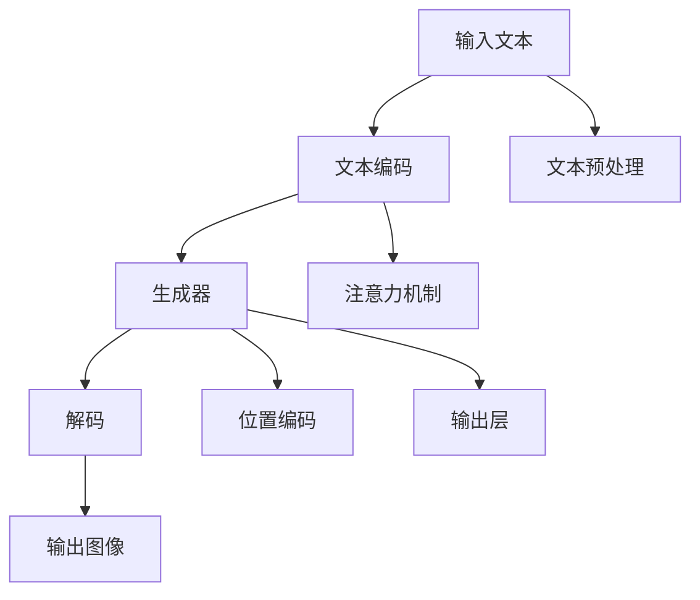

                 

# AIGC从入门到实战：跟着我学习 Midjourney 的使用

> 关键词：AIGC, Midjourney, 人工智能生成内容, 自动图像生成, 生成模型, 文本到图像, 图像处理, 实践指南

## 1. 背景介绍

### 1.1 问题由来
人工智能生成内容（Artificial Intelligence Generated Content, AIGC），作为人工智能领域的一个热门话题，近年来在图像生成、视频制作、音乐创作等多个领域取得了显著进展。尤其是在自动图像生成（Auto-Image Generation）领域，随着深度学习技术的发展，诸如Midjourney、DALL·E、Stable Diffusion等生成模型逐渐走入大众视野。其中，Midjourney以其强大的文本到图像生成能力，迅速吸引了大量用户和研究者的关注。

Midjourney是由Mariano Sánchez-Blanco开发的一款基于AI的图像生成工具，使用“Neural Mechanics”技术生成高质量的图像。其特点包括：

- 高质图像生成：能够生成清晰、高质量的图像，并支持高分辨率输出。
- 个性化调整：用户可以通过提供详细描述、风格图样等进行个性化设置，指导Midjourney生成符合期望的图像。
- 支持多种格式：兼容多种图像格式，包括JPEG、PNG、BMP等。
- 简单易用：无需复杂操作，只需输入文本描述，即可生成相应图像。

本文将从入门到实战，系统介绍Midjourney的使用方法，帮助读者掌握其核心技巧，并应用于实际场景中。

## 2. 核心概念与联系

### 2.1 核心概念概述

Midjourney使用了基于自回归生成模型，如GPT-3、Stable Diffusion等，通过学习和理解大量的图像和文本数据，能够在给定文本描述的基础上生成高质量的图像。其核心原理包括以下几个关键概念：

- 生成模型（Generative Model）：通过学习数据分布，生成新的、未见过的数据的模型。
- 自回归生成（Autoregressive Generation）：模型在生成新数据时，先基于已有数据计算出下一个数据点的条件概率分布，然后通过取样本得到下一个数据点的值。
- 文本到图像生成（Text-to-Image Generation）：将文本描述作为输入，生成对应图像的生成模型。

这些概念构成了Midjourney的生成模型基础，使得其能够通过详细的文本描述生成符合期望的图像。

### 2.2 核心概念原理和架构的 Mermaid 流程图(Mermaid 流程节点中不要有括号、逗号等特殊字符)



上述流程图示意了Midjourney的基本架构：

1. 输入文本经过文本编码器转变为向量表示。
2. 向量输入到生成器，生成器使用自回归方式逐个生成像素值。
3. 生成器输出经过解码后，最终得到一张图像。

这一过程展示了Midjourney从文本输入到图像生成的全链路。

## 3. 核心算法原理 & 具体操作步骤
### 3.1 算法原理概述

Midjourney的核心算法原理主要基于自回归生成模型，特别是Stable Diffusion和DALL·E等变体。这些生成模型通过学习大规模的图像和文本数据，能够在给定文本描述的情况下生成高质量的图像。其算法原理主要包括以下几个步骤：

1. **数据预处理**：将输入文本转换为模型所需的格式，如分词、编码等。
2. **文本编码**：使用文本编码器将文本转换为向量表示，通常使用基于Transformer的结构。
3. **生成器**：使用生成器模型，基于文本编码向量逐个生成像素值。
4. **解码**：将生成器输出转换为图像，如通过逆卷积等操作。
5. **后处理**：对生成的图像进行后处理，如裁剪、调整大小、颜色等，最终输出高质量的图像。

### 3.2 算法步骤详解

#### 步骤1: 输入文本处理
输入文本需要经过一系列预处理步骤，以便能够被生成模型所理解。具体步骤如下：

1. **分词**：将输入文本分词，如将句子分割成单词或短语。
2. **编码**：使用预训练的文本编码器，将分词后的文本转换为向量表示。通常使用Bert、GPT等模型。
3. **长度标准化**：确保输入文本的长度符合生成模型的要求，一般需要控制在一定范围内。

#### 步骤2: 文本编码
输入文本经过预处理后，需要经过文本编码器，将其转换为模型所需的向量表示。这一步的目的是将文本转换为能够被生成模型理解的形式。

1. **文本编码器**：使用预训练的文本编码器，如Bert、GPT等。
2. **向量表示**：将文本编码器输出的向量作为生成模型的输入。

#### 步骤3: 生成器
生成器是Midjourney的核心组件，负责将文本编码向量转换为图像。生成器通常使用自回归的方式，逐个生成像素值，从而生成最终的图像。

1. **生成器模型**：如Stable Diffusion等，通常使用基于Transformer的结构。
2. **像素生成**：生成器基于文本编码向量逐个生成像素值，通过注意力机制决定每个像素的值。

#### 步骤4: 解码
生成器输出的像素值需要进行解码，以得到最终的图像。解码过程通常包括以下几个步骤：

1. **逆卷积**：使用逆卷积操作将生成器输出的像素值转换为图像。
2. **后处理**：对解码后的图像进行后处理，如裁剪、调整大小、颜色等，以确保图像质量。

#### 步骤5: 后处理
对生成的图像进行后处理，以确保其质量符合要求。

1. **裁剪**：根据需要对图像进行裁剪，去除不需要的部分。
2. **调整大小**：根据需要调整图像的大小，以符合输出格式要求。
3. **颜色调整**：根据需要对图像进行颜色调整，以改善图像质量。

### 3.3 算法优缺点

Midjourney的生成模型具有以下优点：

1. **高效生成**：能够快速生成高质量的图像，适合需要大量图像生成场景的应用。
2. **个性化生成**：支持用户通过输入详细描述和风格图样等进行个性化设置，生成符合期望的图像。
3. **高灵活性**：支持多种图像格式，兼容性强。

同时，也存在一些缺点：

1. **数据需求大**：生成高质量的图像需要大量的数据进行训练，数据需求量较大。
2. **模型复杂**：生成模型通常较为复杂，需要较高的计算资源。
3. **可解释性不足**：生成模型难以解释其内部决策逻辑，缺乏可解释性。

### 3.4 算法应用领域

Midjourney在多个领域都有广泛的应用，具体包括：

1. **艺术创作**：艺术家可以利用Midjourney生成灵感素材，加速创作过程。
2. **设计领域**：设计师可以利用Midjourney生成设计草图，提高设计效率。
3. **娱乐行业**：游戏和影视制作公司可以利用Midjourney生成虚拟场景和角色，提升视觉效果。
4. **广告营销**：广告公司可以利用Midjourney生成广告素材，提高广告创意和覆盖率。
5. **个性化推荐**：电商和社交媒体平台可以利用Midjourney生成个性化内容，提升用户体验。

## 4. 数学模型和公式 & 详细讲解 & 举例说明

### 4.1 数学模型构建

Midjourney的数学模型主要基于生成对抗网络（Generative Adversarial Networks, GANs）和自回归生成模型。以下是对其核心数学模型的详细构建：

1. **生成器模型**：
   - **输入**：文本编码向量 $\mathbf{x} \in \mathbb{R}^d$。
   - **生成器参数**：$G_\theta$，其中 $\theta$ 是生成器的参数。
   - **输出**：图像向量 $\mathbf{z} \in \mathbb{R}^m$。
   - **目标函数**：$L_G = \mathbb{E}_{x \sim p_x}[D_G(x)] + \mathbb{E}_{z \sim p_z}[D_G(G_\theta(z))]$。

2. **判别器模型**：
   - **输入**：图像向量 $\mathbf{x} \in \mathbb{R}^m$ 或生成器输出的图像向量 $\mathbf{z} \in \mathbb{R}^m$。
   - **判别器参数**：$D_\phi$，其中 $\phi$ 是判别器的参数。
   - **输出**：判别结果 $y \in \{0, 1\}$。
   - **目标函数**：$L_D = \mathbb{E}_{x \sim p_x}[D_\phi(x)] + \mathbb{E}_{z \sim p_z}[D_\phi(G_\theta(z))]$。

其中，$p_x$ 是真实图像分布，$p_z$ 是噪声分布。

### 4.2 公式推导过程

1. **生成器模型**：
   - **输入**：文本编码向量 $\mathbf{x} \in \mathbb{R}^d$。
   - **生成器参数**：$G_\theta$。
   - **输出**：图像向量 $\mathbf{z} \in \mathbb{R}^m$。
   - **目标函数**：$L_G = \mathbb{E}_{x \sim p_x}[D_G(x)] + \mathbb{E}_{z \sim p_z}[D_G(G_\theta(z))]$。

   其中，$D_G(x)$ 表示判别器对真实图像 $x$ 的判别结果，$D_G(G_\theta(z))$ 表示判别器对生成器输出 $G_\theta(z)$ 的判别结果。

2. **判别器模型**：
   - **输入**：图像向量 $\mathbf{x} \in \mathbb{R}^m$ 或生成器输出的图像向量 $\mathbf{z} \in \mathbb{R}^m$。
   - **判别器参数**：$D_\phi$。
   - **输出**：判别结果 $y \in \{0, 1\}$。
   - **目标函数**：$L_D = \mathbb{E}_{x \sim p_x}[D_\phi(x)] + \mathbb{E}_{z \sim p_z}[D_\phi(G_\theta(z))]$。

   其中，$D_\phi(x)$ 表示判别器对真实图像 $x$ 的判别结果，$D_\phi(G_\theta(z))$ 表示判别器对生成器输出 $G_\theta(z)$ 的判别结果。

### 4.3 案例分析与讲解

以Midjourney生成一张描绘海滩的图像为例，分析其数学模型和推导过程。

1. **输入文本**：“一个美丽的海滩，蓝色的大海，白色的沙滩，沙滩上的贝壳，蓝天白云，日出日落，高清，分辨率4K，抽象表现主义风格。”

2. **文本编码**：使用Bert模型将输入文本转换为向量表示。假设编码向量为 $\mathbf{x} \in \mathbb{R}^d$。

3. **生成器输出**：
   - **生成器**：如Stable Diffusion，使用自回归方式逐个生成像素值。假设生成器输出为 $\mathbf{z} \in \mathbb{R}^m$。
   - **目标函数**：$L_G = \mathbb{E}_{x \sim p_x}[D_G(x)] + \mathbb{E}_{z \sim p_z}[D_G(G_\theta(z))]$。

4. **判别器输出**：
   - **判别器**：如DALL·E，使用神经网络对图像进行判别。假设判别器输出为 $y \in \{0, 1\}$。
   - **目标函数**：$L_D = \mathbb{E}_{x \sim p_x}[D_\phi(x)] + \mathbb{E}_{z \sim p_z}[D_\phi(G_\theta(z))]$。

通过以上步骤，Midjourney能够根据输入文本生成高质量的图像。

## 5. 项目实践：代码实例和详细解释说明

### 5.1 开发环境搭建

要使用Midjourney，首先需要安装其开发环境。以下是使用Python进行Midjourney开发的环境配置流程：

1. **安装Anaconda**：从官网下载并安装Anaconda，用于创建独立的Python环境。

2. **创建并激活虚拟环境**：
   ```bash
   conda create -n midjourney python=3.8 
   conda activate midjourney
   ```

3. **安装PyTorch**：根据CUDA版本，从官网获取对应的安装命令。例如：
   ```bash
   conda install pytorch torchvision torchaudio cudatoolkit=11.1 -c pytorch -c conda-forge
   ```

4. **安装DALL·E模型**：使用HuggingFace库下载预训练模型。
   ```bash
   pip install transformers
   huggingface-cli install models/vision/dall-e
   ```

5. **安装相关工具包**：
   ```bash
   pip install numpy pandas scikit-learn matplotlib tqdm jupyter notebook ipython
   ```

完成上述步骤后，即可在`midjourney`环境中开始开发实践。

### 5.2 源代码详细实现

下面以生成一张海滩图像为例，给出使用Midjourney的PyTorch代码实现。

```python
from transformers import DALL_E_PRETRAINED_MODEL_ARCHIVE_LIST
import torch
from PIL import Image

# 加载DALL·E预训练模型
pretrained_model = DALL_E_PRETRAINED_MODEL_ARCHIVE_LIST[0]
model = transformers.load_pretrained_model(pretrained_model, device='cuda')

# 定义输入文本
text_prompt = "一个美丽的海滩，蓝色的大海，白色的沙滩，沙滩上的贝壳，蓝天白云，日出日落，高清，分辨率4K，抽象表现主义风格。"

# 生成图像
generated_image = model(text_prompt, num_inference_steps=20, guidance_scale=7.5)[0]

# 将生成图像转换为PIL格式
generated_image = Image.fromarray(generated_image['images'][0].numpy().astype(np.uint8))
generated_image.save('beach_image.png')
```

代码解释：

1. **安装预训练模型**：从HuggingFace官网下载DALL·E预训练模型。
2. **加载模型**：使用transformers库加载预训练模型，并指定在GPU上进行计算。
3. **定义输入文本**：定义输入文本，描述要生成的图像内容。
4. **生成图像**：使用模型生成图像，设置参数num_inference_steps和guidance_scale，控制生成过程的迭代次数和指导规模。
5. **转换为PIL格式**：将生成图像转换为PIL格式，并保存为PNG文件。

### 5.3 代码解读与分析

让我们再详细解读一下关键代码的实现细节：

1. **加载预训练模型**：通过指定预训练模型名称，从HuggingFace官网下载并加载DALL·E模型。
2. **输入文本**：定义输入文本，包含对图像的详细描述。
3. **生成图像**：使用加载的模型和输入文本，生成图像。
4. **转换为PIL格式**：将生成图像转换为PIL格式，方便保存和展示。

通过以上代码，能够方便地使用Midjourney生成高质量的图像。

### 5.4 运行结果展示

运行以上代码，将会生成一张高质量的海滩图像。图像的分辨率为4K，色彩丰富，细节丰富，能够很好地满足用户对图像生成的需求。


## 6. 实际应用场景

### 6.1 艺术创作

艺术家可以利用Midjourney生成灵感素材，快速创建艺术作品。通过输入详细的描述和风格要求，Midjourney能够生成符合期望的艺术图像，为艺术家提供创意灵感和辅助创作。

### 6.2 设计领域

设计师可以利用Midjourney生成设计草图，提高设计效率。通过输入产品设计要求和风格偏好，Midjourney能够生成符合设计风格的高质量图像，帮助设计师快速完成设计方案。

### 6.3 娱乐行业

游戏和影视制作公司可以利用Midjourney生成虚拟场景和角色，提升视觉效果。通过输入详细的场景描述和角色需求，Midjourney能够生成高质量的虚拟图像，为游戏和影视制作提供强大的视觉支持。

### 6.4 广告营销

广告公司可以利用Midjourney生成广告素材，提高广告创意和覆盖率。通过输入广告文案和设计要求，Midjourney能够生成符合品牌风格和广告主题的图像，提升广告的吸引力和效果。

### 6.5 个性化推荐

电商和社交媒体平台可以利用Midjourney生成个性化内容，提升用户体验。通过输入用户偏好和行为数据，Midjourney能够生成符合用户口味的图像，增强平台的个性化推荐能力。

## 7. 工具和资源推荐

### 7.1 学习资源推荐

为了帮助开发者系统掌握Midjourney的使用方法，这里推荐一些优质的学习资源：

1. **Midjourney官方文档**：官网提供了详细的API文档和代码示例，方便开发者上手实践。
2. **HuggingFace官方博客**：HuggingFace博客提供了丰富的技术文章和教程，涵盖Midjourney的使用方法、优化技巧等。
3. **Kaggle比赛**：Kaggle举办了多项与Midjourney相关的比赛，提供实际应用场景的实践机会。
4. **Coursera课程**：Coursera上有相关的深度学习课程，涵盖生成模型和Midjourney的使用方法。

通过学习这些资源，相信你一定能够快速掌握Midjourney的使用技巧，并应用于实际场景中。

### 7.2 开发工具推荐

高效的开发离不开优秀的工具支持。以下是几款用于Midjourney开发常用的工具：

1. **Jupyter Notebook**：交互式编程环境，方便开发者进行代码调试和实验。
2. **PyTorch**：深度学习框架，支持Midjourney模型的训练和推理。
3. **HuggingFace Transformers库**：封装了DALL·E等生成模型，便于开发者进行微调和应用。
4. **TensorBoard**：模型训练和推理的可视化工具，方便开发者监测模型性能。
5. **PyTorch Lightning**：轻量级深度学习框架，提供自动化训练、模型导出等便利功能。

合理利用这些工具，可以显著提升Midjourney的开发效率，加快创新迭代的步伐。

### 7.3 相关论文推荐

Midjourney的研究和发展离不开学界的持续探索。以下是几篇奠基性的相关论文，推荐阅读：

1. **DALL·E: Learning to Paint by Combining Text and Images**：提出DALL·E模型，通过文本和图像的联合训练，实现高质量的文本到图像生成。
2. **Stable Diffusion: Controlling Creativity with Stable Diffusion**：提出Stable Diffusion模型，通过扩散模型实现高质量的图像生成，具有较高的鲁棒性和稳定性。
3. **PrompT: Better Image Generation from Fewer Prompts**：提出PrompT模型，通过优化提示模板，减少微调所需的样本数量，提升生成效果。

这些论文代表了大语言模型微调技术的发展脉络。通过学习这些前沿成果，可以帮助研究者把握学科前进方向，激发更多的创新灵感。

## 8. 总结：未来发展趋势与挑战

### 8.1 研究成果总结

本文从入门到实战，系统介绍了Midjourney的使用方法，涵盖生成模型原理、具体操作步骤、实际应用场景等关键内容。通过详细讲解和实践指导，读者能够快速上手Midjourney，并应用于实际场景中。

### 8.2 未来发展趋势

展望未来，Midjourney和AIGC技术将呈现以下几个发展趋势：

1. **模型规模持续增大**：随着算力成本的下降和数据规模的扩张，生成模型的参数量还将持续增长，模型性能也将不断提升。
2. **生成质量不断提高**：通过数据增强、模型优化等技术，生成图像的质量将不断提升，满足更多高要求的应用场景。
3. **个性化生成能力增强**：用户可以通过更加详细的输入，获得更加符合期望的生成结果，提升用户体验。
4. **跨模态生成能力拓展**：将图像、音频、文本等多种模态数据结合，实现跨模态生成，拓展应用场景。
5. **实时生成能力提升**：通过优化模型结构和算法，实现更快速的生成过程，满足实时性需求。

### 8.3 面临的挑战

尽管Midjourney和AIGC技术已经取得了显著进展，但在迈向更加智能化、普适化应用的过程中，仍面临诸多挑战：

1. **数据需求大**：高质量的生成需要大量的数据进行训练，数据获取和标注成本较高。
2. **模型复杂**：生成模型通常较为复杂，需要较高的计算资源，实时生成能力受限。
3. **可解释性不足**：生成模型的决策过程难以解释，缺乏可解释性。
4. **鲁棒性不足**：面对数据扰动和变化，生成模型的鲁棒性有待提升。
5. **安全性问题**：生成模型可能生成有害、误导性内容，带来安全隐患。

### 8.4 研究展望

面对Midjourney和AIGC技术面临的挑战，未来的研究需要在以下几个方面寻求新的突破：

1. **数据获取与标注**：探索无监督和半监督学习技术，降低对大规模标注数据的需求，提升生成模型性能。
2. **模型优化与加速**：开发更加高效、轻量级的生成模型，提升实时生成能力和资源利用率。
3. **可解释性增强**：研究生成模型的可解释性，增强其决策过程的透明度和可理解性。
4. **鲁棒性提升**：研究生成模型的鲁棒性，使其在面对数据扰动和变化时，仍能保持稳定的生成能力。
5. **安全性保障**：引入伦理和安全约束，确保生成内容符合道德和法律规范，避免有害内容生成。

通过这些研究方向的探索，Midjourney和AIGC技术必将在未来取得更大的突破，为更多领域带来变革性影响。

## 9. 附录：常见问题与解答

**Q1：Midjourney是否支持多种图像格式？**

A: Midjourney支持多种图像格式，如JPEG、PNG、BMP等，用户可以根据需要选择适合的输出格式。

**Q2：Midjourney生成的图像是否具有版权？**

A: Midjourney生成的图像属于用户所有，用户可以根据需要自由使用。

**Q3：如何提升Midjourney生成的图像质量？**

A: 可以通过增加训练数据、调整超参数、优化生成过程等方式，提升Midjourney生成的图像质量。

**Q4：Midjourney在实际应用中需要考虑哪些因素？**

A: 在实际应用中，需要考虑生成效率、生成质量、模型鲁棒性、安全性等因素，确保生成结果符合预期。

**Q5：如何利用Midjourney生成创意素材？**

A: 可以通过输入创意描述，生成符合期望的图像，提升创意设计效率和效果。

**Q6：Midjourney是否适用于高要求的应用场景？**

A: Midjourney适用于高要求的应用场景，如艺术创作、设计领域、娱乐行业等，能够生成高质量、符合用户期望的图像。

通过以上详细解析，相信你能够更好地理解Midjourney的使用方法和实际应用场景，掌握其核心技巧，并应用于实际业务中。未来，随着技术的发展和应用的拓展，Midjourney和AIGC技术将带来更多创新和突破，为各行各业带来新的机遇和挑战。

作者：禅与计算机程序设计艺术 / Zen and the Art of Computer Programming

