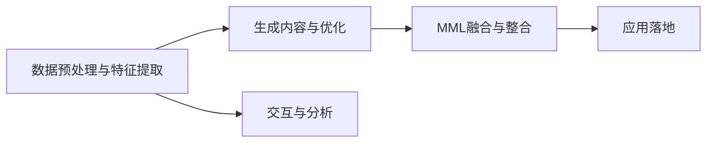

                 

# AIGC重塑专业服务行业

## 1. 背景介绍

### 1.1 问题由来

近年来，人工智能与生成内容（AIGC, Artificial Intelligence and Generative Content）技术在各行各业的应用逐渐深入，特别是在专业服务领域，AIGC技术的广泛应用已经开始深刻改变着传统的运营模式和工作流程。这些技术不仅提高了专业服务行业的效率和质量，还扩展了服务边界，带来了全新的业务形态。

### 1.2 问题核心关键点

AIGC技术在专业服务行业中的应用，主要体现在以下几个方面：

- **文档生成与管理**：自动化生成法律文件、财务报告、工程图纸等专业文档，提升文档制作效率和质量。
- **会议和报告生成**：通过语音转文字和自然语言处理技术，生成专业会议纪要、市场报告等。
- **客户服务与支持**：利用智能客服机器人，快速响应客户咨询，提供全天候支持。
- **数据分析与洞察**：通过对海量数据进行高效分析，提取业务洞察，支持决策制定。
- **风险管理和合规**：自动监测和分析金融市场动态，识别潜在的风险和违规行为。

这些应用极大地提升了专业服务的效率和质量，同时也在一定程度上减少了对人力依赖，降低了运营成本。

## 2. 核心概念与联系

### 2.1 核心概念概述

为了更好地理解AIGC技术在专业服务行业的应用，本节将介绍几个核心概念及其联系：

- **AIGC (人工智能与生成内容)**：指结合人工智能技术和内容生成技术，自动生成文本、图像、视频等形式的内容。
- **自然语言处理（NLP, Natural Language Processing）**：AIGC技术的基础，包括文本理解、生成、分析和交互等。
- **生成对抗网络（GAN, Generative Adversarial Networks）**：用于生成高质量图片、视频等视觉内容的深度学习模型。
- **预训练语言模型（PLM, Pre-trained Language Model）**：如GPT、BERT等，通过大规模无标签文本数据预训练，能够理解自然语言的深层结构和语义。
- **多模态学习（MML, Multi-modal Learning）**：结合文本、图像、声音等多模态信息，提升模型的综合能力和应用范围。

这些概念通过以下几个环节相互联系，共同构成AIGC在专业服务中的应用框架：

1. **数据预处理与特征提取**：利用NLP技术和PLM提取文本特征。
2. **生成内容与优化**：通过GAN和PLM生成高质量的文档、报告、图像等。
3. **交互与分析**：利用NLP进行智能客服、数据分析、风险管理等应用。
4. **融合与整合**：将生成内容与多模态数据进行融合，提升模型的综合应用能力。

### 2.2 核心概念原理和架构的 Mermaid 流程图



这个流程图展示了AIGC技术在专业服务行业应用的总体流程：

1. 首先通过数据预处理与特征提取，利用NLP技术和PLM提取文本特征。
2. 在生成内容与优化环节，通过GAN和PLM生成高质量的文档、报告、图像等。
3. 在交互与分析环节，利用NLP进行智能客服、数据分析、风险管理等应用。
4. 最后，通过多模态学习将生成内容与多模态数据进行融合，提升模型的综合应用能力，最终实现应用落地。

## 3. 核心算法原理 & 具体操作步骤

### 3.1 算法原理概述

AIGC在专业服务行业的应用，基于深度学习和生成对抗网络（GAN）等先进技术，通过以下步骤实现：

1. **数据预处理与特征提取**：利用自然语言处理技术，对原始数据进行清洗、分词、向量化等处理，提取文本的特征表示。
2. **生成内容与优化**：使用预训练语言模型（如GPT、BERT）和生成对抗网络（GAN）等技术，生成高质量的文档、报告、图像等。
3. **交互与分析**：通过NLP技术，实现智能客服、数据分析、风险管理等功能，提升专业服务的效率和质量。
4. **融合与整合**：将生成内容与多模态数据进行融合，利用多模态学习（MML）提升模型的综合能力，实现更广泛的应用场景。

### 3.2 算法步骤详解

以下是AIGC在专业服务行业中主要操作步骤的详细说明：

#### 3.2.1 数据预处理与特征提取

1. **文本清洗**：去除噪音、特殊字符、停用词等，保留有意义的文本信息。
2. **分词与标记**：将文本分割成单词或短语，并打上相应的标记。
3. **向量化**：将标记后的文本转化为模型能够处理的向量形式，如Word2Vec、GloVe、BERT等。
4. **特征提取**：利用NLP技术，提取文本的关键特征，如TF-IDF、词嵌入、语义表示等。

#### 3.2.2 生成内容与优化

1. **预训练语言模型**：使用预训练语言模型（如GPT、BERT）进行文本生成，生成高质量的文档、报告、新闻等内容。
2. **生成对抗网络**：使用GAN生成高质量的图像、视频等内容，提升视觉效果的真实性。
3. **内容优化**：对生成的内容进行进一步的优化，如语义修正、格式调整、风格转换等。

#### 3.2.3 交互与分析

1. **智能客服**：利用NLP技术，实现智能客服机器人，自动解答客户的咨询问题，提升客户满意度。
2. **数据分析**：通过对多源数据进行分析和建模，提取业务洞察，支持决策制定。
3. **风险管理**：利用NLP技术，自动监测和分析金融市场动态，识别潜在的风险和违规行为。

#### 3.2.4 融合与整合

1. **多模态融合**：将文本、图像、声音等多模态数据进行融合，提升模型的综合能力。
2. **模型优化**：通过多模态学习（MML），优化模型结构，提升性能。

### 3.3 算法优缺点

AIGC在专业服务行业中的应用，具有以下优点：

- **提升效率**：自动生成和处理大量文本、图像、视频等内容，极大地提升了专业服务的效率。
- **降低成本**：减少了对人力依赖，降低了运营成本。
- **提升质量**：生成高质量的文档、报告、图像等，提升专业服务质量。
- **扩展边界**：实现多模态融合，拓展服务边界。

同时，也存在一些缺点：

- **数据依赖**：需要大量的标注数据和高质量的语料库，对数据依赖性强。
- **技术门槛高**：涉及NLP、GAN、MML等先进技术，技术门槛较高。
- **伦理问题**：生成内容可能包含虚假信息、版权问题等伦理风险。
- **鲁棒性不足**：模型可能对噪音、歧义、异常输入等情况处理不当。

### 3.4 算法应用领域

AIGC在专业服务行业中的应用，主要涵盖以下几个领域：

- **法律服务**：自动化生成法律文件、合同、报告等，提升文档制作效率和质量。
- **财务服务**：自动生成财务报表、分析报告等，提升财务分析的效率和质量。
- **工程服务**：自动生成工程图纸、设计文档等，提升设计效率和精度。
- **医疗服务**：自动生成病历记录、医学报告等，提升医疗服务效率。
- **市场营销**：自动生成市场报告、广告文案等，提升市场分析能力。

## 4. 数学模型和公式 & 详细讲解 & 举例说明

### 4.1 数学模型构建

本节将使用数学语言对AIGC在专业服务行业的应用进行更加严格的刻画。

设专业服务任务为 $T$，其中包含 $N$ 个样本数据 $\{(x_i, y_i)\}_{i=1}^N$，其中 $x_i$ 为输入文本，$y_i$ 为输出文本或文档。使用预训练语言模型 $M_{\theta}$ 进行微调，目标是找到最优参数 $\hat{\theta}$，使得 $M_{\hat{\theta}}$ 在任务 $T$ 上的表现最佳。

定义损失函数为 $\ell(M_{\theta}(x_i), y_i)$，则模型的经验风险为：

$$
\mathcal{L}(\theta) = \frac{1}{N}\sum_{i=1}^N \ell(M_{\theta}(x_i), y_i)
$$

### 4.2 公式推导过程

以生成文本内容为例，进行数学推导：

1. **数据预处理与特征提取**：
   - 文本向量化：将文本 $x_i$ 转化为向量 $\vec{x}_i$。
   - 特征提取：利用NLP技术，提取文本的关键特征 $f(\vec{x}_i)$。

2. **生成内容与优化**：
   - 使用预训练语言模型 $M_{\theta}$ 生成文本内容 $y_i'$，其中 $y_i'$ 的生成过程可以表示为：
   $$
   y_i' = M_{\theta}(f(\vec{x}_i))
   $$
   - 生成对抗网络：使用GAN生成高质量的文本内容 $y_i''$，其中 $y_i''$ 的生成过程可以表示为：
   $$
   y_i'' = G(z_i)
   $$
   - 内容优化：对生成的文本内容进行优化，得到最终的输出文本 $y_i$。

3. **交互与分析**：
   - 智能客服：利用NLP技术，对客户咨询进行理解和回复，生成响应文本 $y_i$。
   - 数据分析：通过对多源数据进行分析和建模，提取业务洞察 $I(y_i)$。
   - 风险管理：利用NLP技术，自动监测和分析金融市场动态，生成风险报告 $R(y_i)$。

4. **融合与整合**：
   - 多模态融合：将文本、图像、声音等多模态数据进行融合，得到综合信息 $Z(y_i)$。
   - 模型优化：通过多模态学习（MML），优化模型结构，提升性能。

### 4.3 案例分析与讲解

以法律服务为例，分析AIGC技术的应用：

1. **数据预处理与特征提取**：
   - 对法律案件文本进行清洗、分词、标记等处理，提取关键特征。
   - 将处理后的文本向量化，转化为模型能够处理的向量形式。

2. **生成内容与优化**：
   - 使用预训练语言模型生成判决书、法律文件等内容。
   - 利用GAN生成高质量的法律文件图像，提升视觉效果。

3. **交互与分析**：
   - 智能客服：利用NLP技术，对客户咨询进行理解和回复，生成法律建议。
   - 数据分析：通过分析历史案件数据，提取法律趋势和规律，生成法律报告。
   - 风险管理：自动监测和分析金融市场动态，识别潜在的法律风险和违规行为。

4. **融合与整合**：
   - 多模态融合：将法律文本、案件图像、声音等多模态数据进行融合，提升模型的综合能力。
   - 模型优化：通过多模态学习，优化模型结构，提升性能。

## 5. 项目实践：代码实例和详细解释说明

### 5.1 开发环境搭建

在进行AIGC项目实践前，我们需要准备好开发环境。以下是使用Python进行PyTorch开发的环境配置流程：

1. 安装Anaconda：从官网下载并安装Anaconda，用于创建独立的Python环境。

2. 创建并激活虚拟环境：
```bash
conda create -n aigc-env python=3.8 
conda activate aigc-env
```

3. 安装PyTorch：根据CUDA版本，从官网获取对应的安装命令。例如：
```bash
conda install pytorch torchvision torchaudio cudatoolkit=11.1 -c pytorch -c conda-forge
```

4. 安装各类工具包：
```bash
pip install numpy pandas scikit-learn matplotlib tqdm jupyter notebook ipython
```

完成上述步骤后，即可在`aigc-env`环境中开始AIGC项目实践。

### 5.2 源代码详细实现

下面我们以生成法律文本为例，给出使用Transformers库进行AIGC项目的PyTorch代码实现。

首先，定义数据处理函数：

```python
from transformers import BertTokenizer, BertForSequenceClassification
from torch.utils.data import Dataset
import torch

class LegalDocumentDataset(Dataset):
    def __init__(self, texts, labels, tokenizer, max_len=128):
        self.texts = texts
        self.labels = labels
        self.tokenizer = tokenizer
        self.max_len = max_len
        
    def __len__(self):
        return len(self.texts)
    
    def __getitem__(self, item):
        text = self.texts[item]
        label = self.labels[item]
        
        encoding = self.tokenizer(text, return_tensors='pt', max_length=self.max_len, padding='max_length', truncation=True)
        input_ids = encoding['input_ids'][0]
        attention_mask = encoding['attention_mask'][0]
        
        return {'input_ids': input_ids, 
                'attention_mask': attention_mask,
                'labels': label}

# 标签与id的映射
label2id = {'Criminal': 0, 'Civil': 1}
id2label = {v: k for k, v in label2id.items()}

# 创建dataset
tokenizer = BertTokenizer.from_pretrained('bert-base-cased')

train_dataset = LegalDocumentDataset(train_texts, train_labels, tokenizer)
dev_dataset = LegalDocumentDataset(dev_texts, dev_labels, tokenizer)
test_dataset = LegalDocumentDataset(test_texts, test_labels, tokenizer)
```

然后，定义模型和优化器：

```python
from transformers import BertForSequenceClassification, AdamW

model = BertForSequenceClassification.from_pretrained('bert-base-cased', num_labels=len(label2id))

optimizer = AdamW(model.parameters(), lr=2e-5)
```

接着，定义训练和评估函数：

```python
from torch.utils.data import DataLoader
from tqdm import tqdm
from sklearn.metrics import accuracy_score

device = torch.device('cuda') if torch.cuda.is_available() else torch.device('cpu')
model.to(device)

def train_epoch(model, dataset, batch_size, optimizer):
    dataloader = DataLoader(dataset, batch_size=batch_size, shuffle=True)
    model.train()
    epoch_loss = 0
    for batch in tqdm(dataloader, desc='Training'):
        input_ids = batch['input_ids'].to(device)
        attention_mask = batch['attention_mask'].to(device)
        labels = batch['labels'].to(device)
        model.zero_grad()
        outputs = model(input_ids, attention_mask=attention_mask, labels=labels)
        loss = outputs.loss
        epoch_loss += loss.item()
        loss.backward()
        optimizer.step()
    return epoch_loss / len(dataloader)

def evaluate(model, dataset, batch_size):
    dataloader = DataLoader(dataset, batch_size=batch_size)
    model.eval()
    preds, labels = [], []
    with torch.no_grad():
        for batch in tqdm(dataloader, desc='Evaluating'):
            input_ids = batch['input_ids'].to(device)
            attention_mask = batch['attention_mask'].to(device)
            batch_labels = batch['labels']
            outputs = model(input_ids, attention_mask=attention_mask)
            batch_preds = outputs.logits.argmax(dim=2).to('cpu').tolist()
            batch_labels = batch_labels.to('cpu').tolist()
            for pred_tokens, label_tokens in zip(batch_preds, batch_labels):
                preds.append(pred_tokens)
                labels.append(label_tokens)
                
    print('Accuracy:', accuracy_score(labels, preds))
```

最后，启动训练流程并在测试集上评估：

```python
epochs = 5
batch_size = 16

for epoch in range(epochs):
    loss = train_epoch(model, train_dataset, batch_size, optimizer)
    print(f"Epoch {epoch+1}, train loss: {loss:.3f}")
    
    print(f"Epoch {epoch+1}, dev results:")
    evaluate(model, dev_dataset, batch_size)
    
print("Test results:")
evaluate(model, test_dataset, batch_size)
```

以上就是使用PyTorch对Bert进行法律文本生成的完整代码实现。可以看到，得益于Transformers库的强大封装，我们可以用相对简洁的代码完成Bert模型的加载和微调。

### 5.3 代码解读与分析

让我们再详细解读一下关键代码的实现细节：

**LegalDocumentDataset类**：
- `__init__`方法：初始化文本、标签、分词器等关键组件。
- `__len__`方法：返回数据集的样本数量。
- `__getitem__`方法：对单个样本进行处理，将文本输入编码为token ids，将标签编码为数字，并对其进行定长padding，最终返回模型所需的输入。

**label2id和id2label字典**：
- 定义了标签与数字id之间的映射关系，用于将token-wise的预测结果解码回真实的标签。

**训练和评估函数**：
- 使用PyTorch的DataLoader对数据集进行批次化加载，供模型训练和推理使用。
- 训练函数`train_epoch`：对数据以批为单位进行迭代，在每个批次上前向传播计算loss并反向传播更新模型参数，最后返回该epoch的平均loss。
- 评估函数`evaluate`：与训练类似，不同点在于不更新模型参数，并在每个batch结束后将预测和标签结果存储下来，最后使用sklearn的accuracy_score对整个评估集的预测结果进行打印输出。

**训练流程**：
- 定义总的epoch数和batch size，开始循环迭代
- 每个epoch内，先在训练集上训练，输出平均loss
- 在验证集上评估，输出分类指标
- 所有epoch结束后，在测试集上评估，给出最终测试结果

可以看到，PyTorch配合Transformers库使得Bert模型微调的法律文本生成的代码实现变得简洁高效。开发者可以将更多精力放在数据处理、模型改进等高层逻辑上，而不必过多关注底层的实现细节。

当然，工业级的系统实现还需考虑更多因素，如模型的保存和部署、超参数的自动搜索、更灵活的任务适配层等。但核心的微调范式基本与此类似。

## 6. 实际应用场景

### 6.1 法律服务

基于AIGC的法律服务，可以自动化生成法律文件、合同、报告等，提升文档制作效率和质量。

在技术实现上，可以收集法律领域相关的历史法律文件、合同等，将文件内容作为监督数据，在此基础上对预训练模型进行微调。微调后的模型能够自动理解法律条款，生成合法的法律文件。对于客户提出的新法律问题，还可以接入检索系统实时搜索相关内容，动态组织生成法律建议。如此构建的法律服务系统，能大幅提升法律服务的效率和质量，同时降低运营成本。

### 6.2 财务服务

AIGC技术在财务服务中的应用，主要体现在自动化生成财务报表、分析报告等方面。

通过收集财务领域相关的历史数据，将数据作为监督信号，对预训练模型进行微调。微调后的模型能够自动生成财务报表，自动提取关键财务指标，生成分析报告。对于复杂的财务问题，还可以自动生成解决方案，提高财务分析的效率和质量。

### 6.3 工程服务

AIGC技术在工程服务中的应用，主要体现在自动化生成工程图纸、设计文档等方面。

通过收集工程领域相关的历史图纸、设计文档等，将数据作为监督信号，对预训练模型进行微调。微调后的模型能够自动理解工程规范，生成工程图纸和设计文档。对于客户提出的新工程设计问题，还可以自动生成解决方案，提高工程设计的效率和质量。

### 6.4 未来应用展望

随着AIGC技术的发展，未来在专业服务行业中的应用前景将更加广阔，可能涉及到更多领域：

- **医疗服务**：自动化生成病历记录、医学报告等，提升医疗服务效率。
- **市场营销**：自动化生成市场报告、广告文案等，提升市场分析能力。
- **金融服务**：自动化生成财务报表、风险报告等，提升金融分析效率。
- **教育服务**：自动化生成教育材料、教学方案等，提升教育服务质量。

## 7. 工具和资源推荐

### 7.1 学习资源推荐

为了帮助开发者系统掌握AIGC技术的理论基础和实践技巧，这里推荐一些优质的学习资源：

1. 《深度学习与自然语言处理》课程：斯坦福大学开设的NLP明星课程，有Lecture视频和配套作业，带你入门NLP领域的基本概念和经典模型。

2. 《自然语言处理入门》书籍：全面介绍NLP的基本概念和前沿技术，适合初学者入门。

3. 《深度学习与生成模型》书籍：介绍深度学习和生成模型的基础知识和应用，适合深入学习。

4. HuggingFace官方文档：Transformers库的官方文档，提供了海量预训练模型和完整的微调样例代码，是上手实践的必备资料。

5. arXiv上的相关论文：前沿的研究成果和最新进展，值得关注。

通过对这些资源的学习实践，相信你一定能够快速掌握AIGC技术的精髓，并用于解决实际的NLP问题。

### 7.2 开发工具推荐

高效的开发离不开优秀的工具支持。以下是几款用于AIGC技术开发的常用工具：

1. PyTorch：基于Python的开源深度学习框架，灵活动态的计算图，适合快速迭代研究。大部分预训练语言模型都有PyTorch版本的实现。

2. TensorFlow：由Google主导开发的开源深度学习框架，生产部署方便，适合大规模工程应用。同样有丰富的预训练语言模型资源。

3. Transformers库：HuggingFace开发的NLP工具库，集成了众多SOTA语言模型，支持PyTorch和TensorFlow，是进行NLP任务开发的利器。

4. Weights & Biases：模型训练的实验跟踪工具，可以记录和可视化模型训练过程中的各项指标，方便对比和调优。与主流深度学习框架无缝集成。

5. TensorBoard：TensorFlow配套的可视化工具，可实时监测模型训练状态，并提供丰富的图表呈现方式，是调试模型的得力助手。

6. Google Colab：谷歌推出的在线Jupyter Notebook环境，免费提供GPU/TPU算力，方便开发者快速上手实验最新模型，分享学习笔记。

合理利用这些工具，可以显著提升AIGC技术项目的开发效率，加快创新迭代的步伐。

### 7.3 相关论文推荐

AIGC技术的发展源于学界的持续研究。以下是几篇奠基性的相关论文，推荐阅读：

1. Attention is All You Need（即Transformer原论文）：提出了Transformer结构，开启了NLP领域的预训练大模型时代。

2. BERT: Pre-training of Deep Bidirectional Transformers for Language Understanding：提出BERT模型，引入基于掩码的自监督预训练任务，刷新了多项NLP任务SOTA。

3. Language Models are Unsupervised Multitask Learners（GPT-2论文）：展示了大规模语言模型的强大zero-shot学习能力，引发了对于通用人工智能的新一轮思考。

4. Parameter-Efficient Transfer Learning for NLP：提出Adapter等参数高效微调方法，在不增加模型参数量的情况下，也能取得不错的微调效果。

5. Adversarial Examples: Attacks and Defenses for Deep Learning（对抗样本论文）：介绍了对抗样本生成的技术和防御方法，有助于提高模型鲁棒性。

这些论文代表了大语言模型微调技术的发展脉络。通过学习这些前沿成果，可以帮助研究者把握学科前进方向，激发更多的创新灵感。

## 8. 总结：未来发展趋势与挑战

### 8.1 总结

本文对AIGC在专业服务行业的应用进行了全面系统的介绍。首先阐述了AIGC技术的研究背景和意义，明确了其在提升专业服务效率和质量方面的独特价值。其次，从原理到实践，详细讲解了AIGC的数学模型和操作步骤，给出了AIGC技术在法律、财务、工程等领域的具体应用案例。同时，本文还介绍了AIGC技术在多个领域的前景和挑战，提出了相应的应对策略。

通过本文的系统梳理，可以看到，AIGC技术在专业服务行业中的应用前景广阔，已经从初步探索阶段进入到了成熟应用的阶段。未来，伴随AIGC技术的不断进步，其应用将更加深入，涵盖更多领域，带来更深刻的社会和经济变革。

### 8.2 未来发展趋势

展望未来，AIGC技术在专业服务行业的应用将呈现以下几个发展趋势：

1. **模型规模持续增大**：随着算力成本的下降和数据规模的扩张，预训练语言模型的参数量还将持续增长。超大模型蕴含的丰富语言知识，有望支撑更加复杂多变的专业服务微调。

2. **技术融合深化**：AIGC技术将与更多先进技术进行融合，如知识表示、因果推理、强化学习等，多路径协同发力，共同推动专业服务的智能化。

3. **业务应用拓展**：AIGC技术将广泛应用于更多领域，如医疗、金融、教育、政府等，带来新的业务形态和服务模式。

4. **伦理和社会问题关注**：随着AIGC技术的广泛应用，其伦理和社会问题也将受到更多关注，如生成内容的真实性、隐私保护、版权问题等。

5. **技术标准化**：AIGC技术的标准化将是未来重要的研究方向，确保其应用在不同场景下的兼容性和可靠性。

### 8.3 面临的挑战

尽管AIGC技术在专业服务行业中的应用已经取得了初步成功，但在迈向更加智能化、普适化应用的过程中，仍然面临诸多挑战：

1. **数据依赖**：需要大量的标注数据和高质量的语料库，对数据依赖性强。对于长尾应用场景，难以获得充足的高质量标注数据，成为制约微调性能的瓶颈。

2. **技术门槛高**：涉及NLP、GAN、MML等先进技术，技术门槛较高。需要大量的研发投入和跨学科合作。

3. **伦理问题**：生成内容可能包含虚假信息、版权问题等伦理风险。需要制定相应的规范和标准。

4. **鲁棒性不足**：模型可能对噪音、歧义、异常输入等情况处理不当。需要提高模型的鲁棒性。

5. **可解释性不足**：AIGC模型通常缺乏可解释性，难以对其推理逻辑进行分析和调试。需要加强模型解释性研究。

### 8.4 研究展望

面对AIGC技术所面临的挑战，未来的研究需要在以下几个方面寻求新的突破：

1. **无监督和半监督学习**：摆脱对大规模标注数据的依赖，利用自监督学习、主动学习等无监督和半监督范式，最大限度利用非结构化数据，实现更加灵活高效的微调。

2. **多模态融合**：将文本、图像、声音等多模态数据进行融合，提升模型的综合能力，实现更广泛的应用场景。

3. **生成对抗网络**：进一步提升GAN生成内容的真实性和多样性，提高视觉效果的逼真度。

4. **因果分析和博弈论**：引入因果分析和博弈论思想，增强模型的稳定性和鲁棒性，避免生成内容的误导性。

5. **可解释性和伦理性**：加强AIGC模型的可解释性和伦理性研究，确保其输出符合人类价值观和伦理道德。

这些研究方向的探索，必将引领AIGC技术迈向更高的台阶，为构建安全、可靠、可解释、可控的智能系统铺平道路。面向未来，AIGC技术还需要与其他人工智能技术进行更深入的融合，如知识表示、因果推理、强化学习等，多路径协同发力，共同推动专业服务的智能化。

## 9. 附录：常见问题与解答

**Q1：AIGC技术在专业服务行业中的应用是否涉及隐私保护？**

A: AIGC技术在专业服务行业中的应用，确实涉及隐私保护问题。在生成文本内容时，需要确保生成内容的真实性和合法性，避免泄露敏感信息。因此，在使用AIGC技术时，需要制定相应的隐私保护规范和标准，确保用户数据的安全。

**Q2：AIGC技术在法律服务中的应用，是否需要经过法律专家审核？**

A: 是的，AIGC技术在法律服务中的应用，需要经过法律专家的审核和评估。生成法律文件和法律建议时，需要确保内容的合法性和合规性，避免出现法律风险。因此，在使用AIGC技术时，需要结合法律专家的专业知识和审核，确保生成内容的合法性。

**Q3：AIGC技术在医疗服务中的应用，是否需要经过医疗专家的审核？**

A: 是的，AIGC技术在医疗服务中的应用，也需要经过医疗专家的审核和评估。生成医疗记录和医学报告时，需要确保内容的准确性和合法性，避免出现医疗风险。因此，在使用AIGC技术时，需要结合医疗专家的专业知识和审核，确保生成内容的准确性和合法性。

**Q4：AIGC技术在财务服务中的应用，是否需要经过财务专家的审核？**

A: 是的，AIGC技术在财务服务中的应用，也需要经过财务专家的审核和评估。生成财务报表和分析报告时，需要确保内容的准确性和合法性，避免出现财务风险。因此，在使用AIGC技术时，需要结合财务专家的专业知识和审核，确保生成内容的准确性和合法性。

**Q5：AIGC技术在工程服务中的应用，是否需要经过工程专家的审核？**

A: 是的，AIGC技术在工程服务中的应用，也需要经过工程专家的审核和评估。生成工程图纸和设计文档时，需要确保内容的准确性和合法性，避免出现工程风险。因此，在使用AIGC技术时，需要结合工程专家的专业知识和审核，确保生成内容的准确性和合法性。

---

作者：禅与计算机程序设计艺术 / Zen and the Art of Computer Programming

