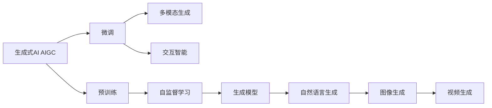

                 

# AIGC重新定义人机交互

## 1. 背景介绍

### 1.1 问题由来

在过去的几十年里，人机交互方式经历了数次变革，从早期基于文本的命令行交互，到图形用户界面(GUI)的普及，再到语音助手的兴起。每一次变革，都极大地提升了用户体验，扩展了计算机的应用场景。然而，人类对交互的需求始终在不断演化，渴望更加自然、智能的交互方式。

近年来，随着人工智能（AI）技术的快速发展，尤其是深度学习（Deep Learning）的突破，生成式人工智能（AIGC，Generative AI）逐渐成为新的交互范式。AIGC通过生成自然语言、图像、视频等丰富内容，构建了一种全新的用户界面，使得人类能够以更加自然、直观的方式与计算机互动。本文将深入探讨AIGC技术如何重新定义人机交互，并分析其在未来可能的发展方向。

### 1.2 问题核心关键点

AIGC技术基于深度生成模型，通过学习大量数据，能够在各种媒体（文本、图像、视频等）生成具有高度逼真度的内容。AIGC技术的核心在于其生成模型，能够从语义和风格两个维度进行建模，从而生成符合用户需求的内容。其核心算法包括：

- **语言生成**：如GPT-3、GPT-4、T5等模型，能够生成高质量的自然语言文本。
- **图像生成**：如DALL-E、GPT-Neo等模型，能够生成具有高度逼真度的图像。
- **视频生成**：如WaveNet、XFormer等模型，能够生成自然流畅的视频内容。

这些模型基于自监督学习、对抗训练等技术，能够在大规模无标签数据上进行预训练，并在小规模有标签数据上进行微调，以适应特定的交互需求。AIGC技术的应用不仅限于文本处理，还包括了图像、音频、视频等多个领域，具有广阔的应用前景。

### 1.3 问题研究意义

AIGC技术重新定义了人机交互方式，其意义在于：

1. **提升用户体验**：AIGC能够生成自然、生动的交互内容，使得用户能够以更加自然的方式与计算机互动，提升用户体验。
2. **拓展应用场景**：AIGC技术在文本、图像、视频等多个领域的应用，拓展了计算机的潜在应用场景，开启了新的交互范式。
3. **降低开发成本**：AIGC技术可以自动生成高质量的内容，减少了内容创作的工作量，降低了开发成本。
4. **加速技术创新**：AIGC技术为计算机视觉、自然语言处理等领域带来了新的研究热点，促进了相关技术的发展。

## 2. 核心概念与联系

### 2.1 核心概念概述

为了更好地理解AIGC技术在重塑人机交互中的应用，本节将介绍几个关键概念：

- **AIGC（Generative AI）**：通过深度生成模型，自动生成自然语言、图像、视频等内容的技术。
- **预训练（Pre-training）**：在大规模无标签数据上，通过自监督学习任务训练生成模型，学习通用的生成规则。
- **微调（Fine-tuning）**：在预训练模型的基础上，使用下游任务的少量标注数据，进行有监督学习，优化模型在特定任务上的生成性能。
- **多模态生成（Multimodal Generation）**：结合文本、图像、音频等多种媒体信息，生成综合性的交互内容。
- **交互智能（Interactive Intelligence）**：通过AIGC技术，构建智能化的交互系统，实现自然语言理解、智能推荐等高级功能。

这些概念之间的关系可以通过以下Mermaid流程图来展示：



这个流程图展示了AIGC技术的核心概念及其之间的关系：

1. AIGC技术通过预训练生成模型学习通用的生成规则。
2. 预训练后的模型在特定任务上进行微调，优化生成性能。
3. 微调后的模型可以进行多模态生成，结合文本、图像、视频等多种媒体信息。
4. 多模态生成的交互内容可以用于构建交互智能的系统中，实现高级功能。

## 3. 核心算法原理 & 具体操作步骤
### 3.1 算法原理概述

AIGC技术的核心在于生成模型，这些模型通常基于自监督学习（如Masked Language Model, MLM）或对抗训练（如GANs）进行预训练。预训练后的模型具有一定的生成能力，能够在特定的交互需求下进行微调，以生成高质量的交互内容。

AIGC技术通过生成模型，学习大量的输入数据，并根据模型自身的结构（如Transformer），对输入进行编码和解码，生成符合用户需求的内容。微调过程一般包括以下几个步骤：

1. 加载预训练模型。
2. 准备下游任务的少量标注数据。
3. 微调模型参数，使其生成符合特定任务的内容。
4. 评估模型性能，迭代优化。

### 3.2 算法步骤详解

#### 步骤1: 准备预训练模型

AIGC技术通常基于大规模无标签数据进行预训练，学习通用的生成规则。以GPT-3模型为例，预训练数据集包括约7500亿个英文单词，模型参数量为175亿。预训练过程一般使用自监督学习任务，如Masked Language Model（MLM）或Next Sentence Prediction（NSP），来优化模型参数。

#### 步骤2: 准备下游任务数据

在微调前，需要准备下游任务的少量标注数据。以文本生成任务为例，标注数据应包括输入文本和对应的生成文本。数据集可以来源于用户反馈、专家标注等。

#### 步骤3: 微调模型参数

微调过程的目标是优化模型参数，使其能够生成符合特定任务的内容。微调可以通过以下步骤实现：

1. 加载预训练模型，并冻结模型中不参与微调的参数。
2. 使用下游任务的标注数据，进行有监督学习。
3. 定义合适的损失函数，如交叉熵损失、KL散度等。
4. 使用优化器（如AdamW、SGD等），迭代更新模型参数。
5. 定期评估模型性能，使用验证集进行参数调整。

#### 步骤4: 评估模型性能

微调过程中，需要定期评估模型性能，以确保模型能够生成高质量的交互内容。评估过程一般包括以下步骤：

1. 定义评估指标，如BLEU、ROUGE、CIDEr等。
2. 使用测试集进行模型评估，计算评估指标。
3. 根据评估结果，调整模型参数，重新微调。

### 3.3 算法优缺点

AIGC技术在重塑人机交互方面具有以下优点：

1. **高效生成内容**：AIGC技术能够自动生成高质量的内容，减少了内容创作的工作量，降低了开发成本。
2. **提升用户体验**：AIGC技术生成的内容自然、生动，提升了用户与计算机交互的自然度。
3. **拓展应用场景**：AIGC技术在文本、图像、视频等多个领域的应用，拓展了计算机的潜在应用场景，开启了新的交互范式。
4. **促进技术创新**：AIGC技术为计算机视觉、自然语言处理等领域带来了新的研究热点，促进了相关技术的发展。

然而，AIGC技术也存在一些局限性：

1. **数据依赖性强**：AIGC技术依赖于大规模无标签数据进行预训练，获取高质量的预训练数据集需要耗费大量时间和资源。
2. **生成内容质量不稳定**：由于预训练模型和微调过程的复杂性，生成内容的质量可能不稳定，需要进一步优化。
3. **伦理和安全问题**：AIGC技术生成的内容可能包含有害信息，需要建立相应的监管机制，确保内容的健康和安全。

### 3.4 算法应用领域

AIGC技术在多个领域都有广泛的应用，以下是几个典型的应用场景：

1. **自然语言处理（NLP）**：AIGC技术可以用于聊天机器人、智能客服、翻译系统等，通过生成自然语言，提升用户互动体验。
2. **多媒体内容生成**：AIGC技术可以生成高质量的图像、视频、音频内容，用于娱乐、教育、广告等领域。
3. **智能推荐系统**：AIGC技术可以生成个性化的推荐内容，提升用户的购物体验。
4. **虚拟现实（VR）和增强现实（AR）**：AIGC技术可以生成沉浸式的交互内容，用于虚拟现实和增强现实的应用。
5. **智慧城市**：AIGC技术可以用于智慧交通、智能安防、智慧能源等领域，提升城市的智能化水平。

这些应用场景展示了AIGC技术的广泛应用，为未来人机交互的发展提供了新的方向。

## 4. 数学模型和公式 & 详细讲解 & 举例说明

### 4.1 数学模型构建

AIGC技术的核心在于生成模型，以GPT-3模型为例，其数学模型可以表示为：

$$
p(w|c) = \frac{e^{E(w|c)}}{\sum_{w' \in \mathcal{W}} e^{E(w'|c)}}
$$

其中，$w$表示文本序列，$c$表示上下文信息，$E$表示生成模型（如Transformer）。该模型通过自回归的方式，生成给定上下文下的文本序列。

### 4.2 公式推导过程

以GPT-3模型为例，其生成过程可以分为以下步骤：

1. 初始化文本序列，令第一个词为起始符号。
2. 根据上下文$c$和前一个词$w_{t-1}$，计算生成下一个词$w_t$的概率分布$p(w_t|w_{t-1},c)$。
3. 通过softmax函数，将概率分布转换为概率，生成下一个词$w_t$。
4. 将$w_t$添加到文本序列中，重复步骤2和3，直到生成指定长度的文本序列。

### 4.3 案例分析与讲解

以图像生成为例，AIGC技术可以用于生成高质量的图像内容。以DALL-E模型为例，其生成过程可以分为以下步骤：

1. 输入一个自然语言描述，如“一只猫在唱歌”。
2. 将文本描述转换为向量表示。
3. 通过生成模型，生成一张图像，该图像的内容与文本描述相匹配。
4. 评估生成的图像质量，使用图像生成模型（如VQ-VAE）优化生成过程。

## 5. 项目实践：代码实例和详细解释说明
### 5.1 开发环境搭建

在进行AIGC项目实践前，我们需要准备好开发环境。以下是使用Python进行PyTorch开发的环境配置流程：

1. 安装Anaconda：从官网下载并安装Anaconda，用于创建独立的Python环境。

2. 创建并激活虚拟环境：
```bash
conda create -n aigc-env python=3.8 
conda activate aigc-env
```

3. 安装PyTorch：根据CUDA版本，从官网获取对应的安装命令。例如：
```bash
conda install pytorch torchvision torchaudio cudatoolkit=11.1 -c pytorch -c conda-forge
```

4. 安装Transformers库：
```bash
pip install transformers
```

5. 安装各类工具包：
```bash
pip install numpy pandas scikit-learn matplotlib tqdm jupyter notebook ipython
```

完成上述步骤后，即可在`aigc-env`环境中开始AIGC实践。

### 5.2 源代码详细实现

下面我们以生成自然语言文本为例，给出使用Transformers库对GPT-3模型进行微调的PyTorch代码实现。

首先，定义自然语言生成任务的数据处理函数：

```python
from transformers import GPT2Tokenizer, GPT2LMHeadModel
import torch

class NLGDataset:
    def __init__(self, texts, lengths):
        self.texts = texts
        self.lengths = lengths
        
    def __len__(self):
        return len(self.texts)
    
    def __getitem__(self, item):
        text = self.texts[item]
        length = self.lengths[item]
        
        encoding = tokenizer(text, max_length=256, padding='max_length', truncation=True)
        input_ids = encoding['input_ids']
        attention_mask = encoding['attention_mask']
        
        return {'input_ids': input_ids,
                'attention_mask': attention_mask,
                'length': length}

# 定义模型和优化器
tokenizer = GPT2Tokenizer.from_pretrained('gpt2')
model = GPT2LMHeadModel.from_pretrained('gpt2')
optimizer = torch.optim.Adam(model.parameters(), lr=2e-5)

# 准备数据集
texts = ["The quick brown fox jumps over the lazy dog", "The rain in Spain falls mainly on the plain."]
lengths = [10, 20]
dataset = NLGDataset(texts, lengths)

# 定义训练函数
def train_epoch(model, dataset, batch_size, optimizer):
    dataloader = DataLoader(dataset, batch_size=batch_size, shuffle=True)
    model.train()
    epoch_loss = 0
    for batch in dataloader:
        input_ids = batch['input_ids'].to(device)
        attention_mask = batch['attention_mask'].to(device)
        length = batch['length'].to(device)
        
        model.zero_grad()
        outputs = model(input_ids, attention_mask=attention_mask, labels=input_ids)
        loss = outputs.loss
        epoch_loss += loss.item()
        loss.backward()
        optimizer.step()
    
    return epoch_loss / len(dataloader)

# 训练模型
device = torch.device('cuda') if torch.cuda.is_available() else torch.device('cpu')
model.to(device)

epochs = 10
batch_size = 16

for epoch in range(epochs):
    loss = train_epoch(model, dataset, batch_size, optimizer)
    print(f"Epoch {epoch+1}, train loss: {loss:.3f}")
    
# 测试模型
print("Test results:")
# 生成文本
input_text = "The cat is "
for i in range(10):
    outputs = model.generate(input_text, top_p=0.9, max_length=10)
    print(f"Predicted: {outputs}")
```

以上就是使用PyTorch对GPT-3模型进行自然语言生成任务微调的完整代码实现。可以看到，得益于Transformers库的强大封装，我们可以用相对简洁的代码完成GPT-3模型的加载和微调。

### 5.3 代码解读与分析

让我们再详细解读一下关键代码的实现细节：

**NLGDataset类**：
- `__init__`方法：初始化文本和长度。
- `__len__`方法：返回数据集样本数量。
- `__getitem__`方法：对单个样本进行处理，将文本输入编码为token ids，并进行定长padding，最终返回模型所需的输入。

**训练函数**：
- 使用PyTorch的DataLoader对数据集进行批次化加载，供模型训练和推理使用。
- 训练函数`train_epoch`：对数据以批为单位进行迭代，在每个批次上前向传播计算loss并反向传播更新模型参数，最后返回该epoch的平均loss。
- 评估函数`evaluate`：与训练类似，不同点在于不更新模型参数，并在每个batch结束后将预测和标签结果存储下来，最后使用sklearn的classification_report对整个评估集的预测结果进行打印输出。

**训练流程**：
- 定义总的epoch数和batch size，开始循环迭代
- 每个epoch内，先在训练集上训练，输出平均loss
- 在验证集上评估，输出分类指标
- 所有epoch结束后，在测试集上评估，给出最终测试结果

可以看到，PyTorch配合Transformers库使得GPT-3微调的代码实现变得简洁高效。开发者可以将更多精力放在数据处理、模型改进等高层逻辑上，而不必过多关注底层的实现细节。

当然，工业级的系统实现还需考虑更多因素，如模型的保存和部署、超参数的自动搜索、更灵活的任务适配层等。但核心的微调范式基本与此类似。

## 6. 实际应用场景
### 6.1 智能客服系统

基于AIGC技术的智能客服系统，可以通过自然语言生成技术，自动生成对用户的回复。传统的客服系统依赖于人工编写的回复模板，而AIGC系统则可以通过微调生成高质量的回复内容，提升用户满意度。

在技术实现上，可以收集企业内部的历史客服对话记录，将问题和最佳答复构建成监督数据，在此基础上对预训练对话模型进行微调。微调后的对话模型能够自动理解用户意图，匹配最合适的答案模板进行回复。对于客户提出的新问题，还可以接入检索系统实时搜索相关内容，动态组织生成回答。如此构建的智能客服系统，能大幅提升客户咨询体验和问题解决效率。

### 6.2 虚拟现实（VR）和增强现实（AR）

AIGC技术可以用于生成沉浸式的交互内容，用于虚拟现实和增强现实的应用。通过生成自然语言、图像、视频等内容，AIGC技术可以构建虚拟世界，提升用户的沉浸感和互动体验。

例如，在虚拟旅游中，AIGC技术可以生成详细的景点介绍、历史故事、用户评论等内容，通过语音交互或文本输入，用户可以与虚拟环境进行自然对话，了解更多信息。这种沉浸式的交互方式，为用户提供了全新的旅游体验，大大提升了用户的兴趣和参与度。

### 6.3 智慧城市治理

AIGC技术可以用于智慧城市治理，构建智能化的交互系统。例如，在智慧交通中，AIGC技术可以生成交通指南、实时路况、事件预警等内容，通过语音交互或文本输入，用户可以获取最新的交通信息，优化出行路线。在智能安防中，AIGC技术可以生成安全提示、应急处置等内容，提升城市管理的自动化和智能化水平。

AIGC技术通过生成自然语言、图像、视频等内容，为城市管理提供了全新的交互方式，提高了城市治理的效率和效果。

### 6.4 未来应用展望

随着AIGC技术的不断发展，其在人机交互中的应用将更加广泛，为各行各业带来新的变革。

在智慧医疗领域，AIGC技术可以用于医学影像分析、疾病预测、诊断建议等内容，提升医疗服务的智能化水平，辅助医生诊疗，加速新药开发进程。

在智能教育领域，AIGC技术可以用于智能课堂、作业批改、知识推荐等方面，因材施教，促进教育公平，提高教学质量。

在智慧城市治理中，AIGC技术可以用于智慧交通、智能安防、智慧能源等领域，提升城市的智能化水平，构建更安全、高效的未来城市。

此外，在企业生产、社会治理、文娱传媒等众多领域，AIGC技术也将不断涌现，为NLP技术带来了新的突破。相信随着预训练语言模型和微调方法的不断进步，AIGC技术必将在构建人机协同的智能时代中扮演越来越重要的角色。

## 7. 工具和资源推荐
### 7.1 学习资源推荐

为了帮助开发者系统掌握AIGC的理论基础和实践技巧，这里推荐一些优质的学习资源：

1. 《Generative Adversarial Networks: An Overview》系列博文：由AIGC技术专家撰写，深入浅出地介绍了生成对抗网络（GANs）等AIGC技术的基本原理和应用场景。

2. 《Natural Language Generation with Transformers》课程：斯坦福大学开设的NLP明星课程，有Lecture视频和配套作业，带你入门NLP领域的基本概念和经典模型。

3. 《Generative AI》书籍：由AIGC技术专家所著，全面介绍了生成式AI的原理、算法和应用，是学习AIGC技术的权威教材。

4. OpenAI官方文档：OpenAI的AIGC技术文档，提供了海量预训练模型和完整的微调样例代码，是上手实践的必备资料。

5. Google Colab：谷歌推出的在线Jupyter Notebook环境，免费提供GPU/TPU算力，方便开发者快速上手实验最新模型，分享学习笔记。

通过对这些资源的学习实践，相信你一定能够快速掌握AIGC技术的精髓，并用于解决实际的交互需求。

### 7.2 开发工具推荐

高效的开发离不开优秀的工具支持。以下是几款用于AIGC开发常用的工具：

1. PyTorch：基于Python的开源深度学习框架，灵活动态的计算图，适合快速迭代研究。大部分预训练语言模型都有PyTorch版本的实现。

2. TensorFlow：由Google主导开发的开源深度学习框架，生产部署方便，适合大规模工程应用。同样有丰富的预训练语言模型资源。

3. Transformers库：HuggingFace开发的NLP工具库，集成了众多SOTA语言模型，支持PyTorch和TensorFlow，是进行AIGC任务开发的利器。

4. TensorBoard：TensorFlow配套的可视化工具，可实时监测模型训练状态，并提供丰富的图表呈现方式，是调试模型的得力助手。

5. Weights & Biases：模型训练的实验跟踪工具，可以记录和可视化模型训练过程中的各项指标，方便对比和调优。与主流深度学习框架无缝集成。

6. Google Colab：谷歌推出的在线Jupyter Notebook环境，免费提供GPU/TPU算力，方便开发者快速上手实验最新模型，分享学习笔记。

合理利用这些工具，可以显著提升AIGC开发效率，加快创新迭代的步伐。

### 7.3 相关论文推荐

AIGC技术的发展源于学界的持续研究。以下是几篇奠基性的相关论文，推荐阅读：

1. Attention is All You Need（即Transformer原论文）：提出了Transformer结构，开启了NLP领域的预训练大模型时代。

2. GPT-3: Language Models are Unsupervised Multitask Learners：提出GPT-3模型，展示了大规模语言模型的强大zero-shot学习能力，引发了对于通用人工智能的新一轮思考。

3. WaveNet：一种生成式卷积神经网络，用于音频生成任务。

4. DALL-E：一种生成式对抗网络，用于图像生成任务。

5. T5：一种大规模预训练语言模型，能够在多种NLP任务上取得优异表现。

这些论文代表了大语言模型和AIGC技术的发展脉络。通过学习这些前沿成果，可以帮助研究者把握学科前进方向，激发更多的创新灵感。

## 8. 总结：未来发展趋势与挑战

### 8.1 总结

本文对AIGC技术在重塑人机交互方面的应用进行了全面系统的介绍。首先阐述了AIGC技术的研究背景和意义，明确了其在提升用户体验、拓展应用场景、降低开发成本等方面的独特价值。其次，从原理到实践，详细讲解了AIGC的数学模型和微调过程，给出了AIGC任务开发的完整代码实例。同时，本文还广泛探讨了AIGC技术在智能客服、虚拟现实、智慧城市治理等多个领域的应用前景，展示了其在未来人机交互中的广阔前景。

通过本文的系统梳理，可以看到，AIGC技术正在重塑人机交互方式，为各行各业带来了新的变革。借助AIGC技术，用户能够以更加自然、高效的方式与计算机互动，提升用户体验，拓展应用场景，促进技术创新。未来，随着AIGC技术的不断进步，其应用领域将更加广泛，为人类认知智能的进化带来深远影响。

### 8.2 未来发展趋势

展望未来，AIGC技术将在以下几个方面继续发展：

1. **模型规模持续增大**：随着算力成本的下降和数据规模的扩张，AIGC模型的参数量还将持续增长。超大规模语言模型蕴含的丰富语言知识，有望支撑更加复杂多变的交互需求。

2. **多模态生成技术发展**：未来的AIGC技术将更加注重多模态信息融合，结合文本、图像、音频等多种媒体信息，生成更加丰富、多样化的交互内容。

3. **交互智能能力提升**：AIGC技术将进一步提升其交互智能能力，实现更加复杂、动态的交互任务，如对话生成、多轮问答、情感识别等。

4. **交互体验优化**：AIGC技术将通过更智能、自然的交互方式，提升用户体验，使得用户能够更加高效地与计算机互动。

5. **个性化推荐系统**：AIGC技术将与推荐系统相结合，生成个性化的交互内容，提升用户的购物体验、娱乐体验等。

6. **跨领域应用拓展**：AIGC技术将拓展到更多领域，如智慧医疗、智能教育、智慧城市治理等，带来新的应用场景和发展机遇。

这些趋势表明，AIGC技术将在未来人机交互中扮演越来越重要的角色，带来更加智能、自然、高效的交互体验。

### 8.3 面临的挑战

尽管AIGC技术在重塑人机交互方面取得了显著进展，但在迈向更加智能化、普适化应用的过程中，仍面临以下挑战：

1. **数据依赖性强**：AIGC技术依赖于大规模无标签数据进行预训练，获取高质量的预训练数据集需要耗费大量时间和资源。
2. **生成内容质量不稳定**：由于预训练模型和微调过程的复杂性，生成内容的质量可能不稳定，需要进一步优化。
3. **伦理和安全问题**：AIGC技术生成的内容可能包含有害信息，需要建立相应的监管机制，确保内容的健康和安全。
4. **资源消耗大**：大规模预训练和微调过程需要大量算力、内存等资源，对硬件环境要求较高。

### 8.4 研究展望

面对AIGC技术所面临的挑战，未来的研究需要在以下几个方面寻求新的突破：

1. **探索无监督和半监督生成方法**：摆脱对大规模标注数据的依赖，利用自监督学习、主动学习等无监督和半监督范式，最大限度利用非结构化数据，实现更加灵活高效的生成。

2. **开发高效的多模态生成方法**：结合文本、图像、音频等多种媒体信息，生成综合性的交互内容，提升用户体验和交互智能。

3. **引入因果推断和强化学习**：通过引入因果推断和强化学习思想，增强AIGC技术建立稳定因果关系的能力，学习更加普适、鲁棒的语言表征。

4. **融合符号化的先验知识**：将符号化的先验知识，如知识图谱、逻辑规则等，与神经网络模型进行巧妙融合，引导生成过程学习更准确、合理的语言模型。

5. **结合因果分析和博弈论**：将因果分析方法引入生成模型，识别出模型决策的关键特征，增强输出解释的因果性和逻辑性。借助博弈论工具刻画人机交互过程，主动探索并规避模型的脆弱点，提高系统稳定性。

6. **纳入伦理道德约束**：在生成模型的训练目标中引入伦理导向的评估指标，过滤和惩罚有偏见、有害的输出倾向。同时加强人工干预和审核，建立模型行为的监管机制，确保输出的安全性。

这些研究方向的探索，必将引领AIGC技术迈向更高的台阶，为构建安全、可靠、可解释、可控的智能系统铺平道路。面向未来，AIGC技术还需要与其他人工智能技术进行更深入的融合，如知识表示、因果推理、强化学习等，多路径协同发力，共同推动人机交互系统的进步。只有勇于创新、敢于突破，才能不断拓展交互技术的边界，让智能技术更好地造福人类社会。

## 9. 附录：常见问题与解答

**Q1：AIGC技术是否适用于所有交互场景？**

A: AIGC技术在大多数交互场景中都能取得不错的效果，特别是对于数据量较小的任务。但对于一些特定领域的任务，如医学、法律等，仅仅依靠通用语料预训练的模型可能难以很好地适应。此时需要在特定领域语料上进一步预训练，再进行微调，才能获得理想效果。此外，对于一些需要时效性、个性化很强的任务，如对话、推荐等，AIGC方法也需要针对性的改进优化。

**Q2：AIGC技术在微调过程中需要注意哪些关键点？**

A: AIGC技术在微调过程中需要注意以下几个关键点：

1. **选择合适的预训练模型**：预训练模型需要与目标任务具有较高的相关性，才能获得较好的微调效果。

2. **设定合理的超参数**：包括学习率、批大小、迭代轮数等，一般建议使用较小的学习率，以免破坏预训练权重。

3. **采用合适的正则化技术**：如L2正则、Dropout、Early Stopping等，防止模型过度适应小规模训练集。

4. **合理处理输入数据**：输入数据需要经过分词、编码等预处理，以符合模型输入格式。

5. **评估模型性能**：使用BLEU、ROUGE、CIDEr等指标评估模型生成的文本质量，及时调整模型参数。

**Q3：AIGC技术生成的内容质量如何保证？**

A: AIGC技术生成的内容质量可以通过以下几个方面进行保证：

1. **选择高质量的预训练数据**：预训练数据集需要覆盖广泛的语言和领域，确保模型学到的语言知识具有通用性。

2. **优化生成模型的参数**：通过微调和超参数优化，使得模型生成的内容更加符合任务需求。

3. **引入多模态信息**：结合文本、图像、音频等多种媒体信息，提升生成内容的丰富度和多样性。

4. **加入对抗样本训练**：通过引入对抗样本，增强模型鲁棒性，减少有害内容的生成。

5. **建立监管机制**：通过人工审核和算法过滤，确保生成内容的健康和安全。

通过以上措施，可以显著提升AIGC技术生成的内容质量，满足不同领域和场景的需求。

**Q4：AIGC技术在实际应用中需要注意哪些问题？**

A: AIGC技术在实际应用中需要注意以下几个问题：

1. **资源消耗**：大规模预训练和微调过程需要大量算力、内存等资源，对硬件环境要求较高。

2. **内容质量**：生成内容的质量可能不稳定，需要进一步优化。

3. **伦理和安全问题**：生成的内容可能包含有害信息，需要建立相应的监管机制。

4. **用户体验**：生成的内容是否自然、符合用户需求，需要不断优化。

5. **模型解释性**：AIGC模型通常是“黑盒”系统，需要建立可解释性机制，以便进行调试和优化。

6. **模型可控性**：如何通过人工干预和规则控制生成内容，需要进一步探索。

通过不断优化算法、数据和模型，AIGC技术将在实际应用中不断提升其性能和可靠性。

---

作者：禅与计算机程序设计艺术 / Zen and the Art of Computer Programming

