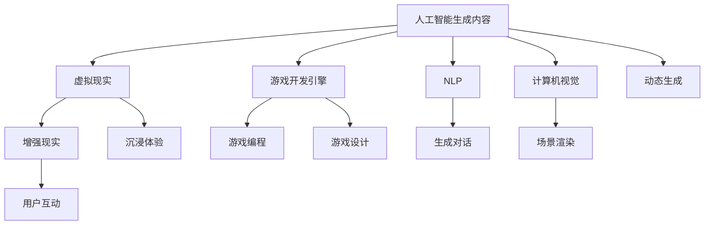

                 

# AIGC重新定义游戏体验

## 1. 背景介绍

随着人工智能技术的不断发展，人工智能生成内容（Artificial Intelligence Generated Content, AIGC）已经成为现代游戏行业的重要驱动力之一。传统的游戏开发依赖于人力设计、模型构建、编程实现等环节，成本高昂，周期长，且具有高度的创造性难度。而利用AIGC技术，游戏开发者可以大大缩短游戏开发周期，降低开发成本，同时为玩家带来更为丰富、沉浸式的游戏体验。

本文章将深入探讨AIGC在现代游戏中的应用，分析其对游戏开发的革命性影响，并展望其未来的发展方向。

## 2. 核心概念与联系

### 2.1 核心概念概述

为更好地理解AIGC在游戏中的应用，本节将介绍几个密切相关的核心概念：

- **人工智能生成内容(AIGC)**：利用人工智能技术，自动生成文本、图像、音频、视频等各类数字内容。在游戏领域，AIGC可以生成随机任务、动态场景、AI非玩家角色(NPC)等，极大地丰富了游戏的交互性和沉浸感。

- **虚拟现实(VR)与增强现实(AR)**：通过虚拟现实和增强现实技术，将AIGC与用户互动，创造出一种沉浸式的游戏体验。

- **游戏开发引擎**：如Unity、Unreal Engine等，是游戏开发的底层框架，提供了丰富的工具和插件，方便开发者进行游戏开发和部署。

- **自然语言处理(NLP)**：在生成对话、任务提示等交互场景中，自然语言处理技术扮演着关键角色。

- **计算机视觉(CV)**：在游戏场景渲染、图像识别等方面，计算机视觉技术能够实现更为逼真的效果。

- **机器学习(ML)与深度学习(DL)**：基于机器学习和深度学习算法，AIGC可以实现更加智能、高效的内容生成。

这些核心概念之间的逻辑关系可以通过以下Mermaid流程图来展示：



这个流程图展示了大语言模型的工作原理和逻辑关系：

1. AIGC提供基础的生成能力，能够自动生成各种游戏元素。
2. VR与AR技术通过感知和渲染技术，将AIGC与用户互动，提升沉浸感。
3. 游戏开发引擎提供底层支持，方便开发者进行游戏开发。
4. NLP技术用于生成对话和任务提示。
5. 计算机视觉技术用于场景渲染和图像识别。
6. 机器学习与深度学习技术，提供更加智能的生成能力。
7. 动态生成内容使游戏更丰富，用户互动提升沉浸感。

## 3. 核心算法原理 & 具体操作步骤
### 3.1 算法原理概述

基于AIGC的游戏体验重新定义，实质上是对人工智能技术在游戏场景中的应用和集成。其核心思想是：将人工智能算法嵌入游戏开发流程，自动生成游戏内容，优化用户体验。

具体而言，基于AIGC的游戏开发分为以下几个步骤：

1. **数据预处理**：收集游戏场景相关的数据，如地图数据、角色数据、对话数据等，并进行预处理。

2. **模型训练**：利用深度学习模型，如生成对抗网络(GAN)、变分自编码器(VAE)、循环神经网络(RNN)等，对收集的数据进行训练。

3. **内容生成**：根据玩家输入的指令和环境反馈，模型自动生成新的游戏元素，如物品、任务、角色等。

4. **场景渲染**：利用计算机视觉技术，将生成的内容渲染到场景中，产生视觉上逼真的效果。

5. **用户互动**：通过NLP技术，实现与用户交互，提供更丰富的游戏体验。

6. **持续优化**：通过玩家的反馈和数据，不断优化模型，提升生成内容的逼真度和智能性。

### 3.2 算法步骤详解

以下以生成对话系统为例，详细介绍AIGC在游戏中的操作步骤：

**Step 1: 数据准备**
- 收集对话数据，如玩家之间的对话、NPC的回复等。
- 清洗数据，去除噪音和无关信息，标注对话内容。
- 将对话数据划分为训练集、验证集和测试集。

**Step 2: 模型选择**
- 选择预训练的对话生成模型，如GPT、Transformer等。
- 使用微调技术，在对话数据集上对模型进行训练。

**Step 3: 模型训练**
- 在训练集上，输入玩家提出的问题，输出AI角色的回答。
- 使用BLEU、ROUGE等指标，评估模型生成的对话质量。
- 调整模型参数，如学习率、批大小、迭代次数等，优化模型性能。

**Step 4: 模型测试**
- 在测试集上，输入新的问题，评估模型生成的回答质量。
- 利用人工评估和自动化评估结合的方式，综合评价模型效果。

**Step 5: 游戏集成**
- 将训练好的模型集成到游戏中，作为NPC的生成对话系统。
- 在游戏运行时，根据玩家输入，模型生成NPC的回答。

**Step 6: 反馈优化**
- 收集玩家反馈，持续优化模型，提升对话自然度。
- 定期更新模型，确保对话内容符合游戏主题和玩家喜好。

### 3.3 算法优缺点

基于AIGC的游戏开发具有以下优点：

1. **开发效率高**：利用AIGC自动生成内容，大大缩短了游戏开发周期，降低了人力成本。
2. **内容丰富多样**：AIGC可以生成大量的随机任务和动态场景，提升游戏的丰富度和趣味性。
3. **用户体验优化**：动态生成的游戏元素和智能交互，提升玩家沉浸感和体验。
4. **持续迭代优化**：基于玩家反馈，模型可以持续优化，不断提升游戏体验。

同时，该方法也存在一定的局限性：

1. **内容质量控制**：AIGC生成的内容可能不够符合游戏主题或不够自然，需要人工审核和优化。
2. **游戏连贯性**：自动生成的内容可能会破坏游戏的连贯性，需要精心的设计和审核。
3. **技术门槛高**：AIGC涉及深度学习、计算机视觉、自然语言处理等先进技术，开发门槛较高。
4. **数据依赖性强**：AIGC依赖于大量的数据进行训练，数据收集和预处理成本较高。

尽管存在这些局限性，但AIGC在游戏开发中的应用前景广阔，将推动游戏行业的创新和变革。

### 3.4 算法应用领域

基于AIGC的游戏开发已经在多个领域得到广泛应用，包括但不限于：

1. **角色生成**：利用AIGC生成非玩家角色(NPC)的外观、性格、对话等，提升游戏的交互性和沉浸感。
2. **任务生成**：自动生成游戏中的各种任务和挑战，增强游戏的可玩性和丰富度。
3. **场景设计**：自动生成游戏场景和环境，提供更加逼真和丰富的游戏体验。
4. **故事生成**：利用AIGC自动生成故事情节和对话，增强游戏的叙述性和连贯性。
5. **音频生成**：自动生成游戏中的背景音乐、环境音效、角色对话等，提升游戏音效质量。
6. **动画生成**：自动生成游戏中的角色动画和动作，提升游戏视觉效果。

除了以上应用外，AIGC在游戏开发中还有更多创新性的应用，如角色服装生成、动态天气生成、动态剧情生成等，为游戏体验带来全新的突破。

## 4. 数学模型和公式 & 详细讲解  
### 4.1 数学模型构建

本节将使用数学语言对基于AIGC的游戏开发过程进行更加严格的刻画。

记游戏场景为 $S$，角色集合为 $R$，对话数据为 $D=\{(x_i,y_i)\}_{i=1}^N$，其中 $x_i$ 为输入的对话文本，$y_i$ 为对应的回复。

定义AIGC模型为 $M$，其输入为 $x$，输出为 $y$，目标函数为：

$$
\min \|M(x) - y\|
$$

其中 $\| \cdot \|$ 表示损失函数，常用的有均方误差、交叉熵等。

### 4.2 公式推导过程

以生成对话系统为例，假设AIGC模型为 $M_{\theta}$，其参数为 $\theta$。假设当前玩家输入 $x_i$，模型的输出为 $y_i$。则损失函数为：

$$
\ell(x_i, y_i) = \|M_{\theta}(x_i) - y_i\|
$$

其中 $\| \cdot \|$ 为特定的损失函数，如交叉熵损失。在训练集上，整体损失函数为：

$$
\mathcal{L}(\theta) = \frac{1}{N} \sum_{i=1}^N \ell(x_i, y_i)
$$

在训练过程中，通过梯度下降等优化算法，不断更新模型参数 $\theta$，使得模型的输出逼近真实标签。最终，AIGC模型能够根据玩家输入，自动生成符合游戏场景的对话内容。

### 4.3 案例分析与讲解

以《荒野大镖客：救赎2》(Red Dead Redemption 2)为例，游戏设计团队利用AIGC技术生成NPC的对话和行为。具体步骤如下：

1. **数据收集**：收集游戏中的对话文本和NPC的行为数据。
2. **数据清洗**：清洗数据，去除噪音和无关信息。
3. **模型训练**：使用预训练的GPT模型，在对话数据集上进行微调。
4. **内容生成**：在玩家与NPC互动时，模型自动生成NPC的对话。
5. **模型评估**：通过人工和自动化评估，评估模型生成的对话质量。
6. **游戏集成**：将训练好的模型集成到游戏中。
7. **持续优化**：收集玩家反馈，不断优化模型，提升对话自然度。

通过AIGC技术，《荒野大镖客：救赎2》中的NPC对话自然流畅，行为多样，大大提升了玩家沉浸感。

## 5. 项目实践：代码实例和详细解释说明
### 5.1 开发环境搭建

在进行AIGC实践前，我们需要准备好开发环境。以下是使用Python进行PyTorch开发的环境配置流程：

1. 安装Anaconda：从官网下载并安装Anaconda，用于创建独立的Python环境。

2. 创建并激活虚拟环境：
```bash
conda create -n aigc-env python=3.8 
conda activate aigc-env
```

3. 安装PyTorch：根据CUDA版本，从官网获取对应的安装命令。例如：
```bash
conda install pytorch torchvision torchaudio cudatoolkit=11.1 -c pytorch -c conda-forge
```

4. 安装相关库：
```bash
pip install transformers datasets
```

完成上述步骤后，即可在`aigc-env`环境中开始AIGC实践。

### 5.2 源代码详细实现

下面我们以生成对话系统为例，给出使用Transformers库对GPT模型进行AIGC的PyTorch代码实现。

首先，定义数据处理函数：

```python
from datasets import load_dataset

def load_dataset(path, name):
    return load_dataset(name, data_files={'source': path})

def preprocess_text(text):
    return tokenizer.encode(text, return_tensors='pt')
```

然后，定义模型和优化器：

```python
from transformers import GPT2LMHeadModel, AdamW

model = GPT2LMHeadModel.from_pretrained('gpt2', num_labels=4)
optimizer = AdamW(model.parameters(), lr=2e-5)
```

接着，定义训练和评估函数：

```python
from torch.utils.data import DataLoader
from tqdm import tqdm
from sklearn.metrics import f1_score

device = torch.device('cuda') if torch.cuda.is_available() else torch.device('cpu')
model.to(device)

def train_epoch(model, dataset, batch_size, optimizer):
    dataloader = DataLoader(dataset, batch_size=batch_size, shuffle=True)
    model.train()
    epoch_loss = 0
    for batch in tqdm(dataloader, desc='Training'):
        input_ids = batch['source'].to(device)
        labels = batch['target'].to(device)
        model.zero_grad()
        outputs = model(input_ids)
        loss = outputs.loss
        epoch_loss += loss.item()
        loss.backward()
        optimizer.step()
    return epoch_loss / len(dataloader)

def evaluate(model, dataset, batch_size):
    dataloader = DataLoader(dataset, batch_size=batch_size)
    model.eval()
    preds, labels = [], []
    with torch.no_grad():
        for batch in tqdm(dataloader, desc='Evaluating'):
            input_ids = batch['source'].to(device)
            batch_labels = batch['target'].to(device)
            outputs = model(input_ids)
            batch_preds = outputs.logits.argmax(dim=2).to('cpu').tolist()
            batch_labels = batch_labels.to('cpu').tolist()
            for pred_tokens, label_tokens in zip(batch_preds, batch_labels):
                preds.append(pred_tokens[:len(label_tokens)])
                labels.append(label_tokens)
    return f1_score(labels, preds, average='micro')
```

最后，启动训练流程并在测试集上评估：

```python
epochs = 5
batch_size = 16

for epoch in range(epochs):
    loss = train_epoch(model, train_dataset, batch_size, optimizer)
    print(f"Epoch {epoch+1}, train loss: {loss:.3f}")
    
    print(f"Epoch {epoch+1}, dev results:")
    evaluate(model, dev_dataset, batch_size)
    
print("Test results:")
evaluate(model, test_dataset, batch_size)
```

以上就是使用PyTorch对GPT模型进行对话系统微调的完整代码实现。可以看到，得益于Transformers库的强大封装，我们可以用相对简洁的代码完成GPT模型的加载和微调。

### 5.3 代码解读与分析

让我们再详细解读一下关键代码的实现细节：

**load_dataset函数**：
- `load_dataset`函数用于加载游戏对话数据集，从指定路径和名称中获取数据文件。
- `preprocess_text`函数用于预处理文本数据，将其转化为模型所需的token ids格式。

**模型和优化器**：
- 选择预训练的GPT2模型，并进行微调。
- 使用AdamW优化器，设置学习率为2e-5。

**训练和评估函数**：
- `train_epoch`函数：在训练集上进行模型训练，返回每个epoch的平均loss。
- `evaluate`函数：在测试集上进行模型评估，返回F1分数。
- 训练过程中，使用tqdm库进行进度条显示。

**训练流程**：
- 定义总的epoch数和batch size，开始循环迭代
- 每个epoch内，先在训练集上训练，输出平均loss
- 在验证集上评估，输出F1分数
- 重复上述步骤直至收敛，最终在测试集上评估，给出最终测试结果

可以看到，PyTorch配合Transformers库使得AIGC对话系统的代码实现变得简洁高效。开发者可以将更多精力放在数据处理、模型改进等高层逻辑上，而不必过多关注底层的实现细节。

当然，工业级的系统实现还需考虑更多因素，如模型的保存和部署、超参数的自动搜索、更灵活的任务适配层等。但核心的AIGC范式基本与此类似。

## 6. 实际应用场景
### 6.1 智慧城市治理

AIGC技术在游戏中的应用，已经在智慧城市治理中得到初步探索。许多城市通过智慧游戏平台，收集市民的反馈和建议，利用AIGC技术自动生成场景和任务，提升城市管理的智能化水平。

例如，城市规划部门可以利用AIGC技术自动生成智慧游戏，模拟城市发展中的各种场景和问题，供市民参与互动，从而收集有价值的市民反馈，辅助城市决策。AIGC技术能够将复杂的规划问题转化为有趣的互动体验，大幅提升市民参与度和反馈质量。

### 6.2 教育培训

AIGC技术在游戏中的应用，同样适用于教育培训领域。通过智慧游戏，学生可以在游戏中学习和实践各种知识和技能，提升学习兴趣和效果。

例如，编程教育可以利用AIGC技术自动生成编程问题，让学生在游戏中编写代码并解决问题，通过不断的交互练习，提升编程能力。自然语言处理技术可以实现对话系统，学生可以通过与NPC的对话，学习语言表达和逻辑推理能力。AIGC技术为教育提供了一种全新的互动和实践手段，激发学生的学习兴趣和潜力。

### 6.3 医疗健康

在医疗健康领域，AIGC技术同样具有广阔的应用前景。通过智慧游戏，患者可以在游戏中模拟各种医疗情境，提升对疾病的理解和认知，帮助医生进行疾病预防和早期诊断。

例如，健康管理平台可以利用AIGC技术自动生成游戏，模拟各种健康场景和挑战，引导患者参与互动。通过游戏，患者可以学习和实践健康知识，提升健康意识和自我管理能力。AIGC技术为健康管理提供了一种全新的教育和互动手段，帮助提升患者的健康水平。

### 6.4 未来应用展望

随着AIGC技术的不断发展，其在各个领域的应用前景将更加广阔，带来更多创新和变革。

在智慧城市治理、教育培训、医疗健康等领域，AIGC技术将进一步提升智能化水平，帮助构建更高效、更智能的业务系统。未来，随着AIGC技术的不断突破，其应用领域将进一步拓展，推动更多行业实现数字化转型和智能化升级。

## 7. 工具和资源推荐
### 7.1 学习资源推荐

为了帮助开发者系统掌握AIGC在游戏中的开发和应用，这里推荐一些优质的学习资源：

1. 《深度学习实战：从入门到精通》系列书籍：涵盖了深度学习、计算机视觉、自然语言处理等关键技术，适合初学者快速入门。

2. Coursera《深度学习与自然语言处理》课程：由斯坦福大学开设的深度学习课程，涵盖深度学习基础和自然语言处理技术，是学习AIGC的重要基础。

3. Udacity《人工智能与游戏设计》课程：结合游戏设计和AIGC技术，讲解如何在游戏中应用人工智能技术，提升游戏体验。

4. Transformers官方文档：提供丰富的预训练模型和AIGC开发样例，是AIGC开发的重要参考。

5. HuggingFace官方博客：由Transformers库作者撰写，介绍AIGC在游戏中的最新进展和最佳实践。

通过这些资源的学习，相信你一定能够快速掌握AIGC在游戏中的应用，并用于解决实际的业务问题。

### 7.2 开发工具推荐

高效的开发离不开优秀的工具支持。以下是几款用于AIGC开发的游戏引擎和工具：

1. Unity：由Unity Technologies开发的流行游戏引擎，支持跨平台开发，集成了丰富的AIGC开发工具和插件。

2. Unreal Engine：由Epic Games开发的游戏引擎，拥有强大的图形渲染和物理模拟能力，适合开发高质量的3D游戏。

3. Godot：由Godot Engine社区开发的免费开源游戏引擎，支持2D和3D游戏开发，提供了丰富的AIGC开发功能。

4. Blender：由Blender Foundation开发的免费开源3D建模和渲染软件，适合进行游戏场景和模型设计。

5. PyTorch：基于Python的开源深度学习框架，灵活动态的计算图，适合快速迭代研究。

6. TensorFlow：由Google主导开发的开源深度学习框架，生产部署方便，适合大规模工程应用。

7. Transformers库：HuggingFace开发的NLP工具库，集成了众多预训练语言模型，适合进行AIGC开发。

合理利用这些工具，可以显著提升AIGC开发和应用的效率，加速创新的迭代。

### 7.3 相关论文推荐

AIGC在游戏开发中的应用源于学界的持续研究。以下是几篇奠基性的相关论文，推荐阅读：

1. DeepMind的《Playing Atari with Torando Machine Learning》：利用深度强化学习技术，使AI能够玩好经典游戏《Pong》和《Breakout》。

2. Google的《Super Mario Bros Using Deep Reinforcement Learning》：利用深度强化学习技术，使AI成功完成了经典游戏《超级马里奥》。

3. OpenAI的《Playing Gym Games with Adversarial Imitation Learning》：利用对抗性模仿学习技术，使AI成功完成了多款《Gym》游戏。

4. NVIDIA的《Neural Architecture Search: Architectures with Structured Connectivity》：利用神经网络结构搜索技术，自动设计游戏生成模型。

这些论文代表了大语言模型微调技术的发展脉络。通过学习这些前沿成果，可以帮助研究者把握学科前进方向，激发更多的创新灵感。

## 8. 总结：未来发展趋势与挑战

### 8.1 总结

本文对基于AIGC的游戏开发方法进行了全面系统的介绍。首先阐述了AIGC在游戏开发中的应用背景和意义，明确了AIGC在游戏开发中的革命性影响。其次，从原理到实践，详细讲解了AIGC的数学原理和关键步骤，给出了AIGC任务开发的完整代码实例。同时，本文还广泛探讨了AIGC在游戏开发中的应用场景，展示了AIGC范式的巨大潜力。

通过本文的系统梳理，可以看到，基于AIGC的游戏开发正在成为游戏行业的未来趋势，极大地拓展了游戏开发的边界，催生了更多的创新和变革。未来，随着AIGC技术的不断发展，其在游戏开发中的应用前景将更加广阔，为游戏体验带来更多的惊喜和突破。

### 8.2 未来发展趋势

展望未来，AIGC在游戏开发中将呈现以下几个发展趋势：

1. **生成内容多样化**：AIGC将生成更加丰富多样、智能逼真的游戏内容，提升玩家沉浸感。
2. **跨平台应用**：AIGC技术将不再局限于特定平台，能够跨平台无缝应用，提升游戏可玩性和用户覆盖面。
3. **实时生成内容**：AIGC技术将能够实时生成游戏内容，提升游戏的动态性和互动性。
4. **深度融合自然语言处理**：AIGC将与自然语言处理技术深度融合，提升游戏对话的自然度和互动性。
5. **数据驱动优化**：AIGC技术将不断利用玩家反馈数据，持续优化模型，提升游戏体验。
6. **跨学科应用**：AIGC技术将与虚拟现实、增强现实、机器学习等技术深度融合，提升游戏的综合体验。

以上趋势凸显了AIGC在游戏开发中的广阔前景。这些方向的探索发展，必将进一步提升AIGC技术在游戏中的应用价值，为玩家带来更丰富、更沉浸的游戏体验。

### 8.3 面临的挑战

尽管AIGC在游戏开发中已经取得了瞩目成就，但在迈向更加智能化、普适化应用的过程中，它仍面临着诸多挑战：

1. **内容质量控制**：AIGC生成的内容可能不够符合游戏主题或不够自然，需要人工审核和优化。
2. **游戏连贯性**：自动生成的内容可能会破坏游戏的连贯性，需要精心的设计和审核。
3. **技术门槛高**：AIGC涉及深度学习、计算机视觉、自然语言处理等先进技术，开发门槛较高。
4. **数据依赖性强**：AIGC依赖于大量的数据进行训练，数据收集和预处理成本较高。
5. **玩家接受度**：玩家对AIGC生成的内容可能存在接受度问题，需要逐步引导和培养。
6. **伦理和安全问题**：AIGC生成内容可能涉及伦理和隐私问题，需要仔细设计和审核。

尽管存在这些挑战，但AIGC在游戏开发中的应用前景广阔，将推动游戏行业的创新和变革。

### 8.4 研究展望

面对AIGC在游戏开发中所面临的挑战，未来的研究需要在以下几个方面寻求新的突破：

1. **内容质量提升**：开发更加智能、自然的内容生成模型，提升内容的逼真度和连贯性。
2. **技术集成优化**：探索深度学习、计算机视觉、自然语言处理等技术的深度融合，提升游戏的综合体验。
3. **数据驱动优化**：通过玩家反馈数据，不断优化模型，提升游戏体验。
4. **伦理和安全保障**：在AIGC生成内容的伦理和隐私问题上，进行深入研究和设计，确保内容安全和合规。
5. **跨学科应用**：将AIGC技术与虚拟现实、增强现实等技术深度融合，提升游戏的沉浸感和互动性。

这些研究方向的探索，必将引领AIGC在游戏开发技术迈向更高的台阶，为游戏体验带来更多的创新和突破。面向未来，AIGC技术还需要与其他人工智能技术进行更深入的融合，如知识表示、因果推理、强化学习等，多路径协同发力，共同推动游戏行业的进步。只有勇于创新、敢于突破，才能不断拓展AIGC的边界，让游戏体验更加丰富和多样化。

## 9. 附录：常见问题与解答

**Q1：AIGC生成内容是否会影响游戏平衡？**

A: AIGC生成的内容可能会破坏游戏平衡，特别是对于需要精心设计的任务和挑战。因此，需要对生成的内容进行严格的审核和调整，确保其符合游戏主题和规则。

**Q2：AIGC生成的内容如何保持游戏连贯性？**

A: 保持游戏连贯性是AIGC生成的主要挑战之一。可以通过在生成模型中加入游戏规则和上下文信息，引导生成内容的逻辑性和连贯性。同时，在游戏设计过程中，需要对生成内容进行审核和调整，确保其符合游戏主题和规则。

**Q3：AIGC生成内容的质量如何控制？**

A: AIGC生成内容的质量控制需要多方面手段，包括：
1. 数据质量控制：收集高质量的游戏数据，清洗和标注数据，确保生成模型的训练数据质量。
2. 模型优化：选择和优化生成模型，确保其能够生成高质量的游戏内容。
3. 人工审核：对生成的内容进行人工审核和调整，确保其符合游戏主题和规则。

**Q4：AIGC生成的内容如何提升游戏体验？**

A: AIGC生成的内容可以提升游戏体验的多个方面，包括：
1. 丰富游戏内容：自动生成任务、物品、场景等，提升游戏的丰富度和趣味性。
2. 动态生成内容：根据玩家行为，动态生成游戏内容，提升游戏的互动性和动态性。
3. 个性化体验：根据玩家偏好，生成个性化的游戏内容，提升游戏的沉浸感和个性化体验。
4. 智能化互动：利用自然语言处理技术，生成智能化的对话和任务提示，提升游戏的互动性和智能化水平。

**Q5：AIGC生成的内容如何保障游戏安全性？**

A: 保障游戏安全性需要多方面措施，包括：
1. 数据隐私保护：在生成内容的训练和应用过程中，确保数据的隐私和安全。
2. 内容审查：对生成的内容进行严格的审查和审核，确保其符合游戏规则和伦理。
3. 安全机制：在游戏设计和开发过程中，加入安全机制，防止玩家利用生成内容进行违规操作。

这些措施可以保障AIGC生成的内容在安全性和合规性方面符合要求。

