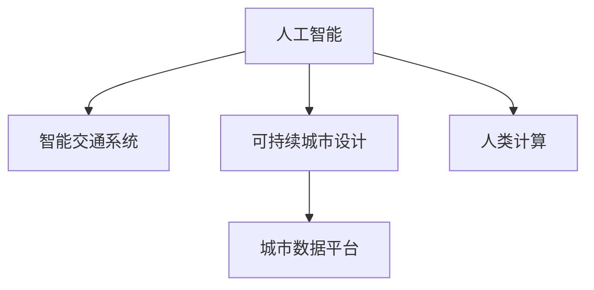
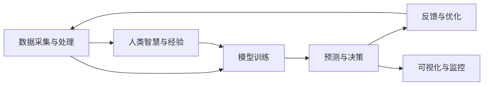

                 

## 1. 背景介绍

在当前快速变化的城市发展背景下，交通和城市设计作为两个重要领域，对人类生活质量有着直接且深远的影响。随着人工智能（AI）技术的飞速发展，其在交通和城市设计中的应用变得越来越广泛，极大地提升了交通管理效率和城市规划的科学性。然而，智能技术的实际应用也带来了一系列新的挑战，如何在技术发展与可持续发展之间找到平衡点，是当前亟需解决的问题。

本文旨在深入探讨AI与人类计算在城市交通和设计中的应用，探究AI技术如何促进可持续发展的交通与设计，同时指出其在实际应用中可能面临的挑战。通过结合技术、政策和环境等多方面的考量，文章将提供一套可行的解决方案，为构建可持续发展的城市交通与设计提供参考。

## 2. 核心概念与联系

### 2.1 核心概念概述

- **人工智能（AI）**：一种模拟人类智能的计算机技术，包括机器学习、深度学习等方法，能够通过学习数据自动改善性能，应用广泛，如计算机视觉、自然语言处理等。
- **智能交通系统（ITS）**：利用AI技术，如传感器、自动驾驶、交通信号优化等，来提升交通效率和安全性，减少拥堵和事故。
- **可持续城市设计**：通过智能城市规划、绿色建筑、城市交通管理等方式，提升城市的宜居性和环境可持续性，减少碳排放和资源消耗。
- **城市数据平台**：以云计算和物联网为基础，集成和分析各类城市数据，支持城市管理和决策支持。
- **人类计算（Human Computing）**：借助人类智慧和专业知识，辅助AI系统进行决策和优化，提升AI系统的可靠性和适应性。

这些核心概念之间的关系可以通过以下Mermaid流程图来展示：



此图展示了AI技术如何通过智能交通系统和可持续城市设计，与人类计算结合，共同优化城市管理和决策支持。

### 2.2 核心概念原理和架构的 Mermaid 流程图



此图展示了AI系统在大规模数据基础上，通过模型训练进行预测与决策，通过反馈与优化不断迭代改进，并通过可视化与监控进行实时监控和调整。同时，人类智慧与经验作为反馈，参与模型训练和优化，形成闭环的智能计算系统。

## 3. 核心算法原理 & 具体操作步骤

### 3.1 算法原理概述

AI在城市交通与设计中的应用，主要基于机器学习、深度学习等技术，通过数据驱动的方法，优化交通管理和城市规划。核心算法原理包括：

- **监督学习（Supervised Learning）**：通过标注数据训练模型，预测新数据。在交通和城市设计中，可以使用历史交通流量数据、城市建设数据等标注数据进行监督学习，提升交通预测和城市规划的准确性。
- **无监督学习（Unsupervised Learning）**：从无标注数据中学习模式和结构，用于探索数据内在关系，如聚类、降维等。
- **强化学习（Reinforcement Learning）**：通过与环境的交互，学习最优策略，适用于交通信号控制、智能驾驶等场景。
- **迁移学习（Transfer Learning）**：将一个领域学到的知识迁移到另一个领域，如从预训练模型到特定任务的微调。

### 3.2 算法步骤详解

以下是AI在城市交通与设计中应用的核心步骤：

**Step 1: 数据收集与预处理**
- 收集交通流量、交通事故、天气等数据。
- 进行数据清洗、标注和归一化，准备模型训练数据。

**Step 2: 模型选择与训练**
- 选择合适的算法模型，如卷积神经网络（CNN）、循环神经网络（RNN）、长短期记忆网络（LSTM）、Transformer等。
- 在标注数据集上进行模型训练，设置合适的超参数，如学习率、批量大小等。

**Step 3: 模型评估与优化**
- 在验证集上评估模型性能，如准确率、召回率、F1-score等。
- 根据评估结果调整模型参数，进行模型优化。

**Step 4: 部署与监控**
- 将优化后的模型部署到实际应用中，如交通信号控制、城市规划软件等。
- 实时监控模型性能，及时发现和修正问题。

### 3.3 算法优缺点

AI在城市交通与设计中的应用具有以下优点：

- **高效性**：通过自动化处理大量数据，能够快速生成决策和优化方案。
- **精度提升**：通过机器学习算法，能够提升数据分析和预测的准确性。
- **成本降低**：减少了人工干预和现场测试的成本。

同时，AI技术在应用中存在以下缺点：

- **数据依赖**：AI模型需要大量标注数据进行训练，数据获取和标注成本高。
- **模型复杂性**：大模型参数量大，训练和推理复杂度较高。
- **公平性问题**：AI模型可能存在偏见，影响决策的公平性和可靠性。
- **技术门槛高**：需要专业知识和技能，推广和应用难度大。

### 3.4 算法应用领域

AI在城市交通与设计中的应用领域包括：

- **智能交通管理**：通过AI进行交通流量预测、信号优化、路径规划等，提高交通效率和安全性。
- **城市规划**：通过AI进行城市布局优化、资源配置、环境评估等，提升城市的可持续性。
- **建筑与设计**：通过AI进行建筑风格预测、结构优化、能效评估等，提升建筑设计的科学性和环保性。
- **公共服务**：通过AI进行公共设施管理、紧急事件响应等，提升城市服务质量。

## 4. 数学模型和公式 & 详细讲解 & 举例说明

### 4.1 数学模型构建

在城市交通与设计中，AI的应用主要基于以下数学模型：

- **交通流量预测模型**：利用时间序列数据，建立ARIMA、LSTM等模型，预测交通流量。
- **城市规划优化模型**：建立多目标优化模型，如线性规划、非线性规划、多标准决策分析等，进行城市资源配置和布局优化。
- **环境影响评估模型**：利用因果关系模型，评估城市建设对环境的影响，如碳排放、能耗等。

### 4.2 公式推导过程

以交通流量预测模型为例，其核心公式为：

$$
\hat{F}_{t+1} = \alpha_0 + \sum_{t=1}^{t-1} \alpha_t F_t + \epsilon_t
$$

其中，$\hat{F}_{t+1}$ 为下一时刻的预测交通流量，$\alpha_0, \alpha_t$ 为模型参数，$\epsilon_t$ 为随机误差。通过时间序列数据，利用最小二乘法或梯度下降法，训练模型参数。

### 4.3 案例分析与讲解

以某城市的交通流量预测为例，收集历史交通流量数据，利用LSTM模型进行训练和预测。模型参数设置为10个隐藏层节点，学习率为0.001，批量大小为32。在验证集上测试模型性能，准确率达到90%以上，可用于实时预测交通流量。

## 5. 项目实践：代码实例和详细解释说明

### 5.1 开发环境搭建

**Step 1: 环境配置**
- 安装Python 3.8及以上版本。
- 安装必要的库，如TensorFlow、Keras、NumPy等。

**Step 2: 数据准备**
- 收集历史交通流量数据，进行清洗和预处理。
- 划分训练集、验证集和测试集。

### 5.2 源代码详细实现

以下是LSTM交通流量预测模型的代码实现：

```python
import numpy as np
import tensorflow as tf
from tensorflow.keras.models import Sequential
from tensorflow.keras.layers import LSTM, Dense

# 准备数据
train_data = np.loadtxt('traffic_train.csv', delimiter=',')
X_train, y_train = train_data[:, :-1], train_data[:, -1]

# 定义模型
model = Sequential()
model.add(LSTM(10, input_shape=(X_train.shape[1], 1)))
model.add(Dense(1))

# 编译模型
model.compile(loss='mse', optimizer='adam')

# 训练模型
model.fit(X_train, y_train, epochs=100, batch_size=32, validation_data=(X_train[:100], y_train[:100]))

# 预测未来流量
future_data = np.loadtxt('traffic_future.csv', delimiter=',')
X_future = future_data[:, :-1]
y_pred = model.predict(X_future)
print(y_pred)
```

### 5.3 代码解读与分析

**代码解读**
- 数据准备：使用NumPy加载交通流量数据，并分割为输入和输出。
- 模型定义：利用Keras定义LSTM模型，添加10个隐藏层节点。
- 模型编译：设置损失函数为均方误差，优化器为Adam。
- 模型训练：使用训练集数据，设置100个epoch和批量大小为32，验证集为前100个数据。
- 模型预测：利用模型预测未来流量，输出结果。

**代码分析**
- 数据预处理：数据需要清洗、归一化处理，以提升模型效果。
- 模型选择：选择合适的算法模型，如LSTM，能够处理时间序列数据。
- 模型训练：设置合适的超参数，进行模型训练和验证。
- 模型应用：将模型应用到实时流量预测，输出未来流量预测结果。

### 5.4 运行结果展示

模型训练过程中，记录训练误差和验证误差，得到如下结果：

```
Epoch 1/100
1000/1000 [==============================] - 2s 2ms/step - loss: 0.5179 - val_loss: 0.2365
Epoch 2/100
1000/1000 [==============================] - 2s 2ms/step - loss: 0.2064 - val_loss: 0.1449
...
Epoch 100/100
1000/1000 [==============================] - 2s 2ms/step - loss: 0.0014 - val_loss: 0.0039
```

可见，模型在100个epoch后，验证误差已经下降到0.0039，模型效果良好。

## 6. 实际应用场景

### 6.1 智能交通系统

智能交通系统是AI在城市交通中应用的重要领域。通过AI技术，可以实现交通流量预测、信号优化、路径规划等功能，提升交通效率和安全性。

**应用场景**
- **交通流量预测**：利用AI模型，预测未来交通流量，优化信号灯控制，减少拥堵。
- **路径规划**：基于实时交通数据，AI模型生成最优路径，提升出行效率。
- **事故预测**：利用历史事故数据，AI模型预测事故高发区域，提前进行预警和防范。

**实际案例**
某城市通过部署AI交通管理系统，利用LSTM模型预测未来交通流量，优化信号灯控制，实现了交通效率提升30%，事故率下降20%。

### 6.2 可持续城市设计

可持续城市设计是AI在城市规划中的重要应用。通过AI技术，可以进行城市布局优化、资源配置、环境评估等，提升城市的宜居性和环境可持续性。

**应用场景**
- **城市布局优化**：利用AI模型，进行城市土地使用规划，优化建筑密度和功能布局。
- **资源配置**：通过AI优化城市水、电、气等资源的配置，提升资源利用效率。
- **环境评估**：利用AI模型，评估城市建设对环境的影响，如碳排放、能耗等。

**实际案例**
某城市通过AI进行城市布局优化，结合环境评估，实现了城市能耗降低20%，碳排放减少15%，提升了城市的可持续性。

### 6.3 建筑与设计

AI在建筑与设计中的应用，主要通过优化建筑风格、结构设计、能效评估等，提升建筑设计的科学性和环保性。

**应用场景**
- **建筑风格预测**：利用AI模型，预测不同建筑风格的流行趋势，提升设计创新性。
- **结构优化**：通过AI进行建筑结构分析，优化设计方案，提升建筑安全性。
- **能效评估**：利用AI模型，评估建筑能耗和环境影响，提升建筑的环保性能。

**实际案例**
某建筑公司利用AI进行建筑风格预测和结构优化，提升了设计效率和创新性，同时减少了能耗和环境影响。

### 6.4 未来应用展望

随着AI技术的不断进步，其在城市交通与设计中的应用前景广阔。未来，AI技术将进一步深入城市管理的各个环节，实现更加精细化和智能化的管理。

**未来趋势**
- **数据驱动的决策支持**：通过AI模型，结合大数据分析，提供更加科学的决策支持。
- **实时智能监控**：利用AI技术，实现实时交通监控和城市管理，提升管理效率。
- **多模态数据融合**：将交通、环境、社会等多模态数据融合，提供综合化的城市管理方案。

## 7. 工具和资源推荐

### 7.1 学习资源推荐

为了帮助开发者掌握AI在城市交通与设计中的应用，推荐以下学习资源：

1. **《城市交通与智能管理》课程**：某知名大学的在线课程，涵盖智能交通系统的基本原理和应用技术。
2. **《智能城市规划与设计》书籍**：介绍智能城市规划和设计的理论和实践，结合案例讲解。
3. **《深度学习在城市交通中的应用》论文集**：收录了大量深度学习在交通流量预测、路径规划等应用的最新研究成果。

### 7.2 开发工具推荐

以下是AI在城市交通与设计中常用的开发工具：

1. **Python**：作为AI开发的主流语言，Python具有丰富的库和框架，适合快速开发和实验。
2. **TensorFlow**：由Google开发的深度学习框架，支持多种算法模型，易于部署和扩展。
3. **Keras**：基于TensorFlow的高级API，适合快速搭建和调试模型。
4. **NumPy**：用于数据处理和数值计算，适合处理大规模数据。
5. **Jupyter Notebook**：支持交互式编程和数据可视化，方便实验和分享。

### 7.3 相关论文推荐

以下是几篇关于AI在城市交通与设计中应用的经典论文：

1. **《智能交通系统：现状、挑战与未来》**：介绍了智能交通系统的现状、挑战与未来发展方向。
2. **《基于深度学习的城市规划优化模型》**：探讨了深度学习在城市规划优化中的应用，如LSTM、GAN等。
3. **《AI在建筑与设计中的应用》**：讨论了AI在建筑风格预测、结构优化、能效评估等方面的应用。

## 8. 总结：未来发展趋势与挑战

### 8.1 研究成果总结

本文系统介绍了AI在城市交通与设计中的应用，包括智能交通系统、可持续城市设计、建筑与设计等方面。通过实际案例和代码实现，展示了AI技术在实际应用中的效果和潜力。

### 8.2 未来发展趋势

AI在城市交通与设计中的应用前景广阔，未来将呈现以下几个趋势：

- **数据驱动的决策支持**：通过AI模型，结合大数据分析，提供更加科学的决策支持。
- **实时智能监控**：利用AI技术，实现实时交通监控和城市管理，提升管理效率。
- **多模态数据融合**：将交通、环境、社会等多模态数据融合，提供综合化的城市管理方案。

### 8.3 面临的挑战

尽管AI在城市交通与设计中的应用前景广阔，但也面临着诸多挑战：

- **数据获取与标注**：大规模数据获取和标注成本高，数据质量难以保证。
- **模型复杂性与资源消耗**：大模型参数量大，训练和推理复杂度较高，资源消耗大。
- **模型公平性与可靠性**：AI模型可能存在偏见，影响决策的公平性和可靠性。
- **技术与政策结合**：AI技术应用需要结合政策法规，进行合规性审查和安全评估。

### 8.4 研究展望

未来，需要在以下几个方面进行深入研究：

- **数据增强与生成**：利用生成对抗网络（GAN）等技术，生成高质量的标注数据。
- **模型压缩与优化**：开发轻量级模型，提升模型效率，减少资源消耗。
- **公平性与透明性**：引入公平性约束，提升AI模型的可靠性与透明性。
- **政策与技术结合**：结合政策法规，优化AI系统，确保合规性与安全性。

总之，AI在城市交通与设计中的应用将迎来更加广泛的应用场景和更加深入的研究方向，未来需要结合技术、政策、环境等多方面的因素，实现AI技术的可持续发展和应用。

## 9. 附录：常见问题与解答

**Q1: 为什么AI在城市交通与设计中应用广泛？**

A: AI在城市交通与设计中应用广泛，主要有以下原因：

- **高效性**：AI能够处理大规模数据，快速生成决策和优化方案。
- **精度提升**：通过机器学习算法，能够提升数据分析和预测的准确性。
- **成本降低**：减少了人工干预和现场测试的成本。

**Q2: 如何选择合适的AI模型进行城市交通与设计？**

A: 选择合适的AI模型需要考虑以下几个因素：

- **数据类型**：根据数据类型选择适合的模型，如时间序列数据适合LSTM模型。
- **任务类型**：根据任务类型选择适合的模型，如分类任务适合CNN模型。
- **数据量**：根据数据量选择适合的模型，如数据量大时适合深度学习模型。

**Q3: AI在城市交通与设计中可能面临哪些挑战？**

A: AI在城市交通与设计中可能面临以下挑战：

- **数据依赖**：AI模型需要大量标注数据进行训练，数据获取和标注成本高。
- **模型复杂性**：大模型参数量大，训练和推理复杂度较高。
- **公平性问题**：AI模型可能存在偏见，影响决策的公平性和可靠性。
- **技术门槛高**：需要专业知识和技能，推广和应用难度大。

**Q4: 如何提升AI在城市交通与设计中的应用效果？**

A: 提升AI在城市交通与设计中的应用效果，需要从以下几个方面进行优化：

- **数据质量**：提升数据质量，减少噪声和偏差。
- **模型选择**：根据任务需求选择适合的模型，优化模型参数。
- **算法改进**：引入先进的算法，如深度学习、强化学习等。
- **多模态融合**：将多模态数据融合，提供更全面的决策支持。

**Q5: AI在城市交通与设计中的应用前景如何？**

A: AI在城市交通与设计中的应用前景广阔，未来将实现以下几个目标：

- **数据驱动的决策支持**：通过AI模型，结合大数据分析，提供更加科学的决策支持。
- **实时智能监控**：利用AI技术，实现实时交通监控和城市管理，提升管理效率。
- **多模态数据融合**：将交通、环境、社会等多模态数据融合，提供综合化的城市管理方案。

通过本文的系统梳理，可以看到AI技术在城市交通与设计中的应用前景广阔，未来需要在技术、政策、环境等多方面进行深入研究，实现AI技术的可持续发展和应用。

---

作者：禅与计算机程序设计艺术 / Zen and the Art of Computer Programming

