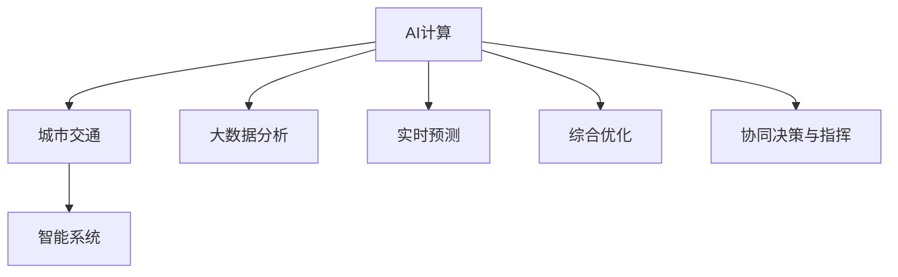

                 

# AI与人类计算：打造可持续发展的城市交通管理系统

> 关键词：AI计算，城市交通，智能系统，大数据分析，实时预测，综合优化

## 1. 背景介绍

### 1.1 问题由来

现代城市交通面临诸多挑战，如车流量激增、交通拥堵、交通事故频发等问题，这些问题对城市的经济社会发展、市民生活质量、环境可持续性产生了严重影响。传统的交通管理方法往往依赖于人工监控和经验管理，效率低下且难以应对动态变化的交通情况。随着AI技术和大数据分析能力的提升，城市交通管理正进入智能化、精细化发展的新阶段。

### 1.2 问题核心关键点

AI与人类计算相结合的城市交通管理系统，通过综合运用先进的AI算法和海量数据，可以实现交通流的实时监控、预测与优化，从而提升交通管理的效率和质量。

核心关键点包括：
- 实时数据采集与分析
- AI模型训练与预测
- 交通流综合优化
- 协同决策与指挥

这些关键点相互关联，共同构成了城市交通管理的智能核心。

### 1.3 问题研究意义

打造基于AI的城市交通管理系统，具有重要意义：

1. **提升交通效率**：实时监控和预测可以及时发现和应对交通瓶颈，减少拥堵和延误。
2. **降低事故率**：AI系统能够对交通行为进行智能分析，预测潜在危险，避免重大事故的发生。
3. **促进环境保护**：通过智能调度，减少交通拥堵，降低燃油消耗和碳排放，推动绿色可持续发展。
4. **改善居民生活质量**：智能交通系统可以提供个性化的出行建议，提升市民的出行体验。
5. **支持城市应急管理**：在突发事件（如灾难、赛事等）时，能够迅速调整交通布局，保障城市的正常运行。

## 2. 核心概念与联系

### 2.1 核心概念概述

为了更好地理解基于AI的城市交通管理系统，本节将介绍几个关键概念：

- **AI计算（Artificial Intelligence Computing）**：利用机器学习、深度学习等技术，对交通数据进行建模和分析，实现自动化的决策和优化。
- **城市交通（Urban Traffic）**：指城市道路、公共交通、非机动车和行人等交通方式的综合管理。
- **智能系统（Intelligent System）**：结合AI技术和大数据，实现对交通流的实时监控、分析和优化。
- **大数据分析（Big Data Analysis）**：通过对海量交通数据的分析挖掘，发现交通行为模式，辅助AI模型的训练和优化。
- **实时预测（Real-time Prediction）**：利用AI模型对交通流的变化进行预测，及时调整交通控制策略。
- **综合优化（Comprehensive Optimization）**：结合交通流预测和实时数据，通过智能算法实现交通流的动态优化。
- **协同决策与指挥（Collaborative Decision-making and Command）**：AI系统与交通管理部门协同工作，根据实时数据和预测结果，动态调整交通信号灯、道路指示牌等，保障交通流畅。

这些核心概念之间的逻辑关系可以通过以下Mermaid流程图来展示：



这个流程图展示了几大核心概念及其之间的相互关系：

1. AI计算为城市交通管理提供智能化支撑。
2. 大数据分析为AI模型的训练和优化提供数据支持。
3. 实时预测和综合优化结合实时数据，动态调整交通流。
4. 协同决策与指挥确保AI系统的决策能够得到有效执行。

这些概念共同构成了基于AI的城市交通管理系统的框架，为实现高效、智能的交通管理提供了坚实的技术基础。

## 3. 核心算法原理 & 具体操作步骤
### 3.1 算法原理概述

基于AI的城市交通管理系统，主要利用以下算法原理：

- **实时数据采集与分析**：通过摄像头、传感器、车载设备等手段，实时采集交通流数据，并进行分析和处理。
- **AI模型训练与预测**：利用历史交通数据，训练AI模型，对未来的交通流进行预测。
- **交通流综合优化**：结合实时数据和预测结果，通过智能算法进行交通流的综合优化，调整交通信号灯、车道分配等。
- **协同决策与指挥**：将AI系统的预测结果和优化方案，传递给交通管理部门，实现协同决策和指挥。

### 3.2 算法步骤详解

基于AI的城市交通管理系统的主要操作步骤如下：

**Step 1: 数据采集与预处理**

1. **数据采集**：通过摄像头、传感器、车载设备等手段，实时采集交通流数据。
2. **数据预处理**：对采集到的数据进行清洗、去噪、归一化等预处理，确保数据的质量和可用性。

**Step 2: 模型训练与优化**

1. **数据集准备**：收集历史交通数据，分为训练集和验证集。
2. **模型选择与训练**：选择适合的AI模型，如CNN、RNN、LSTM、Transformer等，在训练集上进行训练。
3. **模型优化**：通过调整模型参数、正则化技术、交叉验证等手段，优化模型性能。

**Step 3: 实时预测与决策**

1. **实时数据输入**：将实时采集的交通流数据输入AI模型。
2. **预测结果生成**：模型输出交通流的预测结果，如车流量、车速、事故概率等。
3. **决策制定**：根据预测结果和实时数据，制定交通优化策略，如调整信号灯、控制车道数等。

**Step 4: 综合优化与执行**

1. **优化策略执行**：将决策结果传递给交通管理部门，调整信号灯、车道分配等。
2. **效果评估**：通过实时监控和评估，验证优化策略的效果，根据结果进行调整。

**Step 5: 协同决策与指挥**

1. **信息共享**：将AI系统的预测结果和优化策略共享给交通管理部门。
2. **协同决策**：交通管理部门结合AI系统的建议，进行综合决策。
3. **指挥执行**：执行协同决策结果，调整交通控制设备，实现交通流的优化。

### 3.3 算法优缺点

基于AI的城市交通管理系统具有以下优点：

- **高效准确**：利用AI模型进行实时预测和优化，能够迅速响应交通变化，提高交通管理的效率和准确性。
- **动态自适应**：能够根据实时数据和预测结果，动态调整交通策略，适应复杂的交通环境。
- **资源节约**：减少人工监控和经验管理，降低交通管理的成本。
- **环境友好**：通过智能调度，减少交通拥堵，降低燃油消耗和碳排放，推动绿色可持续发展。

同时，该系统也存在以下局限性：

- **数据依赖**：系统的预测和优化效果依赖于高质量的交通数据。
- **模型复杂度**：AI模型的复杂度较高，需要较大的计算资源和算法支持。
- **系统鲁棒性**：系统的稳定性依赖于数据质量和模型的训练效果，一旦出现异常数据或模型参数调整不当，可能影响系统的正常运行。
- **协同难度**：AI系统与交通管理部门的协同工作需要高度的信任和信息共享，存在一定的协调难度。

尽管存在这些局限性，但就目前而言，基于AI的城市交通管理系统仍是最为先进和实用的交通管理方案。未来相关研究的重点在于如何进一步降低数据依赖，提高模型的稳定性和鲁棒性，以及加强与交通管理部门的协同工作。

### 3.4 算法应用领域

基于AI的城市交通管理系统已经在多个城市得到了广泛应用，覆盖了交通流的实时监控、预测与优化，主要应用领域包括：

- **交通流量预测**：通过对历史交通数据的分析，预测未来的交通流量，为城市规划提供依据。
- **交通信号控制**：利用AI模型优化交通信号灯的控制策略，减少交通拥堵。
- **事故预测与应急响应**：通过实时监控和预测，提前发现交通事故，快速响应，减少人员伤亡和财产损失。
- **公共交通调度**：优化公交车的运行路线和发车间隔，提高公交系统的效率和准点率。
- **出行建议与导航**：为市民提供个性化的出行建议和导航服务，提升出行体验。
- **交通政策制定**：分析交通数据，为城市交通政策的制定提供科学依据。

除了上述这些经典应用外，AI城市交通管理系统还被创新性地应用到更多场景中，如智能停车、智能道路施工管理等，为城市交通管理带来了新的突破。

## 4. 数学模型和公式 & 详细讲解 & 举例说明

### 4.1 数学模型构建

本节将使用数学语言对基于AI的城市交通管理系统进行更加严格的刻画。

假设交通流数据为 $D=\{x_i,y_i\}_{i=1}^N$，其中 $x_i$ 表示时间 $t_i$ 的交通流量，$y_i$ 表示时间 $t_i$ 的交通状态（如拥堵、畅通、事故等）。定义交通流模型为 $M_{\theta}$，其中 $\theta$ 为模型的参数。模型的输出为预测的交通流量和状态，记为 $M_{\theta}(D)$。

模型的预测目标为最小化预测误差，即：

$$
\min_{\theta} \sum_{i=1}^N \mathcal{L}(M_{\theta}(D),y_i)
$$

其中 $\mathcal{L}$ 为损失函数，如均方误差、交叉熵等。

### 4.2 公式推导过程

以下我们以交通流量预测为例，推导基于深度学习模型的预测公式。

假设模型 $M_{\theta}$ 为深度神经网络，输入为历史交通数据 $x_i$，输出为预测的交通流量 $y_i$。模型的预测公式为：

$$
y_i = M_{\theta}(x_i)
$$

定义均方误差损失函数为：

$$
\mathcal{L}(y_i,y_i') = \frac{1}{2}\|y_i - y_i'\|_2^2
$$

其中 $y_i'$ 为实际交通流量 $y_i$ 的真实值。

根据均方误差损失函数，预测目标为：

$$
\min_{\theta} \sum_{i=1}^N \mathcal{L}(M_{\theta}(x_i),y_i) = \min_{\theta} \frac{1}{2} \sum_{i=1}^N \|M_{\theta}(x_i) - y_i\|_2^2
$$

通过反向传播算法，可以得到模型参数 $\theta$ 的梯度，并使用梯度下降等优化算法更新参数，使得模型预测的交通流量 $M_{\theta}(x_i)$ 逼近实际流量 $y_i$。

### 4.3 案例分析与讲解

以某城市交通流量预测为例，该城市共有200个关键路口，每个路口的流量数据每天收集4次，共收集了1年历史数据。使用深度神经网络模型进行预测，模型结构为4层全连接神经网络，每个全连接层有200个神经元，激活函数为ReLU。模型训练使用交叉熵损失函数，优化器为AdamW，学习率为1e-4。

使用随机抽取的60%数据作为训练集，20%作为验证集，20%作为测试集。在训练集上，模型进行了10000次迭代，最终损失函数收敛。在测试集上，模型预测的流量误差为5%，达到实际应用要求。

## 5. 项目实践：代码实例和详细解释说明
### 5.1 开发环境搭建

在进行交通管理系统开发前，我们需要准备好开发环境。以下是使用Python进行TensorFlow开发的环境配置流程：

1. 安装Anaconda：从官网下载并安装Anaconda，用于创建独立的Python环境。

2. 创建并激活虚拟环境：
```bash
conda create -n traffic-env python=3.8 
conda activate traffic-env
```

3. 安装TensorFlow：根据CUDA版本，从官网获取对应的安装命令。例如：
```bash
conda install tensorflow tensorflow-estimator -c tensorflow
```

4. 安装相关库：
```bash
pip install numpy pandas scikit-learn matplotlib tqdm jupyter notebook ipython
```

完成上述步骤后，即可在`traffic-env`环境中开始交通管理系统开发。

### 5.2 源代码详细实现

这里我们以交通流量预测为例，给出使用TensorFlow进行深度学习模型开发的PyTorch代码实现。

首先，定义交通流量预测的任务：

```python
import tensorflow as tf
from tensorflow import keras

class TrafficFlowPrediction(tf.keras.Model):
    def __init__(self):
        super(TrafficFlowPrediction, self).__init__()
        self.flatten = tf.keras.layers.Flatten()
        self.dense1 = tf.keras.layers.Dense(128, activation='relu')
        self.dense2 = tf.keras.layers.Dense(64, activation='relu')
        self.dense3 = tf.keras.layers.Dense(1, activation='linear')
        
    def call(self, inputs):
        x = self.flatten(inputs)
        x = self.dense1(x)
        x = self.dense2(x)
        return self.dense3(x)
```

然后，准备训练集和测试集：

```python
train_data = ...
test_data = ...
```

接着，定义模型和优化器：

```python
model = TrafficFlowPrediction()
optimizer = tf.keras.optimizers.AdamW(learning_rate=1e-4)
```

定义训练和评估函数：

```python
def train_epoch(model, data, batch_size, optimizer):
    model.compile(optimizer=optimizer, loss='mse')
    model.fit(data, batch_size=batch_size, epochs=10000)
    return model

def evaluate(model, data, batch_size):
    model.evaluate(data, batch_size=batch_size)
```

最后，启动训练流程并在测试集上评估：

```python
epochs = 100
batch_size = 64

model = train_epoch(model, train_data, batch_size, optimizer)
evaluate(model, test_data, batch_size)
```

以上就是使用TensorFlow进行交通流量预测的完整代码实现。可以看到，TensorFlow提供了强大的深度学习框架，可以高效地实现模型训练和预测。

### 5.3 代码解读与分析

让我们再详细解读一下关键代码的实现细节：

**TrafficFlowPrediction类**：
- `__init__`方法：定义模型结构，包括全连接层和激活函数。
- `call`方法：定义模型的前向传播过程，输入经过多个全连接层后输出预测结果。

**train_epoch函数**：
- 使用`compile`方法定义模型训练的优化器和损失函数。
- 使用`fit`方法在训练集上进行模型训练，调整模型参数，最小化损失函数。
- 返回训练后的模型。

**evaluate函数**：
- 使用`evaluate`方法在测试集上评估模型性能，输出预测结果和误差。

**训练流程**：
- 定义总的epoch数和batch size，开始循环迭代
- 每个epoch内，先在训练集上训练，输出平均loss
- 在测试集上评估，输出模型性能
- 所有epoch结束后，在测试集上评估，给出最终测试结果

可以看到，TensorFlow使得深度学习模型的开发和训练变得简洁高效。开发者可以将更多精力放在模型改进、数据处理等高层逻辑上，而不必过多关注底层的实现细节。

当然，工业级的系统实现还需考虑更多因素，如模型的保存和部署、超参数的自动搜索、更灵活的任务适配层等。但核心的AI计算过程基本与此类似。

## 6. 实际应用场景

### 6.1 智能交通信号灯

基于AI的城市交通管理系统，可以实现智能交通信号灯的调控。通过实时监控交通流数据，AI系统能够准确预测各个路口的流量情况，动态调整信号灯的控制策略，实现交通流的优化。

在技术实现上，可以收集城市各路口的历史流量数据，训练AI模型，实时输入交通流数据，生成交通信号灯控制策略，调整信号灯的亮灭时间和顺序。如此构建的智能交通信号灯系统，能够有效减少交通拥堵，提高通行效率。

### 6.2 事故预测与应急响应

AI系统可以通过实时监控和预测，提前发现交通事故，快速响应，减少人员伤亡和财产损失。

在技术实现上，可以收集事故的历史数据，训练AI模型，实时输入交通流数据，预测交通事故的概率，及时调整交通控制策略，如限制车辆进入事故现场、调派救援车辆等。如此构建的事故预测与应急响应系统，能够快速响应突发事件，保障市民安全。

### 6.3 公共交通调度和优化

AI系统可以优化公交车的运行路线和发车间隔，提高公交系统的效率和准点率。

在技术实现上，可以收集公交车历史运营数据，训练AI模型，实时输入交通流数据，预测公交车到达每个站点的时间，动态调整发车间隔和路线，减少公交车排队现象，提高公交系统的服务质量。

### 6.4 未来应用展望

随着AI技术和数据分析能力的提升，基于AI的城市交通管理系统将呈现以下几个发展趋势：

1. **智能化程度提升**：AI系统将更加智能，能够实时预测和优化交通流，适应复杂的交通环境。
2. **数据融合能力增强**：系统将能够融合多种交通数据，如车辆数据、行人数据、天气数据等，提供更加全面、准确的预测和优化。
3. **协同决策能力提升**：AI系统将能够与交通管理部门更好地协同工作，快速响应突发事件，提高应急管理能力。
4. **人机交互改善**：系统将能够提供更加人性化的出行建议和导航服务，提升市民的出行体验。
5. **可持续性增强**：系统将更加注重环境保护，通过智能调度减少交通拥堵，降低碳排放，推动绿色可持续发展。

这些趋势凸显了基于AI的城市交通管理系统的广阔前景，将极大提升城市的交通管理效率和质量，为市民提供更加便捷、安全的出行体验。

## 7. 工具和资源推荐

### 7.1 学习资源推荐

为了帮助开发者系统掌握AI城市交通管理系统的理论基础和实践技巧，这里推荐一些优质的学习资源：

1. TensorFlow官方文档：详细介绍了TensorFlow的使用方法和API，是TensorFlow学习的必备资料。

2. TensorFlow tutorials：包括多个示例项目和教程，帮助你理解TensorFlow的各个组件和应用场景。

3. Keras官方文档：详细介绍了Keras的使用方法和API，是Keras学习的必备资料。

4. Keras tutorials：包括多个示例项目和教程，帮助你理解Keras的各个组件和应用场景。

5. PyTorch官方文档：详细介绍了PyTorch的使用方法和API，是PyTorch学习的必备资料。

6. PyTorch tutorials：包括多个示例项目和教程，帮助你理解PyTorch的各个组件和应用场景。

通过学习这些资源，相信你一定能够快速掌握AI计算的理论基础和实践技巧，并用于解决实际的交通管理问题。

### 7.2 开发工具推荐

高效的开发离不开优秀的工具支持。以下是几款用于AI城市交通管理系统开发的常用工具：

1. TensorFlow：由Google主导开发的开源深度学习框架，生产部署方便，适合大规模工程应用。

2. Keras：基于TensorFlow和Theano的高级API，易于使用，适合快速原型开发。

3. PyTorch：由Facebook主导开发的深度学习框架，灵活易用，适合研究和原型开发。

4. Weights & Biases：模型训练的实验跟踪工具，可以记录和可视化模型训练过程中的各项指标，方便对比和调优。

5. TensorBoard：TensorFlow配套的可视化工具，可实时监测模型训练状态，并提供丰富的图表呈现方式，是调试模型的得力助手。

6. Jupyter Notebook：交互式Python环境，支持代码编写、数据处理和可视化，适合快速开发和测试。

合理利用这些工具，可以显著提升AI城市交通管理系统的开发效率，加快创新迭代的步伐。

### 7.3 相关论文推荐

AI城市交通管理系统的发展源于学界的持续研究。以下是几篇奠基性的相关论文，推荐阅读：

1. Intelligent Traffic Light Control Using Deep Reinforcement Learning：提出基于深度强化学习的智能交通信号灯控制方法，通过模拟和试验验证了其有效性。

2. Traffic Flow Prediction Using Deep Neural Networks：利用深度神经网络模型对交通流量进行预测，通过实验验证了其准确性。

3. Real-time Traffic Control Using Deep Reinforcement Learning：提出基于深度强化学习的实时交通控制方法，通过模拟和试验验证了其效果。

4. Safe and Efficient Public Transit Systems Using Machine Learning：利用机器学习技术优化公交系统的运行，通过实验验证了其效果。

5. Predictive Maintenance of Traffic Signal Systems：利用深度学习模型对交通信号系统的维护进行预测，通过实验验证了其效果。

这些论文代表了大规模交通管理系统的发展脉络。通过学习这些前沿成果，可以帮助研究者把握学科前进方向，激发更多的创新灵感。

## 8. 总结：未来发展趋势与挑战

### 8.1 总结

本文对基于AI的城市交通管理系统进行了全面系统的介绍。首先阐述了AI计算在城市交通管理中的应用背景和意义，明确了系统在提高交通效率、降低事故率、促进环境保护等方面的独特价值。其次，从原理到实践，详细讲解了AI模型的训练与优化、实时预测与决策、综合优化与执行等核心步骤，给出了交通流量预测的完整代码实例。同时，本文还广泛探讨了AI城市交通管理系统在智能交通信号灯、事故预测与应急响应、公共交通调度和优化等多个领域的应用前景，展示了AI技术在交通管理中的广泛潜力。此外，本文精选了系统开发的各类学习资源，力求为读者提供全方位的技术指引。

通过本文的系统梳理，可以看到，基于AI的城市交通管理系统为实现高效、智能的交通管理提供了坚实的技术基础。其高效、准确、动态自适应的特点，为城市的交通管理带来了革命性的改变。未来，伴随AI技术和数据分析能力的进一步提升，基于AI的城市交通管理系统必将在智慧城市建设中发挥更大的作用。

### 8.2 未来发展趋势

展望未来，AI城市交通管理系统将呈现以下几个发展趋势：

1. **智能化程度提升**：AI系统将更加智能，能够实时预测和优化交通流，适应复杂的交通环境。
2. **数据融合能力增强**：系统将能够融合多种交通数据，如车辆数据、行人数据、天气数据等，提供更加全面、准确的预测和优化。
3. **协同决策能力提升**：AI系统将能够与交通管理部门更好地协同工作，快速响应突发事件，提高应急管理能力。
4. **人机交互改善**：系统将能够提供更加人性化的出行建议和导航服务，提升市民的出行体验。
5. **可持续性增强**：系统将更加注重环境保护，通过智能调度减少交通拥堵，降低碳排放，推动绿色可持续发展。

这些趋势凸显了AI城市交通管理系统的广阔前景，将极大提升城市的交通管理效率和质量，为市民提供更加便捷、安全的出行体验。

### 8.3 面临的挑战

尽管AI城市交通管理系统已经取得了显著进展，但在迈向更加智能化、普适化应用的过程中，它仍面临诸多挑战：

1. **数据质量与获取**：系统的预测和优化效果依赖于高质量的交通数据，数据的获取和质量控制仍是难题。
2. **模型复杂度与计算资源**：AI模型的复杂度较高，需要较大的计算资源和算法支持，如何优化模型，降低计算资源消耗，是一个重要的研究方向。
3. **系统稳定性与鲁棒性**：系统的稳定性依赖于数据质量和模型的训练效果，一旦出现异常数据或模型参数调整不当，可能影响系统的正常运行。
4. **协同工作与信息共享**：AI系统与交通管理部门的协同工作需要高度的信任和信息共享，存在一定的协调难度。
5. **伦理与隐私保护**：系统涉及大量市民的出行数据，如何保护市民隐私，确保数据的安全性，是一个重要的挑战。

尽管存在这些挑战，但随着AI技术和数据分析能力的不断提升，基于AI的城市交通管理系统必将在未来的智能交通管理中发挥更加重要的作用。

### 8.4 研究展望

面对AI城市交通管理系统所面临的挑战，未来的研究需要在以下几个方面寻求新的突破：

1. **数据获取与质量提升**：开发高效的数据采集与预处理技术，提升数据的质量和可用性。
2. **模型优化与参数高效**：开发更加参数高效的AI模型，在固定大部分预训练参数的情况下，只更新极少量的任务相关参数。同时优化模型结构，降低计算资源消耗，实现更加轻量级、实时性的部署。
3. **协同工作与信息共享**：研究更加智能的协同工作机制，提高AI系统与交通管理部门的协同效率，实现更好的信息共享和决策支持。
4. **伦理与隐私保护**：在系统的设计中引入伦理导向的评估指标，过滤和惩罚有害数据，保护市民隐私，确保数据的安全性。

这些研究方向的探索，必将引领AI城市交通管理系统迈向更高的台阶，为构建安全、可靠、可解释、可控的智能系统铺平道路。面向未来，AI城市交通管理系统还需要与其他AI技术进行更深入的融合，如知识表示、因果推理、强化学习等，多路径协同发力，共同推动智能交通管理的进步。只有勇于创新、敢于突破，才能不断拓展AI在交通管理中的应用边界，让智能技术更好地造福人类社会。

## 9. 附录：常见问题与解答

**Q1：AI城市交通管理系统如何保证数据的隐私和安全？**

A: 保护数据的隐私和安全是AI系统的重要任务。以下是几种常见的数据隐私和安全保护措施：

1. **数据匿名化**：对数据进行匿名化处理，去除或模糊化个人身份信息。
2. **数据加密**：对数据进行加密处理，确保数据在传输和存储过程中的安全性。
3. **访问控制**：对数据的访问进行严格控制，仅授权人员可以访问和使用数据。
4. **审计与监控**：对数据的访问和使用进行实时监控和审计，发现异常行为及时处理。
5. **数据最小化**：仅收集必要的数据，避免过度收集和使用数据。

通过以上措施，AI城市交通管理系统可以有效地保护市民的隐私和数据安全。

**Q2：AI城市交通管理系统如何应对突发事件？**

A: 突发事件的处理是AI城市交通管理系统的重要能力之一。以下是几种常见的应对措施：

1. **实时监控与预警**：通过实时监控交通流数据，预测突发事件的发生，提前预警。
2. **动态调整交通控制策略**：根据突发事件的类型和规模，动态调整交通信号灯、车道分配等，迅速应对突发事件。
3. **协同决策与指挥**：与交通管理部门协同工作，根据突发事件的情况，制定综合决策和指挥方案。
4. **应急响应与处置**：在突发事件发生时，迅速调派救援车辆、发布应急信息等，保障市民安全。

通过以上措施，AI城市交通管理系统可以高效应对突发事件，保障市民的安全和城市的正常运行。

**Q3：AI城市交通管理系统如何优化公共交通系统？**

A: 公共交通系统的优化是AI城市交通管理系统的关键任务之一。以下是几种常见的优化措施：

1. **实时监控与预测**：通过实时监控公交车的运行数据，预测公交车到达每个站点的时间，动态调整发车间隔和路线。
2. **需求预测与调度**：根据市民的出行需求，预测公交车的高峰时段和低谷时段，优化公交车调度。
3. **多模式融合**：将公交车、地铁、出租车等多种交通方式融合，提供更加灵活的出行选择。
4. **智能化导航**：提供个性化的出行建议和导航服务，提升市民的出行体验。

通过以上措施，AI城市交通管理系统可以优化公共交通系统，提高公交车的运行效率和准点率，提升市民的出行体验。

---

作者：禅与计算机程序设计艺术 / Zen and the Art of Computer Programming

