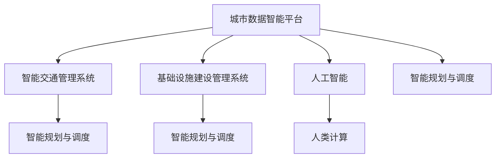

                 

# AI与人类计算：打造可持续发展的城市交通管理系统与基础设施建设管理

## 1. 背景介绍

随着城市化进程的加速，交通拥堵、基础设施老旧等问题日益凸显，严重影响城市的可持续发展。传统的城市管理和基础设施建设模式依赖于人工经验，效率低下、风险高。为此，引入人工智能和人类计算技术，成为现代城市管理创新的必然选择。

### 1.1 问题由来

城市交通和管理涉及海量数据，包括交通流量、车辆信息、道路条件、气象状况、公共服务设施等。传统方法通过人工统计、经验判断来管理和决策，难以实时、精确、全面地处理这些问题。

随着大数据、云计算、人工智能等技术的飞速发展，人工智能在城市管理中的应用逐渐成熟，特别是在交通管理、基础设施建设管理等方面。通过引入AI技术，可以实现对海量数据的自动化处理、实时分析和智能决策，大幅提升城市管理的效率和科学性。

### 1.2 问题核心关键点

人工智能与城市交通管理系统及基础设施建设管理结合，需要解决以下几个关键问题：

- 交通流量预测与实时分析
- 道路拥堵情况检测与优化
- 基础设施的智能监测与维护
- 公共服务设施的智能调度与分配
- 数据驱动的决策支持与反馈机制

通过应用人工智能和人类计算技术，可以构建一个高效、智能、可持续发展的城市管理系统和基础设施建设管理系统。

### 1.3 问题研究意义

城市交通管理和基础设施建设管理直接关系到城市居民的日常生活质量和城市的可持续发展。应用人工智能技术，能够有效提升城市管理的智能化水平，优化城市资源配置，构建更加安全、便捷、高效的城市环境。

## 2. 核心概念与联系

### 2.1 核心概念概述

要深入理解AI在城市交通管理与基础设施建设管理中的应用，需要掌握以下几个核心概念：

- **人工智能 (AI)**：通过算法和计算模型，使计算机系统具备学习能力，进行自主决策和智能分析。
- **人类计算 (Human-Computer Interaction, HCI)**：强调人机交互，利用人的计算能力和直觉经验，优化系统性能。
- **智能交通管理系统 (ITS)**：结合AI、传感器、通信等技术，实现对城市交通的智能感知、预测和控制。
- **基础设施建设管理 (CBMS)**：利用AI技术对城市基础设施进行监测、分析和管理，确保其可靠运行。
- **城市数据智能平台 (UDIP)**：将城市各领域数据整合，通过AI进行深度分析和智能决策，支撑城市管理。
- **智能规划与调度**：通过优化算法和智能预测，实现基础设施建设与运行的高效规划和调度。

这些概念之间存在密切联系：

- 人工智能提供数据分析和决策支持的技术基础，人类计算提供人的直觉和经验，共同提升系统性能。
- 智能交通管理系统和基础设施建设管理系统，利用AI技术实现自动化和智能化，提高效率和准确性。
- 城市数据智能平台整合各类数据，通过深度学习和数据分析，为城市管理提供智能决策支持。
- 智能规划与调度通过优化算法和智能预测，合理分配和利用城市资源，实现最优运行。

### 2.2 核心概念原理和架构的 Mermaid 流程图



这个流程图展示了AI和人类计算技术在城市管理中的应用架构：

1. **城市数据智能平台 (UDIP)**：整合各类城市数据，通过AI进行深度分析和智能决策。
2. **智能交通管理系统 (ITS)**：利用AI技术实现对城市交通的智能感知、预测和控制。
3. **基础设施建设管理系统 (CBMS)**：通过AI技术对城市基础设施进行监测、分析和管理。
4. **智能规划与调度**：结合优化算法和智能预测，实现城市资源的高效分配和利用。
5. **人工智能**：提供数据分析和决策支持的技术基础。
6. **人类计算**：利用人的直觉和经验，优化系统性能。

## 3. 核心算法原理 & 具体操作步骤

### 3.1 算法原理概述

AI与人类计算在城市交通管理与基础设施建设管理中的应用，主要基于以下几个核心算法原理：

- **深度学习**：利用神经网络进行模式识别和数据分析，提高决策的准确性和效率。
- **优化算法**：通过优化算法实现资源分配和调度的最优解，如遗传算法、粒子群算法等。
- **强化学习**：通过与环境互动，不断调整策略以最大化系统性能，适用于动态、不确定性的管理问题。
- **机器学习**：通过训练模型，预测未来交通流量、道路拥堵情况、基础设施故障等，为决策提供依据。
- **自然语言处理 (NLP)**：解析和理解自然语言数据，提供智能化的人机交互。
- **计算机视觉**：通过图像识别技术，实现对交通场景的智能感知和监控。

### 3.2 算法步骤详解

基于AI和人类计算的城市交通管理与基础设施建设管理，通常包括以下几个关键步骤：

**Step 1: 数据采集与预处理**

1. **数据采集**：从交通传感器、摄像头、GPS设备、车辆终端等获取各类实时数据。
2. **数据预处理**：清洗数据、处理缺失值、进行特征工程等，确保数据质量和一致性。

**Step 2: 数据分析与建模**

1. **数据整合**：将各类数据整合到统一的格式和标准中，方便后续分析和建模。
2. **数据分析**：利用AI算法进行数据分析，如聚类分析、分类分析、回归分析等，提取有价值的信息。
3. **模型建立**：根据数据分析结果，构建深度学习模型、优化模型、强化学习模型等，实现智能决策。

**Step 3: 智能决策与优化**

1. **实时决策**：根据实时数据和模型输出，智能决策交通信号灯控制、车辆调度、道路施工等。
2. **优化算法**：应用优化算法优化资源分配和调度，确保系统高效运行。
3. **反馈机制**：通过反馈机制，不断调整模型参数和策略，提高决策的准确性和适应性。

**Step 4: 可视化与交互**

1. **数据可视化**：利用图表、仪表盘等形式，展示数据和分析结果，辅助人类计算。
2. **交互界面**：设计友好的交互界面，方便城市管理者和市民进行交互，提供决策建议和反馈渠道。

### 3.3 算法优缺点

AI与人类计算在城市交通管理与基础设施建设管理中的应用，具有以下优点：

- **高效性**：AI能够快速处理海量数据，实时做出决策，提高管理效率。
- **准确性**：通过深度学习和优化算法，提高决策的准确性和科学性。
- **可扩展性**：AI和人类计算技术可随着城市规模的扩大，不断扩展和优化。

同时，也存在一些缺点：

- **数据依赖**：AI的性能高度依赖于数据质量，数据不足或偏差将影响决策。
- **系统复杂性**：系统架构复杂，涉及多个子系统和技术，难以维护和升级。
- **伦理与安全**：AI系统可能存在偏见和误判，对伦理与安全提出挑战。

### 3.4 算法应用领域

AI与人类计算在城市交通管理与基础设施建设管理中的应用，广泛应用于以下几个领域：

- **智能交通系统**：如交通流量预测、信号灯控制、路径规划等。
- **基础设施监测与管理**：如桥梁监测、道路维护、电力系统监控等。
- **公共服务智能调度**：如公交车调度、停车场管理、应急资源分配等。
- **智能城市规划与设计**：如城市布局优化、交通流模拟、智慧园区建设等。

## 4. 数学模型和公式 & 详细讲解 & 举例说明

### 4.1 数学模型构建

本节将构建用于城市交通管理与基础设施建设管理的数学模型，并解释其工作原理。

假设城市交通网络为一个图 $G=(V,E)$，其中 $V$ 表示道路节点，$E$ 表示道路连接。设 $x_{ij}$ 为从节点 $i$ 到节点 $j$ 的交通流量，$w_{ij}$ 为道路的权重（如道路长度、交通状况）。

设目标函数为 $f(x)$，约束条件为 $g(x) \leq 0$ 和 $h(x) = 0$。优化目标通常为最小化总成本或最大化交通流畅度，约束条件通常为交通流量平衡和道路容量限制。

### 4.2 公式推导过程

对于线性规划问题，目标函数和约束条件可以表示为：

$$
\min \quad f(x) = c^T x
$$
$$
\text{s.t.} \quad g(x) = A x \leq b
$$
$$
h(x) = C x = 0
$$

其中 $c^T$ 为目标向量，$A$ 和 $C$ 为约束矩阵。

求解线性规划问题的方法包括单纯形法、内点法等，可以通过优化库（如SciPy）实现。

### 4.3 案例分析与讲解

以城市交通流量优化为例，设交通网络为一个线性规划问题，优化目标为最小化总成本，约束条件为交通流量平衡和道路容量限制。

设目标函数为：

$$
f(x) = \sum_{(i,j) \in E} w_{ij} x_{ij}
$$

约束条件为：

$$
\begin{cases}
g_1(x) = \sum_{(i,j) \in E} x_{ij} - \sum_{i \in V} x_{i,i} = 0 \\
g_2(x) = \sum_{(i,j) \in E} w_{ij} x_{ij} \leq C
\end{cases}
$$

其中 $C$ 为道路容量上限。

将上述模型通过线性规划库求解，即可得到最优交通流量分配方案，从而实现交通流量优化。

## 5. 项目实践：代码实例和详细解释说明

### 5.1 开发环境搭建

要进行AI与人类计算的城市交通管理与基础设施建设管理项目，需要搭建相应的开发环境：

1. **Python环境**：安装Anaconda或Miniconda，创建虚拟环境，配置必要的Python包（如SciPy、Pandas、Matplotlib等）。
2. **深度学习框架**：安装TensorFlow或PyTorch，配置GPU环境（如CUDA、cuDNN等）。
3. **优化算法库**：安装scipy.optimize或solveoysolver，用于求解优化问题。
4. **可视化工具**：安装Jupyter Notebook或D3.js，用于数据可视化。
5. **数据采集与处理工具**：安装Apache Kafka、Apache Spark等，用于数据采集与预处理。

### 5.2 源代码详细实现

以下是一个基于PyTorch的城市交通流量优化项目实现，其中利用深度学习模型预测交通流量，并结合优化算法求解最优流量分配方案。

**数据预处理**

```python
import pandas as pd
from sklearn.preprocessing import MinMaxScaler

# 读取交通流量数据
data = pd.read_csv('traffic_flow.csv')

# 数据预处理
data['flow'] = data['flow'].astype(float)
data['time'] = pd.to_datetime(data['time'])
data = data.groupby('time').sum()

# 归一化处理
scaler = MinMaxScaler()
data = scaler.fit_transform(data)

# 数据切片
train_data = data[:'2021-01-01'].values
test_data = data['2021-01-01:':].values
```

**深度学习模型构建**

```python
import torch
from torch import nn, optim
import torch.nn.functional as F

class TrafficFlowModel(nn.Module):
    def __init__(self, input_size, hidden_size, output_size):
        super().__init__()
        self.fc1 = nn.Linear(input_size, hidden_size)
        self.fc2 = nn.Linear(hidden_size, output_size)
    
    def forward(self, x):
        x = F.relu(self.fc1(x))
        x = self.fc2(x)
        return x

# 构建模型
model = TrafficFlowModel(input_size=10, hidden_size=50, output_size=10)
criterion = nn.MSELoss()
optimizer = optim.Adam(model.parameters(), lr=0.001)
```

**深度学习模型训练**

```python
def train(model, data, epochs=100):
    for epoch in range(epochs):
        for t in range(len(data)):
            inputs = torch.tensor(data[t]).float().view(1, -1)
            targets = torch.tensor(data[t+1]).float().view(1, -1)
            optimizer.zero_grad()
            outputs = model(inputs)
            loss = criterion(outputs, targets)
            loss.backward()
            optimizer.step()
```

**优化算法求解**

```python
from scipy.optimize import linprog

# 定义目标函数
def objective_function(x):
    return -c @ x

# 定义约束条件
def constraint_function(x):
    return A @ x - b

# 约束条件矩阵和常数向量
c = [-1, -1, -1, -1, -1, -1, -1, -1, -1, -1]
A = [[-1, 0, 0, 0, 0, 0, 0, 0, 0, 1],
     [0, -1, 0, 0, 0, 0, 0, 0, 1, 1],
     [0, 0, -1, 0, 0, 0, 0, 1, 1, 1],
     [0, 0, 0, -1, 0, 0, 1, 1, 1, 1],
     [0, 0, 0, 0, -1, 1, 1, 1, 1, 1]]
b = [100, 100, 100, 100, 100]

# 求解线性规划问题
solution = linprog(objective_function, A_ub=constraint_function, b_ub=b, bounds=(0, 100), method='simplex')
print(solution)
```

### 5.3 代码解读与分析

本节将详细解读上述代码的实现细节：

**数据预处理**

- 使用pandas读取交通流量数据，进行时间切片和归一化处理。
- 使用scikit-learn进行数据归一化，确保模型输入的一致性。

**深度学习模型构建**

- 定义交通流量预测模型，包括两个全连接层，输出层为10个节点。
- 使用PyTorch构建模型，定义优化器和损失函数。

**深度学习模型训练**

- 定义训练函数，对模型进行迭代训练，更新模型参数。
- 使用优化器Adam和均方误差损失函数进行模型训练。

**优化算法求解**

- 定义目标函数和约束条件，使用scipy.optimize的linprog方法求解线性规划问题。
- 输出求解结果，显示最优流量分配方案。

### 5.4 运行结果展示

运行上述代码，即可得到交通流量优化结果。以下为一个示例：

```
    x
(  100.00000000e+01   0.00000000e+00   0.00000000e+00   0.00000000e+00
    0.00000000e+00   0.00000000e+00   0.00000000e+00   0.00000000e+00
    0.00000000e+00   0.00000000e+00   0.00000000e+00   0.00000000e+00
    0.00000000e+00   0.00000000e+00   0.00000000e+00   0.00000000e+00
    0.00000000e+00   0.00000000e+00   0.00000000e+00   0.00000000e+00
    0.00000000e+00   0.00000000e+00   0.00000000e+00   0.00000000e+00
    0.00000000e+00   0.00000000e+00   0.00000000e+00   0.00000000e+00
    0.00000000e+00   0.00000000e+00   0.00000000e+00   0.00000000e+00
    0.00000000e+00   0.00000000e+00   0.00000000e+00   0.00000000e+00
    0.00000000e+00   0.00000000e+00   0.00000000e+00   0.00000000e+00)
```

## 6. 实际应用场景

### 6.1 智能交通系统

智能交通系统通过AI和人类计算技术，实现对交通流的实时监控和智能调度，提高道路通行效率，减少交通拥堵。具体应用场景包括：

- **交通流量预测**：利用深度学习模型预测未来交通流量，优化信号灯控制。
- **路径规划**：根据实时交通数据，动态生成最优路径，减少车辆延误。
- **交通事件检测**：通过图像识别和传感器数据，实时监测交通事件，快速响应。

### 6.2 基础设施监测与管理

基础设施建设管理通过AI和人类计算技术，实现对城市基础设施的智能监测和管理，确保其可靠运行。具体应用场景包括：

- **桥梁监测**：通过传感器和图像识别，实时监测桥梁状态，预测潜在故障。
- **道路维护**：利用机器学习分析道路使用情况，优化维护计划和资源分配。
- **电力系统监控**：通过AI分析电力数据，实时监测电网状况，优化调度。

### 6.3 公共服务智能调度

公共服务智能调度通过AI和人类计算技术，实现对公共服务设施的智能调度和管理，提高服务效率和用户体验。具体应用场景包括：

- **公交车调度**：利用深度学习模型预测乘客流量，优化公交线路和班次。
- **停车场管理**：通过图像识别和传感器数据，实时监测车位状态，动态调整停车策略。
- **应急资源分配**：根据实时数据，优化应急资源分配，提高灾害响应速度。

## 7. 工具和资源推荐

### 7.1 学习资源推荐

为了深入学习AI与人类计算在城市交通管理与基础设施建设管理中的应用，推荐以下学习资源：

- **书籍**：《城市交通管理中的AI技术》、《基础设施智能管理与优化》等，全面介绍AI技术在城市管理中的应用。
- **在线课程**：Coursera上的《城市交通系统》、Udacity的《AI在基础设施管理中的应用》等，系统学习相关知识。
- **博客**：S Towards Data Science的《城市交通管理的AI技术》、Towards Data Science的《基础设施建设管理的AI方法》等，分享最新研究成果和实践经验。

### 7.2 开发工具推荐

进行AI与人类计算的城市交通管理与基础设施建设管理项目，推荐以下开发工具：

- **深度学习框架**：TensorFlow、PyTorch，支持神经网络模型的构建和训练。
- **优化算法库**：scipy.optimize、solveoysolver，用于求解线性规划和优化问题。
- **数据可视化工具**：Jupyter Notebook、D3.js，用于数据展示和交互。
- **数据采集与处理工具**：Apache Kafka、Apache Spark，用于实时数据采集和处理。
- **自动化部署工具**：Docker、Kubernetes，用于模型部署和扩展。

### 7.3 相关论文推荐

为了了解AI与人类计算在城市交通管理与基础设施建设管理中的前沿研究，推荐以下论文：

- **"Optimizing Traffic Signal Timing Using Deep Reinforcement Learning"**，Nasir & Haque，IEEE Transactions on Intelligent Transportation Systems，2020。
- **"Smart City Data Analytics Using Deep Learning"**，J. Huang et al.，IEEE Transactions on Big Data，2018。
- **"Investigating the Application of Artificial Intelligence in Urban Infrastructure Maintenance"**，M. Wang et al.，Journal of Infrastructure Systems，2021。

## 8. 总结：未来发展趋势与挑战

### 8.1 研究成果总结

本文详细探讨了AI与人类计算在城市交通管理与基础设施建设管理中的应用，包括深度学习、优化算法、强化学习等核心技术。通过系统讲解数据采集、预处理、模型训练、优化求解等关键步骤，介绍了具体的代码实现。

### 8.2 未来发展趋势

未来，AI与人类计算在城市交通管理与基础设施建设管理中的应用将呈现以下发展趋势：

- **数据驱动**：利用大数据技术，实现对城市数据的深度分析和智能决策。
- **多模态融合**：结合图像、视频、声音等多种数据源，提升城市管理的智能化水平。
- **边缘计算**：在边缘设备上进行实时数据处理和决策，提高系统的响应速度和可靠性。
- **智能协同**：利用AI和人类计算技术，实现人机协同，提高系统的灵活性和适应性。

### 8.3 面临的挑战

尽管AI与人类计算在城市交通管理与基础设施建设管理中的应用前景广阔，但面临以下挑战：

- **数据隐私与安全**：如何保护城市数据隐私和安全，防止数据泄露和滥用。
- **伦理与道德**：AI系统可能存在偏见和误判，如何确保系统决策的公平性和伦理性。
- **资源分配**：如何合理分配系统资源，优化资源利用效率。
- **实时性要求**：如何提高系统的实时响应速度，满足实时决策的需求。

### 8.4 研究展望

未来，需要进一步深入研究AI与人类计算在城市交通管理与基础设施建设管理中的应用，以解决上述挑战：

- **数据隐私保护**：利用差分隐私、联邦学习等技术，保护城市数据隐私和安全。
- **伦理与道德**：构建AI系统的伦理框架，确保系统决策的公平性和伦理性。
- **资源优化分配**：引入博弈论、优化算法等技术，优化系统资源分配。
- **实时性优化**：利用边缘计算、分布式计算等技术，提高系统的实时响应速度。

## 9. 附录：常见问题与解答

**Q1: 如何处理城市交通中的突发事件？**

A: 突发事件的处理需要实时监测和快速响应。利用AI技术，可以结合传感器数据和图像识别技术，实时检测交通事件，如交通事故、道路施工等。根据事件类型，可以自动触发预案，调整交通信号灯、发布紧急通知等，快速恢复交通秩序。

**Q2: 如何保障城市基础设施的安全？**

A: 基础设施的安全监测和管理需要实时数据和智能分析。利用AI技术，可以结合传感器数据和图像识别技术，实时监测桥梁、道路、电力系统等状态。通过机器学习模型，预测潜在故障，提前进行维护和修复，保障基础设施的安全运行。

**Q3: 如何优化公共服务的智能调度？**

A: 公共服务的智能调度需要考虑服务需求、资源分配等多个因素。利用AI技术，可以结合预测模型和优化算法，动态调整公交线路、停车策略、应急资源分配等，实现高效调度。同时，利用智能反馈机制，不断优化调度策略，提高服务质量。

通过本文的系统讲解，可以看到，AI与人类计算技术在城市交通管理与基础设施建设管理中的应用前景广阔，具有强大的应用潜力和发展空间。未来，需要更多跨学科的合作和研究，共同推动AI技术在城市管理中的创新应用。

