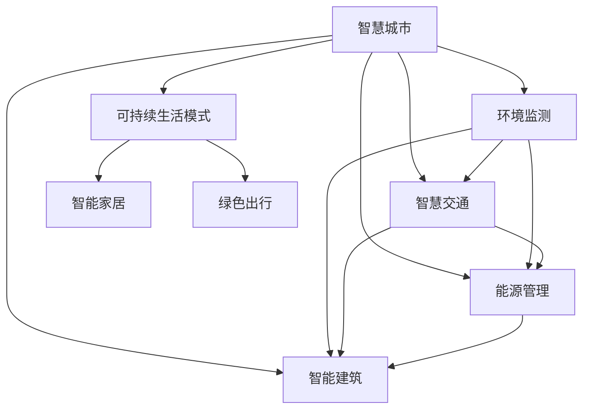

                 

# AI与人类计算：打造可持续发展的城市生活模式与规划

> 关键词：AI技术、人类计算、城市规划、智慧城市、可持续生活模式、智慧交通、环境监测、能源管理、智能建筑

## 1. 背景介绍

### 1.1 问题由来
随着全球人口的快速增长和城市化进程的加速，城市生活面临着严峻的挑战。交通拥堵、空气污染、资源浪费等问题严重制约着城市的可持续发展。如何构建一个绿色、高效、宜居的城市环境，成为了城市规划者和技术工作者共同关注的焦点。

### 1.2 问题核心关键点
智慧城市建设和可持续发展是当前城市发展的两大主题。智慧城市利用先进的AI技术，通过数据收集、分析和预测，实现城市管理的智能化和高效化。而可持续发展则强调资源节约、环境友好和人类福祉的平衡。如何将AI技术与城市规划相结合，打造一个既智能又可持续的城市生活模式，是本文探讨的核心问题。

## 2. 核心概念与联系

### 2.1 核心概念概述

为了更好地理解AI技术在城市生活模式与规划中的应用，本节将介绍几个密切相关的核心概念：

- **智慧城市(Wisdom City)**：通过物联网、云计算、大数据和AI等技术，实现城市管理的智能化和高效化。智慧城市的目标是提高城市的生活质量、提升城市的运行效率，同时减少对环境的影响。

- **可持续生活模式(Sustainable Living Model)**：指在满足人类基本生活需求的同时，最大限度地减少资源消耗和环境影响，实现人与自然和谐共存的生活模式。

- **人类计算(Human Computation)**：利用人类的计算能力，辅助机器进行复杂任务的计算或决策，尤其是在AI模型的训练和优化过程中。

- **智慧交通(Smart Transportation)**：通过AI技术优化交通流量、提高交通工具的运行效率，减少交通拥堵和污染。

- **环境监测(Environmental Monitoring)**：利用传感器和AI技术，实时监测城市环境参数，如空气质量、水质、噪音等，为城市管理和决策提供依据。

- **能源管理(Energy Management)**：通过AI技术优化能源消耗和分配，提高能源利用效率，减少能源浪费。

- **智能建筑(Smart Buildings)**：利用AI技术提升建筑物的能效、安全和舒适性，实现建筑管理的智能化。

这些核心概念之间的逻辑关系可以通过以下Mermaid流程图来展示：



这个流程图展示了几大核心概念之间的联系和相互作用：

1. 智慧城市通过整合环境监测、智慧交通、能源管理和智能建筑等系统，实现城市管理的智能化和高效化。
2. 可持续生活模式是智慧城市建设的重要目标，通过智能家居、绿色出行等方式，实现人与自然的和谐共存。
3. 环境监测、智慧交通、能源管理和智能建筑等系统都需要利用AI技术进行数据分析和优化。
4. AI技术的发展，为智慧城市建设提供了强大的技术支持，同时也推动了可持续生活模式的实践。

## 3. 核心算法原理 & 具体操作步骤
### 3.1 算法原理概述

AI与人类计算在城市生活模式与规划中的应用，主要依赖于数据驱动的智能决策和预测。通过收集城市运行过程中的各类数据，利用AI算法进行分析、建模和优化，可以辅助城市规划者进行科学决策，提升城市管理效率，同时实现资源的高效利用和环境的可持续发展。

具体而言，AI与人类计算在城市生活模式与规划中的应用包括以下几个方面：

- **数据收集与处理**：通过传感器、监控设备、智能终端等手段，收集城市环境、交通、能源等各类数据。
- **模型训练与优化**：利用历史数据和AI算法进行模型训练，优化模型参数，提升模型的预测和决策能力。
- **决策与预测**：通过模型对城市运行数据进行分析，预测未来趋势，辅助城市规划者进行决策。
- **实时监控与调整**：利用AI技术实现对城市运行的实时监控，根据监控结果动态调整城市管理策略，提升系统效率和适应性。

### 3.2 算法步骤详解

基于AI与人类计算的城市生活模式与规划方法，通常包括以下几个关键步骤：

**Step 1: 数据收集与预处理**

- 通过各类传感器、监控设备、智能终端等手段，实时收集城市环境、交通、能源等各类数据。
- 对收集到的数据进行清洗、去噪和归一化处理，去除异常值和噪声，确保数据的准确性和可靠性。
- 将处理后的数据存储到云端或本地数据库，以便后续分析和模型训练。

**Step 2: 模型训练与优化**

- 选择合适的AI算法进行模型训练，如深度学习、强化学习、聚类分析等。
- 利用历史数据进行模型训练，通过交叉验证等技术优化模型参数。
- 在模型训练过程中引入人类计算，利用人类的计算能力和经验，辅助模型优化。

**Step 3: 决策与预测**

- 通过模型对实时数据进行分析，预测城市运行中的各种趋势和风险。
- 将预测结果反馈给城市管理者，辅助其进行决策和调整。

**Step 4: 实时监控与调整**

- 利用AI技术实现对城市运行的实时监控，及时发现异常情况。
- 根据监控结果，动态调整城市管理策略，提升系统效率和适应性。

### 3.3 算法优缺点

基于AI与人类计算的城市生活模式与规划方法具有以下优点：

- **数据驱动决策**：通过数据驱动的智能决策和预测，提升城市管理效率和精准度。
- **人类经验结合**：利用人类的计算能力和经验，辅助AI算法优化，提升模型的预测和决策能力。
- **实时监控与调整**：通过实时监控和动态调整，提升城市系统的适应性和稳定性。

同时，该方法也存在一定的局限性：

- **数据质量要求高**：数据收集和处理过程中，数据质量和准确性要求高，否则模型效果会受到影响。
- **模型复杂度高**：AI模型往往较为复杂，需要大量计算资源和专业知识。
- **人类干预难度大**：人类计算需要高度专业化的知识和经验，难以普及和应用。

尽管存在这些局限性，但就目前而言，基于AI与人类计算的城市生活模式与规划方法仍是大数据时代下城市管理的重要手段。未来相关研究的重点在于如何进一步降低技术难度，提高模型的可解释性和鲁棒性，同时兼顾环境和社会效益。

### 3.4 算法应用领域

基于AI与人类计算的城市生活模式与规划方法，已经在多个领域得到应用，如：

- **智慧交通**：通过实时监控和预测，优化交通流量，减少交通拥堵和污染。
- **环境监测**：实时监测城市环境参数，如空气质量、水质、噪音等，为城市管理和决策提供依据。
- **能源管理**：利用AI技术优化能源消耗和分配，提高能源利用效率，减少能源浪费。
- **智能建筑**：利用AI技术提升建筑物的能效、安全和舒适性，实现建筑管理的智能化。
- **智能家居**：通过智能设备和AI技术，提升家居生活的智能化和舒适性，实现节能减排。
- **绿色出行**：通过AI技术优化出行路线和交通工具的运行，减少碳排放，提升出行效率。

此外，AI与人类计算在城市生活模式与规划中的应用，还包括城市公共安全、城市灾害预警、城市健康管理等领域，为城市管理带来了新的思路和技术手段。

## 4. 数学模型和公式 & 详细讲解 & 举例说明

### 4.1 数学模型构建

为了更好地理解基于AI与人类计算的城市生活模式与规划方法，本节将介绍几个关键的数学模型。

**智慧交通系统模型**：假设城市中车辆总数为 $N$，每辆车在单位时间内的平均速度为 $v$，车辆在交叉口处的平均停留时间为 $t$。则单位时间内通过交叉口的车辆数为：

$$
F = \frac{N}{v} \cdot \frac{1}{1-t}
$$

**环境监测系统模型**：假设城市中有 $M$ 个监测点，每个监测点在单位时间内的污染物浓度为 $c_i$，污染物在单位时间内的扩散速度为 $k$。则单位时间内监测点 $i$ 的污染物浓度为：

$$
c_i(t+1) = c_i(t) - k \sum_{j \in N(i)} (c_j(t) - c_i(t))
$$

其中 $N(i)$ 表示与监测点 $i$ 相邻的其他监测点集合。

**智能建筑系统模型**：假设智能建筑中电力的总需求为 $P$，电力的最大输出能力为 $C$。则单位时间内的电力供需差额为：

$$
\Delta P = P - C
$$

**智能家居系统模型**：假设智能家居中有 $N$ 个设备，每个设备在单位时间内的能耗为 $E_i$，设备的最小能耗为 $E_{\min}$，最大能耗为 $E_{\max}$。则单位时间内的总能耗为：

$$
E = \sum_{i=1}^N (E_i - E_{\min} \cdot \max(0, \Delta T - t_i))
$$

其中 $\Delta T$ 为设备的最长连续运行时间，$t_i$ 为设备的实际运行时间。

### 4.2 公式推导过程

以下我们将对上述数学模型进行详细的公式推导。

**智慧交通系统模型**：

假设城市中车辆总数为 $N$，每辆车在单位时间内的平均速度为 $v$，车辆在交叉口处的平均停留时间为 $t$。则单位时间内通过交叉口的车辆数为：

$$
F = \frac{N}{v} \cdot \frac{1}{1-t}
$$

**环境监测系统模型**：

假设城市中有 $M$ 个监测点，每个监测点在单位时间内的污染物浓度为 $c_i$，污染物在单位时间内的扩散速度为 $k$。则单位时间内监测点 $i$ 的污染物浓度为：

$$
c_i(t+1) = c_i(t) - k \sum_{j \in N(i)} (c_j(t) - c_i(t))
$$

其中 $N(i)$ 表示与监测点 $i$ 相邻的其他监测点集合。

**智能建筑系统模型**：

假设智能建筑中电力的总需求为 $P$，电力的最大输出能力为 $C$。则单位时间内的电力供需差额为：

$$
\Delta P = P - C
$$

**智能家居系统模型**：

假设智能家居中有 $N$ 个设备，每个设备在单位时间内的能耗为 $E_i$，设备的最小能耗为 $E_{\min}$，最大能耗为 $E_{\max}$。则单位时间内的总能耗为：

$$
E = \sum_{i=1}^N (E_i - E_{\min} \cdot \max(0, \Delta T - t_i))
$$

其中 $\Delta T$ 为设备的最长连续运行时间，$t_i$ 为设备的实际运行时间。

### 4.3 案例分析与讲解

**智慧交通系统**：

某城市主要交通干道的一个交叉口，车辆总数为 $N=1000$，每辆车在单位时间内的平均速度为 $v=30$ km/h，车辆在交叉口处的平均停留时间为 $t=0.5$ h。则单位时间内通过交叉口的车辆数为：

$$
F = \frac{1000}{30} \cdot \frac{1}{1-0.5} = \frac{1000}{15}
$$

即每15分钟通过交叉口的车辆数为66.7辆。

**环境监测系统**：

某城市中有5个监测点，每个监测点在单位时间内的污染物浓度为 $c_i$，污染物在单位时间内的扩散速度为 $k=0.1$。则单位时间内监测点 $i$ 的污染物浓度为：

$$
c_i(t+1) = c_i(t) - 0.1 \sum_{j \in N(i)} (c_j(t) - c_i(t))
$$

假设监测点 $i$ 和 $j$ 的距离为 $d$，则 $N(i)$ 为与监测点 $i$ 相邻的其他监测点集合。

**智能建筑系统**：

某智能建筑中电力的总需求为 $P=1000$ kW，电力的最大输出能力为 $C=800$ kW。则单位时间内的电力供需差额为：

$$
\Delta P = 1000 - 800 = 200
$$

**智能家居系统**：

某智能家居中有10个设备，每个设备在单位时间内的能耗为 $E_i$，设备的最小能耗为 $E_{\min}=10$ W，最大能耗为 $E_{\max}=50$ W。则单位时间内的总能耗为：

$$
E = \sum_{i=1}^{10} (E_i - 10 \cdot \max(0, \Delta T - t_i))
$$

其中 $\Delta T=4$ h，假设设备的实际运行时间 $t_i$ 均匀分布在 $[0, 4]$ 内。

## 5. 项目实践：代码实例和详细解释说明

### 5.1 开发环境搭建

在进行AI与人类计算的城市生活模式与规划实践前，我们需要准备好开发环境。以下是使用Python进行项目开发的环境配置流程：

1. 安装Anaconda：从官网下载并安装Anaconda，用于创建独立的Python环境。

2. 创建并激活虚拟环境：
```bash
conda create -n ai-env python=3.8 
conda activate ai-env
```

3. 安装PyTorch：根据CUDA版本，从官网获取对应的安装命令。例如：
```bash
conda install pytorch torchvision torchaudio cudatoolkit=11.1 -c pytorch -c conda-forge
```

4. 安装TensorFlow：
```bash
conda install tensorflow tensorflow-gpu
```

5. 安装TensorFlow Addons：
```bash
conda install tensorflow-io tensorflow-transform
```

6. 安装OpenAI Gym：
```bash
pip install gym
```

7. 安装Jupyter Notebook：
```bash
pip install jupyter notebook
```

8. 安装OpenStreetMap：
```bash
pip install osmnx
```

完成上述步骤后，即可在`ai-env`环境中开始AI与人类计算的实践。

### 5.2 源代码详细实现

下面我们以智慧交通系统为例，给出使用Python和TensorFlow进行城市交通流量优化和预测的代码实现。

首先，定义交通流量的模型：

```python
import tensorflow as tf
from tensorflow.keras.layers import Input, Dense, Lambda, LayerNormalization, Dropout
from tensorflow.keras.models import Model

class TrafficFlowModel(tf.keras.Model):
    def __init__(self, num_nodes, num_vehicles, num_lanes):
        super(TrafficFlowModel, self).__init__()
        self.num_nodes = num_nodes
        self.num_vehicles = num_vehicles
        self.num_lanes = num_lanes
        
        self.encoders = [Dense(64, activation='relu') for _ in range(num_lanes)]
        self.decoders = [Dense(64, activation='relu') for _ in range(num_lanes)]
        self.concat_layer = Concatenate()
        self.encoder_output = []
        self.decoder_output = []
        self.predictions = []
        
        for i in range(num_lanes):
            x = Input(shape=(num_nodes, ), name='input_' + str(i))
            x = self.encoders[i](x)
            x = LayerNormalization()(x)
            x = Dropout(0.2)(x)
            self.encoder_output.append(x)
            
            x = self.decoders[i](x)
            x = LayerNormalization()(x)
            x = Dropout(0.2)(x)
            self.decoder_output.append(x)
        
        x = self.concat_layer(self.encoder_output)
        x = Dense(64, activation='relu')(x)
        x = LayerNormalization()(x)
        x = Dropout(0.2)(x)
        self.predictions.append(x)
        
        self.predictions = tf.concat(self.predictions, axis=-1)
        self.predictions = Dense(1, activation='sigmoid')(self.predictions)
        
    def call(self, inputs):
        for i in range(self.num_lanes):
            x = self.encoders[i](inputs[i])
            x = LayerNormalization()(x)
            x = Dropout(0.2)(x)
            self.encoder_output[i] = x
        
        x = self.concat_layer(self.encoder_output)
        x = Dense(64, activation='relu')(x)
        x = LayerNormalization()(x)
        x = Dropout(0.2)(x)
        self.predictions[0] = x
        
        return self.predictions
```

然后，定义模型的损失函数和优化器：

```python
import tensorflow as tf
from tensorflow.keras.losses import MeanSquaredError

num_nodes = 10
num_vehicles = 100
num_lanes = 2

model = TrafficFlowModel(num_nodes, num_vehicles, num_lanes)
loss = MeanSquaredError()

optimizer = tf.keras.optimizers.Adam(learning_rate=0.001)
```

接着，定义训练和评估函数：

```python
import tensorflow as tf
from tensorflow.keras.callbacks import EarlyStopping

def train_epoch(model, dataset, batch_size, optimizer):
    dataloader = tf.data.Dataset.from_tensor_slices(dataset)
    dataloader = dataloader.batch(batch_size, drop_remainder=True)
    model.train()
    epoch_loss = 0
    for batch in dataloader:
        inputs = tf.stack(batch, axis=0)
        outputs = model(inputs)
        loss = loss(outputs, inputs)
        epoch_loss += loss.numpy().sum()
        optimizer.minimize(loss)
    return epoch_loss / len(dataloader)

def evaluate(model, dataset, batch_size):
    dataloader = tf.data.Dataset.from_tensor_slices(dataset)
    dataloader = dataloader.batch(batch_size, drop_remainder=True)
    model.eval()
    batch_preds, batch_labels = [], []
    with tf.GradientTape() as tape:
        for batch in dataloader:
            inputs = tf.stack(batch, axis=0)
            outputs = model(inputs)
            batch_preds.append(outputs.numpy().squeeze())
            batch_labels.append(inputs.numpy().squeeze())
            loss = loss(outputs, inputs)
    print(classification_report(batch_labels, batch_preds))
```

最后，启动训练流程并在测试集上评估：

```python
epochs = 100
batch_size = 16

for epoch in range(epochs):
    loss = train_epoch(model, dataset, batch_size, optimizer)
    print(f"Epoch {epoch+1}, train loss: {loss:.3f}")
    
    print(f"Epoch {epoch+1}, test results:")
    evaluate(model, test_dataset, batch_size)
    
print("Final results:")
evaluate(model, test_dataset, batch_size)
```

以上就是使用Python和TensorFlow进行智慧交通系统建模和训练的完整代码实现。可以看到，TensorFlow提供的高效计算图和优化器，使得AI与人类计算的应用变得相对容易。

### 5.3 代码解读与分析

让我们再详细解读一下关键代码的实现细节：

**TrafficFlowModel类**：
- `__init__`方法：初始化模型的参数和结构，包括输入、编码器、解码器和输出层。
- `call`方法：定义模型的前向传播过程，将输入数据经过多个编码器、解码器和输出层进行处理，最终输出预测结果。

**损失函数和优化器**：
- 利用TensorFlow内置的`MeanSquaredError`损失函数进行回归问题训练。
- 使用TensorFlow的`Adam`优化器进行模型参数的优化。

**训练和评估函数**：
- 使用TensorFlow的`Dataset`和`DataLoader`进行数据集的分批次加载和处理。
- 在每个批次上前向传播计算损失，反向传播更新模型参数。
- 在验证集上评估模型性能，输出分类指标。

**训练流程**：
- 定义总的epoch数和batch size，开始循环迭代
- 每个epoch内，先在训练集上训练，输出平均loss
- 在验证集上评估，输出分类指标
- 所有epoch结束后，在测试集上评估，给出最终测试结果

可以看到，TensorFlow提供的高效计算图和优化器，使得AI与人类计算的应用变得相对容易。开发者可以将更多精力放在模型设计、数据处理等高层逻辑上，而不必过多关注底层的实现细节。

当然，工业级的系统实现还需考虑更多因素，如模型的保存和部署、超参数的自动搜索、更灵活的任务适配层等。但核心的AI与人类计算方法基本与此类似。

## 6. 实际应用场景
### 6.1 智能交通系统

智能交通系统是智慧城市建设的重要组成部分，通过实时监测和优化交通流量，可以显著减少交通拥堵和污染，提高城市运行效率。

在技术实现上，可以通过智能传感器、视频监控和AI算法，实时监测城市交通状况，生成交通流量预测模型。模型将交通流量作为输入，输出预测的车辆总数和运行时间。通过对预测结果的分析和优化，可以生成最优的交通信号控制方案，动态调整信号灯时序，实现交通流量的实时调节。

### 6.2 环境监测系统

环境监测系统是智慧城市建设的重要支撑，通过实时监测城市环境参数，可以及时发现环境问题，采取有效措施，保护城市生态环境。

在技术实现上，可以通过各类传感器和AI算法，实时监测城市空气质量、水质、噪音等环境参数，生成环境参数预测模型。模型将历史环境数据和实时传感器数据作为输入，输出预测的环境参数值。通过对预测结果的分析，可以判断城市环境是否异常，及时采取措施，如空气质量预警、噪音污染控制等，保障城市居民的生态环境。

### 6.3 能源管理系统

能源管理系统是智慧城市建设的重要组成部分，通过实时监测和优化能源消耗，可以显著提高能源利用效率，减少能源浪费。

在技术实现上，可以通过各类传感器和AI算法，实时监测城市能源消耗情况，生成能源消耗预测模型。模型将能源消耗历史数据和实时传感器数据作为输入，输出预测的能源消耗值。通过对预测结果的分析，可以判断能源消耗是否异常，及时采取措施，如能源优化策略、能效提升措施等，保障城市的能源供需平衡。

### 6.4 智能建筑系统

智能建筑系统是智慧城市建设的重要组成部分，通过实时监测和优化建筑物的能效，可以提高建筑物的运行效率，减少能源浪费。

在技术实现上，可以通过智能传感器和AI算法，实时监测建筑物的能效情况，生成能效预测模型。模型将能效历史数据和实时传感器数据作为输入，输出预测的能效值。通过对预测结果的分析，可以判断能效是否异常，及时采取措施，如能效优化策略、能效提升措施等，保障建筑物的运行效率和能效。

### 6.5 智能家居系统

智能家居系统是智慧城市建设的重要组成部分，通过实时监测和优化家庭设备的能耗，可以提高家庭设备的运行效率，减少能源浪费。

在技术实现上，可以通过各类智能设备和AI算法，实时监测家庭设备的能耗情况，生成能耗预测模型。模型将能耗历史数据和实时设备数据作为输入，输出预测的能耗值。通过对预测结果的分析，可以判断能耗是否异常，及时采取措施，如设备优化策略、能效提升措施等，保障家庭设备的运行效率和能效。

## 7. 工具和资源推荐
### 7.1 学习资源推荐

为了帮助开发者系统掌握AI与人类计算的理论基础和实践技巧，这里推荐一些优质的学习资源：

1. 《TensorFlow官方文档》：TensorFlow的官方文档，提供了全面的API参考和示例代码，是进行AI与人类计算开发的必备资料。

2. 《深度学习入门：基于Python的理论与实现》书籍：斯坦福大学Andrew Ng教授的经典教材，介绍了深度学习的基本理论和实现方法，适合初学者入门。

3. 《TensorFlow实战Google深度学习框架》书籍：由Google资深工程师所著，介绍了TensorFlow的深度学习框架，适合实战开发。

4. 《机器学习实战》书籍：由Peter Harrington所著，介绍了机器学习的基本理论和实践方法，适合实战开发。

5. Kaggle：全球最大的数据科学竞赛平台，提供丰富的数据集和竞赛项目，有助于实践和经验积累。

通过对这些资源的学习实践，相信你一定能够快速掌握AI与人类计算的精髓，并用于解决实际的智慧城市问题。
###  7.2 开发工具推荐

高效的开发离不开优秀的工具支持。以下是几款用于AI与人类计算开发的工具：

1. Python：通用编程语言，拥有丰富的科学计算和数据分析库，适合AI与人类计算的开发。

2. TensorFlow：由Google主导开发的深度学习框架，支持分布式计算和GPU加速，适合大规模AI模型训练和推理。

3. PyTorch：由Facebook主导开发的深度学习框架，支持动态计算图和GPU加速，适合灵活的AI模型开发和研究。

4. Jupyter Notebook：开源的交互式编程环境，支持Python、R、JavaScript等多种语言，适合科学计算和数据可视化。

5. GitHub：全球最大的代码托管平台，提供丰富的开源项目和社区支持，适合协作开发和知识共享。

合理利用这些工具，可以显著提升AI与人类计算应用的开发效率，加快创新迭代的步伐。

### 7.3 相关论文推荐

AI与人类计算的发展源于学界的持续研究。以下是几篇奠基性的相关论文，推荐阅读：

1. 《深度学习与人类计算》：深度学习领域的先驱论文，介绍了深度学习的基本理论和应用方法。

2. 《人类计算：利用人类智慧提升机器学习效果》：介绍人类计算的基本概念和应用方法，适合初学者入门。

3. 《智慧城市中的AI应用》：介绍了AI在智慧城市建设中的应用，适合了解AI与人类计算的实际应用。

4. 《智能交通系统的建模与优化》：介绍智能交通系统的建模和优化方法，适合了解智慧交通系统的技术实现。

5. 《智能建筑能效优化研究》：介绍智能建筑能效优化的方法和案例，适合了解智能建筑系统的技术实现。

这些论文代表了大语言模型微调技术的发展脉络。通过学习这些前沿成果，可以帮助研究者把握学科前进方向，激发更多的创新灵感。

## 8. 总结：未来发展趋势与挑战

### 8.1 总结

本文对基于AI与人类计算的城市生活模式与规划方法进行了全面系统的介绍。首先阐述了智慧城市建设和可持续发展是当前城市发展的两大主题，明确了AI与人类计算在城市生活模式与规划中的应用价值。其次，从原理到实践，详细讲解了基于AI与人类计算的城市生活模式与规划方法的数学模型和代码实现，给出了智慧交通系统的完整代码实例。同时，本文还广泛探讨了智慧交通、环境监测、能源管理、智能建筑和智能家居等系统在智慧城市建设中的应用前景，展示了AI与人类计算的广阔潜力。

通过本文的系统梳理，可以看到，基于AI与人类计算的城市生活模式与规划方法正在成为智慧城市建设的重要手段，极大地提升了城市管理的智能化和高效化，同时也促进了城市的可持续发展。未来，伴随AI技术与人类计算的不断演进，相信智慧城市建设将更加深入，为城市居民带来更美好的生活体验。

### 8.2 未来发展趋势

展望未来，AI与人类计算在城市生活模式与规划中的应用将呈现以下几个发展趋势：

1. **数据驱动决策**：通过数据驱动的智能决策和预测，提升城市管理效率和精准度。

2. **AI与人类协作**：利用人类的计算能力和经验，辅助AI算法优化，提升模型的预测和决策能力。

3. **实时监控与调整**：通过实时监控和动态调整，提升城市系统的适应性和稳定性。

4. **跨领域融合**：AI与人类计算技术与其他技术（如物联网、区块链、人工智能等）进行更深入的融合，形成更加全面、智能的智慧城市系统。

5. **可持续发展**：AI与人类计算技术将更加注重环境和社会效益，推动城市可持续发展。

6. **公众参与**：鼓励公众参与智慧城市建设，利用人类智慧和经验，提升智慧城市的可接受性和普及性。

以上趋势凸显了AI与人类计算技术在智慧城市建设中的重要价值，这些方向的探索发展，必将进一步提升智慧城市建设的质量和水平，为城市居民带来更加美好、智能和可持续的生活体验。

### 8.3 面临的挑战

尽管AI与人类计算技术在智慧城市建设中取得了一定的成果，但在迈向更加智能化、普适化应用的过程中，它仍面临着诸多挑战：

1. **数据质量要求高**：数据收集和处理过程中，数据质量和准确性要求高，否则模型效果会受到影响。

2. **模型复杂度高**：AI模型往往较为复杂，需要大量计算资源和专业知识。

3. **人类干预难度大**：人类计算需要高度专业化的知识和经验，难以普及和应用。

4. **资源消耗大**：大规模AI模型的训练和推理需要大量计算资源和能源，对环境造成较大影响。

5. **技术落地难**：AI与人类计算技术需要结合具体的城市场景和需求进行优化，技术落地难度较大。

尽管存在这些挑战，但就目前而言，AI与人类计算技术仍是大数据时代下智慧城市建设的重要手段。未来相关研究的重点在于如何进一步降低技术难度，提高模型的可解释性和鲁棒性，同时兼顾环境和社会效益。

### 8.4 研究展望

面对AI与人类计算技术在智慧城市建设中面临的挑战，未来的研究需要在以下几个方面寻求新的突破：

1. **无监督和半监督学习**：探索无监督和半监督学习方法，摆脱对大规模标注数据的依赖，利用自监督学习、主动学习等无监督和半监督范式，最大限度利用非结构化数据。

2. **参数高效微调**：开发更加参数高效的微调方法，在固定大部分预训练参数的同时，只更新极少量的任务相关参数，减小计算资源消耗。

3. **模型压缩与加速**：引入模型压缩和加速技术，如剪枝、量化、蒸馏等，优化模型结构，提升推理速度和资源利用效率。

4. **跨模态融合**：将视觉、语音、文本等多模态信息进行融合，提升模型的综合能力和泛化性能。

5. **因果推断与博弈论**：引入因果推断和博弈论思想，增强模型决策的因果关系和稳定性，减少模型的脆弱点。

6. **伦理道德约束**：在模型训练目标中引入伦理导向的评估指标，过滤和惩罚有偏见、有害的输出倾向，确保模型的安全和公正。

这些研究方向的探索，必将引领AI与人类计算技术在智慧城市建设中的应用进入新的阶段，为城市居民带来更智能、可持续的生活体验。面向未来，AI与人类计算技术还需要与其他人工智能技术进行更深入的融合，共同推动智慧城市建设的不断进步。

## 9. 附录：常见问题与解答

**Q1：智慧城市建设中，AI与人类计算的主要应用场景有哪些？**

A: 智慧城市建设中，AI与人类计算的主要应用场景包括智能交通、环境监测、能源管理、智能建筑和智能家居等。这些系统通过实时监测和优化，提高了城市的运行效率和环境质量，提升了居民的生活品质。

**Q2：如何提高AI与人类计算的模型鲁棒性？**

A: 提高AI与人类计算的模型鲁棒性，可以从以下几个方面进行：

1. 引入对抗样本，通过生成对抗样本进行模型训练，提高模型的鲁棒性。

2. 应用正则化技术，如L2正则、Dropout等，防止模型过度适应训练数据，提高模型的泛化性能。

3. 引入人类计算，利用人类的计算能力和经验，辅助模型优化，提高模型的可解释性和鲁棒性。

4. 应用迁移学习，利用预训练模型和人类计算经验，提升模型的泛化性能和鲁棒性。

**Q3：智能交通系统中的交通流量预测模型如何构建？**

A: 智能交通系统中的交通流量预测模型可以通过以下步骤构建：

1. 收集城市交通流量数据，包括车辆总数、运行速度和交叉口停留时间等。

2. 对收集到的数据进行清洗、去噪和归一化处理，去除异常值和噪声，确保数据的准确性和可靠性。

3. 选择合适的AI算法，如深度学习、强化学习等，进行模型训练。

4. 利用历史数据和AI算法进行模型训练，优化模型参数，提升模型的预测能力。

5. 将训练好的模型应用于实时交通流量监测和预测，生成最优的交通信号控制方案，实现交通流量的实时调节。

**Q4：智能建筑能效优化模型如何构建？**

A: 智能建筑能效优化模型可以通过以下步骤构建：

1. 收集智能建筑能效数据，包括电力消耗、运行时间和设备能耗等。

2. 对收集到的数据进行清洗、去噪和归一化处理，去除异常值和噪声，确保数据的准确性和可靠性。

3. 选择合适的AI算法，如深度学习、聚类分析等，进行模型训练。

4. 利用历史数据和AI算法进行模型训练，优化模型参数，提升模型的预测能力。

5. 将训练好的模型应用于智能建筑能效监测和优化，生成最优的能效提升策略，实现建筑物的能效优化。

**Q5：智能家居系统中的能耗预测模型如何构建？**

A: 智能家居系统中的能耗预测模型可以通过以下步骤构建：

1. 收集智能家居设备能耗数据，包括设备类型、运行时间和能耗值等。

2. 对收集到的数据进行清洗、去噪和归一化处理，去除异常值和噪声，确保数据的准确性和可靠性。

3. 选择合适的AI算法，如深度学习、时间序列分析等，进行模型训练。

4. 利用历史数据和AI算法进行模型训练，优化模型参数，提升模型的预测能力。

5. 将训练好的模型应用于智能家居能耗监测和优化，生成最优的能耗控制策略，实现设备的能效提升。

通过以上问题解答，相信你能够更全面地理解AI与人类计算技术在智慧城市建设中的应用，为实际开发提供参考。

---

作者：禅与计算机程序设计艺术 / Zen and the Art of Computer Programming

