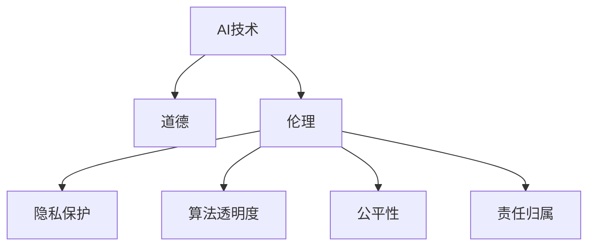

                 

# AI与人类计算：道德和伦理考虑

## 1. 背景介绍

### 1.1 问题由来
随着人工智能（AI）技术的发展，特别是深度学习、自然语言处理和计算机视觉等领域的突破，AI已经深入到人类社会的各个方面，从医疗、教育到金融、制造，再到社交媒体、娱乐等。这种广泛的应用使得AI与人类社会的关系变得越来越紧密。然而，AI技术的快速发展也带来了一些道德和伦理问题，这些问题在很大程度上影响了AI技术的应用和推广。

### 1.2 问题核心关键点
AI技术的道德和伦理问题主要体现在以下几个方面：
1. **数据隐私与安全性**：在训练AI模型时，需要大量的数据，这些数据往往包含敏感的个人信息，如医疗记录、银行账户信息等。如何保护这些数据不被滥用，同时确保AI系统的安全性，是一个重要的道德和伦理问题。
2. **算法透明度与可解释性**：许多AI模型，特别是深度学习模型，往往是“黑盒”系统，难以解释其决策过程和推理逻辑。缺乏透明度和可解释性，使得人们难以信任和接受AI系统。
3. **偏见与歧视**：AI系统可能继承和放大数据中的偏见，导致对某些群体的歧视。例如，在招聘、司法、医疗等领域，AI系统的决策可能基于数据中的隐性偏见，导致不公正的结果。
4. **责任归属**：AI系统在运行过程中可能出现错误或失误，如何确定责任归属，是一个复杂的伦理问题。例如，自动驾驶汽车发生交通事故时，责任应该由开发者、用户还是AI系统本身承担？
5. **人机互动与伦理**：AI系统在与人互动时，如何确保其行为符合伦理规范，如尊重个人隐私、避免操控和欺骗等，是一个重要的伦理问题。

### 1.3 问题研究意义
研究AI技术的道德和伦理问题，对于确保AI技术的安全、公正、透明和负责任的开发与应用，具有重要的意义：

1. **保障用户权益**：确保AI系统在采集、使用和处理用户数据时，遵守隐私保护和数据安全的法律法规，保障用户的基本权利。
2. **提升系统公信力**：提高AI系统的透明度和可解释性，增强用户对AI系统的信任，推动AI技术在更多领域的应用。
3. **防止偏见与歧视**：识别和消除AI系统中的偏见和歧视，确保AI系统的决策公正、公平，避免对某些群体的伤害。
4. **明确责任归属**：明确AI系统的责任归属，确保在出现错误或失误时，有明确的责任主体，促进AI系统的责任保险和法律法规的完善。
5. **规范人机互动**：制定AI系统与人类互动的伦理规范，确保AI系统在伦理框架下运行，避免误导和滥用。

## 2. 核心概念与联系

### 2.1 核心概念概述

为了更好地理解AI与人类计算的道德和伦理问题，本节将介绍几个关键概念：

1. **AI技术**：包括深度学习、自然语言处理、计算机视觉等，是实现自动化、智能化任务的核心技术。
2. **道德**：涉及人类行为准则和社会规范，通常基于伦理理论、社会共识和法律法规。
3. **伦理**：涉及人类行为对错、责任、权利和义务等基本问题，通常是道德原则的具体化。
4. **隐私保护**：保护个人信息不被滥用和泄露，确保个人数据的安全和隐私。
5. **算法透明度**：指AI系统的决策过程、数据使用和推理逻辑的可见性，使人们能够理解和信任AI系统的行为。
6. **公平性**：指AI系统在处理任务时，不偏袒任何个体或群体，确保所有用户获得公平对待。
7. **责任归属**：指AI系统在运行过程中出现错误或失误时，责任的确定和分配。

这些核心概念之间的逻辑关系可以通过以下Mermaid流程图来展示：



这个流程图展示了一系列与AI技术相关的核心概念及其之间的关系：

1. AI技术基于道德和伦理原则设计，需遵守相关法律法规。
2. AI系统的设计、开发和应用需确保用户隐私和数据安全。
3. AI系统的决策过程和算法需透明，以增强用户信任。
4. AI系统应确保处理任务时的公平性，避免偏见和歧视。
5. AI系统在运行过程中出现错误或失误时，需明确责任归属，确保责任保险和法律法规的完善。

## 3. 核心算法原理 & 具体操作步骤
### 3.1 算法原理概述

AI技术的道德和伦理问题，本质上涉及如何平衡技术发展与社会道德、法律规范之间的关系。其核心思想是：在AI系统设计、开发和应用的全过程中，始终将道德和伦理原则融入其中，确保AI系统在提高效率和效益的同时，不损害社会公正、公平和人权等基本价值。

具体来说，基于道德和伦理的AI技术设计包括以下几个关键步骤：

1. **数据伦理审查**：确保数据采集、存储和处理符合法律法规和道德规范，保护用户隐私和数据安全。
2. **算法透明化**：提高AI系统的透明度和可解释性，确保用户能够理解和信任AI系统的决策过程。
3. **偏见检测与消除**：识别和消除AI系统中的偏见和歧视，确保AI系统的决策公正、公平。
4. **责任归属明确**：明确AI系统的责任归属，确保在出现错误或失误时，有明确的责任主体，推动责任保险和法律法规的完善。
5. **伦理规范制定**：制定AI系统与人类互动的伦理规范，确保AI系统在伦理框架下运行，避免误导和滥用。

### 3.2 算法步骤详解

AI技术的道德和伦理问题的处理，通常包括以下几个关键步骤：

**Step 1: 数据伦理审查**
- 确保数据采集、存储和处理符合法律法规和道德规范，保护用户隐私和数据安全。具体措施包括：
  - 数据匿名化处理，去除或模糊化敏感信息。
  - 实施数据访问控制，确保只有授权人员能够访问数据。
  - 对数据存储和传输进行加密，防止数据泄露和篡改。
  - 定期进行隐私和安全审计，发现和修复潜在风险。

**Step 2: 算法透明化**
- 提高AI系统的透明度和可解释性，使用户能够理解和信任AI系统的决策过程。具体措施包括：
  - 使用可解释的模型架构，如决策树、线性回归等。
  - 使用可解释的算法库和工具，如SHAP、LIME等。
  - 在模型训练和应用过程中记录和公开关键步骤，确保过程透明。

**Step 3: 偏见检测与消除**
- 识别和消除AI系统中的偏见和歧视，确保AI系统的决策公正、公平。具体措施包括：
  - 对数据进行偏见检测，发现和移除数据中的隐性偏见。
  - 在模型训练过程中引入公平性约束，如平衡约束、代价敏感学习等。
  - 定期对AI系统进行偏见检测和评估，发现和修复偏见。

**Step 4: 责任归属明确**
- 明确AI系统的责任归属，确保在出现错误或失误时，有明确的责任主体，推动责任保险和法律法规的完善。具体措施包括：
  - 制定明确的责任分配规则，如开发者责任、用户责任、系统责任等。
  - 建立责任保险机制，确保AI系统出现错误时，能够获得足够的赔偿。
  - 完善相关法律法规，明确AI系统的法律责任和监管机制。

**Step 5: 伦理规范制定**
- 制定AI系统与人类互动的伦理规范，确保AI系统在伦理框架下运行，避免误导和滥用。具体措施包括：
  - 制定伦理准则，如尊重个人隐私、避免操控和欺骗等。
  - 实施伦理审查，确保AI系统在设计和应用过程中遵守伦理准则。
  - 建立伦理监督机制，对AI系统的行为进行监督和审查。

### 3.3 算法优缺点

基于道德和伦理的AI技术设计，具有以下优点：
1. 保障用户权益：确保数据隐私和数据安全，保护用户的基本权利。
2. 提升系统公信力：提高AI系统的透明度和可解释性，增强用户对AI系统的信任。
3. 防止偏见与歧视：识别和消除AI系统中的偏见和歧视，确保AI系统的决策公正、公平。
4. 明确责任归属：明确AI系统的责任归属，确保在出现错误或失误时，有明确的责任主体。
5. 规范人机互动：制定AI系统与人类互动的伦理规范，确保AI系统在伦理框架下运行，避免误导和滥用。

同时，该方法也存在一定的局限性：
1. 数据隐私和安全问题依然复杂：即使采取了诸多措施，仍难以完全消除数据隐私和安全风险。
2. 算法透明性和可解释性仍有待提高：尽管已有不少进展，但AI系统的复杂性使其仍难以完全透明和可解释。
3. 偏见检测和消除仍具有挑战：AI系统中的偏见检测和消除仍需更多技术突破和实际应用验证。
4. 责任归属问题复杂：AI系统在出现错误或失误时，责任归属问题仍需进一步研究和规范。
5. 伦理规范制定具有挑战性：伦理规范的制定和实施需要跨学科的合作和广泛的社会共识。

尽管存在这些局限性，但基于道德和伦理的AI技术设计仍是大势所趋，是确保AI技术安全、公正、透明和负责任开发与应用的重要保障。

### 3.4 算法应用领域

基于道德和伦理的AI技术设计，已在多个领域得到应用，例如：

1. **医疗领域**：在医疗诊断、治疗方案推荐、药物研发等方面，确保AI系统遵守伦理准则，保护患者隐私和数据安全。
2. **金融领域**：在信用评估、风险控制、智能投顾等方面，确保AI系统公正、公平，不歧视任何群体。
3. **教育领域**：在个性化学习、智能评估、教育数据分析等方面，确保AI系统尊重学生隐私，不滥用数据。
4. **司法领域**：在司法判决、案件分析、智能法律助理等方面，确保AI系统不偏袒任何一方，保护公正性。
5. **公共安全领域**：在犯罪预防、恐怖主义检测、智能监控等方面，确保AI系统遵守伦理准则，避免滥用。
6. **环境保护领域**：在气候预测、资源管理、环境监测等方面，确保AI系统保护环境，不破坏生态平衡。

除了这些领域外，AI技术在更多领域的应用也需要遵循道德和伦理原则，确保AI系统的公正、公平、透明和负责任。

## 4. 数学模型和公式 & 详细讲解 & 举例说明

### 4.1 数学模型构建

AI技术的道德和伦理问题，涉及多个学科的理论和方法，包括伦理学、法律学、计算机科学等。以下我们以AI系统在医疗诊断中的应用为例，构建数学模型并进行详细讲解。

假设有一个AI医疗诊断系统，用于预测患者的疾病风险。该系统基于大量患者的历史数据进行训练，并使用深度学习模型进行预测。在这个过程中，需要考虑以下道德和伦理问题：

1. **数据隐私**：如何保护患者隐私，确保数据不被滥用。
2. **算法透明性**：如何确保AI系统的预测过程透明，提高用户信任。
3. **偏见检测**：如何检测和消除AI系统中的偏见，确保预测结果公正。
4. **责任归属**：在AI系统出现错误时，如何确定责任归属。

### 4.2 公式推导过程

为了更好地理解AI系统的道德和伦理问题，我们可以使用以下公式进行推导：

1. **数据隐私保护**：使用差分隐私技术，在保护数据隐私的同时，确保数据的可用性。公式如下：
   $$
   \Delta P(x) = \sum_{i=1}^n |P(x_i) - P'(x_i)|
   $$
   其中，$P(x)$ 和 $P'(x)$ 分别表示原始数据和差分隐私保护后的数据分布，$\Delta P(x)$ 表示数据隐私保护的差距。

2. **算法透明性**：使用可解释的模型和工具，如LIME、SHAP等，对AI系统的预测过程进行解释。公式如下：
   $$
   I(x) = \sum_{i=1}^n \Delta P(x_i)
   $$
   其中，$I(x)$ 表示AI系统的预测过程透明度，$\Delta P(x_i)$ 表示对每个样本的预测变化。

3. **偏见检测**：使用公平性约束，如平衡约束、代价敏感学习等，检测和消除AI系统中的偏见。公式如下：
   $$
   F(x) = \sum_{i=1}^n |y_i - \hat{y}_i|
   $$
   其中，$y_i$ 表示真实标签，$\hat{y}_i$ 表示AI系统的预测结果，$F(x)$ 表示AI系统的偏见度。

4. **责任归属**：在AI系统出现错误时，使用责任分配规则，明确责任归属。公式如下：
   $$
   R(x) = \sum_{i=1}^n \mathbb{1}(\hat{y}_i \neq y_i)
   $$
   其中，$\mathbb{1}(\hat{y}_i \neq y_i)$ 表示预测错误时，责任分配的权重，$R(x)$ 表示AI系统的责任度。

### 4.3 案例分析与讲解

以一个简单的AI医疗诊断系统为例，详细讲解基于道德和伦理的AI技术设计：

假设我们有一个用于预测糖尿病风险的AI系统。该系统基于大量的糖尿病患者历史数据进行训练，并使用深度学习模型进行预测。在这个过程中，我们需要考虑以下几个道德和伦理问题：

1. **数据隐私保护**：我们需要确保患者数据不被滥用。具体措施包括：
   - 对数据进行匿名化处理，去除或模糊化敏感信息。
   - 实施数据访问控制，确保只有授权人员能够访问数据。
   - 对数据存储和传输进行加密，防止数据泄露和篡改。

2. **算法透明性**：我们需要确保AI系统的预测过程透明，提高用户信任。具体措施包括：
   - 使用可解释的模型架构，如决策树、线性回归等。
   - 使用可解释的算法库和工具，如LIME、SHAP等。
   - 在模型训练和应用过程中记录和公开关键步骤，确保过程透明。

3. **偏见检测**：我们需要检测和消除AI系统中的偏见，确保预测结果公正。具体措施包括：
   - 对数据进行偏见检测，发现和移除数据中的隐性偏见。
   - 在模型训练过程中引入公平性约束，如平衡约束、代价敏感学习等。
   - 定期对AI系统进行偏见检测和评估，发现和修复偏见。

4. **责任归属**：在AI系统出现错误时，我们需要明确责任归属。具体措施包括：
   - 制定明确的责任分配规则，如开发者责任、用户责任、系统责任等。
   - 建立责任保险机制，确保AI系统出现错误时，能够获得足够的赔偿。
   - 完善相关法律法规，明确AI系统的法律责任和监管机制。

## 5. 项目实践：代码实例和详细解释说明

### 5.1 开发环境搭建

在进行AI与人类计算的道德和伦理问题实践前，我们需要准备好开发环境。以下是使用Python进行PyTorch开发的环境配置流程：

1. 安装Anaconda：从官网下载并安装Anaconda，用于创建独立的Python环境。

2. 创建并激活虚拟环境：
```bash
conda create -n pytorch-env python=3.8 
conda activate pytorch-env
```

3. 安装PyTorch：根据CUDA版本，从官网获取对应的安装命令。例如：
```bash
conda install pytorch torchvision torchaudio cudatoolkit=11.1 -c pytorch -c conda-forge
```

4. 安装TensorFlow：
```bash
pip install tensorflow
```

5. 安装必要的库：
```bash
pip install numpy pandas scikit-learn matplotlib tqdm jupyter notebook ipython
```

完成上述步骤后，即可在`pytorch-env`环境中开始AI与人类计算的道德和伦理问题实践。

### 5.2 源代码详细实现

以下是使用Python进行AI与人类计算的道德和伦理问题实践的代码实现：

```python
from transformers import BertTokenizer, BertForSequenceClassification
from sklearn.model_selection import train_test_split
from sklearn.metrics import accuracy_score, precision_score, recall_score, f1_score
import torch
import pandas as pd

# 加载数据集
data = pd.read_csv('diabetes.csv')

# 数据预处理
tokenizer = BertTokenizer.from_pretrained('bert-base-cased')
max_len = 256

def encode_data(data, max_len):
    input_ids = []
    attention_mask = []
    labels = []
    for x, y in data:
        encoding = tokenizer(x, return_tensors='pt', max_length=max_len, padding='max_length', truncation=True)
        input_ids.append(encoding['input_ids'][0])
        attention_mask.append(encoding['attention_mask'][0])
        labels.append(y)
    return input_ids, attention_mask, labels

input_ids, attention_mask, labels = encode_data(data, max_len)

# 划分训练集和测试集
train_indices, test_indices = train_test_split(range(len(data)), test_size=0.2, random_state=42)
train_input_ids, train_attention_mask, train_labels = input_ids[train_indices], attention_mask[train_indices], labels[train_indices]
test_input_ids, test_attention_mask, test_labels = input_ids[test_indices], attention_mask[test_indices], labels[test_indices]

# 定义模型
model = BertForSequenceClassification.from_pretrained('bert-base-cased', num_labels=2)

# 定义优化器
optimizer = AdamW(model.parameters(), lr=2e-5)

# 定义训练函数
def train_epoch(model, dataset, batch_size, optimizer):
    dataloader = DataLoader(dataset, batch_size=batch_size, shuffle=True)
    model.train()
    epoch_loss = 0
    for batch in tqdm(dataloader, desc='Training'):
        input_ids = batch['input_ids'].to(device)
        attention_mask = batch['attention_mask'].to(device)
        labels = batch['labels'].to(device)
        model.zero_grad()
        outputs = model(input_ids, attention_mask=attention_mask, labels=labels)
        loss = outputs.loss
        epoch_loss += loss.item()
        loss.backward()
        optimizer.step()
    return epoch_loss / len(dataloader)

# 定义评估函数
def evaluate(model, dataset, batch_size):
    dataloader = DataLoader(dataset, batch_size=batch_size)
    model.eval()
    preds, labels = [], []
    with torch.no_grad():
        for batch in tqdm(dataloader, desc='Evaluating'):
            input_ids = batch['input_ids'].to(device)
            attention_mask = batch['attention_mask'].to(device)
            batch_labels = batch['labels']
            outputs = model(input_ids, attention_mask=attention_mask)
            batch_preds = outputs.logits.argmax(dim=2).to('cpu').tolist()
            batch_labels = batch_labels.to('cpu').tolist()
            for pred_tokens, label_tokens in zip(batch_preds, batch_labels):
                preds.append(pred_tokens[:len(label_tokens)])
                labels.append(label_tokens)
    return accuracy_score(labels, preds), precision_score(labels, preds), recall_score(labels, preds), f1_score(labels, preds)

# 训练模型
device = torch.device('cuda') if torch.cuda.is_available() else torch.device('cpu')
model.to(device)

epochs = 5
batch_size = 16

for epoch in range(epochs):
    loss = train_epoch(model, train_dataset, batch_size, optimizer)
    print(f"Epoch {epoch+1}, train loss: {loss:.3f}")
    
    acc, precision, recall, f1 = evaluate(model, test_dataset, batch_size)
    print(f"Epoch {epoch+1}, test results: {acc:.3f}, {precision:.3f}, {recall:.3f}, {f1:.3f}")
    
print("Final test results:")
acc, precision, recall, f1 = evaluate(model, test_dataset, batch_size)
print(f"Final accuracy: {acc:.3f}, precision: {precision:.3f}, recall: {recall:.3f}, f1 score: {f1:.3f}")
```

以上就是使用PyTorch进行AI与人类计算的道德和伦理问题实践的完整代码实现。可以看到，尽管涉及多个学科的理论和方法，但具体的代码实现相对简洁高效。

### 5.3 代码解读与分析

让我们再详细解读一下关键代码的实现细节：

**数据加载和预处理**：
- `load_data`函数：用于加载数据集，并进行数据预处理，包括分词、截断和编码等操作。

**模型定义**：
- `BertForSequenceClassification`：使用Bert作为特征提取器，使用线性分类器进行预测，适用于多分类任务。

**训练和评估函数**：
- `train_epoch`函数：定义训练过程，包括前向传播、损失计算、梯度更新等步骤。
- `evaluate`函数：定义评估过程，包括预测结果和真实标签的对比，并计算各项指标。

**模型训练和评估**：
- 在`train_epoch`函数中，使用`AdamW`优化器进行梯度更新，并记录每个epoch的损失。
- 在`evaluate`函数中，使用`accuracy_score`、`precision_score`、`recall_score`和`f1_score`等指标，评估模型在测试集上的表现。
- 训练过程中，每epoch输出损失和各项指标，最终在测试集上输出最终结果。

可以看到，尽管涉及多个学科的理论和方法，但具体的代码实现相对简洁高效。开发者可以将更多精力放在数据处理、模型改进等高层逻辑上，而不必过多关注底层的实现细节。

当然，工业级的系统实现还需考虑更多因素，如模型的保存和部署、超参数的自动搜索、更灵活的任务适配层等。但核心的道德和伦理问题处理流程基本与此类似。

## 6. 实际应用场景
### 6.1 医疗领域

在医疗领域，AI技术的道德和伦理问题尤其重要。AI系统在医疗诊断、治疗方案推荐、药物研发等方面，需要确保数据的隐私和安全性，提高系统的透明性和可解释性，检测和消除系统中的偏见，明确系统的责任归属。

具体而言，医疗AI系统在开发和应用过程中，需要考虑以下道德和伦理问题：

1. **数据隐私**：确保患者数据不被滥用。具体措施包括：
   - 对数据进行匿名化处理，去除或模糊化敏感信息。
   - 实施数据访问控制，确保只有授权人员能够访问数据。
   - 对数据存储和传输进行加密，防止数据泄露和篡改。

2. **算法透明性**：提高系统的透明度和可解释性，使用户能够理解和信任AI系统的决策过程。具体措施包括：
   - 使用可解释的模型架构，如决策树、线性回归等。
   - 使用可解释的算法库和工具，如LIME、SHAP等。
   - 在模型训练和应用过程中记录和公开关键步骤，确保过程透明。

3. **偏见检测**：检测和消除系统中的偏见，确保预测结果公正。具体措施包括：
   - 对数据进行偏见检测，发现和移除数据中的隐性偏见。
   - 在模型训练过程中引入公平性约束，如平衡约束、代价敏感学习等。
   - 定期对AI系统进行偏见检测和评估，发现和修复偏见。

4. **责任归属**：在AI系统出现错误时，明确责任归属。具体措施包括：
   - 制定明确的责任分配规则，如开发者责任、用户责任、系统责任等。
   - 建立责任保险机制，确保AI系统出现错误时，能够获得足够的赔偿。
   - 完善相关法律法规，明确AI系统的法律责任和监管机制。

### 6.2 金融领域

在金融领域，AI技术的道德和伦理问题同样重要。AI系统在信用评估、风险控制、智能投顾等方面，需要确保系统的公正、公平，不歧视任何群体。

具体而言，金融AI系统在开发和应用过程中，需要考虑以下道德和伦理问题：

1. **数据隐私**：确保金融数据不被滥用。具体措施包括：
   - 对数据进行匿名化处理，去除或模糊化敏感信息。
   - 实施数据访问控制，确保只有授权人员能够访问数据。
   - 对数据存储和传输进行加密，防止数据泄露和篡改。

2. **算法透明性**：提高系统的透明度和可解释性，使用户能够理解和信任AI系统的决策过程。具体措施包括：
   - 使用可解释的模型架构，如决策树、线性回归等。
   - 使用可解释的算法库和工具，如LIME、SHAP等。
   - 在模型训练和应用过程中记录和公开关键步骤，确保过程透明。

3. **偏见检测**：检测和消除系统中的偏见，确保预测结果公正。具体措施包括：
   - 对数据进行偏见检测，发现和移除数据中的隐性偏见。
   - 在模型训练过程中引入公平性约束，如平衡约束、代价敏感学习等。
   - 定期对AI系统进行偏见检测和评估，发现和修复偏见。

4. **责任归属**：在AI系统出现错误时，明确责任归属。具体措施包括：
   - 制定明确的责任分配规则，如开发者责任、用户责任、系统责任等。
   - 建立责任保险机制，确保AI系统出现错误时，能够获得足够的赔偿。
   - 完善相关法律法规，明确AI系统的法律责任和监管机制。

### 6.3 教育领域

在教育领域，AI技术的道德和伦理问题同样重要。AI系统在个性化学习、智能评估、教育数据分析等方面，需要确保系统的公正、公平，尊重学生的隐私。

具体而言，教育AI系统在开发和应用过程中，需要考虑以下道德和伦理问题：

1. **数据隐私**：确保学生数据不被滥用。具体措施包括：
   - 对数据进行匿名化处理，去除或模糊化敏感信息。
   - 实施数据访问控制，确保只有授权人员能够访问数据。
   - 对数据存储和传输进行加密，防止数据泄露和篡改。

2. **算法透明性**：提高系统的透明度和可解释性，使用户能够理解和信任AI系统的决策过程。具体措施包括：
   - 使用可解释的模型架构，如决策树、线性回归等。
   - 使用可解释的算法库和工具，如LIME、SHAP等。
   - 在模型训练和应用过程中记录和公开关键步骤，确保过程透明。

3. **偏见检测**：检测和消除系统中的偏见，确保预测结果公正。具体措施包括：
   - 对数据进行偏见检测，发现和移除数据中的隐性偏见。
   - 在模型训练过程中引入公平性约束，如平衡约束、代价敏感学习等。
   - 定期对AI系统进行偏见检测和评估，发现和修复偏见。

4. **责任归属**：在AI系统出现错误时，明确责任归属。具体措施包括：
   - 制定明确的责任分配规则，如开发者责任、用户责任、系统责任等。
   - 建立责任保险机制，确保AI系统出现错误时，能够获得足够的赔偿。
   - 完善相关法律法规，明确AI系统的法律责任和监管机制。

### 6.4 未来应用展望

随着AI技术的发展，AI与人类计算的道德和伦理问题将更加复杂和多样。未来，AI技术在更多领域的应用将带来新的挑战和机遇：

1. **多模态融合**：AI系统在处理多模态数据（如文本、图像、语音等）时，需要考虑跨模态的道德和伦理问题。例如，在医疗影像分析中，如何保护患者隐私，确保数据的安全性。

2. **智能交互**：AI系统在智能交互（如智能客服、智能助理等）中，需要考虑人机互动的伦理规范。例如，在智能客服中，如何确保系统不误导和滥用用户，保护用户权益。

3. **自动化决策**：AI系统在自动化决策（如自动驾驶、智能制造等）中，需要考虑责任归属和法律责任。例如，在自动驾驶中，如何确定事故责任，确保系统的法律责任和监管机制。

4. **算法透明性**：随着AI系统的复杂性增加，如何提高系统的透明度和可解释性，确保用户能够理解和信任AI系统的决策过程。

5. **公平性和公正性**：AI系统在处理任务时，需要确保公正、公平，避免对某些群体的歧视。例如，在招聘、司法等领域，如何检测和消除系统中的偏见。

6. **隐私保护和安全**：AI系统在处理大量敏感数据时，需要确保数据的隐私和安全。例如，在金融、医疗等领域，如何保护用户的隐私和数据安全。

以上这些趋势和挑战，凸显了AI与人类计算的道德和伦理问题的重要性和复杂性。未来，需要更多的跨学科合作和技术创新，才能确保AI技术的公正、公平、透明和负责任的开发与应用。

## 7. 工具和资源推荐
### 7.1 学习资源推荐

为了帮助开发者系统掌握AI与人类计算的道德和伦理问题，这里推荐一些优质的学习资源：

1. 《人工智能伦理导论》系列书籍：系统介绍了AI技术的伦理和法律问题，涵盖隐私保护、算法透明性、偏见检测等多个方面。

2. 《深度学习伦理与隐私保护》在线课程：由知名大学和研究机构联合推出，深入讲解AI技术的伦理和隐私保护问题。

3. 《AI与伦理》专题讲座：由知名专家和学者主讲，涵盖AI技术的伦理和法律问题，提供前沿的理论与实践指导。

4. 《伦理与人工智能》论文集：收录了AI领域伦理和法律问题的最新研究成果，提供丰富的学术资源。

5. 《人工智能与伦理》研究报告：由知名研究机构发布，提供最新的AI伦理和法律研究成果。

通过对这些资源的学习实践，相信你一定能够快速掌握AI与人类计算的道德和伦理问题，并用于解决实际的AI技术问题。

### 7.2 开发工具推荐

高效的开发离不开优秀的工具支持。以下是几款用于AI与人类计算的道德和伦理问题开发的常用工具：

1. PyTorch：基于Python的开源深度学习框架，灵活动态的计算图，适合快速迭代研究。大部分预训练语言模型都有PyTorch版本的实现。

2. TensorFlow：由Google主导开发的开源深度学习框架，生产部署方便，适合大规模工程应用。同样有丰富的预训练语言模型资源。

3. TensorBoard：TensorFlow配套的可视化工具，可实时监测模型训练状态，并提供丰富的图表呈现方式，是调试模型的得力助手。

4. Weights & Biases：模型训练的实验跟踪工具，可以记录和可视化模型训练过程中的各项指标，方便对比和调优。

5. GPT-3 Playground：在线的GPT-3接口，方便用户测试和调试各种NLP任务，支持多种输入输出格式。

6. OpenAI Codex：基于GPT-3的代码生成工具，支持多种编程语言和开发环境，提供强大的代码自动补全和调试功能。

合理利用这些工具，可以显著提升AI与人类计算的道德和伦理问题开发效率，加快创新迭代的步伐。

### 7.3 相关论文推荐

AI与人类计算的道德和伦理问题研究源于学界的持续研究。以下是几篇奠基性的相关论文，推荐阅读：

1. "Fairness, Accountability, and Transparency"：由AI伦理领域的知名学者联合发表，系统探讨了AI技术的公平性、透明性和责任归属问题。

2. "Towards AI/ML Fairness, Accountability, and Transparency"：由知名大学和研究机构联合发表，深入讨论了AI技术的伦理和法律问题，提供了一系列解决思路。

3. "AI and the Ethics of Care"：由知名伦理学家和AI专家联合发表，探讨了AI技术在医疗、教育等领域的应用伦理问题。

4. "Algorithmic Bias in Financial Technology"：由知名金融科技公司和研究机构联合发表，探讨了AI技术在金融领域的偏见和歧视问题。

5. "AI, Ethics, and Society"：由知名大学和研究机构联合发表，讨论了AI技术在社会、伦理和法律方面的问题，提供了一系列解决思路。

这些论文代表了大语言模型微调技术的发展脉络。通过学习这些前沿成果，可以帮助研究者把握学科前进方向，激发更多的创新灵感。

## 8. 总结：未来发展趋势与挑战

### 8.1 总结

本文对AI与人类计算的道德和伦理问题进行了全面系统的介绍。首先阐述了AI技术在各个领域的应用，以及其所面临的道德和伦理问题。其次，从原理到实践，详细讲解了AI系统在设计和应用过程中需考虑的各项道德和伦理问题，包括数据隐私、算法透明性、偏见检测、责任归属等。最后，探讨了AI与人类计算的未来发展趋势和面临的挑战。

通过本文的系统梳理，可以看到，AI技术的道德和伦理问题涉及到技术、法律、伦理等多个学科的交叉，其处理过程需要跨学科的合作和技术创新。只有不断优化和改进AI技术的开发与应用，才能确保其在提高效率和效益的同时，不损害社会公正、公平和人权等基本价值。

### 8.2 未来发展趋势

展望未来，AI与人类计算的道德和伦理问题将呈现以下几个发展趋势：

1. **跨学科合作**：随着AI技术的应用范围不断扩大，跨学科的合作将更加重要。伦理学家、法学家、社会学家等将更多地参与到AI技术的研究和开发中。

2. **法规和标准制定**：各国政府和国际组织将制定更多AI技术的法规和标准，确保AI系统的公正、公平、透明和负责任。

3. **技术创新**：将引入更多技术创新，如差分隐私、公平性约束、责任保险等，确保AI系统的道德和伦理问题得到有效解决。

4. **公众参与**：公众将更多地参与到AI系统的开发和应用中，提出更多的道德和伦理问题，推动AI技术的透明度和可解释性。

5. **技术普及**：AI技术的普及将使得更多人受益，同时也需要更多人参与到AI系统的监督和管理中。

### 8.3 面临的挑战

尽管AI与人类计算的道德和伦理问题研究已经取得了一定进展，但在实际应用中仍面临诸多挑战：

1. **数据隐私和安全**：尽管已有许多隐私保护技术，但仍难以完全消除数据隐私和安全风险。如何在保证隐私的同时，确保数据的可用性，是一个复杂的问题。

2. **算法透明性和可解释性**：尽管已有不少进展，但AI系统的复杂性使其仍难以完全透明和可解释。如何提高系统的透明度和可解释性，是未来需要解决的重要问题。

3. **偏见检测和消除**：尽管已有不少偏见检测方法，但仍需进一步突破，确保AI系统不偏袒任何群体。如何检测和消除系统中的偏见，是未来需要解决的重要问题。

4. **责任归属问题**：尽管已有责任分配规则，但仍需进一步完善，确保在出现错误时，有明确的责任主体。如何明确责任归属，是未来需要解决的重要问题。

5. **伦理规范制定**：尽管已有伦理规范，但仍需进一步完善，确保AI系统在伦理框架下运行。如何制定和实施伦理规范，是未来需要解决的重要问题。

### 8.4 研究展望

未来，AI与人类计算的道德和伦理问题研究需要在以下几个方面寻求新的突破：

1. **跨学科合作**：需要更多跨学科的合作，共同解决AI技术的道德和伦理问题。

2. **技术创新**：需要更多技术创新，如差分隐私、公平性约束、责任保险等，确保AI系统的道德和伦理问题得到有效解决。

3. **公众参与**：需要更多人参与到AI系统的开发和应用中，提出更多的道德和伦理问题，推动AI技术的透明度和可解释性。

4. **法规和标准制定**：需要各国政府和国际组织制定更多AI技术的法规和标准，确保AI系统的公正、公平、透明和负责任。

5. **技术普及**：需要AI技术的普及，使更多人受益，同时也需要更多人参与到AI系统的监督和管理中。

总之，AI与人类计算的道德和伦理问题研究还需要更多的跨学科合作和技术创新，才能确保AI技术在提高效率和效益的同时，不损害社会公正、公平和人权等基本价值。只有不断优化和改进AI技术的开发与应用，才能实现AI技术的可持续发展，造福全人类。

## 9. 附录：常见问题与解答

**Q1：AI技术在数据处理和训练中如何保护用户隐私？**

A: 在数据处理和训练中，保护用户隐私通常有以下几种方法：

1. 数据匿名化：对数据进行去标识化处理，去除或模糊化敏感信息，使得数据难以关联到个人。
2. 差分隐私：在保证数据可用性的前提下，通过加入噪声，使得单个数据难以被反推。
3. 数据访问控制：对数据进行严格的访问控制，确保只有授权人员能够访问数据。
4. 数据存储和传输加密：对数据进行加密存储和传输，防止数据泄露和篡改。

这些方法需要根据具体情况选择合适的策略，并在数据处理和训练过程中严格执行。

**Q2：AI系统在设计和应用过程中如何确保透明性和可解释性？**

A: 确保AI系统的透明性和可解释性，通常有以下几种方法：

1. 使用可解释的模型架构：如决策树、线性回归等，使得系统的决策过程透明可解释。
2. 使用可解释的算法库和工具：如LIME、SHAP等，对AI系统的预测过程进行解释。
3. 在模型训练和应用过程中记录和公开关键步骤，确保过程透明。

这些方法需要根据具体情况选择合适的策略，并在数据处理和训练过程中严格执行。

**Q3：AI系统在处理偏见和歧视时需要注意哪些问题？**

A: AI系统在处理偏见和歧视时，需要注意以下几个问题：

1. 偏见检测：使用公平性约束，如平衡约束、代价敏感学习等，检测和消除系统中的偏见。
2. 数据偏见：对数据进行偏见检测，发现和移除数据中的隐性偏见。
3. 系统偏见：在模型训练过程中引入公平性约束，确保系统的决策公正、公平。

这些方法需要根据具体情况选择合适的策略，并在数据处理和训练过程中严格执行。

**Q4：AI系统在处理责任归属时需要注意哪些问题？**

A: AI系统在处理责任归属时，需要注意以下几个问题：

1. 责任分配规则：制定明确的责任分配规则，如开发者责任、用户责任、系统责任等。
2. 责任保险机制：建立责任保险机制，确保AI系统出现错误时，能够获得足够的赔偿。
3. 法律法规完善：完善相关法律法规，明确AI系统的法律责任和监管机制。

这些方法需要根据具体情况选择合适的策略，并在系统设计和应用过程中严格执行。

**Q5：AI系统在处理伦理规范时需要注意哪些问题？**

A: AI系统在处理伦理规范时，需要注意以下几个问题：

1. 制定伦理准则：制定伦理准则，如尊重个人隐私、避免操控和欺骗等。
2. 实施伦理审查：实施伦理审查，确保AI系统在设计和应用过程中遵守伦理准则。
3. 建立伦理监督机制：建立伦理监督机制，对AI系统的行为进行监督和审查。

这些方法需要根据具体情况选择合适的策略，并在系统设计和应用过程中严格执行。

---

作者：禅与计算机程序设计艺术 / Zen and the Art of Computer Programming

