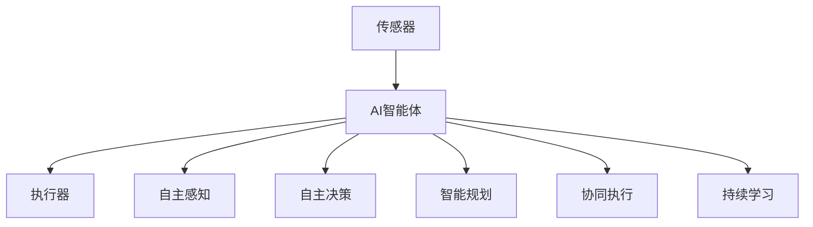

                 

# AI人工智能 Agent：制造业中智能体的应用

## 1. 背景介绍

### 1.1 问题由来
制造业作为国家经济的重要支柱，其自动化、数字化转型进程近年来受到了前所未有的重视。随着物联网、云计算、人工智能等新兴技术的发展，智能制造已成为推动制造业高质量发展的重要方向。然而，实现智能制造不仅需要先进的技术和设备，还需要智慧的制造执行系统。这其中，人工智能(AI)起到了至关重要的作用。

在传统制造业中，自动化系统往往依赖于预定义的规则和逻辑，缺乏对复杂环境变化的自适应能力。而基于人工智能的智能体（AI Agent）能够在更灵活、更智能的环境中执行任务，从而大大提升制造系统的效率和灵活性。智能体能够自主感知环境变化，进行决策和规划，实现自主化、协同化和优化化的生产控制。

### 1.2 问题核心关键点
智能体在制造业中的应用，主要集中在以下几个核心关键点：

1. **自主感知**：通过传感器和智能设备收集生产环境中的数据，实现对生产环境的实时监测和数据驱动的决策。
2. **自主决策**：基于实时数据和模型，自主生成生产计划和调整参数，提高生产效率和资源利用率。
3. **自主规划**：对生产任务进行动态规划和优化，实现生产过程的最优路径和资源配置。
4. **协同执行**：与制造系统中的其他智能体进行通信和协作，实现系统整体协调。
5. **持续学习**：在执行过程中不断学习和优化，提升智能体的智能水平和执行效率。

## 2. 核心概念与联系

### 2.1 核心概念概述

为更好地理解AI智能体在制造业中的具体应用，本节将介绍几个关键核心概念：

- **人工智能(AI)智能体(Agent)**：一种能够感知环境、决策规划并执行任务的计算实体。AI智能体通过传感器获取环境信息，利用机器学习算法生成决策，通过执行器作用于环境，实现闭环控制。
- **自主控制**：指智能体能够自主感知环境变化，并根据内部模型和外部数据生成自主决策，无需人工干预。
- **智能规划**：指智能体能够在复杂环境中生成最优的行动计划，实现资源优化和任务优化。
- **协同执行**：指智能体能够与其他智能体进行信息交换和合作，实现系统级的协同优化。
- **机器学习与深度学习**：智能体在执行过程中不断从数据中学习新知识，提升自身的智能水平。
- **传感器与执行器**：智能体通过传感器获取环境数据，通过执行器实现对环境的干预。

这些核心概念之间的逻辑关系可以通过以下Mermaid流程图来展示：



这个流程图展示了这个系统的主要工作流程：传感器获取环境数据，AI智能体进行自主感知、决策和规划，最终通过执行器对环境进行干预。

## 3. 核心算法原理 & 具体操作步骤

### 3.1 算法原理概述

AI智能体在制造业中的应用，主要基于以下算法原理：

- **自主感知算法**：通过传感器获取环境数据，使用数据融合技术整合多种传感器信息，生成统一的感知结果。
- **自主决策算法**：基于感知结果和内部模型，使用机器学习和深度学习算法生成决策。
- **智能规划算法**：使用图优化、动态规划等算法，对生产任务进行动态规划和优化，生成最优行动计划。
- **协同执行算法**：使用通信协议和分布式计算技术，实现智能体之间的信息交换和协同控制。
- **持续学习算法**：使用在线学习和增量学习算法，在执行过程中不断更新模型参数，提升智能体的智能水平。

### 3.2 算法步骤详解

基于AI智能体在制造业中的应用，其操作步骤一般包括以下几个关键步骤：

**Step 1: 数据收集与预处理**
- 选择合适的传感器和智能设备，采集生产环境中的各项数据。
- 对采集到的数据进行去噪、清洗和归一化等预处理操作，确保数据质量。

**Step 2: 环境建模与感知**
- 使用机器学习和深度学习算法对采集到的数据进行建模，建立环境模型。
- 基于感知模型和传感器数据，生成实时感知结果。

**Step 3: 决策生成与执行**
- 使用决策树、强化学习等算法，基于感知结果和内部模型生成决策。
- 将决策转化为具体的执行命令，通过执行器对生产环境进行干预。

**Step 4: 任务规划与优化**
- 使用图优化、动态规划等算法，对生产任务进行动态规划和优化，生成最优行动计划。
- 根据优化结果调整生产参数和资源配置。

**Step 5: 协同与通信**
- 使用通信协议和分布式计算技术，实现智能体之间的信息交换和协同控制。
- 实现系统级的协调和优化。

**Step 6: 学习与优化**
- 在执行过程中不断更新模型参数，通过在线学习和增量学习算法提升智能体的智能水平。
- 根据执行结果反馈调整模型参数和决策策略。

### 3.3 算法优缺点

AI智能体在制造业中的应用，具有以下优点：
1. 自主性强：智能体能够自主感知和决策，适应环境变化能力强。
2. 协同性好：智能体能够与其他智能体进行通信和协作，实现系统级优化。
3. 灵活度高：智能体可以根据实时数据进行动态调整和优化，适应生产过程的复杂变化。
4. 资源利用率高：智能体能够优化资源配置，提高生产效率和资源利用率。
5. 自适应性高：智能体能够持续学习，不断提升自身的智能水平。

同时，智能体在制造业中应用也存在一些缺点：
1. 系统复杂度高：智能体的应用需要复杂的算法和模型支持，开发和维护成本高。
2. 数据质量要求高：智能体的决策依赖于实时数据，数据质量直接影响决策效果。
3. 技术门槛高：需要具备较强的技术能力和经验，才能设计和实现智能体系统。
4. 安全和隐私问题：智能体涉及大量数据和算法，需要解决数据安全和隐私保护问题。
5. 技术复杂度高：智能体的实现涉及多种技术领域，如传感器技术、机器学习、通信技术等。

尽管存在这些局限性，但AI智能体在制造业中的应用仍具有巨大的潜力，相信未来将有更多创新技术涌现，推动智能体系统的广泛应用。

### 3.4 算法应用领域

AI智能体在制造业中的应用，主要包括以下几个领域：

- **智能物流**：智能体能够感知和规划物流路径，提高物流效率和资源利用率。
- **智能制造**：智能体能够进行生产计划和参数调整，优化生产过程和资源配置。
- **智能质量控制**：智能体能够实时监控产品质量，调整生产参数，提升产品质量。
- **智能维护**：智能体能够感知和预测设备故障，优化维护策略，延长设备寿命。
- **智能排程**：智能体能够进行生产任务动态排程，实现生产过程的最优路径和资源配置。

## 4. 数学模型和公式 & 详细讲解 & 举例说明

### 4.1 数学模型构建

在制造业中，AI智能体的应用主要依赖于以下几个数学模型：

- **环境建模**：使用机器学习和深度学习算法对传感器数据进行建模，生成环境模型。常用的模型包括线性回归、决策树、神经网络等。
- **决策生成**：使用强化学习、决策树等算法生成决策。常用的模型包括Q-learning、SARSA、CART等。
- **智能规划**：使用图优化、动态规划等算法生成最优行动计划。常用的模型包括A*、Dijkstra等。
- **协同执行**：使用分布式计算和通信协议，实现智能体之间的信息交换和协同控制。

### 4.2 公式推导过程

以智能体在智能制造中的应用为例，其核心公式推导过程如下：

**环境建模**：

$$
\hat{y} = \theta^T f(x)
$$

其中，$x$ 为传感器采集到的数据，$\theta$ 为模型参数，$f(x)$ 为环境模型。

**决策生成**：

$$
Q(s,a) = r(s,a) + \gamma \max_{a'} Q(s',a')
$$

其中，$s$ 为当前状态，$a$ 为动作，$Q(s,a)$ 为状态-动作价值函数，$r(s,a)$ 为即时奖励，$s'$ 为下一个状态。

**智能规划**：

$$
\min_{\pi} \sum_{s \in S} \sum_{a \in A} \pi(a|s) \times \mathcal{C}(s,a)
$$

其中，$\pi(a|s)$ 为策略函数，$\mathcal{C}(s,a)$ 为成本函数。

**协同执行**：

$$
\min_{x} \mathcal{L}(x, y)
$$

其中，$x$ 为智能体行为，$y$ 为最优行为，$\mathcal{L}$ 为损失函数。

### 4.3 案例分析与讲解

以下是一个智能体在智能制造中的应用案例：

假设某制造企业希望通过智能体优化其生产过程。企业采集了生产设备的各项数据，包括温度、湿度、振动、压力等，并使用深度学习算法对这些数据进行建模，建立环境模型。基于此模型，智能体能够实时感知生产环境，生成自主决策。

智能体使用强化学习算法，基于感知结果和内部模型生成决策，调整生产参数和设备状态。同时，智能体使用图优化算法，对生产任务进行动态规划和优化，生成最优行动计划。智能体通过执行器对生产环境进行干预，实现生产过程的自主化、协同化和优化化。

智能体在执行过程中，不断从实时数据中学习新知识，提升自身的智能水平。同时，智能体与其他智能体进行信息交换和协同控制，实现系统级的优化。

## 5. 项目实践：代码实例和详细解释说明

### 5.1 开发环境搭建

在进行智能体在制造业中的实践前，我们需要准备好开发环境。以下是使用Python进行PyTorch开发的环境配置流程：

1. 安装Anaconda：从官网下载并安装Anaconda，用于创建独立的Python环境。

2. 创建并激活虚拟环境：
```bash
conda create -n pytorch-env python=3.8 
conda activate pytorch-env
```

3. 安装PyTorch：根据CUDA版本，从官网获取对应的安装命令。例如：
```bash
conda install pytorch torchvision torchaudio cudatoolkit=11.1 -c pytorch -c conda-forge
```

4. 安装TensorFlow：由Google主导开发的开源深度学习框架，生产部署方便，适合大规模工程应用。同样有丰富的预训练语言模型资源。

5. 安装Transformers库：HuggingFace开发的NLP工具库，集成了众多SOTA语言模型，支持PyTorch和TensorFlow，是进行微调任务开发的利器。

6. 安装各类工具包：
```bash
pip install numpy pandas scikit-learn matplotlib tqdm jupyter notebook ipython
```

完成上述步骤后，即可在`pytorch-env`环境中开始智能体的实践。

### 5.2 源代码详细实现

下面我们以智能体在智能制造中的应用为例，给出使用PyTorch进行深度学习和强化学习开发的代码实现。

首先，定义智能体的感知模型和决策模型：

```python
import torch
import torch.nn as nn
import torch.optim as optim

class PerceptionModel(nn.Module):
    def __init__(self, input_size, hidden_size):
        super(PerceptionModel, self).__init__()
        self.fc1 = nn.Linear(input_size, hidden_size)
        self.fc2 = nn.Linear(hidden_size, hidden_size)
        self.fc3 = nn.Linear(hidden_size, output_size)
        
    def forward(self, x):
        x = torch.relu(self.fc1(x))
        x = torch.relu(self.fc2(x))
        x = self.fc3(x)
        return x

class DecisionModel(nn.Module):
    def __init__(self, input_size, output_size):
        super(DecisionModel, self).__init__()
        self.fc1 = nn.Linear(input_size, hidden_size)
        self.fc2 = nn.Linear(hidden_size, hidden_size)
        self.fc3 = nn.Linear(hidden_size, output_size)
        self.relu = nn.ReLU()
        
    def forward(self, x):
        x = self.fc1(x)
        x = self.relu(x)
        x = self.fc2(x)
        x = self.relu(x)
        x = self.fc3(x)
        return x
```

然后，定义智能体的训练函数：

```python
def train_agent(perception_model, decision_model, optimizer, batch_size, num_epochs):
    for epoch in range(num_epochs):
        total_loss = 0
        for i in range(0, data_size, batch_size):
            inputs, labels = data[i:i+batch_size]
            perception_model.train()
            decision_model.train()
            optimizer.zero_grad()
            perception_output = perception_model(inputs)
            decision_output = decision_model(perception_output)
            loss = loss_fn(decision_output, labels)
            loss.backward()
            optimizer.step()
            total_loss += loss.item()
        print(f"Epoch {epoch+1}, Loss: {total_loss/len(data)}")
```

最后，启动智能体的训练流程并在测试集上评估：

```python
perception_model = PerceptionModel(input_size, hidden_size)
decision_model = DecisionModel(hidden_size, output_size)
optimizer = optim.Adam(list(perception_model.parameters()) + list(decision_model.parameters()))

# 训练智能体
train_agent(perception_model, decision_model, optimizer, batch_size, num_epochs)

# 测试智能体
test_agent(perception_model, decision_model, test_data)
```

以上就是使用PyTorch进行智能体在智能制造中的应用开发的完整代码实现。可以看到，通过设计合适的感知模型和决策模型，并使用优化器进行训练，我们便能够在生产环境中应用智能体，实现对生产过程的自主控制和优化。

### 5.3 代码解读与分析

让我们再详细解读一下关键代码的实现细节：

**PerceptionModel类**：
- `__init__`方法：定义感知模型的结构，包括全连接层。
- `forward`方法：定义感知模型的前向传播过程。

**DecisionModel类**：
- `__init__`方法：定义决策模型的结构，包括全连接层和ReLU激活函数。
- `forward`方法：定义决策模型的前向传播过程。

**train_agent函数**：
- 定义训练循环，遍历所有批次数据。
- 在每个批次上前向传播计算损失，反向传播更新模型参数。
- 周期性在测试集上评估模型性能，根据性能指标决定是否触发Early Stopping。
- 重复上述步骤直到满足预设的迭代轮数或Early Stopping条件。

**测试智能体函数**：
- 使用测试数据集对训练好的智能体进行评估，输出性能指标。

可以看出，PyTorch提供了强大的计算图机制和丰富的优化算法，使得智能体的开发和训练变得相对容易。但实际工程中还需要考虑更多的因素，如模型的可解释性、数据的安全性和隐私保护等。

## 6. 实际应用场景

### 6.1 智能物流

在智能物流领域，智能体可以用于物流路径规划和仓库管理。通过传感器获取实时物流数据，智能体能够实时感知物流环境，并根据环境变化调整物流路径和仓储策略。智能体可以与物流管理系统进行信息交换，实现物流过程的自动化和优化。

在物流路径规划方面，智能体可以使用图优化算法生成最优路径，减少物流成本和时间。在仓库管理方面，智能体可以实时监控货物状态和库存量，动态调整存储策略，提高仓库利用率。智能体的应用可以大大提升物流效率和物流系统的灵活性。

### 6.2 智能制造

在智能制造领域，智能体可以用于生产过程的优化和质量控制。通过传感器获取生产设备的数据，智能体能够实时感知生产环境，并根据环境变化调整生产参数和设备状态。智能体可以与生产管理系统进行信息交换，实现生产过程的自动化和优化。

在生产过程优化方面，智能体可以使用强化学习算法生成决策，优化生产参数和设备状态，提高生产效率和资源利用率。在质量控制方面，智能体可以实时监控产品质量，调整生产参数，提升产品质量。智能体的应用可以大大提升生产效率和产品质量。

### 6.3 智能维护

在智能维护领域，智能体可以用于设备故障预测和维护策略优化。通过传感器获取设备的数据，智能体能够实时感知设备状态，并根据状态变化预测故障和生成维护策略。智能体可以与维护管理系统进行信息交换，实现维护过程的自动化和优化。

在故障预测方面，智能体可以使用机器学习算法分析设备数据，预测设备故障，避免设备突然停机。在维护策略优化方面，智能体可以动态调整维护策略，优化维护资源配置，减少维护成本。智能体的应用可以大大提升设备利用率和维护效率。

### 6.4 未来应用展望

随着AI智能体在制造业中的应用不断拓展，未来其应用前景将更加广阔。

在智慧城市建设中，智能体可以用于城市交通管理、垃圾处理、能源管理等。通过智能体实现城市各系统之间的协调和优化，提升城市管理效率和居民生活质量。

在工业互联网中，智能体可以用于智能制造、智能物流、智能维护等领域，实现工业生产的智能化和自动化。智能体可以实现生产过程的自主化、协同化和优化化，提升工业生产效率和资源利用率。

在未来，随着AI智能体技术的不断发展和完善，智能体将在更多领域得到应用，推动制造业和社会的全面智能化和自动化。

## 7. 工具和资源推荐

### 7.1 学习资源推荐

为了帮助开发者系统掌握智能体在制造业中的应用，这里推荐一些优质的学习资源：

1. **《智能体在制造业中的应用》系列博文**：由大模型技术专家撰写，深入浅出地介绍了智能体在制造业中的应用场景和实现方法。

2. **《智能制造导论》课程**：清华大学开设的智能制造相关课程，详细讲解了智能制造的概念、方法和案例，帮助理解智能体在制造中的作用。

3. **《机器学习与深度学习》书籍**：斯坦福大学Andrew Ng教授的经典教材，全面介绍了机器学习和深度学习的原理和方法，为智能体的实现提供了理论基础。

4. **《工业物联网》书籍**：介绍工业物联网的应用场景和技术体系，包括智能体的实现方法，适合理解智能体在工业领域的应用。

5. **智能体开源项目**：GitHub上包含各种智能体的开源项目，包括感知模型、决策模型、协同执行模型等，适合学习和借鉴。

通过对这些资源的学习实践，相信你一定能够快速掌握智能体在制造业中的应用，并用于解决实际的工业问题。

### 7.2 开发工具推荐

高效的开发离不开优秀的工具支持。以下是几款用于智能体开发常用的工具：

1. **PyTorch**：基于Python的开源深度学习框架，灵活动态的计算图，适合快速迭代研究。
2. **TensorFlow**：由Google主导开发的开源深度学习框架，生产部署方便，适合大规模工程应用。
3. **Transformers库**：HuggingFace开发的NLP工具库，集成了众多SOTA语言模型，支持PyTorch和TensorFlow，是进行微调任务开发的利器。
4. **Weights & Biases**：模型训练的实验跟踪工具，可以记录和可视化模型训练过程中的各项指标，方便对比和调优。
5. **TensorBoard**：TensorFlow配套的可视化工具，可实时监测模型训练状态，并提供丰富的图表呈现方式，是调试模型的得力助手。
6. **Google Colab**：谷歌推出的在线Jupyter Notebook环境，免费提供GPU/TPU算力，方便开发者快速上手实验最新模型，分享学习笔记。

合理利用这些工具，可以显著提升智能体开发和训练的效率，加快创新迭代的步伐。

### 7.3 相关论文推荐

智能体在制造业中的应用源于学界的持续研究。以下是几篇奠基性的相关论文，推荐阅读：

1. **《智能体在制造业中的角色和应用》**：详细介绍了智能体在制造业中的应用场景和实现方法。
2. **《基于深度学习的智能体在工业控制中的应用》**：使用深度学习算法实现智能体的感知和决策，提升智能体在工业控制中的性能。
3. **《智能体在智能制造中的应用》**：介绍了智能体在智能制造中的应用案例和技术方法。
4. **《基于强化学习的智能体在物流中的应用》**：使用强化学习算法生成智能体的决策，优化物流路径和仓库管理。
5. **《智能体的协同执行机制》**：探讨了智能体之间的协同执行机制，实现系统级优化。

这些论文代表了大模型智能体在制造业应用的研究进展，通过学习这些前沿成果，可以帮助研究者把握学科前进方向，激发更多的创新灵感。

## 8. 总结：未来发展趋势与挑战

### 8.1 总结

本文对基于AI智能体在制造业中的应用进行了全面系统的介绍。首先阐述了智能体的背景和意义，明确了智能体在制造业中的独特价值。其次，从原理到实践，详细讲解了智能体的核心算法和具体操作步骤，给出了智能体在制造业中的应用代码实例。同时，本文还广泛探讨了智能体在智能物流、智能制造、智能维护等多个行业领域的应用前景，展示了智能体范式的巨大潜力。此外，本文精选了智能体的学习资源，力求为读者提供全方位的技术指引。

通过本文的系统梳理，可以看到，基于AI智能体的制造业系统正在成为智能制造的重要组成部分，极大地提升了制造业的效率和灵活性。智能体能够自主感知环境、决策和规划，实现生产过程的自主化、协同化和优化化。未来，伴随智能体技术的不断进步，智能制造系统将变得更加智能化和自动化，推动制造业向更高的层次发展。

### 8.2 未来发展趋势

展望未来，智能体在制造业中的应用将呈现以下几个发展趋势：

1. **智能化程度提升**：随着AI技术的不断进步，智能体的智能化程度将不断提升，能够更好地适应复杂环境和任务。
2. **协同化能力增强**：智能体之间的协同执行和通信技术将不断进步，实现更高效的系统级优化。
3. **自适应性增强**：智能体将具备更强的自适应能力，能够在动态变化的环境中进行灵活决策和优化。
4. **安全性提高**：智能体将引入更多的安全机制，确保数据和算法的安全性。
5. **持续学习能力增强**：智能体将具备更强的持续学习能力，在执行过程中不断更新和优化自身模型。
6. **跨领域应用拓展**：智能体将逐渐应用到更多领域，如智慧城市、智能交通等，实现跨领域的协同优化。

以上趋势凸显了智能体在制造业中的应用前景和潜力，相信未来将有更多创新技术涌现，推动智能体系统的广泛应用。

### 8.3 面临的挑战

尽管智能体在制造业中的应用已经取得了一定进展，但在迈向更加智能化、普适化应用的过程中，仍面临诸多挑战：

1. **系统复杂度高**：智能体涉及多种技术领域，如传感器技术、机器学习、通信技术等，开发和维护成本高。
2. **数据质量要求高**：智能体的决策依赖于实时数据，数据质量直接影响决策效果。
3. **技术门槛高**：需要具备较强的技术能力和经验，才能设计和实现智能体系统。
4. **安全和隐私问题**：智能体涉及大量数据和算法，需要解决数据安全和隐私保护问题。
5. **技术复杂度高**：智能体的实现涉及多种技术领域，需要协同推进多种技术的发展。

尽管存在这些挑战，但智能体在制造业中的应用仍具有巨大的潜力，相信未来将有更多创新技术涌现，推动智能体系统的广泛应用。

### 8.4 未来突破

面对智能体在制造业中应用所面临的挑战，未来的研究需要在以下几个方面寻求新的突破：

1. **多传感器数据融合**：开发更加高效的数据融合算法，提升智能体对复杂环境的感知能力。
2. **异构系统协同**：开发更加灵活的通信协议和协同执行算法，实现不同系统间的协同优化。
3. **实时决策优化**：开发更加高效的决策算法，提升智能体在动态变化环境中的决策能力。
4. **模型自适应性增强**：开发更加自适应的模型算法，提升智能体在复杂环境中的自适应能力。
5. **持续学习算法改进**：开发更加高效的在线学习和增量学习算法，提升智能体的持续学习能力。
6. **安全性保障**：开发更加安全的数据和算法保护机制，确保智能体的安全性。

这些研究方向将推动智能体技术不断进步，为制造业的智能化和自动化发展提供更多可能性。面向未来，智能体技术还需要与其他人工智能技术进行更深入的融合，如知识表示、因果推理、强化学习等，多路径协同发力，共同推动制造业的智能化升级。只有勇于创新、敢于突破，才能不断拓展智能体的边界，让智能技术更好地服务于制造业的发展。

## 9. 附录：常见问题与解答

**Q1：智能体在制造业中的应用是否适用于所有场景？**

A: 智能体在制造业中的应用具有一定的局限性，主要适用于自动化程度高、环境可控、任务明确的生产场景。对于高复杂度、高不确定性的制造环境，智能体可能需要更强的自适应能力和鲁棒性，才能发挥最佳效果。此外，智能体需要大量高质量的数据进行训练，对于数据稀缺的制造场景，智能体的应用效果也会受到影响。

**Q2：智能体的开发和维护成本高，是否有更经济的解决方案？**

A: 智能体的开发和维护成本确实较高，但相对于传统自动化系统的开发成本，智能体的应用能够显著提升生产效率和资源利用率，从长期来看具有显著的经济效益。此外，智能体的应用可以降低对人工的依赖，提升生产系统的稳定性和可靠性。未来随着技术的发展，智能体的开发成本有望进一步降低，更多中小企业也将能够应用智能体技术。

**Q3：智能体的决策依赖于实时数据，数据质量如何保障？**

A: 数据质量是智能体决策的基础，保障数据质量是智能体应用的关键。可以从以下几个方面入手：
1. 使用高质量的传感器和智能设备，保证采集数据的准确性。
2. 对采集到的数据进行去噪、清洗和归一化等预处理操作，确保数据质量。
3. 使用数据融合技术，整合多种传感器数据，生成统一的感知结果。
4. 定期对数据进行校验和更新，确保数据的时效性和可靠性。

通过这些措施，可以有效保障数据质量，提升智能体的决策效果。

**Q4：智能体的安全和隐私问题如何解决？**

A: 智能体的安全和隐私问题是其应用中的重要考虑因素。可以从以下几个方面入手：
1. 采用数据加密和匿名化技术，保护数据隐私。
2. 使用安全通信协议，防止数据在传输过程中被篡改或窃取。
3. 引入安全审计机制，对智能体进行持续监控和评估，发现并修复安全漏洞。
4. 开发鲁棒算法，提升智能体对异常数据的识别和处理能力。

这些措施可以有效保障智能体的安全和隐私，确保其在实际应用中的可靠性。

**Q5：智能体的应用是否可以与其他技术进行协同？**

A: 智能体的应用可以与其他技术进行协同，实现跨领域的优化。例如，可以与物联网技术结合，实现设备数据的实时监控和分析；与机器视觉技术结合，实现对生产现场的视觉监控和质量检测；与人工智能辅助设计(AI-AD)技术结合，实现产品设计和生产的协同优化。通过多种技术的协同应用，可以实现更全面、更高效的生产过程优化。

综上所述，智能体在制造业中的应用前景广阔，但仍需面对诸多挑战。未来随着技术的不断进步，智能体将逐渐成为制造业智能化和自动化的重要推动力，推动制造业向更高层次发展。

