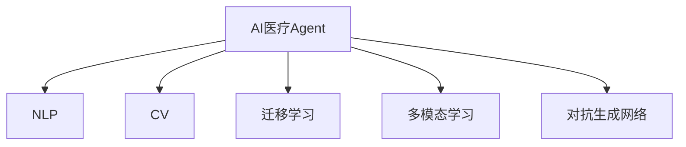

                 

# AI人工智能 Agent：在智能医疗中的应用

## 1. 背景介绍

### 1.1 问题由来

随着人工智能技术在医疗领域的逐渐渗透，人工智能在智能医疗中的应用正日益成为热点。尤其是在自然语言处理(NLP)和计算机视觉(CV)等领域的进步，使得AI在医疗诊断、治疗方案推荐、疾病预测等多个方面都有突破性进展。然而，受限于现有技术水平，AI在智能医疗中的应用仍存在诸多挑战：

1. 医疗数据稀缺：医疗数据获取成本高，隐私保护要求严格，使得训练高质量的医疗AI模型面临数据不足的难题。
2. 模型鲁棒性不足：现有医疗AI模型往往在应对域外数据时表现欠佳，泛化能力有待提升。
3. 可解释性不足：医疗AI模型输出结果的解释性差，医生难以理解和信任模型决策。
4. 安全性问题：医疗AI模型可能学习到敏感的病人隐私信息，造成严重的隐私泄露问题。

### 1.2 问题核心关键点

为更好地解决这些问题，本节将介绍AI在智能医疗中应用的核心概念，并阐明其核心原理和架构。

### 1.3 问题研究意义

AI在智能医疗中的应用，不仅可以有效提升医疗服务的效率和质量，还能在医疗资源的合理分配、精准医疗等方面发挥巨大作用。因此，深入研究AI在智能医疗中的应用，不仅具有理论上的创新意义，也具有巨大的实际应用价值。

## 2. 核心概念与联系

### 2.1 核心概念概述

为更好地理解AI在智能医疗中的应用，本节将介绍几个密切相关的核心概念：

- AI医疗Agent：指在医疗领域具有明确任务目标，具备一定自主决策能力的AI系统。例如，用于疾病预测、诊断、治疗方案推荐等。
- 自然语言处理(NLP)：指让计算机能够理解、处理和生成人类语言的技术。在智能医疗中，NLP用于病历摘要生成、智能问答等任务。
- 计算机视觉(CV)：指让计算机能够识别、理解图像和视频等视觉数据的高级技术。在智能医疗中，CV用于医学影像分析、手术辅助等任务。
- 迁移学习(Transfer Learning)：指将一个领域学习到的知识，迁移应用到另一个相关领域的学习范式。例如，将预训练模型用于医疗领域的微调。
- 多模态学习(Multi-modal Learning)：指将不同模态的数据源(如文本、图像、音频等)进行融合，提升AI系统的泛化能力和理解能力。
- 对抗生成网络(Generative Adversarial Networks, GAN)：指由生成器(Generator)和判别器(Discriminator)组成的两玩家博弈模型，常用于图像生成、医疗图像合成等任务。

这些核心概念之间的逻辑关系可以通过以下Mermaid流程图来展示：



这个流程图展示了大语言模型的核心概念及其之间的关系：

1. AI医疗Agent是智能医疗的核心载体，能够承担疾病预测、诊断、治疗方案推荐等任务。
2. NLP和CV技术是AI医疗Agent完成任务的重要工具，通过文本和图像的分析和理解，AI能够从海量数据中提取有用的信息。
3. 迁移学习是连接预训练模型与医疗任务的桥梁，通过微调或转移学习，将通用模型的知识迁移到医疗领域。
4. 多模态学习和对抗生成网络进一步丰富了AI医疗Agent的数据获取和模型训练方式，提升了其泛化能力和鲁棒性。

## 3. 核心算法原理 & 具体操作步骤

### 3.1 算法原理概述

AI在智能医疗中的应用，本质上是一个有监督学习的微调过程。其核心思想是：将预训练的大模型视作一个强大的"特征提取器"，通过在医疗数据的标注数据上进行有监督地训练，优化模型在特定医疗任务上的性能。

形式化地，假设预训练模型为 $M_{\theta}$，其中 $\theta$ 为预训练得到的模型参数。给定医疗任务 $T$ 的标注数据集 $D=\{(x_i, y_i)\}_{i=1}^N, x_i \in \mathcal{X}, y_i \in \mathcal{Y}$。微调的目标是找到新的模型参数 $\hat{\theta}$，使得：

$$
\hat{\theta}=\mathop{\arg\min}_{\theta} \mathcal{L}(M_{\theta},D)
$$

其中 $\mathcal{L}$ 为针对任务 $T$ 设计的损失函数，用于衡量模型预测输出与真实标签之间的差异。常见的损失函数包括交叉熵损失、均方误差损失等。

通过梯度下降等优化算法，微调过程不断更新模型参数 $\theta$，最小化损失函数 $\mathcal{L}$，使得模型输出逼近真实标签。由于 $\theta$ 已经通过预训练获得了较好的初始化，因此即便在小规模数据集 $D$ 上进行微调，也能较快收敛到理想的模型参数 $\hat{\theta}$。

### 3.2 算法步骤详解

AI在智能医疗中的应用一般包括以下几个关键步骤：

**Step 1: 准备预训练模型和数据集**
- 选择合适的预训练语言模型 $M_{\theta}$ 作为初始化参数，如 BERT、GPT 等。
- 准备医疗任务 $T$ 的标注数据集 $D$，划分为训练集、验证集和测试集。一般要求标注数据与预训练数据的分布不要差异过大。

**Step 2: 添加任务适配层**
- 根据任务类型，在预训练模型顶层设计合适的输出层和损失函数。
- 对于分类任务，通常在顶层添加线性分类器和交叉熵损失函数。
- 对于生成任务，通常使用语言模型的解码器输出概率分布，并以负对数似然为损失函数。

**Step 3: 设置微调超参数**
- 选择合适的优化算法及其参数，如 AdamW、SGD 等，设置学习率、批大小、迭代轮数等。
- 设置正则化技术及强度，包括权重衰减、Dropout、Early Stopping等。
- 确定冻结预训练参数的策略，如仅微调顶层，或全部参数都参与微调。

**Step 4: 执行梯度训练**
- 将训练集数据分批次输入模型，前向传播计算损失函数。
- 反向传播计算参数梯度，根据设定的优化算法和学习率更新模型参数。
- 周期性在验证集上评估模型性能，根据性能指标决定是否触发 Early Stopping。
- 重复上述步骤直到满足预设的迭代轮数或 Early Stopping 条件。

**Step 5: 测试和部署**
- 在测试集上评估微调后模型 $M_{\hat{\theta}}$ 的性能，对比微调前后的精度提升。
- 使用微调后的模型对新样本进行推理预测，集成到实际的应用系统中。
- 持续收集新的数据，定期重新微调模型，以适应数据分布的变化。

以上是AI在智能医疗中的应用的一般流程。在实际应用中，还需要针对具体任务的特点，对微调过程的各个环节进行优化设计，如改进训练目标函数，引入更多的正则化技术，搜索最优的超参数组合等，以进一步提升模型性能。

### 3.3 算法优缺点

AI在智能医疗中的应用具有以下优点：
1. 提升医疗诊断和治疗效率：AI医疗Agent可以快速处理大量医疗数据，辅助医生做出诊断和治疗决策，提升医疗服务的效率和质量。
2. 实现个性化医疗：AI医疗Agent能够根据病人的特定情况，提供个性化的诊疗方案，提高治疗效果。
3. 提升医疗资源的利用率：AI医疗Agent可以辅助医生优化诊疗流程，合理分配医疗资源，避免资源浪费。
4. 促进医疗知识共享：AI医疗Agent能够将医疗知识进行归纳总结，并通过知识图谱等形式进行共享，提升整个医疗系统的知识水平。
5. 降低医疗成本：AI医疗Agent可以自动化处理部分医疗任务，降低人力成本，提高医疗服务的可及性。

同时，该方法也存在一定的局限性：
1. 依赖标注数据：AI医疗Agent需要大量高质量的标注数据进行训练，获取这些数据的成本较高。
2. 泛化能力有限：当目标任务与预训练数据的分布差异较大时，AI医疗Agent的性能提升有限。
3. 伦理和隐私问题：AI医疗Agent可能学习到敏感的病人隐私信息，造成严重的隐私泄露问题。
4. 可解释性不足：AI医疗Agent输出结果的解释性差，医生难以理解和信任模型决策。
5. 安全性问题：AI医疗Agent输出结果的准确性受限于训练数据的质量和量，可能存在误诊或漏诊的风险。

尽管存在这些局限性，但就目前而言，AI在智能医疗中的应用仍是大数据、大模型和大算力相结合的重要体现，具有广阔的应用前景。

### 3.4 算法应用领域

AI在智能医疗中的应用领域非常广泛，涵盖了疾病预测、诊断、治疗方案推荐等多个方面。以下是几个典型的应用场景：

- 疾病预测：AI医疗Agent可以通过分析历史病历、基因数据、环境数据等，预测病人患某种疾病的概率，帮助医生提前预防和治疗。
- 诊断：AI医疗Agent可以通过分析医学影像、病理切片等视觉数据，帮助医生快速识别出病灶，并提供诊断结果。
- 治疗方案推荐：AI医疗Agent可以根据病人的病情、基因信息等，推荐最适合的治疗方案，减少治疗时间和成本。
- 智能问答：AI医疗Agent可以回答病人的常见问题，提供健康咨询，减轻医生的工作负担。
- 手术辅助：AI医疗Agent可以通过分析手术数据，提供手术方案优化建议，提高手术成功率。

除了这些常见的应用场景，AI在智能医疗中还有更多创新应用，如医学图像生成、疾病风险评估、个性化药物推荐等，为医疗行业带来了新的变革。

## 4. 数学模型和公式 & 详细讲解

### 4.1 数学模型构建

本节将使用数学语言对AI在智能医疗中的应用进行更加严格的刻画。

记预训练语言模型为 $M_{\theta}$，其中 $\theta$ 为模型参数。假设医疗任务 $T$ 的标注数据集为 $D=\{(x_i, y_i)\}_{i=1}^N, x_i \in \mathcal{X}, y_i \in \mathcal{Y}$。

定义模型 $M_{\theta}$ 在数据样本 $(x,y)$ 上的损失函数为 $\ell(M_{\theta}(x),y)$，则在数据集 $D$ 上的经验风险为：

$$
\mathcal{L}(\theta) = \frac{1}{N} \sum_{i=1}^N \ell(M_{\theta}(x_i),y_i)
$$

微调的优化目标是最小化经验风险，即找到最优参数：

$$
\theta^* = \mathop{\arg\min}_{\theta} \mathcal{L}(\theta)
$$

在实践中，我们通常使用基于梯度的优化算法（如SGD、Adam等）来近似求解上述最优化问题。设 $\eta$ 为学习率，$\lambda$ 为正则化系数，则参数的更新公式为：

$$
\theta \leftarrow \theta - \eta \nabla_{\theta}\mathcal{L}(\theta) - \eta\lambda\theta
$$

其中 $\nabla_{\theta}\mathcal{L}(\theta)$ 为损失函数对参数 $\theta$ 的梯度，可通过反向传播算法高效计算。

### 4.2 公式推导过程

以下我们以疾病预测任务为例，推导交叉熵损失函数及其梯度的计算公式。

假设模型 $M_{\theta}$ 在输入 $x$ 上的输出为 $\hat{y}=M_{\theta}(x) \in [0,1]$，表示病人患某种疾病的概率。真实标签 $y \in \{0,1\}$。则二分类交叉熵损失函数定义为：

$$
\ell(M_{\theta}(x),y) = -[y\log \hat{y} + (1-y)\log (1-\hat{y})]
$$

将其代入经验风险公式，得：

$$
\mathcal{L}(\theta) = -\frac{1}{N}\sum_{i=1}^N [y_i\log M_{\theta}(x_i)+(1-y_i)\log(1-M_{\theta}(x_i))]
$$

根据链式法则，损失函数对参数 $\theta_k$ 的梯度为：

$$
\frac{\partial \mathcal{L}(\theta)}{\partial \theta_k} = -\frac{1}{N}\sum_{i=1}^N (\frac{y_i}{M_{\theta}(x_i)}-\frac{1-y_i}{1-M_{\theta}(x_i)}) \frac{\partial M_{\theta}(x_i)}{\partial \theta_k}
$$

其中 $\frac{\partial M_{\theta}(x_i)}{\partial \theta_k}$ 可进一步递归展开，利用自动微分技术完成计算。

在得到损失函数的梯度后，即可带入参数更新公式，完成模型的迭代优化。重复上述过程直至收敛，最终得到适应医疗任务的最优模型参数 $\theta^*$。

## 5. 项目实践：代码实例和详细解释说明

### 5.1 开发环境搭建

在进行医疗AI开发前，我们需要准备好开发环境。以下是使用Python进行PyTorch开发的环境配置流程：

1. 安装Anaconda：从官网下载并安装Anaconda，用于创建独立的Python环境。

2. 创建并激活虚拟环境：
```bash
conda create -n pytorch-env python=3.8 
conda activate pytorch-env
```

3. 安装PyTorch：根据CUDA版本，从官网获取对应的安装命令。例如：
```bash
conda install pytorch torchvision torchaudio cudatoolkit=11.1 -c pytorch -c conda-forge
```

4. 安装TensorFlow：
```bash
pip install tensorflow
```

5. 安装各类工具包：
```bash
pip install numpy pandas scikit-learn matplotlib tqdm jupyter notebook ipython
```

完成上述步骤后，即可在`pytorch-env`环境中开始医疗AI开发。

### 5.2 源代码详细实现

下面我们以疾病预测任务为例，给出使用Transformers库对BERT模型进行微调的PyTorch代码实现。

首先，定义疾病预测任务的数据处理函数：

```python
from transformers import BertTokenizer
from torch.utils.data import Dataset
import torch

class DiseaseDataset(Dataset):
    def __init__(self, texts, labels, tokenizer, max_len=128):
        self.texts = texts
        self.labels = labels
        self.tokenizer = tokenizer
        self.max_len = max_len
        
    def __len__(self):
        return len(self.texts)
    
    def __getitem__(self, item):
        text = self.texts[item]
        label = self.labels[item]
        
        encoding = self.tokenizer(text, return_tensors='pt', max_length=self.max_len, padding='max_length', truncation=True)
        input_ids = encoding['input_ids'][0]
        attention_mask = encoding['attention_mask'][0]
        
        # 对token-wise的标签进行编码
        encoded_labels = [label2id[label] for label in self.labels] 
        encoded_labels.extend([label2id['O']] * (self.max_len - len(encoded_labels)))
        labels = torch.tensor(encoded_labels, dtype=torch.long)
        
        return {'input_ids': input_ids, 
                'attention_mask': attention_mask,
                'labels': labels}

# 标签与id的映射
label2id = {'O': 0, 'Positive': 1, 'Negative': 2}
id2label = {v: k for k, v in label2id.items()}

# 创建dataset
tokenizer = BertTokenizer.from_pretrained('bert-base-cased')

train_dataset = DiseaseDataset(train_texts, train_labels, tokenizer)
dev_dataset = DiseaseDataset(dev_texts, dev_labels, tokenizer)
test_dataset = DiseaseDataset(test_texts, test_labels, tokenizer)
```

然后，定义模型和优化器：

```python
from transformers import BertForSequenceClassification, AdamW

model = BertForSequenceClassification.from_pretrained('bert-base-cased', num_labels=len(label2id))

optimizer = AdamW(model.parameters(), lr=2e-5)
```

接着，定义训练和评估函数：

```python
from torch.utils.data import DataLoader
from tqdm import tqdm
from sklearn.metrics import classification_report

device = torch.device('cuda') if torch.cuda.is_available() else torch.device('cpu')
model.to(device)

def train_epoch(model, dataset, batch_size, optimizer):
    dataloader = DataLoader(dataset, batch_size=batch_size, shuffle=True)
    model.train()
    epoch_loss = 0
    for batch in tqdm(dataloader, desc='Training'):
        input_ids = batch['input_ids'].to(device)
        attention_mask = batch['attention_mask'].to(device)
        labels = batch['labels'].to(device)
        model.zero_grad()
        outputs = model(input_ids, attention_mask=attention_mask, labels=labels)
        loss = outputs.loss
        epoch_loss += loss.item()
        loss.backward()
        optimizer.step()
    return epoch_loss / len(dataloader)

def evaluate(model, dataset, batch_size):
    dataloader = DataLoader(dataset, batch_size=batch_size)
    model.eval()
    preds, labels = [], []
    with torch.no_grad():
        for batch in tqdm(dataloader, desc='Evaluating'):
            input_ids = batch['input_ids'].to(device)
            attention_mask = batch['attention_mask'].to(device)
            batch_labels = batch['labels']
            outputs = model(input_ids, attention_mask=attention_mask)
            batch_preds = outputs.logits.argmax(dim=2).to('cpu').tolist()
            batch_labels = batch_labels.to('cpu').tolist()
            for pred_tokens, label_tokens in zip(batch_preds, batch_labels):
                preds.append(pred_tokens[:len(label_tokens)])
                labels.append(label_tokens)
                
    print(classification_report(labels, preds))
```

最后，启动训练流程并在测试集上评估：

```python
epochs = 5
batch_size = 16

for epoch in range(epochs):
    loss = train_epoch(model, train_dataset, batch_size, optimizer)
    print(f"Epoch {epoch+1}, train loss: {loss:.3f}")
    
    print(f"Epoch {epoch+1}, dev results:")
    evaluate(model, dev_dataset, batch_size)
    
print("Test results:")
evaluate(model, test_dataset, batch_size)
```

以上就是使用PyTorch对BERT进行疾病预测任务微调的完整代码实现。可以看到，得益于Transformers库的强大封装，我们可以用相对简洁的代码完成BERT模型的加载和微调。

### 5.3 代码解读与分析

让我们再详细解读一下关键代码的实现细节：

**DiseaseDataset类**：
- `__init__`方法：初始化文本、标签、分词器等关键组件。
- `__len__`方法：返回数据集的样本数量。
- `__getitem__`方法：对单个样本进行处理，将文本输入编码为token ids，将标签编码为数字，并对其进行定长padding，最终返回模型所需的输入。

**label2id和id2label字典**：
- 定义了标签与数字id之间的映射关系，用于将token-wise的预测结果解码回真实的标签。

**训练和评估函数**：
- 使用PyTorch的DataLoader对数据集进行批次化加载，供模型训练和推理使用。
- 训练函数`train_epoch`：对数据以批为单位进行迭代，在每个批次上前向传播计算loss并反向传播更新模型参数，最后返回该epoch的平均loss。
- 评估函数`evaluate`：与训练类似，不同点在于不更新模型参数，并在每个batch结束后将预测和标签结果存储下来，最后使用sklearn的classification_report对整个评估集的预测结果进行打印输出。

**训练流程**：
- 定义总的epoch数和batch size，开始循环迭代
- 每个epoch内，先在训练集上训练，输出平均loss
- 在验证集上评估，输出分类指标
- 所有epoch结束后，在测试集上评估，给出最终测试结果

可以看到，PyTorch配合Transformers库使得BERT微调的代码实现变得简洁高效。开发者可以将更多精力放在数据处理、模型改进等高层逻辑上，而不必过多关注底层的实现细节。

当然，工业级的系统实现还需考虑更多因素，如模型的保存和部署、超参数的自动搜索、更灵活的任务适配层等。但核心的微调范式基本与此类似。

## 6. 实际应用场景

### 6.1 智能诊断

基于AI医疗Agent的智能诊断系统，可以快速处理病人的病历信息，辅助医生进行初步诊断，提高诊断效率和准确性。

在技术实现上，可以收集医院内部的病历数据，将疾病的诊断标准和特征描述构建成监督数据，在此基础上对预训练语言模型进行微调。微调后的模型能够从病历中自动识别出病人是否患有某种疾病，并输出相应的诊断结果。对于复杂的疾病诊断，还可以接入专家系统进行二次校验，确保诊断结果的可靠性。

### 6.2 个性化治疗

AI医疗Agent可以通过分析病人的基因数据、病历记录、生活习惯等，制定个性化的治疗方案，提高治疗效果。

在技术实现上，可以收集病人的基因数据和病历记录，将其作为训练数据，训练模型学习病人的疾病特征和预后因素。微调后的模型能够根据病人的特定情况，推荐最适合的治疗方案，减少治疗时间和成本。同时，还可以通过持续学习和反馈机制，不断优化治疗方案，提升治疗效果。

### 6.3 医疗影像分析

AI医疗Agent可以通过分析医学影像数据，辅助医生进行病灶识别、图像分割等任务，提高诊断效率和准确性。

在技术实现上，可以收集大量的医学影像数据，将图像分割和病灶识别任务作为微调数据，训练模型学习从图像中提取有用的信息。微调后的模型能够自动进行图像分割和病灶识别，提高医生的诊断效率，减少误诊率。

### 6.4 医疗知识图谱

AI医疗Agent可以通过分析医学文献、诊疗指南等知识库，构建医疗知识图谱，帮助医生快速查找相关知识，提高诊疗水平。

在技术实现上，可以将医学文献和诊疗指南中的关键信息作为训练数据，训练模型学习知识库中的信息结构。微调后的模型能够从知识图谱中快速查找相关信息，帮助医生进行临床决策，提升诊疗水平。

### 6.5 药物研发

AI医疗Agent可以通过分析基因数据、药物化合物数据等，预测药物的疗效和副作用，辅助药物研发。

在技术实现上，可以收集基因数据和药物化合物数据，将其作为训练数据，训练模型学习药物的疗效和副作用。微调后的模型能够预测新药的疗效和副作用，缩短药物研发的周期，提高药物研发的效率。

## 7. 工具和资源推荐

### 7.1 学习资源推荐

为了帮助开发者系统掌握AI在智能医疗中的应用，这里推荐一些优质的学习资源：

1. 《Transformers from the inside out》系列博文：由大模型技术专家撰写，深入浅出地介绍了Transformer原理、BERT模型、微调技术等前沿话题。

2. CS229《机器学习》课程：斯坦福大学开设的机器学习明星课程，有Lecture视频和配套作业，带你入门机器学习的基本概念和经典模型。

3. 《Deep Learning with Python》书籍：使用Python实现深度学习的基础教材，涵盖机器学习、神经网络、深度学习等主题，适合初学者入门。

4. TensorFlow官方文档：TensorFlow的官方文档，提供了完整的TensorFlow环境和代码示例，是深入学习的必备资料。

5. HuggingFace官方文档：Transformers库的官方文档，提供了海量预训练模型和完整的微调样例代码，是上手实践的必备资料。

通过对这些资源的学习实践，相信你一定能够快速掌握AI在智能医疗中的精髓，并用于解决实际的医疗问题。

### 7.2 开发工具推荐

高效的开发离不开优秀的工具支持。以下是几款用于AI医疗Agent开发的常用工具：

1. PyTorch：基于Python的开源深度学习框架，灵活动态的计算图，适合快速迭代研究。大部分预训练语言模型都有PyTorch版本的实现。

2. TensorFlow：由Google主导开发的开源深度学习框架，生产部署方便，适合大规模工程应用。同样有丰富的预训练语言模型资源。

3. Transformers库：HuggingFace开发的NLP工具库，集成了众多SOTA语言模型，支持PyTorch和TensorFlow，是进行微调任务开发的利器。

4. Weights & Biases：模型训练的实验跟踪工具，可以记录和可视化模型训练过程中的各项指标，方便对比和调优。与主流深度学习框架无缝集成。

5. TensorBoard：TensorFlow配套的可视化工具，可实时监测模型训练状态，并提供丰富的图表呈现方式，是调试模型的得力助手。

6. Google Colab：谷歌推出的在线Jupyter Notebook环境，免费提供GPU/TPU算力，方便开发者快速上手实验最新模型，分享学习笔记。

合理利用这些工具，可以显著提升AI医疗Agent的开发效率，加快创新迭代的步伐。

### 7.3 相关论文推荐

AI在智能医疗中的应用源于学界的持续研究。以下是几篇奠基性的相关论文，推荐阅读：

1. Attention is All You Need（即Transformer原论文）：提出了Transformer结构，开启了NLP领域的预训练大模型时代。

2. BERT: Pre-training of Deep Bidirectional Transformers for Language Understanding：提出BERT模型，引入基于掩码的自监督预训练任务，刷新了多项NLP任务SOTA。

3. Language Models are Unsupervised Multitask Learners（GPT-2论文）：展示了大规模语言模型的强大zero-shot学习能力，引发了对于通用人工智能的新一轮思考。

4. Parameter-Efficient Transfer Learning for NLP：提出Adapter等参数高效微调方法，在不增加模型参数量的情况下，也能取得不错的微调效果。

5. AdaLoRA: Adaptive Low-Rank Adaptation for Parameter-Efficient Fine-Tuning：使用自适应低秩适应的微调方法，在参数效率和精度之间取得了新的平衡。

6. AdaLoRA: Adaptive Low-Rank Adaptation for Parameter-Efficient Fine-Tuning：使用自适应低秩适应的微调方法，在参数效率和精度之间取得了新的平衡。

这些论文代表了大语言模型微调技术的发展脉络。通过学习这些前沿成果，可以帮助研究者把握学科前进方向，激发更多的创新灵感。

## 8. 总结：未来发展趋势与挑战

### 8.1 总结

本文对AI在智能医疗中的应用进行了全面系统的介绍。首先阐述了AI医疗Agent的研究背景和意义，明确了AI在智能医疗中的应用具有提升诊断效率、个性化治疗、医疗影像分析等显著优势。其次，从原理到实践，详细讲解了AI医疗Agent的数学模型和关键步骤，给出了完整的微调任务代码实例。同时，本文还广泛探讨了AI在智能医疗中的应用场景，展示了其在疾病预测、诊断、治疗方案推荐等多个方面的潜力。此外，本文精选了AI在智能医疗中的应用各类学习资源，力求为读者提供全方位的技术指引。

通过本文的系统梳理，可以看到，AI在智能医疗中的应用已经取得了显著的进展，具有广阔的应用前景。未来，伴随预训练语言模型和微调方法的不断进步，AI在智能医疗中的应用将更加深入广泛，为医疗行业带来更深层次的变革。

### 8.2 未来发展趋势

展望未来，AI在智能医疗中的应用将呈现以下几个发展趋势：

1. 医疗数据的规模和多样性将不断提升。随着医疗数据获取成本的下降和隐私保护技术的进步，医疗数据的规模和多样性将得到极大的扩展。这将为AI医疗Agent的训练和应用提供更多的数据支持。

2. AI医疗Agent的功能将更加多样和强大。未来的AI医疗Agent不仅能够进行疾病预测、诊断和治疗方案推荐，还能够进行药物研发、健康监测、智能问答等多种任务。

3. 多模态融合技术将得到广泛应用。未来的AI医疗Agent将能够融合医学影像、基因数据、临床数据等多种模态的信息，提升其在复杂医疗任务中的表现。

4. 自监督和无监督学习方法将得到更多关注。未来的AI医疗Agent将更多地利用无标注数据和自监督学习方法，提高模型的泛化能力和鲁棒性。

5. 因果推断和对抗学习将得到广泛应用。未来的AI医疗Agent将更多地使用因果推断和对抗学习技术，提高模型的解释性和鲁棒性。

6. 系统化集成和可解释性将得到更多重视。未来的AI医疗Agent将更加注重系统的集成和模型的可解释性，提供更加透明和可信的医疗服务。

以上趋势凸显了AI在智能医疗中的广阔前景。这些方向的探索发展，必将进一步提升AI医疗Agent的性能和应用范围，为医疗行业带来更深刻的变革。

### 8.3 面临的挑战

尽管AI在智能医疗中的应用已经取得了瞩目成就，但在迈向更加智能化、普适化应用的过程中，它仍面临着诸多挑战：

1. 数据获取成本高。医疗数据获取成本高，隐私保护要求严格，使得训练高质量的医疗AI模型面临数据不足的难题。如何降低数据获取成本，提升数据质量，将是未来AI医疗Agent研究的关键方向。

2. 模型鲁棒性不足。现有医疗AI模型往往在应对域外数据时表现欠佳，泛化能力有待提升。如何提高AI医疗Agent的鲁棒性，使其在实际医疗场景中具有稳定的表现，将是重要的研究课题。

3. 可解释性不足。AI医疗Agent输出结果的解释性差，医生难以理解和信任模型决策。如何赋予AI医疗Agent更强的可解释性，将是亟待攻克的难题。

4. 安全性问题。AI医疗Agent可能学习到敏感的病人隐私信息，造成严重的隐私泄露问题。如何保护病人隐私，确保AI医疗Agent的安全性，将是重要的研究方向。

5. 模型复杂度高。现有AI医疗Agent的模型结构较为复杂，推理速度慢，资源占用大。如何降低模型复杂度，提升推理速度，优化资源占用，将是重要的优化方向。

尽管存在这些挑战，但就目前而言，AI在智能医疗中的应用仍是大数据、大模型和大算力相结合的重要体现，具有广阔的应用前景。

### 8.4 研究展望

面对AI在智能医疗中所面临的挑战，未来的研究需要在以下几个方面寻求新的突破：

1. 探索无监督和半监督微调方法。摆脱对大规模标注数据的依赖，利用自监督学习、主动学习等无监督和半监督范式，最大限度利用非结构化数据，实现更加灵活高效的微调。

2. 研究参数高效和计算高效的微调范式。开发更加参数高效的微调方法，在固定大部分预训练参数的同时，只更新极少量的任务相关参数。同时优化微调模型的计算图，减少前向传播和反向传播的资源消耗，实现更加轻量级、实时性的部署。

3. 融合因果和对比学习范式。通过引入因果推断和对比学习思想，增强AI医疗Agent建立稳定因果关系的能力，学习更加普适、鲁棒的语言表征，从而提升模型泛化性和抗干扰能力。

4. 引入更多先验知识。将符号化的先验知识，如知识图谱、逻辑规则等，与神经网络模型进行巧妙融合，引导微调过程学习更准确、合理的语言模型。同时加强不同模态数据的整合，实现视觉、语音等多模态信息与文本信息的协同建模。

5. 结合因果分析和博弈论工具。将因果分析方法引入AI医疗Agent，识别出模型决策的关键特征，增强输出解释的因果性和逻辑性。借助博弈论工具刻画人机交互过程，主动探索并规避模型的脆弱点，提高系统稳定性。

6. 纳入伦理道德约束。在模型训练目标中引入伦理导向的评估指标，过滤和惩罚有偏见、有害的输出倾向。同时加强人工干预和审核，建立模型行为的监管机制，确保输出符合人类价值观和伦理道德。

这些研究方向的探索，必将引领AI医疗Agent技术迈向更高的台阶，为构建安全、可靠、可解释、可控的智能系统铺平道路。面向未来，AI医疗Agent还需要与其他人工智能技术进行更深入的融合，如知识表示、因果推理、强化学习等，多路径协同发力，共同推动自然语言理解和智能交互系统的进步。只有勇于创新、敢于突破，才能不断拓展语言模型的边界，让智能技术更好地造福人类社会。

## 9. 附录：常见问题与解答

**Q1：AI医疗Agent是否适用于所有医疗任务？**

A: AI医疗Agent在大多数医疗任务上都能取得不错的效果，特别是对于数据量较小的任务。但对于一些特定领域的任务，如医学影像分析、基因组学等，可能需要进行针对性的微调和预训练。

**Q2：如何选择合适的预训练模型？**

A: 选择合适的预训练模型需要考虑多个因素，如模型的规模、性能、应用场景等。一般来说，可以选择在特定领域预训练的模型，如医疗领域的BERT系列模型，或者在大规模通用数据上预训练的模型，如BERT、GPT等。

**Q3：AI医疗Agent的训练数据从哪里来？**

A: AI医疗Agent的训练数据通常包括医疗电子病历、医学影像、基因数据等。可以从医院、研究机构、公开数据集等渠道获取这些数据。在数据获取过程中，需要注意数据隐私和安全性。

**Q4：AI医疗Agent的微调超参数如何设置？**

A: AI医疗Agent的微调超参数包括学习率、批大小、迭代轮数等。通常建议从较小的学习率开始，逐步增大，直到模型收敛。批大小可以根据内存资源进行调整，一般建议设置在32-128之间。迭代轮数需要根据任务复杂度和数据量进行调整，通常建议在10-100之间。

**Q5：AI医疗Agent的推理速度如何优化？**

A: AI医疗Agent的推理速度可以通过模型压缩、剪枝、量化等技术进行优化。同时，可以通过并行计算、分布式训练等方法，提高模型的推理效率。

这些问题的解答，希望能为你提供一些思路和方向，帮助你在实际开发中更好地使用AI医疗Agent技术，解决实际医疗问题。

