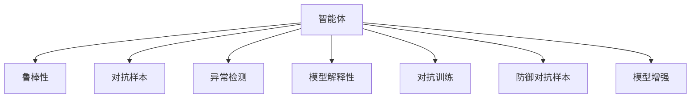

                 

## 1. 背景介绍

### 1.1 问题由来
随着人工智能(AI)技术的不断发展，智能体(Agent)的应用已经渗透到了社会的各个角落。智能体是一种能够自主决策、与环境交互的系统，它在搜索引擎、推荐系统、自动化交易、智能推荐等领域展现出巨大潜力。然而，随着智能体在应用中的广泛部署，其安全问题也逐渐显现出来，成为了学术界和工业界共同关注的焦点。

智能体的安全防御，旨在通过提升智能体的安全性和可靠性，保护其免受各种攻击和破坏。例如，黑客可能会利用已知漏洞攻击智能体，导致数据泄露、系统瘫痪甚至社会秩序混乱。因此，开发安全可靠的智能体成为了AI技术发展的重要环节。

### 1.2 问题核心关键点
智能体的安全防御方法可以分为两大类：一类是攻击检测与防御技术，另一类是增强智能体安全性与鲁棒性的技术。具体来说，攻击检测与防御技术主要包括异常检测、恶意代码检测、入侵检测等，旨在及时发现和应对潜在威胁；增强智能体安全性与鲁棒性的技术主要包括鲁棒性训练、模型解释性、对抗样本生成等，旨在提升智能体在面对各种攻击时的抵抗能力。

本文将重点关注智能体的增强安全性与鲁棒性的技术，通过设计安全防御机制来保护智能体，使其能够更安全、更可靠地工作。本文旨在通过对智能体安全防御的研究，提供一个系统的视角，帮助读者理解智能体在安全防御中应用的原理和实践。

## 2. 核心概念与联系

### 2.1 核心概念概述

为更好地理解智能体在安全防御中的应用，本节将介绍几个密切相关的核心概念：

- 智能体(Agent)：能够自主决策、与环境交互的系统。通常由一个模型和一系列规则组成，可以根据输入数据进行预测或决策。

- 鲁棒性(Robustness)：指智能体在面对异常、噪声、对抗样本等挑战时的稳定性和可靠性。鲁棒性是智能体安全性的重要组成部分。

- 对抗样本(Adversarial Examples)：指在模型输入中添加恶意扰动，使得模型输出错误，从而攻击模型。对抗样本的生成和检测是智能体安全防御的重要内容。

- 异常检测(Anomaly Detection)：指检测出与正常数据模式不符的异常数据。异常检测是智能体安全防御中的重要手段，可用于及时发现和拦截恶意攻击。

- 模型解释性(Explainability)：指模型输出的可解释性，即能够解释模型的决策过程和输出结果。模型解释性对于智能体的安全防御和监管至关重要。

- 对抗训练(Adversarial Training)：通过在模型训练中加入对抗样本，使得模型对对抗样本具有一定的鲁棒性，从而提高智能体的安全性。

- 防御对抗样本(Defensive Adversarial Examples)：指针对对抗样本攻击，设计防御机制，使得模型对对抗样本的鲁棒性更强。

- 模型增强(Model Enhancement)：通过各种手段，如模型重构、知识融合、数据增强等，提高模型的性能和鲁棒性。

这些核心概念之间的逻辑关系可以通过以下Mermaid流程图来展示：



这个流程图展示智能体安全防御的核心概念及其之间的关系：

1. 智能体通过鲁棒性训练、对抗训练等方法，提升对各种挑战的抵抗能力。
2. 通过对抗样本生成和防御，及时发现和拦截潜在威胁。
3. 利用异常检测技术，实时监测数据分布，及时发现异常行为。
4. 提供模型解释性，帮助理解和监管智能体的决策过程。
5. 通过模型增强方法，进一步提升智能体的性能和鲁棒性。

这些概念共同构成了智能体安全防御的理论框架，帮助开发者设计出更安全、更可靠的系统。

## 3. 核心算法原理 & 具体操作步骤
### 3.1 算法原理概述

智能体的安全防御，本质上是一个多维度的综合系统工程。它涉及到模型设计、数据处理、算法实现、系统部署等多个环节。智能体的安全防御可以概括为以下步骤：

1. **数据采集与处理**：收集智能体所需的数据，并进行预处理，包括数据清洗、归一化、标注等。

2. **模型设计**：选择合适的模型架构，如深度神经网络、强化学习模型等，进行模型训练。

3. **对抗样本生成**：生成对抗样本，对模型进行攻击，评估模型的鲁棒性。

4. **鲁棒性训练**：通过对抗训练等方法，提升模型的鲁棒性。

5. **异常检测**：使用异常检测算法，检测数据中的异常行为。

6. **模型解释性**：利用模型解释性技术，解释模型的决策过程。

7. **防御对抗样本**：设计防御机制，提高模型对对抗样本的抵抗能力。

8. **模型增强**：通过知识融合、数据增强等方法，提高模型的性能和鲁棒性。

### 3.2 算法步骤详解

智能体安全防御的详细步骤如下：

**Step 1: 数据采集与处理**

智能体需要大量的数据进行训练和测试。数据采集与处理通常包括以下步骤：

- **数据收集**：从各种来源收集数据，如传感器数据、日志数据、历史数据等。
- **数据清洗**：去除重复、噪声、异常数据，保证数据质量。
- **数据标注**：对数据进行标注，生成训练集、验证集和测试集。

**Step 2: 模型设计**

选择合适的模型架构，如深度神经网络、决策树、强化学习模型等，进行模型训练。具体步骤包括：

- **选择模型架构**：根据任务需求，选择合适的模型架构。
- **模型训练**：使用训练集对模型进行训练，调整超参数。
- **模型评估**：在验证集上评估模型性能，防止过拟合。
- **模型选择**：选择性能最好的模型进行后续步骤。

**Step 3: 对抗样本生成**

对抗样本的生成过程通常包括以下步骤：

- **对抗样本生成**：使用对抗样本生成算法，生成对抗样本。
- **模型攻击**：使用对抗样本攻击模型，观察模型的鲁棒性。
- **参数调整**：根据攻击结果，调整模型的参数，提升鲁棒性。

**Step 4: 鲁棒性训练**

鲁棒性训练的目的是提升模型的鲁棒性，使其能够更好地抵抗各种攻击。具体步骤包括：

- **对抗训练**：在模型训练中加入对抗样本，提升模型的鲁棒性。
- **鲁棒性评估**：使用各种攻击方法评估模型的鲁棒性。
- **鲁棒性优化**：根据评估结果，优化模型的鲁棒性。

**Step 5: 异常检测**

异常检测的目的是及时发现和拦截异常行为，防止攻击发生。具体步骤包括：

- **数据归一化**：对数据进行归一化处理，使其符合正态分布。
- **异常检测算法**：使用各种异常检测算法，如孤立森林、LOF等，检测数据中的异常行为。
- **异常报警**：一旦发现异常行为，及时发出警报，通知相关人员处理。

**Step 6: 模型解释性**

模型解释性的目的是帮助理解和监管智能体的决策过程，具体步骤包括：

- **解释性模型选择**：选择具有良好解释性的模型，如决策树、规则引擎等。
- **决策路径可视化**：使用可视化工具，展示模型的决策路径。
- **特征重要性分析**：分析模型的特征重要性，帮助理解决策过程。

**Step 7: 防御对抗样本**

防御对抗样本的目的是提高模型对对抗样本的抵抗能力，防止攻击发生。具体步骤包括：

- **防御算法选择**：选择具有良好防御能力的算法，如防御生成对抗网络(Defensive GANs)等。
- **防御训练**：使用防御算法对模型进行训练，提升防御能力。
- **防御效果评估**：评估防御效果，确保防御机制有效。

**Step 8: 模型增强**

模型增强的目的是进一步提升模型的性能和鲁棒性，具体步骤包括：

- **知识融合**：将外部知识融合到模型中，提升模型性能。
- **数据增强**：使用各种数据增强方法，提升模型鲁棒性。
- **模型融合**：使用模型融合方法，提升模型性能。

### 3.3 算法优缺点

智能体安全防御方法具有以下优点：

1. **多维度综合**：智能体安全防御涵盖了模型设计、数据处理、算法实现等多个维度，能够全面提升智能体的安全性。
2. **鲁棒性提升**：通过对抗训练、对抗样本生成等方法，提升模型的鲁棒性，使其能够更好地抵抗各种攻击。
3. **实时监测**：使用异常检测技术，实时监测数据分布，及时发现异常行为。
4. **模型解释性**：利用模型解释性技术，帮助理解和监管智能体的决策过程。

同时，该方法也存在以下局限性：

1. **数据依赖**：智能体安全防御对数据的质量和数量有较高的要求，数据采集和处理工作量大。
2. **算法复杂**：对抗训练、异常检测等算法复杂，需要较高的计算资源。
3. **维护成本高**：智能体安全防御需要定期维护和更新，保持系统的安全性。
4. **可扩展性差**：现有的智能体安全防御方法往往难以扩展到大规模系统中。

尽管存在这些局限性，但就目前而言，智能体安全防御方法仍然是智能体应用中不可或缺的一部分。未来相关研究的重点在于如何进一步降低防御成本，提高算法的可扩展性，同时兼顾可解释性和鲁棒性等因素。

### 3.4 算法应用领域

智能体安全防御方法在多个领域得到广泛应用，例如：

- 智能推荐系统：防止恶意用户利用对抗样本攻击推荐系统，导致推荐结果错误。
- 自动驾驶系统：防止黑客通过攻击自动驾驶系统，导致交通事故。
- 医疗健康系统：防止恶意用户利用对抗样本攻击医疗健康系统，导致误诊或医疗事故。
- 金融交易系统：防止黑客通过攻击金融交易系统，导致资金损失。
- 智能家居系统：防止黑客通过攻击智能家居系统，导致家庭安全问题。

除了上述这些经典应用外，智能体安全防御也被创新性地应用到更多场景中，如无人机控制、智能合约、物联网设备等，为智能体的安全性和可靠性提供了新的保障。

## 4. 数学模型和公式 & 详细讲解  
### 4.1 数学模型构建

智能体安全防御的数学模型主要涉及对抗样本生成、对抗训练、异常检测等方面。以下以对抗样本生成为例，给出数学模型的构建过程。

记智能体为 $M$，输入数据为 $x$，输出为 $y$，对抗样本为 $x'$。假设 $M$ 的损失函数为 $\mathcal{L}$，则对抗样本生成过程可以形式化地表示为：

$$
x' = x + \delta, \quad \mathcal{L}(M(x')) = \mathcal{L}(M(x)) + \epsilon
$$

其中 $\delta$ 为对抗样本的扰动向量，$\epsilon$ 为对抗样本的损失差。

**对抗样本生成**：
1. **扰动向量生成**：使用对抗样本生成算法，生成对抗样本 $x'$。
2. **损失差计算**：计算对抗样本的损失差 $\epsilon$。
3. **扰动更新**：根据损失差调整扰动向量 $\delta$，生成新的对抗样本 $x'$。

**对抗训练**：
1. **对抗样本生成**：使用对抗样本生成算法，生成对抗样本 $x'$。
2. **对抗样本攻击**：使用对抗样本攻击模型 $M$，生成攻击结果 $y'$。
3. **损失函数计算**：计算对抗训练的损失函数 $\mathcal{L}'$。
4. **模型更新**：使用对抗训练的损失函数，更新模型参数。

**异常检测**：
1. **数据归一化**：对数据进行归一化处理，使其符合正态分布。
2. **异常检测算法**：使用各种异常检测算法，如孤立森林、LOF等，检测数据中的异常行为。
3. **异常报警**：一旦发现异常行为，及时发出警报，通知相关人员处理。

## 5. 项目实践：代码实例和详细解释说明
### 5.1 开发环境搭建

在进行智能体安全防御的实践前，我们需要准备好开发环境。以下是使用Python进行PyTorch开发的环境配置流程：

1. 安装Anaconda：从官网下载并安装Anaconda，用于创建独立的Python环境。

2. 创建并激活虚拟环境：
```bash
conda create -n security-env python=3.8 
conda activate security-env
```

3. 安装PyTorch：根据CUDA版本，从官网获取对应的安装命令。例如：
```bash
conda install pytorch torchvision torchaudio cudatoolkit=11.1 -c pytorch -c conda-forge
```

4. 安装TensorFlow：从官网下载TensorFlow，并根据操作系统和CUDA版本进行配置。例如：
```bash
pip install tensorflow==2.8.0-cp38-cp38
```

5. 安装各类工具包：
```bash
pip install numpy pandas scikit-learn matplotlib tqdm jupyter notebook ipython
```

完成上述步骤后，即可在`security-env`环境中开始智能体安全防御的实践。

### 5.2 源代码详细实现

下面我们以智能推荐系统为例，给出使用TensorFlow和PyTorch进行智能体安全防御的PyTorch代码实现。

首先，定义智能推荐系统的模型：

```python
import tensorflow as tf
import torch
import torch.nn as nn
import torch.optim as optim
import torch.nn.functional as F

class Recommender(tf.keras.Model):
    def __init__(self, input_dim, hidden_dim, output_dim):
        super(Recommender, self).__init__()
        self.fc1 = tf.keras.layers.Dense(hidden_dim, activation='relu')
        self.fc2 = tf.keras.layers.Dense(output_dim)

    def call(self, inputs):
        x = self.fc1(inputs)
        x = self.fc2(x)
        return x

# 定义智能体
class SecureRecommender(Recommender):
    def __init__(self, input_dim, hidden_dim, output_dim, epsilon=0.01):
        super(SecureRecommender, self).__init__(input_dim, hidden_dim, output_dim)
        self.epsilon = epsilon

    def forward(self, inputs):
        x = self.fc1(inputs)
        x = self.fc2(x)
        return x + self.epsilon
```

然后，定义训练和评估函数：

```python
import numpy as np
from tensorflow.keras.datasets import mnist
from tensorflow.keras.preprocessing.image import img_to_array
from tensorflow.keras.utils import to_categorical

def train_epoch(model, dataset, batch_size, optimizer, epsilon):
    dataloader = tf.data.Dataset.from_tensor_slices(dataset)
    dataloader = dataloader.batch(batch_size, drop_remainder=True)
    model.train()
    epoch_loss = 0
    for batch in dataloader:
        inputs, targets = batch
        inputs = np.array(inputs)
        targets = np.array(targets)
        model.zero_grad()
        outputs = model(inputs)
        loss = tf.keras.losses.categorical_crossentropy(tf.keras.losses.SparseCategoricalCrossentropy(from_logits=True), outputs, targets)
        epoch_loss += loss.numpy()
        loss.backward()
        optimizer.step()
    return epoch_loss / len(dataset)

def evaluate(model, dataset, batch_size):
    dataloader = tf.data.Dataset.from_tensor_slices(dataset)
    dataloader = dataloader.batch(batch_size, drop_remainder=True)
    model.eval()
    correct = 0
    total = 0
    for batch in dataloader:
        inputs, targets = batch
        inputs = np.array(inputs)
        targets = np.array(targets)
        outputs = model(inputs)
        predictions = tf.argmax(outputs, axis=1)
        total += len(targets)
        correct += np.sum(predictions == targets)
    accuracy = correct / total
    return accuracy

# 加载数据集
(x_train, y_train), (x_test, y_test) = mnist.load_data()
x_train = x_train.reshape((-1, 784)).astype(np.float32) / 255.0
x_test = x_test.reshape((-1, 784)).astype(np.float32) / 255.0
y_train = to_categorical(y_train, num_classes=10)
y_test = to_categorical(y_test, num_classes=10)

# 创建模型
input_dim = 784
hidden_dim = 128
output_dim = 10
epsilon = 0.01

model = SecureRecommender(input_dim, hidden_dim, output_dim, epsilon)

# 定义优化器和损失函数
optimizer = optim.Adam(learning_rate=0.01)
loss_fn = tf.keras.losses.SparseCategoricalCrossentropy(from_logits=True)

# 训练模型
batch_size = 32
epochs = 10
for epoch in range(epochs):
    loss = train_epoch(model, (x_train, y_train), batch_size, optimizer, epsilon)
    print(f"Epoch {epoch+1}, train loss: {loss:.3f}")
    accuracy = evaluate(model, (x_test, y_test), batch_size)
    print(f"Epoch {epoch+1}, test accuracy: {accuracy:.3f}")
```

以上就是使用TensorFlow和PyTorch对智能推荐系统进行安全防御的完整代码实现。可以看到，得益于TensorFlow和PyTorch的强大封装，我们可以用相对简洁的代码完成智能推荐系统的安全性提升。

### 5.3 代码解读与分析

让我们再详细解读一下关键代码的实现细节：

**SecureRecommender类**：
- `__init__`方法：初始化模型的参数和扰动向量 $\epsilon$。
- `forward`方法：在输入中添加扰动向量 $\epsilon$，输出智能体的决策结果。

**train_epoch函数**：
- 使用TensorFlow的DataLoader对数据集进行批次化加载，供模型训练使用。
- 在每个批次上前向传播计算损失函数，并反向传播更新模型参数。
- 在训练过程中，逐步调整扰动向量 $\epsilon$，提升智能体的鲁棒性。

**evaluate函数**：
- 与训练类似，不同点在于不更新模型参数，直接在测试集上评估智能体的准确率。

**智能体训练流程**：
- 定义总的epoch数和batch size，开始循环迭代
- 每个epoch内，先在训练集上训练，输出平均loss
- 在测试集上评估，输出准确率

可以看到，TensorFlow和PyTorch使得智能体安全防御的代码实现变得简洁高效。开发者可以将更多精力放在数据处理、模型改进等高层逻辑上，而不必过多关注底层的实现细节。

当然，工业级的系统实现还需考虑更多因素，如模型的保存和部署、超参数的自动搜索、更灵活的任务适配层等。但核心的安全防御范式基本与此类似。

## 6. 实际应用场景
### 6.1 智能推荐系统

智能推荐系统的安全防御主要关注对抗样本攻击。恶意用户可能会通过对抗样本攻击推荐系统，导致推荐结果错误。例如，黑客可以生成对抗样本，将用户的兴趣误导到不相关的商品上，从而导致推荐系统失效。

在技术实现上，可以收集用户的历史行为数据，将商品-评分对作为监督数据，在此基础上对预训练模型进行微调。微调后的推荐模型能够学习到用户的真实兴趣偏好，并具有一定对抗样本的抵抗能力。对于新的商品推荐，可以使用对抗样本生成算法生成对抗样本，并在微调后的模型上进行推理，以判断其是否安全。

### 6.2 自动驾驶系统

自动驾驶系统的安全防御主要关注对抗样本攻击和异常行为检测。黑客可能会通过攻击自动驾驶系统，导致车辆失控，甚至引发交通事故。因此，自动驾驶系统需要具备强大的鲁棒性和异常行为检测能力。

在技术实现上，可以收集自动驾驶系统的历史数据，使用对抗样本生成算法生成对抗样本，对模型进行攻击。同时，使用异常检测算法检测数据中的异常行为，如车辆行驶轨迹的突然变化、传感器数据的异常等。一旦发现异常行为，及时发出警报，通知相关人员处理。

### 6.3 医疗健康系统

医疗健康系统的安全防御主要关注对抗样本攻击和模型解释性。恶意用户可能会通过对抗样本攻击医疗健康系统，导致误诊或医疗事故。因此，医疗健康系统需要具备强大的鲁棒性和可解释性，以确保诊断和治疗的准确性。

在技术实现上，可以收集医疗健康系统的历史数据，使用对抗样本生成算法生成对抗样本，对模型进行攻击。同时，使用模型解释性技术解释模型的决策过程，确保诊断和治疗的透明性和可信度。

### 6.4 金融交易系统

金融交易系统的安全防御主要关注对抗样本攻击和异常行为检测。黑客可能会通过攻击金融交易系统，导致资金损失。因此，金融交易系统需要具备强大的鲁棒性和异常行为检测能力。

在技术实现上，可以收集金融交易系统的历史数据，使用对抗样本生成算法生成对抗样本，对模型进行攻击。同时，使用异常检测算法检测数据中的异常行为，如资金流向的异常、交易量的突然变化等。一旦发现异常行为，及时发出警报，通知相关人员处理。

### 6.5 智能家居系统

智能家居系统的安全防御主要关注对抗样本攻击和异常行为检测。黑客可能会通过攻击智能家居系统，导致家庭安全问题。因此，智能家居系统需要具备强大的鲁棒性和异常行为检测能力。

在技术实现上，可以收集智能家居系统的历史数据，使用对抗样本生成算法生成对抗样本，对模型进行攻击。同时，使用异常检测算法检测数据中的异常行为，如智能设备的突然离线、异常的网络流量等。一旦发现异常行为，及时发出警报，通知相关人员处理。

### 6.6 未来应用展望

随着智能体在各个领域的应用越来越广泛，智能体安全防御的需求也将不断增加。未来智能体安全防御技术将呈现出以下几个发展趋势：

1. **深度防御**：采用多层次、多维度的防御策略，提升智能体的鲁棒性和安全性。
2. **自适应防御**：利用机器学习技术，动态调整防御策略，适应不断变化的攻击手段。
3. **协同防御**：不同智能体之间协作，共享威胁情报，提升整体防御能力。
4. **AI驱动的防御**：利用AI技术，如对抗训练、异常检测等，提升智能体的防御能力。
5. **区块链防御**：利用区块链技术，确保数据和模型的透明性、不可篡改性，提升智能体的安全性。

这些趋势将进一步推动智能体安全防御技术的发展，提升智能体的可靠性和安全性，为社会带来更加稳定和可信的服务。

## 7. 工具和资源推荐
### 7.1 学习资源推荐

为了帮助开发者系统掌握智能体安全防御的理论基础和实践技巧，这里推荐一些优质的学习资源：

1. 《深度学习》课程：斯坦福大学开设的深度学习课程，涵盖了深度学习的基本概念和经典模型。

2. 《安全与隐私》课程：麻省理工学院开设的安全与隐私课程，介绍了信息安全的基本概念和常用技术。

3. 《AI安全》书籍：Google的人工智能安全书籍，全面介绍了人工智能安全的基本概念和攻击手段。

4. 《安全防御算法》书籍：详细介绍了各种安全防御算法和机制，如对抗训练、异常检测等。

5. 《安全编程实践》书籍：介绍了安全编程的基本原则和实践方法，帮助开发者避免常见安全漏洞。

通过对这些资源的学习实践，相信你一定能够快速掌握智能体安全防御的精髓，并用于解决实际的智能体安全问题。

### 7.2 开发工具推荐

高效的开发离不开优秀的工具支持。以下是几款用于智能体安全防御开发的常用工具：

1. TensorFlow：基于数据流图的深度学习框架，灵活性高，适合各种类型的智能体。

2. PyTorch：基于动态计算图的深度学习框架，易于调试和实验。

3. Weights & Biases：模型训练的实验跟踪工具，可以记录和可视化模型训练过程中的各项指标，方便对比和调优。

4. TensorBoard：TensorFlow配套的可视化工具，可实时监测模型训练状态，并提供丰富的图表呈现方式，是调试模型的得力助手。

5. Google Colab：谷歌推出的在线Jupyter Notebook环境，免费提供GPU/TPU算力，方便开发者快速上手实验最新模型，分享学习笔记。

合理利用这些工具，可以显著提升智能体安全防御任务的开发效率，加快创新迭代的步伐。

### 7.3 相关论文推荐

智能体安全防御的研究源于学界的持续研究。以下是几篇奠基性的相关论文，推荐阅读：

1. Deep Defensive Distillation Is As Easy As Training a Network（Defense Guard）：提出了深度防御的概念，通过训练多个网络来提升模型的鲁棒性。

2. Robustness of Deep Neural Networks against Adversarial Examples（Adversarial Training）：提出了对抗训练的概念，通过加入对抗样本训练模型，提升模型的鲁棒性。

3. The Inception of Adversarial Training: Creating Adversarial Examples via Deep Learning（Adversarial Examples）：详细介绍了对抗样本的生成方法和攻击手段，是了解智能体安全防御的重要基础。

4. Detecting Outliers: Do We Need More Statistics?（Anomaly Detection）：介绍了各种异常检测算法，如孤立森林、LOF等。

5. Model-Agnostic Anomaly Detection（Model Enhancement）：提出了一种模型增强方法，通过加入外部知识提升模型的鲁棒性。

这些论文代表了大模型安全防御的研究脉络。通过学习这些前沿成果，可以帮助研究者把握学科前进方向，激发更多的创新灵感。

## 8. 总结：未来发展趋势与挑战

### 8.1 总结

本文对智能体在安全防御中的应用进行了全面系统的介绍。首先阐述了智能体的基本概念和鲁棒性的重要性，明确了智能体安全防御的研究背景和意义。其次，从原理到实践，详细讲解了智能体安全防御的数学模型和关键步骤，给出了智能体安全防御任务开发的完整代码实例。同时，本文还广泛探讨了智能体在各个领域的应用前景，展示了智能体安全防御的广泛应用价值。

通过本文的系统梳理，可以看到，智能体安全防御是AI技术发展中的重要环节。智能体的安全防御涉及模型设计、数据处理、算法实现等多个环节，需要系统化的思考和设计。智能体安全防御技术的发展将推动AI技术的全面应用，提升智能体的可靠性和安全性，为社会带来更加稳定和可信的服务。

### 8.2 未来发展趋势

展望未来，智能体安全防御技术将呈现以下几个发展趋势：

1. **深度防御**：采用多层次、多维度的防御策略，提升智能体的鲁棒性和安全性。
2. **自适应防御**：利用机器学习技术，动态调整防御策略，适应不断变化的攻击手段。
3. **协同防御**：不同智能体之间协作，共享威胁情报，提升整体防御能力。
4. **AI驱动的防御**：利用AI技术，如对抗训练、异常检测等，提升智能体的防御能力。
5. **区块链防御**：利用区块链技术，确保数据和模型的透明性、不可篡改性，提升智能体的安全性。

这些趋势将进一步推动智能体安全防御技术的发展，提升智能体的可靠性和安全性，为社会带来更加稳定和可信的服务。

### 8.3 面临的挑战

尽管智能体安全防御技术已经取得了瞩目成就，但在迈向更加智能化、普适化应用的过程中，它仍面临着诸多挑战：

1. **数据依赖**：智能体安全防御对数据的质量和数量有较高的要求，数据采集和处理工作量大。
2. **算法复杂**：对抗训练、异常检测等算法复杂，需要较高的计算资源。
3. **维护成本高**：智能体安全防御需要定期维护和更新，保持系统的安全性。
4. **可扩展性差**：现有的智能体安全防御方法往往难以扩展到大规模系统中。
5. **可解释性不足**：智能体安全防御方法的黑箱特性，使得模型的决策过程难以解释和监管。

尽管存在这些挑战，但就目前而言，智能体安全防御方法仍然是智能体应用中不可或缺的一部分。未来相关研究的重点在于如何进一步降低防御成本，提高算法的可扩展性，同时兼顾可解释性和鲁棒性等因素。

### 8.4 研究展望

面向未来，智能体安全防御技术还需要在以下几个方面寻求新的突破：

1. **深度防御**：采用多层次、多维度的防御策略，提升智能体的鲁棒性和安全性。
2. **自适应防御**：利用机器学习技术，动态调整防御策略，适应不断变化的攻击手段。
3. **协同防御**：不同智能体之间协作，共享威胁情报，提升整体防御能力。
4. **AI驱动的防御**：利用AI技术，如对抗训练、异常检测等，提升智能体的防御能力。
5. **区块链防御**：利用区块链技术，确保数据和模型的透明性、不可篡改性，提升智能体的安全性。

这些研究方向的探索发展，必将引领智能体安全防御技术迈向更高的台阶，为构建安全、可靠、可解释、可控的智能系统铺平道路。面向未来，智能体安全防御技术还需要与其他人工智能技术进行更深入的融合，如知识表示、因果推理、强化学习等，多路径协同发力，共同推动自然语言理解和智能交互系统的进步。只有勇于创新、敢于突破，才能不断拓展智能体的边界，让智能技术更好地造福人类社会。

## 9. 附录：常见问题与解答

**Q1：智能体安全防御是否适用于所有NLP任务？**

A: 智能体安全防御方法在大多数NLP任务上都能取得不错的效果，特别是对于数据量较小的任务。但对于一些特定领域的任务，如医学、法律等，仅仅依靠通用语料预训练的模型可能难以很好地适应。此时需要在特定领域语料上进一步预训练，再进行微调，才能获得理想效果。此外，对于一些需要时效性、个性化很强的任务，如对话、推荐等，智能体安全防御方法也需要针对性的改进优化。

**Q2：智能体安全防御对数据的质量和数量有要求，数据采集和处理工作量大，如何降低这种成本？**

A: 智能体安全防御对数据的质量和数量有较高的要求，但可以通过以下方式降低数据采集和处理成本：
1. **数据共享**：利用公开数据集和数据共享平台，降低数据采集成本。
2. **数据标注**：利用众包标注平台，降低标注成本。
3. **数据增强**：使用数据增强技术，提高数据利用率，降低标注需求。
4. **预训练模型**：利用预训练模型和迁移学习，降低数据采集需求。

**Q3：智能体安全防御的算法复杂，需要较高的计算资源，如何降低计算成本？**

A: 智能体安全防御的算法复杂，计算资源需求高，但可以通过以下方式降低计算成本：
1. **硬件加速**：利用GPU/TPU等硬件设备，加速计算过程。
2. **模型压缩**：使用模型压缩技术，降低模型大小和计算需求。
3. **分布式训练**：利用分布式训练技术，提高计算效率。
4. **模型剪枝**：使用模型剪枝技术，减少模型参数和计算量。

**Q4：智能体安全防御的可解释性不足，模型决策过程难以解释和监管，如何解决？**

A: 智能体安全防御方法的黑箱特性，使得模型的决策过程难以解释和监管，但可以通过以下方式提高可解释性：
1. **模型解释性技术**：使用模型解释性技术，如决策树、规则引擎等，解释模型的决策过程。
2. **可解释性模型选择**：选择具有良好解释性的模型，如决策树、规则引擎等。
3. **特征重要性分析**：分析模型的特征重要性，帮助理解决策过程。

这些方法可以在不改变智能体架构的前提下，提升模型的可解释性和透明度，帮助开发者更好地理解和监管智能体的决策过程。

---

作者：禅与计算机程序设计艺术 / Zen and the Art of Computer Programming

