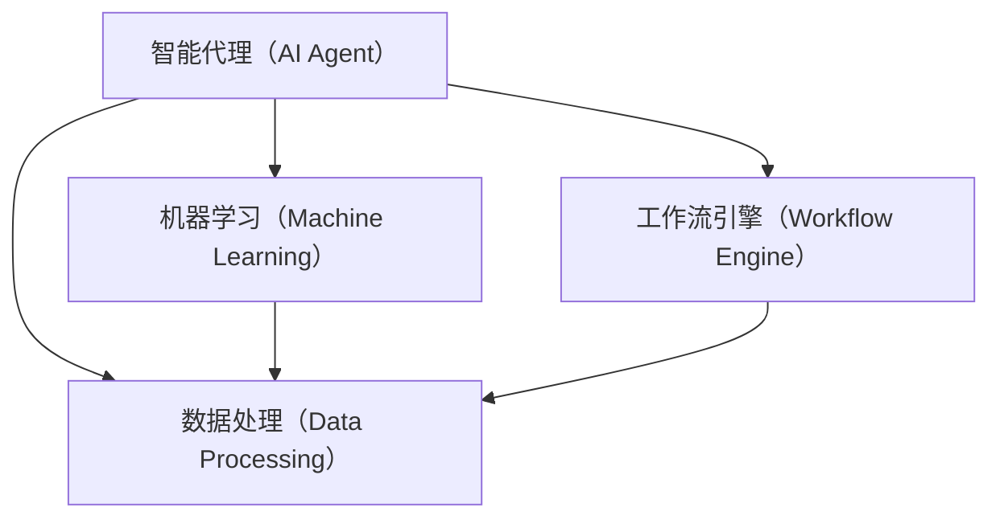

                 

# AI人工智能代理工作流 AI Agent WorkFlow：在新零售中的应用

> 关键词：人工智能, 新零售, 代理工作流, 工作流引擎, 机器学习, 数据处理, 客户服务, 供应链管理

## 1. 背景介绍

### 1.1 问题由来

随着科技的不断进步，新零售模式正在快速变革。传统的零售行业正逐渐由实体店面向线上线下融合转变，消费者对购物体验的期望也在不断提高。新零售的典型特征包括全渠道运营、个性化推荐、智能仓储、高效物流等。为了更好地满足消费者需求，零售商需要借助先进的技术手段，提升运营效率，实现供应链的全链条优化。

然而，新零售模式对数据处理能力、算力需求、客户交互体验等多方面都提出了更高要求。传统的IT系统难以适应新零售的复杂场景，需要引入更为智能、灵活的解决方案。人工智能技术，特别是智能代理和自动化工作流技术，在新零售的实施过程中展现了巨大的潜力和价值。

### 1.2 问题核心关键点

在新零售的应用中，人工智能代理和自动化工作流技术扮演着至关重要的角色。具体而言，关键点包括：

- **智能代理（AI Agent）**：一种具备自主推理、自主决策能力的自动化软件系统。能够在复杂多变的场景中，根据实时数据和反馈，执行任务、做出决策，甚至提供客户服务。
- **工作流引擎（Workflow Engine）**：自动化工具，用于定义、调度、执行和管理一系列的任务操作。通过预定义的规则和流程，实现任务的无缝衔接和自动化处理。
- **机器学习（Machine Learning）**：利用数据驱动的方式，让系统具备自我学习和改进的能力，能够通过数据不断优化自身的决策和操作。
- **数据处理（Data Processing）**：新零售涉及大量数据，包括销售数据、客户数据、供应链数据等，需要高效的数据处理能力。

### 1.3 问题研究意义

新零售场景中的代理工作流技术，不仅能够提高运营效率，降低运营成本，还能提升客户满意度，增强市场竞争力。具体而言：

1. **运营效率提升**：通过智能代理自动执行任务，减少了人力投入，提升了执行速度和准确性。
2. **成本节约**：自动化流程减少了人工操作，降低了运营成本。
3. **客户体验优化**：智能代理能够实时响应客户需求，提供个性化服务，提升客户满意度。
4. **供应链优化**：通过实时监控和预测，智能代理能够优化库存管理、物流配送等，提升供应链效率。
5. **数据分析和决策支持**：智能代理能够实时处理和分析数据，辅助决策。

## 2. 核心概念与联系

### 2.1 核心概念概述

为了更好地理解新零售中的AI代理工作流技术，我们首先介绍几个核心概念：

- **智能代理（AI Agent）**：基于AI技术的自动化系统，具备自主决策和执行能力，可以处理复杂的业务逻辑和任务操作。
- **工作流引擎（Workflow Engine）**：自动化工具，用于定义、执行和管理一系列任务操作，确保任务的无缝衔接和自动化处理。
- **机器学习（Machine Learning）**：利用数据驱动的方式，让系统具备自我学习和改进的能力。
- **数据处理（Data Processing）**：通过高效的数据处理技术，确保数据的实时性和准确性，支持智能代理和自动化工作流的运行。

### 2.2 核心概念原理和架构的 Mermaid 流程图



这个流程图展示了智能代理、数据处理、机器学习和工作流引擎之间的联系。

1. **智能代理**：通过数据处理获取实时数据，利用机器学习算法进行分析和决策，执行相应的任务操作。
2. **工作流引擎**：定义任务流程和规则，协调各个任务的操作，确保任务的无缝衔接。
3. **数据处理**：实时获取和处理数据，支持智能代理和自动化工作流的运行。
4. **机器学习**：利用历史数据和实时数据，不断优化智能代理的决策和操作。

## 3. 核心算法原理 & 具体操作步骤

### 3.1 算法原理概述

新零售中的代理工作流技术，主要基于AI代理和自动化工作流两个核心组件，利用数据处理和机器学习算法，实现任务的无缝衔接和自动化处理。具体而言：

- **数据处理**：实时获取和处理数据，确保数据的准确性和实时性，支持智能代理的决策和执行。
- **机器学习**：利用历史数据和实时数据，不断优化智能代理的决策和操作，提升系统的精准度和鲁棒性。
- **智能代理**：根据实时数据和机器学习的优化，自主执行任务和决策，提升运营效率和客户满意度。
- **工作流引擎**：定义和管理任务流程，确保任务的无缝衔接和自动化处理，提升系统的灵活性和可扩展性。

### 3.2 算法步骤详解

1. **数据获取和处理**：
   - 实时获取销售数据、客户数据、供应链数据等，确保数据的实时性和准确性。
   - 数据清洗和预处理，去除噪声和异常值，进行数据归一化。
   - 数据存储和管理，确保数据的高效访问和处理。

2. **机器学习模型训练**：
   - 收集历史数据，包括销售数据、客户数据、供应链数据等，构建数据集。
   - 选择合适的机器学习算法，进行模型训练，优化决策和操作。
   - 模型评估和优化，不断提升模型的准确度和鲁棒性。

3. **智能代理任务执行**：
   - 根据实时数据和机器学习模型，智能代理自动执行任务和决策。
   - 通过工作流引擎，协调各个任务的操作，确保任务的无缝衔接。
   - 实时监控和反馈，根据任务执行结果进行优化和调整。

4. **工作流引擎管理**：
   - 定义和管理任务流程，确保任务的无缝衔接和自动化处理。
   - 实时监控任务执行情况，根据任务执行结果进行优化和调整。
   - 提供可视化界面，支持任务的操作和管理。

### 3.3 算法优缺点

新零售中的代理工作流技术，具有以下优点：

- **高效运营**：通过自动化处理和智能代理，减少了人力投入，提升了执行速度和准确性。
- **成本节约**：自动化流程减少了人工操作，降低了运营成本。
- **客户体验优化**：智能代理能够实时响应客户需求，提供个性化服务，提升客户满意度。
- **供应链优化**：通过实时监控和预测，智能代理能够优化库存管理、物流配送等，提升供应链效率。
- **数据分析和决策支持**：智能代理能够实时处理和分析数据，辅助决策。

同时，也存在以下缺点：

- **依赖数据质量**：代理工作流技术依赖高质量的数据，如果数据存在噪声和异常值，会影响系统的性能。
- **技术复杂度**：技术实现较为复杂，需要多学科的协作，包括AI、数据处理、自动化等。
- **系统维护**：系统需要持续维护和优化，以应对业务变化和数据更新。

### 3.4 算法应用领域

新零售中的代理工作流技术，已广泛应用于以下几个领域：

1. **客户服务**：智能代理能够实时响应客户需求，提供个性化服务，提升客户满意度。
2. **库存管理**：智能代理能够实时监控库存情况，优化库存管理，避免库存积压和缺货。
3. **物流配送**：智能代理能够实时监控物流配送情况，优化配送路线，提升配送效率。
4. **销售预测**：利用机器学习模型，智能代理能够进行销售预测，辅助决策。
5. **数据分析**：智能代理能够实时处理和分析数据，提供业务洞察和决策支持。

## 4. 数学模型和公式 & 详细讲解 & 举例说明

### 4.1 数学模型构建

在新零售的代理工作流技术中，核心数学模型包括数据处理、机器学习、智能代理和任务调度等部分。

- **数据处理模型**：用于描述数据的采集、清洗和预处理过程，确保数据的实时性和准确性。
- **机器学习模型**：用于描述模型训练和优化过程，提升模型的准确度和鲁棒性。
- **智能代理模型**：用于描述智能代理的决策和执行过程，确保任务的高效处理。
- **工作流引擎模型**：用于描述任务流程的定义和管理过程，确保任务的无缝衔接和自动化处理。

### 4.2 公式推导过程

1. **数据处理模型**：

   - **数据采集**：$x_t = f(t)$，表示在时间$t$采集到的数据。
   - **数据清洗**：$x_t = g(x_t)$，表示对采集到的数据进行清洗和预处理。
   - **数据存储**：$x_t = h(x_t)$，表示对清洗后的数据进行存储和管理。

2. **机器学习模型**：

   - **模型训练**：$\theta = arg\min_{\theta} L(\theta, X, Y)$，表示利用数据集$(X,Y)$训练模型$\theta$，最小化损失函数$L$。
   - **模型评估**：$P(\hat{y}, y) = \sum_{i=1}^N p(y_i|\hat{y}_i)$，表示利用测试集$(X_{test}, Y_{test})$评估模型$\hat{y}$的性能，计算准确率$P$。

3. **智能代理模型**：

   - **任务执行**：$a_t = f(a_{t-1}, x_t, \theta)$，表示智能代理在时间$t$根据上一次状态$a_{t-1}$和当前数据$x_t$，执行任务$a_t$。
   - **任务反馈**：$x_{t+1} = g(a_t, x_t)$，表示智能代理在执行任务$a_t$后，将反馈信息$x_{t+1}$用于下一次决策。

4. **工作流引擎模型**：

   - **任务定义**：$F = \{f_i\}_{i=1}^N$，表示定义的$N$个任务$f_i$。
   - **任务调度**：$s_t = \min_{f_i} cost(f_i, a_t)$，表示根据当前状态$a_t$和任务$f_i$的代价$cost$，调度最优任务$f_i$执行。
   - **任务监控**：$M = \{m_i\}_{i=1}^N$，表示对任务$f_i$的监控指标$m_i$。

### 4.3 案例分析与讲解

以智能仓储管理为例，说明如何利用代理工作流技术实现供应链优化。

1. **数据处理**：
   - 实时采集仓库中的货物信息、库存信息、物流信息等，确保数据的实时性和准确性。
   - 数据清洗和预处理，去除噪声和异常值，进行数据归一化。
   - 数据存储和管理，确保数据的高效访问和处理。

2. **机器学习模型训练**：
   - 收集历史数据，包括货物信息、库存信息、物流信息等，构建数据集。
   - 利用机器学习算法，进行模型训练，优化库存管理决策和物流配送。
   - 模型评估和优化，不断提升模型的准确度和鲁棒性。

3. **智能代理任务执行**：
   - 根据实时数据和机器学习模型，智能代理自动执行任务和决策，如补货、调拨、配送等。
   - 通过工作流引擎，协调各个任务的操作，确保任务的无缝衔接。
   - 实时监控和反馈，根据任务执行结果进行优化和调整。

4. **工作流引擎管理**：
   - 定义和管理任务流程，确保任务的无缝衔接和自动化处理。
   - 实时监控任务执行情况，根据任务执行结果进行优化和调整。
   - 提供可视化界面，支持任务的操作和管理。

## 5. 项目实践：代码实例和详细解释说明

### 5.1 开发环境搭建

在新零售的代理工作流技术项目开发中，需要搭建一个完整的开发环境，包括以下几个步骤：

1. **环境准备**：
   - 安装Python和必要的库，如PyTorch、TensorFlow、Keras等。
   - 安装数据处理工具，如Pandas、NumPy、Scikit-Learn等。
   - 安装任务调度工具，如Airflow、Kubernetes等。

2. **数据准备**：
   - 收集和整理数据，确保数据的完整性和准确性。
   - 进行数据清洗和预处理，去除噪声和异常值，进行数据归一化。
   - 数据存储和管理，确保数据的高效访问和处理。

3. **模型训练**：
   - 构建机器学习模型，利用历史数据进行训练，优化决策和操作。
   - 模型评估和优化，不断提升模型的准确度和鲁棒性。

### 5.2 源代码详细实现

以下是一个基于PyTorch的智能代理模型实现示例，用于新零售中的库存管理任务：

```python
import torch
import torch.nn as nn
import torch.optim as optim

class InventoryModel(nn.Module):
    def __init__(self, input_size, hidden_size, output_size):
        super(InventoryModel, self).__init__()
        self.hidden = nn.Linear(input_size, hidden_size)
        self.relu = nn.ReLU()
        self.output = nn.Linear(hidden_size, output_size)

    def forward(self, x):
        hidden = self.hidden(x)
        hidden = self.relu(hidden)
        output = self.output(hidden)
        return output

# 准备数据
x = torch.randn(100, 5)  # 输入数据
y = torch.randn(100, 1)  # 目标数据

# 构建模型
model = InventoryModel(5, 10, 1)
criterion = nn.MSELoss()
optimizer = optim.SGD(model.parameters(), lr=0.01)

# 模型训练
for epoch in range(100):
    optimizer.zero_grad()
    output = model(x)
    loss = criterion(output, y)
    loss.backward()
    optimizer.step()
```

### 5.3 代码解读与分析

在上述代码中，我们定义了一个简单的线性回归模型，用于新零售中的库存管理任务。

1. **模型定义**：
   - `InventoryModel`类定义了一个简单的线性回归模型，包括输入层、隐藏层和输出层。
   - `nn.Linear`用于定义全连接层，`nn.ReLU`用于定义激活函数，`nn.MSELoss`用于定义损失函数。

2. **数据准备**：
   - `x`表示输入数据，`y`表示目标数据。

3. **模型训练**：
   - `optimizer`定义了优化器，`criterion`定义了损失函数，`model.parameters()`表示模型参数。
   - `for`循环用于迭代训练，`optimizer.zero_grad()`用于清除梯度，`loss.backward()`用于反向传播，`optimizer.step()`用于更新参数。

4. **运行结果展示**：
   - 训练过程中，可以输出每次迭代的损失值，用于监控模型的训练效果。

## 6. 实际应用场景

### 6.1 智能客服

智能客服是智能代理在新零售中的一个典型应用场景。通过智能客服系统，零售商可以提供24小时不间断的客户服务，提升客户体验和满意度。

具体而言，智能客服系统可以通过实时分析客户对话内容，快速识别客户需求，提供个性化服务，如推荐商品、解答疑问、处理投诉等。智能客服系统能够处理大量的客户请求，减轻人工客服的负担，提升服务效率。

### 6.2 智能仓储

智能仓储管理是新零售中的重要应用场景。通过智能仓储系统，零售商可以实现库存管理、物流配送、供应链优化等功能的自动化。

具体而言，智能仓储系统可以通过实时监控库存情况，自动生成补货、调拨、配送等操作指令，提升仓储管理效率，减少库存积压和缺货现象。同时，智能仓储系统还能够优化物流配送路线，提升配送效率，降低物流成本。

### 6.3 个性化推荐

个性化推荐是新零售中的核心应用场景之一。通过智能推荐系统，零售商可以精准推荐商品，提升用户体验和销售转化率。

具体而言，个性化推荐系统可以通过分析客户行为数据、历史购买记录等，生成个性化的商品推荐列表。智能推荐系统能够实时更新推荐结果，根据客户反馈不断优化推荐算法，提升推荐效果。

### 6.4 未来应用展望

随着技术的发展，智能代理和自动化工作流技术将在新零售中发挥越来越重要的作用。未来，我们可以期待以下趋势：

1. **全场景应用**：智能代理和自动化工作流技术将覆盖新零售中的各个环节，包括客户服务、库存管理、物流配送、个性化推荐等，实现全面智能化。
2. **多模态融合**：智能代理和自动化工作流技术将融合视觉、语音、文本等多种模态数据，提供更全面、更精准的服务。
3. **实时决策**：智能代理和自动化工作流技术将实现实时决策，根据实时数据和反馈，动态调整运营策略，提升运营效率和客户满意度。
4. **自动化优化**：智能代理和自动化工作流技术将实现自动化优化，利用机器学习算法，不断优化决策和操作，提升系统的稳定性和鲁棒性。
5. **人性化交互**：智能代理和自动化工作流技术将实现人性化交互，通过自然语言处理技术，与客户进行自然流畅的对话，提升客户体验。

## 7. 工具和资源推荐

### 7.1 学习资源推荐

为了帮助开发者系统掌握代理工作流技术，我们推荐以下学习资源：

1. **《Deep Learning with PyTorch》**：由PyTorch官方出版的书籍，全面介绍了PyTorch的使用方法和实践技巧，是学习AI代理工作流技术的重要基础。
2. **《TensorFlow for Deep Learning》**：由Google出版的书籍，详细介绍了TensorFlow的使用方法和实践技巧，是学习AI代理工作流技术的另一重要基础。
3. **《Hands-On Machine Learning with Scikit-Learn》**：由Scikit-Learn官方出版的书籍，全面介绍了机器学习算法和实现方法，是学习AI代理工作流技术的必备工具。
4. **《Airflow快速入门指南》**：由Airflow官方出版的书籍，详细介绍了Airflow的使用方法和实践技巧，是学习代理工作流技术的必备工具。
5. **《Kubernetes：入门到实践》**：由Kubernetes官方出版的书籍，全面介绍了Kubernetes的使用方法和实践技巧，是学习代理工作流技术的必备工具。

### 7.2 开发工具推荐

在新零售的代理工作流技术项目开发中，需要以下开发工具：

1. **PyTorch**：基于Python的开源深度学习框架，适合快速迭代研究。
2. **TensorFlow**：由Google主导开发的开源深度学习框架，生产部署方便，适合大规模工程应用。
3. **Scikit-Learn**：用于机器学习和数据分析的Python库，适合快速原型开发和实验验证。
4. **Airflow**：用于定义和调度任务流程的自动化工具，适合构建复杂的自动化工作流系统。
5. **Kubernetes**：用于容器编排和调度的自动化工具，适合部署和管理大规模的代理工作流系统。

### 7.3 相关论文推荐

为了深入了解代理工作流技术的发展脉络，我们推荐以下相关论文：

1. **《Towards Explainable AI》**：提出了解释性AI的概念和实现方法，讨论了如何提升AI模型的可解释性和可理解性。
2. **《Multi-Modal Conversational Agents》**：研究了多模态对话系统，探讨了如何将视觉、语音、文本等多种模态数据融合，提升对话系统的理解和生成能力。
3. **《Robustness of AI Models》**：探讨了AI模型的鲁棒性和安全性，讨论了如何提升模型的稳定性和可解释性。
4. **《Model-Based Reinforcement Learning》**：研究了基于模型的强化学习算法，讨论了如何通过模型优化，提升AI代理的决策和操作能力。
5. **《Autonomous Warehouse Management》**：研究了自动化仓储管理系统，探讨了如何利用AI和自动化技术，提升仓储管理效率和客户满意度。

## 8. 总结：未来发展趋势与挑战

### 8.1 研究成果总结

新零售中的代理工作流技术，是人工智能和自动化技术在新零售场景中的重要应用，具有广泛的应用前景和重要的研究价值。

1. **高效运营**：通过智能代理和自动化工作流技术，减少了人力投入，提升了执行速度和准确性。
2. **成本节约**：自动化流程减少了人工操作，降低了运营成本。
3. **客户体验优化**：智能代理能够实时响应客户需求，提供个性化服务，提升客户满意度。
4. **供应链优化**：通过实时监控和预测，智能代理能够优化库存管理、物流配送等，提升供应链效率。
5. **数据分析和决策支持**：智能代理能够实时处理和分析数据，提供业务洞察和决策支持。

### 8.2 未来发展趋势

未来，新零售中的代理工作流技术将呈现以下几个发展趋势：

1. **全场景应用**：智能代理和自动化工作流技术将覆盖新零售中的各个环节，包括客户服务、库存管理、物流配送、个性化推荐等，实现全面智能化。
2. **多模态融合**：智能代理和自动化工作流技术将融合视觉、语音、文本等多种模态数据，提供更全面、更精准的服务。
3. **实时决策**：智能代理和自动化工作流技术将实现实时决策，根据实时数据和反馈，动态调整运营策略，提升运营效率和客户满意度。
4. **自动化优化**：智能代理和自动化工作流技术将实现自动化优化，利用机器学习算法，不断优化决策和操作，提升系统的稳定性和鲁棒性。
5. **人性化交互**：智能代理和自动化工作流技术将实现人性化交互，通过自然语言处理技术，与客户进行自然流畅的对话，提升客户体验。

### 8.3 面临的挑战

尽管智能代理和自动化工作流技术在新零售中展现了巨大的潜力和价值，但也面临诸多挑战：

1. **依赖数据质量**：代理工作流技术依赖高质量的数据，如果数据存在噪声和异常值，会影响系统的性能。
2. **技术复杂度**：技术实现较为复杂，需要多学科的协作，包括AI、数据处理、自动化等。
3. **系统维护**：系统需要持续维护和优化，以应对业务变化和数据更新。
4. **安全性**：智能代理和自动化工作流系统需要确保数据和模型的安全，避免数据泄露和模型被恶意攻击。
5. **可解释性**：智能代理和自动化工作流系统需要具备可解释性，能够解释决策和操作的原因，确保系统的透明性和可信性。

### 8.4 研究展望

未来，智能代理和自动化工作流技术需要在以下几个方面寻求新的突破：

1. **数据质量提升**：通过数据清洗和预处理技术，提升数据的实时性和准确性，确保系统的稳定性和鲁棒性。
2. **技术协同创新**：多学科协同创新，提升技术实现效率和效果，确保系统的可扩展性和可靠性。
3. **系统维护优化**：通过自动化监控和预警，提升系统的可维护性和可扩展性，确保系统的稳定性和可靠性。
4. **安全性保障**：通过加密和防护技术，确保数据和模型的安全，避免数据泄露和模型被恶意攻击。
5. **可解释性增强**：通过可解释性技术，解释决策和操作的原因，确保系统的透明性和可信性。

新零售中的智能代理和自动化工作流技术，正处于快速发展阶段，需要持续创新和优化，才能更好地服务于新零售场景，提升运营效率和客户满意度。

## 9. 附录：常见问题与解答

### Q1: 新零售中的代理工作流技术是如何定义任务流程的？

**A1:** 新零售中的代理工作流技术，通过工作流引擎定义和管理任务流程，确保任务的无缝衔接和自动化处理。具体而言，工作流引擎定义了任务的输入、输出、执行规则、异常处理等，确保任务执行的顺序和正确性。例如，在新零售中的库存管理任务中，工作流引擎定义了补货、调拨、配送等任务，确保任务的无缝衔接和自动化处理。

### Q2: 新零售中的代理工作流技术如何确保系统的鲁棒性？

**A2:** 新零售中的代理工作流技术，通过多层次的鲁棒性设计，确保系统的稳定性和鲁棒性。具体而言，可以通过以下方法：

1. **数据清洗和预处理**：清洗和预处理数据，去除噪声和异常值，确保数据的质量和实时性。
2. **模型优化和评估**：通过机器学习算法，不断优化模型的决策和操作，提升模型的准确度和鲁棒性。
3. **任务监控和预警**：实时监控任务执行情况，根据任务执行结果进行优化和调整，避免系统崩溃和异常。
4. **异常处理和容错**：设计异常处理机制，确保系统在异常情况下能够正常运行，避免系统失效。

### Q3: 新零售中的代理工作流技术如何实现实时决策？

**A3:** 新零售中的代理工作流技术，通过实时数据处理和机器学习算法，实现实时决策。具体而言，可以通过以下方法：

1. **实时数据采集**：实时采集新零售场景中的各种数据，如客户数据、销售数据、供应链数据等，确保数据的实时性和准确性。
2. **数据清洗和预处理**：清洗和预处理数据，去除噪声和异常值，进行数据归一化，确保数据的质量和实时性。
3. **机器学习模型训练**：利用历史数据和实时数据，训练机器学习模型，优化决策和操作。
4. **实时决策执行**：根据实时数据和机器学习模型，智能代理自动执行任务和决策，提升决策的实时性和准确性。

### Q4: 新零售中的代理工作流技术如何提升客户满意度？

**A4:** 新零售中的代理工作流技术，通过智能客服系统提升客户满意度。具体而言，可以通过以下方法：

1. **实时响应客户需求**：智能客服系统能够实时响应客户需求，提供个性化服务，如推荐商品、解答疑问、处理投诉等。
2. **个性化推荐**：智能客服系统能够根据客户历史行为数据，推荐个性化的商品，提升客户满意度和转化率。
3. **多渠道支持**：智能客服系统支持多种渠道，如语音、文本、图片等，提供多样化的客户服务方式，提升客户体验。

### Q5: 新零售中的代理工作流技术如何优化供应链管理？

**A5:** 新零售中的代理工作流技术，通过智能仓储管理系统优化供应链管理。具体而言，可以通过以下方法：

1. **实时监控库存情况**：智能仓储系统能够实时监控库存情况，自动生成补货、调拨、配送等操作指令，提升仓储管理效率。
2. **优化物流配送路线**：智能仓储系统能够实时监控物流配送情况，优化配送路线，提升配送效率，降低物流成本。
3. **动态调整运营策略**：智能仓储系统能够根据实时数据和反馈，动态调整运营策略，提升供应链效率和客户满意度。

---

作者：禅与计算机程序设计艺术 / Zen and the Art of Computer Programming

