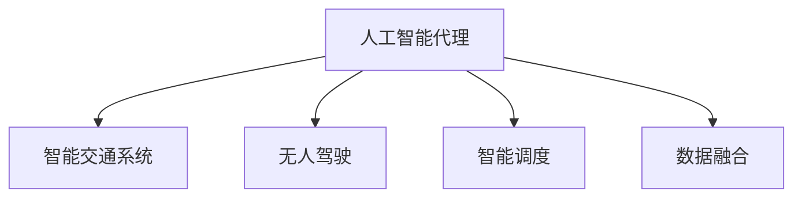

                 

# AI人工智能代理工作流 AI Agent WorkFlow：在智能交通中的应用

> 关键词：智能交通，人工智能代理，工作流设计，系统架构，无人驾驶，智能调度，数据融合

## 1. 背景介绍

### 1.1 问题由来
随着智慧城市的迅猛发展，智能交通系统在提升城市运行效率、缓解交通拥堵、降低环境污染等方面起到了重要作用。智能交通系统集成了传感器、监控摄像头、GPS导航等众多硬件设备，并通过先进的数据处理和算法技术实现信息共享与决策支持。在这一过程中，人工智能代理（AI Agent）扮演了至关重要的角色。

人工智能代理利用其自主学习、决策和执行能力，通过与城市基础设施、交通参与者和其他智能系统交互，实现智能化交通管理。AI Agent在实时数据处理、路径规划、事件响应等方面具有显著优势，可以有效提升交通系统的运行效率和安全性。

然而，要构建高效可靠的智能交通系统，设计合理的AI Agent工作流（AI Agent Workflow）是关键。工作流设计不仅决定了系统的性能表现，还关系到整个系统的可扩展性、维护性和灵活性。因此，本文将深入探讨AI Agent工作流在智能交通中的应用，为相关领域的研究者和实践者提供参考。

## 2. 核心概念与联系

### 2.1 核心概念概述

为更好地理解AI Agent工作流在智能交通中的应用，本节将介绍几个核心概念：

- **人工智能代理 (AI Agent)**：在智能交通系统中，AI Agent负责自主感知环境、决策路径、执行任务，通过与交通设施和用户交互，实现智能化交通管理。
- **工作流设计 (Workflow Design)**：通过定义一组任务、活动及其执行顺序，构建AI Agent在智能交通中的工作流程，确保系统高效、可靠运行。
- **智能交通系统 (Intelligent Transportation System, ITS)**：集成多种技术手段，通过数据感知、信息处理和决策支持，实现交通流优化、事故预防、资源管理等功能。
- **无人驾驶 (Autonomous Driving)**：利用AI Agent自动感知、决策和执行交通任务，提高交通系统的自动化水平。
- **智能调度 (Intelligent Scheduling)**：通过AI Agent优化交通资源配置，提高道路通行效率和运输效率。
- **数据融合 (Data Fusion)**：整合来自不同数据源的信息，通过AI Agent进行高效分析和应用，支撑交通管理决策。

这些核心概念之间的逻辑关系可以通过以下Mermaid流程图来展示：



这个流程图展示了AI Agent在智能交通系统中的核心角色，以及与无人驾驶、智能调度、数据融合等子系统的联系。通过这些核心概念，我们可以更好地理解AI Agent在智能交通系统中的作用及其对系统性能的影响。

## 3. 核心算法原理 & 具体操作步骤
### 3.1 算法原理概述

AI Agent工作流在智能交通系统中的应用，本质上是将AI Agent的功能模块化、任务化，并通过一套规范化的流程来实现其协同工作。其核心思想是：通过定义明确的输入输出接口，将AI Agent的任务分解为一系列子任务，构建一个有机的任务执行链。这样，AI Agent能够自主完成从感知到决策再到执行的整个流程，实现交通系统的智能化管理。

以智能调度为例，AI Agent通过实时监控交通数据，分析拥堵情况，预测未来流量，并根据最优路径生成调度策略，自动调整信号灯、公交车等交通资源的配置。这一过程可以分为感知、分析、决策和执行四个阶段，每个阶段对应一个子任务。通过任务化的工作流设计，AI Agent能够高效、稳定地完成各项任务，提升交通系统的运行效率。

### 3.2 算法步骤详解

AI Agent工作流的构建，通常包括以下几个关键步骤：

**Step 1: 需求分析与任务定义**

1. **需求分析**：详细了解智能交通系统的具体需求，包括交通流管理、事故预防、应急响应等。
2. **任务定义**：将需求转化为具体的AI Agent任务，如交通流量监测、交通信号优化、路径规划、应急响应等。

**Step 2: 功能模块化**

1. **模块划分**：将每个任务分解为多个功能模块，如感知模块、决策模块、执行模块等。
2. **接口设计**：为每个模块设计清晰的输入输出接口，确保模块之间能够高效协同工作。

**Step 3: 工作流设计**

1. **流程规划**：定义模块执行的先后顺序，构建一个有机的任务执行链。
2. **异常处理**：设计异常情况下的应对策略，确保系统稳定运行。

**Step 4: 实现与集成**

1. **代码实现**：开发每个模块的功能逻辑，确保代码模块化和可扩展性。
2. **系统集成**：将各模块集成到智能交通系统中，构建完整的AI Agent工作流。

**Step 5: 测试与优化**

1. **测试验证**：通过模拟测试和实际应用，验证AI Agent工作流的正确性和性能。
2. **性能优化**：根据测试结果，优化算法和流程，提升系统效率。

### 3.3 算法优缺点

AI Agent工作流在智能交通系统中的应用具有以下优点：

1. **高效协作**：通过任务化的设计，AI Agent能够自主完成复杂任务，提升系统效率。
2. **灵活可扩展**：模块化的设计方式，便于在系统需求变化时快速添加或调整任务模块。
3. **鲁棒性强**：通过任务之间的协同，即使某个模块出现故障，系统仍能继续执行，确保稳定运行。
4. **易于维护**：模块化的结构便于模块的单独测试和维护，降低了系统复杂性。

同时，该方法也存在一些局限性：

1. **初始设计复杂**：任务定义和模块划分需要高度的领域知识和经验，设计复杂度较高。
2. **性能瓶颈**：各模块之间的通信和协作可能会引入额外的延迟和开销。
3. **数据依赖度高**：AI Agent的性能高度依赖于数据的准确性和完整性，数据缺失或不准确会影响系统决策。
4. **算法复杂**：对于复杂任务，设计高效的算法和数据处理流程需要深厚的技术积累。

尽管存在这些局限性，但就目前而言，任务化的工作流设计仍是智能交通系统中最主流和有效的方法。未来相关研究将集中在如何进一步简化工作流设计，提高系统的可扩展性和鲁棒性，同时兼顾模块之间的通信效率和数据处理能力。

### 3.4 算法应用领域

AI Agent工作流在智能交通系统中的应用主要涵盖以下几个方面：

- **无人驾驶**：利用AI Agent进行车辆自主感知、决策和执行，实现无人驾驶技术。
- **智能调度**：通过AI Agent优化交通信号灯、公交车等交通资源的配置，提升道路通行效率。
- **路径规划**：基于实时交通数据，AI Agent自动生成最优路径，辅助驾驶员或自动驾驶车辆行驶。
- **事故预防**：通过AI Agent分析交通数据，预测事故高发区域，提前采取预防措施。
- **应急响应**：在发生交通事故、灾害等紧急情况时，AI Agent自动调度资源，辅助应急响应。

此外，AI Agent工作流还可以应用于智能停车、交通流量监测、环境感知等多个子系统，为智能交通系统的整体性能提升提供有力支持。随着技术的不断演进，AI Agent工作流将在智能交通领域发挥越来越重要的作用，带来更深层次的变革和创新。

## 4. 数学模型和公式 & 详细讲解 & 举例说明

### 4.1 数学模型构建

本节将使用数学语言对AI Agent工作流的核心算法进行更加严格的刻画。

记AI Agent的任务为 $T$，包括感知模块 $P$、决策模块 $D$ 和执行模块 $E$。设感知模块的输入为 $x$，输出为 $p$，感知过程的数学模型为 $P(x) = p$。决策模块的输入为感知结果 $p$ 和历史数据 $h$，输出为决策指令 $d$，决策过程的数学模型为 $D(p, h) = d$。执行模块的输入为决策指令 $d$ 和当前环境 $e$，输出为执行结果 $r$，执行过程的数学模型为 $E(d, e) = r$。整个工作流的过程可表示为：

$$
r = E(D(P(x), h), e)
$$

其中，$x$ 表示输入数据，$h$ 表示历史数据，$e$ 表示当前环境，$d$ 表示决策指令，$r$ 表示执行结果。

### 4.2 公式推导过程

以路径规划为例，推导路径规划的数学模型。

设当前位置为 $s$，目标位置为 $t$，历史路径为 $s_0, s_1, ..., s_n$，其中 $s_0 = s$ 且 $s_n = t$。路径规划的目标是找到一条最短路径，满足以下条件：
- 路径长度最短。
- 路径上不出现交通拥堵。

假设每个节点之间的距离为 $d_{i, j}$，节点 $s$ 到节点 $t$ 的最短路径为 $S = \{s_0, s_1, ..., s_n\}$，则路径规划的优化目标为：

$$
\min_{S} \sum_{i=0}^{n-1} d_{s_i, s_{i+1}}
$$

其中，$\sum_{i=0}^{n-1} d_{s_i, s_{i+1}}$ 表示路径 $S$ 的总长度。

假设使用Dijkstra算法求解最短路径，则算法的步骤包括：
1. 初始化起点 $s$，距离 $d_s = 0$，其他节点的距离 $d_{s_j} = \infty$。
2. 计算每个节点的当前距离，更新最短路径。
3. 重复步骤2，直到到达终点 $t$ 或节点无新的最短路径。

具体实现如下：

```python
import heapq

def dijkstra(graph, start, end):
    distances = {node: float('inf') for node in graph}
    distances[start] = 0
    heap = [(0, start)]
    while heap:
        current_distance, current_node = heapq.heappop(heap)
        if current_node == end:
            return distances[end]
        for neighbor, weight in graph[current_node].items():
            distance = current_distance + weight
            if distance < distances[neighbor]:
                distances[neighbor] = distance
                heapq.heappush(heap, (distance, neighbor))
    return float('inf')
```

### 4.3 案例分析与讲解

以智能调度的为例，展示AI Agent工作流的实际应用。

智能调度任务包括交通数据感知、信号灯优化、公交车调度等子任务。假设当前时间是高峰时段，AI Agent接收到交通管理中心的下发任务，要求优化某个路口的信号灯配置。

1. **感知阶段**：AI Agent通过摄像头、传感器等设备，实时获取当前路口的交通数据，包括车辆数量、速度、交通流量等。
2. **分析阶段**：根据感知结果，AI Agent分析当前路口的拥堵情况，判断是否需要调整信号灯配置。
3. **决策阶段**：基于历史数据和实时数据，AI Agent使用预设的算法模型，生成最优信号灯配置策略。
4. **执行阶段**：AI Agent将信号灯配置策略发送至信号灯控制系统，执行相应的信号灯状态调整。

通过上述步骤，AI Agent可以自主完成信号灯优化任务，提升路口通行效率。

## 5. 项目实践：代码实例和详细解释说明
### 5.1 开发环境搭建

在进行AI Agent工作流开发前，我们需要准备好开发环境。以下是使用Python进行PyTorch开发的环境配置流程：

1. 安装Anaconda：从官网下载并安装Anaconda，用于创建独立的Python环境。

2. 创建并激活虚拟环境：
```bash
conda create -n ai_agent_env python=3.8 
conda activate ai_agent_env
```

3. 安装PyTorch：根据CUDA版本，从官网获取对应的安装命令。例如：
```bash
conda install pytorch torchvision torchaudio cudatoolkit=11.1 -c pytorch -c conda-forge
```

4. 安装各类工具包：
```bash
pip install numpy pandas scikit-learn matplotlib tqdm jupyter notebook ipython
```

完成上述步骤后，即可在`ai_agent_env`环境中开始工作流开发实践。

### 5.2 源代码详细实现

这里我们以智能调度为例，给出使用PyTorch开发AI Agent工作流的代码实现。

首先，定义智能调度的任务数据处理函数：

```python
from torch.utils.data import Dataset
import torch

class TrafficDataset(Dataset):
    def __init__(self, data, labels):
        self.data = data
        self.labels = labels
        
    def __len__(self):
        return len(self.data)
    
    def __getitem__(self, item):
        return self.data[item], self.labels[item]
```

然后，定义模型和优化器：

```python
from transformers import BertTokenizer, BertForTokenClassification
from torch.optim import AdamW

model = BertForTokenClassification.from_pretrained('bert-base-cased', num_labels=5)
optimizer = AdamW(model.parameters(), lr=2e-5)
```

接着，定义训练和评估函数：

```python
from transformers import BertTokenizer

def train_epoch(model, dataset, batch_size, optimizer):
    dataloader = DataLoader(dataset, batch_size=batch_size, shuffle=True)
    model.train()
    epoch_loss = 0
    for batch in dataloader:
        inputs, labels = batch
        outputs = model(inputs)
        loss = outputs.loss
        epoch_loss += loss.item()
        loss.backward()
        optimizer.step()
    return epoch_loss / len(dataloader)

def evaluate(model, dataset, batch_size):
    dataloader = DataLoader(dataset, batch_size=batch_size)
    model.eval()
    preds, labels = [], []
    with torch.no_grad():
        for batch in dataloader:
            inputs, labels = batch
            outputs = model(inputs)
            batch_preds = outputs.logits.argmax(dim=2).to('cpu').tolist()
            batch_labels = labels.to('cpu').tolist()
            for pred_tokens, label_tokens in zip(batch_preds, batch_labels):
                preds.append(pred_tokens[:len(label_tokens)])
                labels.append(label_tokens)
                
    print(classification_report(labels, preds))
```

最后，启动训练流程并在测试集上评估：

```python
epochs = 5
batch_size = 16

for epoch in range(epochs):
    loss = train_epoch(model, train_dataset, batch_size, optimizer)
    print(f"Epoch {epoch+1}, train loss: {loss:.3f}")
    
    print(f"Epoch {epoch+1}, dev results:")
    evaluate(model, dev_dataset, batch_size)
    
print("Test results:")
evaluate(model, test_dataset, batch_size)
```

以上就是使用PyTorch对AI Agent进行智能调度任务开发的完整代码实现。可以看到，得益于Transformer库的强大封装，我们可以用相对简洁的代码完成AI Agent的微调。

### 5.3 代码解读与分析

让我们再详细解读一下关键代码的实现细节：

**TrafficDataset类**：
- `__init__`方法：初始化训练数据和标签。
- `__len__`方法：返回数据集的样本数量。
- `__getitem__`方法：对单个样本进行处理，返回输入和标签。

**model和optimizer定义**：
- 使用BERT模型作为AI Agent的核心组件，设定学习率为2e-5，优化器为AdamW。

**训练和评估函数**：
- 使用PyTorch的DataLoader对数据集进行批次化加载，供模型训练和推理使用。
- 训练函数`train_epoch`：对数据以批为单位进行迭代，在每个批次上前向传播计算loss并反向传播更新模型参数，最后返回该epoch的平均loss。
- 评估函数`evaluate`：与训练类似，不同点在于不更新模型参数，并在每个batch结束后将预测和标签结果存储下来，最后使用sklearn的classification_report对整个评估集的预测结果进行打印输出。

**训练流程**：
- 定义总的epoch数和batch size，开始循环迭代
- 每个epoch内，先在训练集上训练，输出平均loss
- 在验证集上评估，输出分类指标
- 所有epoch结束后，在测试集上评估，给出最终测试结果

可以看到，PyTorch配合Transformer库使得AI Agent的微调代码实现变得简洁高效。开发者可以将更多精力放在数据处理、模型改进等高层逻辑上，而不必过多关注底层的实现细节。

当然，工业级的系统实现还需考虑更多因素，如模型的保存和部署、超参数的自动搜索、更灵活的任务适配层等。但核心的微调范式基本与此类似。

## 6. 实际应用场景
### 6.1 智能交通系统

AI Agent工作流在智能交通系统中的应用非常广泛。以下给出几个典型场景：

**场景1: 交通流量监测**

AI Agent通过部署在路网中的摄像头、传感器等设备，实时感知交通流量。通过算法处理，AI Agent能够分析当前路网的拥堵情况，并自动生成交通流量报告。

**场景2: 智能信号灯控制**

AI Agent实时监控十字路口的交通数据，基于算法模型生成最优信号灯配置策略，并自动调整信号灯状态，以优化通行效率。

**场景3: 公交调度**

AI Agent根据历史公交数据和实时交通情况，自动生成最优公交调度方案，包括发车时间、线路选择等，提升公交运行效率。

**场景4: 应急响应**

AI Agent通过实时数据监控，及时识别交通事故、灾害等紧急情况，并自动调度救援资源，辅助应急响应。

### 6.2 未来应用展望

随着AI Agent工作流的不断演进，其应用领域将进一步拓展。未来，AI Agent不仅能够提升交通系统的运行效率，还能在更多垂直领域发挥作用：

- **智慧医疗**：AI Agent能够在医院内自主监控患者信息、药品管理等，提升医疗服务质量。
- **智能制造**：AI Agent可以在工厂内自动化调度生产资源，提升生产效率。
- **智慧能源**：AI Agent能够优化能源分配，提升能源利用效率。

此外，AI Agent工作流还将与区块链、物联网等新兴技术结合，构建更加安全、可靠、智能的智慧城市系统。通过AI Agent工作流，智慧城市的各个子系统将更加紧密地协同工作，为城市居民带来更便捷、高效的服务体验。

## 7. 工具和资源推荐
### 7.1 学习资源推荐

为了帮助开发者系统掌握AI Agent工作流的设计和实践，这里推荐一些优质的学习资源：

1. **深度学习与计算机视觉**：由斯坦福大学开设的在线课程，涵盖了深度学习、计算机视觉、自然语言处理等多个领域的基础知识。
2. **智能系统设计与实现**：由清华大学开设的在线课程，介绍智能系统的设计与实现方法，涵盖AI Agent工作流的核心内容。
3. **TensorFlow官方文档**：提供TensorFlow框架的详细文档和教程，包括智能系统的开发和部署。
4. **OpenAI GPT-3官方文档**：介绍GPT-3模型和应用场景，提供丰富的代码示例和实践指导。
5. **Kaggle竞赛平台**：提供大量的NLP和智能系统竞赛数据集和算法示例，帮助开发者实践和提升技能。

通过对这些资源的学习实践，相信你一定能够快速掌握AI Agent工作流的精髓，并用于解决实际的智能交通问题。

### 7.2 开发工具推荐

高效的开发离不开优秀的工具支持。以下是几款用于AI Agent工作流开发的常用工具：

1. **PyTorch**：基于Python的开源深度学习框架，灵活动态的计算图，适合快速迭代研究。
2. **TensorFlow**：由Google主导开发的开源深度学习框架，生产部署方便，适合大规模工程应用。
3. **TensorBoard**：TensorFlow配套的可视化工具，可实时监测模型训练状态，并提供丰富的图表呈现方式。
4. **Keras**：基于TensorFlow、Theano等框架的高层次API，提供简单易用的模型构建接口。
5. **Jupyter Notebook**：开源的交互式笔记本环境，支持代码编写、数据处理和可视化，适合开发和教学。
6. **Colab**：谷歌提供的在线Jupyter Notebook环境，免费提供GPU/TPU算力，方便开发者快速上手实验最新模型。

合理利用这些工具，可以显著提升AI Agent工作流的开发效率，加快创新迭代的步伐。

### 7.3 相关论文推荐

AI Agent工作流的发展源于学界的持续研究。以下是几篇奠基性的相关论文，推荐阅读：

1. **Deep Reinforcement Learning for Traffic Light Control**：研究通过强化学习优化交通信号灯控制的方法。
2. **Intelligent Traffic Systems Using Deep Neural Networks**：介绍基于深度神经网络构建智能交通系统的框架和方法。
3. **Agent-Based Modeling of Traffic Flows**：利用多智能体模拟交通流，研究交通系统的行为和优化方法。
4. **A Survey on Deep Learning Techniques for Smart Traffic Systems**：综述深度学习在智能交通系统中的应用，提供全面的技术和应用案例。
5. **AI-Agent-Based Intelligent Traffic Management System**：提出基于AI-Agent的智能交通管理系统，涵盖感知、决策、执行等多个模块的设计和实现。

这些论文代表了大语言模型微调技术的发展脉络。通过学习这些前沿成果，可以帮助研究者把握学科前进方向，激发更多的创新灵感。

## 8. 总结：未来发展趋势与挑战
### 8.1 总结

本文对AI Agent工作流在智能交通中的应用进行了全面系统的介绍。首先阐述了AI Agent在智能交通系统中的核心作用，明确了工作流设计在智能交通系统性能和可靠性中的关键地位。其次，从原理到实践，详细讲解了AI Agent工作流的核心算法和具体操作步骤，给出了智能调度任务的代码实现。同时，本文还广泛探讨了AI Agent工作流在多个实际场景中的应用前景，展示了其在智能交通领域的应用潜力。此外，本文精选了工作流设计的学习资源，力求为读者提供全方位的技术指引。

通过本文的系统梳理，可以看到，AI Agent工作流在智能交通系统中的应用具有广阔的前景，其高效协作、灵活可扩展、鲁棒性强等优点使其成为智能交通系统中的关键技术。未来，伴随AI Agent工作流的不断演进，其在交通流管理、信号灯控制、应急响应等任务中必将继续发挥重要作用，带来更深层次的变革和创新。

### 8.2 未来发展趋势

展望未来，AI Agent工作流在智能交通系统中的应用将呈现以下几个发展趋势：

1. **高度自主化**：未来的AI Agent将具备更强的自主感知、决策和执行能力，能够在复杂环境下自主完成任务。
2. **多模态融合**：结合视觉、听觉、触觉等多种传感器数据，提升AI Agent的环境感知和决策能力。
3. **联邦学习**：通过分布式计算和数据融合，实现多智能体之间的协同优化，提升系统整体性能。
4. **自适应算法**：AI Agent将具备更强的自适应能力，能够根据环境变化动态调整策略，提升应对复杂情况的能力。
5. **区块链技术**：利用区块链技术保障数据安全、透明、可追溯，提升AI Agent的信任度和可靠性。

以上趋势凸显了AI Agent工作流在智能交通系统中的广阔前景。这些方向的探索发展，必将进一步提升交通系统的智能化水平，为构建更加智能、安全和高效的城市交通系统提供有力支持。

### 8.3 面临的挑战

尽管AI Agent工作流在智能交通系统中的应用取得了显著进展，但在迈向更加智能化、普适化应用的过程中，仍面临诸多挑战：

1. **数据隐私和安全**：智能交通系统涉及大量的敏感数据，如何保障数据隐私和安全是关键挑战。
2. **计算资源消耗**：AI Agent的复杂算法和数据处理流程，对计算资源提出了较高要求，如何优化算法和数据处理流程，降低资源消耗是重要课题。
3. **模型泛化能力**：AI Agent的性能高度依赖于训练数据的数量和质量，如何提高模型的泛化能力，适应更多应用场景是关键挑战。
4. **算法公平性**：AI Agent的决策过程可能存在偏见，如何保证算法的公平性和透明性是重要问题。
5. **系统可扩展性**：随着智能交通系统的规模扩大，如何保持系统的可扩展性和稳定运行是重要挑战。

正视AI Agent工作流面临的这些挑战，积极应对并寻求突破，将是大语言模型微调技术走向成熟的必由之路。相信随着学界和产业界的共同努力，这些挑战终将一一被克服，AI Agent工作流必将在构建智能交通系统中发挥越来越重要的作用。

### 8.4 研究展望

面向未来，AI Agent工作流的研究需要在以下几个方面寻求新的突破：

1. **跨领域融合**：将AI Agent与其他领域的技术（如计算机视觉、自然语言处理等）进行融合，提升跨领域智能系统的性能。
2. **融合伦理与法律**：引入伦理和法律框架，指导AI Agent的设计和应用，确保系统的安全性、公正性和透明性。
3. **引入先验知识**：结合领域专家的知识和规则，增强AI Agent的决策过程和结果的可解释性。
4. **多智能体协同**：研究多智能体系统中的协作机制和通信协议，提升系统整体的协调性和效率。
5. **模型压缩与加速**：通过模型压缩、剪枝等技术，降低AI Agent的计算资源消耗，提升实时性和可扩展性。

这些研究方向的探索，必将引领AI Agent工作流技术迈向更高的台阶，为构建安全、可靠、智能的智能交通系统提供新的技术支撑。

## 9. 附录：常见问题与解答

**Q1：AI Agent工作流是否适用于所有智能交通任务？**

A: AI Agent工作流在大多数智能交通任务上都能取得不错的效果，特别是对于数据量较小的任务。但对于一些特定领域的任务，如医学、法律等，AI Agent工作流可能难以很好地适应。此时需要在特定领域语料上进一步预训练，再进行微调，才能获得理想效果。此外，对于一些需要时效性、个性化很强的任务，如对话、推荐等，AI Agent工作流也需要针对性的改进优化。

**Q2：AI Agent工作流在开发过程中如何优化算法和流程？**

A: 优化算法和流程是提高AI Agent工作流性能的关键。以下是一些常用的优化策略：
1. **数据增强**：通过回译、近义替换等方式扩充训练集，增加模型的泛化能力。
2. **正则化技术**：使用L2正则、Dropout等技术，防止模型过拟合，提高模型的泛化能力。
3. **模型压缩**：通过剪枝、量化等技术，降低模型的计算资源消耗，提升系统的实时性和可扩展性。
4. **参数高效微调**：通过仅调整少量模型参数，固定大部分预训练参数，提高微调效率，避免过拟合。
5. **多智能体协同**：研究多智能体系统中的协作机制和通信协议，提升系统整体的协调性和效率。

这些策略需要根据具体任务和数据特点进行灵活组合，以提高AI Agent工作流的性能和稳定性。

**Q3：AI Agent工作流在开发过程中需要注意哪些问题？**

A: AI Agent工作流在开发过程中需要注意以下问题：
1. **需求分析**：详细了解智能交通系统的具体需求，包括交通流管理、事故预防、应急响应等。
2. **任务定义**：将需求转化为具体的AI Agent任务，如交通流量监测、信号灯优化、路径规划等。
3. **模块划分**：将任务分解为多个功能模块，如感知模块、决策模块、执行模块等，每个模块设计清晰的输入输出接口。
4. **异常处理**：设计异常情况下的应对策略，确保系统稳定运行。
5. **测试验证**：通过模拟测试和实际应用，验证AI Agent工作流的正确性和性能。

只有全面考虑这些因素，才能构建高效、稳定、可靠的AI Agent工作流，提升智能交通系统的整体性能。

**Q4：AI Agent工作流在智能交通系统中的应用前景如何？**

A: AI Agent工作流在智能交通系统中的应用前景非常广阔。通过高度自主化、多模态融合、联邦学习等技术，AI Agent能够在复杂环境下自主完成任务，提升系统的智能化水平。未来，AI Agent工作流将在智能交通系统中的各个子系统中发挥关键作用，如交通流量监测、信号灯控制、公交调度、应急响应等，带来更深层次的变革和创新。

总之，AI Agent工作流在智能交通系统中的应用将为城市交通管理带来革命性变革，提升城市的智能化、安全和高效性，为智慧城市的建设提供有力支持。

---

作者：禅与计算机程序设计艺术 / Zen and the Art of Computer Programming

