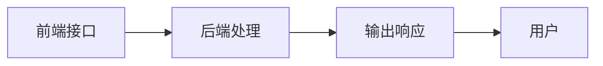

                 

## 1. 背景介绍

在数字化转型的浪潮中，电子商务平台成为推动消费者和商家交流、互动、交易的重要平台。AI技术的应用为电子商务带来了显著的效率提升和用户体验的改善。其中，AI代理（AI Agent）是实现这一目标的关键技术。AI代理工作流（AI Agent Workflow）是指在电子商务中，利用AI代理处理和自动化各种任务，从而提升运营效率和客户满意度。本文将详细探讨AI代理工作流在电子商务中的具体应用，包括其核心概念、算法原理、具体操作步骤和未来发展趋势。

## 2. 核心概念与联系

### 2.1 核心概念概述

AI代理（AI Agent）是一种能够理解和执行人类指令的智能软件系统。AI代理可以模拟人类的决策过程，处理复杂的任务，从而提高工作效率和减少人为错误。在电子商务中，AI代理可以用于客户服务、订单管理、库存优化、推荐系统、个性化营销等多个方面。

AI代理工作流是指利用AI代理进行任务自动化的一系列步骤和流程。它通常包括以下几个关键组件：
- **前端接口**：用于接收用户的指令和数据。
- **后端处理**：包括数据处理、逻辑推理、决策制定等。
- **输出响应**：根据处理结果向用户提供相应的反馈。

这些组件通过API接口和消息传递机制进行数据交换，形成一个完整的AI代理工作流系统。

### 2.2 核心概念原理和架构的 Mermaid 流程图



### 2.3 核心概念联系

AI代理工作流在电子商务中的应用，可以大大提升运营效率和客户满意度。具体体现在以下几个方面：

- **客户服务**：通过AI代理自动回复常见问题，快速处理客户投诉和反馈，提供24/7全天候服务。
- **订单管理**：利用AI代理自动处理订单生成、物流跟踪、库存管理等，减少人工操作错误，提高订单处理效率。
- **推荐系统**：根据用户行为和偏好，利用AI代理自动推荐商品，提升用户体验和销售额。
- **个性化营销**：通过AI代理进行数据分析，针对不同用户提供个性化推荐，增加用户粘性和复购率。

## 3. 核心算法原理 & 具体操作步骤

### 3.1 算法原理概述

AI代理工作流的核心算法包括自然语言处理（NLP）、机器学习（ML）、深度学习（DL）等。

- **自然语言处理（NLP）**：用于理解和处理自然语言，使AI代理能够理解和执行人类指令。
- **机器学习（ML）**：通过训练数据集，使AI代理能够学习和预测用户行为，提供个性化的服务和推荐。
- **深度学习（DL）**：利用神经网络等技术，使AI代理能够处理复杂任务，如图像识别、语音识别等。

### 3.2 算法步骤详解

AI代理工作流的算法步骤主要包括以下几个环节：

1. **数据收集与预处理**：
   - 收集用户行为数据、商品信息、订单数据等，并进行数据清洗、特征提取等预处理。
   - 数据收集的方式包括在线爬虫、API接口、传感器等。

2. **模型训练与优化**：
   - 使用机器学习或深度学习算法，训练AI代理模型。
   - 通过交叉验证等方法，优化模型参数，提升模型性能。

3. **AI代理部署与调用**：
   - 将训练好的AI代理模型部署到服务器或云平台。
   - 通过API接口或消息队列等方式，调用AI代理处理具体任务。

4. **监控与维护**：
   - 实时监控AI代理的运行状态，及时发现和解决异常情况。
   - 定期更新和维护AI代理模型，确保其持续高效运行。

### 3.3 算法优缺点

**优点**：
- 自动化处理各种任务，提高工作效率。
- 减少人为错误，提升数据准确性。
- 能够处理大量并发请求，提高系统负载能力。

**缺点**：
- 需要大量的数据和计算资源进行训练和优化。
- 模型的复杂度和准确度需要不断调整和优化。
- 可能存在一定的隐私和数据安全问题。

### 3.4 算法应用领域

AI代理工作流在电子商务中的应用非常广泛，包括但不限于以下几个领域：

- **客户服务**：自动回复、情感分析、语音识别等。
- **订单管理**：自动处理订单、库存优化、物流跟踪等。
- **推荐系统**：个性化推荐、用户行为分析、商品推荐等。
- **个性化营销**：用户画像构建、个性化广告、邮件营销等。
- **风控管理**：欺诈检测、风险评估、信用评分等。

## 4. 数学模型和公式 & 详细讲解

### 4.1 数学模型构建

AI代理工作流的数学模型包括多个组成部分，如用户行为模型、商品推荐模型、库存优化模型等。以推荐系统为例，其数学模型可以表示为：

$$
P(u_i,r_j|u,v) = \frac{\exp(f(u_i,r_j; \theta))}{\sum_k \exp(f(u_i,r_k; \theta))}
$$

其中，$P(u_i,r_j|u,v)$ 表示用户$u_i$对商品$r_j$的兴趣概率，$f(u_i,r_j; \theta)$ 是用户行为特征与商品特征的相似度函数，$\theta$ 是模型参数。

### 4.2 公式推导过程

以推荐系统为例，推荐模型可以通过最大似然估计进行训练，优化目标函数为：

$$
\min_{\theta} \sum_{i=1}^N \sum_{j=1}^M -y_{ij}\log P(u_i,r_j|u,v)
$$

其中，$y_{ij}$ 表示用户$u_i$是否对商品$r_j$感兴趣。

### 4.3 案例分析与讲解

假设有一家在线零售商，利用AI代理进行个性化推荐。具体步骤如下：
1. 收集用户浏览、购买、评价等行为数据，提取特征。
2. 利用协同过滤算法训练用户行为模型，预测用户对商品的兴趣。
3. 将预测结果与商品库中的商品特征进行相似度计算，生成推荐列表。
4. 利用前端界面向用户展示推荐商品，并统计反馈效果。

## 5. 项目实践：代码实例和详细解释说明

### 5.1 开发环境搭建

以下是使用Python进行AI代理工作流开发的开发环境配置流程：

1. 安装Anaconda：从官网下载并安装Anaconda，用于创建独立的Python环境。
2. 创建并激活虚拟环境：
```bash
conda create -n ai_agent-env python=3.8 
conda activate ai_agent-env
```
3. 安装Python相关库：
```bash
pip install numpy pandas scikit-learn torch transformers
```
4. 安装AI代理工作流开发所需的框架：
```bash
pip install flask fastapi gunicorn
```

### 5.2 源代码详细实现

以下是一个基于Flask框架的AI代理推荐系统的代码实现。

```python
from flask import Flask, request, jsonify
import pandas as pd
import torch
from transformers import AutoModel, AutoTokenizer

app = Flask(__name__)

# 加载推荐模型
model = AutoModel.from_pretrained('bert-base-uncased')
tokenizer = AutoTokenizer.from_pretrained('bert-base-uncased')

# 加载用户行为数据
df = pd.read_csv('user_behavior.csv')
df.head()

# 定义API接口
@app.route('/recommend', methods=['POST'])
def recommend():
    data = request.json
    user_id = data['user_id']
    item_ids = data['item_ids']
    
    # 将用户ID和商品ID转换为模型可接受的格式
    user_input = tokenizer.encode_plus(str(user_id), return_tensors='pt')
    item_inputs = [tokenizer.encode_plus(str(item_id), return_tensors='pt') for item_id in item_ids]
    
    # 前向传播
    with torch.no_grad():
        user_output = model(user_input['input_ids'])
        item_outputs = [model(item_input['input_ids']) for item_input in item_inputs]
    
    # 计算相似度
    similarity = torch.matmul(user_output, torch.stack([item_output[0] for item_output in item_outputs])).numpy().flatten()
    
    # 排序并返回推荐商品ID
    recommended_items = item_ids[torch.argsort(similarity)[-10:]]
    return jsonify({'items': recommended_items})

if __name__ == '__main__':
    app.run(host='0.0.0.0', port=5000)
```

### 5.3 代码解读与分析

上述代码实现了基于BERT模型的推荐系统API接口。其核心步骤如下：
1. 加载推荐模型和分词器。
2. 加载用户行为数据，包括用户ID和商品ID。
3. 定义API接口，接收用户ID和商品ID列表。
4. 将用户ID和商品ID转换为模型可接受的格式，进行前向传播计算相似度。
5. 根据相似度排序，返回推荐商品ID。

### 5.4 运行结果展示

在运行上述代码后，可以在浏览器中访问`http://localhost:5000/recommend`，输入JSON格式的数据，获取推荐商品列表。

## 6. 实际应用场景

### 6.1 智能客服系统

在智能客服系统中，AI代理可以用于自动回复客户问题、处理订单、提供个性化服务等。例如，一家在线零售商可以利用AI代理构建智能客服系统，自动处理用户咨询、订单跟踪、投诉处理等任务，提高客户满意度。

### 6.2 订单管理系统

订单管理是电子商务中最重要的环节之一。利用AI代理工作流，可以自动处理订单生成、物流跟踪、库存管理等任务。例如，一家电子商务公司可以利用AI代理构建自动化订单管理系统，自动处理订单生成、库存更新、物流跟踪等任务，提高订单处理效率。

### 6.3 推荐系统

推荐系统是提升用户体验和销售额的关键工具。利用AI代理工作流，可以自动分析用户行为数据，生成个性化推荐。例如，一家在线零售商可以利用AI代理构建推荐系统，根据用户行为数据生成个性化商品推荐，提升用户体验和销售额。

### 6.4 个性化营销

个性化营销是提高用户粘性和复购率的重要手段。利用AI代理工作流，可以自动分析用户数据，生成个性化广告、邮件营销等。例如，一家在线零售商可以利用AI代理构建个性化营销系统，根据用户行为数据生成个性化广告和邮件营销内容，提高用户粘性和复购率。

## 7. 工具和资源推荐

### 7.1 学习资源推荐

为了帮助开发者系统掌握AI代理工作流，这里推荐一些优质的学习资源：

1. 《Deep Learning with PyTorch》：由李沐等人编写的深度学习入门书籍，详细介绍了PyTorch的使用方法和深度学习模型。
2. 《TensorFlow》官方文档：Google提供的TensorFlow官方文档，包含丰富的API接口和示例代码。
3. Kaggle平台：数据科学竞赛平台，提供丰富的数据集和比赛，帮助开发者提高数据处理和模型训练能力。
4. Coursera平台：在线学习平台，提供多个深度学习相关课程，涵盖从基础到高级的内容。

### 7.2 开发工具推荐

以下是几款用于AI代理工作流开发的常用工具：

1. Flask：轻量级的Web框架，适合构建API接口。
2. FastAPI：基于Starlette的Web框架，提供更丰富的功能，适合构建复杂的API接口。
3. Gunicorn：轻量级的Web服务器，支持多种Web框架。
4. TensorFlow和PyTorch：主流的深度学习框架，提供丰富的模型和算法库。
5. Scikit-learn：Python的机器学习库，提供多种经典的机器学习算法。

### 7.3 相关论文推荐

AI代理工作流的研究源于学界的持续探索。以下是几篇奠基性的相关论文，推荐阅读：

1. 《Crowdsourcing AI Agents for Smart Retail Services》：提出基于众包技术构建智能零售服务的AI代理工作流。
2. 《AI Agents in E-Commerce: A Survey》：综述了AI代理在电子商务中的应用现状和未来发展趋势。
3. 《Personalized Recommendation Systems: A Survey and Comparative Study》：详细介绍了个性化推荐系统的研究现状和未来方向。
4. 《Machine Learning in Recommendation Systems: An Overview》：综述了机器学习在推荐系统中的应用。

## 8. 总结：未来发展趋势与挑战

### 8.1 总结

本文对AI代理工作流在电子商务中的应用进行了全面系统的介绍。首先阐述了AI代理工作流的核心概念和算法原理，详细讲解了具体的实施步骤，并给出了完整的代码实例。同时，本文还广泛探讨了AI代理工作流在智能客服、订单管理、推荐系统、个性化营销等多个行业领域的应用前景，展示了AI代理工作流的巨大潜力。

通过本文的系统梳理，可以看到，AI代理工作流在电子商务中的应用，能够显著提升运营效率和客户满意度。未来，伴随AI技术的发展，AI代理工作流将不断拓展应用场景，为电子商务带来更大的变革。

### 8.2 未来发展趋势

展望未来，AI代理工作流将呈现以下几个发展趋势：

1. 更高效的推荐算法：随着算法和模型的不断进步，推荐系统将能够更准确地预测用户行为，生成更个性化的推荐。
2. 更智能的客户服务：利用自然语言处理和情感分析等技术，AI代理能够更智能地理解和处理用户需求，提升客户服务体验。
3. 更灵活的订单管理：AI代理能够根据订单状态和物流信息，自动调整订单处理流程，提高订单处理效率。
4. 更个性化的营销策略：利用用户数据和行为分析，AI代理能够更精准地制定个性化营销策略，提高营销效果。
5. 更安全的系统架构：采用数据加密、访问控制等技术，确保系统的安全性和可靠性。

以上趋势凸显了AI代理工作流的广阔前景。这些方向的探索发展，必将进一步提升AI代理工作流的性能和应用范围，为电子商务带来更大的变革。

### 8.3 面临的挑战

尽管AI代理工作流在电子商务中的应用取得了显著成果，但在迈向更加智能化、普适化应用的过程中，它仍面临诸多挑战：

1. 数据隐私和安全问题：在处理用户数据时，需要确保数据的安全和隐私保护。
2. 模型的可解释性问题：AI代理的决策过程需要具备较高的可解释性，以便用户理解和接受。
3. 算法的复杂性和资源消耗问题：AI代理工作流的实现需要大量的计算资源，如何在保证性能的同时，优化资源消耗，是未来需要解决的问题。
4. 跨领域应用的适应性问题：AI代理工作流需要适应不同领域的特定需求，需要更多跨领域的应用研究。
5. 用户教育和接受度问题：需要向用户普及AI代理的工作原理和应用场景，增强用户对其信任和接受度。

### 8.4 研究展望

未来，研究者需要在以下几个方面进一步推进AI代理工作流的发展：

1. 跨领域应用研究：在电子商务之外，AI代理工作流可以应用于医疗、金融、教育等多个领域，探索更多的应用场景。
2. 模型可解释性研究：开发可解释性更高的AI代理模型，使决策过程更加透明，提升用户信任度。
3. 数据隐私和安全研究：探索更好的数据隐私保护技术，确保用户数据的安全。
4. 资源优化研究：优化AI代理工作流的算法和架构，减少资源消耗，提升系统性能。
5. 用户教育和接受度研究：向用户普及AI代理的知识，提升其对AI代理的接受度。

这些研究方向将引领AI代理工作流迈向更高的台阶，为电子商务带来更多的变革和创新。总之，AI代理工作流技术需要不断创新和优化，方能实现其广阔的应用前景。

## 9. 附录：常见问题与解答

**Q1：AI代理工作流在电子商务中主要应用场景有哪些？**

A: AI代理工作流在电子商务中的应用场景包括但不限于以下几个方面：
1. 智能客服：自动回复客户问题、处理订单、提供个性化服务等。
2. 订单管理：自动处理订单生成、物流跟踪、库存管理等。
3. 推荐系统：根据用户行为数据生成个性化推荐。
4. 个性化营销：根据用户数据生成个性化广告和邮件营销内容。
5. 风控管理：欺诈检测、风险评估、信用评分等。

**Q2：AI代理工作流在电子商务中需要注意哪些问题？**

A: 在电子商务中，AI代理工作流需要注意以下几个问题：
1. 数据隐私和安全问题：确保用户数据的安全和隐私保护。
2. 模型的可解释性问题：使AI代理的决策过程更加透明，增强用户信任度。
3. 算法的复杂性和资源消耗问题：优化AI代理工作流的算法和架构，减少资源消耗，提升系统性能。
4. 跨领域应用的适应性问题：需要更多跨领域的应用研究。
5. 用户教育和接受度问题：向用户普及AI代理的知识，提升其对AI代理的接受度。

**Q3：AI代理工作流的核心算法有哪些？**

A: AI代理工作流的核心算法包括自然语言处理（NLP）、机器学习（ML）、深度学习（DL）等。其中，NLP用于理解和处理自然语言，ML用于学习和预测用户行为，DL用于处理复杂任务。

**Q4：如何构建AI代理工作流系统？**

A: 构建AI代理工作流系统需要以下几个步骤：
1. 数据收集与预处理：收集用户行为数据、商品信息、订单数据等，并进行数据清洗、特征提取等预处理。
2. 模型训练与优化：使用机器学习或深度学习算法，训练AI代理模型。
3. AI代理部署与调用：将训练好的AI代理模型部署到服务器或云平台，通过API接口或消息队列等方式，调用AI代理处理具体任务。
4. 监控与维护：实时监控AI代理的运行状态，及时发现和解决异常情况。

**Q5：AI代理工作流在电子商务中未来发展趋势是什么？**

A: AI代理工作流在电子商务中的未来发展趋势包括但不限于以下几个方面：
1. 更高效的推荐算法。
2. 更智能的客户服务。
3. 更灵活的订单管理。
4. 更个性化的营销策略。
5. 更安全的系统架构。

---

作者：禅与计算机程序设计艺术 / Zen and the Art of Computer Programming

