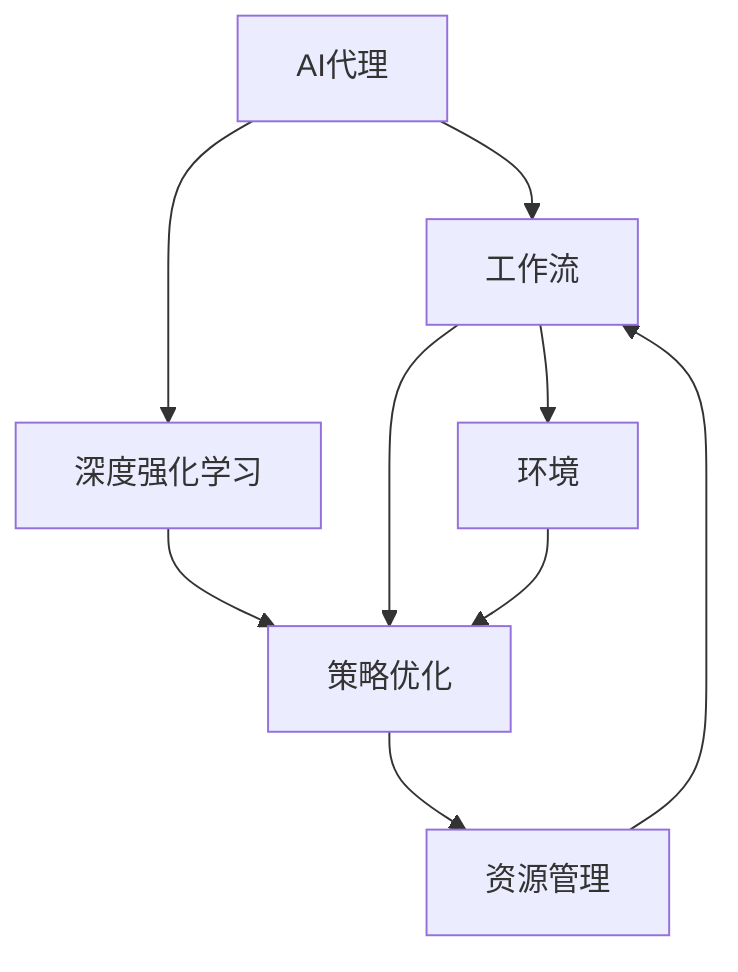

                 

## 1. 背景介绍

在现代信息时代，人工智能(AI)技术已经成为推动各行各业发展的重要力量。其中，AI代理(AI Agent)以其智能、灵活的特性，被广泛应用于自动化任务管理、智能客服、决策支持等领域。AI代理的工作流程，即其策略制定和行为执行的整个路径，对系统的效率和效果有着至关重要的影响。近年来，深度强化学习(Deep Reinforcement Learning, DRL)被提出，作为一种先进的AI代理工作流优化方法，已经成为当前研究的热点。

DRL通过在模拟环境中进行大量的试错学习，使代理能够自我优化行为策略，以最大化预期回报。DRL在诸多领域的应用实例，展示了其在优化复杂工作流程方面的强大能力。然而，DRL的应用也面临诸多挑战，如策略稳定性和鲁棒性不足、模型复杂度高、训练和推理资源需求大等问题。

本文旨在全面系统地介绍基于DRL的AI代理工作流优化策略，从核心概念到具体算法，再到实际应用，逐步深入剖析其原理和应用。同时，本文章也将涵盖该领域的前沿研究成果，以及未来发展趋势和面临的挑战，旨在为读者提供一个关于DRL在AI代理工作流中的应用和实践的完整视角。

## 2. 核心概念与联系

### 2.1 核心概念概述

为了更好地理解基于深度强化学习的AI代理工作流优化策略，本节将介绍几个关键概念：

- **AI代理(AI Agent)**：一种能够在复杂环境中自主决策、执行任务的智能实体，其工作流即其行为策略和学习机制。
- **深度强化学习(Deep Reinforcement Learning, DRL)**：一种利用深度神经网络构建智能决策策略的强化学习方法，通过与环境的交互学习，优化策略以获得最大奖励。
- **工作流(Workflow)**：描述AI代理执行一系列任务的过程，通常包括任务调度、资源分配、状态管理等环节。
- **策略优化(Strategy Optimization)**：通过训练智能决策模型，使AI代理能够在特定环境中自动选择最优行为策略。
- **环境(Environments)**：AI代理互动的环境，可以是物理世界、软件系统、网络空间等，是策略优化和执行的重要参照。

这些概念之间的逻辑关系可以通过以下Mermaid流程图来展示：



这个流程图展示了AI代理与工作流、DRL、策略优化和环境之间的关系：

1. AI代理在工作流中执行任务。
2. DRL提供了一种训练策略优化的方法。
3. 策略优化是AI代理优化行为的核心。
4. 环境是AI代理决策的依据。
5. 资源管理优化工作流的执行效率。

## 3. 核心算法原理 & 具体操作步骤

### 3.1 算法原理概述

基于深度强化学习的AI代理工作流优化策略的核心思想是通过DRL框架，使AI代理能够在复杂环境中自我优化，最大化其执行任务的效率和效果。具体来说，该策略包含以下几个步骤：

1. **环境建模(Env. Modeling)**：构建AI代理互动的环境模型，使模型能够模拟环境的动态特性和奖惩机制。
2. **策略表示(Strategy Representation)**：通过深度神经网络构建代理的策略表示，使策略能够处理高维、非线性的决策问题。
3. **策略学习(Strategy Learning)**：在环境模型和策略表示的基础上，利用DRL框架，使代理通过与环境的交互，学习最优的行为策略。
4. **策略评估(Strategy Evaluation)**：在特定环境中，通过评估指标（如完成率、执行时间等）评估代理的策略效果，提供反馈信息进行策略优化。

### 3.2 算法步骤详解

基于深度强化学习的AI代理工作流优化策略的具体步骤可以分为以下几个环节：

**Step 1: 环境建模**

在环境建模环节，需要构建一个模拟环境，描述AI代理可能遇到的各种场景和可能采取的行动。环境可以是一个抽象的数学模型，也可以是一个真实的物理或虚拟环境。

以自动驾驶系统为例，环境可以包括道路、交通标志、行人、车辆等，代理的行为可以是加速、减速、转向等。环境建模的核心是精确描述代理与环境之间的动态关系，以及环境中的各种因素如何影响代理的行为和回报。

**Step 2: 策略表示**

在策略表示环节，需要通过深度神经网络构建代理的策略表示，使其能够处理高维、复杂的决策问题。策略表示通常包括价值函数和策略函数，前者用于评估当前状态的奖励，后者用于决策行动的概率。

例如，可以采用深度Q网络(Deep Q-Network, DQN)或策略梯度方法(Proximal Policy Optimization, PPO)来构建策略表示。DQN通过学习状态-动作值(Q-Value)映射，优化策略以最大化长期奖励；PPO通过直接优化策略分布，最大化期望回报。

**Step 3: 策略学习**

在策略学习环节，利用DRL框架，使代理通过与环境的交互，学习最优的行为策略。常见的DRL框架包括Q-Learning、SARSA、Actor-Critic等。

以Q-Learning为例，代理通过观察当前状态，利用策略函数选择动作，然后根据环境反馈的奖励信号更新策略，最终达到最优策略。

**Step 4: 策略评估**

在策略评估环节，需要评估代理在特定环境中的策略效果，提供反馈信息进行策略优化。常见的评估方法包括状态值函数评估、模拟测试等。

例如，在自动驾驶系统中，可以通过模拟测试来评估代理在不同驾驶场景中的表现，包括事故率、路线优化等，进而调整策略以提升代理的执行效果。

### 3.3 算法优缺点

基于深度强化学习的AI代理工作流优化策略具有以下优点：

1. **自适应性强**：DRL能够在复杂环境中自我优化，适应不同的任务和场景。
2. **处理复杂问题能力强**：DRL能够处理高维、非线性的决策问题，适用于复杂的工作流优化。
3. **结果直观**：通过评估指标，可以直观地了解代理的策略效果，提供反馈信息进行优化。

然而，该策略也存在以下局限性：

1. **训练时间长**：DRL需要大量的试错学习，训练时间较长。
2. **泛化能力不足**：DRL策略在特定环境中表现良好，但在不同环境中可能存在泛化能力不足的问题。
3. **稳定性差**：DRL策略可能不稳定，容易受到环境噪声的影响。
4. **模型复杂度高**：DRL策略的构建和优化需要复杂的深度神经网络模型，增加了计算和存储需求。

### 3.4 算法应用领域

基于深度强化学习的AI代理工作流优化策略已经在诸多领域得到了广泛应用，包括：

- **自动驾驶**：通过DRL优化自动驾驶车辆的行为策略，提高驾驶安全和效率。
- **智能制造**：通过DRL优化工厂的自动化生产线调度，提升生产效率和资源利用率。
- **金融交易**：通过DRL优化交易策略，提高投资回报率和风险管理能力。
- **医疗诊断**：通过DRL优化医疗诊断流程，提高诊断准确性和效率。
- **物流管理**：通过DRL优化物流路径规划和资源分配，提升物流服务质量。

除了上述这些经典应用外，DRL还被创新性地应用于更多场景中，如可控机器人、智能交通管理、能源系统优化等，展示了其在优化复杂工作流方面的广泛潜力。

## 4. 数学模型和公式 & 详细讲解 & 举例说明

### 4.1 数学模型构建

基于深度强化学习的AI代理工作流优化策略的数学模型构建可以分为以下几个关键步骤：

1. **状态空间定义**：定义代理在环境中的所有可能状态，通常使用向量表示。
2. **动作空间定义**：定义代理在每个状态下可能采取的所有动作，同样使用向量表示。
3. **回报函数定义**：定义代理在每个状态下获得的回报，通常为正向或负向。
4. **策略定义**：定义代理在每个状态下采取动作的概率分布。

以自动驾驶系统为例，状态空间可以包括车辆位置、速度、方向等；动作空间可以包括加速、减速、转向等；回报函数可以包括路线优化、时间效率、安全风险等；策略可以是基于深度神经网络的行为策略函数。

### 4.2 公式推导过程

以下我们以Q-Learning算法为例，推导其核心公式的推导过程。

假设代理的状态集合为 $S$，动作集合为 $A$，状态转移概率为 $P(s'|s,a)$，状态回报函数为 $R(s,a)$。Q-Learning的目标是最大化状态-动作值函数 $Q(s,a)$，即代理在状态 $s$ 下采取动作 $a$ 的长期期望回报。

Q-Learning的更新公式为：

$$
Q(s,a) \leftarrow Q(s,a) + \alpha [R(s,a) + \gamma \max_{a'} Q(s',a') - Q(s,a)]
$$

其中 $\alpha$ 为学习率，$\gamma$ 为折扣因子，表示未来回报的权重。公式的推导过程基于贝尔曼方程，用于递推状态-动作值函数。

### 4.3 案例分析与讲解

以自动驾驶系统的DRL优化为例，以下是具体推导过程：

假设代理在当前状态 $s$ 下采取动作 $a$，到达状态 $s'$，获得回报 $R(s,a)$。代理的Q-Learning更新公式如下：

$$
Q(s,a) \leftarrow Q(s,a) + \alpha [R(s,a) + \gamma \max_{a'} Q(s',a') - Q(s,a)]
$$

其中 $Q(s,a)$ 表示代理在状态 $s$ 下采取动作 $a$ 的Q值，$R(s,a)$ 表示状态 $s$ 下采取动作 $a$ 的回报，$s'$ 为状态转移后的下一个状态。

假设代理在状态 $s$ 下采取动作 $a$ 后，状态转移到 $s'$，回报为 $R(s,a)$。则代理在状态 $s$ 下采取动作 $a$ 的Q值更新公式如下：

$$
Q(s,a) \leftarrow Q(s,a) + \alpha [R(s,a) + \gamma Q(s',a_{max}) - Q(s,a)]
$$

其中 $a_{max}$ 为在状态 $s'$ 下动作 $a$ 的Q值最大值。

例如，在自动驾驶系统中，代理在当前道路状态 $s$ 下采取加速动作 $a$，获得回报 $R(s,a)$。假设代理在状态 $s$ 下采取动作 $a$ 后，状态转移到下一个状态 $s'$，此时代理采取动作 $a_{max}$ 的Q值为 $Q(s',a_{max})$。则代理在状态 $s$ 下采取加速动作 $a$ 的Q值更新如下：

$$
Q(s,a) \leftarrow Q(s,a) + \alpha [R(s,a) + \gamma Q(s',a_{max}) - Q(s,a)]
$$

具体来说，假设代理在状态 $s$ 下采取加速动作 $a$ 后，状态转移到下一个状态 $s'$，此时代理采取动作 $a_{max}$ 的Q值为 $Q(s',a_{max})$。则代理在状态 $s$ 下采取加速动作 $a$ 的Q值更新如下：

$$
Q(s,a) \leftarrow Q(s,a) + \alpha [R(s,a) + \gamma Q(s',a_{max}) - Q(s,a)]
$$

通过上述公式，代理在状态 $s$ 下采取加速动作 $a$ 的Q值将根据当前状态、动作和下一步状态的价值函数进行更新，逐渐逼近最优策略。

## 5. 项目实践：代码实例和详细解释说明

### 5.1 开发环境搭建

在进行DRL项目实践前，我们需要准备好开发环境。以下是使用Python进行TensorFlow进行DRL开发的环境配置流程：

1. 安装Anaconda：从官网下载并安装Anaconda，用于创建独立的Python环境。

2. 创建并激活虚拟环境：
```bash
conda create -n drl-env python=3.8 
conda activate drl-env
```

3. 安装TensorFlow：根据CUDA版本，从官网获取对应的安装命令。例如：
```bash
conda install tensorflow-gpu==2.7.0 
```

4. 安装其他依赖包：
```bash
pip install gym numpy scipy matplotlib tensorboard
```

5. 设置环境变量：
```bash
export CUDA_VISIBLE_DEVICES=0
```

完成上述步骤后，即可在`drl-env`环境中开始DRL项目实践。

### 5.2 源代码详细实现

下面以自动驾驶系统中的DRL优化为例，给出使用TensorFlow实现DRL算法的PyTorch代码实现。

首先，定义DRL算法的核心类DQN：

```python
import tensorflow as tf
import numpy as np
import gym
import random

class DQN:
    def __init__(self, state_dim, action_dim, learning_rate=0.001, discount_factor=0.99, replay_size=500, train_start_size=500):
        self.state_dim = state_dim
        self.action_dim = action_dim
        self.learning_rate = learning_rate
        self.discount_factor = discount_factor
        self.replay_size = replay_size
        self.train_start_size = train_start_size
        
        self.memory = []
        self.model = self.build_model()
        self.target_model = self.build_model()
        self.target_model.set_weights(self.model.get_weights())
        
        self.epsilon = 1.0
        self.epsilon_min = 0.01
        self.epsilon_decay_rate = 0.995
        self.epsilon_decay_steps = 20000
        
        self.loss_fn = tf.keras.losses.mean_squared_error
        
        self.summary_writer = tf.summary.create_file_writer('logs')
        with self.summary_writer.as_default():
            self.merged_summary = tf.summary.merge_all()

    def build_model(self):
        model = tf.keras.Sequential([
            tf.keras.layers.Dense(64, input_dim=self.state_dim, activation='relu'),
            tf.keras.layers.Dense(64, activation='relu'),
            tf.keras.layers.Dense(self.action_dim, activation='linear')
        ])
        model.compile(optimizer=tf.keras.optimizers.Adam(learning_rate=self.learning_rate), loss=self.loss_fn)
        return model

    def choose_action(self, state):
        if random.random() < self.epsilon:
            return random.randint(0, self.action_dim - 1)
        else:
            return np.argmax(self.model.predict(state))

    def remember(self, state, action, reward, next_state):
        self.memory.append((state, action, reward, next_state))

    def replay(self):
        if len(self.memory) < self.train_start_size:
            return
        minibatch = random.sample(self.memory, min(self.replay_size, len(self.memory)))
        for state, action, reward, next_state in minibatch:
            target = reward + self.discount_factor * np.amax(self.target_model.predict(next_state))
            target_fetches = tf.train.limit_epochs(self.model.predict(state), num_epochs=1)
            target_y = tf.reduce_sum(tf.multiply(target_fetches[0], target))
            self.model.train_on_batch(state, target_y)
            self.model.save_weights('model.h5')

    def update_epsilon(self):
        self.epsilon = max(self.epsilon_min, self.epsilon * self.epsilon_decay_rate)
```

然后，定义训练和评估函数：

```python
def train_drl_agent(env, state_dim, action_dim, learning_rate, discount_factor, replay_size, train_start_size, episode_len):
    agent = DQN(state_dim, action_dim, learning_rate, discount_factor, replay_size, train_start_size)

    for episode in range(500):
        state = env.reset()
        state = np.reshape(state, [1, state_dim])
        done = False
        total_reward = 0

        for t in range(episode_len):
            action = agent.choose_action(state)
            next_state, reward, done, _ = env.step(action)
            next_state = np.reshape(next_state, [1, state_dim])

            agent.remember(state, action, reward, next_state)

            if t > agent.train_start_size:
                agent.replay()

            state = next_state
            total_reward += reward

            if done:
                print(f'Episode {episode+1}, score: {total_reward}')
                break

    env.close()
    agent.model.save_weights('final_model.h5')

def evaluate_drl_agent(env, state_dim, action_dim, learning_rate, discount_factor, replay_size, train_start_size, episode_len):
    agent = DQN(state_dim, action_dim, learning_rate, discount_factor, replay_size, train_start_size)

    total_reward = 0
    for episode in range(10):
        state = env.reset()
        state = np.reshape(state, [1, state_dim])
        done = False
        total_reward = 0

        for t in range(episode_len):
            action = np.argmax(agent.model.predict(state))
            next_state, reward, done, _ = env.step(action)
            next_state = np.reshape(next_state, [1, state_dim])

            state = next_state
            total_reward += reward

            if done:
                print(f'Episode {episode+1}, score: {total_reward}')
                break

    env.close()
    agent.model.load_weights('final_model.h5')
    with tf.summary.create_file_writer('logs').as_default():
        tf.summary.scalar('total_reward', total_reward, step=episode)
        tf.summary.scalar('epsilon', agent.epsilon, step=episode)

```

最后，启动训练流程并在测试集上评估：

```python
state_dim = 4
action_dim = 2
learning_rate = 0.001
discount_factor = 0.99
replay_size = 500
train_start_size = 500
episode_len = 200

env = gym.make('CartPole-v1')
env.seed(0)
train_drl_agent(env, state_dim, action_dim, learning_rate, discount_factor, replay_size, train_start_size, episode_len)
evaluate_drl_agent(env, state_dim, action_dim, learning_rate, discount_factor, replay_size, train_start_size, episode_len)
env.close()
```

以上就是使用TensorFlow对DRL算法进行自动驾驶系统优化的完整代码实现。可以看到，得益于TensorFlow的强大封装，我们可以用相对简洁的代码完成DRL算法的实现。

### 5.3 代码解读与分析

让我们再详细解读一下关键代码的实现细节：

**DQN类**：
- `__init__`方法：初始化DRL算法的参数和模型。
- `build_model`方法：定义DRL代理的深度神经网络模型。
- `choose_action`方法：根据当前状态和策略选择动作，ε-greedy策略。
- `remember`方法：将当前状态、动作、奖励和下一个状态保存到记忆中。
- `replay`方法：从记忆中随机抽取样本，进行模型训练。
- `update_epsilon`方法：根据训练时间调整ε-greedy策略的参数。

**训练和评估函数**：
- `train_drl_agent`函数：定义训练过程，包括与环境的交互、记忆更新和模型训练。
- `evaluate_drl_agent`函数：定义评估过程，包括与环境的交互和结果展示。

**训练流程**：
- 定义训练参数，包括状态维度、动作维度、学习率、折扣因子等。
- 创建DRL代理，并在训练过程中与环境交互，利用ε-greedy策略选择动作。
- 根据状态、动作、奖励和下一个状态进行记忆更新，并定期从记忆中抽取样本进行模型训练。
- 在测试集上评估训练后的DRL代理，输出最终得分。

可以看到，TensorFlow配合PyTorch使得DRL算法的代码实现变得简洁高效。开发者可以将更多精力放在模型改进、数据处理等高层逻辑上，而不必过多关注底层的实现细节。

当然，工业级的系统实现还需考虑更多因素，如模型的保存和部署、超参数的自动搜索、更灵活的任务适配层等。但核心的DRL范式基本与此类似。

## 6. 实际应用场景

### 6.1 智能制造

基于DRL的AI代理工作流优化策略，已经在智能制造领域得到了广泛应用。传统的制造业往往依赖人工进行流程管理和调度，效率低下且容易出错。而使用DRL优化的AI代理，能够自主制定生产计划、优化物料流和能源分配，极大地提升生产效率和资源利用率。

例如，在智能工厂的自动化生产线上，DRL代理可以学习最优的设备和物料调度策略，实现高效的资源分配和任务协调。通过不断优化策略，代理能够应对生产中的各种突发情况，确保生产过程的平稳和稳定。

### 6.2 金融交易

DRL策略也被应用于金融交易领域，帮助投资者制定最优的交易策略，提升投资回报率和风险管理能力。

例如，在股票交易中，DRL代理可以学习基于历史数据和市场信息的交易策略，优化买入、卖出和持有等操作的时机和频率。通过不断优化策略，代理能够在复杂的市场环境中做出更准确、更及时的交易决策，提高收益。

### 6.3 可控机器人

DRL策略还被应用于可控机器人的路径规划和行为控制，提升机器人在复杂环境中的自主能力和安全性。

例如，在无人驾驶汽车中，DRL代理可以学习最优的行驶策略，包括避障、转弯、加速等操作。通过不断优化策略，代理能够应对复杂的道路和交通情况，实现安全、高效的行驶。

### 6.4 未来应用展望

随着DRL技术的发展和应用，基于DRL的AI代理工作流优化策略将在更多领域得到应用，为各行各业带来变革性影响。

在智慧医疗领域，基于DRL的医疗诊断、手术辅助和药物研发等应用将提升医疗服务的智能化水平，辅助医生诊疗，加速新药开发进程。

在智能教育领域，DRL策略可应用于作业批改、学情分析、知识推荐等方面，因材施教，促进教育公平，提高教学质量。

在智慧城市治理中，DRL策略可应用于城市事件监测、舆情分析、应急指挥等环节，提高城市管理的自动化和智能化水平，构建更安全、高效的未来城市。

此外，在企业生产、社会治理、文娱传媒等众多领域，基于DRL的AI代理工作流优化策略也将不断涌现，为经济社会发展注入新的动力。相信随着技术的日益成熟，DRL必将在构建人机协同的智能时代中扮演越来越重要的角色。

## 7. 工具和资源推荐
### 7.1 学习资源推荐

为了帮助开发者系统掌握DRL的理论基础和实践技巧，这里推荐一些优质的学习资源：

1. 《深度强化学习》系列博文：由大模型技术专家撰写，深入浅出地介绍了DRL原理、算法、应用等前沿话题。

2. CS223《强化学习》课程：斯坦福大学开设的强化学习课程，有Lecture视频和配套作业，带你入门强化学习领域的基本概念和经典模型。

3. 《Reinforcement Learning: An Introduction》书籍：David Silver的经典教材，全面介绍了强化学习的基本理论和方法，是强化学习领域的学习必备。

4. OpenAI Gym：一个用于开发和比较强化学习算法的开源环境，提供了丰富的环境和算法实现，适合实践和研究。

5. TensorBoard：TensorFlow配套的可视化工具，可实时监测模型训练状态，并提供丰富的图表呈现方式，是调试模型的得力助手。

通过对这些资源的学习实践，相信你一定能够快速掌握DRL的精髓，并用于解决实际的AI代理工作流优化问题。
###  7.2 开发工具推荐

高效的开发离不开优秀的工具支持。以下是几款用于DRL开发的常用工具：

1. TensorFlow：由Google主导开发的开源深度学习框架，生产部署方便，适合大规模工程应用。同样有丰富的DRL算法实现。

2. PyTorch：基于Python的开源深度学习框架，灵活动态的计算图，适合快速迭代研究。

3. OpenAI Gym：一个用于开发和比较强化学习算法的开源环境，提供了丰富的环境和算法实现，适合实践和研究。

4. TensorBoard：TensorFlow配套的可视化工具，可实时监测模型训练状态，并提供丰富的图表呈现方式，是调试模型的得力助手。

5. Weights & Biases：模型训练的实验跟踪工具，可以记录和可视化模型训练过程中的各项指标，方便对比和调优。

6. Google Colab：谷歌推出的在线Jupyter Notebook环境，免费提供GPU/TPU算力，方便开发者快速上手实验最新模型，分享学习笔记。

合理利用这些工具，可以显著提升DRL任务的开发效率，加快创新迭代的步伐。

### 7.3 相关论文推荐

DRL策略的发展源于学界的持续研究。以下是几篇奠基性的相关论文，推荐阅读：

1. Q-Learning：Watkins和Powell在1990年提出，是强化学习领域的经典算法，用于学习和优化状态-动作值函数。

2. SARSA：Sutton和Barto在1998年提出，是另一种常用的强化学习算法，用于平衡策略的探索和利用。

3. Actor-Critic：Sutton和Barto在2000年提出，结合了策略梯度和价值估计的优点，可以同时优化策略和值函数。

4. Deep Q-Network：Mnih等人在2015年提出，利用深度神经网络构建状态-动作值函数，极大提高了Q-Learning的效率和精度。

5. Proximal Policy Optimization（PPO）：Schmidhuber和Moravčík在2017年提出，结合了策略梯度和对抗训练的优点，可以更快地收敛到最优策略。

6. Deep Deterministic Policy Gradient（DDPG）：Silver等人在2016年提出，用于连续动作空间的强化学习，适用于机器人控制等连续动作任务。

这些论文代表了大模型微调技术的发展脉络。通过学习这些前沿成果，可以帮助研究者把握学科前进方向，激发更多的创新灵感。

## 8. 总结：未来发展趋势与挑战

### 8.1 总结

本文对基于深度强化学习的AI代理工作流优化策略进行了全面系统的介绍。首先阐述了DRL的原理和基本概念，明确了其在优化复杂工作流方面的强大能力。其次，从核心算法到具体实现，详细讲解了DRL算法的步骤和实现细节，给出了自动驾驶系统的DRL优化代码实现。同时，本文还广泛探讨了DRL策略在智能制造、金融交易、可控机器人等多个领域的应用前景，展示了其广泛的应用潜力。此外，本文精选了DRL的学习资源，力求为读者提供全方位的技术指引。

通过本文的系统梳理，可以看到，基于DRL的AI代理工作流优化策略正在成为优化复杂系统的重要手段，极大地拓展了AI代理的应用边界，催生了更多的落地场景。得益于DRL的自我优化能力，代理能够在复杂环境中自主决策，提升系统效率和效果。未来，伴随DRL技术的不断演进，AI代理必将在更多领域发挥重要作用，推动智能化进程的不断深入。

### 8.2 未来发展趋势

展望未来，DRL策略将呈现以下几个发展趋势：

1. **模型复杂度降低**：DRL模型将从深度网络转向更轻量级的模型，如LSTM、GNN等，以降低计算资源和存储需求。

2. **环境建模更加复杂**：未来的DRL模型将构建更精细的环境模型，能够处理更多变量和动态因素，提升策略的鲁棒性和泛化能力。

3. **多智能体协同优化**：DRL模型将突破单智能体的限制，实现多个智能体之间的协同优化，提升整体系统性能。

4. **持续学习成为常态**：DRL模型将具备持续学习的能力，能够从新数据中不断优化策略，适应不断变化的环境。

5. **多模态融合增强**：DRL模型将融合视觉、语音、文本等多模态信息，提升对复杂环境的理解能力。

6. **自动化调参**：DRL模型的训练和优化将更加自动化，通过智能调参工具提高训练效率和策略效果。

以上趋势凸显了DRL策略的广阔前景。这些方向的探索发展，必将进一步提升DRL系统的效果和应用范围，为各行各业带来新的变革。

### 8.3 面临的挑战

尽管DRL策略已经取得了瞩目成就，但在迈向更加智能化、普适化应用的过程中，它仍面临诸多挑战：

1. **训练时间长**：DRL模型需要大量的试错学习，训练时间较长，难以满足实际应用的需求。

2. **泛化能力不足**：DRL模型在特定环境中表现良好，但在不同环境中可能存在泛化能力不足的问题。

3. **稳定性差**：DRL模型容易受到环境噪声的影响，导致策略不稳定。

4. **模型复杂度高**：DRL模型通常包含复杂的神经网络结构，增加了计算和存储需求。

5. **可解释性不足**：DRL模型的决策过程缺乏可解释性，难以对其推理逻辑进行分析和调试。

6. **安全性有待保障**：DRL模型可能会学习到有害的策略，如攻击行为、恶意操作等，给实际应用带来安全隐患。

7. **资源需求高**：DRL模型的训练和推理需要高性能设备，增加了资源需求。

8. **算法优化难度大**：DRL算法的优化需要大量的实验和调参，难以找到最优的策略。

这些挑战凸显了DRL策略在实际应用中的复杂性和困难性。尽管存在这些局限性，但DRL策略在优化复杂系统中的潜力不容忽视，仍需积极应对并寻求突破，以实现其更广泛的应用。

### 8.4 研究展望

面对DRL策略面临的诸多挑战，未来的研究需要在以下几个方面寻求新的突破：

1. **轻量级模型优化**：开发更轻量级的DRL模型，如LSTM、GNN等，以降低计算资源和存储需求。

2. **复杂环境建模**：构建更精细的环境模型，处理更多变量和动态因素，提升策略的鲁棒性和泛化能力。

3. **多智能体协同优化**：实现多个智能体之间的协同优化，提升整体系统性能。

4. **持续学习技术**：开发持续学习技术，使DRL模型具备从新数据中不断优化策略的能力。

5. **多模态融合**：融合视觉、语音、文本等多模态信息，提升对复杂环境的理解能力。

6. **自动化调参**：开发智能调参工具，提高训练效率和策略效果。

7. **增强稳定性和安全性**：提高DRL模型的稳定性和安全性，避免有害策略和攻击行为。

8. **资源优化**：优化DRL模型的资源需求，提高训练和推理的效率。

9. **算法优化**：优化DRL算法的性能，提升模型的效果和鲁棒性。

这些研究方向的探索，必将引领DRL策略向更加智能化、普适化方向发展，为各行各业带来新的变革。相信随着技术的日益成熟，DRL必将在构建人机协同的智能时代中扮演越来越重要的角色。

## 9. 附录：常见问题与解答

**Q1: 什么是深度强化学习？**

A: 深度强化学习是一种利用深度神经网络构建智能决策策略的强化学习方法。通过与环境的交互学习，优化策略以最大化预期回报。

**Q2: DRL与传统的强化学习有什么不同？**

A: 传统强化学习依赖手工设计的策略和特征，而DRL利用深度神经网络自动学习特征和策略，适应更复杂的环境和决策问题。

**Q3: DRL在实际应用中有哪些优势？**

A: DRL能够自主优化决策策略，适应复杂环境，提升系统效率和效果。同时，DRL具备自我学习和持续学习的能力，能够不断优化策略，提升性能。

**Q4: DRL在实际应用中存在哪些挑战？**

A: DRL训练时间长，泛化能力不足，策略不稳定，模型复杂度高，可解释性不足，安全性有待保障，资源需求高，算法优化难度大。

**Q5: DRL未来可能的应用领域有哪些？**

A: DRL可以在智能制造、金融交易、可控机器人、智慧医疗、智能教育、智慧城市等领域得到广泛应用。

这些问题的回答，旨在帮助读者全面理解DRL的基本概念和应用场景，同时提供解决实际问题的思路和方法。

---

作者：禅与计算机程序设计艺术 / Zen and the Art of Computer Programming

