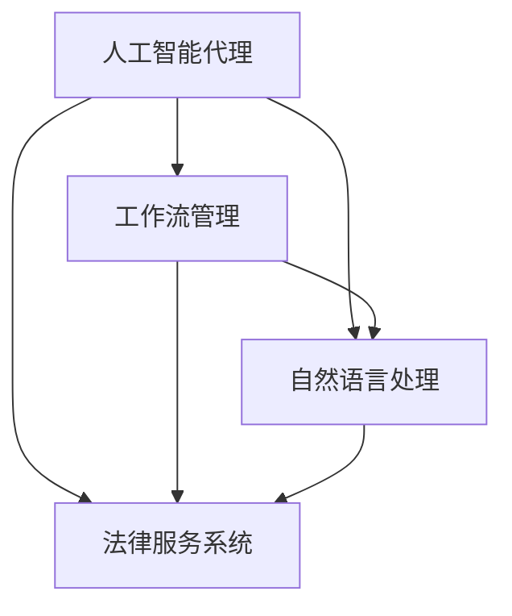

                 

# AI人工智能代理工作流AI Agent WorkFlow：智能代理在法律服务系统中的应用

> 关键词：人工智能代理,工作流管理,法律服务,智能自动化,决策支持,自然语言处理

## 1. 背景介绍

### 1.1 问题由来
随着人工智能技术的飞速发展，人工智能代理(AI Agent)在各行各业的应用已逐渐普及。特别是在法律服务领域，智能代理作为法律科技的重要组成部分，正变得越来越重要。智能代理不仅能处理大量繁琐的文书和任务，还能通过自然语言处理(NLP)技术，帮助律师提供精准的决策支持。然而，由于智能代理的设计和应用仍存在不少挑战，如何构建高效的智能代理工作流，实现智能化和自动化，成为了业界和学术界的研究热点。

### 1.2 问题核心关键点
构建智能代理工作流的核心关键点包括：

- 工作流的定义：明确智能代理需要执行的具体任务和流程，形成连贯的工作流框架。
- 智能代理的设计：选择合适的智能代理技术（如机器学习、深度学习等），并设计其结构和算法。
- 数据管理：收集、整理和清洗智能代理所需的数据，确保数据的准确性和完整性。
- 自然语言处理：应用NLP技术，使智能代理能够理解和处理法律文本，并提供精准的建议。
- 集成与部署：将智能代理集成到法律服务系统中，进行测试和部署。
- 性能优化：优化智能代理的工作流和模型，确保其高效运行。

本文聚焦于如何在法律服务系统中，通过智能代理技术，构建高效、智能化的工作流管理系统。

## 2. 核心概念与联系

### 2.1 核心概念概述

为了更好地理解智能代理工作流的构建过程，本节将介绍几个关键概念及其相互关系。

- **人工智能代理(AI Agent)**：能够自主执行特定任务或一组任务的人工智能实体，能够接收用户输入，自动执行逻辑，提供决策支持。
- **工作流管理(Workflow Management)**：定义、执行和管理一组复杂任务的过程，通过协调和控制不同的任务执行单元，确保整个工作流的有序进行。
- **自然语言处理(NLP)**：使计算机能够理解和处理人类语言的技术，使智能代理能够处理法律文本，提取关键信息。
- **法律服务系统(Legal Services System)**：提供法律咨询、文书生成、案件管理等服务的综合平台，是智能代理工作流的承载环境。

这些概念之间的逻辑关系可以通过以下Mermaid流程图来展示：



这个流程图展示了几大关键概念及其关系：

1. 智能代理通过工作流管理协调执行任务。
2. 智能代理依赖自然语言处理技术理解法律文本。
3. 智能代理集成于法律服务系统，为律师和用户提供服务。

## 3. 核心算法原理 & 具体操作步骤
### 3.1 算法原理概述

智能代理工作流的核心算法原理，基于任务执行和管理的工作流模型。其核心思想是：将复杂的法律服务任务划分为多个子任务，通过智能代理逐一执行，最终实现整体工作流的自动化。

具体而言，智能代理工作流可以分为以下步骤：

1. **任务定义与划分**：根据法律服务需求，将任务分解为可执行的子任务。
2. **任务执行与管理**：通过智能代理技术，协调和管理各个子任务的执行，确保工作流的连贯性。
3. **性能监控与优化**：实时监控智能代理的工作效率和性能，根据反馈进行优化。
4. **数据整合与分析**：整合各个子任务处理的数据，进行分析和决策支持。

### 3.2 算法步骤详解

基于上述原理，智能代理工作流的构建步骤如下：

**Step 1: 任务定义与划分**

- **需求分析**：与法律服务需求方充分沟通，明确任务目标和需求。
- **任务分解**：将任务分解为多个子任务，每个子任务定义清晰的目标和执行步骤。
- **任务优先级**：根据任务重要性和紧急性，设定优先级顺序。

**Step 2: 智能代理设计**

- **选择合适的智能代理技术**：根据任务类型，选择最适合的AI技术（如机器学习、深度学习等）。
- **构建智能代理框架**：设计智能代理的结构，包括输入输出、任务处理逻辑、数据流等。
- **自然语言处理模型**：构建或选择现成的NLP模型，用于处理法律文本。

**Step 3: 数据管理**

- **数据收集**：收集和整理与任务相关的法律文本、案例、法规等数据。
- **数据清洗与标注**：对数据进行清洗和标注，确保数据质量。
- **数据存储与管理**：选择合适的数据存储方式，如数据库、文件系统等，管理数据访问权限。

**Step 4: 任务执行与管理**

- **任务调度**：根据优先级和依赖关系，调度各个子任务执行。
- **任务监控**：实时监控任务执行状态，处理异常情况。
- **反馈与优化**：根据任务执行结果，反馈优化策略。

**Step 5: 数据整合与分析**

- **数据集成**：将各个子任务处理的数据进行整合，形成全局视图。
- **数据分析**：对整合数据进行统计分析，提取有用信息。
- **决策支持**：结合分析结果，提供精准的决策建议。

### 3.3 算法优缺点

智能代理工作流的设计与实施，具有以下优点：

1. **自动化与智能化**：通过智能代理，实现了法律服务任务的自动化和智能化，提高了工作效率。
2. **数据驱动**：基于数据驱动决策，智能代理可以提供更准确、更全面的决策支持。
3. **灵活性**：智能代理可以灵活应对不同类型的法律服务任务，具有较高的通用性。
4. **扩展性**：系统可以根据需求动态添加、修改子任务，扩展性强。

同时，智能代理工作流也存在以下局限：

1. **数据依赖**：智能代理工作流对数据质量和数量要求较高，数据不准确或不足会影响性能。
2. **技术复杂性**：智能代理的设计和实施需要较高的技术水平，对开发人员和工程师的要求较高。
3. **隐私与安全**：智能代理处理的数据涉及敏感信息，需要保证数据隐私和安全。
4. **可解释性**：智能代理的决策过程通常较为复杂，缺乏可解释性，可能导致信任度较低。

### 3.4 算法应用领域

智能代理工作流在法律服务系统中有着广泛的应用前景，具体包括：

- **文书自动生成**：根据用户需求，自动生成法律文书，如起诉状、答辩状等。
- **法律文本分析**：分析法律文本，提取关键信息，如案件类型、证据、判决结果等。
- **案件管理**：自动管理案件进度，提醒关键节点，如举证期限、审理时间等。
- **法律咨询**：提供基于用户输入的法律咨询，解答常见法律问题。
- **风险预警**：监测法律风险，提供预警提示，如诉讼风险、执行风险等。

## 4. 数学模型和公式 & 详细讲解 & 举例说明

### 4.1 数学模型构建

智能代理工作流涉及多个任务和子任务，每个任务都可以抽象为一个输入输出映射，即：

$$
f: x \rightarrow y
$$

其中，$x$ 为输入，$y$ 为输出。

以文书自动生成为例，输入为用户的描述信息，输出为生成的法律文书。文书生成任务可以表示为多个子任务，如标题生成、段落生成、结论生成等。每个子任务都可以看作一个独立的函数，即：

$$
f_i: x_i \rightarrow y_i
$$

其中，$i$ 为子任务的编号，$x_i$ 为子任务输入，$y_i$ 为子任务输出。

### 4.2 公式推导过程

以文书自动生成为例，假设文书生成的整体任务为 $T$，其中包含 $n$ 个子任务 $T_1, T_2, ..., T_n$。每个子任务 $T_i$ 的输入为 $x_i$，输出为 $y_i$，输入输出映射为 $f_i$。

文书生成的整体任务 $T$ 可以表示为：

$$
T: x \rightarrow y = f_n(f_{n-1}(f_{n-2}(...(f_2(f_1(x))...)))
$$

即先执行子任务 $T_1$，再将其输出作为子任务 $T_2$ 的输入，依此类推，直到完成所有子任务。

假设每个子任务 $T_i$ 的输入输出映射为 $f_i$，则文书生成的整体映射为：

$$
f_T(x) = f_n(f_{n-1}(f_{n-2}(...(f_2(f_1(x))...)))
$$

每个子任务 $f_i$ 的输出 $y_i$ 为子任务 $T_{i+1}$ 的输入 $x_{i+1}$。因此，文书生成的整体输出 $y$ 可以表示为：

$$
y = f_n(y_{n-1}) = f_n(f_{n-1}(y_{n-2})) = ... = f_n(f_{n-1}(f_{n-2}(...f_2(f_1(x))...)))
$$

### 4.3 案例分析与讲解

假设我们有一项文书生成任务 $T$，包含两个子任务 $T_1$（标题生成）和 $T_2$（正文生成）。设输入为用户的描述信息 $x$，则文书生成的整体任务可以表示为：

$$
T: x \rightarrow y = f_2(f_1(x))
$$

其中 $f_1$ 为标题生成函数，$f_2$ 为正文生成函数。

以一个具体的案例为例，假设用户的描述信息为：“张三起诉李四，要求赔偿损失”，则文书生成的整体任务可以分解为：

- $T_1$：生成文书标题“起诉书”
- $T_2$：生成文书正文，内容包括张三、李四的基本信息，诉讼请求、事实理由、证据材料等。

通过智能代理技术，可以高效地执行上述任务，确保文书生成的准确性和效率。

## 5. 项目实践：代码实例和详细解释说明

### 5.1 开发环境搭建

在进行智能代理工作流的开发前，我们需要准备好开发环境。以下是使用Python进行PyTorch开发的环境配置流程：

1. 安装Anaconda：从官网下载并安装Anaconda，用于创建独立的Python环境。

2. 创建并激活虚拟环境：
```bash
conda create -n pytorch-env python=3.8 
conda activate pytorch-env
```

3. 安装PyTorch：根据CUDA版本，从官网获取对应的安装命令。例如：
```bash
conda install pytorch torchvision torchaudio cudatoolkit=11.1 -c pytorch -c conda-forge
```

4. 安装Transformers库：
```bash
pip install transformers
```

5. 安装各类工具包：
```bash
pip install numpy pandas scikit-learn matplotlib tqdm jupyter notebook ipython
```

完成上述步骤后，即可在`pytorch-env`环境中开始开发实践。

### 5.2 源代码详细实现

下面我们以文书自动生成为例，给出使用Transformers库对GPT模型进行智能代理工作流开发的PyTorch代码实现。

首先，定义文书自动生成任务的数据处理函数：

```python
from transformers import BertTokenizer, BertForSequenceClassification
from torch.utils.data import Dataset
import torch

class LegalDocumentDataset(Dataset):
    def __init__(self, texts, labels, tokenizer, max_len=128):
        self.texts = texts
        self.labels = labels
        self.tokenizer = tokenizer
        self.max_len = max_len
        
    def __len__(self):
        return len(self.texts)
    
    def __getitem__(self, item):
        text = self.texts[item]
        label = self.labels[item]
        
        encoding = self.tokenizer(text, return_tensors='pt', max_length=self.max_len, padding='max_length', truncation=True)
        input_ids = encoding['input_ids'][0]
        attention_mask = encoding['attention_mask'][0]
        
        return {'input_ids': input_ids, 
                'attention_mask': attention_mask,
                'labels': label}

# 标签与id的映射
label2id = {'起诉书': 0, '答辩状': 1, '判决书': 2}
id2label = {v: k for k, v in label2id.items()}

# 创建dataset
tokenizer = BertTokenizer.from_pretrained('bert-base-cased')

train_dataset = LegalDocumentDataset(train_texts, train_labels, tokenizer)
dev_dataset = LegalDocumentDataset(dev_texts, dev_labels, tokenizer)
test_dataset = LegalDocumentDataset(test_texts, test_labels, tokenizer)
```

然后，定义模型和优化器：

```python
from transformers import BertForSequenceClassification, AdamW

model = BertForSequenceClassification.from_pretrained('bert-base-cased', num_labels=len(label2id))

optimizer = AdamW(model.parameters(), lr=2e-5)
```

接着，定义训练和评估函数：

```python
from torch.utils.data import DataLoader
from tqdm import tqdm
from sklearn.metrics import classification_report

device = torch.device('cuda') if torch.cuda.is_available() else torch.device('cpu')
model.to(device)

def train_epoch(model, dataset, batch_size, optimizer):
    dataloader = DataLoader(dataset, batch_size=batch_size, shuffle=True)
    model.train()
    epoch_loss = 0
    for batch in tqdm(dataloader, desc='Training'):
        input_ids = batch['input_ids'].to(device)
        attention_mask = batch['attention_mask'].to(device)
        labels = batch['labels'].to(device)
        model.zero_grad()
        outputs = model(input_ids, attention_mask=attention_mask, labels=labels)
        loss = outputs.loss
        epoch_loss += loss.item()
        loss.backward()
        optimizer.step()
    return epoch_loss / len(dataloader)

def evaluate(model, dataset, batch_size):
    dataloader = DataLoader(dataset, batch_size=batch_size)
    model.eval()
    preds, labels = [], []
    with torch.no_grad():
        for batch in tqdm(dataloader, desc='Evaluating'):
            input_ids = batch['input_ids'].to(device)
            attention_mask = batch['attention_mask'].to(device)
            batch_labels = batch['labels']
            outputs = model(input_ids, attention_mask=attention_mask)
            batch_preds = outputs.logits.argmax(dim=2).to('cpu').tolist()
            batch_labels = batch_labels.to('cpu').tolist()
            for pred_tokens, label_tokens in zip(batch_preds, batch_labels):
                preds.append(pred_tokens[:len(label_tokens)])
                labels.append(label_tokens)
                
    print(classification_report(labels, preds))
```

最后，启动训练流程并在测试集上评估：

```python
epochs = 5
batch_size = 16

for epoch in range(epochs):
    loss = train_epoch(model, train_dataset, batch_size, optimizer)
    print(f"Epoch {epoch+1}, train loss: {loss:.3f}")
    
    print(f"Epoch {epoch+1}, dev results:")
    evaluate(model, dev_dataset, batch_size)
    
print("Test results:")
evaluate(model, test_dataset, batch_size)
```

以上就是使用PyTorch对GPT模型进行文书自动生成任务微调的完整代码实现。可以看到，得益于Transformers库的强大封装，我们可以用相对简洁的代码完成GPT模型的加载和微调。

### 5.3 代码解读与分析

让我们再详细解读一下关键代码的实现细节：

**LegalDocumentDataset类**：
- `__init__`方法：初始化文本、标签、分词器等关键组件。
- `__len__`方法：返回数据集的样本数量。
- `__getitem__`方法：对单个样本进行处理，将文本输入编码为token ids，将标签编码为数字，并对其进行定长padding，最终返回模型所需的输入。

**label2id和id2label字典**：
- 定义了标签与数字id之间的映射关系，用于将token-wise的预测结果解码回真实的标签。

**训练和评估函数**：
- 使用PyTorch的DataLoader对数据集进行批次化加载，供模型训练和推理使用。
- 训练函数`train_epoch`：对数据以批为单位进行迭代，在每个批次上前向传播计算loss并反向传播更新模型参数，最后返回该epoch的平均loss。
- 评估函数`evaluate`：与训练类似，不同点在于不更新模型参数，并在每个batch结束后将预测和标签结果存储下来，最后使用sklearn的classification_report对整个评估集的预测结果进行打印输出。

**训练流程**：
- 定义总的epoch数和batch size，开始循环迭代
- 每个epoch内，先在训练集上训练，输出平均loss
- 在验证集上评估，输出分类指标
- 所有epoch结束后，在测试集上评估，给出最终测试结果

可以看到，PyTorch配合Transformers库使得GPT微调的代码实现变得简洁高效。开发者可以将更多精力放在数据处理、模型改进等高层逻辑上，而不必过多关注底层的实现细节。

当然，工业级的系统实现还需考虑更多因素，如模型的保存和部署、超参数的自动搜索、更灵活的任务适配层等。但核心的微调范式基本与此类似。

## 6. 实际应用场景
### 6.1 智能客服系统

基于智能代理技术，智能客服系统可以提供全天候、全场景的法律咨询服务，提升客户满意度和工作效率。智能客服系统通常包含以下模块：

- **知识库**：收集整理各类法律知识，构建知识库。
- **问答系统**：根据用户输入，智能代理能够快速匹配并回答常见问题。
- **聊天机器人**：通过对话生成模型，模拟人类对话，提升用户体验。
- **推荐系统**：根据用户历史行为和偏好，推荐相关法律服务。

通过智能客服系统，用户可以随时随地获取法律咨询服务，提高法律服务的可及性和便捷性。智能客服系统在解决常见法律问题、引导用户填写法律文书等方面，发挥了重要作用。

### 6.2 法律文本分析

智能代理可以广泛应用于法律文本分析任务，帮助律师快速理解法律文本，提取关键信息，提高工作效率。法律文本分析通常包括：

- **文本分类**：将法律文本分为不同的类别，如合同、协议、判决等。
- **实体抽取**：从法律文本中抽取关键实体，如人名、地名、时间等。
- **关系抽取**：从法律文本中抽取实体之间的关系，如合同条款、证据链条等。
- **情感分析**：分析法律文本中的情感倾向，判断其态度和情感。

通过智能代理技术，律师可以迅速完成上述任务，提升案件处理效率。智能代理还可以进一步与法律知识库、案例库等资源进行整合，提供更加精准的分析和决策支持。

### 6.3 文书自动生成

文书自动生成是大规模文书处理的有效手段，可以显著提高律师的工作效率。智能代理可以根据用户需求，自动生成各类法律文书，如起诉状、答辩状、执行通知书等。文书自动生成任务通常包括以下步骤：

- **模板选择**：根据文书类型，选择相应的模板。
- **信息填写**：根据用户需求，填写文书内容。
- **内容校验**：对文书内容进行校验，确保其合法合规。
- **文书生成**：使用自然语言生成模型，自动生成文书。

智能代理能够根据用户需求，快速生成准确无误的法律文书，提高文书处理速度和质量。

### 6.4 未来应用展望

未来，智能代理技术将在法律服务系统中发挥更加重要的作用，具体应用场景包括：

- **智能合约**：自动生成和审核智能合约，减少合同纠纷。
- **法律咨询机器人**：提供24/7的法律咨询服务，解答用户问题。
- **案件管理**：自动管理案件进度，提醒关键节点，如举证期限、审理时间等。
- **证据生成**：自动生成和整理证据材料，提高证据处理效率。
- **法律培训**：提供基于案例的法律培训，提升律师业务水平。

随着智能代理技术的不断演进，法律服务系统将逐步实现智能化和自动化，提高法律服务的质量和效率。智能代理技术将使法律服务更加普及，提升社会公平正义。

## 7. 工具和资源推荐
### 7.1 学习资源推荐

为了帮助开发者系统掌握智能代理工作流的理论基础和实践技巧，这里推荐一些优质的学习资源：

1. 《Transformer从原理到实践》系列博文：由大模型技术专家撰写，深入浅出地介绍了Transformer原理、智能代理技术等前沿话题。

2. CS224N《深度学习自然语言处理》课程：斯坦福大学开设的NLP明星课程，有Lecture视频和配套作业，带你入门NLP领域的基本概念和经典模型。

3. 《Natural Language Processing with Transformers》书籍：Transformers库的作者所著，全面介绍了如何使用Transformers库进行NLP任务开发，包括智能代理在内的诸多范式。

4. HuggingFace官方文档：Transformers库的官方文档，提供了海量预训练模型和完整的智能代理样例代码，是上手实践的必备资料。

5. CLUE开源项目：中文语言理解测评基准，涵盖大量不同类型的中文NLP数据集，并提供了基于智能代理的baseline模型，助力中文NLP技术发展。

通过对这些资源的学习实践，相信你一定能够快速掌握智能代理工作流的精髓，并用于解决实际的NLP问题。

### 7.2 开发工具推荐

高效的开发离不开优秀的工具支持。以下是几款用于智能代理工作流开发的常用工具：

1. PyTorch：基于Python的开源深度学习框架，灵活动态的计算图，适合快速迭代研究。大部分智能代理模型都有PyTorch版本的实现。

2. TensorFlow：由Google主导开发的开源深度学习框架，生产部署方便，适合大规模工程应用。同样有丰富的智能代理模型资源。

3. Transformers库：HuggingFace开发的NLP工具库，集成了众多SOTA智能代理模型，支持PyTorch和TensorFlow，是进行智能代理任务开发的利器。

4. Weights & Biases：模型训练的实验跟踪工具，可以记录和可视化模型训练过程中的各项指标，方便对比和调优。与主流深度学习框架无缝集成。

5. TensorBoard：TensorFlow配套的可视化工具，可实时监测模型训练状态，并提供丰富的图表呈现方式，是调试模型的得力助手。

6. Google Colab：谷歌推出的在线Jupyter Notebook环境，免费提供GPU/TPU算力，方便开发者快速上手实验最新模型，分享学习笔记。

合理利用这些工具，可以显著提升智能代理工作流任务的开发效率，加快创新迭代的步伐。

### 7.3 相关论文推荐

智能代理工作流的发展源于学界的持续研究。以下是几篇奠基性的相关论文，推荐阅读：

1. Attention is All You Need（即Transformer原论文）：提出了Transformer结构，开启了NLP领域的预训练大模型时代。

2. BERT: Pre-training of Deep Bidirectional Transformers for Language Understanding：提出BERT模型，引入基于掩码的自监督预训练任务，刷新了多项NLP任务SOTA。

3. Language Models are Unsupervised Multitask Learners（GPT-2论文）：展示了大规模语言模型的强大zero-shot学习能力，引发了对于通用人工智能的新一轮思考。

4. Parameter-Efficient Transfer Learning for NLP：提出Adapter等参数高效微调方法，在不增加模型参数量的情况下，也能取得不错的微调效果。

5. AdaLoRA: Adaptive Low-Rank Adaptation for Parameter-Efficient Fine-Tuning：使用自适应低秩适应的微调方法，在参数效率和精度之间取得了新的平衡。

这些论文代表了大语言模型微调技术的发展脉络。通过学习这些前沿成果，可以帮助研究者把握学科前进方向，激发更多的创新灵感。

## 8. 总结：未来发展趋势与挑战

### 8.1 总结

本文对智能代理工作流的构建过程进行了全面系统的介绍。首先阐述了智能代理在法律服务系统中的应用背景和需求，明确了工作流的定义和智能代理的设计策略。其次，从原理到实践，详细讲解了智能代理的算法原理和具体操作步骤，给出了智能代理工作流的完整代码实例。同时，本文还广泛探讨了智能代理技术在智能客服、法律文本分析、文书自动生成等实际应用场景中的作用和潜力，展示了智能代理技术的前景和优势。最后，本文精选了智能代理技术的各类学习资源，力求为读者提供全方位的技术指引。

通过本文的系统梳理，可以看到，智能代理工作流不仅具有自动化、智能化的优势，还能够有效提高法律服务的效率和质量，具有广阔的应用前景。智能代理技术的应用，将使法律服务更加普及，提升社会公平正义。

### 8.2 未来发展趋势

展望未来，智能代理工作流技术将呈现以下几个发展趋势：

1. **自监督学习**：引入自监督学习技术，在缺乏标注数据的情况下，通过无监督预训练提升模型效果。

2. **跨模态融合**：将文本、图像、语音等多种模态信息进行融合，提升智能代理的感知和理解能力。

3. **联邦学习**：通过分布式训练，实现数据联邦化，保护数据隐私同时提升模型性能。

4. **持续学习**：使智能代理能够不断学习新知识，适应数据分布的变化，避免知识过时。

5. **端到端优化**：实现智能代理任务的端到端优化，从数据收集到模型部署的全流程自动化。

6. **模型压缩**：通过模型压缩技术，提高智能代理模型的推理效率，降低计算资源消耗。

### 8.3 面临的挑战

尽管智能代理工作流技术已经取得了瞩目成就，但在迈向更加智能化、普适化应用的过程中，它仍面临着诸多挑战：

1. **数据质量**：智能代理工作流的性能很大程度上依赖于数据的质量和数量，数据不准确或不足会影响性能。

2. **模型复杂性**：智能代理工作流涉及复杂的算法和数据流，开发和维护难度较大。

3. **可解释性**：智能代理的决策过程通常较为复杂，缺乏可解释性，可能导致信任度较低。

4. **隐私与安全**：智能代理处理的数据涉及敏感信息，需要保证数据隐私和安全。

5. **资源消耗**：智能代理的训练和推理过程需要大量的计算资源和存储空间。

6. **模型泛化**：智能代理需要能够适应多种场景和任务，泛化性能不足会限制其应用范围。

### 8.4 研究展望

面对智能代理工作流所面临的挑战，未来的研究需要在以下几个方面寻求新的突破：

1. **数据增强**：引入数据增强技术，扩充训练集，提高数据质量。

2. **模型简化**：通过模型简化和压缩技术，降低计算资源消耗，提高推理效率。

3. **解释模型**：引入可解释性技术，提升模型的可解释性和可信度。

4. **联邦学习**：通过联邦学习，保护数据隐私同时提升模型性能。

5. **跨模态融合**：将文本、图像、语音等多种模态信息进行融合，提升智能代理的感知和理解能力。

6. **端到端优化**：实现智能代理任务的端到端优化，从数据收集到模型部署的全流程自动化。

这些研究方向的探索，必将引领智能代理工作流技术迈向更高的台阶，为构建智能化的法律服务系统提供更多可能性。面向未来，智能代理工作流技术需要与其他人工智能技术进行更深入的融合，如知识表示、因果推理、强化学习等，多路径协同发力，共同推动人工智能技术在法律服务领域的进步。

## 9. 附录：常见问题与解答

**Q1：智能代理在构建工作流时需要考虑哪些因素？**

A: 智能代理在构建工作流时需要考虑以下因素：

1. **任务定义**：明确工作流中需要执行的具体任务和步骤，确保任务分解清晰。

2. **数据管理**：收集、整理和清洗与任务相关的数据，确保数据质量。

3. **智能代理设计**：选择合适的智能代理技术，设计其结构和算法。

4. **自然语言处理**：应用NLP技术，使智能代理能够理解法律文本，提取关键信息。

5. **性能监控与优化**：实时监控智能代理的工作效率和性能，根据反馈进行优化。

6. **集成与部署**：将智能代理集成到法律服务系统中，进行测试和部署。

**Q2：如何评估智能代理的性能？**

A: 智能代理的性能评估可以从以下几个方面进行：

1. **准确率**：评估智能代理任务的准确率，如文书自动生成、法律文本分类等。

2. **召回率**：评估智能代理任务的重要信息的召回率，如实体抽取、关系抽取等。

3. **F1分数**：综合准确率和召回率，计算F1分数，全面评估智能代理性能。

4. **推理时间**：评估智能代理推理时间，衡量其推理效率。

5. **资源消耗**：评估智能代理的计算资源和存储空间消耗，衡量其经济性。

6. **用户满意度**：通过用户调查或问卷，评估用户对智能代理的满意度和接受度。

通过全面评估智能代理的性能，可以发现问题并进行改进，提升智能代理的工作效果。

**Q3：智能代理在法律服务系统中的应用前景如何？**

A: 智能代理在法律服务系统中的应用前景非常广阔，具体包括：

1. **文书自动生成**：自动生成各类法律文书，提高律师工作效率。

2. **法律文本分析**：快速理解法律文本，提取关键信息，提高案件处理效率。

3. **智能客服系统**：提供全天候、全场景的法律咨询服务，提升客户满意度和工作效率。

4. **案件管理**：自动管理案件进度，提醒关键节点，提高案件处理速度。

5. **法律培训**：提供基于案例的法律培训，提升律师业务水平。

6. **证据生成**：自动生成和整理证据材料，提高证据处理效率。

通过智能代理技术，法律服务系统能够实现智能化和自动化，提高法律服务的质量和效率，提升社会公平正义。

**Q4：智能代理在实施过程中需要注意哪些问题？**

A: 智能代理在实施过程中需要注意以下问题：

1. **数据质量**：确保数据准确性和完整性，数据不准确或不足会影响性能。

2. **模型复杂性**：开发和维护智能代理工作流需要较高的技术水平，开发难度较大。

3. **可解释性**：智能代理的决策过程通常较为复杂，缺乏可解释性，可能导致信任度较低。

4. **隐私与安全**：智能代理处理的数据涉及敏感信息，需要保证数据隐私和安全。

5. **资源消耗**：智能代理的训练和推理过程需要大量的计算资源和存储空间。

6. **模型泛化**：智能代理需要能够适应多种场景和任务，泛化性能不足会限制其应用范围。

通过全面考虑这些问题，智能代理工作流的实施才能更加顺利和高效。

**Q5：智能代理未来可能的突破方向有哪些？**

A: 智能代理未来可能的突破方向包括：

1. **自监督学习**：引入自监督学习技术，在缺乏标注数据的情况下，通过无监督预训练提升模型效果。

2. **跨模态融合**：将文本、图像、语音等多种模态信息进行融合，提升智能代理的感知和理解能力。

3. **联邦学习**：通过分布式训练，实现数据联邦化，保护数据隐私同时提升模型性能。

4. **持续学习**：使智能代理能够不断学习新知识，适应数据分布的变化，避免知识过时。

5. **端到端优化**：实现智能代理任务的端到端优化，从数据收集到模型部署的全流程自动化。

6. **模型压缩**：通过模型压缩技术，降低计算资源消耗，提高推理效率。

这些突破方向将进一步提升智能代理的工作效果，拓展其在法律服务系统中的应用场景。

---

作者：禅与计算机程序设计艺术 / Zen and the Art of Computer Programming

