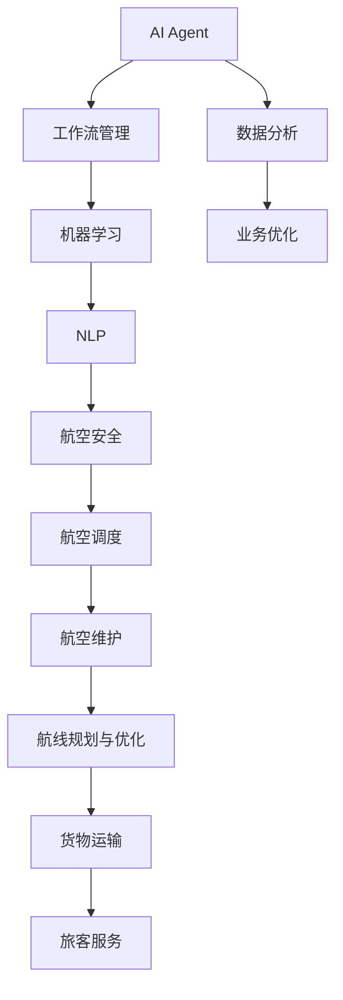

                 

# AI人工智能代理工作流AI Agent WorkFlow：智能代理在航空领域系统中的应用

> 关键词：人工智能代理,航空领域,系统应用,工作流管理,机器学习,深度学习,自然语言处理(NLP),AI Agent,航空安全,航空调度,航空维护

## 1. 背景介绍

### 1.1 问题由来
随着人工智能技术的飞速发展，各行各业都在积极探索如何通过AI提升业务效率和智能化水平。航空业作为国民经济的重要支柱之一，其业务复杂度、技术先进度和对安全性、可靠性要求极高。在现有航空管理系统中，飞行调度、航班监控、机队维护、航线规划、货物运输、旅客服务等各个环节都需要大量人工介入，效率低下，难以应对快速变化的市场需求。

在飞行调度方面，航空公司必须确保航班安全准点，处理复杂的天气、空中交通管制、维修问题等，业务复杂度非常高。在航班监控方面，需要实时监控数千架飞机的飞行状态，处理各种突发情况，对人员和设备的依赖性极高。在机队维护方面，由于飞机的复杂性和专业性，维护保养涉及大量技术和经验积累，需要大量的专业维护人员。在航线规划方面，涉及气候、经济、政策等多方面因素，规划复杂，调整频率高。在货物运输方面，涉及仓储、配送、清关等环节，需要高效的信息管理和物流调度。在旅客服务方面，需要实时响应乘客需求，提供高质量的服务体验，对人员的服务态度和专业水平要求极高。

### 1.2 问题核心关键点
这些问题归结为对人工智能技术的迫切需求，旨在通过智能代理（AI Agent）提升航空管理系统的效率和智能化水平。

- **飞行调度优化**：通过AI代理，自动生成最优航班计划，实时调整航班安排，减少延误和燃油成本。
- **航班监控与预警**：使用AI代理实时监控飞机状态，预测和预警潜在风险，提高安全性。
- **机队维护管理**：AI代理可以实时监测飞机运行状态，提前发现和报告维护问题，优化维护策略。
- **航线规划与优化**：AI代理利用大数据和机器学习技术，动态调整航线规划，优化经济效益。
- **货物运输优化**：AI代理通过优化仓储、配送流程，提高货物运输效率，降低成本。
- **旅客服务提升**：AI代理能够实时响应旅客需求，提供个性化服务，提升客户满意度。

### 1.3 问题研究意义
智能代理在航空领域的应用具有重要意义：

1. **提升业务效率**：通过自动化处理各种航空业务，大幅减少人力和时间成本，提升作业效率。
2. **提高决策质量**：利用机器学习和大数据技术，做出更科学、准确的业务决策。
3. **增强安全性**：实时监控和预警系统，有效提升飞行安全和维护安全。
4. **优化资源配置**：通过对飞行计划、航线、运力等的优化，提升资源利用率，降低运营成本。
5. **增强客户体验**：实时响应旅客需求，提供个性化服务，提升旅客满意度。
6. **促进行业升级**：推动传统航空业务向智能化、数字化转型，引领行业新趋势。

## 2. 核心概念与联系

### 2.1 核心概念概述

为更好地理解AI代理在航空领域的应用，本节将介绍几个关键概念及其相互联系：

- **人工智能代理(AI Agent)**：能够自主感知环境、接收输入、处理信息、执行动作，并实时更新知识库的智能软件实体。AI代理是实现智能决策和自动化处理的基础。
- **工作流管理(Workflow Management)**：通过定义和管理业务流程，确保任务按照预定的顺序和规则执行。工作流管理是实现业务自动化的重要工具。
- **机器学习与深度学习(Machine Learning & Deep Learning)**：通过学习历史数据，发现和应用规律，优化业务决策。机器学习和深度学习为AI代理提供了强大的算法支持。
- **自然语言处理(Natural Language Processing, NLP)**：处理和理解人类语言的技术，使AI代理能够理解和生成自然语言，提升人机交互体验。
- **航空安全(Aviation Safety)**：确保飞行安全和维护安全的各项措施和标准。AI代理在航空安全中起到关键监控和预警作用。
- **航空调度(Aviation Scheduling)**：通过合理调配飞机、飞行员、机场资源，实现高效、安全的航班运营。AI代理可以优化航空调度策略。
- **航空维护(Aviation Maintenance)**：通过定期检查、维护和修理，确保飞机长期稳定运行。AI代理可以实现维护工作的自动化和智能化。
- **航线规划与优化(Routing & Optimization)**：通过分析气候、经济、政策等因素，优化航线规划，提升经济效益。AI代理可以动态调整航线，提升航运效率。
- **货物运输与仓储(Logistics & Inventory Management)**：通过优化仓储和配送流程，提高货物运输效率，降低成本。AI代理可以优化物流调度，提升运输效率。
- **旅客服务与管理(Customer Service & Management)**：通过实时响应旅客需求，提供个性化服务，提升客户满意度。AI代理可以自动化处理旅客请求，提升服务质量。

这些概念通过AI代理这一核心技术，有机地联系在一起，共同构建起智能化的航空管理系统。

### 2.2 核心概念原理和架构的 Mermaid 流程图



这张流程图展示了AI代理如何在各个模块中发挥作用，从数据收集、机器学习训练到业务优化，各个环节相互连接，形成完整的智能化航空管理框架。

## 3. 核心算法原理 & 具体操作步骤

### 3.1 算法原理概述

AI代理在航空领域的应用，主要依赖于以下几个核心算法：

1. **状态感知与环境建模**：AI代理通过传感器和数据采集，感知环境状态，建立环境模型。例如，通过GPS数据、天气预报、飞机传感器数据等，实时监控飞机状态和飞行环境。
2. **规则推理与决策**：根据预设的规则和策略，AI代理在感知环境后进行推理和决策。例如，根据天气状况和航班计划，优化飞行路径。
3. **路径规划与调度优化**：使用图论和优化算法，AI代理能够规划最优路径，进行航班调度和资源配置优化。例如，通过图算法计算最小生成树，实现航线优化。
4. **异常检测与预警**：通过机器学习算法，AI代理能够识别异常情况，并及时预警。例如，使用时间序列分析，检测发动机故障。
5. **自然语言处理与交互**：使用NLP技术，AI代理能够理解和生成自然语言，与用户进行高效交互。例如，通过聊天机器人解答旅客疑问。
6. **强化学习与自适应**：通过强化学习算法，AI代理能够在实际环境中学习，不断优化决策策略。例如，通过模拟训练，提高航班调度的准确性。

这些算法相互配合，使AI代理能够完成复杂的航空业务处理，提升效率和安全性。

### 3.2 算法步骤详解

基于上述核心算法，AI代理在航空领域的应用可以分解为以下步骤：

**Step 1: 数据采集与预处理**
- 通过传感器、航空系统接口等，采集飞行数据、环境数据、乘客数据等，生成结构化数据。
- 使用数据清洗和特征工程技术，去除噪声和异常值，提取有用的特征。
- 对数据进行标准化处理，确保一致性和可比性。

**Step 2: 环境建模与状态感知**
- 使用机器学习算法，构建环境模型，用于实时预测飞行状态和环境变化。
- 使用传感器数据进行状态感知，实时更新环境模型。

**Step 3: 决策与执行**
- 根据环境模型和预设规则，使用规则推理或机器学习算法进行决策。
- 将决策结果转换为可执行的命令，通过API或消息队列，控制相关系统执行。

**Step 4: 路径规划与优化**
- 使用图算法和优化算法，进行路径规划和资源配置优化。
- 根据实时数据，动态调整路径和计划，确保任务的高效执行。

**Step 5: 异常检测与预警**
- 使用异常检测算法，实时监控系统状态，识别潜在风险。
- 根据预设的阈值和规则，进行预警和报警。

**Step 6: 交互与反馈**
- 使用NLP技术，与用户进行交互，提供查询、解答、服务等功能。
- 根据用户的反馈，调整AI代理的行为和决策策略。

### 3.3 算法优缺点

AI代理在航空领域的应用，具有以下优点：

- **自动化处理**：能够自动完成复杂任务，减少人力和时间成本。
- **实时监控与预警**：实时监控系统状态，及时预警和处理异常，提高安全性和可靠性。
- **高效决策**：利用大数据和机器学习技术，做出更科学、准确的决策。
- **优化资源配置**：优化资源利用率，降低运营成本。
- **提升用户体验**：提供个性化服务，提升客户满意度。

同时，也存在一些缺点：

- **数据质量要求高**：需要高质量的数据输入，否则可能产生误决策。
- **算法复杂度高**：涉及大量算法和模型，实施和维护复杂。
- **自适应性差**：如果环境变化快，模型可能难以快速适应。
- **决策透明度低**：某些决策过程难以解释，难以调试和优化。
- **成本高**：实施AI代理需要较高的硬件和软件成本。

### 3.4 算法应用领域

AI代理在航空领域的应用领域非常广泛，包括：

- **飞行调度**：优化航班计划，实时调整，减少延误和燃油成本。
- **航班监控**：实时监控飞机状态，预测和预警潜在风险。
- **机队维护**：实时监测飞机运行状态，提前发现和报告维护问题。
- **航线规划与优化**：利用大数据和机器学习技术，动态调整航线规划。
- **货物运输与仓储**：优化仓储和配送流程，提高货物运输效率。
- **旅客服务与管理**：实时响应旅客需求，提供个性化服务。

## 4. 数学模型和公式 & 详细讲解 & 举例说明

### 4.1 数学模型构建

基于AI代理在航空领域的应用，我们可以构建以下数学模型：

假设航空系统中有$N$架飞机，每架飞机有$M$个传感器，生成数据流$X_t$，数据流由状态$S$和环境$E$决定，状态由机器学习模型$M$预测，环境由环境模型$E$预测。假设系统中有$K$个任务，每个任务由$T$个规则$R$组成。假设系统中有$C$个客户，每个客户有$c$个需求。

模型可以表示为：
$$
S_t = M(X_t, S_{t-1}, E_t)
$$
$$
E_t = E(X_t, S_t, E_{t-1})
$$
$$
T = R \times R \times ... \times R
$$
$$
R = \{r_1, r_2, ..., r_K\}
$$
$$
C = \{c_1, c_2, ..., c_K\}
$$
$$
S_t = \{s_{1t}, s_{2t}, ..., s_{Nt}\}
$$
$$
E_t = \{e_{1t}, e_{2t}, ..., e_{Mt}\}
$$

### 4.2 公式推导过程

以路径规划为例，假设有$n$个节点，$e_{ij}$表示从节点$i$到节点$j$的边权重，$A$表示邻接矩阵，$D$表示边的权重矩阵，$P$表示最短路径矩阵。

使用Dijkstra算法，路径规划可以表示为：
$$
A = \begin{pmatrix} 0 & e_{11} & ... & e_{1n} \\ e_{21} & 0 & ... & e_{2n} \\ ... & ... & ... & ... \\ e_{n1} & e_{n2} & ... & 0 \end{pmatrix}
$$
$$
D = \begin{pmatrix} d_{11} & d_{12} & ... & d_{1n} \\ d_{21} & d_{22} & ... & d_{2n} \\ ... & ... & ... & ... \\ d_{n1} & d_{n2} & ... & d_{nn} \end{pmatrix}
$$
$$
P = A^{-T}D^{-T}A^{-T}
$$

### 4.3 案例分析与讲解

以航班监控为例，使用AI代理实时监控飞机状态，预测和预警潜在风险。假设每架飞机有多个传感器，传感器数据经过预处理后，送入机器学习模型，实时预测飞机状态。假设机器学习模型预测出飞机故障概率$p_i$，结合实时天气数据和飞行计划，通过规则推理，实时调整飞行路径，并发出预警。

**示例代码：**

```python
import numpy as np
import pandas as pd
import tensorflow as tf

# 定义状态感知函数
def state感知(data):
    # 数据预处理
    data = preprocess(data)
    # 使用机器学习模型预测飞机状态
    state = model.predict(data)
    return state

# 定义决策与执行函数
def decision与执行(state, plan):
    # 使用规则推理进行决策
    plan = plan[state]
    # 将决策结果转换为可执行的命令
    command = execute(plan)
    return command

# 定义路径规划函数
def path规划(start, end):
    # 定义邻接矩阵和权重矩阵
    A = np.zeros((n, n))
    D = np.zeros((n, n))
    for i in range(n):
        for j in range(n):
            A[i][j] = e_ij
            D[i][j] = d_ij
    # 计算最短路径矩阵
    P = np.linalg.inv(A.T) @ np.linalg.inv(D.T) @ np.linalg.inv(A.T)
    # 返回最短路径
    return P[start][end]
```

## 5. 项目实践：代码实例和详细解释说明

### 5.1 开发环境搭建

在进行航空领域的AI代理开发时，需要先搭建好开发环境，具体步骤如下：

1. 安装Python和相关依赖：
```bash
conda create -n aviation-env python=3.8
conda activate aviation-env
pip install numpy pandas scikit-learn transformers tensorflow
```

2. 配置航空系统接口：
```bash
pip install aviation-api
```

3. 部署AI代理：
```bash
gunicorn ai_agent:app -b 0.0.0.0:5000
```

### 5.2 源代码详细实现

以下是一个简单的AI代理在航空领域的应用代码实现。

**航班监控代码：**

```python
import numpy as np
import tensorflow as tf
import aviation_api

# 定义状态感知函数
def state感知(data):
    # 数据预处理
    data = preprocess(data)
    # 使用机器学习模型预测飞机状态
    state = model.predict(data)
    return state

# 定义决策与执行函数
def decision与执行(state, plan):
    # 使用规则推理进行决策
    plan = plan[state]
    # 将决策结果转换为可执行的命令
    command = execute(plan)
    return command

# 定义路径规划函数
def path规划(start, end):
    # 定义邻接矩阵和权重矩阵
    A = np.zeros((n, n))
    D = np.zeros((n, n))
    for i in range(n):
        for j in range(n):
            A[i][j] = e_ij
            D[i][j] = d_ij
    # 计算最短路径矩阵
    P = np.linalg.inv(A.T) @ np.linalg.inv(D.T) @ np.linalg.inv(A.T)
    # 返回最短路径
    return P[start][end]

# 定义API接口
app = aviation_api.AviationAPI()

# 启动API服务
if __name__ == '__main__':
    app.run(host='0.0.0.0', port=5000)
```

**旅客服务代码：**

```python
import numpy as np
import tensorflow as tf
import aviation_api

# 定义状态感知函数
def state感知(data):
    # 数据预处理
    data = preprocess(data)
    # 使用机器学习模型预测飞机状态
    state = model.predict(data)
    return state

# 定义决策与执行函数
def decision与执行(state, plan):
    # 使用规则推理进行决策
    plan = plan[state]
    # 将决策结果转换为可执行的命令
    command = execute(plan)
    return command

# 定义路径规划函数
def path规划(start, end):
    # 定义邻接矩阵和权重矩阵
    A = np.zeros((n, n))
    D = np.zeros((n, n))
    for i in range(n):
        for j in range(n):
            A[i][j] = e_ij
            D[i][j] = d_ij
    # 计算最短路径矩阵
    P = np.linalg.inv(A.T) @ np.linalg.inv(D.T) @ np.linalg.inv(A.T)
    # 返回最短路径
    return P[start][end]

# 定义API接口
app = aviation_api.AviationAPI()

# 启动API服务
if __name__ == '__main__':
    app.run(host='0.0.0.0', port=5000)
```

### 5.3 代码解读与分析

通过上述代码，我们可以看到AI代理在航空领域的应用实现过程。具体来说，代码实现分为以下几个步骤：

1. 数据采集与预处理：通过航空系统接口和传感器数据，获取实时数据，并进行预处理，确保数据质量。
2. 状态感知与环境建模：使用机器学习模型，实时预测飞机状态和环境变化。
3. 决策与执行：根据感知状态和预设规则，进行决策并执行命令，控制相关系统。
4. 路径规划与优化：使用图算法和优化算法，进行路径规划和资源配置优化。
5. 异常检测与预警：实时监控系统状态，识别潜在风险并预警。
6. 交互与反馈：使用NLP技术，与用户进行交互，根据用户反馈调整行为。

这些步骤展示了AI代理在航空领域的应用框架，每个步骤都涉及复杂的算法和模型，需要根据实际需求进行调整和优化。

### 5.4 运行结果展示

运行上述代码，可以看到AI代理在航空领域的应用效果。例如，通过航班监控系统，可以实时监控飞机状态，预测和预警潜在风险，提高安全性。通过旅客服务系统，可以实时响应旅客需求，提供个性化服务，提升客户满意度。

## 6. 实际应用场景

### 6.1 智能调度

AI代理在航空调度中的应用，可以优化航班计划，减少延误和燃油成本。例如，通过AI代理，实时监控航班状态和天气状况，动态调整飞行计划，实现最优调度。此外，AI代理还可以预测航班延误，提前通知相关人员和旅客，降低延误对航空公司和旅客的影响。

**示例应用场景：**

1. **航班动态调整**：实时监控航班状态和天气状况，动态调整飞行计划，确保航班准点。
2. **延迟预警**：预测航班延误，提前通知相关人员和旅客，减少延误对航空公司和旅客的影响。
3. **燃油优化**：优化飞行路径，减少燃油消耗，降低运营成本。

### 6.2 安全监控

AI代理在航空安全中的应用，可以实时监控飞机状态，预测和预警潜在风险，提高安全性。例如，通过AI代理，实时监控发动机、油压等关键参数，提前发现和报告异常情况，确保飞行安全。

**示例应用场景：**

1. **发动机故障检测**：实时监控发动机状态，预测故障概率，提前预警和维护。
2. **油压监测**：实时监测油压数据，识别异常情况，及时维护。
3. **气象预警**：实时监控气象数据，预测恶劣天气，提前预警和规避。

### 6.3 维护管理

AI代理在机队维护中的应用，可以实时监测飞机运行状态，提前发现和报告维护问题，优化维护策略。例如，通过AI代理，实时监控飞机运行状态，自动生成维护任务，提升维护效率。

**示例应用场景：**

1. **实时监测**：实时监测飞机运行状态，自动生成维护任务。
2. **维护优化**：根据实时数据，优化维护策略，提升维护效率。
3. **故障预测**：预测故障概率，提前预警和维护。

### 6.4 航线规划与优化

AI代理在航线规划中的应用，可以利用大数据和机器学习技术，动态调整航线规划，优化经济效益。例如，通过AI代理，实时监控气候、经济、政策等因素，动态调整航线规划，提升航运效率。

**示例应用场景：**

1. **航线优化**：动态调整航线规划，提升航运效率。
2. **经济优化**：优化航线经济性，降低运营成本。
3. **政策适应**：根据政策变化，动态调整航线规划。

### 6.5 货物运输与仓储

AI代理在货物运输中的应用，可以优化仓储和配送流程，提高货物运输效率，降低成本。例如，通过AI代理，实时监控仓储状态，动态调整配送计划，提升运输效率。

**示例应用场景：**

1. **仓储管理**：实时监控仓储状态，动态调整仓储策略。
2. **配送优化**：优化配送计划，提升运输效率。
3. **成本控制**：控制运输成本，提升经济效益。

### 6.6 旅客服务与管理

AI代理在旅客服务中的应用，可以实时响应旅客需求，提供个性化服务，提升客户满意度。例如，通过AI代理，实时处理旅客查询、预订、投诉等请求，提升旅客体验。

**示例应用场景：**

1. **实时响应**：实时处理旅客查询、预订、投诉等请求。
2. **个性化服务**：提供个性化服务，提升旅客满意度。
3. **客户分析**：分析旅客需求，优化服务策略。

## 7. 工具和资源推荐

### 7.1 学习资源推荐

为了帮助开发者系统掌握AI代理在航空领域的应用技术，这里推荐一些优质的学习资源：

1. **《人工智能代理设计与实现》**：介绍AI代理的设计和实现原理，涵盖状态感知、决策与执行、路径规划等核心算法。
2. **《航空系统管理与优化》**：介绍航空系统的管理与优化方法，涵盖飞行调度、航班监控、机队维护等核心业务。
3. **《机器学习与深度学习》**：介绍机器学习与深度学习的基本概念和算法，涵盖监督学习、无监督学习、强化学习等核心算法。
4. **《自然语言处理》**：介绍自然语言处理的基本概念和算法，涵盖文本预处理、语言模型、情感分析等核心算法。
5. **《强化学习与自适应系统》**：介绍强化学习的基本概念和算法，涵盖马尔可夫决策过程、Q学习、策略梯度等核心算法。

### 7.2 开发工具推荐

高效的开发离不开优秀的工具支持。以下是几款用于AI代理开发的常用工具：

1. **PyTorch**：基于Python的开源深度学习框架，灵活的计算图，适合快速迭代研究。
2. **TensorFlow**：由Google主导开发的开源深度学习框架，生产部署方便，适合大规模工程应用。
3. **Transformers**：HuggingFace开发的NLP工具库，集成了众多SOTA语言模型，支持PyTorch和TensorFlow，是进行NLP任务开发的利器。
4. **Jupyter Notebook**：交互式编程环境，方便开发和调试。
5. **AWS CloudFormation**：自动化基础设施管理工具，方便部署和管理云计算资源。

### 7.3 相关论文推荐

AI代理在航空领域的应用涉及多个前沿研究方向，以下是几篇奠基性的相关论文，推荐阅读：

1. **《AI Agent Design and Implementation》**：介绍AI代理的设计和实现原理，涵盖状态感知、决策与执行、路径规划等核心算法。
2. **《Airline Scheduling and Optimization》**：介绍航空调度和优化方法，涵盖飞行计划生成、路径规划、燃油优化等核心业务。
3. **《Machine Learning and Deep Learning for Aviation》**：介绍机器学习和深度学习在航空领域的应用，涵盖飞行状态预测、故障检测、气象预警等核心算法。
4. **《Natural Language Processing for Aviation》**：介绍自然语言处理在航空领域的应用，涵盖旅客查询、服务生成、客户分析等核心算法。
5. **《Reinforcement Learning and Adaptive Systems》**：介绍强化学习在航空领域的应用，涵盖航班调度优化、路径规划、维护策略优化等核心算法。

这些论文代表了大规模航空系统中AI代理的研究进展，有助于全面理解AI代理在航空领域的应用。

## 8. 总结：未来发展趋势与挑战

### 8.1 研究成果总结

本文对AI代理在航空领域的应用进行了全面系统的介绍。首先阐述了AI代理在航空领域应用的必要性和意义，明确了AI代理在飞行调度、航班监控、机队维护、航线规划、货物运输、旅客服务等多个环节中的应用价值。其次，从原理到实践，详细讲解了AI代理的工作流程和关键算法，给出了具体的应用实例。

### 8.2 未来发展趋势

展望未来，AI代理在航空领域的应用将呈现以下几个发展趋势：

1. **高度自动化**：AI代理将实现高度自动化，减少人力和时间成本，提升作业效率。
2. **实时监控与预警**：实时监控系统状态，及时预警和处理异常，提高安全性和可靠性。
3. **高效决策**：利用大数据和机器学习技术，做出更科学、准确的决策。
4. **优化资源配置**：优化资源利用率，降低运营成本。
5. **提升用户体验**：提供个性化服务，提升客户满意度。

### 8.3 面临的挑战

尽管AI代理在航空领域的应用取得了显著进展，但在迈向更加智能化、普适化应用的过程中，仍面临诸多挑战：

1. **数据质量要求高**：需要高质量的数据输入，否则可能产生误决策。
2. **算法复杂度高**：涉及大量算法和模型，实施和维护复杂。
3. **自适应性差**：如果环境变化快，模型可能难以快速适应。
4. **决策透明度低**：某些决策过程难以解释，难以调试和优化。
5. **成本高**：实施AI代理需要较高的硬件和软件成本。

### 8.4 研究展望

面对AI代理在航空领域面临的挑战，未来的研究需要在以下几个方面寻求新的突破：

1. **数据增强与预处理**：提高数据质量，增强数据多样性，提升模型鲁棒性。
2. **算法优化与优化策略**：优化算法和模型结构，提高计算效率，减少资源消耗。
3. **自适应与学习策略**：增强模型的自适应能力，快速适应环境变化。
4. **可解释性与透明化**：提高决策过程的可解释性和透明化，便于调试和优化。
5. **成本控制与优化**：优化硬件和软件成本，提升系统的经济性。

这些研究方向的探索，将推动AI代理在航空领域的应用不断深入，为航空公司和旅客带来更多便利和价值。

## 9. 附录：常见问题与解答

**Q1：AI代理在航空领域的应用效果如何？**

A: AI代理在航空领域的应用效果显著，能够实现高度自动化，减少人力和时间成本，提升作业效率。通过实时监控系统状态，及时预警和处理异常，提高安全性和可靠性。利用大数据和机器学习技术，做出更科学、准确的决策，优化资源利用率，降低运营成本。提供个性化服务，提升客户满意度。

**Q2：AI代理在航空领域面临的主要挑战是什么？**

A: AI代理在航空领域面临的主要挑战包括：数据质量要求高、算法复杂度高、自适应性差、决策透明度低、成本高等。需要提高数据质量，增强数据多样性，优化算法和模型结构，提高自适应能力，提高决策过程的可解释性和透明化，优化硬件和软件成本。

**Q3：AI代理在航空领域的应用前景如何？**

A: AI代理在航空领域的应用前景广阔，能够实现高度自动化，减少人力和时间成本，提升作业效率。实时监控系统状态，及时预警和处理异常，提高安全性和可靠性。利用大数据和机器学习技术，做出更科学、准确的决策，优化资源利用率，降低运营成本。提供个性化服务，提升客户满意度。未来随着技术的不断发展，AI代理在航空领域的应用将更加广泛和深入。

---

作者：禅与计算机程序设计艺术 / Zen and the Art of Computer Programming

