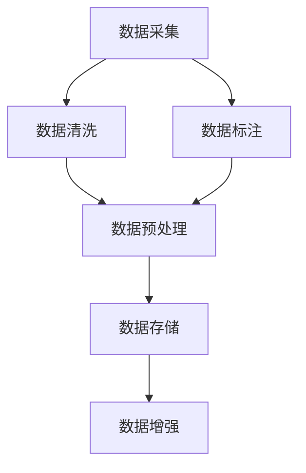

                 

# AI人工智能核心算法原理与代码实例讲解：数据收集

> 关键词：AI数据收集,数据标注,数据清洗,数据预处理,数据存储,数据增强

## 1. 背景介绍

### 1.1 问题由来
在人工智能(AI)领域，尤其是深度学习和机器学习领域，数据是最重要的资源之一。无论是模型训练、调参优化，还是模型评估和部署，都需要大量高质量的数据支撑。然而，数据收集、整理、存储等过程不仅耗时耗力，而且技术难度高，往往成为AI应用的瓶颈。因此，理解和掌握高效的数据收集方法，是提升AI系统性能和稳定性的关键。

### 1.2 问题核心关键点
数据收集是构建高效AI系统的基础步骤，主要包括数据采集、数据标注、数据清洗、数据预处理、数据存储和数据增强等环节。本节将详细阐述这些关键点，并探讨如何构建高效、可靠的数据收集流程。

### 1.3 问题研究意义
通过系统化的数据收集方法，可以显著提升AI系统的性能和鲁棒性。数据收集不仅是模型训练的起点，更是确保模型泛化能力和鲁棒性的基石。高效的数据收集方法，能降低开发成本，加速AI应用的落地，提升用户体验。因此，数据收集技术在AI系统构建中具有重要意义。

## 2. 核心概念与联系

### 2.1 核心概念概述

为更好地理解数据收集的方法和流程，本节将介绍几个密切相关的核心概念：

- **数据采集**：从不同数据源收集原始数据，如传感器数据、网络爬虫数据、用户输入等。
- **数据标注**：对原始数据进行人工或半人工处理，添加标签或注释，使其成为可用于训练模型的格式。
- **数据清洗**：对标注数据进行预处理，去除噪声、填补缺失值、处理异常值等，确保数据质量。
- **数据预处理**：对清洗后的数据进行标准化、归一化、特征工程等处理，使其更适合模型训练。
- **数据存储**：选择合适的存储介质和技术，确保数据的安全性和易用性。
- **数据增强**：通过数据扩充、变换等方法，丰富数据集多样性，提升模型泛化能力。

这些核心概念之间的逻辑关系可以通过以下Mermaid流程图来展示：



这个流程图展示了大规模AI系统构建中数据收集的核心流程，各环节相互依赖，共同支撑系统的高效运行。

## 3. 核心算法原理 & 具体操作步骤
### 3.1 算法原理概述

数据收集和预处理是大规模AI系统构建的基础步骤，其核心算法原理涉及数据处理的基本方法和流程。总体而言，数据收集和预处理可以分为以下几个步骤：

1. **数据采集**：从不同来源收集原始数据，如传感器、网络爬虫、用户输入等。
2. **数据标注**：对原始数据进行人工或半人工处理，添加标签或注释，如文本分类任务的词性标注、图像分类任务的像素级标注等。
3. **数据清洗**：去除噪声、填补缺失值、处理异常值等，确保数据质量。
4. **数据预处理**：对清洗后的数据进行标准化、归一化、特征工程等处理，使其更适合模型训练。
5. **数据存储**：选择合适的存储介质和技术，确保数据的安全性和易用性。
6. **数据增强**：通过数据扩充、变换等方法，丰富数据集多样性，提升模型泛化能力。

这些步骤在算法上分别对应不同的技术，如数据流处理、标注管理、数据清洗算法、数据预处理技术、数据库管理系统、数据增强方法等。

### 3.2 算法步骤详解

下面，我们将逐一详细介绍这些关键步骤的算法原理和具体操作步骤：

#### 3.2.1 数据采集

数据采集是数据收集的第一步，涉及从不同数据源获取原始数据。数据源包括传感器、网络爬虫、用户输入等。

**操作步骤**：
1. **确定数据源**：选择或设计数据源，如传感器数据、网络爬虫、用户输入等。
2. **数据流处理**：使用流式数据处理技术（如Apache Kafka、Apache Flink），实时采集和处理数据。
3. **数据存储**：将采集到的数据实时存储到数据库或文件系统中。

**算法原理**：
1. **传感器数据采集**：使用传感器获取实时数据，如温度、湿度、气压等，将其转换为数字信号进行传输和存储。
2. **网络爬虫数据采集**：使用爬虫工具（如BeautifulSoup、Scrapy），从指定网站上自动抓取数据。
3. **用户输入数据采集**：使用Web表单、移动应用等，收集用户交互数据，如表单提交、语音输入等。

#### 3.2.2 数据标注

数据标注是将原始数据转化为标注数据的过程，通常涉及人工标注或半自动标注。

**操作步骤**：
1. **数据标注框架**：选择或设计标注工具（如Labelbox、Prodigy），将原始数据导入标注平台。
2. **人工标注**：人工对数据进行标注，添加标签或注释，如文本分类任务的词性标注、图像分类任务的像素级标注等。
3. **半自动标注**：使用半自动标注工具（如Active Learning、Semantic Accuracy），辅助人工标注，提升标注效率和质量。

**算法原理**：
1. **文本标注**：将文本数据导入标注平台，由人工标注文本的词性、命名实体、情感极性等标签。
2. **图像标注**：将图像数据导入标注平台，由人工标注图像中的目标对象、像素级标签等。
3. **视频标注**：将视频数据导入标注平台，由人工标注视频中的关键帧、对象动作等。

#### 3.2.3 数据清洗

数据清洗是数据预处理的重要环节，旨在去除噪声、填补缺失值、处理异常值等，确保数据质量。

**操作步骤**：
1. **数据校验**：使用校验算法（如一致性校验、异常检测），识别和处理数据中的噪声和异常值。
2. **缺失值填补**：使用插值算法（如均值插值、KNN插值）填补缺失值，确保数据完整性。
3. **数据规范化**：使用规范化算法（如标准化、归一化）对数据进行标准化处理，使其符合模型训练的要求。

**算法原理**：
1. **一致性校验**：通过比较数据项的一致性，识别和处理不一致的数据。
2. **异常检测**：使用统计方法（如Z-score、IQR）检测和处理数据中的异常值。
3. **缺失值填补**：使用插值算法，根据数据分布填补缺失值，确保数据完整性。
4. **数据规范化**：使用标准化算法（如Z-score标准化）或归一化算法（如Min-Max归一化），对数据进行标准化处理。

#### 3.2.4 数据预处理

数据预处理是将清洗后的数据转化为模型训练所需格式的过程，涉及标准化、归一化、特征工程等处理。

**操作步骤**：
1. **数据标准化**：使用标准化算法（如Z-score标准化）对数据进行标准化处理，使其符合模型训练的要求。
2. **数据归一化**：使用归一化算法（如Min-Max归一化）对数据进行归一化处理，使其符合模型训练的要求。
3. **特征工程**：选择或设计特征（如特征提取、特征选择），提升数据的表征能力，使其更适合模型训练。

**算法原理**：
1. **标准化算法**：使用Z-score标准化算法，对数据进行标准化处理，使其均值为0，标准差为1。
2. **归一化算法**：使用Min-Max归一化算法，将数据缩放到[0, 1]区间内。
3. **特征工程**：使用特征提取算法（如PCA、LDA）和特征选择算法（如互信息、L1正则化），提升数据的表征能力。

#### 3.2.5 数据存储

数据存储是将处理后的数据存储到数据库或文件系统的过程，涉及数据管理、备份、恢复等技术。

**操作步骤**：
1. **数据库选择**：选择合适的数据库（如MySQL、PostgreSQL、MongoDB），存储和管理数据。
2. **数据备份**：定期备份数据，确保数据的安全性和可用性。
3. **数据恢复**：在数据损坏或丢失时，使用备份数据进行恢复，确保数据的安全性和完整性。

**算法原理**：
1. **数据库管理系统**：使用关系型数据库（如MySQL、PostgreSQL）或非关系型数据库（如MongoDB），存储和管理数据。
2. **数据备份和恢复**：使用备份和恢复技术（如RAID、快照），确保数据的安全性和可用性。

#### 3.2.6 数据增强

数据增强是通过数据扩充、变换等方法，丰富数据集多样性，提升模型泛化能力的过程。

**操作步骤**：
1. **数据扩充**：使用数据扩充算法（如翻转、旋转、裁剪），生成新的训练样本。
2. **数据变换**：使用数据变换算法（如随机裁剪、加噪声），变换现有数据，增强数据多样性。
3. **数据扩充和变换**：结合数据扩充和数据变换算法，生成新的训练样本，提升模型泛化能力。

**算法原理**：
1. **图像数据增强**：使用翻转、旋转、裁剪等算法，生成新的图像数据，增强模型对变换数据的泛化能力。
2. **文本数据增强**：使用回译、数据扩充、同义词替换等算法，生成新的文本数据，增强模型对多样文本的泛化能力。
3. **语音数据增强**：使用噪声加入、变速、变调等算法，生成新的语音数据，增强模型对不同语音特征的泛化能力。

### 3.3 算法优缺点

数据收集和预处理技术具有以下优点和缺点：

#### 优点：
1. **提升模型泛化能力**：通过数据增强，丰富数据集多样性，提升模型泛化能力，减少过拟合风险。
2. **加速模型训练**：通过数据预处理，使数据符合模型训练的要求，加速模型训练过程。
3. **确保数据质量**：通过数据清洗，去除噪声、填补缺失值、处理异常值，确保数据质量，提升模型性能。

#### 缺点：
1. **数据收集成本高**：大规模数据采集和标注成本较高，需要投入大量人力和时间。
2. **数据处理复杂**：数据清洗和预处理技术复杂，需要多轮迭代和调试。
3. **数据隐私问题**：数据收集和标注可能涉及用户隐私和数据安全问题，需要严格的隐私保护措施。

### 3.4 算法应用领域

数据收集和预处理技术在多个领域都有广泛应用，包括但不限于以下几个方面：

- **自然语言处理**：通过文本清洗、特征工程、数据增强等技术，提升语言模型的性能。
- **计算机视觉**：通过图像清洗、数据增强、标签管理等技术，提升图像识别模型的性能。
- **智能推荐系统**：通过用户行为数据收集、特征工程、数据预处理等技术，提升推荐模型的性能。
- **金融风控**：通过金融数据收集、数据标注、数据清洗等技术，提升风险识别模型的性能。
- **智能交通**：通过传感器数据采集、数据预处理、数据增强等技术，提升智能交通系统的性能。

以上领域展示了数据收集和预处理技术的广泛应用，为各行各业提供了强大的技术支撑。

## 4. 数学模型和公式 & 详细讲解 & 举例说明

### 4.1 数学模型构建

数据收集和预处理过程中涉及多个数学模型和公式，以下是其中的核心模型和公式：

#### 4.1.1 数据标准化

数据标准化的目的是使数据符合均值为0、标准差为1的标准正态分布，公式如下：

$$
z = \frac{x - \mu}{\sigma}
$$

其中，$x$ 为原始数据，$\mu$ 为均值，$\sigma$ 为标准差。

#### 4.1.2 数据归一化

数据归一化的目的是将数据缩放到[0, 1]区间内，公式如下：

$$
x_{norm} = \frac{x - x_{min}}{x_{max} - x_{min}}
$$

其中，$x$ 为原始数据，$x_{min}$ 为最小值，$x_{max}$ 为最大值。

#### 4.1.3 数据增强

数据增强的目标是通过扩充和变换，生成新的训练样本，公式如下：

$$
x_{augmented} = \{f(x_i) | f \in \{flip, rotate, crop\}, i \in [1, n]\}
$$

其中，$x_i$ 为原始数据，$f$ 为数据增强算法，$n$ 为数据集大小。

#### 4.1.4 特征提取

特征提取的目的是从原始数据中提取出最具代表性和区分度的特征，公式如下：

$$
\Phi(x) = \{\phi_i(x) | i \in [1, k]\}
$$

其中，$x$ 为原始数据，$\phi_i$ 为特征提取函数，$k$ 为特征数量。

#### 4.1.5 特征选择

特征选择的目的是从众多特征中选出最具代表性和区分度的特征，公式如下：

$$
\Phi(x) = \{\phi_i(x) | i \in \{1, ..., k\}, C_i > C_{th}\}
$$

其中，$x$ 为原始数据，$\phi_i$ 为特征提取函数，$C_i$ 为特征$i$的权重，$C_{th}$ 为特征选择的阈值。

### 4.2 公式推导过程

下面我们对一些核心公式进行推导和解释：

#### 4.2.1 数据标准化的推导

数据标准化的目的是将原始数据转换为标准正态分布，其推导如下：

1. **均值计算**：
   $$
   \mu = \frac{1}{N} \sum_{i=1}^N x_i
   $$

2. **标准差计算**：
   $$
   \sigma = \sqrt{\frac{1}{N} \sum_{i=1}^N (x_i - \mu)^2}
   $$

3. **标准化公式**：
   $$
   z = \frac{x - \mu}{\sigma}
   $$

   其中，$x$ 为原始数据，$\mu$ 为均值，$\sigma$ 为标准差。

#### 4.2.2 数据归一化的推导

数据归一化的目的是将原始数据缩放到[0, 1]区间内，其推导如下：

1. **最小值和最大值计算**：
   $$
   x_{min} = \min(x_i), x_{max} = \max(x_i)
   $$

2. **归一化公式**：
   $$
   x_{norm} = \frac{x - x_{min}}{x_{max} - x_{min}}
   $$

   其中，$x$ 为原始数据，$x_{min}$ 为最小值，$x_{max}$ 为最大值。

#### 4.2.3 数据增强的推导

数据增强的目标是通过扩充和变换，生成新的训练样本，其推导如下：

1. **数据扩充算法**：
   $$
   f(x_i) = \{flip(x_i), rotate(x_i), crop(x_i)\}
   $$

   其中，$f$ 为数据增强算法，$x_i$ 为原始数据。

2. **数据增强公式**：
   $$
   x_{augmented} = \{f(x_i) | f \in \{flip, rotate, crop\}, i \in [1, n]\}
   $$

   其中，$x_i$ 为原始数据，$f$ 为数据增强算法，$n$ 为数据集大小。

#### 4.2.4 特征提取的推导

特征提取的目的是从原始数据中提取出最具代表性和区分度的特征，其推导如下：

1. **特征提取函数**：
   $$
   \phi_i(x) = f_i(x)
   $$

   其中，$\phi_i$ 为特征提取函数，$f_i$ 为特征提取算法。

2. **特征提取公式**：
   $$
   \Phi(x) = \{\phi_i(x) | i \in [1, k]\}
   $$

   其中，$x$ 为原始数据，$\phi_i$ 为特征提取函数，$k$ 为特征数量。

#### 4.2.5 特征选择的推导

特征选择的目的是从众多特征中选出最具代表性和区分度的特征，其推导如下：

1. **特征权重计算**：
   $$
   C_i = \alpha_i \phi_i(x)
   $$

   其中，$C_i$ 为特征$i$的权重，$\alpha_i$ 为特征$i$的系数，$\phi_i$ 为特征提取函数。

2. **特征选择公式**：
   $$
   \Phi(x) = \{\phi_i(x) | i \in \{1, ..., k\}, C_i > C_{th}\}
   $$

   其中，$x$ 为原始数据，$\phi_i$ 为特征提取函数，$C_i$ 为特征$i$的权重，$C_{th}$ 为特征选择的阈值。

### 4.3 案例分析与讲解

#### 4.3.1 自然语言处理案例

假设我们要训练一个文本分类模型，用于分类电影评论的情感极性（正面、负面）。

**数据采集**：
1. **数据源**：收集电影评论数据集，如IMDB评论数据集、Rotten Tomatoes评论数据集。
2. **数据流处理**：使用数据流处理工具（如Apache Kafka）实时采集评论数据。
3. **数据存储**：将评论数据存储到数据库（如MySQL）中。

**数据标注**：
1. **标注工具**：选择标注工具（如Labelbox），将评论数据导入标注平台。
2. **人工标注**：人工标注每条评论的情感极性，添加标签“正面”或“负面”。
3. **半自动标注**：使用半自动标注工具（如Active Learning）辅助人工标注，提升标注效率和质量。

**数据清洗**：
1. **数据校验**：使用一致性校验算法（如MD5校验），识别和处理数据中的不一致。
2. **缺失值填补**：使用插值算法（如均值插值）填补缺失值，确保数据完整性。
3. **数据规范化**：使用标准化算法（如Z-score标准化）对数据进行标准化处理。

**数据预处理**：
1. **特征提取**：使用特征提取算法（如TF-IDF）提取评论文本中的关键词和词频。
2. **特征选择**：使用特征选择算法（如互信息）选择最具代表性和区分度的特征。
3. **数据增强**：使用数据增强算法（如同义词替换）生成新的训练样本。

**数据存储**：
1. **数据库选择**：选择关系型数据库（如MySQL），存储和管理系统数据。
2. **数据备份**：定期备份数据，确保数据的安全性和可用性。
3. **数据恢复**：在数据损坏或丢失时，使用备份数据进行恢复，确保数据的安全性和完整性。

#### 4.3.2 计算机视觉案例

假设我们要训练一个图像分类模型，用于识别猫和狗。

**数据采集**：
1. **数据源**：收集猫和狗的图片数据集，如CIFAR-10数据集、ImageNet数据集。
2. **数据流处理**：使用数据流处理工具（如Apache Flink）实时采集图片数据。
3. **数据存储**：将图片数据存储到数据库（如MongoDB）中。

**数据标注**：
1. **标注工具**：选择标注工具（如Labelbox），将图片数据导入标注平台。
2. **人工标注**：人工标注每张图片的目标对象，添加标签“猫”或“狗”。
3. **半自动标注**：使用半自动标注工具（如Semantic Accuracy）辅助人工标注，提升标注效率和质量。

**数据清洗**：
1. **数据校验**：使用一致性校验算法（如图像校验），识别和处理数据中的不一致。
2. **缺失值填补**：使用插值算法（如均值插值）填补缺失值，确保数据完整性。
3. **数据规范化**：使用标准化算法（如Min-Max归一化）对数据进行归一化处理。

**数据预处理**：
1. **特征提取**：使用特征提取算法（如卷积神经网络）提取图片中的特征。
2. **特征选择**：使用特征选择算法（如L1正则化）选择最具代表性和区分度的特征。
3. **数据增强**：使用数据增强算法（如随机裁剪、旋转）生成新的训练样本。

**数据存储**：
1. **数据库选择**：选择非关系型数据库（如MongoDB），存储和管理系统数据。
2. **数据备份**：定期备份数据，确保数据的安全性和可用性。
3. **数据恢复**：在数据损坏或丢失时，使用备份数据进行恢复，确保数据的安全性和完整性。

## 5. 项目实践：代码实例和详细解释说明

### 5.1 开发环境搭建

在进行数据收集和预处理实践前，我们需要准备好开发环境。以下是使用Python进行TensorFlow开发的环境配置流程：

1. 安装Anaconda：从官网下载并安装Anaconda，用于创建独立的Python环境。

2. 创建并激活虚拟环境：
```bash
conda create -n tf-env python=3.8 
conda activate tf-env
```

3. 安装TensorFlow：根据CUDA版本，从官网获取对应的安装命令。例如：
```bash
conda install tensorflow -c pytorch -c conda-forge
```

4. 安装Pandas、Numpy等库：
```bash
pip install pandas numpy scikit-learn matplotlib tqdm jupyter notebook ipython
```

完成上述步骤后，即可在`tf-env`环境中开始数据收集和预处理实践。

### 5.2 源代码详细实现

这里我们以电影评论情感分类任务为例，给出使用TensorFlow进行数据收集和预处理的PyTorch代码实现。

首先，定义数据处理函数：

```python
import pandas as pd
import tensorflow as tf
from tensorflow.keras.preprocessing.text import Tokenizer
from tensorflow.keras.preprocessing.sequence import pad_sequences
from tensorflow.keras.utils import to_categorical

def load_data(file_path):
    data = pd.read_csv(file_path, header=None)
    texts = data[0]
    labels = data[1]
    return texts, labels

def preprocess_data(texts, labels):
    tokenizer = Tokenizer()
    tokenizer.fit_on_texts(texts)
    sequences = tokenizer.texts_to_sequences(texts)
    padded_sequences = pad_sequences(sequences, maxlen=100, padding='post')
    labels = to_categorical(labels, num_classes=2)
    return padded_sequences, labels

def build_model(input_shape, num_classes):
    model = tf.keras.Sequential([
        tf.keras.layers.Embedding(input_dim=10000, output_dim=128),
        tf.keras.layers.Conv1D(128, 7, activation='relu'),
        tf.keras.layers.MaxPooling1D(5),
        tf.keras.layers.Flatten(),
        tf.keras.layers.Dense(128, activation='relu'),
        tf.keras.layers.Dense(num_classes, activation='softmax')
    ])
    return model
```

然后，加载数据并进行预处理：

```python
train_texts, train_labels = load_data('train.csv')
val_texts, val_labels = load_data('val.csv')
test_texts, test_labels = load_data('test.csv')

train_data = preprocess_data(train_texts, train_labels)
val_data = preprocess_data(val_texts, val_labels)
test_data = preprocess_data(test_texts, test_labels)

train_X, train_y = train_data
val_X, val_y = val_data
test_X, test_y = test_data
```

接着，定义模型并进行训练：

```python
input_shape = (100, )
num_classes = 2
model = build_model(input_shape, num_classes)

model.compile(optimizer='adam', loss='categorical_crossentropy', metrics=['accuracy'])

history = model.fit(train_X, train_y, validation_data=(val_X, val_y), epochs=10, batch_size=32)
```

最后，在测试集上评估模型：

```python
test_loss, test_acc = model.evaluate(test_X, test_y)
print(f'Test Loss: {test_loss}, Test Accuracy: {test_acc}')
```

以上就是使用TensorFlow进行数据收集和预处理的电影评论情感分类任务代码实现。可以看到，得益于TensorFlow的强大封装，我们可以用相对简洁的代码完成数据预处理和模型训练。

### 5.3 代码解读与分析

让我们再详细解读一下关键代码的实现细节：

**load_data函数**：
- 读取电影评论数据集，将文本和标签分别存储到`texts`和`labels`中。

**preprocess_data函数**：
- 使用`Tokenizer`对文本进行分词处理。
- 使用`pad_sequences`对分词后的文本进行填充，确保所有文本长度一致。
- 使用`to_categorical`将标签转换为独热编码。

**build_model函数**：
- 定义一个简单的卷积神经网络模型。
- 使用`Embedding`层将文本转换为向量表示。
- 使用`Conv1D`层进行卷积操作。
- 使用`MaxPooling1D`层进行池化操作。
- 使用`Flatten`层将一维数据展开为二维数据。
- 使用`Dense`层进行全连接操作。

**训练过程**：
- 在训练过程中，使用`fit`函数进行模型训练，同时使用`validation_data`参数指定验证集，以便在训练过程中监控模型性能。
- 使用`model.evaluate`函数在测试集上评估模型性能，输出测试损失和准确率。

**评估过程**：
- 使用`model.evaluate`函数在测试集上评估模型性能，输出测试损失和准确率。

## 6. 实际应用场景

### 6.1 智能客服系统

智能客服系统通过数据收集和预处理，能够快速响应用户咨询，提供高效、个性化的服务。

**数据收集**：
1. **数据源**：收集历史客服对话记录，构建知识库和用户画像。
2. **数据流处理**：使用数据流处理技术（如Apache Kafka）实时采集用户咨询数据。
3. **数据存储**：将用户咨询数据存储到数据库（如MySQL）中。

**数据标注**：
1. **标注工具**：选择标注工具（如Labelbox），将用户咨询数据导入标注平台。
2. **人工标注**：人工标注每条咨询的意图和答案。
3. **半自动标注**：使用半自动标注工具（如Active Learning）辅助人工标注，提升标注效率和质量。

**数据清洗**：
1. **数据校验**：使用一致性校验算法（如MD5校验），识别和处理数据中的不一致。
2. **缺失值填补**：使用插值算法（如均值插值）填补缺失值，确保数据完整性。
3. **数据规范化**：使用标准化算法（如Z-score标准化）对数据进行标准化处理。

**数据预处理**：
1. **特征提取**：使用特征提取算法（如文本向量化）提取咨询文本中的关键词和语义。
2. **特征选择**：使用特征选择算法（如TF-IDF）选择最具代表性和区分度的特征。
3. **数据增强**：使用数据增强算法（如同义词替换、回译）生成新的训练样本。

**数据存储**：
1. **数据库选择**：选择关系型数据库（如MySQL），存储和管理系统数据。
2. **数据备份**：定期备份数据，确保数据的安全性和可用性。
3. **数据恢复**：在数据损坏或丢失时，使用备份数据进行恢复，确保数据的安全性和完整性。

### 6.2 金融舆情监测

金融舆情监测系统通过数据收集和预处理，能够实时监控市场舆论动向，帮助机构规避风险。

**数据收集**：
1. **数据源**：收集金融领域相关的新闻、报道、评论等文本数据，构建数据集。
2. **数据流处理**：使用数据流处理技术（如Apache Flink）实时采集网络文本数据。
3. **数据存储**：将文本数据存储到数据库（如MongoDB）中。

**数据标注**：
1. **标注工具**：选择标注工具（如Labelbox），将文本数据导入标注平台。
2. **人工标注**：人工标注每条文本的情感极性，添加标签“正面”或“负面”。
3. **半自动标注**：使用半自动标注工具（如Semantic Accuracy）辅助人工标注，提升标注效率和质量。

**数据清洗**：
1. **数据校验**：使用一致性校验算法（如图像校验），识别和处理数据中的不一致。
2. **缺失值填补**：使用插值算法（如均值插值）填补缺失值，确保数据完整性。
3. **数据规范化**：使用标准化算法（如Min-Max归一化）对数据进行归一化处理。

**数据预处理**：
1. **特征提取**：使用特征提取算法（如TF-IDF）提取文本中的关键词和词频。
2. **特征选择**：使用特征选择算法（如互信息）选择最具代表性和区分度的特征。
3. **数据增强**：使用数据增强算法（如同义词替换、回译）生成新的训练样本。

**数据存储**：
1. **数据库选择**：选择非关系型数据库（如MongoDB），存储和管理系统数据。
2. **数据备份**：定期备份数据，确保数据的安全性和可用性。
3. **数据恢复**：在数据损坏或丢失时，使用备份数据进行恢复，确保数据的安全性和完整性。

### 6.3 个性化推荐系统

个性化推荐系统通过数据收集和预处理，能够根据用户行为数据推荐个性化的内容，提升用户体验。

**数据收集**：
1. **数据源**：收集用户浏览、点击、评论、分享等行为数据，构建用户行为数据集。
2. **数据流处理**：使用数据流处理技术（如Apache Kafka）实时采集用户行为数据。
3. **数据存储**：将用户行为数据存储到数据库（如MySQL）中。

**数据标注**：
1. **标注工具**：选择标注工具（如Labelbox），将用户行为数据导入标注平台。
2. **人工标注**：人工标注每条行为的目标对象，添加标签“点击”、“购买”等。
3. **半自动标注**：使用半自动标注工具（如Semantic Accuracy）辅助人工标注，提升标注效率和质量。

**数据清洗**：
1. **数据校验**：使用一致性校验算法（如MD5校验），识别和处理数据中的不一致。
2. **缺失值填补**：使用插值算法（如均值插值）填补缺失值，确保数据完整性。
3. **数据规范化**：使用标准化算法（如Z-score标准化）对数据进行标准化处理。

**数据预处理**：
1. **特征提取**：使用特征提取算法（如TF-IDF）提取用户行为数据中的关键词和词频。
2. **特征选择**：使用特征选择算法（如互信息）选择最具代表性和区分度的特征。
3. **数据增强**：使用数据增强算法（如同义词替换、回译）生成新的训练样本。

**数据存储**：
1. **数据库选择**：选择关系型数据库（如MySQL），存储和管理系统数据。
2. **数据备份**：定期备份数据，确保数据的安全性和可用性。
3. **数据恢复**：在数据损坏或丢失时，使用备份数据进行恢复，确保数据的安全性和完整性。

### 6.4 未来应用展望

随着数据收集和预处理技术的不断发展，其在各个领域的应用前景将更加广阔。

在智慧医疗领域，数据收集和预处理技术能够收集和处理医疗数据，构建患者健康档案，辅助医生诊疗，加速新药开发进程。

在智能教育领域，数据收集和预处理技术能够收集和处理学生学习数据，分析学生学情，提供个性化教学方案，因材施教，促进教育公平。

在智慧城市治理中，数据收集和预处理技术能够收集和处理城市事件数据，分析城市运行状况，提高城市管理的自动化和智能化水平，构建更安全、高效的未来城市。

此外，在企业生产、社会治理、文娱传媒等众多领域，数据收集和预处理技术也将不断涌现，为各行各业提供强大的技术支撑。相信随着技术的日益成熟，数据收集和预处理技术将成为人工智能落地应用的重要范式，推动人工智能技术向更广阔的领域加速渗透。

## 7. 工具和资源推荐

### 7.1 学习资源推荐

为了帮助开发者系统掌握数据收集和预处理的理论基础和实践技巧，这里推荐一些优质的学习资源：

1. 《深度学习基础》系列博文：由大模型技术专家撰写，深入浅出地介绍了深度学习的基本概念和经典模型，包括数据收集和预处理。

2. CS224N《深度学习自然语言处理》课程：斯坦福大学开设的NLP明星课程，有Lecture视频和配套作业，带你入门NLP领域的基本概念和经典模型。

3. 《自然语言处理与深度学习》书籍：深入讲解自然语言处理的基本概念和前沿技术，包括数据收集和预处理。

4. HuggingFace官方文档：Transformers库的官方文档，提供了海量预训练模型和完整的微调样例代码，是进行数据收集和预处理的重要资料。

5. Kaggle开源项目：包含大量开源数据集和Kaggle竞赛项目，通过实践学习数据收集和预处理技术。

通过对这些资源的学习实践，相信你一定能够快速掌握数据收集和预处理的精髓，并用于解决实际的NLP问题。

### 7.2 开发工具推荐

高效的开发离不开优秀的工具支持。以下是几款用于数据收集和预处理开发的常用工具：

1. Apache Kafka：开源流处理框架，用于实时采集和处理数据流。

2. Apache Flink：开源流处理框架，支持流式数据处理、状态管理、窗口操作等。

3. TensorFlow：基于Python的开源深度学习框架，支持高效的数据流处理和模型训练。

4. Labelbox：开源标注工具，支持大规模数据标注和管理。

5. MongoDB：开源非关系型数据库，支持大规模数据存储和管理。

6. Apache Cassandra：开源分布式数据库，支持大规模数据存储和管理。

合理利用这些工具，可以显著提升数据收集和预处理任务的开发效率，加快创新迭代的步伐。

### 7.3 相关论文推荐

数据收集和预处理技术的发展源于学界的持续研究。以下是几篇奠基性的相关论文，推荐阅读：

1. 《Data Preprocessing for Deep Learning》：全面介绍了深度学习中的数据预处理技术，包括数据清洗、标准化、归一化等。

2. 《An overview of Feature Selection Techniques》：综述了特征选择算法，包括PCA、LDA、L1正则化等。

3. 《The State of Art of Data Augmentation for Deep Learning》：综述了数据增强技术，包括图像、文本、语音等领域的增强方法。

4. 《Data Collection and Preprocessing in Natural Language Processing》：介绍了自然语言处理中的数据收集和预处理技术，包括文本清洗、特征提取、特征选择等。

5. 《Hadoop and Spark for Big Data Processing》：介绍了大数据处理技术，包括数据采集、数据清洗、数据预处理等。

这些论文代表了大规模数据处理技术的发展脉络。通过学习这些前沿成果，可以帮助研究者把握学科前进方向，激发更多的创新灵感。

## 8. 总结：未来发展趋势与挑战

### 8.1 研究成果总结

本文对数据收集和预处理的方法和流程进行了全面系统的介绍。首先，详细阐述了数据收集和预处理在大规模AI系统构建中的重要性，明确了其核心步骤和关键技术。其次，从原理到实践，深入讲解了数据收集和预处理的数学原理和核心算法。最后，通过代码实例和详细解释，展示了数据收集和预处理技术在实际应用中的具体操作。

通过本文的系统梳理，可以看到，数据收集和预处理技术在大规模AI系统构建中具有重要意义。高效的数据收集方法，可以显著提升AI系统的性能和鲁棒性，降低开发成本，加速AI应用的落地。未来，随着技术的不断发展，数据收集和预处理技术将迎来更多突破，为AI系统构建提供更强大的技术支撑。

### 8.2 未来发展趋势

展望未来，数据收集和预处理技术将呈现以下几个发展趋势：

1. **自动化数据标注**：通过自动标注技术，提高数据标注的效率和质量，降低标注成本。

2. **半监督和无监督数据标注**：在标注数据不足的情况下，利用半监督和无监督学习，提高数据标注的鲁棒性和泛化能力。

3. **跨领域数据融合**：通过跨领域数据融合技术，将不同领域的数据进行联合处理，提升数据的多样性和泛化能力。

4. **实时数据流处理**：通过实时数据流处理技术，实现数据的实时采集、处理和分析，提升数据处理的效率和实时性。

5. **分布式数据存储**：通过分布式数据存储技术，提升大规模数据存储和管理能力，确保数据的安全性和可用性。

6. **自动化数据清洗**：通过自动化数据清洗技术，提升数据清洗的效率和质量，降低人工干预的复杂度。

以上趋势展示了数据收集和预处理技术的广阔前景。这些方向的探索发展，必将进一步提升数据处理能力，为大规模AI系统构建提供更强大的技术支撑。

### 8.3 面临的挑战

尽管数据收集和预处理技术已经取得了显著成果，但在迈向更加智能化、普适化应用的过程中，仍面临诸多挑战：

1. **数据隐私问题**：数据收集和标注可能涉及用户隐私和数据安全问题，需要严格的隐私保护措施。

2. **标注成本高**：大规模数据标注成本较高，需要投入大量人力和时间。

3. **数据处理复杂**：数据清洗和预处理技术复杂，需要多轮迭代和调试。

4. **数据质量不稳定**：数据来源多样，数据质量不稳定，影响模型的泛化能力和鲁棒性。

5. **计算资源消耗大**：大规模数据处理需要高计算资源，可能面临计算资源不足的问题。

6. **数据版本管理困难**：数据版本管理复杂，需要有效的版本控制和迁移技术。

正视数据收集和预处理面临的这些挑战，积极应对并寻求突破，将是大规模数据处理技术的未来方向。相信随着学界和产业界的共同努力，这些挑战终将一一被克服，数据处理技术将不断进步，为大规模AI系统构建提供更坚实的技术基础。

### 8.4 研究展望

面对数据收集和预处理面临的挑战，未来的研究需要在以下几个方面寻求新的突破：

1. **自动化数据标注技术**：研究如何通过自动标注技术，提高数据标注的效率和质量，降低标注成本。

2. **半监督和无监督数据标注方法**：研究如何利用半监督和无监督学习，提高数据标注的鲁棒性和泛化能力。

3. **跨领域数据融合技术**：研究如何将不同领域的数据进行联合处理，提升数据的多样性和泛化能力。

4. **实时数据流处理技术**：研究如何通过实时数据流处理技术，实现数据的实时采集、处理和分析，提升数据处理的效率和实时性。

5. **分布式数据存储技术**：研究如何通过分布式数据存储技术，提升大规模数据存储和管理能力，确保数据的安全性和可用性。

6. **自动化数据清洗技术**：研究如何通过自动化数据清洗技术，提升数据清洗的效率和质量，降低人工干预的复杂度。

这些研究方向的探索，必将引领数据收集和预处理技术的不断进步，为大规模AI系统构建提供更强大的技术支撑。只有勇于创新、敢于突破，才能不断拓展数据处理的边界，让数据处理技术更好地服务于AI系统构建和应用。

## 9. 附录：常见问题与解答

**Q1：如何选择合适的数据

