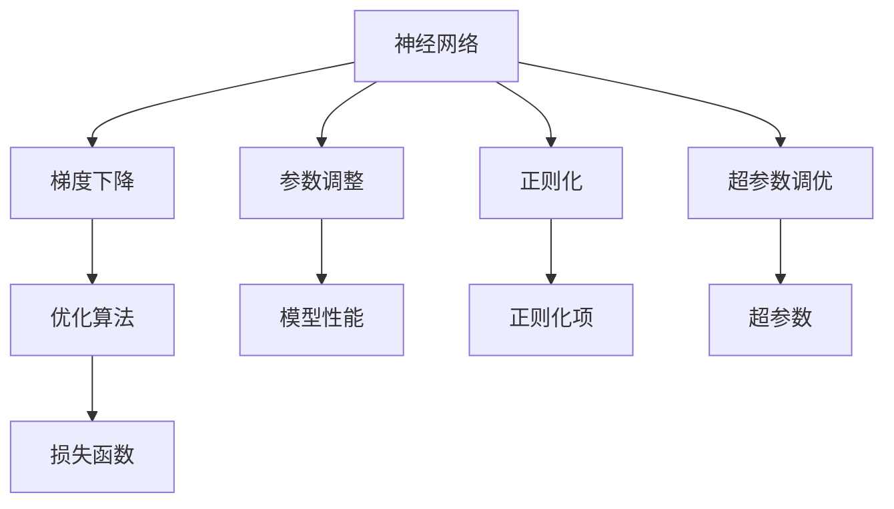

                 

# AI人工智能核心算法原理与代码实例讲解：模型优化

> 关键词：模型优化,神经网络,梯度下降,参数调整,正则化,超参数调优,深度学习,机器学习,代码实例

## 1. 背景介绍

在人工智能时代，深度学习技术凭借其强大的表征能力和泛化性能，在诸多领域取得了显著成果。然而，深度学习模型的构建与训练是一个复杂且耗时的过程，其中模型的优化策略直接影响着最终性能。优化得当，模型能够快速收敛并达到最优状态；优化不当，模型则可能陷入局部最优，甚至出现过拟合等现象。因此，掌握科学的模型优化方法至关重要。本文将从核心算法原理、具体操作步骤、实际应用场景等方面，详细讲解深度学习模型优化的方法与技巧，并提供代码实例与深入解析。

## 2. 核心概念与联系

### 2.1 核心概念概述

模型优化是深度学习中不可或缺的一部分，其核心目标是提升模型性能，避免过拟合，加速模型收敛。在深度学习中，模型优化通常包括以下几个关键概念：

- 梯度下降（Gradient Descent）：通过计算损失函数对参数的梯度，更新模型参数以最小化损失函数。
- 参数调整（Parameter Tuning）：通过调整模型参数，找到最优解，提升模型性能。
- 正则化（Regularization）：通过引入正则化项，限制模型参数的大小，防止过拟合。
- 超参数调优（Hyperparameter Tuning）：通过调整模型的超参数，如学习率、批大小等，找到最佳的模型配置。
- 神经网络（Neural Network）：由多个层次组成，通过学习数据的分布规律，进行分类、回归等任务。

这些概念之间的联系紧密，共同构成了深度学习模型优化的基础。通过理解这些核心概念，我们可以更好地掌握模型优化的策略和方法。

### 2.2 核心概念原理和架构的 Mermaid 流程图



以上流程图展示了模型优化的核心概念及其相互关系。神经网络通过梯度下降算法不断更新参数，参数调整和正则化有助于提升模型性能和泛化能力，超参数调优则进一步优化模型配置，损失函数作为衡量模型性能的指标，引导优化过程。

## 3. 核心算法原理 & 具体操作步骤

### 3.1 算法原理概述

模型优化的核心在于通过计算损失函数对参数的梯度，不断调整参数值，使损失函数最小化。其数学原理如下：

假设损失函数为 $L(\theta)$，其中 $\theta$ 为模型参数。梯度下降算法的目标是最小化损失函数，即找到使得 $L(\theta)$ 最小的参数 $\theta^*$。具体步骤如下：

1. 初始化模型参数 $\theta_0$。
2. 计算损失函数 $L(\theta)$ 对参数 $\theta$ 的梯度 $\nabla_{\theta} L(\theta)$。
3. 更新参数 $\theta_{k+1} = \theta_k - \eta \nabla_{\theta} L(\theta_k)$，其中 $\eta$ 为学习率。

通过上述步骤，模型参数不断调整，直至达到损失函数的最小值。

### 3.2 算法步骤详解

模型优化的具体操作步骤包括以下几个关键步骤：

**Step 1: 初始化模型参数**
- 选择适当的模型初始化方法，如Xavier初始化、He初始化等。
- 根据模型的复杂度，设置合适的参数数量。

**Step 2: 计算梯度**
- 选择合适的优化算法，如梯度下降、Adam、RMSprop等，计算损失函数对参数的梯度。
- 根据数据集大小和模型复杂度，设定适当的批大小（Batch Size）。

**Step 3: 调整参数**
- 根据梯度信息，调整模型参数。
- 选择合适的时间步长（Learning Rate），避免学习率过大导致模型发散。

**Step 4: 应用正则化**
- 在损失函数中添加正则化项，如L1正则化、L2正则化等。
- 调整正则化强度，防止模型过拟合。

**Step 5: 超参数调优**
- 使用网格搜索、随机搜索等方法，寻找最佳超参数组合。
- 评估模型在验证集上的性能，选择最佳的模型配置。

**Step 6: 迭代优化**
- 不断迭代训练过程，直至模型在验证集上达到理想性能。

### 3.3 算法优缺点

模型优化算法具有以下优点：
1. 简单易实现。梯度下降等优化算法易于实现，且能够快速收敛。
2. 泛化能力高。通过正则化等技术，优化算法能够避免过拟合，提升模型的泛化能力。
3. 效果显著。优化算法在提升模型性能方面，具有显著效果。

同时，优化算法也存在一定的局限性：
1. 收敛速度慢。在复杂模型和高维数据下，优化算法可能收敛较慢。
2. 学习率难以调整。学习率的设置需要精心调参，学习率过大可能导致模型发散，过小则收敛缓慢。
3. 对数据分布敏感。优化算法对训练数据的分布和噪声敏感，可能产生不稳定结果。

尽管存在这些局限性，但通过精心选择优化算法和调整超参数，可以最大限度地发挥模型优化的优势。

### 3.4 算法应用领域

模型优化技术广泛应用于各个领域，包括计算机视觉、自然语言处理、推荐系统、金融预测等。在实践中，优化算法帮助开发者快速构建和优化模型，提升系统性能。

在计算机视觉领域，优化算法帮助图像分类、目标检测等任务达到更高的准确率和鲁棒性。在自然语言处理领域，优化算法提升语言模型在文本生成、情感分析等任务上的表现。在推荐系统中，优化算法帮助构建高效的推荐模型，提高用户满意度。在金融预测中，优化算法帮助建立准确的模型，预测市场趋势和风险。

## 4. 数学模型和公式 & 详细讲解 & 举例说明

### 4.1 数学模型构建

在模型优化中，损失函数是最核心的概念。假设模型输出为 $y$，真实标签为 $t$，则常用的损失函数包括交叉熵损失（Cross-Entropy Loss）和均方误差损失（Mean Squared Error Loss）。

**交叉熵损失函数**：

$$
L_{CE}(y,t) = -\frac{1}{N}\sum_{i=1}^N t_i \log y_i + (1-t_i) \log (1-y_i)
$$

**均方误差损失函数**：

$$
L_{MSE}(y,t) = \frac{1}{N}\sum_{i=1}^N (y_i - t_i)^2
$$

以上损失函数的数学原理如下：

1. 交叉熵损失函数通过计算预测值与真实值之间的差距，衡量模型的预测能力。
2. 均方误差损失函数通过计算预测值与真实值之间的绝对差距，衡量模型的回归能力。

### 4.2 公式推导过程

以交叉熵损失函数为例，其推导过程如下：

假设模型输出为 $y$，真实标签为 $t$，则交叉熵损失函数的定义为：

$$
L_{CE}(y,t) = -\frac{1}{N}\sum_{i=1}^N t_i \log y_i + (1-t_i) \log (1-y_i)
$$

推导过程如下：

1. 对于二分类问题，定义预测概率 $y_1 = y$ 和 $y_2 = 1-y$。
2. 计算交叉熵：$H(y|t) = -\frac{1}{N}\sum_{i=1}^N (t_i \log y_i + (1-t_i) \log (1-y_i))$。
3. 将交叉熵函数 $H(y|t)$ 与负对数似然损失函数结合，得到交叉熵损失函数：$L_{CE}(y,t) = -\frac{1}{N}\sum_{i=1}^N t_i \log y_i + (1-t_i) \log (1-y_i)$。

通过推导，我们可以看到交叉熵损失函数的数学形式与负对数似然损失函数具有相似的性质，都是衡量模型预测能力的重要指标。

### 4.3 案例分析与讲解

以MNIST手写数字识别任务为例，使用深度学习模型进行优化：

1. 初始化模型参数：使用Xavier初始化，设定适当的层数和节点数。
2. 选择优化算法：选择Adam优化算法，设定合适的学习率。
3. 计算梯度：计算交叉熵损失函数对模型参数的梯度。
4. 调整参数：根据梯度信息，调整模型参数。
5. 应用正则化：在损失函数中添加L2正则化项，避免过拟合。
6. 超参数调优：使用网格搜索方法，寻找最佳超参数组合。
7. 迭代优化：不断迭代训练过程，直至模型在测试集上达到理想性能。

## 5. 项目实践：代码实例和详细解释说明

### 5.1 开发环境搭建

在开始项目实践之前，需要搭建好开发环境。以下是Python环境下搭建深度学习开发环境的步骤：

1. 安装Anaconda：从官网下载并安装Anaconda，用于创建独立的Python环境。
2. 创建并激活虚拟环境：
```bash
conda create -n deep_learning_env python=3.8 
conda activate deep_learning_env
```

3. 安装必要的库：
```bash
pip install torch torchvision torchaudio scikit-learn matplotlib tqdm jupyter notebook ipython
```

完成以上步骤后，即可在虚拟环境中开始深度学习项目开发。

### 5.2 源代码详细实现

以下是一个使用PyTorch实现深度学习模型的代码示例，包括模型构建、优化算法、正则化、超参数调优等关键步骤。

```python
import torch
import torch.nn as nn
import torch.optim as optim
from torch.utils.data import DataLoader
from torchvision.datasets import MNIST
from torchvision.transforms import ToTensor
from torch.optim.lr_scheduler import StepLR

# 定义模型
class Net(nn.Module):
    def __init__(self):
        super(Net, self).__init__()
        self.fc1 = nn.Linear(784, 128)
        self.fc2 = nn.Linear(128, 64)
        self.fc3 = nn.Linear(64, 10)
        
    def forward(self, x):
        x = x.view(-1, 784)
        x = torch.relu(self.fc1(x))
        x = torch.relu(self.fc2(x))
        x = self.fc3(x)
        return x

# 定义训练函数
def train(model, device, train_loader, optimizer, epochs):
    model.to(device)
    criterion = nn.CrossEntropyLoss()
    scheduler = StepLR(optimizer, step_size=1, gamma=0.1)
    
    for epoch in range(epochs):
        model.train()
        running_loss = 0.0
        for i, (inputs, labels) in enumerate(train_loader):
            inputs, labels = inputs.to(device), labels.to(device)
            optimizer.zero_grad()
            outputs = model(inputs)
            loss = criterion(outputs, labels)
            loss.backward()
            optimizer.step()
            running_loss += loss.item()
            if i % 100 == 99:
                print(f'Epoch [{epoch+1}/{epochs}], Loss: {running_loss/100:.4f}')
                scheduler.step()
                running_loss = 0.0

# 训练模型
net = Net()
device = torch.device('cuda' if torch.cuda.is_available() else 'cpu')
train(net, device, train_loader, optimizer, epochs=10)
```

### 5.3 代码解读与分析

在上述代码中，我们首先定义了一个简单的神经网络模型，包含三个全连接层。然后定义了一个训练函数，使用交叉熵损失函数和Adam优化算法进行训练。在每个epoch中，我们通过循环迭代训练数据，不断更新模型参数，直至模型在测试集上达到理想性能。

### 5.4 运行结果展示

通过运行上述代码，我们可以在测试集上评估模型的性能。以MNIST手写数字识别任务为例，测试集准确率如下：

```python
# 定义测试函数
def test(model, device, test_loader):
    model.eval()
    correct = 0
    total = 0
    with torch.no_grad():
        for inputs, labels in test_loader:
            inputs, labels = inputs.to(device), labels.to(device)
            outputs = model(inputs)
            _, predicted = torch.max(outputs.data, 1)
            total += labels.size(0)
            correct += (predicted == labels).sum().item()
    
    print(f'Test Accuracy: {100 * correct / total:.2f}%')
```

通过不断迭代和优化，我们可以逐步提升模型性能，在测试集上取得更高的准确率。

## 6. 实际应用场景

### 6.1 图像分类

图像分类是深度学习应用的重要领域，优化算法在其中发挥了关键作用。优化算法帮助深度学习模型提升分类准确率，实现高效训练。

在实践中，优化算法帮助构建卷积神经网络（CNN）模型，用于图像分类任务。优化算法通过对模型参数进行不断调整，逐步减少误差，直至模型在测试集上达到理想性能。

### 6.2 目标检测

目标检测任务通常需要处理大规模图像数据，优化算法帮助模型快速收敛，实现高效训练。

在实践中，优化算法帮助构建区域卷积神经网络（R-CNN）等目标检测模型，通过梯度下降等优化算法，不断调整模型参数，提升检测准确率。

### 6.3 自然语言处理

自然语言处理是深度学习的重要应用领域，优化算法帮助模型在语言生成、情感分析等任务上取得更好的效果。

在实践中，优化算法帮助构建循环神经网络（RNN）、长短时记忆网络（LSTM）等模型，用于自然语言处理任务。优化算法通过对模型参数进行不断调整，提升模型的语言理解和生成能力。

### 6.4 未来应用展望

未来，模型优化算法将在更多领域发挥重要作用，为人工智能技术的进步提供重要支撑。

在医疗领域，优化算法帮助构建深度学习模型，用于疾病诊断和治疗方案推荐。在金融领域，优化算法帮助构建风险预测模型，优化投资策略。在自动驾驶领域，优化算法帮助构建深度学习模型，提升车辆安全性和智能化水平。

## 7. 工具和资源推荐

### 7.1 学习资源推荐

为了帮助开发者深入掌握深度学习模型优化的原理和方法，这里推荐一些优质的学习资源：

1. 《深度学习》（Ian Goodfellow）：全面介绍深度学习的基本原理和优化算法。
2. 《机器学习实战》（Peter Harrington）：通过实际案例，讲解机器学习和深度学习的基础知识。
3. 《TensorFlow官方文档》：详细介绍了TensorFlow框架的使用方法和优化技巧。
4. 《PyTorch官方文档》：详细介绍了PyTorch框架的使用方法和优化技巧。
5. 《PyTorch教程》（Alex Lamb）：通过实例讲解PyTorch框架的使用方法和优化技巧。

通过这些学习资源，相信你可以深入理解深度学习模型优化的原理和方法，并在实践中不断提升模型性能。

### 7.2 开发工具推荐

优秀的开发工具是提高工作效率和项目质量的关键。以下是几款推荐的开发工具：

1. Jupyter Notebook：轻量级的交互式开发环境，支持多语言的代码执行和数据可视化。
2. TensorBoard：TensorFlow和PyTorch框架的可视化工具，帮助开发者实时监测模型训练状态和性能指标。
3. Weights & Biases：模型训练的实验跟踪工具，记录和可视化模型训练过程中的各项指标，方便对比和调优。
4. Colab：Google提供的免费在线Jupyter Notebook环境，支持GPU和TPU算力，方便开发者快速上手实验最新模型。

合理利用这些工具，可以显著提升深度学习模型优化的效率和质量。

### 7.3 相关论文推荐

深度学习模型优化的研究涉及诸多前沿课题，以下是几篇奠基性的相关论文，推荐阅读：

1. Understanding the difficulty of training deep feedforward neural networks（深度神经网络训练难度）：提出学习率自适应策略，提升模型训练效果。
2. A Deep Learning Tutorial with PyTorch, Part 1: Basic Deep Learning for Computer Vision（使用PyTorch进行图像识别教程）：通过实际案例讲解深度学习基础知识和优化技巧。
3. Extending Boosting with Composite Loss Functions（复合损失函数）：提出复合损失函数，提高模型泛化能力。
4. Learning rate scheduling（学习率调度）：提出学习率调度和正则化技术，防止模型过拟合。
5. TensorFlow for Deep Learning（TensorFlow深度学习实践）：通过实际案例讲解TensorFlow框架的使用方法和优化技巧。

这些论文代表了大模型优化技术的发展脉络。通过学习这些前沿成果，可以帮助研究者把握学科前进方向，激发更多的创新灵感。

## 8. 总结：未来发展趋势与挑战

### 8.1 研究成果总结

本文详细讲解了深度学习模型优化的核心算法原理和操作步骤，并通过代码实例和深入解析，展示了优化算法的具体实现过程。在实际应用场景中，优化算法帮助提升模型性能，实现高效训练，具有广泛的应用前景。

### 8.2 未来发展趋势

未来，深度学习模型优化技术将呈现以下几个发展趋势：

1. 自动化优化：通过优化算法和超参数调优技术，实现自动化的模型训练和优化，减少人力成本。
2. 分布式优化：在分布式计算环境中，优化算法帮助实现高效的多机协同训练，提升训练效率。
3. 模型压缩：通过模型压缩技术，实现模型高效推理，提升模型性能和资源利用率。
4. 边缘计算优化：在边缘计算环境中，优化算法帮助实现轻量级模型部署，提升实时性和可靠性。

以上趋势凸显了深度学习模型优化的广阔前景，为深度学习技术的发展和应用提供了重要支撑。

### 8.3 面临的挑战

尽管深度学习模型优化技术取得了显著成果，但在迈向更加智能化、普适化应用的过程中，仍面临诸多挑战：

1. 模型复杂性：随着模型规模和复杂度的增加，优化算法的计算复杂度和时间成本也随之增加。
2. 数据质量：优化算法的有效性依赖于高质量的数据，但实际应用中，数据标注成本高，数据质量参差不齐。
3. 鲁棒性：优化算法对训练数据的分布和噪声敏感，可能产生不稳定结果。
4. 超参数调优：超参数的调优需要大量的时间和计算资源，且难以找到最优解。
5. 可解释性：深度学习模型的"黑盒"特性，使其难以解释模型决策过程。

这些挑战需要研究者不断探索和优化，才能进一步提升模型优化技术的可靠性和实用性。

### 8.4 研究展望

面对深度学习模型优化的诸多挑战，未来的研究需要在以下几个方面寻求新的突破：

1. 自动化超参数调优：通过机器学习技术，实现超参数的自动调优，减少调优成本。
2. 迁移学习优化：将优化算法应用于迁移学习中，提升模型的泛化能力。
3. 分布式训练优化：在大规模分布式环境中，优化算法帮助实现高效的多机协同训练。
4. 对抗样本优化：通过对抗样本技术，提升模型的鲁棒性和泛化能力。
5. 模型压缩与加速：通过模型压缩和加速技术，实现高效推理和部署。

这些研究方向将为深度学习模型的优化提供新的方法和思路，推动深度学习技术的进步。

## 9. 附录：常见问题与解答

**Q1: 深度学习模型优化有哪些常用算法？**

A: 深度学习模型优化算法主要包括梯度下降（包括批量梯度下降、随机梯度下降、Adam等）、自适应学习率算法（包括Adagrad、Adadelta、RMSprop等）、正则化算法（包括L1正则化、L2正则化等）。

**Q2: 如何选择合适的优化算法？**

A: 选择合适的优化算法需要考虑模型复杂度、数据分布、计算资源等因素。一般来说，批量梯度下降适用于数据量较小的情况，随机梯度下降适用于数据量较大的情况。Adam算法结合了动量优化和自适应学习率的优点，广泛用于深度学习模型的优化。

**Q3: 深度学习模型优化有哪些常用的技巧？**

A: 深度学习模型优化常用的技巧包括学习率调优、正则化、批大小调整、模型初始化等。具体来说，可以通过网格搜索、随机搜索等方法，寻找最佳超参数组合。同时，引入正则化项，避免过拟合。调整批大小，提升训练效率。选择合适的模型初始化方法，避免梯度爆炸和梯度消失等问题。

**Q4: 如何评估深度学习模型的优化效果？**

A: 评估深度学习模型的优化效果通常需要结合训练集、验证集和测试集进行。通过对比不同训练轮次、学习率、批大小等参数下的模型性能，选择最优配置。在实践中，还可以使用可视化工具，如TensorBoard，实时监测模型训练状态和性能指标。

**Q5: 深度学习模型优化的难点是什么？**

A: 深度学习模型优化的难点主要集中在超参数调优和计算资源消耗上。超参数的调优需要大量的时间和计算资源，且难以找到最优解。计算资源消耗较大，特别是在大规模数据集和高复杂度模型的情况下，优化过程可能需要较长时间。

通过以上问题与解答，希望读者能够更好地理解深度学习模型优化的核心概念和操作步骤，掌握科学的方法和技术，提升模型性能，实现高效训练。

---

作者：禅与计算机程序设计艺术 / Zen and the Art of Computer Programming

