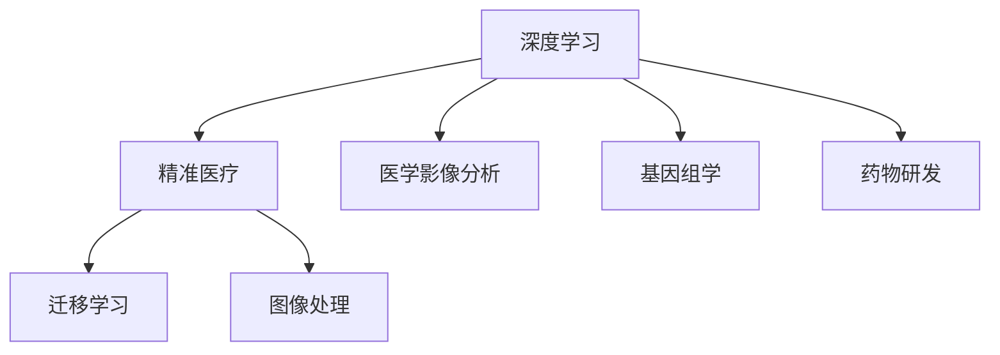

                 

# AI人工智能深度学习算法：在精准医疗中的应用

> 关键词：深度学习, 精准医疗, 人工智能, 深度神经网络, 医学影像, 药物研发, 基因组学

## 1. 背景介绍

### 1.1 问题由来
随着人工智能技术的飞速发展，深度学习算法在医疗领域得到了广泛应用。尤其在精准医疗领域，深度学习被用于医学影像诊断、基因组学分析、药物研发等方面，取得了显著成果。然而，传统深度学习模型面临数据样本少、特征提取困难等问题，其对医疗数据的处理能力仍有待提升。本文将深入探讨深度学习算法在精准医疗中的具体应用，提供具有前瞻性的思考和见解。

### 1.2 问题核心关键点
深度学习算法在精准医疗中的应用，核心关键点在于解决数据稀缺性、模型泛化能力提升、特征提取能力增强等问题。通过优化深度学习模型架构，利用迁移学习等技术，可以在医疗领域实现高效、准确的模型训练和推理。

## 2. 核心概念与联系

### 2.1 核心概念概述

为更好地理解深度学习在精准医疗中的应用，本节将介绍几个密切相关的核心概念：

- 深度学习(Deep Learning)：指通过多层神经网络实现复杂数据处理的算法。深度学习在图像、语音、自然语言处理等领域展现了强大的能力。

- 精准医疗(Precision Medicine)：以个体化医疗为基础，结合基因组学、蛋白质组学、生物信息学等技术手段，实现疾病早期诊断、治疗精准化。

- 医学影像分析：通过深度学习算法对医学影像进行自动诊断和分析，提升诊断准确性和效率。

- 基因组学(Genomics)：研究生物基因组序列及其功能，帮助识别疾病易感基因、开发靶向药物等。

- 药物研发(Drug Discovery)：结合深度学习技术，加速新药的发现和开发，提高研发效率。

- 迁移学习(Transfer Learning)：指在特定任务上对已有模型进行微调，提高模型泛化能力。

- 迁移学习的医疗应用：指利用预训练模型，在特定医疗任务上进行微调，实现高效医疗模型构建。

- 图像处理：深度学习在医学影像处理中的应用，如分割、检测、分类等。

这些核心概念之间的逻辑关系可以通过以下Mermaid流程图来展示：



这个流程图展示了大语言模型的核心概念及其之间的关系：

1. 深度学习通过多层神经网络实现复杂数据处理。
2. 精准医疗结合多个学科技术，实现疾病早期诊断和精准治疗。
3. 医学影像分析使用深度学习对医学影像进行自动分析。
4. 基因组学研究生物基因组序列及其功能。
5. 药物研发通过深度学习加速新药发现和开发。
6. 迁移学习通过在特定任务上进行微调，提升模型泛化能力。
7. 图像处理利用深度学习算法进行医学影像分割、检测、分类等。

这些核心概念共同构成了深度学习在精准医疗的应用框架，使得深度学习在医疗领域的各项任务上均展现出了巨大的潜力。

## 3. 核心算法原理 & 具体操作步骤
### 3.1 算法原理概述

深度学习在精准医疗中的应用，主要是通过构建针对特定任务的深度神经网络模型，利用监督学习或迁移学习进行模型训练，最终用于诊断、预测和治疗决策等。其中，深度神经网络模型通常包括卷积神经网络(CNN)、循环神经网络(RNN)、变分自编码器(VAE)等。

以医学影像分析为例，深度神经网络可以对影像中的像素特征进行学习，提取病灶、器官等关键信息，用于病灶检测、器官分割、疾病分类等任务。在基因组学分析中，深度学习模型可以通过学习基因序列和表达数据，预测基因与疾病之间的关系，用于基因突变分析、个性化药物设计等。

### 3.2 算法步骤详解

深度学习在精准医疗中的应用，主要包括以下几个关键步骤：

**Step 1: 数据准备与预处理**
- 收集医疗数据集，包含医学影像、基因组数据、电子病历等。
- 对数据进行预处理，如数据清洗、标准化、归一化等，确保数据的质量和一致性。

**Step 2: 模型构建与训练**
- 选择合适的深度神经网络架构，如卷积神经网络、循环神经网络、自编码器等。
- 设计损失函数，如交叉熵、均方误差等，评估模型预测与真实标签之间的差异。
- 在训练集上训练模型，通过梯度下降等优化算法调整模型参数。

**Step 3: 模型评估与优化**
- 在验证集上评估模型性能，如准确率、召回率、F1-score等。
- 根据评估结果，调整模型参数、损失函数、训练策略等，提高模型泛化能力。
- 通过迁移学习等方式，优化模型结构和特征提取能力。

**Step 4: 应用部署与迭代**
- 将训练好的模型部署到实际医疗系统中，进行病例诊断、治疗方案推荐等应用。
- 持续收集新病例数据，进行模型迭代和优化，提升模型性能。

以上是深度学习在精准医疗中的应用流程。在实际应用中，还需要针对具体任务和数据特点，对上述步骤进行优化设计，如改进数据增强、选择合适的正则化技术等，以进一步提升模型性能。

### 3.3 算法优缺点

深度学习在精准医疗中的应用，具有以下优点：

1. 高效处理大规模医疗数据。深度学习模型能够在短时间内处理和分析大量医疗数据，提高诊断和治疗效率。
2. 提升模型泛化能力。通过迁移学习等技术，深度学习模型能够利用已有的医疗知识，提升在新数据上的泛化能力。
3. 精准预测疾病发展。深度学习模型能够从基因组学数据中学习疾病发展规律，预测疾病进展和风险。
4. 加速药物研发进程。深度学习模型能够快速识别药物分子结构和生物活性的关系，加速新药开发。

同时，该方法也存在一些局限性：

1. 数据样本少。医疗数据稀缺，特别是在一些罕见疾病上，难以获取足够的数据样本。
2. 模型解释性不足。深度学习模型通常被视为"黑盒"系统，难以解释其内部决策逻辑。
3. 对标注数据依赖高。深度学习模型的训练需要大量标注数据，标注成本较高。
4. 鲁棒性较差。医疗数据具有高度复杂性和多样性，深度学习模型容易过拟合或泛化能力不足。
5. 模型构建复杂。深度神经网络模型结构复杂，训练调试成本较高。

尽管存在这些局限性，但深度学习在精准医疗中的前景仍然广阔。未来相关研究的重点在于如何进一步提升模型的泛化能力和解释性，同时优化模型构建和训练流程，降低对数据样本的依赖。

### 3.4 算法应用领域

深度学习在精准医疗中的应用，已经覆盖了以下几个主要领域：

- 医学影像分析：深度学习算法在医学影像分析中展现出了强大的能力，用于病灶检测、器官分割、疾病分类等任务。
- 基因组学分析：深度学习模型通过学习基因序列和表达数据，用于基因突变分析、个性化药物设计等。
- 药物研发：深度学习算法被用于新药发现和药物分子结构预测，加速药物研发进程。
- 电子病历处理：深度学习模型通过自然语言处理技术，从电子病历中提取关键信息，用于疾病预测和治疗方案推荐。
- 个性化医疗：深度学习算法结合基因组数据和临床信息，实现个性化治疗方案的设计和优化。

除了上述这些领域外，深度学习还将在更多的精准医疗应用中得到创新性地应用，如智慧医疗平台、远程医疗诊断、智能辅助诊疗等，为医疗服务的智能化和精准化提供新的技术手段。

## 4. 数学模型和公式 & 详细讲解  
### 4.1 数学模型构建

本节将使用数学语言对深度学习在精准医疗中的应用进行更加严格的刻画。

记深度神经网络模型为 $M_{\theta}(x)$，其中 $x$ 为输入数据，$\theta$ 为模型参数。假设深度神经网络模型 $M_{\theta}$ 在训练集 $\mathcal{D} = \{(x_i, y_i)\}_{i=1}^N$ 上的损失函数为 $\ell(M_{\theta}(x), y_i)$，则在训练集上的经验风险为：

$$
\mathcal{L}(\theta) = \frac{1}{N} \sum_{i=1}^N \ell(M_{\theta}(x_i), y_i)
$$

深度学习模型的训练目标是最小化经验风险，即找到最优参数：

$$
\theta^* = \mathop{\arg\min}_{\theta} \mathcal{L}(\theta)
$$

在实践中，我们通常使用基于梯度的优化算法（如Adam、SGD等）来近似求解上述最优化问题。设 $\eta$ 为学习率，$\lambda$ 为正则化系数，则参数的更新公式为：

$$
\theta \leftarrow \theta - \eta \nabla_{\theta}\mathcal{L}(\theta) - \eta\lambda\theta
$$

其中 $\nabla_{\theta}\mathcal{L}(\theta)$ 为损失函数对参数 $\theta$ 的梯度，可通过反向传播算法高效计算。

### 4.2 公式推导过程

以下我们以医学影像分类任务为例，推导深度学习模型的损失函数及其梯度计算公式。

假设模型 $M_{\theta}$ 在输入 $x$ 上的输出为 $\hat{y}=M_{\theta}(x) \in [0,1]$，表示样本属于正类的概率。真实标签 $y \in \{0,1\}$。则二分类交叉熵损失函数定义为：

$$
\ell(M_{\theta}(x),y) = -[y\log \hat{y} + (1-y)\log (1-\hat{y})]
$$

将其代入经验风险公式，得：

$$
\mathcal{L}(\theta) = -\frac{1}{N}\sum_{i=1}^N [y_i\log M_{\theta}(x_i)+(1-y_i)\log(1-M_{\theta}(x_i))]
$$

根据链式法则，损失函数对参数 $\theta_k$ 的梯度为：

$$
\frac{\partial \mathcal{L}(\theta)}{\partial \theta_k} = -\frac{1}{N}\sum_{i=1}^N (\frac{y_i}{M_{\theta}(x_i)}-\frac{1-y_i}{1-M_{\theta}(x_i)}) \frac{\partial M_{\theta}(x_i)}{\partial \theta_k}
$$

其中 $\frac{\partial M_{\theta}(x_i)}{\partial \theta_k}$ 可进一步递归展开，利用自动微分技术完成计算。

在得到损失函数的梯度后，即可带入参数更新公式，完成模型的迭代优化。重复上述过程直至收敛，最终得到适应特定医疗任务的最优模型参数 $\theta^*$。

## 5. 项目实践：代码实例和详细解释说明
### 5.1 开发环境搭建

在进行深度学习项目实践前，我们需要准备好开发环境。以下是使用Python进行PyTorch开发的环境配置流程：

1. 安装Anaconda：从官网下载并安装Anaconda，用于创建独立的Python环境。

2. 创建并激活虚拟环境：
```bash
conda create -n deep-learning-env python=3.8 
conda activate deep-learning-env
```

3. 安装PyTorch：根据CUDA版本，从官网获取对应的安装命令。例如：
```bash
conda install pytorch torchvision torchaudio cudatoolkit=11.1 -c pytorch -c conda-forge
```

4. 安装各类工具包：
```bash
pip install numpy pandas scikit-learn matplotlib tqdm jupyter notebook ipython
```

完成上述步骤后，即可在`deep-learning-env`环境中开始深度学习项目的开发。

### 5.2 源代码详细实现

下面我们以医学影像分类任务为例，给出使用PyTorch进行深度学习模型训练的PyTorch代码实现。

首先，定义模型和数据集：

```python
import torch
from torchvision import datasets, transforms
from torch.utils.data import DataLoader
import torch.nn as nn
import torch.optim as optim

class ConvNet(nn.Module):
    def __init__(self):
        super(ConvNet, self).__init__()
        self.conv1 = nn.Conv2d(1, 32, 3, 1)
        self.conv2 = nn.Conv2d(32, 64, 3, 1)
        self.dropout1 = nn.Dropout2d(0.25)
        self.dropout2 = nn.Dropout2d(0.5)
        self.fc1 = nn.Linear(9216, 128)
        self.fc2 = nn.Linear(128, 2)

    def forward(self, x):
        x = self.conv1(x)
        x = nn.functional.relu(x)
        x = self.conv2(x)
        x = nn.functional.relu(x)
        x = nn.functional.max_pool2d(x, 2)
        x = self.dropout1(x)
        x = torch.flatten(x, 1)
        x = self.fc1(x)
        x = nn.functional.relu(x)
        x = self.dropout2(x)
        x = self.fc2(x)
        output = nn.functional.log_softmax(x, dim=1)
        return output

# 数据集加载与预处理
transform = transforms.Compose([
    transforms.ToTensor(),
    transforms.Normalize((0.5,), (0.5,))
])

train_dataset = datasets.MNIST(root='data', train=True, transform=transform, download=True)
test_dataset = datasets.MNIST(root='data', train=False, transform=transform, download=True)

train_loader = DataLoader(train_dataset, batch_size=64, shuffle=True)
test_loader = DataLoader(test_dataset, batch_size=64, shuffle=False)
```

然后，定义模型训练函数：

```python
device = torch.device('cuda' if torch.cuda.is_available() else 'cpu')
model = ConvNet().to(device)

criterion = nn.CrossEntropyLoss()
optimizer = optim.Adam(model.parameters(), lr=0.001)

def train(model, device, train_loader, optimizer, epoch):
    model.train()
    for batch_idx, (data, target) in enumerate(train_loader):
        data, target = data.to(device), target.to(device)
        optimizer.zero_grad()
        output = model(data)
        loss = criterion(output, target)
        loss.backward()
        optimizer.step()
```

最后，启动训练流程并在测试集上评估：

```python
num_epochs = 10

for epoch in range(num_epochs):
    train(model, device, train_loader, optimizer, epoch)
    test_loss, correct = 0, 0
    with torch.no_grad():
        for data, target in test_loader:
            data, target = data.to(device), target.to(device)
            output = model(data)
            test_loss += criterion(output, target).item()
            pred = output.argmax(dim=1, keepdim=True)
            correct += pred.eq(target.view_as(pred)).sum().item()
    test_loss /= len(test_loader.dataset)
    print(f'Epoch {epoch+1}, Test Loss: {test_loss:.4f}, Accuracy: {100 * correct / len(test_loader.dataset):.2f}%')
```

以上就是使用PyTorch进行医学影像分类任务深度学习模型训练的完整代码实现。可以看到，得益于PyTorch的强大封装，我们可以用相对简洁的代码完成深度学习模型的训练和评估。

### 5.3 代码解读与分析

让我们再详细解读一下关键代码的实现细节：

**ConvNet类**：
- `__init__`方法：初始化卷积神经网络模型结构。
- `forward`方法：定义模型前向传播过程，使用卷积、激活、池化、全连接等层进行特征提取和分类。

**train函数**：
- 在指定设备（如GPU）上运行模型。
- 对于每个数据批次，前向传播计算模型输出，使用交叉熵损失函数计算损失，反向传播更新模型参数。
- 使用Adam优化器进行模型参数更新。

**测试流程**：
- 在测试集上评估模型性能，计算测试集损失和准确率。
- 使用模型的预测结果与真实标签进行对比，计算准确率。
- 使用print函数输出测试集上的损失和准确率。

通过上述代码，我们可以看到，利用PyTorch可以高效地实现深度学习模型的训练和评估，极大地简化了深度学习项目的开发流程。

## 6. 实际应用场景
### 6.1 智能医疗系统

深度学习在智能医疗系统中的应用，可以大幅提升医疗服务的智能化和精准化。通过构建深度神经网络模型，智能医疗系统可以实现自动诊断、治疗推荐、风险评估等功能。

具体而言，智能医疗系统可以通过深度学习算法对医学影像进行自动分析，识别病灶、器官等关键信息，用于病灶检测、器官分割、疾病分类等任务。同时，结合电子病历和基因组学数据，智能医疗系统可以进行疾病预测、个性化治疗方案推荐等。

### 6.2 药物研发

深度学习在药物研发中的应用，可以加速新药的发现和开发，提高研发效率。通过构建深度神经网络模型，药物研发系统可以用于药物分子结构预测、化合物活性预测、药物靶点识别等任务。

具体而言，药物研发系统可以通过学习药物分子结构和生物活性的关系，预测药物分子在不同靶点上的活性，筛选高活性化合物，进行药物分子设计。同时，结合基因组学数据，药物研发系统可以进行靶点预测、药物副作用评估等。

### 6.3 基因组学分析

深度学习在基因组学中的应用，可以挖掘基因序列和表达数据中的信息，帮助识别疾病易感基因、开发靶向药物等。通过构建深度神经网络模型，基因组学分析系统可以用于基因突变分析、个性化药物设计等任务。

具体而言，基因组学分析系统可以通过学习基因序列和表达数据，预测基因与疾病之间的关系，用于基因突变分析、个性化药物设计等。同时，结合临床数据，基因组学分析系统可以进行疾病风险评估、个性化治疗方案设计等。

### 6.4 未来应用展望

随着深度学习技术的不断进步，其在精准医疗中的应用前景将更加广阔。未来，深度学习将有望在以下几个方面取得新的突破：

1. 多模态融合：将不同模态的数据（如医学影像、基因组学数据、电子病历等）进行融合，提高深度学习模型的诊断和治疗能力。
2. 个性化医疗：结合基因组数据和临床数据，实现个性化的治疗方案设计和优化。
3. 智能诊疗助手：构建智能诊疗助手，利用深度学习技术辅助医生进行疾病诊断和治疗决策。
4. 实时监测：利用深度学习技术进行实时健康监测，及时发现并预警潜在疾病。
5. 药物设计：通过深度学习技术进行药物分子设计和筛选，加速新药研发进程。

这些方向的发展，将进一步提升深度学习在精准医疗中的应用效果，为医疗服务的智能化和精准化提供新的技术手段。

## 7. 工具和资源推荐
### 7.1 学习资源推荐

为了帮助开发者系统掌握深度学习在精准医疗中的应用，这里推荐一些优质的学习资源：

1. 《深度学习》一书：Ian Goodfellow等人编写的经典教材，全面介绍了深度学习的基本概念和应用。
2. CS231n《卷积神经网络和视觉识别》课程：斯坦福大学开设的深度学习课程，涵盖了深度神经网络的基础和应用。
3. Fast.ai：提供深度学习框架PyTorch的教程和实战项目，适合初学者快速上手。
4. Kaggle竞赛：参加深度学习在医学影像、基因组学、药物研发等领域的竞赛，提升实战能力。
5. GitHub代码库：深度学习在精准医疗中的实际项目和代码，提供丰富的参考资源。

通过对这些资源的学习实践，相信你一定能够快速掌握深度学习在精准医疗中的应用，并用于解决实际的医疗问题。
###  7.2 开发工具推荐

高效的开发离不开优秀的工具支持。以下是几款用于深度学习项目开发的常用工具：

1. PyTorch：基于Python的开源深度学习框架，灵活动态的计算图，适合快速迭代研究。
2. TensorFlow：由Google主导开发的开源深度学习框架，生产部署方便，适合大规模工程应用。
3. Weights & Biases：模型训练的实验跟踪工具，可以记录和可视化模型训练过程中的各项指标，方便对比和调优。
4. TensorBoard：TensorFlow配套的可视化工具，可实时监测模型训练状态，并提供丰富的图表呈现方式。
5. Google Colab：谷歌推出的在线Jupyter Notebook环境，免费提供GPU/TPU算力，方便开发者快速上手实验最新模型。

合理利用这些工具，可以显著提升深度学习项目的开发效率，加快创新迭代的步伐。

### 7.3 相关论文推荐

深度学习在精准医疗中的应用研究源于学界的持续研究。以下是几篇奠基性的相关论文，推荐阅读：

1. AlexNet：ImageNet大规模视觉识别挑战赛的冠军算法，展示了深度卷积神经网络的强大能力。
2. ResNet：深入浅出地介绍了深度残差网络的原理和应用，解决了深度网络训练中的梯度消失问题。
3. VGGNet：通过多层次卷积操作提升深度神经网络的特征提取能力，实现了更加精确的图像分类。
4. InceptionNet：提出了Inception模块，结合多尺度卷积和并行计算，提高了深度神经网络的训练效率。
5. GAN：生成对抗网络，通过对抗训练生成高质量的图像数据，应用于医学影像生成和增强。
6. RNN和LSTM：循环神经网络及其变种LSTM，适用于序列数据处理，如自然语言处理和时序数据分析。
7. Attention Mechanism：通过注意力机制提升深度神经网络的特征表示能力，应用于多模态数据融合和语义推理。

这些论文代表了大语言模型微调技术的发展脉络。通过学习这些前沿成果，可以帮助研究者把握学科前进方向，激发更多的创新灵感。

## 8. 总结：未来发展趋势与挑战
### 8.1 总结

本文对深度学习在精准医疗中的应用进行了全面系统的介绍。首先阐述了深度学习在医疗领域的研究背景和应用前景，明确了深度学习在精准医疗中的独特价值。其次，从原理到实践，详细讲解了深度学习模型的构建、训练和评估过程，给出了深度学习模型训练的完整代码实例。同时，本文还广泛探讨了深度学习在医学影像分析、基因组学分析、药物研发等领域的实际应用，展示了深度学习技术在精准医疗中的巨大潜力。

通过本文的系统梳理，可以看到，深度学习在精准医疗中的应用已经取得了显著成果，为医疗服务的智能化和精准化提供了新的技术手段。未来，伴随深度学习技术的不断进步，深度学习在精准医疗中的应用前景将更加广阔。

### 8.2 未来发展趋势

展望未来，深度学习在精准医疗中的应用将呈现以下几个发展趋势：

1. 模型架构创新：未来的深度学习模型将更注重模型架构的创新，如引入自注意力机制、神经网络模块化等，提升模型的特征表示能力和泛化能力。
2. 数据融合与多模态学习：将不同模态的数据进行融合，提高深度学习模型的诊断和治疗能力。
3. 实时监测与个性化医疗：利用深度学习技术进行实时健康监测，及时发现并预警潜在疾病。结合基因组数据和临床数据，实现个性化的治疗方案设计和优化。
4. 智能诊疗助手：构建智能诊疗助手，利用深度学习技术辅助医生进行疾病诊断和治疗决策。
5. 可解释性增强：研究深度学习模型的可解释性，使医生能够理解模型的决策过程，增强模型的可信度和可靠性。
6. 多任务学习：通过多任务学习技术，深度学习模型可以同时处理多个任务，提升模型的实用性和应用范围。

以上趋势凸显了深度学习在精准医疗中的广阔前景。这些方向的探索发展，将进一步提升深度学习在医疗领域的性能和应用范围，为医疗服务的智能化和精准化提供新的技术手段。

### 8.3 面临的挑战

尽管深度学习在精准医疗中的应用取得了显著成果，但在迈向更加智能化、普适化应用的过程中，它仍面临诸多挑战：

1. 数据稀缺性：医疗数据稀缺，特别是罕见疾病的数据更难获取。如何充分利用现有数据，提升模型的泛化能力，是一个亟待解决的问题。
2. 模型鲁棒性不足：医疗数据具有高度复杂性和多样性，深度学习模型容易过拟合或泛化能力不足。如何提高模型的鲁棒性和泛化能力，还需要更多的研究和实践。
3. 模型构建复杂：深度神经网络模型结构复杂，训练调试成本较高。如何简化模型结构，提高训练效率，是未来深度学习模型发展的关键。
4. 模型可解释性不足：深度学习模型通常被视为"黑盒"系统，难以解释其内部决策逻辑。如何增强模型的可解释性，使其能够被医生理解和接受，是未来研究的重要方向。
5. 医疗伦理与隐私保护：深度学习在医疗中的应用，涉及患者的隐私和医疗数据安全。如何确保医疗数据的安全性和隐私保护，是未来研究的重要课题。

正视深度学习在精准医疗中面临的这些挑战，积极应对并寻求突破，将是大语言模型微调技术走向成熟的必由之路。相信随着学界和产业界的共同努力，这些挑战终将一一被克服，深度学习在精准医疗中的应用必将取得更大的突破。

### 8.4 研究展望

面向未来，深度学习在精准医疗中的应用需要在以下几个方面寻求新的突破：

1. 数据高效利用：研究如何在有限的数据条件下，充分利用深度学习模型的泛化能力，提升模型的性能。
2. 模型轻量化：研究如何简化深度学习模型的结构，提高模型的训练和推理效率，适应资源受限的医疗环境。
3. 多任务学习：研究如何将多任务学习技术与深度学习结合，提升模型的应用范围和实用性。
4. 可解释性增强：研究如何增强深度学习模型的可解释性，使其能够被医生理解和接受。
5. 多模态学习：研究如何将不同模态的数据进行融合，提升深度学习模型的诊断和治疗能力。
6. 实时监测与个性化医疗：利用深度学习技术进行实时健康监测，及时发现并预警潜在疾病。结合基因组数据和临床数据，实现个性化的治疗方案设计和优化。

这些研究方向的探索，将引领深度学习在精准医疗中的发展，为医疗服务的智能化和精准化提供新的技术手段。

## 9. 附录：常见问题与解答

**Q1：深度学习在医疗数据稀缺的情况下如何处理？**

A: 深度学习在医疗数据稀缺的情况下，可以通过数据增强、迁移学习、对抗训练等技术手段进行数据扩充和泛化能力提升。同时，也可以利用小样本学习、少样本学习等方法，在少量数据下进行模型训练和微调。

**Q2：深度学习模型在医疗数据中容易出现过拟合，如何解决？**

A: 深度学习模型在医疗数据中容易出现过拟合，可以通过正则化技术（如L2正则、Dropout等）、早停法、数据增强等方法进行缓解。同时，可以通过参数高效微调等技术，减少模型参数量，避免过拟合风险。

**Q3：深度学习模型在医疗数据中如何进行可解释性增强？**

A: 深度学习模型在医疗数据中的可解释性增强可以通过模型可视、特征重要性分析、模型简化等方法进行。同时，也可以利用可解释性工具（如LIME、SHAP等），对模型的决策过程进行可视化，帮助医生理解模型的预测结果。

**Q4：深度学习模型在医疗数据中的多模态融合技术如何进行？**

A: 深度学习模型在医疗数据中的多模态融合可以通过特征提取、特征对齐、特征融合等技术进行。同时，也可以利用深度学习模型中的注意力机制，对不同模态数据进行加权融合，提高模型的诊断和治疗能力。

**Q5：深度学习模型在医疗数据中的实时监测和个性化医疗如何进行？**

A: 深度学习模型在医疗数据中的实时监测和个性化医疗可以通过在线学习、增量学习等技术进行。同时，也可以利用深度学习模型进行实时健康监测，及时发现并预警潜在疾病。结合基因组数据和临床数据，实现个性化的治疗方案设计和优化。

通过这些方法的优化，可以进一步提升深度学习在精准医疗中的应用效果，为医疗服务的智能化和精准化提供新的技术手段。

---

作者：禅与计算机程序设计艺术 / Zen and the Art of Computer Programming

