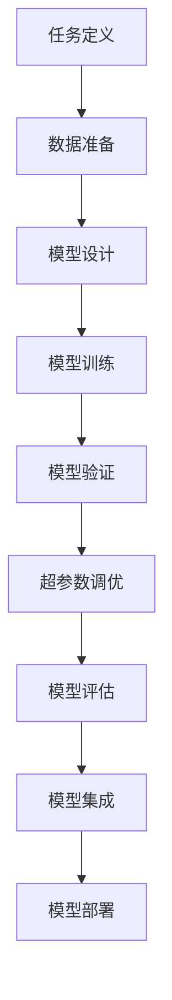

                 

# AI人工智能深度学习算法：设计深度学习任务处理流程

> 关键词：深度学习,算法设计,任务处理,模型优化,自动化,学习曲线,超参数调整,模型评估,模型集成

## 1. 背景介绍

### 1.1 问题由来

在人工智能(AI)领域，深度学习(DL)技术已经成为推动算法进步的重要驱动力。近年来，深度神经网络在图像识别、语音识别、自然语言处理等诸多领域取得了突破性进展。然而，即便在大数据和强大计算能力的支持下，深度学习算法的设计和调优仍是一个复杂且耗时的过程。复杂任务通常需要人类专家团队花数月甚至数年的时间，进行大量实验和调试，才能获得最佳的模型性能。

### 1.2 问题核心关键点

深度学习任务处理的核心在于：
1. **任务定义与目标函数设计**：明确任务需求，设计合适的目标函数。
2. **数据准备与预处理**：对数据进行清洗、归一化、增强等处理，以提高模型的泛化能力。
3. **模型结构与优化算法选择**：选择合适的神经网络架构和优化算法，以提升模型的准确性和效率。
4. **超参数调优**：调整学习率、批大小、网络结构等超参数，以优化模型性能。
5. **模型评估与验证**：设计合理评估指标，使用验证集对模型进行迭代优化。
6. **模型集成与部署**：通过模型集成、超参数调整等技术提升模型性能，并进行系统部署。

### 1.3 问题研究意义

解决深度学习任务处理流程中存在的痛点，可以显著提升模型训练效率，缩短任务开发周期，降低成本，为行业应用提供更有竞争力的解决方案。

具体来说，通过自动化的任务处理流程，AI开发者能够：
1. **减少人工干预**：自动化工具和框架可以替代部分人工工作，减少实验调试时间。
2. **提升模型性能**：自动化调优工具能够找到最优的超参数组合，提升模型准确性。
3. **加速模型部署**：自动化的模型集成与部署流程，可以迅速将模型应用于实际应用。
4. **支持多任务并行**：自动化流程支持并行处理多个任务，提高开发效率。
5. **降低模型开发门槛**：简化任务处理流程，降低对开发者技能要求。

## 2. 核心概念与联系

### 2.1 核心概念概述

为更好地理解深度学习任务处理的流程，本节将介绍几个密切相关的核心概念：

- **深度学习**：一种基于神经网络的机器学习技术，通过多层次的特征提取与非线性变换，学习输入数据的内在表示。
- **神经网络**：一种分布式计算模型，通过层层抽象，逐步提取和组合输入数据的高层次特征。
- **任务处理流程**：从任务定义到模型评估的完整流程，包括数据准备、模型设计、训练、验证、调优、部署等环节。
- **自动化工具**：通过编程或配置，实现任务处理流程中的自动化操作，如自动超参数搜索、模型集成等。
- **超参数调优**：调整学习率、批大小、网络结构等非训练参数，以优化模型性能的过程。
- **模型评估**：通过验证集评估模型泛化能力，使用各种指标衡量模型效果。
- **模型集成**：将多个模型的预测结果进行组合，提升整体性能。

这些概念之间的逻辑关系可以通过以下Mermaid流程图来展示：



这个流程图展示了大规模深度学习任务处理的核心流程，从任务定义开始，逐步经过数据准备、模型设计、训练与验证、超参数调优、模型评估与集成，最终部署到实际应用中。

## 3. 核心算法原理 & 具体操作步骤
### 3.1 算法原理概述

深度学习任务处理的原理，本质上是通过一系列的机器学习模型，对输入数据进行特征提取和分类或回归。其核心流程包括以下几个关键步骤：

1. **任务定义与目标函数设计**：根据具体任务，定义模型的输入和输出，设计合适的目标函数。
2. **数据准备与预处理**：清洗数据，进行归一化、增强等处理，构建合适的训练集和验证集。
3. **模型结构与优化算法选择**：选择合适的神经网络架构和优化算法，进行模型设计。
4. **超参数调优**：调整学习率、批大小、网络结构等超参数，以优化模型性能。
5. **模型评估与验证**：设计合理评估指标，使用验证集对模型进行迭代优化。
6. **模型集成与部署**：通过模型集成、超参数调整等技术提升模型性能，并进行系统部署。

### 3.2 算法步骤详解

以下是深度学习任务处理流程的详细步骤：

**Step 1: 任务定义与目标函数设计**
- 明确任务需求，如分类、回归、生成等。
- 设计合适的损失函数，如交叉熵、均方误差等。

**Step 2: 数据准备与预处理**
- 收集训练数据，进行清洗和归一化处理。
- 将数据划分为训练集和验证集。
- 设计数据增强策略，增加数据多样性。

**Step 3: 模型结构与优化算法选择**
- 选择合适的神经网络架构，如卷积神经网络(CNN)、循环神经网络(RNN)、Transformer等。
- 设计合适的优化算法，如随机梯度下降(SGD)、Adam、Adagrad等。

**Step 4: 超参数调优**
- 初始化模型参数和超参数。
- 使用验证集，根据验证误差逐步调整超参数。

**Step 5: 模型训练与验证**
- 定义训练集和验证集，进行多轮训练。
- 在每个epoch结束时，使用验证集评估模型性能。

**Step 6: 模型评估与验证**
- 在测试集上评估模型性能，使用准确率、召回率、F1值等指标。
- 使用混淆矩阵、ROC曲线等工具，进行可视化分析。

**Step 7: 模型集成与部署**
- 将多个模型的预测结果进行集成，如投票、加权平均等。
- 将模型部署到实际应用中，如Web服务、移动应用等。

### 3.3 算法优缺点

深度学习任务处理流程具有以下优点：
1. **高准确性**：深度神经网络具备强大的特征提取能力，能够在复杂任务上取得优异效果。
2. **通用性**：深度学习模型可以应用于多个领域，如图像、语音、自然语言处理等。
3. **可扩展性**：深度学习模型可以通过增加网络层数、节点数等扩展性能。

同时，该流程也存在一些局限性：
1. **数据依赖性强**：深度学习模型对数据质量要求高，缺乏高质量数据可能导致过拟合。
2. **计算资源消耗大**：深度学习模型通常参数量庞大，训练和推理计算资源消耗大。
3. **训练时间长**：大规模深度学习模型的训练往往需要较长的时间，增加了开发周期。
4. **超参数调整复杂**：深度学习模型的性能高度依赖超参数，超参数调优过程复杂且耗时。

尽管存在这些局限性，但就目前而言，深度学习任务处理流程仍是大规模数据处理和复杂任务解决的重要手段。未来相关研究的重点在于如何进一步降低计算资源消耗，提高超参数调优效率，同时兼顾模型的可解释性和伦理安全性等因素。

### 3.4 算法应用领域

深度学习任务处理流程在多个领域已得到广泛应用，具体包括：

- **计算机视觉**：如图像分类、目标检测、人脸识别等。
- **自然语言处理**：如机器翻译、情感分析、问答系统等。
- **语音识别**：如语音转文本、语音合成等。
- **推荐系统**：如电商推荐、电影推荐等。
- **金融分析**：如风险评估、信用评分等。
- **医疗诊断**：如影像分析、病理检测等。

除了上述这些经典应用外，深度学习任务处理流程还在智能制造、智能交通、智能家居等众多领域得到创新性应用，为各行各业带来了变革性影响。

## 4. 数学模型和公式 & 详细讲解 & 举例说明
### 4.1 数学模型构建

深度学习模型的数学模型通常包含以下几个关键部分：

1. **输入层**：输入数据的表示，如图片像素、文本词向量等。
2. **隐藏层**：通过非线性变换提取特征，如卷积核、全连接层等。
3. **输出层**：最终输出的表示，如分类概率、回归值等。
4. **损失函数**：衡量模型输出与真实标签的差异，如交叉熵、均方误差等。
5. **优化算法**：用于调整模型参数，以最小化损失函数，如随机梯度下降、Adam等。

假设模型为 $M_{\theta}(x)$，其中 $x$ 为输入，$\theta$ 为模型参数。训练数据集为 $D=\{(x_i, y_i)\}_{i=1}^N$，其中 $y_i$ 为真实标签。模型的损失函数为 $\mathcal{L}(\theta)$，定义如下：

$$
\mathcal{L}(\theta) = \frac{1}{N}\sum_{i=1}^N \ell(M_{\theta}(x_i), y_i)
$$

其中 $\ell$ 为损失函数，如交叉熵损失、均方误差等。模型的目标是最小化损失函数 $\mathcal{L}(\theta)$。

### 4.2 公式推导过程

以二分类任务为例，假设模型输出 $M_{\theta}(x)$ 为 $0-1$ 之间的概率值，真实标签 $y$ 为 $0$ 或 $1$。二分类交叉熵损失函数定义如下：

$$
\ell(M_{\theta}(x), y) = -[y\log M_{\theta}(x) + (1-y)\log(1-M_{\theta}(x))]
$$

将其代入经验风险公式，得：

$$
\mathcal{L}(\theta) = -\frac{1}{N}\sum_{i=1}^N [y_i\log M_{\theta}(x_i)+(1-y_i)\log(1-M_{\theta}(x_i))]
$$

根据链式法则，损失函数对参数 $\theta_k$ 的梯度为：

$$
\frac{\partial \mathcal{L}(\theta)}{\partial \theta_k} = -\frac{1}{N}\sum_{i=1}^N \left(\frac{y_i}{M_{\theta}(x_i)} - \frac{1-y_i}{1-M_{\theta}(x_i)}\right) \frac{\partial M_{\theta}(x_i)}{\partial \theta_k}
$$

其中 $\frac{\partial M_{\theta}(x_i)}{\partial \theta_k}$ 可进一步递归展开，利用自动微分技术完成计算。

### 4.3 案例分析与讲解

以图像分类为例，假设输入数据为 $x$，模型为 $M_{\theta}(x)$，输出为 $N$ 个类别的概率分布 $p(y|x)$。损失函数通常选择交叉熵损失：

$$
\mathcal{L}(\theta) = -\sum_{i=1}^N y_i\log p(y_i|x)
$$

其中 $y$ 为真实标签，$p(y_i|x)$ 为模型对 $x$ 中每个类别的预测概率。目标是最小化交叉熵损失。

在实践中，常见的网络架构包括卷积神经网络(CNN)，其典型结构为：

- **卷积层**：提取局部特征。
- **池化层**：降低特征维度。
- **全连接层**：进行分类或回归。

模型的前向传播过程为：

1. 将输入 $x$ 通过卷积层和池化层提取特征。
2. 将特征输入全连接层，计算分类概率 $p(y_i|x)$。
3. 使用交叉熵损失，计算预测误差 $\mathcal{L}(\theta)$。

反向传播过程为：

1. 根据交叉熵损失，计算梯度 $\frac{\partial \mathcal{L}(\theta)}{\partial \theta_k}$。
2. 利用反向传播算法更新模型参数 $\theta$。

## 5. 项目实践：代码实例和详细解释说明
### 5.1 开发环境搭建

在进行深度学习任务处理流程的实践前，我们需要准备好开发环境。以下是使用Python进行TensorFlow开发的环境配置流程：

1. 安装Anaconda：从官网下载并安装Anaconda，用于创建独立的Python环境。

2. 创建并激活虚拟环境：
```bash
conda create -n tf-env python=3.7 
conda activate tf-env
```

3. 安装TensorFlow：根据CUDA版本，从官网获取对应的安装命令。例如：
```bash
conda install tensorflow -c pytorch -c conda-forge
```

4. 安装Keras：用于简化模型定义和训练。
```bash
pip install keras
```

5. 安装各类工具包：
```bash
pip install numpy pandas scikit-learn matplotlib tqdm jupyter notebook ipython
```

完成上述步骤后，即可在`tf-env`环境中开始实践。

### 5.2 源代码详细实现

这里我们以图像分类为例，给出使用TensorFlow和Keras进行深度学习任务处理的完整代码实现。

首先，导入必要的库：

```python
import tensorflow as tf
from tensorflow.keras import layers, models
from tensorflow.keras.datasets import mnist
from tensorflow.keras.utils import to_categorical
```

然后，加载和预处理数据：

```python
(x_train, y_train), (x_test, y_test) = mnist.load_data()
x_train, x_test = x_train / 255.0, x_test / 255.0
y_train = to_categorical(y_train)
y_test = to_categorical(y_test)
```

接着，定义模型：

```python
model = models.Sequential([
    layers.Flatten(input_shape=(28, 28)),
    layers.Dense(128, activation='relu'),
    layers.Dropout(0.2),
    layers.Dense(10, activation='softmax')
])
```

编译模型，设置优化器和损失函数：

```python
model.compile(optimizer='adam', loss='categorical_crossentropy', metrics=['accuracy'])
```

定义训练流程：

```python
model.fit(x_train, y_train, epochs=10, batch_size=32, validation_data=(x_test, y_test))
```

完整代码如下：

```python
import tensorflow as tf
from tensorflow.keras import layers, models
from tensorflow.keras.datasets import mnist
from tensorflow.keras.utils import to_categorical

(x_train, y_train), (x_test, y_test) = mnist.load_data()
x_train, x_test = x_train / 255.0, x_test / 255.0
y_train = to_categorical(y_train)
y_test = to_categorical(y_test)

model = models.Sequential([
    layers.Flatten(input_shape=(28, 28)),
    layers.Dense(128, activation='relu'),
    layers.Dropout(0.2),
    layers.Dense(10, activation='softmax')
])

model.compile(optimizer='adam', loss='categorical_crossentropy', metrics=['accuracy'])

model.fit(x_train, y_train, epochs=10, batch_size=32, validation_data=(x_test, y_test))
```

可以看到，TensorFlow和Keras库使得深度学习模型的构建和训练变得异常简单高效。

### 5.3 代码解读与分析

让我们再详细解读一下关键代码的实现细节：

**数据预处理**：
- `mnist.load_data()`：加载MNIST数据集。
- `x_train, x_test = x_train / 255.0, x_test / 255.0`：将像素值归一化到 $[0,1]$。
- `y_train = to_categorical(y_train)`：将标签转换为one-hot编码。

**模型定义**：
- `layers.Flatten(input_shape=(28, 28))`：将输入数据展平为一维向量。
- `layers.Dense(128, activation='relu')`：定义一个具有128个神经元的全连接层，使用ReLU激活函数。
- `layers.Dropout(0.2)`：在全连接层后添加dropout层，减少过拟合风险。
- `layers.Dense(10, activation='softmax')`：定义输出层，使用softmax激活函数进行分类。

**模型编译**：
- `model.compile(optimizer='adam', loss='categorical_crossentropy', metrics=['accuracy'])`：设置优化器、损失函数和评估指标。

**训练流程**：
- `model.fit(x_train, y_train, epochs=10, batch_size=32, validation_data=(x_test, y_test))`：进行模型训练，使用验证集评估模型性能。

可以看到，TensorFlow和Keras库简化了深度学习模型的构建和训练过程，大大提高了开发效率。

当然，工业级的系统实现还需考虑更多因素，如模型的保存和部署、超参数的自动搜索、更灵活的模型结构等。但核心的任务处理流程基本与此类似。

## 6. 实际应用场景
### 6.1 智能制造

深度学习任务处理流程在智能制造领域的应用，可以提升生产效率、降低成本、提高产品质量。

具体而言，可以采用深度学习模型进行：
1. **质量检测**：通过图像识别和分类技术，检测产品缺陷，及时进行调整。
2. **故障诊断**：使用时间序列分析模型，预测设备故障，提前进行维护。
3. **生产调度**：利用强化学习模型，优化生产计划和调度，提高资源利用率。

### 6.2 智能交通

深度学习任务处理流程在智能交通领域的应用，可以改善交通管理、提升交通安全、优化路线规划。

具体而言，可以采用深度学习模型进行：
1. **交通流量预测**：使用时间序列模型，预测道路交通流量，优化交通信号控制。
2. **自动驾驶**：通过图像和激光雷达数据，训练目标检测和行为预测模型，实现自动驾驶。
3. **异常行为检测**：使用行为分析模型，检测和预警交通异常行为，提高交通安全。

### 6.3 金融风险管理

深度学习任务处理流程在金融风险管理中的应用，可以提升风险评估、欺诈检测、信用评分等业务流程的准确性和效率。

具体而言，可以采用深度学习模型进行：
1. **信用评分**：使用分类模型，评估借款人的信用风险，决定是否放贷。
2. **欺诈检测**：通过异常检测模型，识别异常交易行为，防范欺诈风险。
3. **风险预测**：使用预测模型，评估市场风险，进行风险预警。

### 6.4 未来应用展望

随着深度学习任务处理流程的不断发展，未来将在更多领域得到应用，为各行各业带来变革性影响。

在智慧医疗领域，基于深度学习的诊断和治疗决策模型，将提升医疗服务的智能化水平，辅助医生诊疗，加速新药开发进程。

在智能教育领域，深度学习模型可应用于作业批改、学情分析、知识推荐等方面，因材施教，促进教育公平，提高教学质量。

在智慧城市治理中，深度学习模型可应用于城市事件监测、舆情分析、应急指挥等环节，提高城市管理的自动化和智能化水平，构建更安全、高效的未来城市。

此外，在企业生产、社会治理、文娱传媒等众多领域，深度学习任务处理流程也将不断涌现，为经济社会发展注入新的动力。相信随着技术的日益成熟，深度学习任务处理流程必将在构建人机协同的智能时代中扮演越来越重要的角色。

## 7. 工具和资源推荐
### 7.1 学习资源推荐

为了帮助开发者系统掌握深度学习任务处理的理论基础和实践技巧，这里推荐一些优质的学习资源：

1. **《深度学习》课程**：由吴恩达教授主导的Coursera课程，涵盖深度学习的基础理论和应用实践，适合初学者入门。

2. **《动手学深度学习》教材**：北京大学深度学习研究院推出的开源教材，详细讲解深度学习原理和实践，适合进阶学习。

3. **TensorFlow官方文档**：Google提供的TensorFlow官方文档，提供丰富的API文档和示例代码，是深度学习实践的重要参考。

4. **PyTorch官方文档**：Facebook推出的PyTorch官方文档，提供详细的API说明和示例，适合快速上手深度学习项目。

5. **Keras官方文档**：由François Chollet编写的Keras官方文档，提供简单高效的API，适合快速构建和训练深度学习模型。

通过学习这些资源，相信你一定能够快速掌握深度学习任务处理的精髓，并用于解决实际的AI问题。

### 7.2 开发工具推荐

高效的开发离不开优秀的工具支持。以下是几款用于深度学习任务处理的常用工具：

1. **TensorFlow**：由Google主导开发的深度学习框架，支持分布式训练和推理，适合大规模工程应用。

2. **PyTorch**：由Facebook推出的深度学习框架，灵活易用，适合快速迭代研究。

3. **Keras**：基于TensorFlow和Theano的高级API，提供简单易用的API，适合快速构建和训练深度学习模型。

4. **JAX**：Google推出的基于JIT编译的深度学习框架，支持动态图和静态图计算，适合高性能计算。

5. **MXNet**：由亚马逊推出的深度学习框架，支持多GPU训练和分布式计算，适合大规模工程应用。

6. **TorchScript**：PyTorch的静态图编译器，支持模型保存和部署，方便快速部署模型。

合理利用这些工具，可以显著提升深度学习任务处理的开发效率，加快创新迭代的步伐。

### 7.3 相关论文推荐

深度学习任务处理流程的发展源于学界的持续研究。以下是几篇奠基性的相关论文，推荐阅读：

1. **《ImageNet Classification with Deep Convolutional Neural Networks》**：AlexNet论文，首次展示了卷积神经网络在图像分类任务上的强大能力。

2. **《Long Short-Term Memory》**：LSTM论文，提出了长短期记忆网络，解决了传统RNN的梯度消失问题。

3. **《Convolutional Neural Networks for Sentence Classification》**：使用卷积神经网络进行文本分类任务，开创了自然语言处理中的卷积神经网络应用。

4. **《Attention is All You Need》**：Transformer论文，提出了Transformer模型，开创了自注意力机制在深度学习中的应用。

5. **《A Survey on Deep Learning for Anomaly Detection》**：综述论文，总结了深度学习在异常检测领域的应用，提供了丰富的资源和案例。

这些论文代表了大规模深度学习任务处理流程的发展脉络。通过学习这些前沿成果，可以帮助研究者把握学科前进方向，激发更多的创新灵感。

## 8. 总结：未来发展趋势与挑战

### 8.1 总结

本文对深度学习任务处理流程进行了全面系统的介绍。首先阐述了深度学习任务处理的原理、步骤和关键概念，明确了任务处理流程在AI开发中的核心地位。其次，从原理到实践，详细讲解了深度学习任务处理的数学模型和关键步骤，给出了任务处理的完整代码实例。同时，本文还广泛探讨了深度学习任务处理流程在智能制造、智能交通、金融风险管理等领域的实际应用前景，展示了其广阔的应用前景。此外，本文精选了任务处理的各类学习资源，力求为读者提供全方位的技术指引。

通过本文的系统梳理，可以看到，深度学习任务处理流程是AI领域的重要技术手段，其高效、通用、可扩展的特点，使其在众多领域得到广泛应用。未来，伴随深度学习模型的不断演进，任务处理流程也将不断提升，为各行各业带来更深远的变革。

### 8.2 未来发展趋势

展望未来，深度学习任务处理流程将呈现以下几个发展趋势：

1. **自动化水平提升**：自动化工具和框架将进一步提升任务处理的自动化水平，减少人工干预。
2. **模型压缩与加速**：深度学习模型将逐渐压缩，推理速度和效率将显著提升。
3. **多模态融合**：深度学习模型将越来越多地融合多模态信息，提升模型的泛化能力。
4. **模型公平与透明**：深度学习模型将更加注重公平性和透明度，避免偏见和歧视。
5. **可解释性增强**：深度学习模型将变得更加可解释，提供更清晰的决策依据。

这些趋势凸显了深度学习任务处理流程的进步方向，未来必将带来更强大、更普适、更透明的AI应用。

### 8.3 面临的挑战

尽管深度学习任务处理流程已经取得了显著成就，但在迈向更加智能化、普适化应用的过程中，它仍面临着诸多挑战：

1. **数据依赖性强**：深度学习模型对数据质量要求高，缺乏高质量数据可能导致过拟合。
2. **计算资源消耗大**：深度学习模型通常参数量庞大，训练和推理计算资源消耗大。
3. **模型复杂度高**：深度学习模型的设计和调优过程复杂，难以快速迭代。
4. **超参数调整复杂**：深度学习模型的性能高度依赖超参数，超参数调优过程复杂且耗时。
5. **模型泛化能力不足**：深度学习模型可能过拟合训练数据，泛化能力不足。

尽管存在这些挑战，但随着学界和产业界的共同努力，未来有望逐步克服这些难题，使得深度学习任务处理流程成为AI应用的重要推动力。

### 8.4 研究展望

面对深度学习任务处理流程所面临的挑战，未来的研究需要在以下几个方面寻求新的突破：

1. **无监督学习与半监督学习**：探索使用无监督和半监督学习，降低对大规模标注数据的依赖。
2. **模型压缩与加速**：开发更高效的模型压缩和加速技术，减少计算资源消耗。
3. **多任务学习**：研究多任务学习范式，提升模型的泛化能力和资源利用率。
4. **公平性与透明度**：引入公平性和透明度的评估指标，增强模型的可解释性和可控性。
5. **可解释性与可解释性**：研究可解释性方法，提供更清晰的模型决策依据。

这些研究方向的探索，必将引领深度学习任务处理流程迈向更高的台阶，为构建安全、可靠、可解释、可控的AI系统铺平道路。面向未来，深度学习任务处理流程还需要与其他AI技术进行更深入的融合，如知识表示、因果推理、强化学习等，多路径协同发力，共同推动AI技术进步。

## 9. 附录：常见问题与解答

**Q1：深度学习任务处理流程是否适用于所有AI任务？**

A: 深度学习任务处理流程在大多数AI任务上都能取得不错的效果，特别是对于数据量较大的任务。但对于一些特定领域的任务，如医学、法律等，仅仅依靠通用数据和模型可能难以很好地适应。此时需要在特定领域数据上进一步训练和微调，才能获得理想效果。此外，对于一些需要时效性、个性化很强的任务，如推荐、对话等，任务处理流程也需要针对性的改进优化。

**Q2：如何选择合适的深度学习模型？**

A: 选择合适的深度学习模型应考虑以下几个因素：
1. **任务类型**：不同任务适用不同的模型，如图像识别适合CNN，自然语言处理适合RNN或Transformer等。
2. **数据特点**：根据数据的特点选择合适的模型，如时间序列数据适合LSTM，文本数据适合BERT等。
3. **计算资源**：考虑计算资源的限制，选择模型的大小和复杂度。

**Q3：如何避免过拟合？**

A: 避免过拟合可以采用以下几种方法：
1. **数据增强**：通过数据扩充、旋转、缩放等方式增加数据多样性。
2. **正则化**：使用L2正则、Dropout等方法防止过拟合。
3. **早停策略**：使用早停策略，避免模型在验证集上过度拟合。
4. **模型集成**：使用模型集成技术，如投票、加权平均等，提升模型的泛化能力。

**Q4：深度学习模型在落地部署时需要注意哪些问题？**

A: 将深度学习模型转化为实际应用，还需要考虑以下因素：
1. **模型裁剪**：去除不必要的层和参数，减小模型尺寸，加快推理速度。
2. **量化加速**：将浮点模型转为定点模型，压缩存储空间，提高计算效率。
3. **服务化封装**：将模型封装为标准化服务接口，便于集成调用。
4. **弹性伸缩**：根据请求流量动态调整资源配置，平衡服务质量和成本。
5. **监控告警**：实时采集系统指标，设置异常告警阈值，确保服务稳定性。

深度学习任务处理流程将深度学习模型从实验室环境推广到实际应用，显著提高了模型的开发效率和应用效果。未来，随着技术的发展和应用场景的拓展，深度学习任务处理流程必将在更多领域得到应用，为各行各业带来更深远的变革。

---

作者：禅与计算机程序设计艺术 / Zen and the Art of Computer Programming

