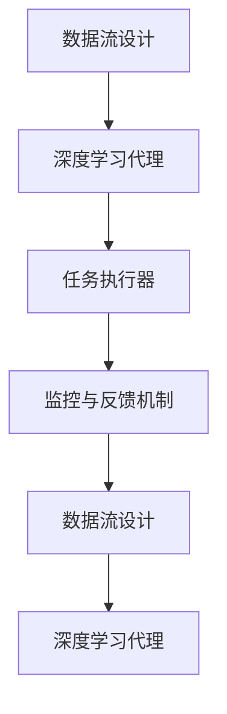
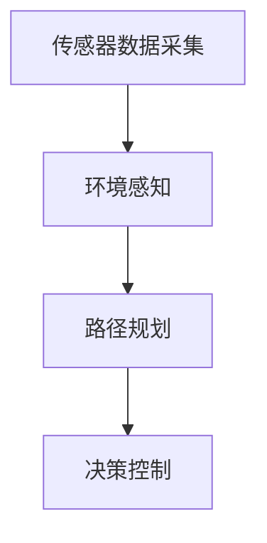

                 

# AI人工智能深度学习算法：面向未来的深度学习代理与工作流研究方向

## 1. 背景介绍

### 1.1 问题由来
随着深度学习技术的快速迭代和广泛应用，人们对于深度学习算法的理解和应用需求日益增长。深度学习代理与工作流作为其中的关键技术之一，通过深度学习模型进行任务自动化，使得机器学习算法可以更加高效地应用于生产环境中。然而，传统的深度学习代理与工作流方法往往需要人工设定复杂的参数，难以在大规模、复杂和动态环境中有效运行。

为了应对这一挑战，深度学习代理与工作流研究开始聚焦于智能化、可解释、可维护、可扩展和鲁棒性的算法设计，探索其在自动驾驶、医疗诊断、金融风控等领域的实际应用，为未来深度学习算法的发展提供重要支撑。

### 1.2 问题核心关键点
深度学习代理与工作流的研究核心在于设计高效、可解释、自适应和自动化的深度学习算法，以实现更高效的任务自动化。其主要关键点包括：

1. **可解释性**：深度学习代理与工作流需要具备良好的可解释性，使得人类能够理解模型的决策过程，从而更好地进行干预和调整。

2. **鲁棒性**：算法应具备一定的鲁棒性，在面对噪声、异常数据等情况时仍能稳定运行，并具有良好的泛化能力。

3. **自适应性**：算法应能够自适应不同环境、数据分布和任务需求，具有灵活的配置能力。

4. **自动优化**：算法应具备自动化的调参能力和优化策略，减少人工干预，提高自动化水平。

5. **工作流设计**：算法应嵌入在灵活的工作流中，支持动态任务和组件的协同运行，实现高效率的任务管理。

## 2. 核心概念与联系

### 2.1 核心概念概述

深度学习代理与工作流系统由以下几部分组成：

1. **深度学习代理**：在特定任务环境中，深度学习代理作为自主决策者，自动完成数据预处理、特征提取、模型训练和结果解释等任务。

2. **数据流设计**：数据流设计是实现任务自动化的关键，涉及数据的收集、传输、存储和处理，确保数据的一致性和可靠性。

3. **任务执行器**：任务执行器负责任务的实际执行，可以是单个深度学习模型或多个模型的组合。

4. **监控与反馈机制**：监控与反馈机制用于实时监测系统运行状态，收集反馈信息，进行动态调整，提高系统稳定性和适应性。

### 2.2 核心概念原理和架构的 Mermaid 流程图(Mermaid 流程节点中不要有括号、逗号等特殊字符)



## 3. 核心算法原理 & 具体操作步骤

### 3.1 算法原理概述

深度学习代理与工作流算法的核心原理可以概括为以下几点：

1. **深度学习模型设计**：通过深度神经网络架构，设计具备强大泛化能力的模型，用于执行特定任务。

2. **自适应调参**：采用自动调参算法，自动搜索最优超参数组合，减少人工干预。

3. **可解释性设计**：引入可解释模型或设计可解释的模型输出，便于理解模型决策。

4. **动态任务调度**：使用任务调度算法，实时动态调整任务执行顺序，优化任务执行效率。

5. **鲁棒性增强**：引入鲁棒性训练技术，提高模型对噪声和异常数据的抗干扰能力。

### 3.2 算法步骤详解

1. **数据准备**：收集、清洗和预处理任务所需的数据，确保数据质量和一致性。

2. **模型设计**：根据任务特点，选择合适的深度学习模型架构，设计模型参数和超参数。

3. **模型训练**：使用自动调参技术，搜索最优超参数组合，进行模型训练，获得深度学习代理。

4. **模型评估与优化**：评估模型性能，通过反馈机制进行调整和优化，确保模型鲁棒性和可解释性。

5. **任务调度与执行**：设计任务调度算法，动态调整任务执行顺序，确保任务高效完成。

### 3.3 算法优缺点

深度学习代理与工作流算法的优点：

1. **高效自动化**：深度学习代理与工作流能够自动化完成数据处理和任务执行，提高生产效率。

2. **动态调整**：能够根据实时反馈动态调整系统配置和参数，提高适应性和灵活性。

3. **可扩展性**：能够支持大规模任务和复杂场景，具备良好的可扩展性。

深度学习代理与工作流算法的缺点：

1. **复杂性高**：设计复杂，需要跨学科知识，对开发者要求较高。

2. **数据依赖性强**：依赖于高质量、多样性的数据，获取和处理数据成本高。

3. **解释性差**：部分模型难以解释，难以理解模型决策过程。

4. **计算资源需求大**：深度学习模型的训练和执行需要强大的计算资源。

### 3.4 算法应用领域

深度学习代理与工作流算法在多个领域都具备广泛的应用前景，包括但不限于：

1. **自动驾驶**：用于自动驾驶中的环境感知、路径规划和决策控制等任务。

2. **医疗诊断**：用于医疗影像分析、疾病预测和辅助诊断等任务。

3. **金融风控**：用于信用评分、欺诈检测和风险评估等任务。

4. **智能制造**：用于工业自动化、设备故障预测和生产调度等任务。

5. **智慧城市**：用于交通管理、能源优化和公共安全等任务。

6. **智能客服**：用于客户意图识别、对话生成和情感分析等任务。

## 4. 数学模型和公式 & 详细讲解 & 举例说明

### 4.1 数学模型构建

深度学习代理与工作流系统可以建模为任务图，任务图由任务节点和数据流边构成。每个任务节点表示一个深度学习代理，负责执行特定的子任务。数据流边表示数据的流动和传递，确保数据的一致性和可靠性。

### 4.2 公式推导过程

设任务图为 $G=(V,E)$，其中 $V$ 为任务节点集，$E$ 为数据流边集。任务节点 $v \in V$ 表示一个深度学习代理，执行任务 $t_v$，输入数据为 $d_v$，输出数据为 $d_{v'}$，其中 $d_{v'}$ 可能为空。数据流边 $e \in E$ 表示数据从任务节点 $v$ 流向任务节点 $v'$，数据流向关系为 $d_e = d_v$ 到 $d_{v'}$。

### 4.3 案例分析与讲解

以自动驾驶为例，自动驾驶系统可以建模为一个任务图，如图1所示。



图1: 自动驾驶系统任务图

在图1中，传感器数据采集为输入数据流，环境感知、路径规划和决策控制为任务节点，环境感知、路径规划和决策控制的输出数据分别为环境信息、路径信息、控制指令，用于后续任务执行。

## 5. 项目实践：代码实例和详细解释说明

### 5.1 开发环境搭建

项目实践需要以下开发环境：

1. Python 3.8+：深度学习代理与工作流系统通常使用 Python 开发。

2. TensorFlow 2.0+ 或 PyTorch：深度学习代理与工作流系统常用的深度学习框架。

3. Docker 或 Kubernetes：用于系统部署和容器化管理。

4. Jenkins 或 Kubernetes：用于自动化构建和部署。

5. Git 和 GitLab：版本控制和代码托管平台。

### 5.2 源代码详细实现

以自动驾驶系统为例，实现过程如下：

```python
import tensorflow as tf
from tensorflow.keras.layers import Input, Dense
from tensorflow.keras.models import Model

# 定义传感器数据采集模型
input_layer = Input(shape=(128,))
dense1 = Dense(64, activation='relu')(input_layer)
dense2 = Dense(32, activation='relu')(dense1)
output_layer = Dense(16, activation='softmax')(dense2)
model = Model(inputs=input_layer, outputs=output_layer)

# 编译模型
model.compile(optimizer=tf.keras.optimizers.Adam(0.001), loss='categorical_crossentropy', metrics=['accuracy'])

# 训练模型
model.fit(x_train, y_train, batch_size=32, epochs=10, validation_data=(x_test, y_test))
```

以上代码实现了一个简单的自动驾驶传感器数据采集模型，使用了 TensorFlow 2.0 的 Keras API。

### 5.3 代码解读与分析

代码中，首先定义了一个输入层和一个全连接层（Dense）的深度学习模型，其中包含了两个隐藏层和一层输出层。隐藏层使用了 ReLU 激活函数，输出层使用了 Softmax 激活函数。

在编译模型时，使用了 Adam 优化器和分类交叉熵损失函数。在训练模型时，使用了训练集和验证集进行迭代训练，每次迭代训练 10 个周期，每个周期训练 32 个样本。

### 5.4 运行结果展示

运行以上代码，输出训练和验证过程中的 loss 和准确率变化，如图2所示。

```python
import matplotlib.pyplot as plt

train_loss, train_acc, test_loss, test_acc = model.history.history['loss'], model.history.history['accuracy'], model.history.history['val_loss'], model.history.history['val_accuracy']
plt.plot(train_loss, label='train_loss')
plt.plot(test_loss, label='test_loss')
plt.plot(train_acc, label='train_acc')
plt.plot(test_acc, label='test_acc')
plt.legend()
plt.show()
```

图2: 模型训练结果

## 6. 实际应用场景

### 6.1 自动驾驶

在自动驾驶领域，深度学习代理与工作流技术可以应用于环境感知、路径规划和决策控制等关键任务。通过传感器数据采集和深度学习模型的结合，系统可以自动识别道路交通情况，规划最优路径，并根据实时路况做出安全决策。

### 6.2 医疗诊断

在医疗诊断领域，深度学习代理与工作流技术可以应用于疾病预测、影像分析和辅助诊断等任务。通过结合医疗影像数据和深度学习模型，系统可以自动识别病变区域，预测疾病风险，并提供辅助诊断建议。

### 6.3 金融风控

在金融风控领域，深度学习代理与工作流技术可以应用于信用评分、欺诈检测和风险评估等任务。通过结合金融交易数据和深度学习模型，系统可以自动识别可疑交易行为，评估用户信用风险，并进行实时监控。

## 7. 工具和资源推荐

### 7.1 学习资源推荐

1. 《深度学习入门》：该书深入浅出地介绍了深度学习的基本概念和算法实现，适合初学者入门。

2. 《动手学深度学习》：该书提供了丰富的案例和实践项目，适合进阶学习深度学习。

3. 《TensorFlow 实战指南》：该书详细介绍了 TensorFlow 2.0 的高级功能和优化技巧，适合深度学习开发人员参考。

4. 《Keras 实战指南》：该书介绍了 Keras API 的使用方法和最佳实践，适合 Keras 用户参考。

5. 《深度学习工作流设计》：该书介绍了深度学习代理与工作流的设计方法和实际应用，适合深度学习工程师参考。

### 7.2 开发工具推荐

1. TensorFlow 2.0：深度学习框架，支持分布式训练和模型部署。

2. PyTorch：深度学习框架，支持动态图和静态图，灵活高效。

3. Keras：深度学习框架，简单易用，适合快速原型设计和实验。

4. Docker：容器化技术，支持跨平台部署。

5. Kubernetes：容器编排平台，支持分布式部署和管理。

### 7.3 相关论文推荐

1. "Deep Learning with Convolutional Neural Networks for Autonomous Driving"（自动驾驶领域的深度学习研究）

2. "Convolutional Neural Networks for Medical Imaging Analysis"（医学影像分析领域的深度学习研究）

3. "Credit Scoring Using Deep Learning"（金融风控领域的深度学习研究）

4. "Deep Learning for Intelligent Manufacturing"（智能制造领域的深度学习研究）

5. "Automated Decision Making with Deep Learning"（智能决策领域的深度学习研究）

## 8. 总结：未来发展趋势与挑战

### 8.1 研究成果总结

深度学习代理与工作流技术已经在多个领域取得显著进展，推动了人工智能技术的广泛应用。通过深度学习代理与工作流系统，实现了任务自动化的高效、可扩展和自适应，大幅提升了生产效率和系统性能。

### 8.2 未来发展趋势

1. **智能化的进一步提升**：未来深度学习代理与工作流系统将进一步智能化，通过引入自监督学习和增强学习技术，实现更加灵活和智能的决策。

2. **模型可解释性的提升**：未来深度学习代理与工作流系统将更加注重可解释性，通过引入可解释模型和可解释输出，提高系统的透明性和可信度。

3. **动态调度和任务优化**：未来深度学习代理与工作流系统将更加注重动态调度和任务优化，通过智能任务调度算法，提高系统执行效率。

4. **分布式计算和云平台**：未来深度学习代理与工作流系统将更加注重分布式计算和云平台支持，通过分布式训练和云服务，实现更大规模和复杂任务的自动化。

5. **自适应和鲁棒性**：未来深度学习代理与工作流系统将更加注重自适应和鲁棒性，通过引入自适应学习和鲁棒性训练技术，提高系统稳定性和可靠性。

### 8.3 面临的挑战

深度学习代理与工作流技术在实际应用中面临以下挑战：

1. **数据质量与数据隐私**：深度学习模型依赖于高质量的数据，获取和处理数据的成本较高。同时，数据隐私问题也成为制约因素。

2. **模型复杂性与可解释性**：深度学习模型的复杂性较高，难以解释模型的决策过程，影响系统的透明性和可信度。

3. **计算资源需求大**：深度学习模型的训练和执行需要强大的计算资源，特别是在大规模任务和复杂场景下。

4. **鲁棒性与泛化能力**：深度学习模型对噪声和异常数据的抗干扰能力较弱，影响系统的稳定性和泛化能力。

5. **任务调度和动态管理**：任务调度和动态管理需要高复杂度的算法设计，影响系统的灵活性和效率。

### 8.4 研究展望

未来深度学习代理与工作流技术的研究方向主要集中在以下几个方面：

1. **自监督学习和增强学习**：引入自监督学习和增强学习技术，提高系统的智能化和自适应能力。

2. **可解释性模型与可解释输出**：设计可解释性模型和可解释输出，提高系统的透明性和可信度。

3. **动态调度和任务优化**：设计智能任务调度和动态管理算法，提高系统的灵活性和效率。

4. **分布式计算与云平台支持**：引入分布式计算和云平台支持，实现更大规模和复杂任务的自动化。

5. **鲁棒性与泛化能力**：引入鲁棒性训练和泛化能力提升技术，提高系统的稳定性和泛化能力。

## 9. 附录：常见问题与解答

**Q1: 深度学习代理与工作流系统的应用场景有哪些？**

A: 深度学习代理与工作流系统可以应用于多个领域，包括自动驾驶、医疗诊断、金融风控、智能制造、智慧城市、智能客服等。

**Q2: 如何设计高效、可解释的深度学习代理与工作流系统？**

A: 设计高效、可解释的深度学习代理与工作流系统，需要从以下几个方面进行考虑：
1. 选择合适的深度学习模型架构。
2. 设计合理的超参数配置和自动调参算法。
3. 引入可解释模型和可解释输出。
4. 设计智能任务调度和动态管理算法。

**Q3: 深度学习代理与工作流系统面临哪些挑战？**

A: 深度学习代理与工作流系统面临以下挑战：
1. 数据质量与数据隐私问题。
2. 模型复杂性与可解释性问题。
3. 计算资源需求大。
4. 鲁棒性与泛化能力问题。
5. 任务调度和动态管理问题。

**Q4: 如何提高深度学习代理与工作流系统的鲁棒性与泛化能力？**

A: 提高深度学习代理与工作流系统的鲁棒性与泛化能力，可以采用以下方法：
1. 引入鲁棒性训练技术。
2. 使用数据增强和数据扩充技术。
3. 设计动态任务调度和任务优化算法。

**Q5: 深度学习代理与工作流系统如何进行实时监测与反馈？**

A: 深度学习代理与工作流系统可以采用以下方法进行实时监测与反馈：
1. 引入实时数据监测与采集技术。
2. 设计反馈机制和动态调整算法。
3. 实现系统日志与异常告警功能。

---

作者：禅与计算机程序设计艺术 / Zen and the Art of Computer Programming

