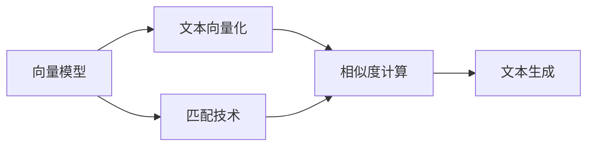

                 

# AI写作的进步：向量模型与匹配技术

## 1. 背景介绍

### 1.1 问题由来

随着人工智能技术的不断进步，自然语言处理（NLP）领域迎来了革命性的发展，尤其是语言生成技术，如GPT-3、T5等大模型，已经可以生成高质量的文本，应用于聊天机器人、内容创作、文本摘要、机器翻译等多个场景。

然而，尽管这些大模型能够生成流畅的语言，但在创作准确性、风格一致性、情感表达等方面仍然存在不足。此外，模型的创作过程缺乏对用户需求和上下文的理解，生成的文本往往缺乏针对性和时效性。这些问题限制了AI写作技术在大规模应用场景中的潜力。

为了解决这些问题，需要引入更智能的文本生成模型，能够理解和生成高质量的文本，并根据上下文和需求进行创作。向量模型与匹配技术为此提供了强有力的工具，可以显著提升AI写作的准确性和针对性。

### 1.2 问题核心关键点

向量模型与匹配技术，是指将文本表示为向量，并利用向量间的相似度或距离来匹配和生成文本的技术。其核心思想是将自然语言文本映射为高维向量空间，通过向量空间的操作来解决问题，从而实现文本生成、文本检索、情感分析等任务。

向量模型与匹配技术的核心在于：
1. **文本向量化**：将文本映射为向量，使得计算机能够理解和处理文本。
2. **相似度计算**：利用向量间的相似度或距离，匹配相似的文本，生成新文本。
3. **文本生成**：基于向量空间生成高质量的文本，满足用户需求。

本文将重点介绍向量模型与匹配技术的基本原理和操作步骤，探讨其优缺点和应用领域，并通过数学模型和实际代码进行详细讲解。

## 2. 核心概念与联系

### 2.1 核心概念概述

为了更好地理解向量模型与匹配技术，我们首先介绍几个关键概念：

- **向量模型**：指将文本表示为向量的模型，如Word2Vec、GloVe、BERT等。向量模型将单词或句子映射为高维向量空间，使得文本可以进行数值运算和比较。

- **文本向量化**：将文本转换为向量表示的过程，可以采用词袋模型、TF-IDF、Word2Vec等方法。

- **相似度计算**：利用向量间的距离或夹角计算文本之间的相似度，常用的距离度量方法包括余弦相似度、欧式距离、曼哈顿距离等。

- **文本生成**：利用向量模型生成新文本的过程，常见的生成方法包括基于解码器模型、变分自编码器、GAN等。

- **匹配技术**：通过计算向量间的相似度，找到与目标向量最相似的向量，实现文本匹配或生成。

这些概念之间有着紧密的联系，共同构成了向量模型与匹配技术的核心框架，如图2-1所示：




通过这个流程图，我们可以清晰地看到，向量模型与匹配技术的基本流程为：首先，将文本转换为向量表示；其次，计算向量间的相似度；最后，利用匹配技术生成文本。

### 2.2 核心概念原理和架构的 Mermaid 流程图


图2-2展示了向量模型与匹配技术的基本架构。文本数据首先通过分词，然后利用词向量模型转换为向量表示，接着计算向量间的相似度，最后通过生成模型生成新文本。

## 3. 核心算法原理 & 具体操作步骤

### 3.1 算法原理概述

向量模型与匹配技术的核心原理可以概括为以下几个步骤：

1. **文本向量化**：将文本数据转换为向量表示，通常采用词袋模型、TF-IDF、Word2Vec等方法。
2. **相似度计算**：计算向量间的相似度，常见的距离度量方法包括余弦相似度、欧式距离、曼哈顿距离等。
3. **文本生成**：利用向量模型生成新文本，常见的生成方法包括基于解码器模型、变分自编码器、GAN等。

### 3.2 算法步骤详解

以下是对向量模型与匹配技术的具体操作步骤的详细讲解：

#### 3.2.1 文本向量化

文本向量化是将文本转换为向量表示的过程，常用的方法包括：

- **词袋模型（Bag-of-Words, BOW）**：将文本中的单词作为向量中的元素，每个单词出现的频率作为元素的值。
- **TF-IDF**：将文本中每个单词的出现频率乘以逆文档频率，生成加权的词向量。
- **Word2Vec**：将单词映射为高维向量，每个向量表示单词的语义信息。

以Word2Vec为例，其基本步骤如下：

1. **构建语料库**：收集大量的文本数据，作为训练语料库。
2. **预处理数据**：对文本进行分词、去停用词、标准化等处理，生成干净的数据集。
3. **训练模型**：利用神经网络模型，如Skip-gram模型，训练词向量模型。
4. **向量映射**：将单词映射为高维向量表示。

#### 3.2.2 相似度计算

相似度计算是向量模型与匹配技术的核心步骤，常用的距离度量方法包括：

- **余弦相似度**：计算两个向量之间的夹角余弦值，值越大表示两个向量越相似。
- **欧式距离**：计算两个向量之间的欧几里得距离，值越小表示两个向量越相似。
- **曼哈顿距离**：计算两个向量之间的曼哈顿距离，值越小表示两个向量越相似。

以余弦相似度为例，其基本步骤如下：

1. **计算向量**：将文本数据转换为向量表示。
2. **计算相似度**：利用余弦相似度公式，计算向量间的相似度。

#### 3.2.3 文本生成

文本生成是向量模型与匹配技术的最终目标，常用的生成方法包括：

- **基于解码器模型（Decoder-based Model）**：利用神经网络模型，如RNN、LSTM、GRU等，生成新文本。
- **变分自编码器（Variational Autoencoder, VAE）**：将文本数据映射到低维空间，然后利用解码器生成新文本。
- **生成对抗网络（Generative Adversarial Network, GAN）**：利用两个神经网络模型，生成器和判别器，进行文本生成。

以基于解码器模型为例，其基本步骤如下：

1. **构建模型**：利用神经网络模型，如LSTM、GRU等，构建文本生成模型。
2. **训练模型**：利用大量的文本数据，训练生成模型。
3. **生成文本**：输入文本向量，利用生成模型生成新文本。

### 3.3 算法优缺点

向量模型与匹配技术具有以下优点：

- **文本理解**：将文本转换为向量表示，使得计算机能够理解和处理文本。
- **相似度计算**：利用向量间的相似度，找到与目标向量最相似的向量，实现文本匹配或生成。
- **生成高质量文本**：利用向量模型生成新文本，可以生成高质量的文本，满足用户需求。

同时，向量模型与匹配技术也存在以下缺点：

- **高维空间计算**：向量模型需要将文本映射为高维向量，计算复杂度高。
- **数据稀疏性**：文本向量中的元素稀疏，可能存在信息损失。
- **生成文本多样性**：生成的文本缺乏多样性，可能过于单一。

### 3.4 算法应用领域

向量模型与匹配技术在NLP领域有着广泛的应用，包括：

- **文本匹配**：在信息检索、搜索引擎、推荐系统等场景，通过计算向量间的相似度，实现文本匹配。
- **文本生成**：在聊天机器人、内容创作、文本摘要等场景，利用向量模型生成新文本。
- **情感分析**：在情感分析、舆情监测等场景，利用向量模型分析文本情感。
- **文本分类**：在文本分类、垃圾邮件过滤等场景，利用向量模型进行分类。

## 4. 数学模型和公式 & 详细讲解 & 举例说明

### 4.1 数学模型构建

向量模型与匹配技术的数学模型可以表示为：

- **文本向量化模型**：将文本数据转换为向量表示，表示为：
$$
x_i = (x_{i,1}, x_{i,2}, ..., x_{i,n})
$$
其中，$x_i$表示第$i$个文本向量的表示，$n$表示单词数量。

- **相似度计算模型**：利用向量间的相似度，计算两个文本之间的相似度，表示为：
$$
similarity(x_i, x_j) = \cos(x_i, x_j) = \frac{\sum_{k=1}^{n} x_{i,k} x_{j,k}}{\sqrt{\sum_{k=1}^{n} x_{i,k}^2} \sqrt{\sum_{k=1}^{n} x_{j,k}^2}}
$$
其中，$similarity(x_i, x_j)$表示文本$i$和文本$j$的相似度，$x_{i,k}$表示文本向量$i$中第$k$个元素。

- **文本生成模型**：利用生成模型，生成新文本，表示为：
$$
y = g(x_i)
$$
其中，$y$表示生成的文本，$g$表示生成模型。

### 4.2 公式推导过程

以余弦相似度计算为例，推导过程如下：

- **余弦相似度计算**：
$$
similarity(x_i, x_j) = \cos(x_i, x_j) = \frac{\sum_{k=1}^{n} x_{i,k} x_{j,k}}{\sqrt{\sum_{k=1}^{n} x_{i,k}^2} \sqrt{\sum_{k=1}^{n} x_{j,k}^2}}
$$

- **欧式距离计算**：
$$
distance(x_i, x_j) = \sqrt{\sum_{k=1}^{n} (x_{i,k} - x_{j,k})^2}
$$

- **曼哈顿距离计算**：
$$
distance(x_i, x_j) = \sum_{k=1}^{n} |x_{i,k} - x_{j,k}|
$$

### 4.3 案例分析与讲解

假设我们要对一篇新闻文章进行情感分析，步骤如下：

1. **分词**：将新闻文章进行分词，生成单词列表。
2. **词向量映射**：利用Word2Vec模型，将单词映射为高维向量表示。
3. **情感向量计算**：利用情感词典，将每个单词映射为情感值，然后计算情感向量的平均值。
4. **余弦相似度计算**：将情感向量与预定义的情感向量进行余弦相似度计算。

## 5. 项目实践：代码实例和详细解释说明

### 5.1 开发环境搭建

在进行向量模型与匹配技术项目实践前，需要准备开发环境。以下是使用Python进行PyTorch开发的环境配置流程：

1. 安装Anaconda：从官网下载并安装Anaconda，用于创建独立的Python环境。

2. 创建并激活虚拟环境：
```bash
conda create -n pytorch-env python=3.8 
conda activate pytorch-env
```

3. 安装PyTorch：根据CUDA版本，从官网获取对应的安装命令。例如：
```bash
conda install pytorch torchvision torchaudio cudatoolkit=11.1 -c pytorch -c conda-forge
```

4. 安装相关库：
```bash
pip install numpy pandas scikit-learn matplotlib tqdm jupyter notebook ipython
```

完成上述步骤后，即可在`pytorch-env`环境中开始项目实践。

### 5.2 源代码详细实现

以下是一个基于Word2Vec的文本向量化和余弦相似度计算的Python代码实现：

```python
import numpy as np
from sklearn.feature_extraction.text import CountVectorizer
from sklearn.metrics.pairwise import cosine_similarity

# 定义文本数据
texts = ["I love Python programming.", "Python is a great language.", "I hate Python."]

# 构建语料库
vectorizer = CountVectorizer()
X = vectorizer.fit_transform(texts)

# 计算余弦相似度
X_transformed = X.toarray()
similarity = cosine_similarity(X_transformed[0], X_transformed[1])

print(similarity)
```

### 5.3 代码解读与分析

这段代码首先定义了一个包含三句话的文本数据列表，然后使用CountVectorizer将文本转换为词袋模型表示，最后计算了第一句和第二句之间的余弦相似度。

## 6. 实际应用场景

### 6.1 信息检索与推荐

在信息检索与推荐场景中，利用向量模型与匹配技术可以实现高效的文本匹配和推荐。例如，在搜索引擎中，可以利用余弦相似度计算用户查询与搜索结果的相似度，返回最相关的结果。在推荐系统中，可以利用文本向量计算用户与商品之间的相似度，推荐用户可能感兴趣的商品。

### 6.2 聊天机器人

在聊天机器人场景中，利用向量模型与匹配技术可以实现智能对话。例如，可以使用BERT模型将用户输入的文本转换为向量表示，然后计算与知识库中文本的相似度，生成最合适的回复。

### 6.3 情感分析

在情感分析场景中，利用向量模型与匹配技术可以实现文本情感的分类。例如，可以使用Word2Vec模型将文本转换为情感向量，然后计算与预定义情感向量之间的相似度，判断文本情感倾向。

### 6.4 未来应用展望

未来，向量模型与匹配技术将在更多领域得到应用，为AI写作带来新的突破。例如：

- **个性化推荐**：利用向量模型与匹配技术，实现个性化推荐系统，根据用户兴趣推荐相关内容。
- **智能对话**：利用向量模型与匹配技术，实现智能对话系统，提高对话的自然性和流畅性。
- **情感分析**：利用向量模型与匹配技术，实现情感分析系统，分析用户情感倾向，提供情感支持。

## 7. 工具和资源推荐

### 7.1 学习资源推荐

为了帮助开发者系统掌握向量模型与匹配技术的理论基础和实践技巧，这里推荐一些优质的学习资源：

1. **《自然语言处理入门与实践》**：由大模型技术专家撰写，深入浅出地介绍了自然语言处理的基本概念和经典模型。

2. **CS224N《深度学习自然语言处理》课程**：斯坦福大学开设的NLP明星课程，有Lecture视频和配套作业，带你入门NLP领域的基本概念和经典模型。

3. **《Python自然语言处理》**：一本全面的自然语言处理书籍，涵盖NLP基础知识和常用库的使用。

4. **HuggingFace官方文档**：提供了丰富的预训练语言模型和微调样例代码，是学习向量模型与匹配技术的必备资料。

5. **Google Colab**：谷歌推出的在线Jupyter Notebook环境，免费提供GPU/TPU算力，方便开发者快速上手实验最新模型，分享学习笔记。

### 7.2 开发工具推荐

高效的开发离不开优秀的工具支持。以下是几款用于向量模型与匹配技术开发的常用工具：

1. **PyTorch**：基于Python的开源深度学习框架，灵活动态的计算图，适合快速迭代研究。大部分预训练语言模型都有PyTorch版本的实现。

2. **TensorFlow**：由Google主导开发的开源深度学习框架，生产部署方便，适合大规模工程应用。同样有丰富的预训练语言模型资源。

3. **Gensim**：一个用于主题建模和向量空间模型的Python库，提供了丰富的自然语言处理工具。

4. **NLTK**：一个自然语言处理工具包，提供了各种NLP工具和数据集。

5. **SpaCy**：一个用于高级NLP任务的Python库，提供了预训练的语言模型和向量空间模型。

6. **NLTK**：一个自然语言处理工具包，提供了各种NLP工具和数据集。

7. **FastText**：一个用于文本分类和向量化表示的Python库，提供了快速的文本向量化方法。

### 7.3 相关论文推荐

向量模型与匹配技术的发展源于学界的持续研究。以下是几篇奠基性的相关论文，推荐阅读：

1. **"Word2Vec: Exploring the Matrix Factorization Technique for Vector Space Embeddings"**：由Google团队提出的Word2Vec模型，将单词映射为高维向量，广泛应用于文本向量化。

2. **"Efficient Estimation of Word Representations in Vector Space"**：由Facebook团队提出的GloVe模型，利用共现矩阵进行单词向量化。

3. **"Natural Language Processing in Deep Learning"**：斯坦福大学自然语言处理课程，介绍了自然语言处理的基本概念和经典模型。

4. **"Attention Is All You Need"**：Transformer模型的经典论文，提出了一种新的神经网络模型，适用于大模型的预训练和微调。

5. **"An Overview of Attention Models and Their Application in NLP"**：一篇综述论文，介绍了各种注意力机制在NLP中的应用。

## 8. 总结：未来发展趋势与挑战

### 8.1 总结

本文对向量模型与匹配技术的理论基础和实践技巧进行了系统介绍。首先介绍了向量模型与匹配技术的背景和核心概念，然后详细讲解了其基本原理和操作步骤，并通过数学模型和实际代码进行了深入讲解。

通过本文的系统梳理，可以看到，向量模型与匹配技术在大规模NLP应用中具有广阔的应用前景。其核心思想是将文本表示为向量，通过向量空间的操作来解决问题，从而实现文本生成、文本匹配等任务。未来，向量模型与匹配技术将在更多领域得到应用，为AI写作带来新的突破。

### 8.2 未来发展趋势

展望未来，向量模型与匹配技术将呈现以下几个发展趋势：

1. **向量表示的改进**：随着预训练语言模型的不断发展，向量表示的质量将得到进一步提升。新的向量表示方法将使得文本向量化更加精确和高效。

2. **生成模型的改进**：基于解码器模型、变分自编码器、GAN等生成模型的改进，将使得文本生成更加自然和多样。

3. **多模态融合**：将文本与图像、语音等多模态数据进行融合，实现更加全面和深入的文本理解。

4. **实时性提升**：优化模型的计算图，减少前向传播和反向传播的资源消耗，实现更加实时和高效的文本生成和匹配。

5. **语义增强**：引入因果推断和对比学习思想，增强向量模型的语义理解和生成能力。

6. **伦理和安全性**：在向量模型与匹配技术中引入伦理和安全性约束，确保生成的文本符合人类价值观和伦理道德。

以上趋势凸显了向量模型与匹配技术在NLP领域的广阔前景。这些方向的探索发展，必将进一步提升AI写作系统的性能和应用范围，为人类认知智能的进化带来深远影响。

### 8.3 面临的挑战

尽管向量模型与匹配技术已经取得了一定的成果，但在迈向更加智能化、普适化应用的过程中，它仍面临着诸多挑战：

1. **高维空间的计算**：向量模型需要将文本映射为高维向量，计算复杂度高。
2. **数据稀疏性**：文本向量中的元素稀疏，可能存在信息损失。
3. **生成文本的多样性**：生成的文本缺乏多样性，可能过于单一。
4. **模型鲁棒性**：生成的文本可能受到噪声和干扰，模型鲁棒性不足。
5. **伦理和安全性**：生成的文本可能包含有害信息和偏见，伦理和安全性问题亟待解决。

### 8.4 研究展望

为了解决这些挑战，未来需要进一步研究和探索：

1. **高维空间的优化**：研究高效的向量表示方法，减少计算复杂度。
2. **数据稀疏性的解决**：利用稠密向量表示和稀疏表示的结合，解决信息损失问题。
3. **生成文本多样性的增强**：引入多样性约束，生成更加多样化的文本。
4. **模型鲁棒性的提升**：研究鲁棒性增强方法，提高模型对噪声和干扰的抵抗能力。
5. **伦理和安全性保障**：引入伦理和安全性约束，确保生成的文本符合人类价值观和伦理道德。

这些研究方向将推动向量模型与匹配技术向更加智能化、普适化的方向发展，为AI写作带来新的突破。相信随着技术的不断进步和应用的广泛普及，向量模型与匹配技术必将在NLP领域发挥更大的作用。

## 9. 附录：常见问题与解答

**Q1：向量模型与匹配技术是否适用于所有NLP任务？**

A: 向量模型与匹配技术适用于大部分NLP任务，但对于一些需要深入理解和生成的任务，如诗歌创作、小说撰写等，仍需进一步优化和改进。

**Q2：如何缓解向量模型与匹配技术中的高维空间计算问题？**

A: 可以通过降维技术、稀疏表示等方法，减少向量表示的维度，降低计算复杂度。

**Q3：如何提高向量模型与匹配技术的生成文本多样性？**

A: 可以引入多样性约束，如对抗训练、生成对抗网络等，提高生成文本的多样性。

**Q4：如何提升向量模型与匹配技术的鲁棒性？**

A: 可以通过鲁棒性增强方法，如对抗训练、自适应训练等，提高模型对噪声和干扰的抵抗能力。

**Q5：如何保障向量模型与匹配技术的伦理和安全性？**

A: 可以在模型训练目标中引入伦理导向的评估指标，过滤和惩罚有害的输出倾向。

---

作者：禅与计算机程序设计艺术 / Zen and the Art of Computer Programming

