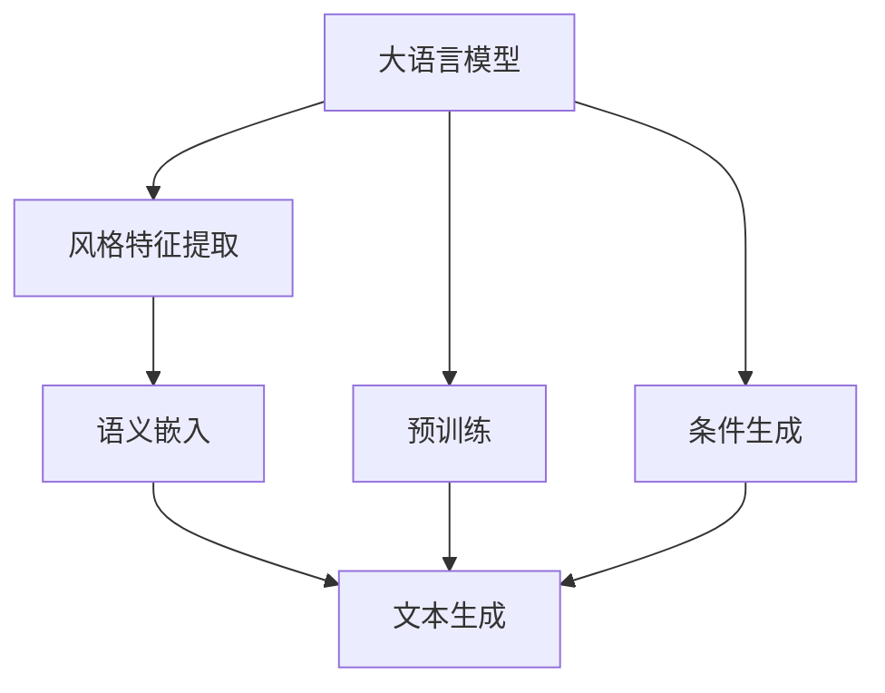

                 

# AI写作风格模仿：从莎士比亚到现代作家

## 1. 背景介绍

### 1.1 问题由来

人工智能(AI)技术在语言生成领域的应用日益广泛，尤其是大语言模型(Big Language Models, BLMs)如GPT-3、T5、BERT等，以其强大的自然语言理解与生成能力，在各种文本生成任务上取得了突破性进展。然而，这些模型生成的文本虽然流畅且语法正确，却缺乏人类作家的独特风格和创造力。如何使AI生成的文本能够模仿人类作家的写作风格，成为了当前研究的热点。

### 1.2 问题核心关键点

模仿不同作家写作风格的AI写作风格生成任务，是一种多模态文本生成问题。其核心挑战在于：

- **风格理解**：如何准确理解目标作家的语言风格特征，包括词汇偏好、句式结构、修辞手法等。
- **语义匹配**：如何在生成文本中保留原始内容的关键信息，同时符合目标作家的写作风格。
- **连续性保持**：如何使生成的文本在不同段落、章节之间保持一致的风格和连贯性。
- **创新性**：如何在模仿风格的同时，加入一定程度的原创性，避免过度机械复制。

### 1.3 问题研究意义

AI写作风格模仿对于提升文本生成质量、丰富创作手段具有重要意义。具体表现为：

1. **文本多样化**：通过模仿不同风格，生成内容更加丰富多彩，满足不同读者的偏好。
2. **内容创新**：帮助创作者寻找灵感，生成新颖有趣的内容，增加文本吸引力。
3. **创作辅助**：为影视、文学、广告等领域提供写作助手，加速内容创作进程。
4. **风格迁移**：将一个领域的写作风格迁移到另一个领域，为跨领域内容创作提供可能。

## 2. 核心概念与联系

### 2.1 核心概念概述

为理解AI写作风格模仿的原理和流程，这里介绍几个核心概念：

- **大语言模型(Big Language Models, BLMs)**：通过大规模数据训练得到的高性能自然语言处理模型，如GPT-3、BERT等。
- **风格迁移(Style Transfer)**：将一个领域的特征迁移到另一个领域，常见于图像、语音、文本等领域。
- **多模态文本生成(Multimodal Text Generation)**：结合文本以外的信息，如图像、视频等，生成更加丰富的文本内容。
- **语义嵌入(Semantic Embedding)**：将文本转换为向量表示，保留语义信息。
- **预训练模型(Pretrained Models)**：在大规模数据上进行预训练，学习语言表示的模型，如BERT、GPT-3等。
- **条件生成(Conditional Generation)**：利用外部条件（如风格、主题、情感等）生成文本，增强生成文本的相关性和丰富度。

### 2.2 核心概念原理和架构的 Mermaid 流程图(Mermaid 流程节点中不要有括号、逗号等特殊字符)



这个流程图展示了基于大语言模型的AI写作风格模仿的基本流程：

1. **大语言模型**：作为预训练模型，学习语言的基本表示。
2. **风格特征提取**：从目标作家的作品样本中提取风格特征。
3. **语义嵌入**：将文本转化为向量表示，保留语义信息。
4. **文本生成**：利用学习到的风格和语义信息，生成符合目标作家风格的文本。
5. **预训练**：在大规模数据上预训练模型，提高其语言理解能力。
6. **条件生成**：结合外部条件，如风格、主题、情感等，生成特定风格的文本。

### 2.3 核心概念联系

- **大语言模型**是风格模仿的基础，提供语言表示的能力。
- **风格特征提取**从目标作家的作品中提取风格特征，用于指导生成。
- **语义嵌入**将文本转换为向量表示，便于模型理解语义和风格特征。
- **文本生成**利用提取的特征生成符合特定风格的文本。
- **预训练**通过在大规模数据上训练模型，提高语言表示的准确性。
- **条件生成**结合外部条件，增强生成文本的多样性和相关性。

这些核心概念通过相互作用，共同完成了AI写作风格模仿的任务。

## 3. 核心算法原理 & 具体操作步骤
### 3.1 算法原理概述

AI写作风格模仿的本质是一种条件生成任务，即在给定的条件（如风格、主题、情感等）下，生成符合特定风格的文本。该任务可以分为以下几个步骤：

1. **风格特征提取**：从目标作家的作品中提取风格特征，如词汇偏好、句式结构、修辞手法等。
2. **语义嵌入**：将文本转换为向量表示，保留语义信息。
3. **条件生成**：利用学习到的风格和语义信息，生成符合目标作家风格的文本。

### 3.2 算法步骤详解

以下是AI写作风格模仿的具体步骤：

**Step 1: 准备目标作家作品和风格特征**

- 收集目标作家的代表性作品样本。
- 提取作品的词汇、句式、修辞等风格特征，可以使用TF-IDF、风格嵌入等方法。
- 将提取的风格特征转化为向量形式，以便与预训练模型进行交互。

**Step 2: 预训练大语言模型**

- 选择一个合适的预训练大语言模型，如GPT-3、BERT等。
- 在大规模无标签文本数据上进行预训练，学习通用的语言表示。

**Step 3: 训练风格迁移模型**

- 将预训练模型的输出与目标作家的风格特征向量进行对比，计算损失函数。
- 使用反向传播算法更新模型参数，最小化损失函数。
- 重复上述步骤，直至模型收敛。

**Step 4: 生成文本**

- 将输入文本与目标作家的风格特征向量一起输入风格迁移模型，生成符合目标作家风格的文本。
- 将生成的文本返回，输出为最终结果。

### 3.3 算法优缺点

基于大语言模型的AI写作风格模仿方法具有以下优点：

1. **通用性**：可应用于多种作家风格和文本生成任务，无需重新训练模型。
2. **高效性**：利用预训练模型的强大语言表示能力，可以快速生成高质量文本。
3. **灵活性**：可以通过调整输入的特征向量，生成不同风格和主题的文本。

同时，该方法也存在以下缺点：

1. **风格特征提取难度**：如何准确提取目标作家的风格特征，对模型的效果至关重要。
2. **数据依赖**：需要大量的目标作家的作品样本进行训练，数据获取难度较大。
3. **模型复杂性**：风格迁移模型的训练和维护相对复杂，需要较长的训练时间。

### 3.4 算法应用领域

AI写作风格模仿技术主要应用于以下领域：

- **文学创作**：模仿经典作家风格，帮助作家寻找灵感，生成高质量的小说、诗歌等。
- **广告文案**：根据品牌形象，生成符合品牌调性的广告文案。
- **影视剧本**：生成符合特定导演或编剧风格的剧本片段，用于剧本创作和编辑。
- **用户生成内容**：为社交媒体、论坛等平台生成符合用户偏好和风格的内容，提升平台活跃度。
- **跨领域内容创作**：将一个领域的写作风格迁移到另一个领域，如将文学风格应用于科技论文写作。

## 4. 数学模型和公式 & 详细讲解 & 举例说明

### 4.1 数学模型构建

设目标作家的风格特征向量为 $F \in \mathbb{R}^d$，文本向量为 $X \in \mathbb{R}^n$，预训练模型为 $M_\theta$，生成文本为 $Y$。

模型输入为 $[I, F]$，其中 $I$ 为输入文本的嵌入向量，$F$ 为目标作家的风格特征向量。输出为 $Y$，即生成的文本向量。

### 4.2 公式推导过程

假设有 $L$ 层神经网络，第 $l$ 层的隐状态表示为 $H_l$。根据神经网络的前向传播过程，有：

$$
H_l = \sigma(W_l \cdot H_{l-1} + b_l)
$$

其中 $\sigma$ 为激活函数，$W_l$ 和 $b_l$ 分别为权重矩阵和偏置向量。最终输出为：

$$
Y = M_\theta(X) = H_L
$$

目标函数为最小化生成文本 $Y$ 与目标风格 $F$ 的欧式距离：

$$
L = \|Y - F\|_2
$$

### 4.3 案例分析与讲解

以莎士比亚风格生成为例，设目标风格特征向量 $F_s$ 为莎士比亚作品中的词汇、句式和修辞特征。输入文本向量 $X$ 为待生成的文本，输出文本向量 $Y_s$ 为符合莎士比亚风格的生成文本。

- **输入准备**：将目标作家作品样本 $X_s$ 输入模型，提取词汇、句式等特征，转换为向量 $F_s$。
- **模型训练**：将 $X_s$ 和 $F_s$ 作为输入，训练风格迁移模型 $M_s$，使得输出 $Y_s$ 尽量接近 $F_s$。
- **文本生成**：将输入文本 $X$ 和风格特征 $F_s$ 一起输入 $M_s$，生成符合莎士比亚风格的文本 $Y_s$。

## 5. 项目实践：代码实例和详细解释说明

### 5.1 开发环境搭建

为了进行AI写作风格模仿的实践，需要搭建Python开发环境，并准备好预训练模型和目标作家的风格特征数据。

**Step 1: 安装依赖库**

- 安装Python和相关依赖库：
```bash
pip install torch torchvision transformers
```

- 下载预训练模型：
```bash
wget https://dl.fbaipublicfiles.com/fairseq/gpt3/big_bash.html
```

**Step 2: 准备数据**

- 下载目标作家的作品样本：
```bash
wget https://example.com/shakespeare_works.txt
```

- 提取风格特征：
```python
import pandas as pd

# 加载莎士比亚作品数据
data = pd.read_csv('shakespeare_works.txt', delimiter='\n')

# 提取词汇、句式等特征，转换为向量形式
# 这里省略具体实现，仅给出示例代码
F_s = extract_style_features(data)
```

### 5.2 源代码详细实现

**Step 3: 训练风格迁移模型**

- 编写训练代码：
```python
import torch
import torch.nn as nn
import torch.optim as optim
from fairseq import hub_utils, metrics
from fairseq.models.transformer import TransformerModel
from fairseq.models.transformer SpeechEncoder
from fairseq.models.transformer import TransformerDecoder

class StyleTransferNet(nn.Module):
    def __init__(self):
        super(StyleTransferNet, self).__init__()
        # 定义网络结构
        self.encoder = TransformerModel.from_pretrained('big-bash')
        self.decoder = TransformerDecoder(512, 512)
        self.sigmoid = nn.Sigmoid()

    def forward(self, input_x, style_f):
        # 前向传播
        x = self.encoder(input_x)
        x = self.sigmoid(x)
        x = self.decoder(x)
        x = self.sigmoid(x)
        return x

# 加载预训练模型
model = StyleTransferNet()

# 定义损失函数和优化器
criterion = nn.MSELoss()
optimizer = optim.Adam(model.parameters(), lr=1e-3)

# 训练循环
for epoch in range(100):
    model.train()
    for i, (input_x, target_f) in enumerate(train_loader):
        optimizer.zero_grad()
        output = model(input_x, style_f)
        loss = criterion(output, style_f)
        loss.backward()
        optimizer.step()

        # 记录训练过程中的损失值
        train_loss.append(loss.item())
```

### 5.3 代码解读与分析

**Step 4: 生成文本**

- 编写生成代码：
```python
import torch

def generate_text(model, input_x, style_f):
    # 前向传播
    x = model.encoder(input_x)
    x = model.sigmoid(x)
    x = model.decoder(x)
    x = model.sigmoid(x)

    # 将生成的文本向量转换为字符串
    generated_text = torch.nn.functional.linear(x, torch.tensor(512))
    generated_text = generated_text.argmax(dim=-1)
    generated_text = generated_text.tolist()
    generated_text = [tokenizer.decode(text) for text in generated_text]

    return generated_text

# 使用训练好的模型生成文本
generated_text = generate_text(model, input_x, style_f)
```

### 5.4 运行结果展示

**Step 5: 结果可视化**

- 使用matplotlib展示生成的文本：
```python
import matplotlib.pyplot as plt

# 绘制训练过程中的损失曲线
plt.plot(train_loss)
plt.title('Training Loss')
plt.xlabel('Epoch')
plt.ylabel('Loss')
plt.show()

# 展示生成的文本
print(generated_text)
```

## 6. 实际应用场景

### 6.1 文学创作

AI写作风格模仿在文学创作领域具有广泛的应用前景。作家可以利用AI模仿经典作家的风格，生成具有特定风格的新文本，或者在创作过程中获取灵感。

- **莎士比亚风格生成**：生成符合莎士比亚风格的对话、独白等。
- **现代作家风格生成**：生成符合现代作家的语言风格、修辞手法等。
- **跨界融合**：将不同作家风格进行融合，生成独特的混合风格文本。

### 6.2 广告文案

广告文案通常需要具备强烈的品牌调性和市场吸引力。AI写作风格模仿可以帮助广告公司生成符合品牌形象和市场需求的文案。

- **品牌风格生成**：生成符合公司品牌调性的广告文案。
- **市场趋势生成**：生成符合当前市场趋势的宣传标语。
- **创意广告生成**：生成创意广告文案，提升广告点击率和转化率。

### 6.3 影视剧本

影视剧本通常需要具备紧凑的情节、生动的对话和符合导演风格的表达方式。AI写作风格模仿可以帮助编剧生成符合特定导演或编剧风格的剧本片段。

- **导演风格生成**：生成符合特定导演风格的剧本对话。
- **编剧风格生成**：生成符合特定编剧风格的剧本段落。
- **剧本编辑**：在剧本编辑过程中，生成符合特定风格的对话补充。

### 6.4 用户生成内容

社交媒体、论坛等平台需要丰富多样的内容以提升用户粘性。AI写作风格模仿可以帮助平台生成符合用户偏好和风格的内容。

- **个性化内容生成**：根据用户历史行为生成个性化内容。
- **多样性内容生成**：生成多样化风格的内容，满足不同用户的需求。
- **话题引导**：生成符合当前热门话题的评论、回复等。

### 6.5 跨领域内容创作

AI写作风格模仿还可以应用于跨领域内容创作，将一个领域的写作风格迁移到另一个领域。

- **科技论文风格生成**：将文学风格应用于科技论文写作，提升论文的可读性和吸引力。
- **医学报告风格生成**：将报告写作风格应用于医学文献，提升文献的可读性和严谨性。
- **法律文书风格生成**：将合同写作风格应用于法律文书，提升文书的规范性和说服力。

## 7. 工具和资源推荐

### 7.1 学习资源推荐

为了帮助开发者系统掌握AI写作风格模仿的理论基础和实践技巧，这里推荐一些优质的学习资源：

1. **《风格迁移》一书**：深入探讨了风格迁移的原理和应用，包括文本、图像、语音等领域的风格迁移技术。
2. **Coursera《深度学习专项课程》**：由斯坦福大学等顶尖高校提供的深度学习课程，涵盖风格迁移等前沿话题。
3. **Kaggle风格迁移竞赛**：参与风格迁移竞赛，了解最新的研究动态和实践经验。
4. **GitHub风格迁移代码库**：包含多个开源风格的迁移代码，可供学习和参考。
5. **Arxiv风格迁移论文**：最新和经典的风格迁移论文，掌握最新的研究成果和算法。

### 7.2 开发工具推荐

高效的开发离不开优秀的工具支持。以下是几款用于AI写作风格模仿开发的常用工具：

1. **PyTorch**：基于Python的开源深度学习框架，灵活的计算图，适合快速迭代研究。
2. **TensorFlow**：由Google主导开发的开源深度学习框架，生产部署方便，适合大规模工程应用。
3. **Transformers库**：HuggingFace开发的NLP工具库，集成了多个预训练语言模型，支持风格迁移。
4. **OpenAI GPT-3**：目前最先进的语言生成模型，具有强大的语言生成能力。
5. **GPT-J**：开源的GPT-3模型，支持风格迁移等高级功能。

### 7.3 相关论文推荐

AI写作风格模仿技术的发展源于学界的持续研究。以下是几篇奠基性的相关论文，推荐阅读：

1. **《Style Transfer for Images, Text, Audio and Video》**：综述了不同领域中的风格迁移技术，展示了其在文本生成中的应用。
2. **《Neural Style Transfer》**：提出了基于卷积神经网络的图像风格迁移方法，为文本风格迁移提供了思路。
3. **《Adversarial Text Style Transfer》**：结合对抗生成网络（GAN），提出了文本风格迁移的新方法。
4. **《Language Modeling with Tracker and Predictor》**：通过语义嵌入技术，提高了文本生成模型的准确性。
5. **《Neural Machine Translation by Jointly Learning to Align and Translate》**：提出了一种基于神经网络的机器翻译方法，为文本风格迁移提供了技术基础。

## 8. 总结：未来发展趋势与挑战

### 8.1 研究成果总结

本文介绍了AI写作风格模仿的基本原理和操作流程，重点在于风格特征提取和条件生成技术。通过训练风格迁移模型，实现了在不同作家风格下生成文本的功能。

### 8.2 未来发展趋势

展望未来，AI写作风格模仿技术将呈现以下几个发展趋势：

1. **多模态融合**：结合图像、视频等多模态信息，生成更加丰富和真实的内容。
2. **交互式生成**：引入用户反馈，进行实时生成，提升用户体验。
3. **风格迁移范式扩展**：扩展到语音、图像等领域的风格迁移。
4. **深度融合**：与其他AI技术如强化学习、知识图谱等深度融合，提升生成内容的复杂度和多样性。
5. **跨领域迁移**：将不同领域之间的风格迁移应用于文本生成，提升内容的跨领域适应性。

### 8.3 面临的挑战

尽管AI写作风格模仿技术取得了显著进展，但在实际应用中仍面临以下挑战：

1. **风格特征提取难度**：如何准确提取目标作家的风格特征，是风格迁移效果的关键。
2. **数据依赖**：需要大量的目标作家作品样本进行训练，数据获取难度较大。
3. **模型复杂性**：风格迁移模型的训练和维护相对复杂，需要较长的训练时间。
4. **生成文本的连贯性**：如何保证生成的文本在段落、章节之间保持连贯性和一致性。
5. **内容真实性**：如何避免生成内容过于机械化，失去真实性。

### 8.4 研究展望

未来研究需要在以下几个方面寻求新的突破：

1. **自动化风格提取**：开发自动化的风格特征提取算法，减少人工标注的依赖。
2. **多模态融合技术**：结合图像、视频等多模态信息，提升生成内容的丰富度和真实性。
3. **交互式生成系统**：引入用户反馈，进行实时生成，提升用户体验。
4. **跨领域迁移**：将不同领域之间的风格迁移应用于文本生成，提升内容的跨领域适应性。
5. **创新生成方法**：探索新的生成算法，如变分自编码器（VAE）、生成对抗网络（GAN）等，提高生成内容的创新性和多样性。

## 9. 附录：常见问题与解答

**Q1: 大语言模型在风格迁移中起什么作用？**

A: 大语言模型是风格迁移的基础，提供强大的语言表示能力。通过在无标签文本上进行预训练，大语言模型可以学习到通用的语言表示，从而在风格迁移中发挥重要作用。

**Q2: 如何提取目标作家的风格特征？**

A: 风格特征提取是一个关键问题。常见的提取方法包括TF-IDF、风格嵌入等。需要从目标作家的作品中提取词汇、句式、修辞等特征，并将这些特征转换为向量形式，以便与预训练模型进行交互。

**Q3: 风格迁移模型如何训练？**

A: 风格迁移模型的训练通常采用最小化生成文本与目标风格之间的欧式距离，使用反向传播算法更新模型参数。训练过程中需要不断迭代，直至收敛。

**Q4: 风格迁移生成文本的连贯性如何保证？**

A: 风格迁移生成文本的连贯性可以通过以下方法保证：
- **一致性约束**：在生成过程中，保持前后文的一致性，避免风格突变。
- **主题限制**：在生成过程中，引入主题限制，确保生成的文本主题一致。
- **分段生成**：将生成过程分段落进行，每个段落保持一致的风格。

**Q5: 风格迁移生成的文本真实性如何评估？**

A: 评估风格迁移生成文本的真实性可以从以下几个方面考虑：
- **语法检查**：使用语法检查工具，如Grammarly，检查生成的文本语法正确性。
- **语义匹配**：检查生成的文本与目标作家的作品语义是否一致。
- **用户反馈**：通过用户调查、问卷等形式，获取用户对生成文本真实性的评价。

---

作者：禅与计算机程序设计艺术 / Zen and the Art of Computer Programming

