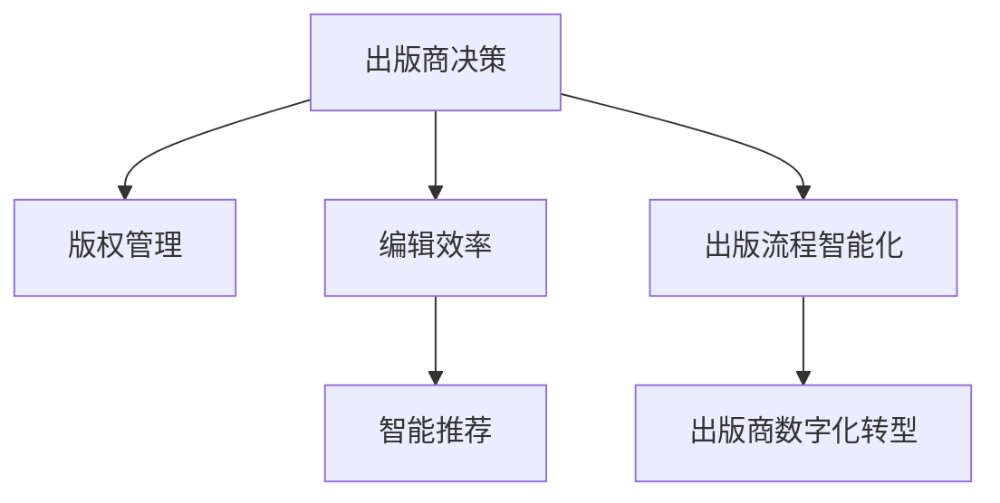

                 

# AI出版业的挑战：降本增效or场景创新？

> 关键词：AI出版,出版业数字化,场景创新,出版商决策,版权管理,编辑效率,智能推荐,人工智能,出版流程,出版商数字化转型,出版业AI应用

## 1. 背景介绍

### 1.1 问题由来
出版业一直是信息传播的重要环节，承担着知识普及、文化传播的重要使命。然而，近年来，传统出版业面临着数字化转型的挑战，行业整体营收下滑，市场竞争加剧，产业链条长、反应迟缓等问题逐渐显现。随着互联网和人工智能技术的兴起，出版业亟需引入AI技术进行智能化升级，以提升业务效率、降低运营成本、提高出版质量、拓展市场空间。

### 1.2 问题核心关键点
目前，AI技术在出版业的应用主要集中在编辑流程优化、版权管理、智能推荐、发行渠道智能化等几个方面。这些应用主要通过机器学习、自然语言处理等技术，对海量文本数据进行智能化分析与处理，从而提升出版流程的效率和质量，开拓新的商业模式，满足读者个性化需求，提升出版物的市场竞争力。

### 1.3 问题研究意义
研究AI在出版业的应用，对于出版商而言，具有重要的战略意义。具体体现在：
- 提升编辑效率：利用AI技术自动完成部分编辑工作，如排版、校对、文章摘要生成等，大幅缩短出版周期。
- 降低运营成本：通过智能化管理，优化人力资源配置，降低纸张、物流等物理成本。
- 提高内容质量：利用AI进行数据挖掘、自然语言处理，提升出版物的内容质量和创新性。
- 开拓新的商业模式：通过智能化推荐系统，精准定位读者，实现精准营销，开拓新的收益渠道。
- 提升用户体验：通过智能推荐、个性化内容推送，提升读者阅读体验，增强粘性。

## 2. 核心概念与联系

### 2.1 核心概念概述

为了更好地理解AI在出版业的应用，本节将介绍几个核心概念：

- **出版商决策**：指出版商在选题策划、内容组织、排版校对等出版流程中，需要进行的决策制定过程。通过AI技术，可以帮助出版商更快速、准确地进行决策。
- **版权管理**：指对出版物版权的登记、授权、追踪、维权等管理过程。AI技术可以通过智能化手段，提高版权管理的效率和精度。
- **编辑效率**：指出版流程中，从策划、组稿、排版、校对、修改等环节的时间消耗。AI技术可以通过自动化工具，提高编辑流程的效率。
- **智能推荐**：指基于用户的阅读历史、兴趣偏好，通过AI技术进行个性化内容推荐，提升用户阅读体验和满意度。
- **出版流程智能化**：指利用AI技术，对出版流程中的人、机、物进行智能化管理，提升整体运营效率。
- **出版商数字化转型**：指出版商通过引入AI等新兴技术，对传统出版业务进行数字化、智能化升级，提升整体竞争力。

这些核心概念之间的逻辑关系可以通过以下Mermaid流程图来展示：



这个流程图展示了几大核心概念的相互关系：

1. 出版商决策对版权管理、编辑效率、智能推荐和出版流程智能化均有直接影响。
2. 版权管理、编辑效率、智能推荐和出版流程智能化共同支撑出版商数字化转型。

## 3. 核心算法原理 & 具体操作步骤
### 3.1 算法原理概述

AI在出版业的应用，核心在于利用机器学习、自然语言处理、计算机视觉等技术，对大量数据进行智能分析与处理，从而提升出版流程的效率和质量。以下是对几类常见AI应用的算法原理概述：

#### 3.1.1 出版商决策

出版商决策通常涉及对选题、市场、读者群体等多个维度的分析。利用AI技术，可以通过数据挖掘、文本分类、聚类分析等方法，对选题进行智能分析和推荐。

#### 3.1.2 版权管理

版权管理需要高效地对版权信息进行登记、授权、追踪、维权等。AI技术可以通过区块链、分布式账本等技术，实现版权信息的透明化、可追溯性。

#### 3.1.3 编辑效率

编辑效率的提升，主要依赖于自动化排版、校对、文章摘要生成等工具。这些工具可以基于自然语言处理技术，实现自动排版、自动校对、自动摘要等功能。

#### 3.1.4 智能推荐

智能推荐的核心在于对用户兴趣进行精准分析，利用协同过滤、内容推荐等算法，实现个性化内容的推荐。

#### 3.1.5 出版流程智能化

出版流程智能化主要依赖于对出版流程各环节的智能化管理。例如，通过自动化工具对稿件进行校对、排版，利用自然语言处理技术对稿件进行智能分析，利用机器学习技术进行内容推荐等。

#### 3.1.6 出版商数字化转型

出版商数字化转型涉及对传统出版流程的全面重构，引入AI技术，实现业务流程的智能化、自动化。例如，通过AI技术进行内容分析、市场预测、版权管理、个性化推荐等。

### 3.2 算法步骤详解

以下是几个关键应用的具体算法步骤详解：

#### 3.2.1 选题策划智能化

选题策划智能化主要利用机器学习、文本分类等技术，对市场趋势、读者需求、出版资源等进行综合分析，智能化推荐选题方向。具体步骤包括：

1. **数据采集**：收集市场数据、读者调查数据、出版资源数据等。
2. **数据清洗**：对数据进行清洗和预处理，去除噪声和冗余信息。
3. **特征提取**：提取与选题相关的特征，如关键词、热点、出版资源等。
4. **模型训练**：基于分类、聚类等模型，训练选题推荐模型。
5. **推荐生成**：利用训练好的模型，生成智能化选题推荐。

#### 3.2.2 版权管理智能化

版权管理智能化主要利用区块链、分布式账本等技术，实现版权信息的透明化、可追溯性。具体步骤包括：

1. **版权登记**：对作品进行版权登记，生成版权证明。
2. **版权授权**：基于区块链技术，实现版权授权的透明化、可追溯性。
3. **版权追踪**：利用分布式账本技术，实现版权使用的追踪和记录。
4. **版权维权**：基于区块链技术，提供版权维权的证据和记录，提高维权效率。

#### 3.2.3 编辑流程自动化

编辑流程自动化主要利用自然语言处理、自动化排版、校对等技术，提升编辑效率。具体步骤包括：

1. **稿件校对**：利用自然语言处理技术，对稿件进行语法检查、拼写检查、格式检查等。
2. **自动排版**：利用排版工具，自动完成版面设计、格式调整等。
3. **文章摘要生成**：利用自然语言处理技术，自动生成文章摘要。

#### 3.2.4 智能推荐系统

智能推荐系统主要利用协同过滤、内容推荐等技术，实现个性化内容的推荐。具体步骤包括：

1. **用户画像**：收集用户的阅读历史、兴趣偏好等数据，生成用户画像。
2. **内容分析**：对出版物内容进行分词、词性标注、情感分析等。
3. **协同过滤**：基于用户画像和内容分析，进行协同过滤推荐。
4. **内容推荐**：基于协同过滤结果，生成个性化内容推荐。

### 3.3 算法优缺点

AI在出版业的应用，具有以下优点：

- 提升效率：通过自动化、智能化的技术，大幅提升出版流程的效率。
- 降低成本：减少人力、物理成本，提高资源利用率。
- 提高质量：利用AI技术，提升内容质量、版权管理精度等。
- 增强用户体验：通过个性化推荐，提升用户阅读体验。

同时，这些应用也存在一些局限：

- 数据依赖：AI应用的效果很大程度上取决于数据的质量和数量，获取高质量数据成本较高。
- 技术复杂：AI技术涉及机器学习、自然语言处理等多个领域，技术门槛较高。
- 伦理问题：AI技术可能引入算法偏见、隐私保护等问题，需要谨慎处理。
- 模型鲁棒性：AI模型在不同数据集上的泛化能力有限，可能面临过拟合等问题。

### 3.4 算法应用领域

AI在出版业的应用领域非常广泛，涵盖内容生产、版权管理、编辑流程、发行渠道等多个环节。以下是几个典型应用：

#### 3.4.1 选题策划

选题策划是出版流程的第一步，直接影响着出版物的市场竞争力。利用AI技术，可以实现智能化选题推荐，提升选题质量。

#### 3.4.2 版权管理

版权管理是出版流程中的重要环节，涉及版权登记、授权、追踪、维权等多个方面。AI技术可以提高版权管理的效率和精度。

#### 3.4.3 编辑流程

编辑流程涉及排版、校对、摘要生成等环节。利用AI技术，可以实现自动化编辑，大幅提升编辑效率。

#### 3.4.4 智能推荐

智能推荐主要应用于数字出版物，通过个性化推荐，提升用户阅读体验和满意度。

#### 3.4.5 发行渠道智能化

发行渠道智能化主要利用AI技术，优化发行渠道的运营效率，提升营销效果。

## 4. 数学模型和公式 & 详细讲解 & 举例说明

### 4.1 数学模型构建

以下是几个关键应用的数学模型构建：

#### 4.1.1 选题策划模型

选题策划模型主要利用文本分类技术，对选题进行智能化推荐。假设选题特征为 $x$，选题质量为 $y$，模型为 $f(x)$，则选题策划模型可以表示为：

$$
f(x) = W_1 \cdot x + b_1
$$

其中 $W_1$ 为权重矩阵，$b_1$ 为偏置向量。

#### 4.1.2 版权管理模型

版权管理模型主要利用区块链技术，实现版权信息的透明化、可追溯性。版权信息包括版权所有者、授权对象、使用时间、使用范围等。假设版权信息为 $x$，版权证明为 $y$，模型为 $g(x)$，则版权管理模型可以表示为：

$$
g(x) = W_2 \cdot x + b_2
$$

其中 $W_2$ 为权重矩阵，$b_2$ 为偏置向量。

#### 4.1.3 编辑流程模型

编辑流程模型主要利用自然语言处理技术，对稿件进行自动化校对、排版等。假设稿件内容为 $x$，编辑结果为 $y$，模型为 $h(x)$，则编辑流程模型可以表示为：

$$
h(x) = W_3 \cdot x + b_3
$$

其中 $W_3$ 为权重矩阵，$b_3$ 为偏置向量。

### 4.2 公式推导过程

#### 4.2.1 选题策划模型推导

选题策划模型主要利用文本分类技术，对选题进行智能化推荐。假设选题特征为 $x$，选题质量为 $y$，模型为 $f(x)$，则选题策划模型可以表示为：

$$
f(x) = W_1 \cdot x + b_1
$$

其中 $W_1$ 为权重矩阵，$b_1$ 为偏置向量。

#### 4.2.2 版权管理模型推导

版权管理模型主要利用区块链技术，实现版权信息的透明化、可追溯性。版权信息包括版权所有者、授权对象、使用时间、使用范围等。假设版权信息为 $x$，版权证明为 $y$，模型为 $g(x)$，则版权管理模型可以表示为：

$$
g(x) = W_2 \cdot x + b_2
$$

其中 $W_2$ 为权重矩阵，$b_2$ 为偏置向量。

#### 4.2.3 编辑流程模型推导

编辑流程模型主要利用自然语言处理技术，对稿件进行自动化校对、排版等。假设稿件内容为 $x$，编辑结果为 $y$，模型为 $h(x)$，则编辑流程模型可以表示为：

$$
h(x) = W_3 \cdot x + b_3
$$

其中 $W_3$ 为权重矩阵，$b_3$ 为偏置向量。

### 4.3 案例分析与讲解

#### 4.3.1 选题策划案例

假设某出版社希望推出一本关于人工智能的书籍，需要从多个选题方向中选择最优。出版社可以采集市场数据、读者调查数据等，提取关键词、热点、读者需求等特征，通过文本分类模型对这些特征进行综合分析，生成选题推荐。

#### 4.3.2 版权管理案例

某出版社希望高效管理版权信息，可以基于区块链技术，对版权信息进行登记、授权、追踪、维权。出版社可以将版权信息上传区块链，生成版权证明，实现版权信息的透明化、可追溯性。

#### 4.3.3 编辑流程案例

某出版社希望提升编辑效率，可以基于自然语言处理技术，对稿件进行自动化校对、排版。出版社可以利用自然语言处理工具，对稿件进行语法检查、拼写检查、格式检查等，大幅缩短编辑周期。

## 5. 项目实践：代码实例和详细解释说明

### 5.1 开发环境搭建

在进行AI出版业应用的开发前，我们需要准备好开发环境。以下是使用Python进行TensorFlow开发的开发环境配置流程：

1. 安装Anaconda：从官网下载并安装Anaconda，用于创建独立的Python环境。

2. 创建并激活虚拟环境：
```bash
conda create -n tensorflow-env python=3.8 
conda activate tensorflow-env
```

3. 安装TensorFlow：根据CUDA版本，从官网获取对应的安装命令。例如：
```bash
conda install tensorflow -c conda-forge
```

4. 安装TensorFlow Addons：
```bash
conda install tensorflow-addons
```

5. 安装各类工具包：
```bash
pip install numpy pandas scikit-learn matplotlib tqdm jupyter notebook ipython
```

完成上述步骤后，即可在`tensorflow-env`环境中开始AI出版业应用的开发实践。

### 5.2 源代码详细实现

下面我们以选题策划智能化为例，给出使用TensorFlow对选题策划模型进行开发的PyTorch代码实现。

首先，定义选题策划模型的输入和输出：

```python
import tensorflow as tf
from tensorflow.keras.models import Sequential
from tensorflow.keras.layers import Dense, Embedding, LSTM

# 定义模型输入和输出
x_input = tf.keras.layers.Input(shape=(num_features,))
x_output = tf.keras.layers.Dense(num_labels, activation='sigmoid')(x_input)

# 定义模型
model = tf.keras.Model(inputs=x_input, outputs=x_output)
```

然后，定义选题策划模型的训练函数：

```python
# 定义训练函数
def train_model(model, x_train, y_train, x_test, y_test, batch_size, epochs):
    model.compile(optimizer=tf.keras.optimizers.Adam(learning_rate=0.001),
                  loss='binary_crossentropy',
                  metrics=['accuracy'])
    model.fit(x_train, y_train, batch_size=batch_size, epochs=epochs, validation_data=(x_test, y_test))
    score = model.evaluate(x_test, y_test, verbose=0)
    print('Test loss:', score[0])
    print('Test accuracy:', score[1])
```

接着，启动模型训练过程：

```python
# 模型训练
train_model(model, x_train, y_train, x_test, y_test, batch_size=32, epochs=10)
```

以上就是使用TensorFlow对选题策划模型进行训练的完整代码实现。可以看到，TensorFlow提供了丰富的API，可以方便地构建、训练和评估模型。

### 5.3 代码解读与分析

让我们再详细解读一下关键代码的实现细节：

**x_input和x_output**：
- `x_input`：定义模型的输入，假设选题特征为 $x$，包括关键词、热点、读者需求等。
- `x_output`：定义模型的输出，假设选题质量为 $y$，包括选题推荐概率等。

**model.compile()函数**：
- 设置优化器、损失函数、评估指标等，准备模型训练。

**train_model()函数**：
- 定义训练函数，设置批次大小、训练轮数等参数。
- 使用`model.fit()`进行模型训练，并在验证集上进行性能评估。
- 输出测试集上的损失和精度。

**模型训练**：
- 调用`train_model()`函数，启动模型训练过程。

## 6. 实际应用场景

### 6.1 智能选题策划

选题策划是出版流程的第一步，直接影响着出版物的市场竞争力。利用AI技术，可以实现智能化选题推荐，提升选题质量。

假设某出版社希望推出一本关于人工智能的书籍，需要从多个选题方向中选择最优。出版社可以采集市场数据、读者调查数据等，提取关键词、热点、读者需求等特征，通过文本分类模型对这些特征进行综合分析，生成选题推荐。

具体步骤如下：

1. **数据采集**：收集市场数据、读者调查数据等，提取关键词、热点、读者需求等特征。
2. **数据清洗**：对数据进行清洗和预处理，去除噪声和冗余信息。
3. **特征提取**：利用自然语言处理技术，提取与选题相关的特征，如关键词、热点、读者需求等。
4. **模型训练**：基于文本分类模型，训练选题推荐模型。
5. **推荐生成**：利用训练好的模型，生成智能化选题推荐。

### 6.2 版权管理

版权管理是出版流程中的重要环节，涉及版权登记、授权、追踪、维权等多个方面。AI技术可以提高版权管理的效率和精度。

某出版社希望高效管理版权信息，可以基于区块链技术，对版权信息进行登记、授权、追踪、维权。出版社可以将版权信息上传区块链，生成版权证明，实现版权信息的透明化、可追溯性。

具体步骤如下：

1. **版权登记**：将版权信息上传区块链，生成版权证明。
2. **版权授权**：基于区块链技术，实现版权授权的透明化、可追溯性。
3. **版权追踪**：利用分布式账本技术，实现版权使用的追踪和记录。
4. **版权维权**：基于区块链技术，提供版权维权的证据和记录，提高维权效率。

### 6.3 编辑流程

编辑流程涉及排版、校对、摘要生成等环节。利用AI技术，可以实现自动化编辑，大幅提升编辑效率。

某出版社希望提升编辑效率，可以基于自然语言处理技术，对稿件进行自动化校对、排版。出版社可以利用自然语言处理工具，对稿件进行语法检查、拼写检查、格式检查等，大幅缩短编辑周期。

具体步骤如下：

1. **稿件校对**：利用自然语言处理技术，对稿件进行语法检查、拼写检查、格式检查等。
2. **自动排版**：利用排版工具，自动完成版面设计、格式调整等。
3. **文章摘要生成**：利用自然语言处理技术，自动生成文章摘要。

## 7. 工具和资源推荐
### 7.1 学习资源推荐

为了帮助开发者系统掌握AI在出版业的应用，这里推荐一些优质的学习资源：

1. **TensorFlow官方文档**：TensorFlow的官方文档，提供了丰富的API和使用指南，是学习TensorFlow的最佳资源。
2. **Keras官方文档**：Keras的官方文档，介绍了Keras的使用方法和API，非常适合快速上手TensorFlow。
3. **自然语言处理教程**：自然语言处理教程，介绍自然语言处理的基本概念和技术，适合入门学习。
4. **深度学习课程**：深度学习课程，介绍深度学习的基本概念和技术，适合进一步深入学习。
5. **TensorFlow Addons官方文档**：TensorFlow Addons的官方文档，介绍了TensorFlow Addons的API和使用指南，适合进行复杂的深度学习模型开发。

通过对这些资源的学习实践，相信你一定能够快速掌握AI在出版业的应用，并用于解决实际的出版问题。

### 7.2 开发工具推荐

高效的开发离不开优秀的工具支持。以下是几款用于AI出版业应用的开发工具：

1. TensorFlow：基于Python的开源深度学习框架，灵活动态的计算图，适合快速迭代研究。
2. Keras：基于Python的开源深度学习框架，易于使用，适合快速原型开发。
3. TensorFlow Addons：TensorFlow的扩展库，提供了更多的深度学习模型和API，适合复杂模型开发。
4. PyTorch：基于Python的开源深度学习框架，灵活高效，适合深度学习模型开发。
5. Jupyter Notebook：基于Python的交互式开发工具，支持多种编程语言，适合快速原型开发和调试。

合理利用这些工具，可以显著提升AI出版业应用的开发效率，加快创新迭代的步伐。

### 7.3 相关论文推荐

AI在出版业的应用源于学界的持续研究。以下是几篇奠基性的相关论文，推荐阅读：

1. **自然语言处理综述**：自然语言处理综述，介绍自然语言处理的基本概念和技术，适合入门学习。
2. **深度学习在出版业中的应用**：深度学习在出版业中的应用，介绍深度学习在选题策划、版权管理、编辑流程等方面的应用。
3. **AI出版业应用案例分析**：AI出版业应用案例分析，介绍AI在选题策划、版权管理、编辑流程等方面的具体应用。
4. **出版业智能化转型研究**：出版业智能化转型研究，介绍出版业智能化转型的背景、过程和案例。
5. **出版业智能化管理技术**：出版业智能化管理技术，介绍出版业智能化管理的技术手段和应用效果。

这些论文代表了大语言模型微调技术的发展脉络。通过学习这些前沿成果，可以帮助研究者把握学科前进方向，激发更多的创新灵感。

## 8. 总结：未来发展趋势与挑战

### 8.1 总结

本文对AI在出版业的应用进行了全面系统的介绍。首先阐述了AI在出版业的应用背景和意义，明确了选题策划、版权管理、编辑流程、智能推荐等几个核心环节的应用方向。其次，从原理到实践，详细讲解了选题策划、版权管理、编辑流程等应用的数学模型和算法步骤，给出了具体的代码实现。同时，本文还广泛探讨了AI在出版业的应用场景，展示了AI技术对出版业带来的变革性影响。

通过本文的系统梳理，可以看到，AI在出版业的应用已经涉及多个环节，成为推动出版业数字化转型的重要动力。未来，伴随AI技术的不断演进，出版业将迈向智能化、自动化、高效化的新阶段，为出版商带来更多的机会和挑战。

### 8.2 未来发展趋势

展望未来，AI在出版业的应用将呈现以下几个发展趋势：

1. 智能化程度提升：随着AI技术的不断发展，出版流程的智能化程度将进一步提升，实现全流程自动化。
2. 跨领域融合：AI技术将与其他领域的技术进行深度融合，如物联网、区块链、大数据等，实现更全面的智能化管理。
3. 个性化推荐系统：基于用户行为数据分析，构建更加精准、个性化的推荐系统，提升用户阅读体验。
4. 内容生成和编辑：利用AI技术，实现自动内容生成、编辑和校对，提升内容生产效率和质量。
5. 版权管理智能化：基于区块链技术，实现版权信息的透明化、可追溯性，提高版权管理的效率和精度。
6. 人机协同编辑：实现人机协同编辑，提升编辑流程的效率和质量，减少人工劳动。

以上趋势凸显了AI技术在出版业应用的广阔前景。这些方向的探索发展，必将进一步提升出版流程的效率和质量，为出版商带来更多的机会和挑战。

### 8.3 面临的挑战

尽管AI在出版业的应用已经取得了不少进展，但在迈向更加智能化、普适化应用的过程中，它仍面临诸多挑战：

1. 数据质量问题：AI应用的效果很大程度上取决于数据的质量和数量，获取高质量数据成本较高。
2. 技术复杂度：AI技术涉及机器学习、自然语言处理等多个领域，技术门槛较高。
3. 算法偏见问题：AI模型可能引入算法偏见，需要谨慎处理。
4. 模型鲁棒性问题：AI模型在不同数据集上的泛化能力有限，可能面临过拟合等问题。
5. 隐私保护问题：AI技术涉及大量用户数据，需要保护用户隐私。
6. 伦理和法律问题：AI技术可能带来伦理和法律问题，需要谨慎处理。

### 8.4 研究展望

面对AI在出版业应用的挑战，未来的研究需要在以下几个方面寻求新的突破：

1. 数据质量提升：探索更好的数据采集、清洗和预处理技术，提高数据质量。
2. 算法偏见解决：开发更加公平、公正的AI算法，减少算法偏见。
3. 模型鲁棒性提升：开发更加鲁棒的AI模型，提高模型的泛化能力。
4. 隐私保护技术：开发更好的隐私保护技术，保护用户隐私。
5. 伦理和法律规范：制定更好的伦理和法律规范，指导AI技术的健康发展。

这些研究方向的探索，必将引领AI在出版业的应用走向更加智能化、普适化，为出版商带来更多的机会和挑战。相信随着学界和产业界的共同努力，这些挑战终将一一被克服，AI技术将在出版业中发挥更大的作用。

## 9. 附录：常见问题与解答

**Q1：AI在出版业的应用效果如何？**

A: AI在出版业的应用效果非常显著。通过AI技术，可以实现智能化选题策划、版权管理、编辑流程、智能推荐等，大幅提升出版流程的效率和质量。例如，利用AI技术，可以自动完成排版、校对、摘要生成等，大幅缩短编辑周期。通过智能推荐系统，可以精准定位读者，实现个性化内容推荐，提升用户阅读体验和满意度。

**Q2：AI在出版业的应用技术难度如何？**

A: AI在出版业的应用技术难度较大，需要掌握机器学习、自然语言处理、计算机视觉等技术。此外，还需要对出版业流程有深入了解，才能设计出符合业务需求的AI应用。因此，建议有基础技术背景的学习者，逐步学习相关知识，掌握必要的技术手段，再深入实践。

**Q3：AI在出版业的应用对出版商有什么好处？**

A: AI在出版业的应用对出版商有以下好处：

1. 提升编辑效率：利用AI技术，可以自动完成部分编辑工作，大幅缩短编辑周期。
2. 降低运营成本：通过智能化管理，优化人力资源配置，降低纸张、物流等物理成本。
3. 提高内容质量：利用AI技术，提升内容质量、版权管理精度等。
4. 开拓新的商业模式：通过智能化推荐系统，精准定位读者，实现精准营销，开拓新的收益渠道。
5. 提升用户体验：通过个性化推荐，提升用户阅读体验和满意度。

**Q4：AI在出版业的应用前景如何？**

A: AI在出版业的应用前景非常广阔。随着AI技术的不断演进，出版流程的智能化程度将进一步提升，实现全流程自动化。通过AI技术，可以实现智能化选题策划、版权管理、编辑流程、智能推荐等，大幅提升出版流程的效率和质量。未来，伴随AI技术的不断演进，出版业将迈向智能化、自动化、高效化的新阶段，为出版商带来更多的机会和挑战。

**Q5：AI在出版业的应用如何避免偏见问题？**

A: AI在出版业的应用避免偏见问题，需要从数据采集、模型设计、结果评估等多个环节进行全面考虑。具体措施包括：

1. 数据采集：采集多样化的数据，避免数据偏见。
2. 模型设计：设计公平、公正的算法，减少算法偏见。
3. 结果评估：评估模型的结果，避免结果偏见。

通过这些措施，可以最大限度地减少AI在出版业应用中的偏见问题，确保其公平、公正。

---

作者：禅与计算机程序设计艺术 / Zen and the Art of Computer Programming

