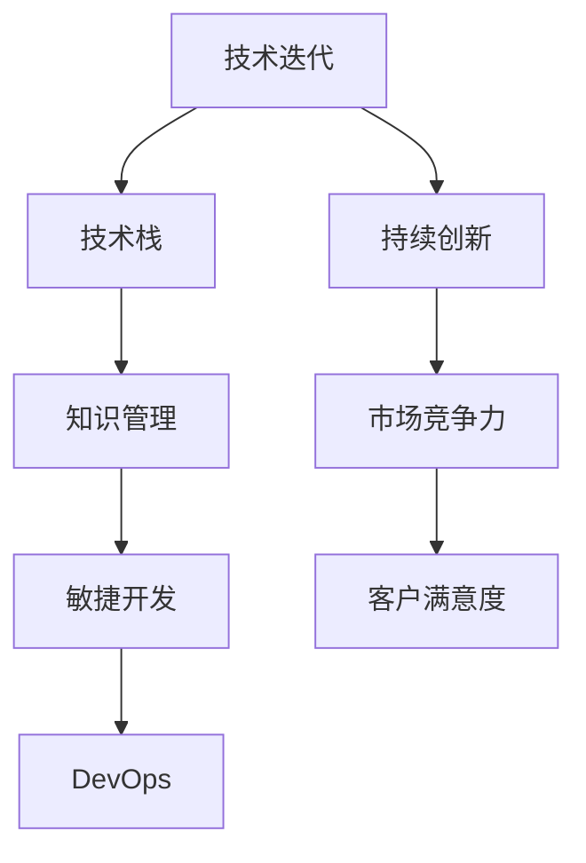

                 

## 1. 背景介绍

### 1.1 问题由来
在当今快速变化的科技环境中，AI创业公司面临着前所未有的挑战。技术的迅猛发展要求企业能够快速响应市场变化，紧跟技术潮流。然而，技术迭代带来的知识更新和技能升级，使得企业的人力资源和组织结构面临巨大压力。

### 1.2 问题核心关键点
AI创业公司如何在技术迭代中保持竞争力？如何高效管理知识更新和技能升级？如何将新技术快速应用到产品和服务中？这些问题已经成为众多AI创业公司亟需解决的难题。

### 1.3 问题研究意义
有效应对技术迭代，不仅有助于企业保持市场竞争力，还能提升产品创新能力和用户体验，从而赢得更高的市场份额和客户满意度。因此，本文旨在探讨AI创业公司如何通过技术迭代，实现持续增长和创新。

## 2. 核心概念与联系

### 2.1 核心概念概述

在探讨如何应对技术迭代之前，我们先需理解几个核心概念：

- **技术迭代（Technology Iteration）**：指通过持续的技术改进和升级，不断提升产品和服务的技术水平和性能。
- **技术栈（Technical Stack）**：指企业使用的所有软件技术和工具的集合，包括编程语言、框架、数据库、云服务等。
- **知识管理（Knowledge Management）**：指如何有效管理和利用企业内部和外部的知识资源，促进知识和技能的高效传递。
- **敏捷开发（Agile Development）**：一种快速响应市场变化的软件开发方法，强调灵活性和持续改进。
- **DevOps（Development Operations）**：一种将软件开发和运维集成的工程文化，旨在提升生产效率和产品交付速度。

这些概念之间的联系可以通过以下Mermaid流程图来展示：



这个流程图展示了技术迭代如何通过技术栈、知识管理、敏捷开发和DevOps，最终实现持续创新、提升市场竞争力和客户满意度。

## 3. 核心算法原理 & 具体操作步骤
### 3.1 算法原理概述

技术迭代的本质是通过不断优化和升级现有技术，引入新技术或创新方法，以提升产品或服务的性能和竞争力。这一过程涉及到技术选型、知识迁移、技能提升等多个环节。

在AI创业公司中，技术迭代主要通过以下步骤实现：

1. **需求分析**：收集用户反馈和市场需求，明确技术迭代的优先级和目标。
2. **技术评估**：评估现有技术栈，确定需要引入或升级的新技术。
3. **知识迁移**：将新知识和方法整合到现有技术栈中，并培训团队掌握新技能。
4. **敏捷开发**：采用敏捷开发方法，快速迭代开发新功能和改进现有功能。
5. **DevOps实践**：通过DevOps流程，实现快速部署和持续集成，提升产品交付速度和稳定性。

### 3.2 算法步骤详解

以下详细讲解技术迭代的具体操作步骤：

**Step 1: 需求分析**

需求分析是技术迭代的第一步。创业公司需要建立明确的需求收集机制，可以通过以下几种方式：

- **用户调研**：通过问卷调查、用户访谈等方式，了解用户需求和使用痛点。
- **数据分析**：利用用户行为数据和市场趋势，挖掘潜在需求和改进点。
- **竞品分析**：研究竞争对手的产品和技术，发现差距和优势。

需求分析后，需要明确技术迭代的目标和优先级。通常采用MoSCoW方法（Must have, Should have, Could have, Won't have），将需求分类为必须、应该、可以、不必的功能。

**Step 2: 技术评估**

技术评估旨在评估现有技术栈，确定需要引入或升级的新技术。创业公司可以采用以下方法：

- **技术选型评估**：根据功能需求和性能要求，评估现有技术和候选技术的优缺点。
- **成本效益分析**：计算引入新技术所需的成本和预期收益，确保技术选型具有合理性。
- **风险评估**：评估新技术引入可能带来的风险，包括技术失败、成本超支等。

**Step 3: 知识迁移**

知识迁移是技术迭代的核心环节，指将新知识和方法整合到现有技术栈中，并培训团队掌握新技能。具体步骤如下：

- **文档编写**：编写详细的技术文档和使用指南，记录新知识的实现细节和应用场景。
- **内部培训**：组织内部培训和技术分享会，邀请专家或资深工程师讲解新知识。
- **实践演练**：在实际项目中引入新技术，通过实践掌握新技能。

**Step 4: 敏捷开发**

敏捷开发强调快速响应市场需求，采用迭代开发方式，快速迭代新功能和改进现有功能。具体步骤如下：

- **制定计划**：根据需求优先级，制定迭代计划和里程碑。
- **用户故事**：编写详细的用户故事和任务清单，明确每个迭代的任务和目标。
- **迭代开发**：采用Scrum或Kanban等敏捷方法，快速迭代开发和测试新功能。
- **持续集成**：通过持续集成工具，实现代码自动化构建和测试，提高开发效率。

**Step 5: DevOps实践**

DevOps实践旨在通过自动化流程和持续集成，实现快速部署和持续改进。具体步骤如下：

- **自动化部署**：使用CI/CD工具，实现自动化部署和测试，减少手工操作和人为错误。
- **监控和反馈**：建立实时监控和反馈机制，及时发现和解决生产问题。
- **持续改进**：根据用户反馈和系统日志，持续改进产品和服务，提升用户体验。

### 3.3 算法优缺点

技术迭代具有以下优点：

- **快速响应市场变化**：通过持续优化和升级，快速响应市场需求，保持市场竞争力。
- **提升产品性能**：引入新技术和新方法，提升产品性能和用户体验。
- **促进创新**：通过技术迭代，不断探索新的技术和应用场景，推动企业创新。

然而，技术迭代也存在以下缺点：

- **成本高**：引入新技术和知识迁移可能需要高昂的成本和大量人力投入。
- **风险高**：技术选型和升级存在失败风险，可能导致时间和成本损失。
- **管理复杂**：技术栈和知识库的复杂性增加，管理难度提升。

尽管存在这些缺点，但就目前而言，技术迭代仍是大企业保持竞争力和市场地位的重要手段。未来相关研究的重点在于如何降低技术迭代成本和风险，提高管理效率和成功率。

### 3.4 算法应用领域

技术迭代方法在AI创业公司中得到了广泛应用，覆盖了从产品开发到运维管理的多个环节。例如：

- **产品开发**：通过持续迭代，开发新功能和改进现有功能，提升用户体验和市场竞争力。
- **运维管理**：通过DevOps实践，实现快速部署和持续集成，提升系统稳定性和用户满意度。
- **知识管理**：通过知识迁移和内部培训，促进知识和技能的高效传递，提升团队专业水平。

## 4. 数学模型和公式 & 详细讲解 & 举例说明

### 4.1 数学模型构建

技术迭代的过程可以通过数学模型进行建模和分析。假设创业公司有N个技术选型，每个技术i的收益为R_i，成本为C_i，风险为R_i。设当前技术栈中已有的技术为T_0，引入新技术i后的技术栈为T_i。引入新技术后的收益、成本和风险变化分别为△R_i、△C_i和△R_i。则技术迭代后的总收益、总成本和总风险分别为：

$$
R_{total} = \sum_{i=1}^N R_i + \Delta R_i
$$
$$
C_{total} = \sum_{i=1}^N C_i + \Delta C_i
$$
$$
R_{total} = \sum_{i=1}^N R_i + \Delta R_i
$$

技术迭代的目标是最大化总收益，最小化总成本和总风险。

### 4.2 公式推导过程

通过求解最大化总收益、最小化总成本和总风险的目标函数，可以得到最优技术选型。具体推导如下：

设权重系数λ1、λ2、λ3分别表示收益、成本和风险的重要性，则目标函数为：

$$
f(T_i) = \lambda_1 R_{total} + \lambda_2 C_{total} + \lambda_3 R_{total}
$$

对于每个技术i，其引入后的收益、成本和风险变化分别为△R_i、△C_i和△R_i。因此，引入技术i后的总收益、总成本和总风险分别为：

$$
R_i' = R_i + \lambda_1 \Delta R_i
$$
$$
C_i' = C_i + \lambda_2 \Delta C_i
$$
$$
R_i' = R_i + \lambda_3 \Delta R_i
$$

通过求解目标函数的最大值和最小值，可以得到最优技术选型T_i。具体求解过程较为复杂，涉及线性规划和动态规划等算法，此处不再展开。

### 4.3 案例分析与讲解

假设某AI创业公司面临以下技术选型：

- 技术A：开发成本为100万美元，年收益为200万美元，风险系数为0.2。
- 技术B：开发成本为150万美元，年收益为250万美元，风险系数为0.3。
- 技术C：开发成本为200万美元，年收益为300万美元，风险系数为0.1。

公司当前技术栈收益为150万美元，成本为100万美元，风险系数为0.4。假设收益、成本和风险的重要性权重分别为0.5、0.3、0.2。

通过上述公式推导过程，可以得到引入技术A、B、C后的总收益、总成本和总风险，进而得到最优技术选型T_i。

## 5. 项目实践：代码实例和详细解释说明

### 5.1 开发环境搭建

在进行技术迭代实践前，我们需要准备好开发环境。以下是使用Python进行Pipenv开发的环境配置流程：

1. 安装Anaconda：从官网下载并安装Anaconda，用于创建独立的Python环境。

2. 创建并激活虚拟环境：
```bash
conda create -n pyenv python=3.8 
conda activate pyenv
```

3. 安装Pipenv：
```bash
pip install pipenv
```

4. 安装必要的Python包：
```bash
pipenv install numpy pandas scikit-learn requests
```

5. 安装必要的第三方库：
```bash
pipenv install git+https://github.com/your-repo/your-project.git
```

完成上述步骤后，即可在`pyenv`环境中开始技术迭代实践。

### 5.2 源代码详细实现

下面我们以某AI创业公司的技术迭代项目为例，给出使用Pipenv进行技术迭代管理系统的开发和部署的详细代码实现。

首先，定义技术选型类：

```python
from typing import Dict

class TechOption:
    def __init__(self, name: str, cost: float, revenue: float, risk: float):
        self.name = name
        self.cost = cost
        self.revenue = revenue
        self.risk = risk
        self.revenue_delta = 0
        self.cost_delta = 0
        self.risk_delta = 0

    def update_revenue(self, delta: float):
        self.revenue_delta += delta

    def update_cost(self, delta: float):
        self.cost_delta += delta

    def update_risk(self, delta: float):
        self.risk_delta += delta

    def get_total_revenue(self):
        return self.revenue + self.revenue_delta

    def get_total_cost(self):
        return self.cost + self.cost_delta

    def get_total_risk(self):
        return self.risk + self.risk_delta
```

然后，定义技术栈类：

```python
from typing import Dict, List

class TechStack:
    def __init__(self, options: Dict[str, TechOption]):
        self.options = options
        self.current = None

    def select_tech(self, option_name: str):
        if option_name not in self.options:
            raise ValueError(f"{option_name} not in options")

        self.current = self.options[option_name]

    def get_total_revenue(self):
        return sum(option.get_total_revenue() for option in self.options.values())

    def get_total_cost(self):
        return sum(option.get_total_cost() for option in self.options.values())

    def get_total_risk(self):
        return sum(option.get_total_risk() for option in self.options.values())
```

接着，定义收益、成本和风险的权重系数：

```python
weights = {
    'revenue': 0.5,
    'cost': 0.3,
    'risk': 0.2
}
```

最后，编写技术迭代决策函数：

```python
from typing import Dict

def make_decision(stacks: TechStack, options: Dict[str, TechOption]):
    current = stacks.current

    for option_name, option in options.items():
        option.update_revenue(option.revenue)
        option.update_cost(option.cost)
        option.update_risk(option.risk)

    scores = {
        option_name: weights['revenue'] * option.get_total_revenue() + 
                      weights['cost'] * option.get_total_cost() + 
                      weights['risk'] * option.get_total_risk()
        for option_name, option in options.items()
    }

    return max(scores, key=scores.get)
```

## 6. 实际应用场景
### 6.1 智能推荐系统

技术迭代在智能推荐系统中的应用，主要体现在新算法的引入和优化上。通过持续的技术迭代，推荐系统可以不断提升推荐效果和用户满意度。

具体而言，技术迭代过程包括：

- **需求分析**：收集用户反馈和行为数据，明确推荐系统需要优化的方向。
- **技术评估**：评估现有推荐算法和新技术（如深度学习、强化学习等）的优劣。
- **知识迁移**：将新算法和模型的实现细节整合到现有推荐系统中，并通过内部培训和技术分享会，提升团队技术水平。
- **敏捷开发**：采用敏捷方法，快速迭代开发和测试新算法，实现推荐功能升级。
- **DevOps实践**：通过持续集成和自动化部署，确保新算法快速上线和稳定运行。

技术迭代使得智能推荐系统能够快速响应用户需求变化，提升推荐准确性和多样性，从而提升用户满意度。

### 6.2 自然语言处理

自然语言处理（NLP）领域的技术迭代，主要体现在语言模型和算法优化上。通过持续的技术迭代，NLP系统可以不断提升自然语言理解和生成的能力。

具体而言，技术迭代过程包括：

- **需求分析**：收集用户反馈和业务需求，明确NLP系统需要优化的方向。
- **技术评估**：评估现有语言模型和算法（如BERT、GPT等）的性能和效率。
- **知识迁移**：将新语言模型和算法的实现细节整合到现有系统中，并通过内部培训和技术分享会，提升团队技术水平。
- **敏捷开发**：采用敏捷方法，快速迭代开发和测试新算法，实现语言处理功能升级。
- **DevOps实践**：通过持续集成和自动化部署，确保新算法快速上线和稳定运行。

技术迭代使得NLP系统能够快速响应用户需求变化，提升自然语言理解和生成的准确性和多样性，从而提升用户体验。

### 6.3 智能客服

智能客服系统的技术迭代，主要体现在对话算法和知识库的优化上。通过持续的技术迭代，智能客服系统可以不断提升对话效果和用户体验。

具体而言，技术迭代过程包括：

- **需求分析**：收集用户反馈和业务需求，明确智能客服系统需要优化的方向。
- **技术评估**：评估现有对话算法和知识库的性能和覆盖率。
- **知识迁移**：将新对话算法和知识库整合到现有系统中，并通过内部培训和技术分享会，提升团队技术水平。
- **敏捷开发**：采用敏捷方法，快速迭代开发和测试新算法，实现对话功能升级。
- **DevOps实践**：通过持续集成和自动化部署，确保新算法快速上线和稳定运行。

技术迭代使得智能客服系统能够快速响应用户需求变化，提升对话效果和用户体验，从而提升用户满意度。

### 6.4 未来应用展望

随着技术的不断进步，技术迭代在更多领域将得到应用，带来更大的创新和变革。

在智慧医疗领域，通过技术迭代，可以实现更精准的疾病诊断和智能推荐，提升医疗服务的智能化水平，辅助医生诊疗，加速新药开发进程。

在智能教育领域，通过技术迭代，可以实现更个性化的学习推荐和学情分析，因材施教，促进教育公平，提高教学质量。

在智慧城市治理中，通过技术迭代，可以实现更智能的城市事件监测和应急指挥，提高城市管理的自动化和智能化水平，构建更安全、高效的未来城市。

此外，在企业生产、社会治理、文娱传媒等众多领域，技术迭代也将不断涌现，为传统行业数字化转型升级提供新的技术路径。相信随着技术的日益成熟，技术迭代方法将进一步提升人工智能技术的落地应用和创新能力。

## 7. 工具和资源推荐
### 7.1 学习资源推荐

为了帮助开发者系统掌握技术迭代方法的理论基础和实践技巧，这里推荐一些优质的学习资源：

1. **《敏捷软件开发：原则、模式与实践》**：Eric Freeman和Elisabeth Freeman所著，详细介绍了敏捷开发的核心原则和实践方法，适合技术迭代初学者阅读。

2. **《DevOps实践指南》**：Gene Kim、Patrick Debois和John Willis所著，全面介绍了DevOps的核心理念和最佳实践，适合技术迭代管理者和实践者阅读。

3. **《深入理解计算机系统》**：Randal E. Bryant和David R. O'Hallaron所著，详细介绍了计算机系统和编程语言的基础知识，适合技术迭代开发者阅读。

4. **《软件工程：原则与实践》**：Robert C. Martin所著，介绍了软件工程的基础原则和实践方法，适合技术迭代开发者阅读。

5. **Coursera的《软件工程与设计》课程**：由斯坦福大学开设，系统介绍了软件工程的基础知识和实践方法，适合技术迭代开发者学习。

通过对这些资源的学习实践，相信你一定能够快速掌握技术迭代方法的精髓，并用于解决实际的业务问题。

### 7.2 开发工具推荐

高效的开发离不开优秀的工具支持。以下是几款用于技术迭代开发的常用工具：

1. **JIRA**：一款流行的项目管理工具，支持敏捷开发和任务管理，适合技术迭代项目的使用。

2. **GitLab**：一款集成了代码托管、CI/CD和DevOps实践的平台，适合技术迭代项目的管理和部署。

3. **Confluence**：一款团队协作和知识管理工具，适合技术迭代项目的文档管理和团队协作。

4. **Jenkins**：一款开源的CI/CD工具，支持持续集成和自动化部署，适合技术迭代项目的自动化测试和部署。

5. **Ansible**：一款自动化配置和运维工具，适合技术迭代项目的系统部署和配置管理。

合理利用这些工具，可以显著提升技术迭代任务的开发效率，加快创新迭代的步伐。

### 7.3 相关论文推荐

技术迭代方法的研究源于学界的持续研究。以下是几篇奠基性的相关论文，推荐阅读：

1. **《敏捷软件开发：原则、模式与实践》**：Martin所著，详细介绍了敏捷开发的核心原则和实践方法，适合技术迭代开发者阅读。

2. **《软件工程的演变：在实践中探索开发之道》**：J.orgarie、E.Knapp和B.Cockburn所著，全面介绍了软件工程的演变和实践方法，适合技术迭代管理者阅读。

3. **《DevOps：软件开发生命周期自动化实践》**：Andy Wilkinson所著，介绍了DevOps的核心理念和最佳实践，适合技术迭代管理者阅读。

4. **《通过DevOps实现持续交付：加速软件开发》**：J.Pattison和J.Nevill-Manning所著，介绍了DevOps的核心理念和最佳实践，适合技术迭代管理者阅读。

这些论文代表了大企业技术迭代方法的发展脉络。通过学习这些前沿成果，可以帮助研究者把握学科前进方向，激发更多的创新灵感。

## 8. 总结：未来发展趋势与挑战

### 8.1 总结

本文对AI创业公司如何应对技术迭代进行了全面系统的介绍。首先阐述了技术迭代在快速变化的市场环境中的重要性，明确了需求分析、技术评估、知识迁移、敏捷开发和DevOps等关键环节。其次，从理论到实践，详细讲解了技术迭代的数学模型和详细步骤，给出了技术迭代项目开发的完整代码实例。同时，本文还广泛探讨了技术迭代在智能推荐、自然语言处理、智能客服等多个领域的应用前景，展示了技术迭代范式的巨大潜力。

通过本文的系统梳理，可以看到，技术迭代方法正在成为AI创业公司的重要手段，极大地提升了产品创新能力和用户体验，从而赢得更高的市场份额和客户满意度。未来，伴随技术迭代方法的不断演进，相信AI创业公司将能够更灵活地响应市场变化，保持竞争力，实现持续增长和创新。

### 8.2 未来发展趋势

展望未来，技术迭代方法将呈现以下几个发展趋势：

1. **人工智能与技术迭代的深度融合**：未来技术迭代将更深入地结合人工智能技术，如自然语言处理、机器学习等，提升系统的智能化水平。

2. **微服务架构的普及**：随着微服务架构的成熟，技术迭代将更加模块化和灵活，提升系统的可扩展性和可维护性。

3. **持续学习和适应性**：技术迭代将逐步引入持续学习和适应性技术，使系统能够不断学习和适应用户需求变化，提升系统的响应速度和灵活性。

4. **自动化和智能化管理**：通过AI和大数据技术，技术迭代将实现更高效和智能的管理，减少人工干预，提高工作效率。

5. **跨领域融合**：技术迭代将打破传统领域的界限，融合跨领域的技术和知识，提升系统的创新能力和应用广度。

这些趋势凸显了技术迭代方法的未来发展方向，为AI创业公司提供了更多创新和突破的可能性。

### 8.3 面临的挑战

尽管技术迭代方法已经取得了显著成效，但在实现过程中，仍然面临诸多挑战：

1. **知识传递和团队协作**：技术迭代过程中，需要高效的团队协作和知识传递，这对团队的专业化和沟通能力提出了较高要求。

2. **技术选型和风险控制**：技术选型和升级存在失败风险，可能带来时间和成本损失。如何合理评估和控制风险，需要进一步的研究和实践。

3. **自动化和智能化的管理**：技术迭代管理需要引入更多的自动化和智能化手段，提升管理效率，降低人工干预。

4. **跨领域融合和知识整合**：技术迭代过程中，需要将不同领域的知识和技能进行有效整合，这需要跨领域的专业知识和沟通能力。

5. **市场变化的不确定性**：市场变化的不确定性可能导致技术迭代方向偏离预期，需要灵活调整和快速响应。

这些挑战需要在未来的实践中逐步克服，才能更好地推动技术迭代方法的持续发展和应用。

### 8.4 研究展望

未来的技术迭代研究需要在以下几个方面寻求新的突破：

1. **自动化和智能化管理**：研究更高效和智能的技术迭代管理方法，如自动化测试、智能决策等，提升管理效率和成功率。

2. **跨领域融合**：研究跨领域的技术和知识融合方法，促进不同领域的技术迭代协同发展，提升系统的创新能力和应用广度。

3. **持续学习和适应性**：研究持续学习和适应性技术，使系统能够不断学习和适应用户需求变化，提升系统的响应速度和灵活性。

4. **微服务架构**：研究微服务架构的技术迭代方法，提升系统的可扩展性和可维护性，适应复杂的业务需求。

5. **AI和大数据的应用**：研究AI和大数据技术在技术迭代中的应用，提升系统的智能化水平和数据分析能力。

这些研究方向的探索，将引领技术迭代方法迈向更高的台阶，为AI创业公司提供更多的创新和突破的可能性。

## 9. 附录：常见问题与解答

**Q1: 技术迭代过程中如何确保团队协作和知识传递？**

A: 技术迭代过程中，高效的团队协作和知识传递至关重要。以下是一些有效的方法：

1. **敏捷开发方法**：采用Scrum、Kanban等敏捷方法，快速迭代开发和测试新功能，提升团队协作效率。
2. **知识库和文档管理**：建立知识库和文档管理系统，记录和共享技术文档、开发指南和案例分析，促进知识传递和复用。
3. **内部培训和技术分享会**：定期举办内部培训和技术分享会，邀请专家或资深工程师讲解新技术和方法，提升团队技术水平。
4. **跨部门协作**：建立跨部门的协作机制，促进不同部门之间的知识交流和协作，提升整体技术能力。

**Q2: 技术迭代过程中如何评估和控制技术选型的风险？**

A: 技术选型和升级存在失败风险，可能带来时间和成本损失。以下是一些有效的方法：

1. **技术选型评估**：通过技术选型评估，评估现有技术和候选技术的优劣，选择合适的技术选型。
2. **小规模试点**：在全面引入新技术前，进行小规模试点测试，评估其可行性和效果，降低风险。
3. **风险管理**：建立风险管理机制，识别技术选型和升级可能带来的风险，并制定相应的应对措施。
4. **持续监控和反馈**：建立持续监控和反馈机制，及时发现和解决生产问题，提升系统的稳定性和可靠性。

**Q3: 技术迭代过程中如何提升管理效率和成功率？**

A: 技术迭代过程中，提升管理效率和成功率是关键。以下是一些有效的方法：

1. **自动化测试和持续集成**：通过自动化测试和持续集成工具，提升开发效率和代码质量，减少手工操作和人为错误。
2. **DevOps实践**：通过DevOps流程，实现快速部署和持续集成，提升产品交付速度和稳定性。
3. **自动化管理工具**：使用自动化管理工具，如JIRA、Confluence等，提升项目管理和知识传递效率。
4. **敏捷开发方法**：采用敏捷开发方法，快速迭代开发和测试新功能，提升团队协作效率。

通过这些方法，可以显著提升技术迭代过程的管理效率和成功率，降低成本和风险，提升系统的稳定性和可靠性。

**Q4: 技术迭代过程中如何处理市场变化的不确定性？**

A: 市场变化的不确定性可能导致技术迭代方向偏离预期，需要灵活调整和快速响应。以下是一些有效的方法：

1. **快速响应机制**：建立快速响应机制，根据市场变化及时调整技术迭代方向和优先级，快速响应市场需求。
2. **数据驱动决策**：通过数据分析和市场调研，获取真实的需求变化，制定数据驱动的决策策略。
3. **用户反馈机制**：建立用户反馈机制，及时获取用户意见和建议，调整技术迭代方向和优先级。
4. **持续学习和适应性**：引入持续学习和适应性技术，使系统能够不断学习和适应用户需求变化，提升系统的响应速度和灵活性。

这些方法可以帮助技术迭代过程更好地应对市场变化的不确定性，保持系统的灵活性和适应性。

---

作者：禅与计算机程序设计艺术 / Zen and the Art of Computer Programming

