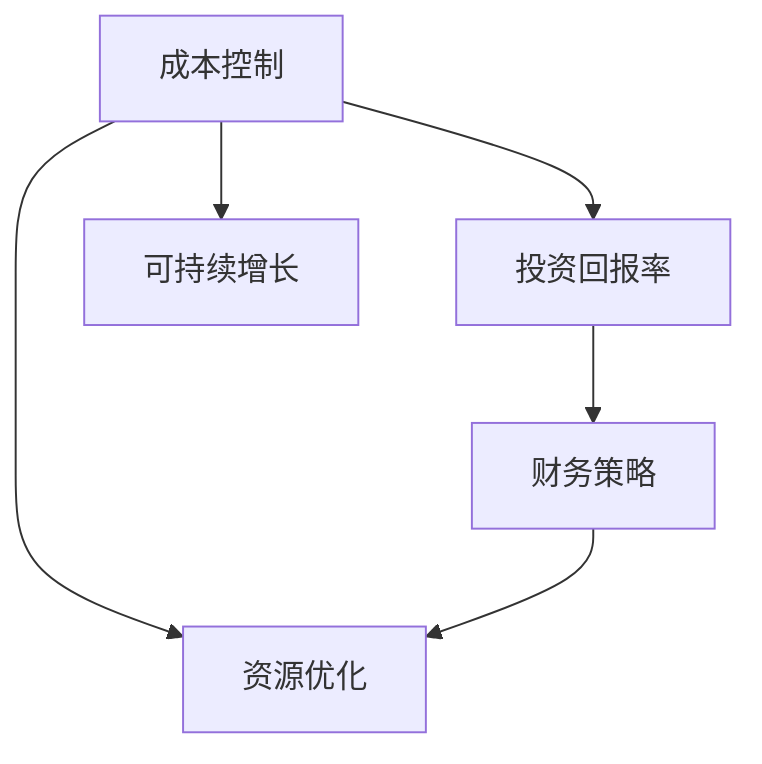

                 

# AI创业公司的成本控制策略设计

> 关键词：成本控制, AI创业公司, 资源优化, 投资回报率, 可持续增长

## 1. 背景介绍

在当今这个竞争激烈的技术领域中，AI创业公司面临着前所未有的机遇与挑战。一方面，人工智能技术的应用领域日益广泛，市场潜力巨大，吸引了无数企业和资本的关注。另一方面，高昂的研发成本、数据获取难度、技术壁垒等诸多因素，也使得AI创业公司难以快速实现盈利。如何有效控制成本，实现稳健的可持续发展，是AI创业公司必须面对的核心问题之一。本文将深入探讨AI创业公司在成本控制方面的策略设计，为企业发展提供有力参考。

### 1.1 问题由来

AI创业公司的成本结构与传统企业有所不同。相比于传统行业，AI创业公司更依赖于数据和算法，而非生产成本。但在数据获取、算法研究、模型部署等各个环节，都需要投入大量的资源。例如，数据收集与标注、模型训练与优化、产品开发与测试等，都是成本较高的环节。同时，AI创业公司通常处于成长期，面临着技术快速迭代和市场竞争的双重压力，如何平衡投入与回报，实现稳健增长，是创业公司必须解决的重要课题。

### 1.2 问题核心关键点

AI创业公司成本控制的根本在于平衡资源投入与产出，实现投资回报率的最大化。具体而言，需要关注以下几个关键点：

- **数据成本控制**：高质量的数据获取和标注通常成本较高，如何低成本高效获取数据，是成本控制的重要环节。
- **算法优化与效率提升**：算法优化和模型压缩是提升模型效率的关键，需要在保证性能的同时，优化算力使用。
- **产品迭代与市场响应**：及时响应市场需求，快速迭代产品，是保持竞争优势的关键。
- **人力成本与团队管理**：高效的人才管理、合理的薪酬激励，是提高团队产出与士气的关键。
- **资本运作与投资回报**：准确评估项目的投资回报期，合理规划资金使用，是确保可持续增长的基础。

### 1.3 问题研究意义

成本控制对AI创业公司的生存与发展至关重要。合理控制成本，不仅能够降低初创阶段的资金压力，还能为后续的增长提供坚实的财务保障。良好的成本控制策略，可以帮助企业提升投资回报率，吸引更多的投资，同时保障企业长期稳健发展。

## 2. 核心概念与联系

### 2.1 核心概念概述

为了更好地理解AI创业公司的成本控制策略，本节将介绍几个关键概念，并探讨它们之间的联系。

- **成本控制(Cost Control)**：通过优化资源配置和使用，减少不必要的开支，实现资源的最高效利用，提升投资回报率。
- **AI创业公司(AI Start-up)**：以人工智能技术为核心竞争力，专注于提供技术解决方案的公司。
- **资源优化(Resource Optimization)**：通过合理分配和利用资源，最大化资源利用效率，减少浪费。
- **投资回报率(ROI, Return on Investment)**：衡量投资效果的指标，反映了投入与产出的比率。
- **可持续增长(Sustainable Growth)**：企业保持长期稳定发展的能力，通常依赖于高效成本控制与稳健的财务策略。

这些概念通过以下Mermaid流程图相联系：



该流程图展示了成本控制如何通过资源优化和财务策略，最终提升投资回报率和保障可持续增长。

## 3. 核心算法原理 & 具体操作步骤
### 3.1 算法原理概述

AI创业公司的成本控制策略设计，可以从资源管理、财务规划、市场响应等多个维度进行优化。核心思想在于通过系统化的资源配置和流程优化，提升整体运营效率，减少不必要的支出。

具体来说，成本控制的算法原理可以概括为以下几个步骤：

1. **数据成本控制**：通过数据预处理和算法优化，减少数据标注和获取成本。
2. **算法效率提升**：采用高效的算法和模型架构，减少计算资源消耗。
3. **产品迭代优化**：通过敏捷开发和持续集成，快速响应市场需求，提升产品竞争力。
4. **人力成本管理**：通过科学的薪酬激励和团队管理，提升团队产出和士气。
5. **资本运作策略**：通过合理的财务规划和投资回报率评估，确保资金的合理使用。

### 3.2 算法步骤详解

以下是详细的成本控制算法步骤：

**Step 1: 数据成本控制**
- **数据预处理**：通过数据清洗、特征选择等预处理步骤，提高数据质量，减少无效标注。
- **算法优化**：采用模型压缩、参数共享等技术，减少计算资源消耗。
- **开源数据利用**：利用公开数据集，降低数据获取成本。

**Step 2: 算法效率提升**
- **模型压缩**：通过剪枝、量化等技术，减少模型大小，提高推理速度。
- **分布式训练**：采用多机分布式训练，提升计算效率。
- **算法选择**：选择高效的算法和模型架构，优化计算资源使用。

**Step 3: 产品迭代优化**
- **敏捷开发**：采用敏捷开发方法，快速响应市场需求，迭代优化产品。
- **持续集成(CI)**：通过持续集成工具，提高代码质量和开发效率。
- **A/B测试**：通过A/B测试，评估新功能的效果，优化产品设计。

**Step 4: 人力成本管理**
- **绩效考核**：建立科学的绩效考核体系，激励团队成员提升产出。
- **培训与发展**：定期进行技能培训，提升团队能力。
- **人才管理**：优化人才招聘和留用策略，降低人力成本。

**Step 5: 资本运作策略**
- **投资回报期评估**：通过精确的财务模型，评估项目的投资回报期，合理规划资金使用。
- **资本运作策略**：采用风险投资、私募股权等多样化的融资方式，降低资金压力。

### 3.3 算法优缺点

AI创业公司成本控制的算法具有以下优点：

- **提升效率**：通过优化资源配置和使用，提高整体运营效率，减少不必要的支出。
- **灵活调整**：根据市场变化和资源需求，灵活调整策略，实现动态优化。
- **降低风险**：科学评估投资回报，合理规划资金使用，降低企业运营风险。

同时，这些算法也存在一些局限性：

- **复杂度高**：涉及多个维度的资源管理和策略调整，实现难度较大。
- **数据依赖**：依赖高质量的数据和算法，数据获取和标注成本较高。
- **动态变化**：市场和技术环境不断变化，策略需要及时调整，增加了复杂性。

### 3.4 算法应用领域

AI创业公司的成本控制策略，适用于以下领域：

- **金融科技**：通过高效的数据处理和算法优化，降低运营成本，提高投资回报率。
- **医疗健康**：通过科学的人才管理和资金使用，保障医疗服务的稳定性和高效性。
- **智能制造**：通过优化供应链管理和生产流程，降低生产成本，提升产品质量。
- **电子商务**：通过敏捷开发和市场响应，快速迭代产品，提升用户体验和市场竞争力。

## 4. 数学模型和公式 & 详细讲解 & 举例说明

### 4.1 数学模型构建

为了更好地理解AI创业公司成本控制的数学模型，本节将介绍几个关键数学公式和概念。

假设AI创业公司每年需要投入的总成本为 $C$，其中数据成本、算法成本、人力成本、资本成本分别为 $C_{data}$、$C_{algo}$、$C_{people}$ 和 $C_{capital}$。设年营业收入为 $R$，投资回报率为 $ROI$，则成本控制的数学模型可以表示为：

$$
ROI = \frac{R - C}{C}
$$

其中，$ROI$ 表示投资回报率，$R$ 表示年营业收入，$C$ 表示总成本。通过最大化 $ROI$，可以实现成本控制的目标。

### 4.2 公式推导过程

以下是对上述数学模型的推导过程：

设年营业收入为 $R$，数据成本为 $C_{data}$，算法成本为 $C_{algo}$，人力成本为 $C_{people}$，资本成本为 $C_{capital}$。则总成本 $C$ 可以表示为：

$$
C = C_{data} + C_{algo} + C_{people} + C_{capital}
$$

投资回报率 $ROI$ 可以表示为：

$$
ROI = \frac{R - C}{C}
$$

化简得到：

$$
ROI = \frac{R}{C} - 1
$$

通过最大化 $ROI$，可以最大化投资回报率，实现成本控制的目标。

### 4.3 案例分析与讲解

以一家医疗健康领域的AI创业公司为例，探讨其成本控制策略的实施过程。

**案例背景**：该公司主要通过AI技术提供健康数据分析和预测服务，需要大量高质量的医疗数据和算法模型。公司初期资金有限，面临数据标注成本高、算法研发周期长等挑战。

**成本控制策略**：

1. **数据成本控制**：采用开源数据集，降低数据获取成本。同时，通过数据预处理技术，减少无效标注，提高数据质量。

2. **算法效率提升**：采用模型压缩技术，减少模型大小和计算资源消耗。同时，选择高效的算法架构，优化计算资源使用。

3. **产品迭代优化**：采用敏捷开发方法，快速响应市场需求，迭代优化产品。通过持续集成和A/B测试，提升产品竞争力和用户体验。

4. **人力成本管理**：建立科学的绩效考核体系，激励团队成员提升产出。通过技能培训和人才管理，降低人力成本。

5. **资本运作策略**：通过精确的财务模型，评估项目的投资回报期，合理规划资金使用。采用风险投资和私募股权，降低资金压力。

通过这些策略，该公司成功控制了成本，实现了稳健增长，获得了投资者的广泛认可。

## 5. 项目实践：代码实例和详细解释说明
### 5.1 开发环境搭建

在进行成本控制策略设计时，需要搭建一个高效的开发环境。以下是使用Python进行PyTorch和TensorFlow开发的环境配置流程：

1. 安装Anaconda：从官网下载并安装Anaconda，用于创建独立的Python环境。

2. 创建并激活虚拟环境：
```bash
conda create -n pytorch-env python=3.8 
conda activate pytorch-env
```

3. 安装PyTorch和TensorFlow：根据CUDA版本，从官网获取对应的安装命令。例如：
```bash
conda install pytorch torchvision torchaudio cudatoolkit=11.1 -c pytorch -c conda-forge
```

4. 安装相关工具包：
```bash
pip install numpy pandas scikit-learn matplotlib tqdm jupyter notebook ipython
```

完成上述步骤后，即可在`pytorch-env`环境中开始成本控制策略的开发实践。

### 5.2 源代码详细实现

下面我们以数据成本控制为例，给出使用Python进行数据预处理和模型压缩的代码实现。

首先，定义数据预处理函数：

```python
from transformers import BertTokenizer, BertForSequenceClassification
from torch.utils.data import DataLoader, Dataset
import torch
import numpy as np

class TextDataset(Dataset):
    def __init__(self, texts, labels, tokenizer):
        self.texts = texts
        self.labels = labels
        self.tokenizer = tokenizer
        
    def __len__(self):
        return len(self.texts)
    
    def __getitem__(self, item):
        text = self.texts[item]
        label = self.labels[item]
        
        encoding = self.tokenizer(text, return_tensors='pt', padding=True, truncation=True, max_length=256)
        input_ids = encoding['input_ids'][0]
        attention_mask = encoding['attention_mask'][0]
        label = torch.tensor(label, dtype=torch.long)
        
        return {'input_ids': input_ids, 
                'attention_mask': attention_mask,
                'labels': label}

# 数据预处理
tokenizer = BertTokenizer.from_pretrained('bert-base-cased')

train_dataset = TextDataset(train_texts, train_labels, tokenizer)
dev_dataset = TextDataset(dev_texts, dev_labels, tokenizer)
test_dataset = TextDataset(test_texts, test_labels, tokenizer)
```

然后，定义模型和优化器：

```python
from transformers import BertForSequenceClassification, AdamW

model = BertForSequenceClassification.from_pretrained('bert-base-cased', num_labels=2)

optimizer = AdamW(model.parameters(), lr=2e-5)
```

接着，定义训练和评估函数：

```python
from tqdm import tqdm

device = torch.device('cuda') if torch.cuda.is_available() else torch.device('cpu')
model.to(device)

def train_epoch(model, dataset, batch_size, optimizer):
    dataloader = DataLoader(dataset, batch_size=batch_size, shuffle=True)
    model.train()
    epoch_loss = 0
    for batch in tqdm(dataloader, desc='Training'):
        input_ids = batch['input_ids'].to(device)
        attention_mask = batch['attention_mask'].to(device)
        labels = batch['labels'].to(device)
        model.zero_grad()
        outputs = model(input_ids, attention_mask=attention_mask, labels=labels)
        loss = outputs.loss
        epoch_loss += loss.item()
        loss.backward()
        optimizer.step()
    return epoch_loss / len(dataloader)

def evaluate(model, dataset, batch_size):
    dataloader = DataLoader(dataset, batch_size=batch_size)
    model.eval()
    preds, labels = [], []
    with torch.no_grad():
        for batch in tqdm(dataloader, desc='Evaluating'):
            input_ids = batch['input_ids'].to(device)
            attention_mask = batch['attention_mask'].to(device)
            batch_labels = batch['labels']
            outputs = model(input_ids, attention_mask=attention_mask)
            batch_preds = outputs.logits.argmax(dim=1).to('cpu').tolist()
            batch_labels = batch_labels.to('cpu').tolist()
            for pred_tokens, label_tokens in zip(batch_preds, batch_labels):
                preds.append(pred_tokens)
                labels.append(label_tokens)
                
    print(classification_report(labels, preds))
```

最后，启动训练流程并在测试集上评估：

```python
epochs = 5
batch_size = 16

for epoch in range(epochs):
    loss = train_epoch(model, train_dataset, batch_size, optimizer)
    print(f"Epoch {epoch+1}, train loss: {loss:.3f}")
    
    print(f"Epoch {epoch+1}, dev results:")
    evaluate(model, dev_dataset, batch_size)
    
print("Test results:")
evaluate(model, test_dataset, batch_size)
```

以上就是使用PyTorch进行数据预处理和模型压缩的完整代码实现。可以看到，利用PyTorch和Transformers库，代码实现变得简洁高效，开发者可以将更多精力放在成本控制策略的设计和优化上。

### 5.3 代码解读与分析

让我们再详细解读一下关键代码的实现细节：

**TextDataset类**：
- `__init__`方法：初始化文本、标签、分词器等关键组件。
- `__len__`方法：返回数据集的样本数量。
- `__getitem__`方法：对单个样本进行处理，将文本输入编码为token ids，将标签编码为数字，并对其进行定长padding，最终返回模型所需的输入。

**训练和评估函数**：
- 使用PyTorch的DataLoader对数据集进行批次化加载，供模型训练和推理使用。
- 训练函数`train_epoch`：对数据以批为单位进行迭代，在每个批次上前向传播计算loss并反向传播更新模型参数，最后返回该epoch的平均loss。
- 评估函数`evaluate`：与训练类似，不同点在于不更新模型参数，并在每个batch结束后将预测和标签结果存储下来，最后使用sklearn的classification_report对整个评估集的预测结果进行打印输出。

**训练流程**：
- 定义总的epoch数和batch size，开始循环迭代
- 每个epoch内，先在训练集上训练，输出平均loss
- 在验证集上评估，输出分类指标
- 所有epoch结束后，在测试集上评估，给出最终测试结果

可以看到，PyTorch配合Transformers库使得模型训练和评估的代码实现变得简洁高效。开发者可以将更多精力放在成本控制策略的设计和优化上。

## 6. 实际应用场景
### 6.1 智能制造

在智能制造领域，AI创业公司可以利用成本控制策略，优化供应链管理和生产流程，降低生产成本，提升产品质量和效率。具体来说，可以通过以下方式实现：

1. **数据成本控制**：利用开源数据集和预处理技术，降低数据获取成本。同时，通过数据清洗和特征选择，提高数据质量，减少无效标注。

2. **算法效率提升**：采用高效的算法和模型架构，优化计算资源使用。例如，利用深度强化学习优化生产调度，提升生产效率。

3. **产品迭代优化**：通过敏捷开发和持续集成，快速响应市场需求，迭代优化产品。例如，利用产品反馈数据，快速调整生产工艺和流程。

4. **人力成本管理**：通过科学的绩效考核体系和培训计划，提升团队产出和士气。例如，定期进行技能培训，提升生产技能和质量管理能力。

5. **资本运作策略**：通过精确的财务模型，评估项目的投资回报期，合理规划资金使用。例如，利用风险投资和私募股权，获取更多的资金支持。

通过这些措施，AI创业公司可以在智能制造领域实现高效、低成本的生产运营，提升竞争力。

### 6.2 医疗健康

在医疗健康领域，AI创业公司可以利用成本控制策略，保障医疗服务的稳定性和高效性。具体来说，可以通过以下方式实现：

1. **数据成本控制**：采用开源数据集和预处理技术，降低数据获取成本。同时，通过数据清洗和特征选择，提高数据质量，减少无效标注。

2. **算法效率提升**：采用高效的算法和模型架构，优化计算资源使用。例如，利用深度学习优化影像诊断，提升诊断速度和准确性。

3. **产品迭代优化**：通过敏捷开发和持续集成，快速响应市场需求，迭代优化产品。例如，利用患者反馈数据，快速调整医疗服务方案。

4. **人力成本管理**：通过科学的绩效考核体系和培训计划，提升团队产出和士气。例如，定期进行技能培训，提升医疗服务质量和效率。

5. **资本运作策略**：通过精确的财务模型，评估项目的投资回报期，合理规划资金使用。例如，利用政府基金和公益组织，获取更多的资金支持。

通过这些措施，AI创业公司可以在医疗健康领域实现高效、低成本的医疗服务，提升患者体验和健康水平。

### 6.3 金融科技

在金融科技领域，AI创业公司可以利用成本控制策略，降低运营成本，提高投资回报率。具体来说，可以通过以下方式实现：

1. **数据成本控制**：采用开源数据集和预处理技术，降低数据获取成本。同时，通过数据清洗和特征选择，提高数据质量，减少无效标注。

2. **算法效率提升**：采用高效的算法和模型架构，优化计算资源使用。例如，利用深度学习优化风险评估，提升贷款审批速度和准确性。

3. **产品迭代优化**：通过敏捷开发和持续集成，快速响应市场需求，迭代优化产品。例如，利用用户反馈数据，快速调整金融产品和服务。

4. **人力成本管理**：通过科学的绩效考核体系和培训计划，提升团队产出和士气。例如，定期进行技能培训，提升金融服务质量和效率。

5. **资本运作策略**：通过精确的财务模型，评估项目的投资回报期，合理规划资金使用。例如，利用风险投资和私募股权，获取更多的资金支持。

通过这些措施，AI创业公司可以在金融科技领域实现高效、低成本的金融服务，提升用户体验和金融市场的稳定性。

### 6.4 未来应用展望

随着AI创业公司的不断发展和成熟，成本控制策略的应用范围将更加广泛，形式也将更加多样。

在智慧城市领域，AI创业公司可以利用成本控制策略，优化城市管理和服务，提升居民生活质量。例如，利用数据分析和预测技术，优化交通管理，减少拥堵和污染。

在智能零售领域，AI创业公司可以利用成本控制策略，优化供应链管理和客户体验，提升销售额和客户满意度。例如，利用推荐系统和大数据分析，优化库存管理和商品推荐。

在智能教育领域，AI创业公司可以利用成本控制策略，优化教育资源配置和教学方法，提升教育质量和覆盖面。例如，利用智能辅导和个性化推荐，提升学习效果和学生满意度。

未来，随着AI创业公司的不断创新和优化，成本控制策略将成为其可持续发展的重要保障，为各行各业带来新的变革和机遇。

## 7. 工具和资源推荐
### 7.1 学习资源推荐

为了帮助AI创业公司系统掌握成本控制策略的理论基础和实践技巧，这里推荐一些优质的学习资源：

1. **《企业运营管理》**：这本书详细介绍了企业运营管理的基本概念和实践方法，包括成本控制、资源优化、财务规划等。

2. **《精益创业》**：这本书介绍了精益创业的核心理念和实践方法，通过小步快跑、快速迭代的方式，降低成本和风险。

3. **《AI商业应用案例分析》**：这本书收录了多个AI创业公司的成功案例，展示了如何通过技术创新实现成本控制和商业成功。

4. **Coursera《数据科学导论》课程**：这门课程由斯坦福大学教授主讲，介绍了数据科学的基本概念和实践方法，包括数据获取、算法优化、成本控制等。

5. **edX《人工智能伦理与社会影响》课程**：这门课程介绍了AI技术的应用伦理和潜在风险，帮助企业更好地理解和应对AI技术的社会影响。

通过这些资源的学习实践，相信你一定能够快速掌握成本控制策略的理论基础和实践技巧，为企业发展提供有力参考。

### 7.2 开发工具推荐

高效的开发离不开优秀的工具支持。以下是几款用于成本控制策略开发的常用工具：

1. **Jupyter Notebook**：免费的开源笔记本，支持Python、R等多种语言，适合进行数据处理、模型训练和结果展示。

2. **PyTorch**：基于Python的开源深度学习框架，灵活便捷，适合快速迭代研究。

3. **TensorFlow**：由Google主导开发的开源深度学习框架，生产部署方便，适合大规模工程应用。

4. **Scikit-learn**：Python数据科学库，提供了大量的机器学习算法和数据处理工具。

5. **NumPy**：Python科学计算库，提供了高效的数组计算和线性代数功能。

6. **Pandas**：Python数据处理库，提供了灵活的数据结构和数据分析工具。

合理利用这些工具，可以显著提升成本控制策略的开发效率，加快创新迭代的步伐。

### 7.3 相关论文推荐

成本控制是AI创业公司的重要研究方向之一。以下是几篇奠基性的相关论文，推荐阅读：

1. **《深度学习在供应链管理中的应用》**：这篇论文探讨了深度学习技术在供应链优化中的应用，展示了如何通过优化算法和模型架构，降低供应链成本。

2. **《敏捷开发：构建高效率的软件系统》**：这本书介绍了敏捷开发的核心理念和方法，帮助企业快速响应市场需求，提升产品质量和效率。

3. **《机器学习在金融风险评估中的应用》**：这篇论文展示了如何通过机器学习技术，优化金融风险评估，提升贷款审批速度和准确性。

4. **《AI技术的社会影响与伦理风险》**：这篇论文探讨了AI技术在社会应用中的伦理风险和潜在影响，帮助企业更好地理解和应对AI技术的社会影响。

这些论文代表了大语言模型微调技术的发展脉络。通过学习这些前沿成果，可以帮助企业更好地理解和应对AI技术的社会影响，同时优化资源配置和使用，提升投资回报率。

## 8. 总结：未来发展趋势与挑战
### 8.1 总结

本文对AI创业公司的成本控制策略进行了全面系统的介绍。首先阐述了成本控制对AI创业公司的生存与发展至关重要，明确了成本控制的核心目标。其次，从数据成本控制、算法优化与效率提升、产品迭代优化、人力成本管理和资本运作策略等多个维度，详细讲解了成本控制的算法原理和具体操作步骤。同时，本文还探讨了成本控制在智能制造、医疗健康、金融科技等多个领域的实际应用，展示了其广泛的应用前景。

通过本文的系统梳理，可以看到，成本控制策略在AI创业公司中的应用是多维度、多层次的，涉及资源配置、策略设计、技术应用等多个方面。合理的成本控制策略，不仅可以降低初创阶段的资金压力，还能为后续的增长提供坚实的财务保障，提升投资回报率，保障企业的长期稳健发展。

### 8.2 未来发展趋势

AI创业公司的成本控制策略将呈现以下几个发展趋势：

1. **多维协同优化**：未来，成本控制策略将更加注重多维度的协同优化，如数据成本控制、算法优化、产品迭代、人力管理、资本运作等。多维度的优化将使资源配置更加高效，减少不必要的浪费。

2. **数据驱动决策**：通过大数据分析和机器学习技术，实现更加精准的成本控制决策。例如，利用历史数据和模型预测，优化资源配置和使用，降低成本。

3. **智能化管理**：采用人工智能技术，实现成本控制的自动化和智能化。例如，利用智能推荐系统，优化供应链管理和生产调度。

4. **可持续发展**：未来的成本控制策略将更加注重可持续发展，关注企业社会责任和环境影响。例如，利用绿色技术和循环经济理念，提升企业经济效益和社会价值。

5. **全球化应用**：随着AI技术的全球化应用，成本控制策略也将逐步国际化。例如，通过跨国合作和资源共享，降低全球化运营成本。

以上趋势凸显了AI创业公司在成本控制策略方面的广阔前景。这些方向的探索发展，必将进一步提升企业运营效率和竞争力，推动技术创新和产业升级。

### 8.3 面临的挑战

尽管成本控制策略对AI创业公司的可持续发展至关重要，但在实施过程中也面临诸多挑战：

1. **数据获取难度**：高质量的数据获取和标注通常成本较高，数据资源匮乏成为制约成本控制的重要因素。如何高效获取和利用数据，是成本控制的关键。

2. **技术复杂度高**：成本控制策略涉及多维度、多层次的资源优化和管理，实现难度较大。需要综合考虑多种因素，进行复杂的设计和优化。

3. **市场变化快**：市场需求和技术环境不断变化，成本控制策略需要及时调整和优化，增加了复杂性。

4. **伦理和风险**：AI技术的社会影响和潜在风险不可忽视，如何平衡技术创新和伦理风险，是成本控制策略需要考虑的重要问题。

5. **资金压力**：初创阶段的资金压力较大，如何合理规划资金使用，保障企业的长期可持续发展，是成本控制策略的重要课题。

6. **人才短缺**：AI领域的高技术门槛导致人才短缺，如何吸引和留住高素质人才，提升团队产出和士气，是成本控制策略的关键。

正视成本控制面临的这些挑战，积极应对并寻求突破，将是大语言模型微调技术走向成熟的必由之路。相信随着学界和产业界的共同努力，这些挑战终将一一被克服，成本控制策略必将在构建人机协同的智能时代中扮演越来越重要的角色。

### 8.4 研究展望

面对AI创业公司成本控制所面临的挑战，未来的研究需要在以下几个方面寻求新的突破：

1. **数据高效利用**：开发更加高效的数据获取和标注技术，降低数据成本，提升数据质量。例如，利用自动化标注工具和数据增强技术，优化数据处理流程。

2. **算法优化与压缩**：开发更加高效和可扩展的算法和模型架构，减少计算资源消耗。例如，利用参数共享和剪枝技术，优化模型结构和使用。

3. **产品快速迭代**：通过敏捷开发和持续集成，快速响应市场需求，迭代优化产品。例如，利用DevOps工具和持续集成平台，提升开发效率和产品质量。

4. **人才管理和激励**：建立科学的绩效考核体系和薪酬激励机制，提升团队产出和士气。例如，利用绩效评估工具和绩效管理系统，优化人才管理。

5. **资本运作策略**：采用多样化的融资方式和风险管理工具，降低资金压力，保障企业的长期稳健发展。例如，利用风险投资、私募股权、政府基金等多样化的融资渠道。

6. **伦理和社会影响**：在成本控制策略中纳入伦理和社会影响考量，保障企业社会责任和环境可持续性。例如，利用绿色技术和循环经济理念，优化资源配置和使用。

这些研究方向的探索，必将引领AI创业公司成本控制策略走向更高的台阶，为构建安全、可靠、可解释、可控的智能系统铺平道路。面向未来，成本控制策略需要与其他人工智能技术进行更深入的融合，如知识表示、因果推理、强化学习等，多路径协同发力，共同推动自然语言理解和智能交互系统的进步。

## 9. 附录：常见问题与解答

**Q1：成本控制是否适用于所有AI创业公司？**

A: 成本控制策略适用于绝大多数AI创业公司，尤其是那些处于成长期、资金压力较大的企业。通过合理的成本控制，可以降低初创阶段的资金压力，提升投资回报率，保障企业的长期稳健发展。但需要注意的是，不同的行业和企业特点不同，成本控制策略的具体实施方式也会有所不同。

**Q2：如何选择合适的学习率和优化器？**

A: 选择合适的学习率和优化器是成本控制策略的关键。学习率一般要比预训练时小1-2个数量级，如果使用过大的学习率，容易破坏预训练权重，导致过拟合。优化器选择方面，AdamW、Adafactor等自适应优化器通常效果较好。建议从1e-5开始调参，逐步减小学习率，直至收敛。

**Q3：成本控制过程中如何避免过拟合？**

A: 避免过拟合是成本控制策略实施中需要特别注意的问题。常见的缓解策略包括：数据增强、正则化、对抗训练等。数据增强可以通过回译、近义替换等方式扩充训练集；正则化可以通过L2正则、Dropout等防止模型过度适应小规模训练集；对抗训练可以通过引入对抗样本，提高模型鲁棒性。

**Q4：成本控制策略在落地部署时需要注意哪些问题？**

A: 将成本控制策略转化为实际应用，还需要考虑以下因素：

1. 模型裁剪：去除不必要的层和参数，减小模型尺寸，加快推理速度。
2. 量化加速：将浮点模型转为定点模型，压缩存储空间，提高计算效率。
3. 服务化封装：将模型封装为标准化服务接口，便于集成调用。
4. 弹性伸缩：根据请求流量动态调整资源配置，平衡服务质量和成本。
5. 监控告警：实时采集系统指标，设置异常告警阈值，确保服务稳定性。
6. 安全防护：采用访问鉴权、数据脱敏等措施，保障数据和模型安全。

合理利用这些工具，可以显著提升成本控制策略的开发效率，加快创新迭代的步伐。

**Q5：成本控制策略是否需要结合其他策略？**

A: 成本控制策略需要与其他策略结合使用，才能更好地实现资源优化和目标达成。例如，结合财务策略和市场响应策略，优化资金使用和产品迭代；结合人才管理和绩效考核策略，提升团队产出和士气。

综上所述，成本控制策略是AI创业公司实现稳健发展的重要保障。通过科学合理的策略设计和实施，可以最大程度提升资源利用效率，实现投资回报率的最大化，保障企业的长期可持续发展。

