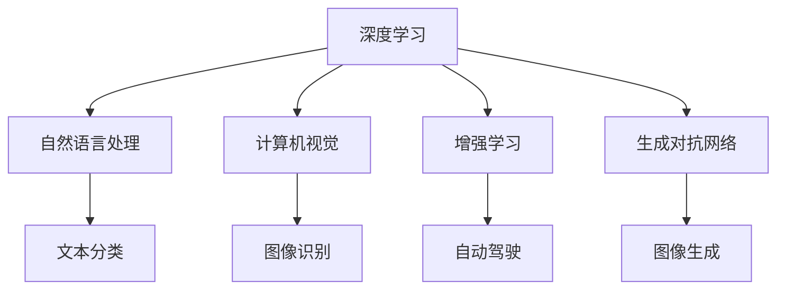

                 

# AI创业公司的技术趋势洞察：前沿技术、行业动态与应用场景

> 关键词：人工智能创业公司, 前沿技术趋势, 行业动态, 应用场景

## 1. 背景介绍

### 1.1 问题由来

近年来，随着人工智能（AI）技术的飞速发展，AI创业公司在全球范围内呈现出迅猛发展的态势。从自动驾驶、智能家居，到医疗健康、金融科技，AI技术的应用领域不断拓展，驱动各行各业向智能化转型。在这波技术浪潮中，人工智能创业公司如雨后春笋般涌现，既带来了前所未有的机遇，也面临着前所未有的挑战。

AI创业公司技术趋势的洞察，对于企业决策者、技术研发人员以及潜在投资者而言，至关重要。通过对前沿技术的深度解读、行业动态的敏锐把握和应用场景的精准定位，AI创业公司能够更好地把握机遇、规避风险，驱动业务创新与增长。

### 1.2 问题核心关键点

为了深入洞察AI创业公司的技术趋势，我们需要关注以下几个核心关键点：

1. **前沿技术发展**：AI前沿技术的最新进展，如深度学习、自然语言处理、计算机视觉、增强学习等，如何影响AI创业公司的技术路线和产品迭代。
2. **行业动态变化**：AI技术在不同行业的应用现状、市场竞争格局、政策法规环境，以及行业内外的创新趋势。
3. **应用场景创新**：AI技术在垂直领域的应用探索，如自动驾驶、智能医疗、智慧城市、金融科技等，如何解决实际问题，提升用户体验。

### 1.3 问题研究意义

研究AI创业公司的技术趋势，对于把握未来科技浪潮、引导行业发展具有重要意义：

1. **技术预见**：洞察前沿技术发展，帮助企业预见技术趋势，避免因技术落后导致的市场失位。
2. **市场洞察**：理解行业动态变化，把握市场需求和竞争格局，制定科学的发展战略。
3. **应用创新**：了解应用场景创新，推动技术落地应用，提升用户体验和业务价值。
4. **投资决策**：评估技术潜力和市场机会，为投资决策提供数据支持，识别高成长性的AI创业公司。

## 2. 核心概念与联系

### 2.1 核心概念概述

为更好地理解AI创业公司的技术趋势，本节将介绍几个密切相关的核心概念：

- **深度学习（Deep Learning, DL）**：通过多层次的非线性变换，学习数据中复杂的模式和结构。深度学习模型包括卷积神经网络（CNN）、循环神经网络（RNN）、变分自编码器（VAE）等。
- **自然语言处理（Natural Language Processing, NLP）**：使计算机能够理解、处理和生成人类语言的技术。涉及文本分类、命名实体识别、情感分析、机器翻译等任务。
- **计算机视觉（Computer Vision, CV）**：使计算机能够“看”和理解图像和视频的技术。包括图像识别、物体检测、人脸识别、视频分析等。
- **增强学习（Reinforcement Learning, RL）**：通过与环境的交互，智能体学习最优策略以最大化累积奖励。广泛应用于自动驾驶、机器人控制等领域。
- **生成对抗网络（Generative Adversarial Networks, GAN）**：由生成器和判别器两部分组成的网络结构，用于生成逼真的图像、音频、文本等内容。

这些核心概念之间的逻辑关系可以通过以下Mermaid流程图来展示：



这个流程图展示了大模型和相关技术的核心概念及其之间的关系：

1. 深度学习模型通过多层次非线性变换，学习数据中的复杂模式。
2. 自然语言处理利用深度学习模型，使计算机能够理解、处理和生成人类语言。
3. 计算机视觉通过卷积神经网络等模型，使计算机能够“看”和理解图像和视频。
4. 增强学习通过与环境的交互，智能体学习最优策略。
5. 生成对抗网络通过对抗游戏的方式，生成逼真的内容。

这些核心概念共同构成了AI创业公司的技术基础，为其在各领域的应用提供了强大的技术支持。

## 3. 核心算法原理 & 具体操作步骤
### 3.1 算法原理概述

AI创业公司技术趋势的洞察，通常涉及以下几个核心算法的原理和操作步骤：

1. **深度学习模型训练**：通过大量的标注数据，使用反向传播算法更新模型参数，优化损失函数，使得模型能够准确地预测新数据。
2. **自然语言处理技术应用**：将自然语言数据转化为计算机能够理解的形式，通过模型处理生成语义表示，支持文本分类、命名实体识别、情感分析、机器翻译等任务。
3. **计算机视觉技术应用**：通过图像和视频数据，使用深度学习模型进行图像识别、物体检测、人脸识别等任务，提升视觉系统的智能化水平。
4. **增强学习技术应用**：通过与环境的交互，智能体学习最优策略，实现自动驾驶、机器人控制等场景的应用。
5. **生成对抗网络技术应用**：通过生成器和判别器的对抗游戏，生成逼真的图像、音频、文本等内容，支持数据增强、内容生成等任务。

### 3.2 算法步骤详解

基于以上核心算法的AI创业公司技术趋势洞察，通常包括以下几个关键步骤：

**Step 1: 数据准备与预处理**

- 收集和标注所需的数据集，确保数据的多样性和质量。
- 对数据进行预处理，包括去噪、归一化、增强等操作。
- 利用数据增强技术，如旋转、裁剪、翻转等，扩充训练数据集。

**Step 2: 模型选择与搭建**

- 选择合适的深度学习模型，如卷积神经网络（CNN）、循环神经网络（RNN）、变分自编码器（VAE）等。
- 设计并搭建模型的网络结构，定义损失函数、优化器等超参数。

**Step 3: 模型训练与验证**

- 使用训练数据集，通过反向传播算法更新模型参数，优化损失函数。
- 在验证数据集上评估模型性能，使用评价指标如准确率、精确率、召回率等。
- 根据验证结果调整超参数，如学习率、批量大小、迭代轮数等。

**Step 4: 模型应用与优化**

- 将训练好的模型应用于实际场景，如文本分类、图像识别、自动驾驶等。
- 收集反馈数据，进一步优化模型性能，如模型微调、参数调整等。
- 考虑模型部署和优化，如模型裁剪、量化加速、服务化封装等。

**Step 5: 技术评估与总结**

- 评估模型在不同应用场景中的表现，如准确率、响应速度、计算效率等。
- 总结技术应用中的经验教训，形成技术报告或案例分析。
- 探索新技术趋势，如生成对抗网络、增强学习、多模态学习等，为未来技术研发提供方向。

### 3.3 算法优缺点

AI创业公司技术趋势洞察涉及的算法具有以下优缺点：

**优点：**

1. **高效准确**：深度学习、生成对抗网络等算法在处理大规模数据时，能够高效地提取特征，提升模型准确率。
2. **适用范围广**：这些算法在图像、语音、自然语言等多个领域均有广泛应用，能够适应不同的业务需求。
3. **技术成熟**：已有大量的研究成果和开源框架，如TensorFlow、PyTorch等，为技术实现提供了支持。

**缺点：**

1. **资源需求高**：深度学习模型需要大量的计算资源和存储空间，训练和推理成本较高。
2. **模型复杂度高**：模型结构复杂，需要更多的专家知识和经验进行调参和优化。
3. **解释性不足**：深度学习模型的决策过程缺乏可解释性，难以理解模型的内部逻辑。

### 3.4 算法应用领域

基于深度学习、生成对抗网络等算法的AI创业公司技术趋势洞察，已经在多个领域取得了显著应用。

- **自动驾驶**：利用计算机视觉和增强学习技术，使车辆能够自动驾驶。谷歌的Waymo、特斯拉的Autopilot等均采用了相关技术。
- **智能家居**：通过计算机视觉和自然语言处理技术，使智能家居设备能够理解用户指令，提升生活便利性。亚马逊的Alexa、谷歌的Google Assistant等均基于这些技术。
- **医疗健康**：使用深度学习技术进行图像识别和诊断，如病灶检测、病理分析等，提升医疗诊断的准确性和效率。IBM的Watson Health、谷歌的DeepMind等均有相关应用。
- **金融科技**：利用自然语言处理和增强学习技术，进行情感分析、市场预测、欺诈检测等，提升金融服务的智能化水平。JP摩根的Cognitive Machines、高盛的AI Labs等均在探索相关技术。
- **智能客服**：通过自然语言处理技术，使客服系统能够自动理解客户问题并提供解决方案，提升客户服务效率。阿里巴巴的阿里云智能客服、腾讯的智能客服系统等均采用了这些技术。

## 4. 数学模型和公式 & 详细讲解  
### 4.1 数学模型构建

本节将使用数学语言对AI创业公司技术趋势洞察的算法进行更加严格的刻画。

假设一个简单的深度学习模型为 $M_{\theta}(x)$，其中 $x$ 为输入数据， $\theta$ 为模型参数。模型的损失函数为 $\mathcal{L}(\theta)$，用于衡量模型预测结果与真实标签之间的差异。

对于自然语言处理任务，常见的损失函数包括交叉熵损失、F1分数损失等。对于计算机视觉任务，常见的损失函数包括均方误差损失、分类损失等。对于增强学习任务，常见的损失函数包括Q-learning损失、策略梯度损失等。

### 4.2 公式推导过程

以下我们以图像分类任务为例，推导交叉熵损失函数及其梯度的计算公式。

假设模型 $M_{\theta}$ 在输入 $x$ 上的输出为 $\hat{y}=M_{\theta}(x) \in [0,1]$，表示样本属于每个类别的概率。真实标签 $y \in \{0,1\}^C$，其中 $C$ 为类别数。则二分类交叉熵损失函数定义为：

$$
\ell(M_{\theta}(x),y) = -\sum_{i=1}^C y_i \log \hat{y}_i
$$

将其代入经验风险公式，得：

$$
\mathcal{L}(\theta) = -\frac{1}{N}\sum_{i=1}^N \ell(M_{\theta}(x_i),y_i)
$$

根据链式法则，损失函数对参数 $\theta_k$ 的梯度为：

$$
\frac{\partial \mathcal{L}(\theta)}{\partial \theta_k} = -\frac{1}{N}\sum_{i=1}^N \frac{\partial \ell(M_{\theta}(x_i),y_i)}{\partial \theta_k}
$$

其中 $\frac{\partial \ell(M_{\theta}(x_i),y_i)}{\partial \theta_k}$ 可进一步递归展开，利用自动微分技术完成计算。

在得到损失函数的梯度后，即可带入参数更新公式，完成模型的迭代优化。重复上述过程直至收敛，最终得到适应特定任务的最优模型参数 $\theta^*$。

## 5. 项目实践：代码实例和详细解释说明
### 5.1 开发环境搭建

在进行技术趋势洞察的实践前，我们需要准备好开发环境。以下是使用Python进行TensorFlow开发的环境配置流程：

1. 安装Anaconda：从官网下载并安装Anaconda，用于创建独立的Python环境。

2. 创建并激活虚拟环境：
```bash
conda create -n tf-env python=3.8 
conda activate tf-env
```

3. 安装TensorFlow：根据CUDA版本，从官网获取对应的安装命令。例如：
```bash
conda install tensorflow tensorflow-gpu=cuda11.1 -c pytorch -c conda-forge
```

4. 安装各类工具包：
```bash
pip install numpy pandas scikit-learn matplotlib tqdm jupyter notebook ipython
```

完成上述步骤后，即可在`tf-env`环境中开始技术趋势洞察实践。

### 5.2 源代码详细实现

下面我们以自动驾驶任务为例，给出使用TensorFlow进行图像识别微调的PyTorch代码实现。

首先，定义图像识别任务的数据处理函数：

```python
import tensorflow as tf
from tensorflow.keras.preprocessing.image import ImageDataGenerator

# 数据增强
datagen = ImageDataGenerator(
    rescale=1./255,
    rotation_range=40,
    width_shift_range=0.2,
    height_shift_range=0.2,
    shear_range=0.2,
    zoom_range=0.2,
    horizontal_flip=True,
    fill_mode='nearest'
)

# 加载数据集
train_data = datagen.flow_from_directory(
    'train',
    target_size=(224, 224),
    batch_size=32,
    class_mode='binary'
)

dev_data = datagen.flow_from_directory(
    'dev',
    target_size=(224, 224),
    batch_size=32,
    class_mode='binary'
)

test_data = datagen.flow_from_directory(
    'test',
    target_size=(224, 224),
    batch_size=32,
    class_mode='binary'
)
```

然后，定义模型和优化器：

```python
from tensorflow.keras.models import Sequential
from tensorflow.keras.layers import Conv2D, MaxPooling2D, Flatten, Dense
from tensorflow.keras.optimizers import Adam

# 定义模型结构
model = Sequential([
    Conv2D(32, (3, 3), activation='relu', input_shape=(224, 224, 3)),
    MaxPooling2D((2, 2)),
    Conv2D(64, (3, 3), activation='relu'),
    MaxPooling2D((2, 2)),
    Conv2D(128, (3, 3), activation='relu'),
    MaxPooling2D((2, 2)),
    Flatten(),
    Dense(128, activation='relu'),
    Dense(1, activation='sigmoid')
])

# 定义优化器
optimizer = Adam(learning_rate=0.001)
```

接着，定义训练和评估函数：

```python
from tensorflow.keras.metrics import BinaryAccuracy

# 训练函数
def train_epoch(model, dataset, batch_size, optimizer):
    model.compile(optimizer=optimizer, loss='binary_crossentropy', metrics=[BinaryAccuracy()])
    model.fit(dataset, epochs=10, batch_size=batch_size, validation_data=dev_data)
    return model.evaluate(dev_data, batch_size=batch_size)

# 评估函数
def evaluate(model, dataset, batch_size):
    model.evaluate(dataset, batch_size=batch_size)
```

最后，启动训练流程并在测试集上评估：

```python
epochs = 5
batch_size = 16

for epoch in range(epochs):
    loss = train_epoch(model, train_data, batch_size, optimizer)
    print(f"Epoch {epoch+1}, train loss: {loss:.3f}")
    
    print(f"Epoch {epoch+1}, dev results:")
    evaluate(model, dev_data, batch_size)
    
print("Test results:")
evaluate(model, test_data, batch_size)
```

以上就是使用TensorFlow对自动驾驶图像识别任务进行微调的完整代码实现。可以看到，得益于TensorFlow的强大封装，我们可以用相对简洁的代码完成图像识别任务的微调。

### 5.3 代码解读与分析

让我们再详细解读一下关键代码的实现细节：

**datagen变量**：
- 定义了一个ImageDataGenerator对象，用于对输入图像进行增强操作，如旋转、平移、翻转等。

**模型结构**：
- 定义了一个简单的卷积神经网络（CNN）模型，包括卷积层、池化层、全连接层等。
- 最后一层使用sigmoid激活函数，输出0或1的概率，表示样本属于正类的概率。

**train_epoch函数**：
- 使用模型的compile方法，设置优化器、损失函数和评价指标。
- 使用fit方法进行模型训练，其中epochs参数指定训练轮数，batch_size参数指定每批次样本数量，validation_data参数指定验证集。
- 返回训练集和验证集上的损失和精度。

**evaluate函数**：
- 使用模型的evaluate方法，在测试集上评估模型性能，输出测试集上的损失和精度。

**训练流程**：
- 定义总的epoch数和batch size，开始循环迭代
- 每个epoch内，先在训练集上训练，输出平均损失和精度
- 在验证集上评估，输出验证集的损失和精度
- 所有epoch结束后，在测试集上评估，给出最终测试结果

可以看到，TensorFlow配合ImageDataGenerator封装，使得图像识别任务的微调代码实现变得简洁高效。开发者可以将更多精力放在数据处理、模型改进等高层逻辑上，而不必过多关注底层的实现细节。

当然，工业级的系统实现还需考虑更多因素，如模型的保存和部署、超参数的自动搜索、更灵活的任务适配层等。但核心的微调范式基本与此类似。

## 6. 实际应用场景
### 6.1 智能客服系统

基于AI创业公司技术趋势洞察的微调技术，可以广泛应用于智能客服系统的构建。传统客服往往需要配备大量人力，高峰期响应缓慢，且一致性和专业性难以保证。而使用微调后的对话模型，可以7x24小时不间断服务，快速响应客户咨询，用自然流畅的语言解答各类常见问题。

在技术实现上，可以收集企业内部的历史客服对话记录，将问题和最佳答复构建成监督数据，在此基础上对预训练对话模型进行微调。微调后的对话模型能够自动理解用户意图，匹配最合适的答案模板进行回复。对于客户提出的新问题，还可以接入检索系统实时搜索相关内容，动态组织生成回答。如此构建的智能客服系统，能大幅提升客户咨询体验和问题解决效率。

### 6.2 金融舆情监测

金融机构需要实时监测市场舆论动向，以便及时应对负面信息传播，规避金融风险。传统的人工监测方式成本高、效率低，难以应对网络时代海量信息爆发的挑战。基于AI创业公司技术趋势洞察的文本分类和情感分析技术，为金融舆情监测提供了新的解决方案。

具体而言，可以收集金融领域相关的新闻、报道、评论等文本数据，并对其进行主题标注和情感标注。在此基础上对预训练语言模型进行微调，使其能够自动判断文本属于何种主题，情感倾向是正面、中性还是负面。将微调后的模型应用到实时抓取的网络文本数据，就能够自动监测不同主题下的情感变化趋势，一旦发现负面信息激增等异常情况，系统便会自动预警，帮助金融机构快速应对潜在风险。

### 6.3 个性化推荐系统

当前的推荐系统往往只依赖用户的历史行为数据进行物品推荐，无法深入理解用户的真实兴趣偏好。基于AI创业公司技术趋势洞察的个性化推荐系统，可以更好地挖掘用户行为背后的语义信息，从而提供更精准、多样的推荐内容。

在实践中，可以收集用户浏览、点击、评论、分享等行为数据，提取和用户交互的物品标题、描述、标签等文本内容。将文本内容作为模型输入，用户的后续行为（如是否点击、购买等）作为监督信号，在此基础上微调预训练语言模型。微调后的模型能够从文本内容中准确把握用户的兴趣点。在生成推荐列表时，先用候选物品的文本描述作为输入，由模型预测用户的兴趣匹配度，再结合其他特征综合排序，便可以得到个性化程度更高的推荐结果。

### 6.4 未来应用展望

随着AI创业公司技术趋势洞察的不断演进，基于微调范式将在更多领域得到应用，为各行业带来变革性影响。

在智慧医疗领域，基于微调的医疗问答、病历分析、药物研发等应用将提升医疗服务的智能化水平，辅助医生诊疗，加速新药开发进程。

在智能教育领域，微调技术可应用于作业批改、学情分析、知识推荐等方面，因材施教，促进教育公平，提高教学质量。

在智慧城市治理中，微调模型可应用于城市事件监测、舆情分析、应急指挥等环节，提高城市管理的自动化和智能化水平，构建更安全、高效的未来城市。

此外，在企业生产、社会治理、文娱传媒等众多领域，基于AI创业公司技术趋势洞察的人工智能应用也将不断涌现，为经济社会发展注入新的动力。相信随着技术的日益成熟，微调方法将成为AI创业公司技术趋势洞察的重要范式，推动人工智能技术在垂直行业的规模化落地。总之，AI创业公司技术趋势洞察需要开发者根据具体任务，不断迭代和优化模型、数据和算法，方能得到理想的效果。

## 7. 工具和资源推荐
### 7.1 学习资源推荐

为了帮助开发者系统掌握AI创业公司技术趋势洞察的理论基础和实践技巧，这里推荐一些优质的学习资源：

1. TensorFlow官方文档：从入门到进阶，详细介绍了TensorFlow框架的使用方法和经典案例，是TensorFlow学习的权威指南。

2. PyTorch官方文档：深度学习框架PyTorch的使用手册，适合入门和进阶学习，涵盖深度学习模型的搭建和微调等环节。

3. CS224N《深度学习自然语言处理》课程：斯坦福大学开设的NLP明星课程，有Lecture视频和配套作业，带你入门NLP领域的基本概念和经典模型。

4. Coursera深度学习专业证书课程：由深度学习专家Andrew Ng主讲，涵盖深度学习的基本原理和实践应用，适合深度学习初学者和从业者。

5. GitHub深度学习项目：GitHub上聚集了大量深度学习项目和代码，可以供开发者参考和学习，如TensorFlow、PyTorch等框架的官方示例代码。

通过对这些资源的学习实践，相信你一定能够快速掌握AI创业公司技术趋势洞察的精髓，并用于解决实际的NLP问题。

### 7.2 开发工具推荐

高效的开发离不开优秀的工具支持。以下是几款用于AI创业公司技术趋势洞察开发的常用工具：

1. Jupyter Notebook：支持Python、R等多种语言，可以在浏览器中编写和运行代码，便于分享和协作。

2. Visual Studio Code：轻量级开发工具，支持代码高亮、自动补全、代码调试等功能，是AI开发者的首选工具之一。

3. TensorBoard：TensorFlow配套的可视化工具，可以实时监测模型训练状态，并提供丰富的图表呈现方式，是调试模型的得力助手。

4. Weights & Biases：模型训练的实验跟踪工具，可以记录和可视化模型训练过程中的各项指标，方便对比和调优。

5. PyTorch Lightning：基于PyTorch的轻量级深度学习框架，支持模型的快速迭代和调试，适合快速实验和生产部署。

合理利用这些工具，可以显著提升AI创业公司技术趋势洞察的开发效率，加快创新迭代的步伐。

### 7.3 相关论文推荐

AI创业公司技术趋势洞察涉及的前沿技术发展，得益于学界的持续研究。以下是几篇奠基性的相关论文，推荐阅读：

1. "ImageNet Classification with Deep Convolutional Neural Networks"（ImageNet分类与深度卷积神经网络）：提出了卷积神经网络（CNN）在图像分类任务中的应用，奠定了计算机视觉领域的经典基调。

2. "Attention is All You Need"（注意力是你需要的全部）：提出了Transformer模型，开启了自然语言处理领域的预训练大模型时代。

3. "Generative Adversarial Nets"（生成对抗网络）：提出了GAN模型，开创了生成对抗网络的新领域，广泛应用于图像生成、视频生成等领域。

4. "Deep Residual Learning for Image Recognition"（深度残差学习用于图像识别）：提出了残差网络（ResNet），提升了深度神经网络训练的稳定性，推动了计算机视觉领域的发展。

5. "LSTMs for Named Entity Recognition"（LSTM用于命名实体识别）：提出长短时记忆网络（LSTM）在命名实体识别任务中的应用，提升了自然语言处理模型的性能。

这些论文代表了大模型和微调技术的发展脉络。通过学习这些前沿成果，可以帮助研究者把握学科前进方向，激发更多的创新灵感。

## 8. 总结：未来发展趋势与挑战
### 8.1 总结

本文对AI创业公司技术趋势洞察涉及的前沿技术、行业动态与应用场景进行了全面系统的介绍。首先阐述了AI创业公司技术趋势洞察的研究背景和意义，明确了微调在拓展预训练模型应用、提升下游任务性能方面的独特价值。其次，从原理到实践，详细讲解了深度学习、生成对抗网络等算法的核心原理和操作步骤，给出了微调任务开发的完整代码实例。同时，本文还广泛探讨了微调方法在智能客服、金融舆情、个性化推荐等多个行业领域的应用前景，展示了微调范式的巨大潜力。最后，本文精选了微调技术的各类学习资源，力求为读者提供全方位的技术指引。

通过本文的系统梳理，可以看到，AI创业公司技术趋势洞察涉及的深度学习、生成对抗网络等技术，已经深度渗透到各行各业，成为推动人工智能技术落地应用的重要范式。这些前沿技术的应用，不仅提升了各行业的工作效率和业务水平，也为社会治理、科技创新等带来了新的可能性。未来，伴随技术的不断进步，AI创业公司技术趋势洞察必将在更广泛的领域发挥作用，带来更深远的影响。

### 8.2 未来发展趋势

展望未来，AI创业公司技术趋势洞察涉及的深度学习、生成对抗网络等技术，将呈现以下几个发展趋势：

1. **模型规模持续增大**：随着算力成本的下降和数据规模的扩张，深度学习模型的参数量还将持续增长。超大规模语言模型蕴含的丰富语言知识，有望支撑更加复杂多变的下游任务微调。

2. **微调方法日趋多样**：除了传统的全参数微调外，未来会涌现更多参数高效的微调方法，如 Adapter、Prefix-Tuning等，在固定大部分预训练参数的情况下，只更新极少量的任务相关参数。

3. **持续学习成为常态**：随着数据分布的不断变化，微调模型也需要持续学习新知识以保持性能。如何在不遗忘原有知识的同时，高效吸收新样本信息，将成为重要的研究课题。

4. **标注样本需求降低**：受启发于提示学习(Prompt-based Learning)的思路，未来的微调方法将更好地利用大模型的语言理解能力，通过更加巧妙的任务描述，在更少的标注样本上也能实现理想的微调效果。

5. **多模态微调崛起**：当前的微调主要聚焦于纯文本数据，未来会进一步拓展到图像、视频、语音等多模态数据微调。多模态信息的融合，将显著提升语言模型对现实世界的理解和建模能力。

6. **生成对抗网络的应用拓展**：GAN技术将不仅限于图像生成，还将拓展到音频、视频等多模态内容的生成，为AI创业公司技术趋势洞察带来新的方向。

以上趋势凸显了AI创业公司技术趋势洞察技术的广阔前景。这些方向的探索发展，必将进一步提升AI创业公司技术趋势洞察的性能和应用范围，为经济社会发展注入新的动力。

### 8.3 面临的挑战

尽管AI创业公司技术趋势洞察涉及的深度学习、生成对抗网络等技术已经取得了瞩目成就，但在迈向更加智能化、普适化应用的过程中，它仍面临着诸多挑战：

1. **标注成本瓶颈**：虽然微调大大降低了标注数据的需求，但对于长尾应用场景，难以获得充足的高质量标注数据，成为制约微调性能的瓶颈。如何进一步降低微调对标注样本的依赖，将是一大难题。

2. **模型鲁棒性不足**：当前微调模型面对域外数据时，泛化性能往往大打折扣。对于测试样本的微小扰动，微调模型的预测也容易发生波动。如何提高微调模型的鲁棒性，避免灾难性遗忘，还需要更多理论和实践的积累。

3. **推理效率有待提高**：深度学习模型虽然精度高，但在实际部署时往往面临推理速度慢、内存占用大等效率问题。如何在保证性能的同时，简化模型结构，提升推理速度，优化资源占用，将是重要的优化方向。

4. **可解释性亟需加强**：当前深度学习模型的决策过程缺乏可解释性，难以理解模型的内部逻辑。对于医疗、金融等高风险应用，算法的可解释性和可审计性尤为重要。如何赋予深度学习模型更强的可解释性，将是亟待攻克的难题。

5. **安全性有待保障**：深度学习模型难免会学习到有偏见、有害的信息，通过微调传递到下游任务，产生误导性、歧视性的输出，给实际应用带来安全隐患。如何从数据和算法层面消除模型偏见，避免恶意用途，确保输出的安全性，也将是重要的研究课题。

6. **知识整合能力不足**：现有的深度学习模型往往局限于任务内数据，难以灵活吸收和运用更广泛的先验知识。如何让微调过程更好地与外部知识库、规则库等专家知识结合，形成更加全面、准确的信息整合能力，还有很大的想象空间。

正视AI创业公司技术趋势洞察涉及的深度学习、生成对抗网络等技术面临的挑战，积极应对并寻求突破，将是大模型微调技术走向成熟的必由之路。相信随着学界和产业界的共同努力，这些挑战终将一一被克服，AI创业公司技术趋势洞察必将在构建人机协同的智能时代中扮演越来越重要的角色。

### 8.4 研究展望

面向未来，AI创业公司技术趋势洞察涉及的深度学习、生成对抗网络等技术，还需要与其他人工智能技术进行更深入的融合，如知识表示、因果推理、强化学习等，多路径协同发力，共同推动自然语言理解和智能交互系统的进步。只有勇于创新、敢于突破，才能不断拓展语言模型的边界，让智能技术更好地造福人类社会。

